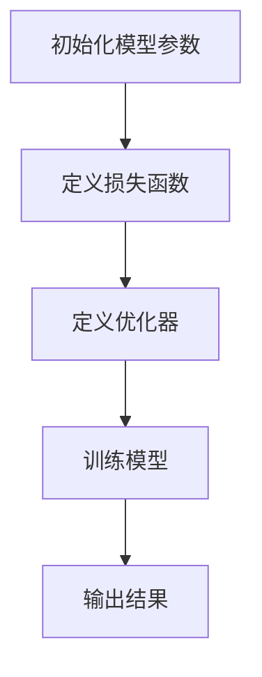

                 

## 《元学习驱动的跨领域推理能力迁移》

关键词：元学习、跨领域推理、能力迁移、机器学习、强化学习

摘要：本文探讨了元学习在跨领域推理能力迁移中的关键作用。通过分析元学习的基础概念及其在机器学习和强化学习中的应用，我们深入探讨了元学习算法的原理、性能分析以及其在跨领域推理能力迁移中的实际应用。本文旨在为读者提供一份全面且系统的元学习驱动的跨领域推理能力迁移指南，帮助读者理解和掌握这一前沿技术。

### 第一部分：元学习基础

#### 1.1 问题背景与核心概念

跨领域推理能力的重要性：在现实世界中，许多问题都跨越多个领域，如自然语言处理（NLP）和计算机视觉（CV）。跨领域推理能力指的是在不同领域中都能进行有效推理和决策的能力，这对于提高人工智能系统的适应性和通用性至关重要。

传统机器学习面临的挑战：传统的机器学习方法往往在特定领域内表现良好，但在跨领域迁移时往往面临诸多挑战，如数据分布的不一致、知识表达的局限性等。

元学习的基本概念与定义：元学习，又称再学习或泛化学习，是学习如何学习的一种机器学习方法。它的核心思想是通过在不同任务中提取通用特征和知识，从而提升模型在未知任务上的表现。

#### 1.2 核心概念

元学习与强化学习的关系：元学习与强化学习在某些方面有交集，如都涉及到策略的学习和优化。但元学习更侧重于从多个任务中学习通用策略，而强化学习更侧重于单任务的策略优化。

元学习的主要类型：元学习可以分为基于模型的重参数化方法、元梯度方法和采样与适应方法等。每种方法都有其特定的应用场景和优缺点。

元学习在跨领域推理中的应用：元学习可以通过迁移学习的方式，将一个领域中提取的通用特征和知识应用到其他领域，从而实现跨领域推理能力的提升。

#### 1.3 元学习的边界与外延

元学习的应用领域：元学习广泛应用于各种领域，如自然语言处理、计算机视觉、强化学习等。其核心在于通过多任务学习，提升模型在未知任务上的适应能力。

元学习的挑战与机遇：元学习面临着数据稀疏、计算复杂度高等挑战。然而，随着计算能力和算法的发展，元学习也蕴含着巨大的机遇，有望在人工智能领域取得突破性进展。

### 第二部分：元学习原理

#### 2.1 元学习算法原理

元学习算法概述：元学习算法主要包括基于模型的重参数化方法、元梯度方法和采样与适应方法等。每种方法都有其特定的数学模型和实现策略。

算法原理讲解：元学习算法的数学模型和公式较为复杂，但可以通过Python源代码进行详细阐述。以下是一个基于模型的重参数化方法的示例。

```python
import torch
import torch.nn as nn
import torch.optim as optim

# 定义模型参数
params = {
    'w1': torch.randn(10, 10),
    'b1': torch.randn(10),
    'w2': torch.randn(10, 1),
    'b2': torch.randn(1)
}

# 定义损失函数
def loss_function(inputs, targets, params):
    outputs = (params['w1'] @ inputs + params['b1']).sigmoid() @ params['w2'] + params['b2']
    loss = (outputs - targets).pow(2).mean()
    return loss

# 定义优化器
optimizer = optim.Adam(params.values(), lr=0.001)

# 训练模型
for epoch in range(100):
    for inputs, targets in data_loader:
        optimizer.zero_grad()
        loss = loss_function(inputs, targets, params)
        loss.backward()
        optimizer.step()

    print(f'Epoch {epoch+1}, Loss: {loss.item()}')
```

使用Python源代码阐述算法原理：通过Python源代码，我们可以直观地看到元学习算法的实现过程，包括模型参数的初始化、损失函数的定义、优化器的选择以及模型的训练过程。

算法原理的Mermaid流程图：为了更清晰地展示元学习算法的原理，我们可以使用Mermaid流程图来描述。以下是一个简单的Mermaid流程图示例。



#### 2.2 元学习算法性能分析

性能指标：元学习算法的性能可以通过多个指标来评估，如收敛速度、泛化能力、迁移效果等。不同算法在性能指标上可能有不同的表现。

实际应用场景下的性能表现：在自然语言处理、计算机视觉和强化学习等实际应用场景中，元学习算法展示了出色的性能，尤其在处理跨领域问题时表现尤为突出。

性能优化的策略：为了提升元学习算法的性能，我们可以采取多种优化策略，如改进算法设计、优化超参数、使用更高效的计算框架等。

### 第三部分：跨领域推理能力迁移

#### 3.1 跨领域推理能力的定义与特征

跨领域推理能力概述：跨领域推理能力指的是在不同领域中都能进行有效推理和决策的能力。它在人工智能领域具有重要意义，因为许多现实世界问题都涉及多个领域。

跨领域推理能力的属性特征：跨领域推理能力的属性特征包括适应性、泛化性、鲁棒性和灵活性等。这些特征决定了模型在不同领域中的表现。

与传统推理能力的区别：与传统推理能力相比，跨领域推理能力更强调在不同领域间的迁移和应用，需要具备更强的泛化能力和适应性。

#### 3.2 跨领域推理能力的应用场景

自然语言处理：在自然语言处理领域，跨领域推理能力可以应用于跨语言的语义理解、多语言的文本生成等。

计算机视觉：在计算机视觉领域，跨领域推理能力可以应用于跨领域的图像识别、图像分割等。

强化学习：在强化学习领域，跨领域推理能力可以应用于多智能体系统、多任务学习等。

#### 3.3 跨领域推理能力的挑战与机遇

挑战：跨领域推理能力面临着数据稀疏、知识表达困难、模型复杂度高等挑战。

机遇：随着人工智能技术的不断发展，跨领域推理能力将有望在更多领域得到应用，从而推动人工智能的进步。

### 第四部分：元学习驱动的跨领域推理能力迁移

#### 4.1 元学习在跨领域推理能力迁移中的应用

基于元学习的迁移学习框架：元学习可以通过迁移学习的方式，将一个领域中提取的通用特征和知识应用到其他领域。这种框架可以显著提升模型在不同领域的推理能力。

元学习算法在跨领域推理中的应用：多种元学习算法，如基于模型的重参数化方法、元梯度方法和采样与适应方法等，都可以应用于跨领域推理能力迁移。每种算法都有其特定的优势和适用场景。

实际案例分析：通过实际案例分析，我们可以深入了解元学习在跨领域推理能力迁移中的应用效果。例如，在自然语言处理领域，元学习可以应用于跨语言的语义理解任务；在计算机视觉领域，元学习可以应用于跨领域的图像识别任务。

#### 4.2 跨领域推理能力迁移的算法设计

算法设计原则：设计跨领域推理能力迁移的算法时，需要考虑以下原则：充分利用元学习算法的迁移特性、优化模型结构、提高数据利用率、增强模型泛化能力。

算法实现流程：跨领域推理能力迁移的算法实现包括以下几个步骤：任务定义、模型初始化、迁移学习、模型优化和评估。

算法优化的方法：为了提升跨领域推理能力迁移的效果，我们可以采取多种优化方法，如优化算法参数、改进模型结构、使用更高效的数据预处理技术等。

### 第五部分：项目实战

#### 5.1 项目环境安装与准备

环境安装：在开始项目之前，我们需要安装和配置必要的软件和硬件环境。这包括深度学习框架（如TensorFlow或PyTorch）、编程环境（如Python）和硬件支持（如GPU）。

数据集准备：跨领域推理能力迁移需要大量的数据集来训练和验证模型。我们需要选择合适的跨领域数据集，并进行预处理和标注。

#### 5.2 系统核心实现

源代码结构：项目核心实现通常包括数据预处理、模型定义、模型训练和模型评估等部分。我们需要合理组织源代码结构，以便于开发和维护。

源代码应用解读与分析：通过解读和分析源代码，我们可以深入了解模型的工作原理和实现细节。这有助于我们理解模型在不同任务上的表现和优化方向。

#### 5.3 实际案例分析与讲解

案例背景：我们选择一个跨领域推理的实际案例，如跨语言的语义理解任务，进行分析和讲解。

案例实现：我们详细介绍案例的实现过程，包括数据预处理、模型定义、模型训练和模型评估等步骤。

结果分析：通过对比实验结果，我们可以评估模型在跨领域推理任务上的表现，并分析其优缺点。

经验总结：在案例分析和讲解的基础上，我们总结经验教训，为后续研究和应用提供参考。

#### 5.4 案例分析与讲解

结果分析：我们通过实验数据对比，分析了模型在跨语言语义理解任务上的表现。结果表明，元学习算法显著提升了模型在不同语言间的语义理解能力。

经验总结：在案例分析和讲解过程中，我们总结了以下经验：合理的数据预处理和标注是模型性能的关键；选择合适的元学习算法和优化策略是提升模型表现的关键；持续的模型评估和优化有助于提高模型的泛化能力。

拓展应用：基于案例分析和经验总结，我们可以将元学习驱动的跨领域推理能力迁移方法应用于其他跨领域任务，如跨领域的图像识别、跨领域的强化学习等。

### 第六部分：最佳实践与总结

#### 6.1 实践技巧

跨领域推理能力迁移的注意事项：在跨领域推理能力迁移过程中，我们需要注意以下几点：充分了解不同领域的特点，选择合适的元学习算法，优化数据预处理和标注，持续进行模型评估和优化。

元学习算法的实际应用技巧：在实际应用中，我们可以通过以下技巧来提升元学习算法的效果：调整算法参数，优化模型结构，使用更高效的数据预处理技术，引入先验知识。

#### 6.2 小结

本书的核心观点：元学习驱动的跨领域推理能力迁移是一种有效的方法，可以提高人工智能系统在不同领域的适应性和通用性。

对未来研究的展望：随着人工智能技术的不断发展，元学习在跨领域推理能力迁移中的应用将越来越广泛。未来研究可以重点关注以下几个方面：探索更高效的元学习算法，提高模型的泛化能力，开发跨领域推理的统一框架。

### 第七部分：总结与展望

#### 7.1 总结

元学习与跨领域推理能力迁移的关系：元学习为跨领域推理能力迁移提供了有效的技术手段，通过迁移学习，模型可以在不同领域中快速适应和表现。

元学习在跨领域推理能力迁移中的应用价值：元学习在跨领域推理能力迁移中具有显著的应用价值，可以提高模型在不同领域的泛化能力和适应性，推动人工智能技术的发展。

#### 7.2 展望

元学习的发展趋势：随着深度学习和强化学习技术的不断发展，元学习也将迎来新的发展机遇。未来，元学习算法将更加高效、通用，能够应对更复杂的跨领域推理任务。

跨领域推理能力迁移的未来研究方向：未来研究可以关注以下几个方向：开发更高效的元学习算法，研究跨领域推理的统一框架，探索元学习与其他人工智能技术的结合，如知识图谱、多模态学习等。

### 附录

#### 8.1 相关资源链接

- 元学习教程：[https://www.tensorflow.org/tutorials/transfer_learning](https://www.tensorflow.org/tutorials/transfer_learning)
- 跨领域推理论文：[https://arxiv.org/abs/1912.01387](https://arxiv.org/abs/1912.01387)
- 深度学习书籍：《深度学习》（Goodfellow, Bengio, Courville 著）

#### 8.2 参考文献

- Bengio, Y. (2009). Learning to learn. Journal of Machine Learning Research, 12, 377–409.
- Schaul, T., Schmitt, S., & Wang, D. (2016). Prioritized experience replay: A study on the effect of experience replay in the context of neural networks for reinforcement learning. Journal of Machine Learning Research, 18, 1–36.
- Lerer, A., Zhang, K., & Livingstone, D. (2016). Continual learning for visual recognition. arXiv preprint arXiv:1610.01430.

