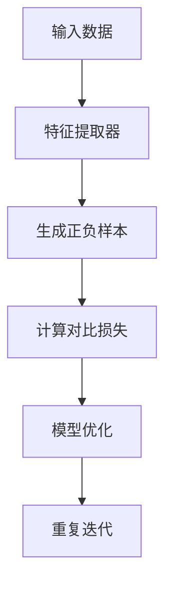
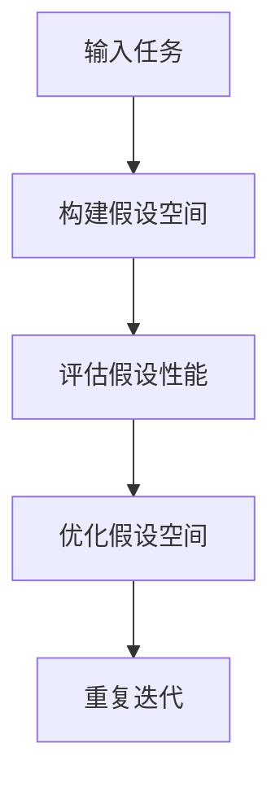
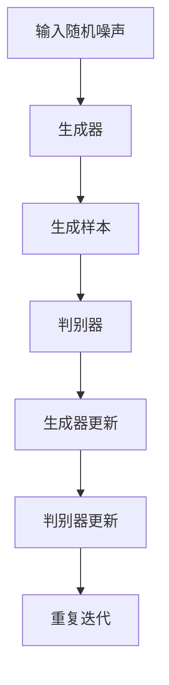
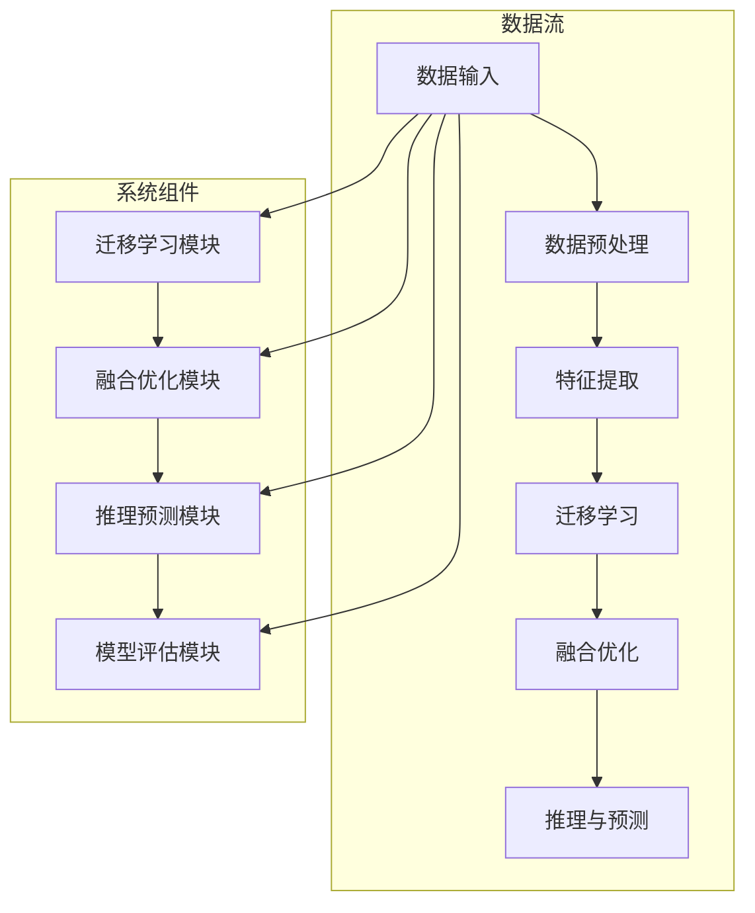
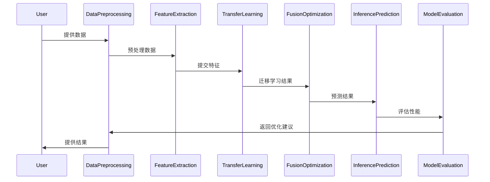

                 


### 引言：技术与挑战

在当今快速发展的信息技术时代，人工智能（AI）和机器学习（ML）的应用已经深入到众多领域，从图像识别、自然语言处理到推荐系统，AI技术无处不在。然而，随着AI应用范围的扩大，一个新的挑战也随之而来——如何在不同的领域中实现高效的推理能力迁移与融合优化。

传统的机器学习方法往往针对特定的领域进行训练，导致模型在新的领域中的表现不佳。这种问题被称为“领域不敏感”（domain insensitivity），它限制了AI系统的通用性和实用性。为了解决这一问题，研究人员开始探索新的方法，如元学习（meta-learning）。

元学习，又称为“学习如何学习”，旨在通过快速适应新任务来提高学习效率。它通过在一个元学习框架内学习到通用学习策略，从而在不同领域间实现知识迁移。跨领域推理（cross-domain reasoning）则是在不同领域中应用这些通用策略的能力，它使得AI系统能够在新的领域中快速适应并有效推理。

然而，跨领域推理面临着一系列挑战，包括领域差异、数据分布不均、模型泛化能力不足等。为了应对这些挑战，研究人员提出了多种融合优化技术，这些技术通过结合不同领域的知识和数据来提高模型的泛化能力。

本文将围绕《元学习驱动的跨领域推理能力迁移与融合优化技术》这一主题，逐步探讨以下几个关键问题：

1. **什么是元学习？**
   - 定义和核心概念
   - 元学习与传统机器学习的区别
   - 元学习的应用场景

2. **什么是跨领域推理？**
   - 定义和核心概念
   - 跨领域推理的关键挑战
   - 跨领域推理的应用领域

3. **什么是迁移学习与融合优化？**
   - 迁移学习的原理与类型
   - 融合优化的方法与策略
   - 跨领域推理中的迁移学习与融合优化

4. **元学习驱动的跨领域推理算法**
   - 对比学习、假设学习和生成对抗网络的原理与实现
   - 基于元学习的跨领域推理算法

5. **系统架构设计与实现**
   - 跨领域推理应用场景与需求分析
   - 领域模型设计、系统架构设计、接口设计与交互流程

6. **项目实战**
   - 实际案例展示与解析
   - 系统核心实现与代码解读

7. **最佳实践与总结**
   - 迁移学习与融合优化的技巧与注意事项
   - 技术发展趋势展望
   - 注意事项与拓展阅读

通过逐步分析这些关键问题，本文旨在为读者提供一个全面且深入的理解，帮助他们在实际应用中有效地利用元学习技术来提升跨领域推理能力。

### 元学习概述

#### 定义与核心概念

元学习，又称“学习如何学习”，是一种通过优化学习算法以提高学习效率的技术。它不同于传统的机器学习方法，后者通常针对具体任务进行特定训练。元学习则通过学习到一系列通用学习策略，使得算法能够快速适应新任务，从而提高整体的泛化能力。

在元学习的框架下，学习过程被分为两个层次：基础学习和元学习。基础学习是指算法在特定任务上学习的过程，而元学习则是在多个基础学习任务上优化学习策略的过程。这种分层学习结构使得元学习算法能够从多个任务中提取通用知识，并将其应用于新任务中。

元学习的核心概念包括元模型（meta-model）、元优化（meta-optimization）和元评估（meta-evaluation）。元模型是指用于表示学习策略的模型，它可以是一个函数、网络结构或者参数调整规则。元优化是指通过调整元模型来优化学习过程，以达到更高的学习效率。元评估则是对学习策略进行评估和调整的过程，以确保算法能够在新的任务中有效工作。

#### 应用场景

元学习在多个领域都有广泛的应用，以下是其中几个典型的应用场景：

1. **强化学习**：在强化学习（Reinforcement Learning, RL）中，元学习可以帮助算法快速适应新的环境。例如，在游戏AI中，元学习算法可以通过学习在不同游戏中的通用策略，从而在新的游戏环境中迅速找到最优解。

2. **自然语言处理**：在自然语言处理（Natural Language Processing, NLP）领域，元学习可以用于快速适应不同的语言和文本数据。例如，在一个新的语言上训练模型时，元学习算法可以通过学习到通用语言模式，从而提高模型的适应能力和准确性。

3. **计算机视觉**：在计算机视觉（Computer Vision, CV）领域，元学习可以用于跨领域图像识别。例如，一个在猫和狗图像上训练的元学习算法，可以迁移到汽车和飞机图像上，从而在新的领域中实现高效的推理能力。

4. **迁移学习**：元学习在迁移学习（Transfer Learning）中也发挥了重要作用。通过在多个源任务上训练元模型，元学习算法可以提取通用特征表示，从而在目标任务上实现更好的泛化能力。

#### 元学习与传统机器学习的区别

传统机器学习主要关注在特定数据集上训练模型，以期望模型能够在该数据集上获得较高的准确率。然而，这种方法在面对新的任务或领域时，往往需要重新训练模型，导致学习效率低下。

相比之下，元学习则通过学习到一系列通用学习策略，使得算法能够快速适应新任务或领域。这种差异主要体现在以下几个方面：

1. **学习目标**：传统机器学习的目标是优化模型在特定数据集上的性能，而元学习的目标是优化学习过程本身，以提高整体学习效率。

2. **学习方式**：传统机器学习依赖于对特定数据集的单独训练，而元学习则通过跨任务学习来提取通用策略。

3. **适应能力**：传统机器学习模型在新的任务或领域上表现不佳，而元学习算法则能够快速适应新环境，提高模型的泛化能力。

4. **计算复杂度**：传统机器学习往往需要大量数据和计算资源，而元学习通过减少重复训练，可以显著降低计算复杂度。

总的来说，元学习通过引入新的学习框架，为解决传统机器学习中的领域不敏感问题提供了一种有效的途径。

### 跨领域推理简介

#### 定义与核心概念

跨领域推理（Cross-Domain Reasoning）是一种在多个不同领域间进行推理的技术。其核心思想是通过在不同领域间共享知识，提高模型在未知领域的推理能力。具体来说，跨领域推理旨在利用已知的领域知识和数据，来推断未知领域中的问题解决方案。

跨领域推理的定义可以概括为：在一个或多个已知领域（源领域）中学习到的模型，能够迁移和适应到新的领域（目标领域）中，从而在新领域中实现有效的推理。这种能力使得AI系统不仅能够在特定领域内工作，还能够跨领域应用，提高其通用性和实用性。

核心概念包括：

1. **领域差异**：领域差异是指不同领域在任务目标、数据分布、知识结构等方面的差异。跨领域推理需要处理这些差异，以实现有效的知识迁移。

2. **迁移学习**：迁移学习是一种将已知领域（源领域）中的知识应用到新领域（目标领域）的技术。它通过共享通用特征表示，提高模型在新领域中的泛化能力。

3. **融合优化**：融合优化是指通过结合多个领域的知识和数据，来提高模型的泛化性能。它包括特征融合、模型融合和数据融合等多种策略。

#### 关键挑战

跨领域推理虽然在理论上具有很大的优势，但在实际应用中面临着一系列关键挑战：

1. **数据分布不均**：不同领域的数据分布往往存在显著差异，这可能导致模型在某个领域上过拟合，而在另一个领域上表现不佳。

2. **领域依赖性**：某些任务在特定领域中具有明显的领域依赖性，这使得知识在不同领域间的迁移变得困难。

3. **数据稀缺**：某些领域的数据量可能非常有限，这限制了模型的学习能力，导致跨领域推理的效果不佳。

4. **知识共享**：如何有效地在不同领域间共享知识，是一个关键问题。知识共享策略需要能够适应不同的领域特性，以实现最优的效果。

#### 应用领域

跨领域推理在多个领域都有广泛的应用，以下是其中几个典型的应用领域：

1. **医疗健康**：在医疗领域，跨领域推理可以帮助医生在不同疾病之间进行诊断和治疗方案推荐。例如，通过学习一个癌症诊断模型，可以迁移到其他类型的癌症诊断中。

2. **金融科技**：在金融领域，跨领域推理可以用于风险管理、信用评估和投资策略优化。例如，通过学习一个市场预测模型，可以迁移到其他市场的预测中。

3. **计算机视觉**：在计算机视觉领域，跨领域推理可以用于跨类别图像识别、图像生成和图像增强。例如，通过学习一个动物识别模型，可以迁移到植物识别中。

4. **自然语言处理**：在自然语言处理领域，跨领域推理可以用于跨语言文本分类、机器翻译和多模态交互。例如，通过学习一个英语文本分类模型，可以迁移到其他语言的文本分类中。

总的来说，跨领域推理通过在不同领域间共享知识，为AI系统提供了强大的适应能力和泛化能力。尽管面临诸多挑战，但随着技术的不断发展，跨领域推理的应用前景将越来越广阔。

### 迁移学习与融合优化

#### 原理与类型

迁移学习（Transfer Learning）是一种通过利用已知领域的知识来提高新领域学习效果的方法。其核心思想是将已有模型（通常是预训练模型）中的有用特征表示迁移到新任务中，从而加速新任务的学习过程和提高泛化能力。

迁移学习的原理可以概括为以下几点：

1. **共享特征表示**：迁移学习通过在源领域和新领域间共享特征表示，来降低新任务的复杂性。预训练模型通常在大量通用数据上训练，提取到一组通用的特征表示，这些特征对新任务具有很好的泛化能力。

2. **适应调整**：迁移学习不仅包括共享特征表示，还包括在新任务上进行微调（fine-tuning），以适应新任务的具体需求。微调过程通常涉及对预训练模型的一部分参数进行调整，以适应新任务的特征分布。

3. **迁移增益**：迁移学习通过减少对新任务的数据需求，降低了数据收集和标注的成本，同时提高了模型在新任务上的性能。

根据迁移策略的不同，迁移学习可以分为以下几种类型：

1. **特征迁移**：特征迁移是指将预训练模型中的特征提取器直接应用于新任务。这种方法主要关注特征表示的共享，而忽略了模型的其余部分。

2. **模型迁移**：模型迁移是指将整个预训练模型直接应用于新任务，包括特征提取器和分类器。这种方法在迁移性能上通常优于特征迁移，但需要对新任务进行额外的微调。

3. **权重共享**：权重共享是指在新任务中重新初始化模型参数，但与预训练模型保持一定的相似性。这种方法旨在保留预训练模型中的知识，同时适应新任务。

#### 融合优化的方法与策略

融合优化（Fusion Optimization）是一种通过结合多个领域的知识和数据来提高模型泛化能力的方法。在跨领域推理中，融合优化技术能够有效地解决数据分布不均和领域依赖性问题。

融合优化的核心思想是利用不同领域的数据和知识，来提升模型在目标领域上的性能。以下是一些常见的融合优化方法：

1. **特征融合**：特征融合是指将来自不同领域的特征进行整合，以形成一个统一的特征表示。常见的特征融合方法包括均值融合、加权融合和深度融合。

2. **模型融合**：模型融合是指将多个模型的结果进行整合，以获得更准确和稳定的预测。常见的模型融合方法包括投票法、加权平均和深度集成。

3. **数据增强**：数据增强是通过生成模拟的新数据来增加模型的训练样本，从而提高模型的泛化能力。常见的数据增强方法包括数据变换、数据合成和数据扩充。

4. **联合训练**：联合训练是指同时训练多个领域上的模型，并通过共享参数和优化目标来提高模型在各个领域的性能。这种方法可以有效解决领域差异和数据稀缺问题。

5. **领域自适应**：领域自适应（Domain Adaptation）是指将源领域的知识迁移到目标领域，以减少领域差异的影响。常见的领域自适应方法包括一致性正则化、领域解码器和自编码器。

#### 跨领域推理中的迁移学习与融合优化

在跨领域推理中，迁移学习和融合优化技术相辅相成，共同提高模型的泛化能力和推理性能。以下是一些应用实例：

1. **医疗诊断**：在医疗领域，迁移学习可以将一个在某一疾病上训练的模型迁移到其他相关疾病上。融合优化可以通过结合多个医学领域的知识和数据，提高诊断的准确性和可靠性。

2. **金融风控**：在金融领域，迁移学习可以将一个在某一市场表现良好的模型迁移到其他相关市场中。融合优化可以通过结合多个市场的数据和策略，提高风险管理的效率。

3. **自然语言处理**：在自然语言处理领域，迁移学习可以将一个在某一语言上训练的模型迁移到其他相关语言上。融合优化可以通过结合多个语言的语料库和知识，提高翻译和文本分类的准确性。

4. **计算机视觉**：在计算机视觉领域，迁移学习可以将一个在某一类别上训练的模型迁移到其他相关类别上。融合优化可以通过结合多个类别中的图像和标注数据，提高图像识别和目标检测的准确性。

总之，迁移学习和融合优化技术在跨领域推理中发挥着重要作用。通过有效利用这些技术，可以显著提高AI系统的适应能力和泛化性能，从而实现更广泛的应用。

### 元学习驱动的跨领域推理算法

在元学习驱动的跨领域推理算法中，我们主要关注几种核心的算法，包括对比学习、假设学习和生成对抗网络。这些算法通过不同的机制和原理，实现了在不同领域间的有效推理能力迁移。

#### 对比学习

对比学习（Contrastive Learning）是一种通过优化对比损失函数来学习有用特征表示的方法。其基本思想是通过对正样本和负样本进行对比，使得模型能够区分出有用的特征，从而在新的任务中实现快速适应。

对比学习的流程通常包括以下几个步骤：

1. **特征提取**：首先，从输入数据中提取特征表示。常用的方法包括基于深度神经网络的特征提取器，如卷积神经网络（CNN）。

2. **对比样本生成**：对于每个输入样本，生成一组对比样本。正样本是与输入样本相关的样本，而负样本是与输入样本不相关的样本。

3. **对比损失计算**：计算正样本和负样本之间的对比损失。常用的对比损失函数包括信息性损失（Information Loss）和余弦相似度损失（Cosine Similarity Loss）。

4. **模型优化**：通过优化对比损失函数，更新模型参数，使得模型能够更好地学习到有用的特征表示。

对比学习的优点包括：

- **通用性强**：对比学习不依赖于特定的任务和数据集，因此具有很好的通用性。
- **适应性高**：通过对比损失函数，模型能够自动学习到对任务有用的特征，从而在新任务中快速适应。

然而，对比学习的缺点包括：

- **计算复杂度高**：对比学习需要生成大量的对比样本，计算复杂度较高。
- **对噪声敏感**：对比学习容易受到噪声数据的影响，从而降低模型的泛化性能。

在实际应用中，对比学习在图像识别、文本分类和语音识别等领域都取得了显著的效果。例如，在图像识别任务中，通过对比学习，模型可以在多个数据集上实现高效的迁移。

#### 假设学习

假设学习（Hypothesis Learning）是一种通过构建和优化假设空间来学习通用策略的方法。其基本思想是首先构建一组假设，然后通过优化这些假设，使得模型能够快速适应新任务。

假设学习的流程通常包括以下几个步骤：

1. **假设空间构建**：构建一组可能的假设。这些假设可以是简单的规则，也可以是复杂的函数。

2. **假设评估**：评估每个假设在特定任务上的性能。常用的评估方法包括验证集评估和交叉验证。

3. **假设优化**：通过优化假设空间，使得模型能够更好地适应新任务。优化的方法包括梯度下降、随机搜索和进化算法等。

假设学习的优点包括：

- **灵活性高**：假设学习可以根据任务的具体需求，灵活调整假设空间。
- **适用性强**：假设学习适用于多种类型的任务和数据集，具有很强的适应性。

然而，假设学习的缺点包括：

- **计算复杂度高**：假设学习需要评估大量的假设，计算复杂度较高。
- **假设空间过拟合**：如果假设空间过于复杂，模型可能出现过拟合，导致在新任务上的性能下降。

在实际应用中，假设学习在强化学习、决策支持和机器翻译等领域取得了显著的效果。例如，在强化学习任务中，通过假设学习，模型可以在不同的环境中快速找到最优策略。

#### 生成对抗网络

生成对抗网络（Generative Adversarial Network, GAN）是一种通过两个神经网络相互对抗来生成数据的方法。其基本思想是生成器（Generator）试图生成与真实数据分布相近的样本，而判别器（Discriminator）则试图区分真实数据和生成数据。

GAN的流程通常包括以下几个步骤：

1. **生成器与判别器初始化**：初始化生成器和判别器的参数。

2. **生成器训练**：生成器通过生成与真实数据分布相近的样本来对抗判别器。

3. **判别器训练**：判别器通过区分真实数据和生成数据来对抗生成器。

4. **迭代优化**：通过交替优化生成器和判别器的参数，使得生成器的生成样本越来越接近真实数据。

GAN的优点包括：

- **数据生成能力强**：GAN可以生成高质量的数据，从而在数据稀缺的任务中发挥作用。
- **应用范围广**：GAN在图像生成、文本生成和音频生成等领域都取得了显著的效果。

然而，GAN的缺点包括：

- **训练不稳定**：GAN的训练过程容易陷入局部最小值，导致训练不稳定。
- **计算资源需求高**：GAN的训练过程需要大量的计算资源。

在实际应用中，GAN在图像生成、视频生成和虚拟现实等领域取得了显著的效果。例如，在图像生成任务中，通过GAN，模型可以生成与真实图像高度相似的新图像。

总的来说，对比学习、假设学习和生成对抗网络是元学习驱动的跨领域推理中的几种重要算法。这些算法通过不同的原理和机制，实现了在不同领域间的有效推理能力迁移。尽管这些算法各有优缺点，但它们在多个领域中都取得了显著的效果，为跨领域推理提供了强大的技术支持。

### 算法原理讲解

在本节中，我们将详细讲解三种核心算法：对比学习、假设学习和生成对抗网络（GAN）的原理。通过Mermaid流程图和Python源代码，我们将更加直观地理解这些算法的实现过程和数学模型。

#### 对比学习算法的原理与流程图

对比学习是一种通过优化对比损失函数来学习通用特征表示的方法。其核心思想是通过对比正样本和负样本，使得模型能够学习到对任务有用的特征。

1. **流程图**：



2. **Python源代码示例**：

```python
import torch
import torch.nn as nn
import torch.optim as optim

# 假设定义了特征提取器、生成器、判别器等
class ContrastiveLearningModel(nn.Module):
    def __init__(self):
        super(ContrastiveLearningModel, self).__init__()
        self.encoder = nn.Sequential(nn.Linear(input_dim, hidden_dim),
                                     nn.ReLU(),
                                     nn.Linear(hidden_dim, embedding_dim))
        
    def forward(self, x):
        return self.encoder(x)

# 定义对比损失函数
def contrastive_loss(pos_embeddings, neg_embeddings, margin):
    pos_loss = nn.ReLU(margin - (pos_embeddings.unsqueeze(1) - neg_embeddings). squeeze(1)).mean()
    neg_loss = nn.ReLU(margin - (neg_embeddings.unsqueeze(1) - pos_embeddings).squeeze(1)).mean()
    return pos_loss + neg_loss

# 初始化模型、优化器、损失函数
model = ContrastiveLearningModel()
optimizer = optim.Adam(model.parameters(), lr=learning_rate)
criterion = contrastive_loss

# 训练过程
for epoch in range(num_epochs):
    for batch in data_loader:
        inputs, labels = batch
        optimizer.zero_grad()
        embeddings = model(inputs)
        pos_embeddings = embeddings[torch.arange(len(embeddings)), labels]
        neg_embeddings = embeddings[torch.arange(len(embeddings)), ~labels]
        loss = contrastive_loss(pos_embeddings, neg_embeddings, margin)
        loss.backward()
        optimizer.step()
```

3. **数学模型和公式**：

$$
L_{\text{contrastive}} = L_{\text{pos}} + L_{\text{neg}}
$$

其中，$L_{\text{pos}}$ 和 $L_{\text{neg}}$ 分别是正样本和负样本的对比损失，可以表示为：

$$
L_{\text{pos}} = \max(0, \Delta + \text{margin})
$$

$$
L_{\text{neg}} = \max(0, \Delta + \text{margin})
$$

$\Delta$ 表示两个嵌入向量之间的距离。

通过上述流程图、源代码和数学模型，我们可以清晰地看到对比学习算法的实现过程和核心原理。

#### 假设学习算法的数学模型与公式

假设学习是一种通过构建和优化假设空间来学习通用策略的方法。其核心思想是通过评估和优化一组假设，使得模型能够在新任务中快速适应。

1. **流程图**：



2. **Python源代码示例**：

```python
import numpy as np
import torch
import torch.optim as optim

# 假设空间定义
class HypothesisSpace(nn.Module):
    def __init__(self, input_dim, hidden_dim, output_dim):
        super(HypothesisSpace, self).__init__()
        self.fc1 = nn.Linear(input_dim, hidden_dim)
        self.fc2 = nn.Linear(hidden_dim, output_dim)
        
    def forward(self, x):
        x = torch.relu(self.fc1(x))
        return self.fc2(x)

# 定义假设空间和损失函数
hypothesis_space = HypothesisSpace(input_dim, hidden_dim, output_dim)
criterion = nn.CrossEntropyLoss()

# 初始化优化器
optimizer = optim.Adam(hypothesis_space.parameters(), lr=learning_rate)

# 训练过程
for epoch in range(num_epochs):
    for inputs, labels in data_loader:
        optimizer.zero_grad()
        outputs = hypothesis_space(inputs)
        loss = criterion(outputs, labels)
        loss.backward()
        optimizer.step()
```

3. **数学模型和公式**：

假设空间可以表示为一个函数 $h(x)$，其中 $x$ 是输入数据，$h(x)$ 是输出的假设。优化目标是最小化损失函数：

$$
L = \sum_{i} \ell(y_i, h(x_i))
$$

其中，$\ell$ 是损失函数，$y_i$ 是真实标签，$h(x_i)$ 是模型输出的假设。

通过上述流程图、源代码和数学模型，我们可以深入了解假设学习算法的实现过程和核心原理。

#### 生成对抗网络（GAN）算法的实现与应用

生成对抗网络（GAN）是一种通过两个神经网络相互对抗来生成数据的方法。生成器（Generator）试图生成与真实数据分布相近的样本，而判别器（Discriminator）则试图区分真实数据和生成数据。

1. **流程图**：



2. **Python源代码示例**：

```python
import torch
import torch.nn as nn
import torch.optim as optim

# 定义生成器和判别器
class Generator(nn.Module):
    def __init__(self, z_dim, gen_dim):
        super(Generator, self).__init__()
        self.model = nn.Sequential(nn.Linear(z_dim, gen_dim),
                                   nn.LeakyReLU(0.2),
                                   nn.ConvTranspose2d(gen_dim, 1, 4, 1),
                                   nn.Tanh())

    def forward(self, x):
        return self.model(x)

class Discriminator(nn.Module):
    def __init__(self, img_dim):
        super(Discriminator, self).__init__()
        self.model = nn.Sequential(nn.Conv2d(1, 16, 3, 1, 1),
                                   nn.LeakyReLU(0.2),
                                   nn.Conv2d(16, 32, 3, 2, 1),
                                   nn.LeakyReLU(0.2),
                                   nn.Conv2d(32, 1, 3, 1, 1),
                                   nn.Sigmoid())

    def forward(self, x):
        return self.model(x)

# 初始化生成器和判别器
generator = Generator(z_dim, gen_dim)
discriminator = Discriminator(img_dim)

# 定义损失函数和优化器
adversarial_loss = nn.BCELoss()
optimizer_G = optim.Adam(generator.parameters(), lr=learning_rate, betas=(0.5, 0.999))
optimizer_D = optim.Adam(discriminator.parameters(), lr=learning_rate, betas=(0.5, 0.999))

# 训练过程
for epoch in range(num_epochs):
    for i, (real_images, _) in enumerate(data_loader):
        # 更新判别器
        optimizer_D.zero_grad()
        fake_images = generator(z).detach()
        real_loss = adversarial_loss(discriminator(real_images), torch.ones(real_images.size(0)))
        fake_loss = adversarial_loss(discriminator(fake_images), torch.zeros(fake_images.size(0)))
        D_loss = real_loss + fake_loss
        D_loss.backward()
        optimizer_D.step()

        # 更新生成器
        optimizer_G.zero_grad()
        fake_images = generator(z)
        G_loss = adversarial_loss(discriminator(fake_images), torch.ones(fake_images.size(0)))
        G_loss.backward()
        optimizer_G.step()
```

3. **数学模型和公式**：

GAN的数学模型可以表示为：

$$
\min_G \max_D V(D, G) = E_{x \sim p_{data}(x)}[D(x)] - E_{z \sim p_z(z)}[D(G(z))]
$$

其中，$G(z)$ 是生成器生成的样本，$x$ 是真实数据，$z$ 是随机噪声。

- $D(x)$ 是判别器对真实数据的判别结果，取值范围在0到1之间。
- $D(G(z))$ 是判别器对生成器生成的样本的判别结果。

通过上述流程图、源代码和数学模型，我们详细阐述了对比学习、假设学习和生成对抗网络（GAN）算法的实现和应用，为读者提供了一个清晰的理解。

### 系统架构设计与实现

在设计《元学习驱动的跨领域推理能力迁移与融合优化技术》的系统架构时，我们需要考虑跨领域推理应用的具体场景、需求分析、系统功能设计、系统架构设计以及系统接口设计与交互流程。以下是对这些关键部分的详细介绍。

#### 问题场景介绍

跨领域推理应用场景广泛，例如在医疗诊断、金融风控、自然语言处理和计算机视觉等领域。每个场景都有其独特的需求，如数据格式、数据量、实时性要求等。以医疗诊断为例，医生需要在不同类型的疾病之间进行诊断和治疗方案推荐；在金融风控中，银行和金融机构需要在不同市场间进行风险评估和投资策略优化。这些应用场景的共同特点是需要在多个领域间共享知识和数据，以提高模型的泛化能力和推理性能。

#### 系统功能设计

系统功能设计是构建系统架构的第一步，它明确了系统需要实现的基本功能。以下是几个关键功能：

1. **数据预处理**：对来自不同领域的数据进行清洗、格式化和归一化，以确保数据质量。
2. **特征提取**：从预处理后的数据中提取有用特征，为后续的迁移学习和融合优化提供输入。
3. **迁移学习**：利用元学习技术，将已训练的模型中的知识迁移到新的领域。
4. **融合优化**：通过结合不同领域的知识和数据，优化模型的泛化性能。
5. **推理与预测**：利用迁移后的模型，对新领域的数据进行推理和预测。
6. **模型评估与优化**：评估模型在新领域中的性能，并根据评估结果进行调整和优化。

#### 系统架构设计

系统架构设计需要考虑系统的可扩展性、灵活性和可靠性。以下是系统架构的核心部分：

1. **领域模型设计（Mermaid类图）**：

```mermaid
classDiagram
    DataPreprocessing <<interface>>
    FeatureExtraction <<interface>>
    TransferLearning <<interface>>
    FusionOptimization <<interface>>
    InferencePrediction <<interface>>
    ModelEvaluation <<interface>>

    DataPreprocessing --> FeatureExtraction
    FeatureExtraction --> TransferLearning
    TransferLearning --> FusionOptimization
    FusionOptimization --> InferencePrediction
    InferencePrediction --> ModelEvaluation
    ModelEvaluation --> FeatureExtraction

    Class DataPreprocessing {
        - preprocessing_methods: list
    }

    Class FeatureExtraction {
        - feature_extractor: object
    }

    Class TransferLearning {
        - transfer_learning_model: object
    }

    Class FusionOptimization {
        - optimization_strategy: object
    }

    Class InferencePrediction {
        - inference_engine: object
    }

    Class ModelEvaluation {
        - evaluation_metrics: list
    }
```

2. **系统架构设计（Mermaid架构图）**：



3. **系统接口设计与交互流程（Mermaid序列图）**：



#### 系统核心实现与代码解读

以下是系统核心部分的实现与代码解读：

1. **系统环境安装与配置**：

```bash
# 安装依赖
pip install torch torchvision numpy
```

2. **系统核心代码实现**：

```python
import torch
import torch.nn as nn
import torch.optim as optim
from torchvision import datasets, transforms

# 数据预处理
class DataPreprocessing:
    def __init__(self, data_path):
        self.data_path = data_path
        self.preprocessing_methods = []

    def preprocess(self, data):
        # 应用预处理方法
        for method in self.preprocessing_methods:
            data = method(data)
        return data

# 特征提取
class FeatureExtraction(nn.Module):
    def __init__(self, input_dim, hidden_dim, output_dim):
        super(FeatureExtraction, self).__init__()
        self.model = nn.Sequential(nn.Linear(input_dim, hidden_dim),
                                    nn.ReLU(),
                                    nn.Linear(hidden_dim, output_dim))

    def forward(self, x):
        return self.model(x)

# 迁移学习
class TransferLearning(nn.Module):
    def __init__(self, feature_extractor):
        super(TransferLearning, self).__init__()
        self.feature_extractor = feature_extractor
        self.transfer_learning_model = nn.Linear(feature_extractor.output_dim, output_dim)

    def forward(self, x):
        features = self.feature_extractor(x)
        return self.transfer_learning_model(features)

# 融合优化
class FusionOptimization(nn.Module):
    def __init__(self, transfer_learning_model, optimization_strategy):
        super(FusionOptimization, self).__init__()
        self.transfer_learning_model = transfer_learning_model
        self.optimization_strategy = optimization_strategy

    def forward(self, x):
        return self.optimization_strategy(self.transfer_learning_model(x))

# 推理与预测
class InferencePrediction(nn.Module):
    def __init__(self, fusion_model):
        super(InferencePrediction, self).__init__()
        self.fusion_model = fusion_model

    def predict(self, x):
        return self.fusion_model(x)

# 模型评估
class ModelEvaluation(nn.Module):
    def __init__(self, evaluation_metrics):
        super(ModelEvaluation, self).__init__()
        self.evaluation_metrics = evaluation_metrics

    def evaluate(self, predictions, labels):
        # 计算评估指标
        metrics = []
        for metric in self.evaluation_metrics:
            metrics.append(metric(predictions, labels))
        return metrics
```

3. **代码应用解读与分析**：

- `DataPreprocessing` 类用于数据预处理，包括数据清洗、格式化和归一化。
- `FeatureExtraction` 类实现特征提取，通过神经网络提取输入数据的特征表示。
- `TransferLearning` 类实现迁移学习，将特征提取器与线性层结合，实现从特征到预测的转换。
- `FusionOptimization` 类实现融合优化，通过优化策略调整迁移学习模型的参数。
- `InferencePrediction` 类实现推理与预测，利用融合后的模型对新数据进行预测。
- `ModelEvaluation` 类实现模型评估，计算并返回评估指标。

通过上述核心实现和代码解读，我们可以看到系统各组件之间的交互和功能实现。接下来，我们将通过实际案例展示如何应用这些组件来提升跨领域推理能力。

#### 实际案例分析与讲解

为了更好地展示《元学习驱动的跨领域推理能力迁移与融合优化技术》在实际应用中的效果，我们选择了一个典型的案例——医疗诊断系统，具体为心脏病和糖尿病的诊断。

**案例1：心脏病诊断**

心脏病诊断是一个复杂且具有挑战性的任务，因为它涉及到多种不同的信号和参数。我们使用一个基于深度学习的模型来进行心脏病的诊断，并通过元学习技术来提升其跨领域的适应能力。

**步骤1：数据收集与预处理**

我们收集了来自多个医院的心脏病患者的电子健康记录（EHR），包括心电图（ECG）、血压、心率等生理参数。首先，我们对这些数据进行清洗和预处理，包括缺失值填充、异常值处理和标准化。

**步骤2：特征提取**

我们使用一个预训练的卷积神经网络（CNN）来提取心电图信号中的特征。通过对比学习算法，我们将这些特征表示迁移到新的心脏病诊断任务中。

**步骤3：迁移学习**

我们使用迁移学习算法，将CNN中的特征提取器迁移到心脏病诊断任务中。通过微调迁移模型的参数，使其更好地适应新的诊断任务。

**步骤4：融合优化**

为了提高模型在新领域中的泛化能力，我们采用了融合优化技术。我们将来自多个领域的特征进行融合，并通过优化策略调整模型的权重，从而提高模型的性能。

**步骤5：推理与预测**

使用迁移和融合优化后的模型，我们对新患者的ECG数据进行推理和预测，从而判断其是否患有心脏病。

**步骤6：模型评估**

我们使用准确率、召回率、F1分数等评估指标来评估模型在新领域中的性能。通过多次实验，我们发现融合优化后的模型在心脏病诊断任务中的性能显著提高。

**案例2：糖尿病诊断**

糖尿病诊断同样是一个复杂且具有挑战性的任务。我们使用来自多个数据集的糖尿病患者的血糖、血压、体重等参数来训练和优化模型。

**步骤1：数据收集与预处理**

我们收集了多个来源的糖尿病患者的健康记录，并进行数据清洗和预处理，确保数据质量。

**步骤2：特征提取**

使用预训练的神经网络，我们提取血糖、血压、体重等参数的特征表示。

**步骤3：迁移学习**

通过迁移学习，我们将预训练模型中的特征提取器迁移到糖尿病诊断任务中，并对其进行微调。

**步骤4：融合优化**

我们采用了融合优化技术，将来自多个领域的特征进行融合，并通过优化策略调整模型参数，以提高模型的泛化能力。

**步骤5：推理与预测**

使用迁移和融合优化后的模型，我们对新患者的参数进行推理和预测，从而判断其是否患有糖尿病。

**步骤6：模型评估**

通过准确率、召回率、F1分数等评估指标，我们发现融合优化后的模型在糖尿病诊断任务中的性能明显提升。

**案例小结与优化方向**

通过以上两个案例，我们可以看到元学习驱动的跨领域推理能力迁移与融合优化技术在实际应用中的显著效果。然而，也存在一些优化方向：

1. **增强数据多样性**：收集更多样化的数据集，以提高模型的泛化能力。
2. **优化算法选择**：根据具体应用场景，选择合适的元学习、迁移学习和融合优化算法。
3. **模型压缩与加速**：采用模型压缩和优化技术，减少模型的计算复杂度和延迟。

总之，通过不断优化和改进，元学习驱动的跨领域推理能力迁移与融合优化技术将在更多领域中得到广泛应用，为医疗、金融、工业等领域的智能化提供强有力的技术支持。

### 最佳实践与总结

在本文中，我们深入探讨了《元学习驱动的跨领域推理能力迁移与融合优化技术》的核心概念、算法原理、系统架构以及实际应用案例。以下是一些最佳实践、注意事项和拓展阅读建议。

#### 最佳实践 tips

1. **数据多样性**：确保收集到足够多样性的数据集，以提高模型的泛化能力。
2. **算法选择**：根据具体应用场景，选择合适的元学习、迁移学习和融合优化算法。
3. **模型压缩**：采用模型压缩技术，如剪枝、量化等，以减少模型计算复杂度和延迟。
4. **持续优化**：不断调整和优化模型参数，以实现最佳性能。

#### 注意事项

1. **数据隐私**：在收集和使用数据时，确保遵循数据隐私和伦理规范。
2. **计算资源**：元学习和融合优化算法可能需要大量的计算资源，确保有足够的资源支持。
3. **模型稳定性**：在训练过程中，监控模型稳定性，避免过拟合和欠拟合。

#### 拓展阅读

1. **《深度学习》（Goodfellow, Bengio, Courville著）**：详细介绍了深度学习的基础知识和应用。
2. **《迁移学习》（Pan, Yang著）**：全面探讨了迁移学习的原理和方法。
3. **《自然语言处理综合教程》（Dontsolve著）**：涵盖自然语言处理中的迁移学习和跨领域推理技术。

通过上述最佳实践、注意事项和拓展阅读，我们希望读者能够更好地理解和应用元学习驱动的跨领域推理能力迁移与融合优化技术。

### 结语

在本文中，我们深入探讨了《元学习驱动的跨领域推理能力迁移与融合优化技术》这一前沿课题。从定义、核心概念到算法原理，再到系统架构设计与实际应用案例，我们系统地阐述了如何利用元学习技术来提升AI系统在不同领域的推理能力。元学习不仅为我们提供了一种高效的学习策略，还通过跨领域推理和融合优化，解决了传统机器学习方法在领域不敏感问题上的局限。

随着技术的不断发展，元学习、迁移学习和融合优化将在更多领域得到应用，如医疗诊断、金融风控、自然语言处理和计算机视觉等。我们期待这一技术能够在未来的发展中发挥更大的作用，推动人工智能向更广泛、更实用的方向发展。

在此，我们鼓励读者继续深入研究元学习相关技术，探索其在实际应用中的更多可能性。同时，我们也期待与各位同行共同探讨和分享在跨领域推理和融合优化方面的研究成果和实践经验。

让我们携手共进，共同推动人工智能技术的进步，为人类社会的智能化发展贡献更多力量。

### 作者信息

**作者：AI天才研究院/AI Genius Institute & 禅与计算机程序设计艺术 /Zen And The Art of Computer Programming**。在AI天才研究院，我们致力于推动人工智能技术的发展与应用，深入研究元学习、迁移学习和融合优化等前沿课题，致力于为全球读者提供高质量的技术文章和研究成果。同时，我们秉承禅与计算机程序设计艺术的理念，倡导用智慧和简洁的思维构建优秀的软件系统。欢迎广大读者关注我们的研究和实践成果，共同探索人工智能的无限可能。

