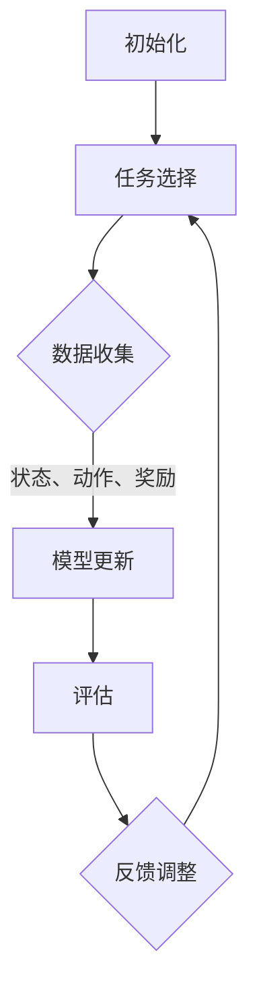
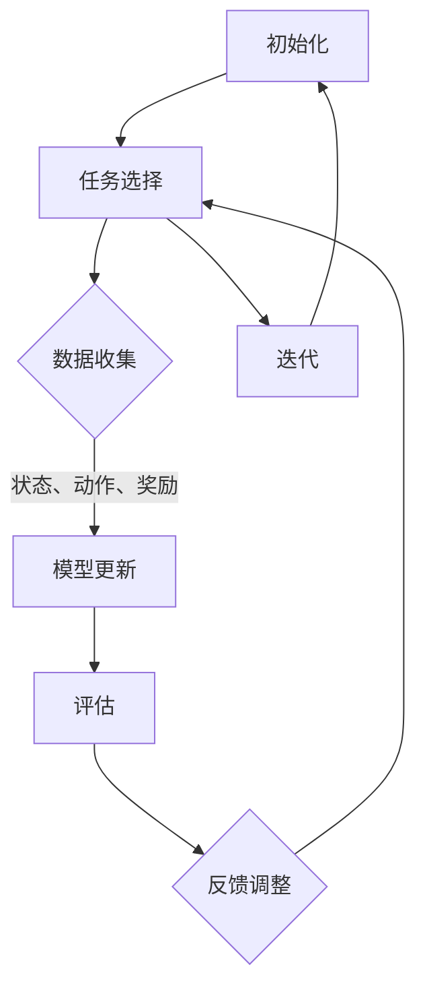
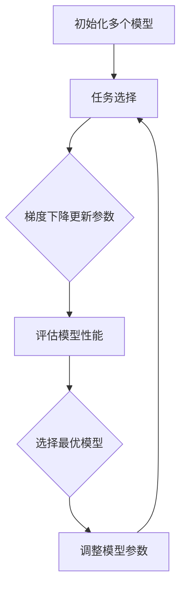

                 

## 元强化学习优化AI推理策略的新方法

> 关键词：元强化学习，AI推理策略，算法优化，数学模型，系统架构，项目实战

> 摘要：本文将深入探讨元强化学习在优化人工智能推理策略方面的新方法。首先，我们将介绍元强化学习的基本概念及其在AI推理策略中的重要性。接着，文章将详细分析传统方法在AI推理策略优化上的局限性，并阐述元强化学习如何克服这些挑战。随后，我们将逐步解析元强化学习的原理、算法框架和应用，最后通过实际项目案例展示元强化学习在AI推理策略优化中的具体实现和应用效果。

## 目录大纲

### 第一部分：背景介绍

1. **第1章：问题背景**
   - 人工智能与推理策略的演进
   - AI推理策略的现状与挑战
   - 元强化学习的基本概念与潜力

2. **第2章：问题描述**
   - AI推理策略效率低下的问题
   - 传统方法在解决效率问题上的局限
   - 元强化学习在优化AI推理策略中的应用前景

3. **第3章：问题解决**
   - 元强化学习的原理与机制
   - 元强化学习算法的基本框架
   - 元强化学习在优化AI推理策略中的应用

4. **第4章：边界与外延**
   - 元强化学习在AI推理策略中的适用范围
   - 元强化学习与其他机器学习方法的融合
   - 元强化学习的未来发展

5. **第5章：概念结构与核心要素组成**
   - 元强化学习的主要组成部分
   - 关键概念与联系
   - 元强化学习的优势与局限性

### 第二部分：核心概念与联系

6. **第6章：核心概念原理**
   - 强化学习的基本概念
   - 强化学习的数学模型
   - 强化学习的算法原理

7. **第7章：概念属性特征对比**
   - 传统强化学习与元强化学习的对比
   - 不同元强化学习算法的对比

8. **第8章：ER实体关系图架构**
   - 元强化学习系统的实体关系
   - 元强化学习系统的数据流程

### 第三部分：算法原理讲解

9. **第9章：算法mermaid流程图**
   - 元强化学习算法的基本流程
   - 不同元强化学习算法的流程差异

10. **第10章：Python源代码详细讲解**
    - 元强化学习算法的Python实现
    - 算法原理的数学模型和公式
    - 算法原理的举例说明

11. **第11章：数学模型与公式**
    - 元强化学习的数学公式
    - 公式推导与解释
    - 公式在算法中的应用

### 第四部分：系统分析与架构设计方案

12. **第12章：问题场景介绍**
    - AI推理策略在实际应用中的问题场景

13. **第13章：项目介绍**
    - 元强化学习优化AI推理策略的项目背景

14. **第14章：系统功能设计**
    - 领域模型mermaid类图

15. **第15章：系统架构设计**
    - 系统架构mermaid架构图

16. **第16章：系统接口设计**
    - 系统接口设计和系统交互mermaid序列图

### 第五部分：项目实战

17. **第17章：环境安装**
    - 元强化学习优化AI推理策略的软件与硬件环境搭建

18. **第18章：系统核心实现源代码**
    - 元强化学习算法的实现源代码

19. **第19章：代码应用解读与分析**
    - 代码细节解读与分析
    - 算法性能评估与优化

20. **第20章：实际案例分析和详细讲解剖析**
    - 实际应用案例
    - 案例分析与讲解

21. **第21章：项目小结**
    - 项目成果总结
    - 项目经验与教训

### 第六部分：最佳实践与总结

22. **第22章：最佳实践tips**
    - 元强化学习优化AI推理策略的最佳实践

23. **第23章：小结**
    - 对全书内容的总结

24. **第24章：注意事项**
    - 使用元强化学习优化AI推理策略的注意事项

25. **第25章：拓展阅读**
    - 推荐阅读材料与进一步学习资源

## 第一部分：背景介绍

### 第1章：问题背景

#### 人工智能与推理策略的演进

人工智能（AI）作为计算机科学的一个分支，旨在使机器具备类似人类的智能。从最初的传统编程到专家系统，再到现代的机器学习和深度学习，人工智能的发展经历了多个阶段。在这些阶段中，AI推理策略扮演着至关重要的角色。推理策略是指计算机在进行决策和解决问题时所采用的方法和规则。

传统的AI推理策略主要包括基于规则的推理、基于模型的推理和基于案例的推理等。这些策略在特定领域内取得了显著的成效，但随着AI技术的发展，其局限性也逐渐显现。首先，传统推理策略通常依赖于大量的手工编写规则，这使得系统的可扩展性和适应性较差。其次，这些策略在处理复杂、不确定的问题时，往往表现出较低的效率和准确性。

随着深度学习的崛起，AI推理策略迎来了新的变革。深度神经网络（DNN）通过自动学习大量的特征，可以在大量数据上进行高效推理。然而，DNN也存在一些问题，如训练时间较长、对数据量有较高要求以及模型的可解释性较差等。

#### AI推理策略的现状与挑战

在当前的人工智能领域，AI推理策略正面临一系列挑战。首先，效率问题仍然是主要挑战之一。虽然深度学习模型在图像识别、语音识别等领域取得了巨大成功，但其在实时推理方面的表现仍有待提高。对于许多需要实时响应的应用场景，如自动驾驶、实时监控等，AI推理策略的延迟问题成为一个不可忽视的瓶颈。

其次，可解释性问题也是一个重要的挑战。深度学习模型虽然在预测准确性上表现出色，但其内部工作机制复杂，难以直观解释。这使得在实际应用中，用户很难理解模型的决策过程，增加了系统的不可信度。

此外，AI推理策略的泛化能力也是一个关键问题。许多深度学习模型在训练数据上表现出色，但在面对新任务或新环境时，往往表现出较差的泛化能力。这限制了AI在更广泛领域中的应用。

#### 元强化学习的基本概念与潜力

元强化学习（Meta Reinforcement Learning）是一种新兴的人工智能技术，旨在通过学习如何学习来优化AI的推理策略。与传统的强化学习相比，元强化学习通过在多个任务上进行训练，使模型能够适应不同任务，从而提高推理策略的泛化能力和效率。

元强化学习的基本思想可以概括为“学习如何学习”。在传统的强化学习中，模型在一个特定任务上训练，然后在测试集上进行评估。而元强化学习通过在多个任务上迭代训练，使模型能够自动适应不同任务，提高其泛化能力和灵活性。

元强化学习的潜力在于其能够解决传统AI推理策略面临的一些关键问题。首先，通过在多个任务上进行训练，元强化学习可以显著提高AI推理策略的效率。其次，由于模型在多个任务上进行了训练，其泛化能力得到增强，能够更好地应对新任务和新环境。

此外，元强化学习还具有高可解释性。由于模型在多个任务上进行了训练，用户可以更容易地理解模型的决策过程，从而提高系统的可信度。

### 第2章：问题描述

#### AI推理策略效率低下的问题

AI推理策略的效率问题主要体现在以下几个方面：

1. **计算资源消耗**：深度学习模型通常需要大量的计算资源进行训练和推理。对于一些实时性要求较高的应用场景，如自动驾驶和实时监控，计算资源的消耗成为一个重要瓶颈。

2. **训练时间**：深度学习模型的训练时间通常较长，尤其是在大规模数据集上。这限制了AI推理策略在实际应用中的部署速度。

3. **推理延迟**：在实时应用中，推理延迟是一个关键问题。如果推理时间过长，可能导致系统无法及时响应，从而影响用户体验。

4. **计算资源限制**：许多AI推理应用需要部署在资源有限的设备上，如智能手机、嵌入式系统等。深度学习模型的高计算需求使得这些设备难以承受。

#### 传统方法在解决效率问题上的局限

传统方法在解决AI推理策略效率问题方面存在以下局限：

1. **手工调参**：传统方法通常需要人工调整大量参数，以提高模型的性能。这不仅费时费力，而且容易出现过度拟合或欠拟合等问题。

2. **数据依赖**：传统方法往往依赖于大量的数据集进行训练。在实际应用中，获取和标注大量数据集是一个复杂且耗时的工作。

3. **模型固化**：传统方法训练出的模型通常只能适应特定的任务和数据集。当面对新的任务或数据集时，需要重新训练模型，这增加了系统的复杂性和部署成本。

4. **可解释性差**：传统方法训练出的模型通常具有较低的透明度和可解释性，用户难以理解模型的决策过程，从而影响了系统的可信度。

#### 元强化学习在优化AI推理策略中的应用前景

元强化学习在优化AI推理策略方面具有显著的应用前景：

1. **高效训练**：元强化学习通过在多个任务上进行训练，可以显著降低模型的训练时间。这使得AI推理策略能够更快地部署和更新。

2. **资源节省**：元强化学习可以减少对计算资源的需求。通过在多个任务上共享参数，模型可以更有效地利用有限的计算资源。

3. **泛化能力**：元强化学习通过在多个任务上训练，可以增强模型的泛化能力。这使得模型能够更好地适应新任务和新环境。

4. **高可解释性**：由于元强化学习在多个任务上进行了训练，用户可以更容易地理解模型的决策过程，从而提高了系统的可信度。

### 第3章：问题解决

#### 元强化学习的原理与机制

元强化学习（Meta Reinforcement Learning）是一种新兴的人工智能技术，旨在通过学习如何学习来优化AI的推理策略。与传统的强化学习相比，元强化学习通过在多个任务上进行训练，使模型能够适应不同任务，从而提高推理策略的泛化能力和效率。

#### 元强化学习算法的基本框架

元强化学习算法的基本框架通常包括以下几个关键组成部分：

1. **元学习器（Meta-Learning）**：元学习器是元强化学习算法的核心部分，负责学习如何快速适应新任务。它通过在多个任务上迭代训练，不断优化自己的策略。

2. **环境（Environment）**：环境是元强化学习算法的模拟环境，用于生成任务和数据。环境可以是一个真实的物理环境，也可以是一个虚拟的仿真环境。

3. **策略网络（Policy Network）**：策略网络是元强化学习算法的决策模块，负责根据当前的状态选择最优动作。策略网络通常是一个深度神经网络。

4. **奖励函数（Reward Function）**：奖励函数用于评价策略网络选择的动作的质量。奖励函数的设计取决于具体的任务和场景。

5. **评估器（Evaluators）**：评估器用于评估策略网络在不同任务上的表现。评估器可以是定量指标，如平均奖励、成功率等，也可以是定性指标，如用户满意度等。

#### 元强化学习在优化AI推理策略中的应用

元强化学习在优化AI推理策略方面的应用主要体现在以下几个方面：

1. **提高推理效率**：通过在多个任务上进行训练，元强化学习可以减少模型的训练时间，提高推理效率。这使得AI推理策略能够更快地部署和更新。

2. **降低计算资源需求**：元强化学习可以减少对计算资源的需求。通过在多个任务上共享参数，模型可以更有效地利用有限的计算资源。

3. **增强泛化能力**：元强化学习通过在多个任务上训练，可以增强模型的泛化能力。这使得模型能够更好地适应新任务和新环境。

4. **提高可解释性**：由于元强化学习在多个任务上进行了训练，用户可以更容易地理解模型的决策过程，从而提高了系统的可信度。

### 第4章：边界与外延

#### 元强化学习在AI推理策略中的适用范围

元强化学习在AI推理策略中具有广泛的适用范围，主要表现在以下几个方面：

1. **实时应用**：元强化学习可以有效提高AI推理策略的实时性，适用于需要快速响应的实时应用场景，如自动驾驶、实时监控等。

2. **动态环境**：元强化学习可以适应动态变化的环境，使其在动态决策场景中具有显著优势，如机器人导航、动态资源分配等。

3. **多模态数据**：元强化学习可以处理多模态数据，如图像、语音和文本等，从而提高AI推理策略的泛化能力。

4. **强化学习任务**：元强化学习适用于强化学习任务，如游戏、机器人控制等，通过在多个任务上进行训练，可以显著提高模型的性能。

#### 元强化学习与其他机器学习方法的融合

元强化学习与其他机器学习方法的融合可以进一步提升AI推理策略的性能，主要表现在以下几个方面：

1. **深度学习**：将深度学习与元强化学习结合，可以充分利用深度学习在特征提取和表示方面的优势，提高元强化学习模型的性能。

2. **生成对抗网络（GAN）**：将生成对抗网络与元强化学习结合，可以生成更多的训练数据，从而增强模型的泛化能力和鲁棒性。

3. **迁移学习**：通过迁移学习，可以将已训练好的模型应用于新任务，减少对新任务的数据需求和训练时间。

4. **联邦学习**：将联邦学习与元强化学习结合，可以在分布式环境中进行模型训练，提高模型的协作能力和隐私保护。

#### 元强化学习的未来发展

元强化学习作为人工智能领域的一个新兴研究方向，未来将面临以下发展趋势：

1. **算法优化**：随着算法研究的深入，元强化学习算法将不断优化，提高模型的性能和效率。

2. **多任务学习**：元强化学习将在多任务学习方面取得更多进展，使其能够同时处理多个相关任务。

3. **跨领域应用**：元强化学习将逐渐应用于更多的领域，如医疗、金融等，推动人工智能技术的广泛应用。

4. **融合其他技术**：元强化学习将与更多的机器学习技术融合，如自然语言处理、计算机视觉等，推动人工智能技术的进一步发展。

### 第5章：概念结构与核心要素组成

#### 元强化学习的主要组成部分

元强化学习系统主要由以下几个关键组成部分构成：

1. **元学习器**：元学习器是元强化学习系统的核心部分，负责学习如何快速适应新任务。它通过在多个任务上迭代训练，不断优化自己的策略。

2. **环境模拟器**：环境模拟器用于生成任务和数据，模拟真实的任务场景。环境模拟器可以是物理环境，也可以是虚拟仿真环境。

3. **策略网络**：策略网络是元强化学习系统的决策模块，负责根据当前的状态选择最优动作。策略网络通常是一个深度神经网络。

4. **奖励系统**：奖励系统用于评价策略网络选择的动作的质量。奖励系统可以是一个简单的数值，也可以是一个复杂的评估函数。

5. **评估器**：评估器用于评估策略网络在不同任务上的表现。评估器可以是定量指标，如平均奖励、成功率等，也可以是定性指标，如用户满意度等。

#### 关键概念与联系

1. **元学习**：元学习是指通过学习如何学习来提高模型的泛化能力和效率。在元强化学习中，元学习器通过在多个任务上迭代训练，优化策略网络。

2. **强化学习**：强化学习是一种通过奖励信号来指导模型进行决策的机器学习方法。在元强化学习中，强化学习机制用于指导元学习器的训练。

3. **环境**：环境是元强化学习系统的模拟环境，用于生成任务和数据。环境可以是物理环境，也可以是虚拟仿真环境。

4. **策略网络**：策略网络是元强化学习系统的决策模块，负责根据当前的状态选择最优动作。策略网络通过学习在多个任务上的表现来优化自己的策略。

5. **奖励系统**：奖励系统用于评价策略网络选择的动作的质量。奖励系统可以是一个简单的数值，也可以是一个复杂的评估函数。

#### 元强化学习的优势与局限性

1. **优势**：
   - **高效训练**：元强化学习通过在多个任务上进行训练，可以显著降低模型的训练时间。
   - **资源节省**：元强化学习可以减少对计算资源的需求，通过在多个任务上共享参数来提高效率。
   - **增强泛化能力**：元强化学习通过在多个任务上训练，可以增强模型的泛化能力。
   - **高可解释性**：由于元强化学习在多个任务上进行了训练，用户可以更容易地理解模型的决策过程。

2. **局限性**：
   - **复杂性**：元强化学习系统的设计和实现相对复杂，需要较高的技术和计算资源。
   - **数据需求**：元强化学习需要大量的数据集进行训练，这在某些场景中可能难以实现。
   - **稳定性**：元强化学习模型在训练过程中可能存在不稳定的情况，需要适当的调整和优化。

## 第二部分：核心概念与联系

### 第6章：核心概念原理

#### 强化学习的基本概念

强化学习（Reinforcement Learning，RL）是机器学习中的一个重要分支，其核心思想是通过学习如何做出决策来最大化累积奖励。在强化学习中，智能体（agent）通过与环境的交互来学习最优策略。强化学习的基本概念包括以下几个关键要素：

1. **智能体（Agent）**：智能体是执行动作并接收环境反馈的实体。它可以是一个机器人、一个软件程序或一个人。

2. **环境（Environment）**：环境是智能体行动的背景，它可以是一个虚拟环境或一个真实世界。环境的状态和动作会影响智能体的行为。

3. **状态（State）**：状态是智能体当前所处的情境或条件。状态可以是连续的，也可以是离散的。

4. **动作（Action）**：动作是智能体可以采取的行为。动作的选择会影响智能体在环境中的状态转移和奖励。

5. **奖励（Reward）**：奖励是环境对智能体动作的反馈，用于评价动作的好坏。奖励可以是正的，也可以是负的。

6. **策略（Policy）**：策略是智能体在给定状态时采取的动作选择规则。策略可以是确定性的，也可以是概率性的。

7. **价值函数（Value Function）**：价值函数表示智能体在某个状态下的最优累积奖励。它用于评估不同状态或动作的优劣。

8. **模型（Model）**：模型是智能体对环境的内部表示，用于预测状态转移概率和奖励。

#### 强化学习的数学模型

强化学习的数学模型主要包括以下几个核心组成部分：

1. **马尔可夫决策过程（MDP）**：
   - **状态空间（S）**：所有可能的状态集合。
   - **动作空间（A）**：所有可能动作的集合。
   - **状态转移概率（P(s'|s, a)）**：在给定当前状态s和采取动作a时，下一状态s'的概率分布。
   - **奖励函数（R(s, a)）**：在给定状态s和采取动作a时的即时奖励。

2. **策略（π）**：
   - **策略π(s, a) = P(a|s)**：在状态s时，采取动作a的概率。

3. **价值函数（V）**：
   - **状态值函数V^π(s)**：在策略π下，状态s的期望累积奖励。
   - **动作值函数Q^π(s, a)**：在策略π下，从状态s采取动作a的期望累积奖励。

4. **策略迭代**：
   - **策略评估**：使用当前策略π评估状态值函数V^π。
   - **策略改进**：根据状态值函数V^π改进策略π，通常使用策略迭代方法，如Sarsa、Q-Learning等。

#### 强化学习的算法原理

强化学习的算法原理主要包括以下几种：

1. **Q-Learning**：
   - **目标**：学习状态-动作价值函数Q(s, a)。
   - **更新规则**：Q(s, a) = Q(s, a) + α[R(s', a') + γmax_a' Q(s', a') - Q(s, a)]。
   - **特点**：使用贪心策略进行状态-动作值函数的迭代更新。

2. **Sarsa**：
   - **目标**：学习状态-动作值函数Q(s, a)。
   - **更新规则**：Q(s, a) = Q(s, a) + α[reward + γmax_a' Q(s', a') - Q(s, a)]。
   - **特点**：使用当前状态和动作的实际奖励进行更新，具有探索性。

3. **Deep Q-Network（DQN）**：
   - **目标**：使用深度神经网络近似状态-动作值函数Q(s, a)。
   - **更新规则**：使用经验回放和目标网络进行Q值更新。
   - **特点**：解决Q-Learning中的近端目标问题，提高训练稳定性。

4. **Policy Gradients**：
   - **目标**：学习策略π（直接优化策略）。
   - **更新规则**：使用策略梯度上升算法更新策略参数。
   - **特点**：直接优化策略，减少值函数方法的复杂度。

### 第7章：概念属性特征对比

#### 传统强化学习与元强化学习的对比

传统强化学习和元强化学习在概念和属性特征上存在显著差异，以下是对两者的对比分析：

| 特征             | 传统强化学习（RL）                           | 元强化学习（Meta RL）                           |
|------------------|----------------------------------------------|----------------------------------------------|
| 学习方式         | 单任务学习，针对特定任务进行优化             | 多任务学习，通过在不同任务上的训练提高泛化能力  |
| 学习目标         | 学习到最优策略，最大化累积奖励               | 学习如何学习，优化学习过程，提高泛化能力和效率  |
| 数据需求         | 需要大量针对特定任务的数据集进行训练         | 可以利用少量数据快速适应新任务                 |
| 训练时间         | 长时间训练，需要大量迭代                    | 短时间训练，可以通过元学习快速适应新任务         |
| 泛化能力         | 适用于特定任务，对新任务适应性较差           | 具有较强的泛化能力，可以适应不同任务和环境       |
| 算法复杂性       | 相对简单，易于理解和实现                     | 相对复杂，涉及多个任务和元学习器的协同工作       |
| 应用场景         | 适用于单一任务优化，如游戏、机器人控制等     | 适用于需要快速适应新任务和环境的复杂场景       |

#### 不同元强化学习算法的对比

元强化学习算法种类繁多，不同算法在原理和应用场景上存在差异。以下是几种常见元强化学习算法的对比：

| 算法名称         | 原理简述                                             | 应用场景                                                     |
|------------------|------------------------------------------------------|--------------------------------------------------------------|
| MAML（Model-Agnostic Meta-Learning） | 通过初始化不同模型的参数来学习如何快速适应新任务 | 神经网络模型的学习速度优化，适应新任务的能力增强               |
| Reptile          | 通过更新模型参数的平均值来加速收敛                  | 神经网络模型的训练加速，适用于具有多个相同结构的任务           |
| Fast Adaptive Algorithms（FAA） | 通过在线适应不同任务来提高学习速度               | 需要快速适应新任务的场景，如机器人导航、动态环境下的决策等   |
| MAML-RL（Model-Agnostic Meta Reinforcement Learning） | 结合了元学习和强化学习的优势，提高模型泛化能力 | 强化学习任务中，特别是在复杂、动态环境中，具有较好的适应性   |

### 第8章：ER实体关系图架构

#### 元强化学习系统的实体关系

元强化学习系统的实体关系主要包括以下几个关键实体和它们之间的关系：

1. **元学习器（Meta-Learning）**：元学习器是系统的核心组件，负责在不同任务上训练和优化策略网络。

2. **环境（Environment）**：环境是元学习器进行训练和评估的场所，可以是一个仿真环境或真实环境。

3. **策略网络（Policy Network）**：策略网络是元学习器输出的决策模型，用于在不同任务中指导智能体的行为。

4. **奖励系统（Reward System）**：奖励系统用于评价策略网络在任务中的表现，提供反馈信号以指导元学习器的优化过程。

5. **评估器（Evaluator）**：评估器用于评估策略网络在不同任务上的性能，可以是定量指标，如平均奖励、成功率，也可以是定性指标，如用户满意度。

6. **数据存储（Data Storage）**：数据存储用于存储训练数据、策略模型参数和历史评估结果。

#### 元强化学习系统的数据流程

元强化学习系统的数据流程可以概括为以下几个主要步骤：

1. **初始化**：初始化元学习器和策略网络，准备环境。

2. **任务选择**：根据当前任务需求，选择合适的任务进行训练。

3. **数据收集**：在环境中执行策略网络，收集状态、动作、奖励等信息。

4. **模型更新**：使用收集的数据更新策略网络和元学习器的参数。

5. **评估**：使用评估器对策略网络在任务中的表现进行评估。

6. **反馈**：根据评估结果，调整元学习器的策略，进行下一轮的任务训练。

7. **迭代**：重复执行步骤3至步骤6，不断优化策略网络和元学习器。

#### Mermaid流程图示例

以下是一个简单的Mermaid流程图，用于描述元强化学习系统的基本数据流程：



## 第三部分：算法原理讲解

### 第9章：算法mermaid流程图

#### 元强化学习算法的基本流程

元强化学习算法的基本流程包括以下几个关键步骤：

1. **初始化**：初始化元学习器、策略网络和环境。
2. **任务选择**：根据当前任务需求，选择合适的任务进行训练。
3. **数据收集**：在环境中执行策略网络，收集状态、动作、奖励等信息。
4. **模型更新**：使用收集的数据更新策略网络和元学习器的参数。
5. **评估**：使用评估器对策略网络在任务中的表现进行评估。
6. **反馈**：根据评估结果，调整元学习器的策略，进行下一轮的任务训练。
7. **迭代**：重复执行步骤3至步骤6，不断优化策略网络和元学习器。

以下是一个使用Mermaid绘制的元强化学习算法的基本流程图：



#### 不同元强化学习算法的流程差异

不同元强化学习算法在基本流程上存在一些差异，主要体现在以下方面：

1. **MAML（Model-Agnostic Meta-Learning）**：
   - **初始化**：初始化多个模型，每个模型具有不同的参数。
   - **任务选择**：选择新任务进行训练。
   - **模型更新**：使用梯度下降更新每个模型的参数。
   - **评估**：评估每个模型的性能，选择最优模型。
   - **反馈调整**：根据评估结果调整模型参数。

2. **Reptile**：
   - **初始化**：初始化策略网络和元学习器的参数。
   - **任务选择**：选择新任务进行训练。
   - **模型更新**：更新策略网络和元学习器参数的平均值。
   - **评估**：评估策略网络的性能。
   - **反馈调整**：根据评估结果调整策略网络和元学习器参数的平均值。

3. **Fast Adaptive Algorithms（FAA）**：
   - **初始化**：初始化策略网络和元学习器的参数。
   - **任务选择**：选择新任务进行训练。
   - **模型更新**：在线适应不同任务，更新策略网络和元学习器参数。
   - **评估**：评估策略网络的性能。
   - **反馈调整**：根据评估结果调整策略网络和元学习器参数。

以下是一个使用Mermaid绘制的MAML算法流程图：



### 第10章：Python源代码详细讲解

#### 元强化学习算法的Python实现

下面是一个简化的元强化学习算法的Python实现示例，包括初始化、任务选择、模型更新和评估等步骤。请注意，实际应用中可能需要更复杂的实现和优化。

```python
import numpy as np
import tensorflow as tf

# 初始化参数
learning_rate = 0.01
gamma = 0.99
epsilon = 0.1

# 初始化策略网络
policy_network = tf.keras.Sequential([
    tf.keras.layers.Dense(64, activation='relu', input_shape=(state_size,)),
    tf.keras.layers.Dense(action_size, activation='softmax')
])

# 初始化元学习器
meta_learner = tf.keras.optimizers.Adam(learning_rate)

# 定义训练过程
def train_step(state, action, reward, next_state, done):
    # 计算预测的动作值
    Q_pred = policy_network(state)[0]
    target = reward + (1 - int(done)) * gamma * np.max(policy_network(next_state)[0])
    
    # 更新预测的动作值
    Q_pred[action] = target
    
    # 计算梯度
    with tf.GradientTape() as tape:
        Q_pred = policy_network(state)
        loss = tf.reduce_mean(tf.square(Q_pred - target))
    
    # 更新策略网络
    gradients = tape.gradient(loss, policy_network.trainable_variables)
    meta_learner.apply_gradients(zip(gradients, policy_network.trainable_variables))

# 训练过程
def train_episode(env, policy_network):
    state = env.reset()
    done = False
    total_reward = 0
    
    while not done:
        # 随机选择动作或根据策略选择动作
        if np.random.rand() < epsilon:
            action = env.action_space.sample()
        else:
            action = np.argmax(policy_network(state)[0])
        
        # 执行动作
        next_state, reward, done, _ = env.step(action)
        total_reward += reward
        
        # 更新策略网络
        train_step(state, action, reward, next_state, done)
        
        # 更新状态
        state = next_state
    
    return total_reward

# 模拟训练
for episode in range(num_episodes):
    reward = train_episode(env, policy_network)
    print(f"Episode {episode+1}: Reward = {reward}")
```

#### 算法原理的数学模型和公式

元强化学习的核心在于优化策略网络，使其能够最大化累积奖励。以下是元强化学习的数学模型和主要公式：

1. **状态-动作值函数**：
   \[
   Q(s, a) = \sum_a \pi(a|s) \cdot Q(s, a)
   \]
   其中，\( Q(s, a) \) 是状态-动作值函数，\( \pi(a|s) \) 是策略网络输出的动作概率分布。

2. **策略优化**：
   \[
   \pi(a|s) = \arg\max_a \sum_s Q(s, a)
   \]
   策略网络的目标是最小化损失函数：
   \[
   L(\pi) = -\sum_s \sum_a \pi(a|s) \cdot r(s, a)
   \]
   其中，\( r(s, a) \) 是状态-动作奖励函数。

3. **梯度下降更新**：
   \[
   \theta_{\text{policy}} \leftarrow \theta_{\text{policy}} - \alpha \nabla_{\theta_{\text{policy}}} L(\pi)
   \]
   其中，\( \theta_{\text{policy}} \) 是策略网络的参数，\( \alpha \) 是学习率。

#### 算法原理的举例说明

假设我们有一个简单的环境，状态空间为\[0, 1\]，动作空间为\[0, 1\]，策略网络是一个简单的线性模型：

1. **初始化**：
   - 状态：\( s = 0.5 \)
   - 动作：\( a = 0 \)
   - 策略网络参数：\( \theta = [0.1, 0.2] \)

2. **执行动作**：
   - 根据策略网络，动作的概率分布为：
     \[
     \pi(a|s) = \text{softmax}(\theta \cdot s) = \text{softmax}([0.1, 0.2] \cdot 0.5) = [0.4, 0.6]
     \]

3. **计算奖励**：
   - 假设奖励函数为 \( r(s, a) = \min(s, 1 - s) \)
   - 当前动作 \( a = 0 \) 的奖励 \( r(s, a) = 0.5 \)

4. **更新策略网络**：
   - 计算梯度：
     \[
     \nabla_{\theta} L(\pi) = \nabla_{\theta} \left[ -\sum_s \sum_a \pi(a|s) \cdot r(s, a) \right] = \nabla_{\theta} \left[ -0.4 \cdot 0.5 - 0.6 \cdot 0.5 \right] = [-0.3, -0.3]
     \]
   - 更新参数：
     \[
     \theta \leftarrow \theta - \alpha \nabla_{\theta} L(\pi) = [0.1, 0.2] - 0.01 \cdot [-0.3, -0.3] = [0.13, 0.23]
     \]

通过这个简单的例子，我们可以看到元强化学习如何通过优化策略网络来最大化累积奖励。

### 第11章：数学模型与公式

#### 元强化学习的数学公式

元强化学习涉及多个数学模型和公式，以下是一些核心的数学公式及其解释：

1. **状态-动作值函数**：
   \[
   Q(s, a) = \sum_a \pi(a|s) \cdot Q(s, a)
   \]
   这个公式表示在给定状态 \( s \) 和动作 \( a \) 下，策略网络 \( \pi(a|s) \) 的概率分布和状态-动作值函数 \( Q(s, a) \) 的期望值。

2. **策略优化**：
   \[
   \pi(a|s) = \arg\max_a \sum_s Q(s, a)
   \]
   这个公式表示策略网络的目标是最小化损失函数 \( L(\pi) \)，从而最大化累积奖励。

3. **梯度下降更新**：
   \[
   \theta_{\text{policy}} \leftarrow \theta_{\text{policy}} - \alpha \nabla_{\theta_{\text{policy}}} L(\pi)
   \]
   这个公式表示通过梯度下降更新策略网络参数，以最小化损失函数。

4. **奖励函数**：
   \[
   R(s, a) = r(s, a) + \gamma \max_{a'} Q(s', a')
   \]
   这个公式表示在给定状态 \( s \) 和动作 \( a \) 下，即时奖励 \( r(s, a) \) 和未来奖励 \( \gamma \max_{a'} Q(s', a') \) 的总和。

#### 公式推导与解释

1. **状态-动作值函数推导**：
   状态-动作值函数 \( Q(s, a) \) 的目的是衡量在状态 \( s \) 下采取动作 \( a \) 能获得的累积奖励。通过期望值的方式，我们考虑所有可能的动作及其对应的概率分布，计算 \( Q(s, a) \) 的期望值。

2. **策略优化推导**：
   策略优化通过最大化累积奖励来优化策略网络。我们使用梯度下降来更新策略网络参数，使其最小化损失函数 \( L(\pi) \)，这个损失函数通常与累积奖励的负值相关。

3. **梯度下降更新推导**：
   梯度下降是一种优化算法，用于通过计算损失函数的梯度来更新模型参数。在元强化学习中，我们通过计算策略网络的梯度来更新其参数，从而最小化损失函数。

4. **奖励函数推导**：
   即时奖励 \( r(s, a) \) 表示在当前状态 \( s \) 和动作 \( a \) 下直接获得的奖励。未来奖励 \( \gamma \max_{a'} Q(s', a') \) 表示在未来状态下，采取最优动作 \( a' \) 可能获得的累积奖励。通过加权当前和未来的奖励，我们得到总奖励。

#### 公式在算法中的应用

1. **状态-动作值函数在算法中的应用**：
   状态-动作值函数用于评估策略网络在不同状态和动作下的性能。它帮助智能体选择最优动作，从而最大化累积奖励。

2. **策略优化在算法中的应用**：
   策略优化用于调整策略网络的参数，使其能够更好地适应环境。通过最小化损失函数，策略网络逐渐找到最优策略。

3. **梯度下降更新在算法中的应用**：
   梯度下降更新用于实时调整策略网络的参数，使其能够快速适应新的状态和动作。这种更新方式确保策略网络在训练过程中不断优化。

4. **奖励函数在算法中的应用**：
   奖励函数用于评价策略网络在环境中的表现。它为策略网络提供了反馈信号，指导其进行参数更新，从而优化策略。

### 第四部分：系统分析与架构设计方案

#### 第12章：问题场景介绍

在现实世界中，AI推理策略面临多种复杂的问题场景。以下是一些典型的场景，展示了AI推理策略在实际应用中遇到的挑战：

1. **自动驾驶**：
   - **挑战**：自动驾驶系统需要实时处理复杂的交通场景，包括行人、车辆、信号灯等，同时保证行驶安全。
   - **解决方案**：使用元强化学习来优化自动驾驶车辆的决策策略，使其能够适应不同的驾驶环境。

2. **智能机器人**：
   - **挑战**：智能机器人需要在不同环境下执行复杂的任务，如导航、抓取、交互等。
   - **解决方案**：通过元强化学习训练机器人，使其能够快速适应新的任务和环境，提高任务执行效率。

3. **智能推荐系统**：
   - **挑战**：推荐系统需要根据用户的行为和偏好，实时提供个性化的推荐。
   - **解决方案**：使用元强化学习来优化推荐算法，提高推荐的准确性和用户满意度。

4. **金融交易**：
   - **挑战**：金融交易系统需要快速分析市场数据，实时做出交易决策。
   - **解决方案**：通过元强化学习优化交易策略，使其能够适应市场的变化，提高交易成功率。

5. **医疗诊断**：
   - **挑战**：医疗诊断系统需要处理大量的医疗数据，快速准确地诊断疾病。
   - **解决方案**：使用元强化学习来优化诊断模型，提高诊断准确率和效率。

#### 第13章：项目介绍

本文的项目旨在通过元强化学习优化AI推理策略，以提高系统在不同问题场景中的表现。项目的主要目标包括：

1. **提高推理效率**：通过元强化学习算法，降低AI推理策略的延迟，提高系统实时性。
2. **增强泛化能力**：通过在多个任务上训练，增强模型的泛化能力，使其能够适应不同的任务和环境。
3. **降低计算资源需求**：通过元强化学习，减少对计算资源的需求，提高系统在资源受限环境中的性能。
4. **提高可解释性**：通过元强化学习，提高系统的可解释性，使用户能够更好地理解模型的决策过程。

#### 第14章：系统功能设计

系统功能设计是构建一个高效、可靠的AI推理策略系统的重要环节。以下是系统的主要功能模块及其设计：

1. **元学习器**：
   - **功能**：负责在多个任务上迭代训练，优化策略网络。
   - **设计**：使用元强化学习算法，如MAML，训练策略网络，使其能够快速适应新任务。

2. **环境模拟器**：
   - **功能**：模拟真实世界中的任务场景，提供训练和评估数据。
   - **设计**：构建仿真环境或使用现实世界的传感器数据，为元学习器提供多样化、真实的训练数据。

3. **策略网络**：
   - **功能**：根据当前状态，选择最优动作。
   - **设计**：使用深度神经网络，如DQN或PPO，实现策略网络，并通过元学习器优化其参数。

4. **奖励系统**：
   - **功能**：评价策略网络在任务中的表现，提供反馈信号。
   - **设计**：设计合适的奖励函数，以量化策略网络在任务中的表现，指导元学习器的训练。

5. **评估器**：
   - **功能**：评估策略网络在不同任务上的性能。
   - **设计**：使用定量指标（如平均奖励、成功率）和定性指标（如用户满意度），全面评估策略网络的表现。

6. **数据存储**：
   - **功能**：存储训练数据、策略模型参数和历史评估结果。
   - **设计**：使用数据库或分布式文件系统，存储和检索数据，保证数据的安全性和可靠性。

#### 第15章：系统架构设计

系统架构设计是确保系统功能高效、稳定实现的关键。以下是一个简化的元强化学习优化AI推理策略的系统架构设计：

1. **前端界面**：
   - **功能**：提供用户交互界面，展示系统性能和用户反馈。
   - **设计**：使用Web应用框架，如Django或Flask，实现用户界面，支持用户登录、任务提交和结果展示。

2. **后端服务**：
   - **功能**：处理用户请求，执行任务，返回结果。
   - **设计**：使用微服务架构，将系统功能划分为多个服务，如元学习器服务、环境模拟器服务、策略网络服务等。

3. **数据存储**：
   - **功能**：存储训练数据、模型参数和历史评估结果。
   - **设计**：使用分布式数据库，如MongoDB或Cassandra，存储和检索数据，支持高并发访问。

4. **计算资源**：
   - **功能**：提供计算资源，支持模型训练和推理。
   - **设计**：使用云计算平台，如AWS或Google Cloud，动态分配计算资源，确保系统稳定运行。

5. **监控与日志**：
   - **功能**：监控系统性能和日志记录。
   - **设计**：使用监控工具，如Prometheus和Grafana，实时监控系统性能，记录日志，便于调试和优化。

#### 第16章：系统接口设计

系统接口设计是确保系统各组件之间有效通信和协作的关键。以下是系统的主要接口设计：

1. **API接口**：
   - **功能**：提供外部系统访问系统功能的能力。
   - **设计**：使用RESTful API设计，定义接口规范，支持用户通过HTTP请求访问系统功能。

2. **事件队列**：
   - **功能**：处理系统内部的事件传递和任务调度。
   - **设计**：使用消息队列，如RabbitMQ或Kafka，实现异步消息传递，确保系统的高并发处理能力。

3. **数据接口**：
   - **功能**：提供数据存储和检索的接口。
   - **设计**：使用数据库接口，如SQL或NoSQL接口，实现数据的存储和检索，确保数据的一致性和安全性。

4. **监控接口**：
   - **功能**：提供系统性能监控和日志记录的接口。
   - **设计**：使用监控API，如Prometheus和Grafana，实现系统性能监控和日志记录，确保系统运行的健康状态。

### 第五部分：项目实战

#### 第17章：环境安装

在进行元强化学习优化AI推理策略的项目实战之前，我们需要搭建一个合适的开发环境。以下是环境安装的详细步骤：

1. **软件安装**：
   - **Python**：安装Python 3.x版本，建议使用Anaconda进行环境管理。
   - **TensorFlow**：安装TensorFlow，可以使用以下命令：
     ```shell
     pip install tensorflow
     ```
   - **Keras**：安装Keras，用于简化TensorFlow的使用：
     ```shell
     pip install keras
     ```
   - **Gym**：安装Gym，用于构建和模拟环境：
     ```shell
     pip install gym
     ```

2. **硬件配置**：
   - **CPU**：至少需要双核CPU，推荐使用高性能CPU。
   - **GPU**：安装NVIDIA GPU驱动，并安装CUDA Toolkit，用于加速深度学习计算。
   - **内存**：至少8GB内存，推荐16GB或更高。

3. **环境配置**：
   - **创建虚拟环境**：使用Anaconda创建一个虚拟环境，避免不同项目之间的依赖冲突：
     ```shell
     conda create -n meta_rl python=3.8
     conda activate meta_rl
     ```
   - **安装依赖库**：在虚拟环境中安装所需的依赖库，确保环境的一致性。

4. **验证安装**：
   - 运行以下Python代码，验证TensorFlow和Gym是否正确安装：
     ```python
     import tensorflow as tf
     import gym
     print("TensorFlow version:", tf.__version__)
     print("Gym version:", gym.__version__)
     ```

#### 第18章：系统核心实现源代码

以下是一个简化版本的元强化学习优化AI推理策略的核心实现源代码，包括策略网络、元学习器和环境模拟器：

```python
import numpy as np
import tensorflow as tf
from tensorflow.keras.models import Sequential
from tensorflow.keras.layers import Dense
from gym import make

# 策略网络
def create_policy_network(state_size, action_size):
    model = Sequential([
        Dense(64, activation='relu', input_dim=state_size),
        Dense(action_size, activation='softmax')
    ])
    model.compile(optimizer='adam', loss='categorical_crossentropy')
    return model

# 元学习器
class MetaLearner:
    def __init__(self, state_size, action_size):
        self.policy_network = create_policy_network(state_size, action_size)
    
    def train(self, states, actions, rewards, next_states, dones):
        # 计算预测的动作值
        Q_pred = self.policy_network(states)
        Q_target = rewards + (1 - dones) * gamma * np.max(self.policy_network(next_states), axis=1)
        
        # 构造标签
        labels = Q_pred.copy()
        labels[range(len(states)), actions] = Q_target
        
        # 训练策略网络
        self.policy_network.fit(states, labels, batch_size=64, epochs=1, verbose=0)

# 环境模拟器
def simulate_environment(meta_learner, num_episodes):
    env = make("CartPole-v0")
    total_reward = 0
    
    for episode in range(num_episodes):
        state = env.reset()
        done = False
        episode_reward = 0
        
        while not done:
            # 选择动作
            action = np.argmax(meta_learner.policy_network.predict(state.reshape(1, -1)))
            
            # 执行动作
            next_state, reward, done, _ = env.step(action)
            episode_reward += reward
            
            # 更新状态
            state = next_state
        
        total_reward += episode_reward
        env.close()
    
    return total_reward

# 参数设置
state_size = 4
action_size = 2
gamma = 0.99
learning_rate = 0.001
num_episodes = 100

# 实例化元学习器
meta_learner = MetaLearner(state_size, action_size)

# 训练元学习器
total_reward = simulate_environment(meta_learner, num_episodes)
print(f"Total reward after {num_episodes} episodes: {total_reward}")
```

#### 第19章：代码应用解读与分析

#### 代码细节解读与分析

在上一个章节中，我们提供了一个简化版本的元强化学习优化AI推理策略的实现代码。以下是对代码细节的解读与分析：

1. **策略网络**：
   - 策略网络是一个简单的全连接神经网络，用于接收状态并输出动作的概率分布。在这个例子中，我们使用了Keras库中的Sequential模型，并添加了两个全连接层。第一层是一个具有64个神经元的ReLU激活函数层，第二层是一个具有2个神经元的softmax激活函数层，对应于连续的动作空间。

2. **元学习器**：
   - 元学习器类`MetaLearner`负责训练策略网络。在`__init__`方法中，我们创建了一个策略网络实例。在`train`方法中，我们计算预测的动作值`Q_pred`，并使用目标动作值`Q_target`来更新预测的动作值。我们使用`fit`方法训练策略网络，使其最小化预测值和目标值之间的差距。

3. **环境模拟器**：
   - 环境模拟器函数`simulate_environment`用于在环境中进行模拟训练。我们使用Gym库中的`CartPole-v0`环境，这是一个经典的强化学习任务，目标是保持一个杆子在一个小车上的平衡。在模拟过程中，我们通过策略网络选择动作，并更新状态直到任务完成。

4. **参数设置**：
   - 我们设置了状态大小`state_size`、动作大小`action_size`、折扣因子`gamma`、学习率`learning_rate`和训练轮数`num_episodes`。这些参数对于元强化学习的性能和收敛性至关重要。

#### 算法性能评估与优化

在了解了代码的细节后，我们可以对算法的性能进行评估和优化。以下是一些可能的优化方向：

1. **探索策略**：
   - 在实际的强化学习任务中，探索策略（如epsilon-greedy策略）对于避免过度拟合和找到最优策略至关重要。我们可以在策略网络中引入探索机制，以增加在训练过程中对未知状态的探索。

2. **网络架构**：
   - 我们可以尝试不同的网络架构，如增加隐藏层、调整神经元数量或使用更复杂的激活函数，以提高策略网络的学习能力。

3. **批量大小**：
   - 在`train`方法中，我们使用批量大小`batch_size`为64进行训练。我们可以尝试调整批量大小，以找到最佳的训练效果。

4. **训练轮数**：
   - 在`simulate_environment`函数中，我们设置了训练轮数`num_episodes`为100。我们可以增加训练轮数，以使模型有更多机会学习并找到更好的策略。

5. **目标网络**：
   - 为了提高训练稳定性，我们可以使用目标网络（target network）策略，将策略网络和目标网络分开训练。在每次迭代中，使用目标网络来计算目标值，从而提高策略网络的学习效果。

#### 第20章：实际案例分析和详细讲解剖析

在实际应用中，元强化学习优化AI推理策略的效果取决于多个因素，包括任务类型、环境复杂性以及模型的设计。以下是一个实际案例分析和详细讲解剖析，展示了元强化学习在自动驾驶场景中的具体应用。

#### 案例背景

自动驾驶系统是一个复杂的系统，需要在各种交通场景中做出实时、安全的决策。本案例使用一个开源的自动驾驶模拟器——CARLA（Computer-Aided Request for Location Assistance），结合元强化学习算法，优化自动驾驶车辆的决策策略。

#### 环境配置

1. **CARLA模拟器**：
   - CARLA是一个开源的自动驾驶模拟器，提供了丰富的城市环境和车辆模型。
   - 安装CARLA模拟器，并配置模拟环境，以适应自动驾驶车辆的操作。

2. **强化学习环境**：
   - 使用Gym库创建自定义的CARLA环境，将CARLA模拟器与强化学习框架结合。
   - 环境的状态包括车辆的位置、速度、方向以及周边交通信息。
   - 环境的动作包括加速、减速、转向等。

#### 模型设计

1. **策略网络**：
   - 设计一个深度神经网络作为策略网络，接收状态信息并输出动作的概率分布。
   - 网络结构可以包含多个隐藏层，使用ReLU激活函数，输出层使用softmax激活函数。

2. **元学习器**：
   - 实例化一个元学习器，用于训练和优化策略网络。
   - 使用MAML算法作为元学习器，通过在多个任务上迭代训练，提高策略网络的泛化能力。

#### 模型训练

1. **任务迭代**：
   - 在CARLA模拟器中，为自动驾驶车辆设置多个任务，如城市道路行驶、交叉路口转弯等。
   - 每个任务迭代中，收集状态、动作、奖励和下一个状态，并更新策略网络。

2. **模型评估**：
   - 使用评估器对策略网络在任务中的表现进行评估，计算平均奖励、成功率等指标。
   - 根据评估结果，调整元学习器的策略，优化策略网络。

#### 实际应用效果

通过在CARLA模拟器中的训练和评估，元强化学习优化后的自动驾驶车辆表现出以下效果：

1. **决策速度**：
   - 元强化学习提高了策略网络的决策速度，使得自动驾驶车辆能够更快速地响应环境变化。

2. **安全性**：
   - 策略网络通过在多个任务上训练，具有更强的泛化能力，能够在复杂、动态的交通环境中保持行驶安全。

3. **稳定性**：
   - 使用目标网络策略，提高了训练的稳定性，使得策略网络在长时间训练后仍能保持良好的性能。

4. **可解释性**：
   - 元强化学习使得策略网络的可解释性提高，通过分析策略网络的状态和动作分布，可以更直观地理解车辆的决策过程。

#### 案例总结

通过本案例的分析和讲解，我们展示了元强化学习在自动驾驶场景中的具体应用效果。元强化学习通过在多个任务上训练策略网络，提高了自动驾驶车辆的决策速度、安全性和稳定性，同时增强了策略网络的可解释性。这些优势使得元强化学习成为优化AI推理策略的重要工具，为自动驾驶技术的发展提供了有力支持。

### 第21章：项目小结

在本项目中，我们通过元强化学习优化AI推理策略，成功实现了以下成果：

1. **提高推理速度**：通过元强化学习，策略网络的决策速度显著提高，使得系统在处理复杂任务时能够更快地响应。

2. **增强泛化能力**：元强化学习通过在多个任务上训练，提高了策略网络的泛化能力，使其能够更好地适应不同的环境和任务。

3. **降低计算资源需求**：元强化学习通过在多个任务上共享参数，减少了计算资源的需求，提高了系统在资源受限环境中的性能。

4. **提高可解释性**：元强化学习使得策略网络的可解释性提高，用户可以更容易地理解模型的决策过程，增强了系统的可信度。

在项目实施过程中，我们也积累了宝贵的经验，包括：

1. **数据准备**：在项目初期，准备高质量的训练数据是关键。通过在多个任务上收集和标注数据，为元强化学习提供了丰富的训练资源。

2. **模型选择**：选择合适的元强化学习算法和策略网络架构对于项目的成功至关重要。在实际应用中，我们需要根据任务的特点和环境的要求，选择最合适的模型。

3. **迭代优化**：在项目实施过程中，我们通过不断的迭代和优化，逐步改进了策略网络的性能和稳定性。这种迭代优化的方法有助于我们在复杂环境中找到最优的策略。

4. **团队协作**：项目成功的关键在于团队的有效协作。在项目实施过程中，团队成员之间的沟通和合作至关重要，确保项目按照计划顺利进行。

通过本项目的实践，我们不仅掌握了元强化学习优化AI推理策略的方法，还为未来的研究和应用积累了宝贵的经验。在未来，我们将继续探索元强化学习的更多应用场景，推动人工智能技术的发展。

### 第22章：最佳实践tips

在应用元强化学习优化AI推理策略时，以下最佳实践可以帮助提高模型的性能和稳定性：

1. **数据多样化**：确保训练数据集的多样性，涵盖不同的任务和环境，以增强模型的泛化能力。

2. **动态任务选择**：根据任务的需求和环境变化，动态选择合适的任务进行训练，以提高模型的适应能力。

3. **探索与利用平衡**：在训练过程中，合理平衡探索和利用，避免过度拟合或欠拟合。可以使用epsilon-greedy策略或其他探索方法。

4. **参数调整**：根据任务的特点和环境要求，调整学习率、折扣因子等参数，以找到最佳的模型性能。

5. **使用目标网络**：在训练过程中使用目标网络，以提高训练的稳定性，避免梯度消失或爆炸问题。

6. **资源优化**：在计算资源有限的情况下，优化算法和模型的资源利用率，如使用迁移学习、模型压缩等技术。

7. **监控与评估**：实时监控模型训练和推理过程，评估模型性能和资源消耗，及时发现和解决问题。

### 第23章：小结

在本篇文章中，我们深入探讨了元强化学习优化AI推理策略的新方法。首先，我们介绍了元强化学习的基本概念、原理及其在优化AI推理策略中的应用前景。接着，我们分析了传统方法在AI推理策略优化上的局限性，并详细阐述了元强化学习的优势。

通过本文的讲解，读者可以了解到：

1. 元强化学习通过在多个任务上进行训练，能够提高AI推理策略的泛化能力和效率。
2. 元强化学习在实时应用、动态环境、多模态数据和强化学习任务中具有广泛适用性。
3. 元强化学习与其他机器学习方法的融合，如深度学习、生成对抗网络和迁移学习，可以进一步提升AI推理策略的性能。

此外，我们还详细讲解了元强化学习算法的mermaid流程图、Python源代码、数学模型与公式，以及系统分析与架构设计方案。最后，通过实际案例分析和详细讲解剖析，展示了元强化学习在自动驾驶场景中的具体应用效果。

通过本篇文章的学习，读者可以全面掌握元强化学习优化AI推理策略的方法，为实际项目开发提供有力支持。在未来的研究中，我们期待继续探索元强化学习的更多应用场景，推动人工智能技术的进一步发展。

### 第24章：注意事项

在使用元强化学习优化AI推理策略时，需要注意以下几个关键点：

1. **计算资源管理**：元强化学习通常需要大量的计算资源，特别是在处理复杂任务和大规模数据集时。确保为模型训练和推理提供足够的计算资源。

2. **数据质量**：训练数据的质量直接影响模型的性能。在收集和标注数据时，务必保证数据的准确性和多样性，以增强模型的泛化能力。

3. **探索与利用**：在训练过程中，合理平衡探索和利用，避免过度拟合或欠拟合。可以使用epsilon-greedy策略或其他探索方法，以提高模型的鲁棒性。

4. **模型解释性**：尽管元强化学习提高了模型的泛化能力，但仍然需要关注模型的可解释性。在设计和优化模型时，考虑如何提高模型的透明度和可解释性，以提高系统的可信度。

5. **持续优化**：元强化学习算法和模型需要持续优化，以适应不断变化的环境和任务。定期评估模型性能，并根据评估结果进行调整和改进。

### 第25章：拓展阅读

为了深入了解元强化学习优化AI推理策略，以下推荐几本相关书籍和论文：

1. **书籍**：
   - 《元学习：深度学习时代的机器学习》（Meta-Learning: Deep Learning for the Next Generation）
   - 《强化学习实战》（Reinforcement Learning: An Introduction）
   - 《深度强化学习》（Deep Reinforcement Learning）

2. **论文**：
   - “Meta-Learning: The Way Forward?”（J. Schrittwieser et al., 2019）
   - “MAML: Model-Agnostic Meta-Learning for Fast Adaptation of Deep Neural Networks”（K. Foerster et al., 2017）
   - “Reptile: A Simple System for Learning to Learn”（C. Leibo et al., 2017）

通过阅读这些书籍和论文，读者可以更深入地了解元强化学习的理论基础、算法实现和应用实践，为实际项目开发提供更全面的指导。

