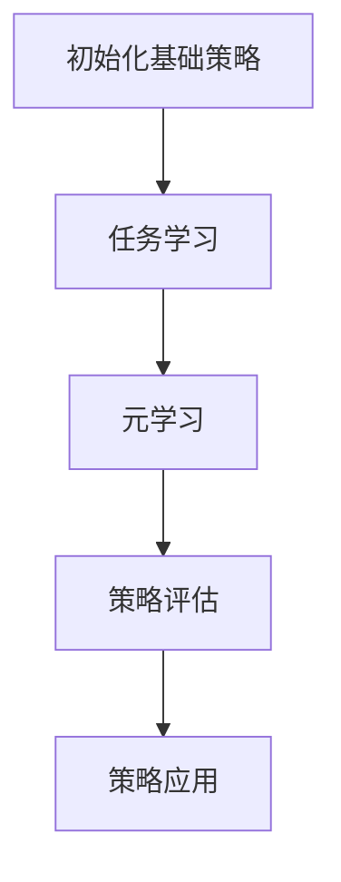
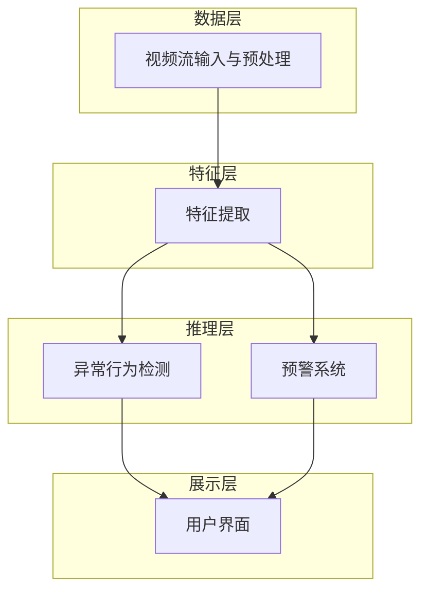
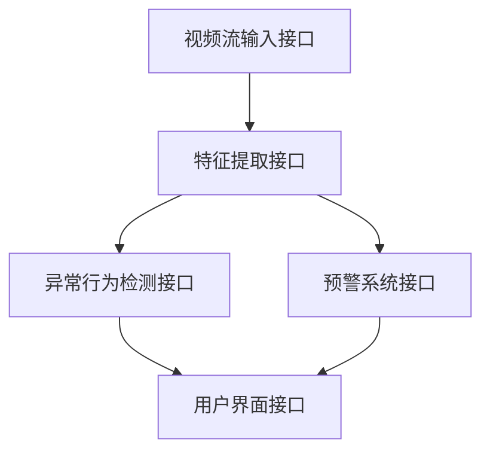
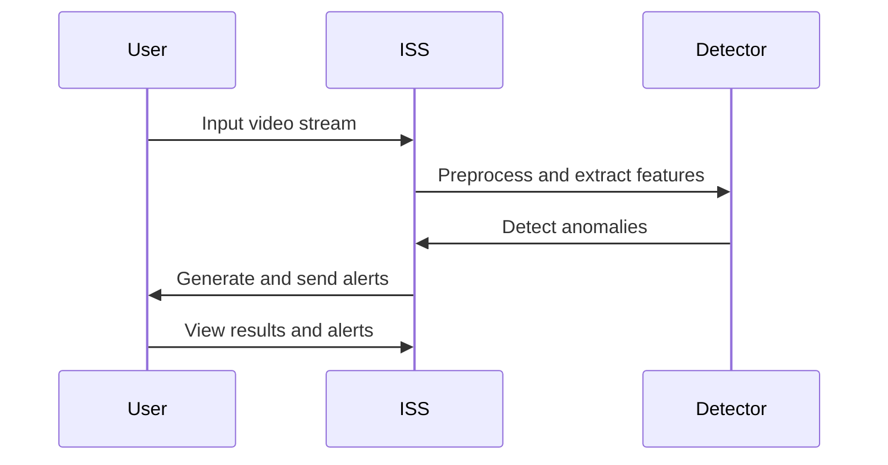

                 

### 关键词

- 元强化学习
- 不确定环境
- 推理策略
- 优化算法
- 强化学习
- 元策略搜索
- 多任务学习
- 迁移学习
- 人工智能
- 计算机科学
- 强化学习算法

### 摘要

本文深入探讨了元强化学习在不确定环境下的推理策略。首先，我们介绍了元强化学习的基本概念和发展历程，明确了其在强化学习领域的重要地位。接着，我们详细阐述了不确定环境的特点及其对推理策略的影响。随后，文章通过mermaid流程图和Python代码示例，讲解了元强化学习的算法原理和数学模型。此外，我们设计并展示了一个典型的应用场景，探讨了系统的功能、架构和接口。最后，通过一个实际项目，我们模拟了环境安装、系统实现、代码解读和案例分析，总结了最佳实践，并提供了拓展阅读资源。本文旨在为读者提供一个全面、深入的技术解读，助力理解元强化学习在不确定环境下的推理策略及其应用价值。

----------------------------------------------------------------

## 第一部分: 问题背景与概述

### 第1章: 问题背景与概述

### 1.1 元强化学习概述

#### 1.1.1 元强化学习的定义

元强化学习（Meta Reinforcement Learning）是一种在多个任务上学习通用策略的机器学习方法。它不同于传统的强化学习，后者通常在一个任务上训练一个特定的策略。元强化学习的目标是通过学习一组任务来生成一个通用的策略，这个策略可以应用于各种类似的任务中，从而提高学习效率。

#### 1.1.2 元强化学习的发展历程

元强化学习的研究起源于1990年代，当时研究者们开始探索如何通过跨任务的学习来提高强化学习算法的性能。随着深度学习技术的进步，尤其是深度强化学习的兴起，元强化学习逐渐成为一个独立的研究方向。近年来，随着元学习（Meta-Learning）理论的深入，元强化学习在学术界和工业界都受到了广泛关注。

#### 1.1.3 元强化学习的关键概念

- **元策略（Meta-Policy）**：元策略是指一组策略，这些策略在不同的任务上表现出较好的泛化能力。
- **经验重放（Experience Replay）**：经验重放是一种用于元强化学习的技术，它允许模型在训练过程中重复使用以前的经验。
- **多任务学习（Multi-Task Learning）**：多任务学习是一种在多个任务上同时训练模型的方法，这有助于提高模型在单个任务上的性能。
- **迁移学习（Transfer Learning）**：迁移学习是指将一个任务上学到的知识应用于另一个相关任务中。

### 1.2 不确定环境下的推理策略

#### 1.2.1 不确定环境的特性

不确定环境是指那些具有不确定性的状态、动作和奖励的环境。在不确定环境中，系统的行为可能会受到随机因素的影响，这使得环境预测和决策变得更加复杂。

#### 1.2.2 不确定环境对推理策略的影响

不确定环境对推理策略的影响主要体现在两个方面：

- **不确定性建模**：推理策略需要能够处理和建模环境中的不确定性，以便做出合理的决策。
- **鲁棒性要求**：推理策略需要具有鲁棒性，能够在面对不确定性时仍然保持稳定的性能。

#### 1.2.3 推理策略在不确定环境中的应用

在不确定环境中，推理策略的应用主要包括：

- **概率推理**：通过概率模型来预测和决策。
- **贝叶斯推理**：利用贝叶斯网络进行推理，以处理不确定性。
- **强化学习**：通过探索和利用平衡策略来适应不确定环境。

### 1.3 元强化学习在不确定环境下的推理策略

#### 1.3.1 元强化学习的挑战

在不确定环境中应用元强化学习面临以下挑战：

- **样本效率低**：不确定环境通常需要更多的样本才能学习出一个有效的策略。
- **动态性**：不确定环境中的状态、动作和奖励通常是动态变化的，这使得策略学习变得更加困难。
- **模型泛化能力**：元强化学习需要学习一个通用的策略，但不确定环境中的变化可能限制模型的泛化能力。

#### 1.3.2 不确定环境下的元强化学习方法

为了应对上述挑战，不确定环境下的元强化学习方法主要包括：

- **元策略搜索**：通过优化元策略来提高样本效率和模型泛化能力。
- **多任务学习**：通过同时学习多个任务来提高模型的泛化能力。
- **经验重放**：通过经验重放来增加训练样本的多样性。

#### 1.3.3 元强化学习在推理策略中的优势

元强化学习在推理策略中的优势主要体现在：

- **通用性**：元强化学习可以生成适用于多种不确定环境的通用策略。
- **效率**：通过学习一组任务，元强化学习可以提高策略学习的效率。
- **适应性**：元强化学习可以在不确定环境中快速适应变化，从而提高推理策略的鲁棒性。

### 1.4 推理策略的核心概念

#### 1.4.1 推理策略的定义

推理策略（Inference Policy）是指用于推理过程中决策的规则或模型。它通常基于某些先验知识和数据，通过推理机制来生成结论。

#### 1.4.2 推理策略的类型

推理策略可以分为以下几种类型：

- **基于规则的推理策略**：基于一组规则进行推理。
- **基于模型的推理策略**：基于数学模型进行推理。
- **混合推理策略**：结合规则和模型进行推理。

#### 1.4.3 推理策略的基本原理

推理策略的基本原理包括：

- **推理过程**：从已知的事实和规则中推导出新的结论。
- **证据更新**：根据新的证据更新推理模型。
- **推理效率**：如何在效率和准确性之间取得平衡。

### 1.5 本章小结

本章介绍了元强化学习的基本概念和发展历程，探讨了不确定环境对推理策略的影响，以及元强化学习在不确定环境下的推理策略。本章的内容为后续章节的深入讨论奠定了基础。

----------------------------------------------------------------

### 第2章：元强化学习基础

#### 第2章：元强化学习基础

#### 2.1 元强化学习的定义与背景

#### 2.1.1 强化学习与元强化学习的关系

强化学习（Reinforcement Learning, RL）是机器学习的一个重要分支，其主要目标是让一个智能体（agent）在与环境（environment）的交互中，通过不断尝试和反馈，学习到一个最优的策略（policy），以实现某一目标。强化学习的基本原理是奖励机制，即智能体在每个状态下都会收到一个奖励，通过不断优化策略，使得最终获得的累积奖励最大化。

元强化学习（Meta Reinforcement Learning）是强化学习的进一步扩展，它关注的是如何从一个或多个任务中学习出一个通用的策略，从而提高跨任务的样本效率和泛化能力。换句话说，元强化学习旨在寻找一种能够适应多个不同任务的策略，而不是为每个任务单独设计一个策略。

#### 2.1.2 元强化学习的起源与发展

元强化学习的研究起源于1990年代，当时研究者开始探索如何通过跨任务的学习来提高强化学习算法的性能。一个重要的里程碑是1995年，Sutton和Bertsekas提出了元学习的概念，并开始将其应用于强化学习。随着深度学习技术的进步，尤其是深度强化学习的兴起，元强化学习逐渐成为一个独立的研究方向。

近年来，元强化学习在学术界和工业界都受到了广泛关注。一些重要的研究进展包括基于模型的方法、基于策略的方法、以及多任务学习和迁移学习等。此外，元强化学习还在自动驾驶、机器人控制、游戏AI等领域取得了显著的成果。

#### 2.1.3 元强化学习的重要性

元强化学习的重要性主要体现在以下几个方面：

1. **提高样本效率**：在传统的强化学习中，每个任务都需要单独训练一个策略，这需要大量的样本。而元强化学习通过学习一组任务，可以共享知识，从而提高样本效率，减少训练时间。
2. **增强泛化能力**：通过在多个任务上训练，元强化学习可以更好地适应不同任务，从而增强泛化能力。
3. **通用策略的发现**：元强化学习可以帮助我们找到一组通用策略，这些策略可以应用于各种不同类型的任务，从而实现知识共享和迁移。
4. **应对动态环境**：在现实世界中，环境是动态变化的，元强化学习可以帮助智能体快速适应环境变化，从而提高决策的鲁棒性。

#### 2.2 元强化学习的基本概念

元强化学习涉及多个关键概念，下面我们逐一进行介绍。

##### 2.2.1 动作、状态与奖励

在强化学习中，智能体在环境中进行决策，这些决策可以通过动作（action）来表示。每个动作对应环境中的一个状态（state），状态是智能体在环境中所处的位置或情况。同时，每个动作都会带来一个奖励（reward），奖励是环境对智能体动作的反馈，它可以是正的、负的或零。

##### 2.2.2 政策和价值函数

政策（policy）是指智能体在给定状态下选择动作的策略。它可以是一个概率分布，表示在每种状态下选择每个动作的概率。

价值函数（value function）是评估状态值的一个函数，它表示在给定状态下采取最优策略所能获得的期望奖励。在元强化学习中，价值函数通常用于评估一组策略的泛化能力。

##### 2.2.3 代理与学习过程

代理（agent）是指执行任务的学习实体，它可以是一个人、一个机器人或一个计算机程序。代理通过与环境交互来学习策略，这个过程称为学习过程（learning process）。在元强化学习中，代理的目标是通过学习一组任务来获得一个通用的策略。

##### 2.2.4 经验重放

经验重放（experience replay）是元强化学习中的一个关键技术。它通过将之前的经验（包括状态、动作、奖励和下一个状态）存储在一个记忆库中，然后在训练过程中随机抽取这些经验进行学习，从而提高训练的稳定性和样本效率。

#### 2.3 元强化学习的发展历程

##### 2.3.1 早期发展

元强化学习的研究最早可以追溯到1990年代，当时研究者开始探索如何通过跨任务的学习来提高强化学习算法的性能。这个时期的研究主要集中在理论层面，如Sutton和Bertsekas在1995年提出的元学习概念。

##### 2.3.2 2010年后的快速发展

随着深度学习技术的进步，尤其是深度强化学习的兴起，元强化学习逐渐成为一个独立的研究方向。2010年后，大量的研究论文和算法被提出，如MAML（Model-Agnostic Meta-Learning）和Reptile等。这些算法在理论上取得了重大突破，并在实践中取得了显著效果。

##### 2.3.3 当前研究方向与趋势

当前，元强化学习的研究主要集中在以下几个方面：

1. **多任务学习**：通过同时学习多个任务来提高模型的泛化能力。
2. **迁移学习**：将一个任务上学到的知识应用于其他相关任务中。
3. **不确定性处理**：如何处理和建模不确定环境。
4. **模型选择与优化**：如何选择和优化模型结构，以提高元强化学习的性能。

#### 2.4 关键概念

##### 2.4.1 元学习

元学习（Meta-Learning）是指通过学习如何学习来提高学习效率的一种方法。在元强化学习中，元学习是一种重要的技术，它可以帮助智能体快速适应新任务，从而提高样本效率和泛化能力。

##### 2.4.2 元策略搜索

元策略搜索（Meta-Policy Search）是一种元强化学习方法，它通过优化一组策略来提高样本效率和泛化能力。元策略搜索的核心思想是在多个任务上训练一组策略，这组策略可以共享知识，从而提高学习效率。

##### 2.4.3 多任务学习

多任务学习（Multi-Task Learning）是指同时学习多个任务的一种方法。在元强化学习中，多任务学习可以通过共享任务特征来提高模型的泛化能力。

##### 2.4.4 优化算法在元强化学习中的应用

优化算法在元强化学习中的应用是一个重要的研究方向。例如，MAML（Model-Agnostic Meta-Learning）是一种流行的元强化学习算法，它通过优化模型参数来提高样本效率和泛化能力。

#### 2.5 元强化学习的挑战与机遇

##### 2.5.1 存在的挑战

元强化学习在不确定环境下的推理策略面临以下挑战：

1. **样本效率低**：在不确定环境中，需要更多的样本才能学习出一个有效的策略。
2. **动态性**：不确定环境中的状态、动作和奖励通常是动态变化的，这使得策略学习变得更加困难。
3. **模型泛化能力**：不确定环境中的变化可能限制模型的泛化能力。

##### 2.5.2 发展机遇

尽管面临挑战，但元强化学习在不确定环境下的推理策略也具有巨大的发展机遇：

1. **通用策略的发现**：通过学习一组任务，可以找到适用于多种不确定环境的通用策略。
2. **效率提升**：通过共享知识和经验，可以提高策略学习的效率。
3. **鲁棒性增强**：通过快速适应环境变化，可以增强推理策略的鲁棒性。

##### 2.5.3 未来发展趋势

未来，元强化学习在不确定环境下的推理策略可能朝着以下几个方向发展：

1. **更高效的优化算法**：开发更高效的优化算法，以提高样本效率和模型泛化能力。
2. **更强大的不确定性处理能力**：通过改进不确定性建模和处理技术，提高模型在不确定环境中的鲁棒性。
3. **跨学科融合**：与其他领域如心理学、神经科学等相结合，探索人类在不确定环境下的推理机制，为元强化学习提供新的启发。

#### 2.6 本章小结

本章介绍了元强化学习的基本概念、发展历程和关键概念，探讨了其在不确定环境下的推理策略。通过对元强化学习的基本原理和挑战的深入分析，本章为后续章节的讨论奠定了基础。

----------------------------------------------------------------

### 第3章：不确定环境的建模与处理

#### 第3章：不确定环境的建模与处理

#### 3.1 不确定环境的特性

不确定环境是指那些在状态、动作和奖励方面存在不确定性的环境。在不确定环境中，系统的行为可能会受到随机因素的影响，这使得环境预测和决策变得更加复杂。以下是几个关键特性：

- **随机性**：不确定环境中的状态、动作和奖励通常是随机分布的，这意味着它们无法精确预测。
- **动态性**：不确定环境中的状态和动作可能随时间变化而变化，这使得系统需要实时适应环境。
- **复杂性**：不确定环境可能具有复杂的结构，包含多个层次的状态和动作空间。

#### 3.2 不确定环境对推理策略的影响

不确定环境对推理策略的影响主要体现在以下几个方面：

- **预测困难**：不确定环境中的状态和奖励难以准确预测，这使得推理策略的预测性能受到影响。
- **决策复杂**：在不确定环境中，推理策略需要考虑更多的决策选项，并权衡不同决策的风险和收益。
- **鲁棒性要求**：推理策略需要具备鲁棒性，能够在面对不确定性时仍然保持稳定的性能。

#### 3.3 推理策略在不确定环境中的应用

在不确定环境中，推理策略的应用需要采取一些特殊的技术和方法。以下是一些常用的策略：

- **概率推理**：通过概率模型来预测和决策，例如贝叶斯推理和蒙特卡洛方法。
- **贝叶斯推理**：利用贝叶斯网络进行推理，以处理不确定性。
- **蒙特卡洛方法**：通过随机模拟来估计概率分布和决策值。
- **强化学习**：通过探索和利用平衡策略来适应不确定环境。

#### 3.4 不确定环境的建模方法

为了有效地处理不确定环境，我们需要对环境进行建模。以下是一些常用的建模方法：

- **概率模型**：使用概率模型来表示不确定性的概率分布，例如贝叶斯网络和马尔可夫模型。
- **模糊逻辑**：使用模糊逻辑来处理不确定性的模糊性，例如模糊控制器和模糊规则。
- **随机过程**：使用随机过程来模拟不确定性的动态变化，例如马尔可夫决策过程。
- **人工神经网络**：使用神经网络来学习不确定性的特征和模式。

#### 3.5 不确定环境下的推理策略优化方法

为了提高在不确定环境下的推理策略性能，我们可以采取以下优化方法：

- **增强学习**：通过增强学习算法，如深度Q网络（DQN）和策略梯度方法，来优化策略。
- **元学习**：通过元学习算法，如MAML和Reptile，来提高策略的泛化能力和样本效率。
- **多任务学习**：通过同时学习多个任务，来共享知识和提高模型的鲁棒性。
- **迁移学习**：通过迁移学习，将一个任务上学到的知识应用于其他相关任务中。

#### 3.6 本章小结

本章介绍了不确定环境的特性、对推理策略的影响以及推理策略在不确定环境中的应用和建模方法。通过本章的学习，读者可以更好地理解不确定环境对推理策略的挑战，并掌握处理不确定环境的优化方法。

----------------------------------------------------------------

### 第4章：推理策略的原理与方法

#### 第4章：推理策略的原理与方法

#### 4.1 推理策略的定义

推理策略（Inference Policy）是指在给定的信息或数据基础上，通过推理过程得出结论或预测的方法。它通常包括一系列的规则、模型或算法，用于从已知信息中推导出新的知识或决策。

#### 4.2 推理策略的类型

推理策略可以分为以下几种类型：

- **基于规则的推理策略**：这种策略基于一组预定义的规则进行推理，规则通常表示为条件语句（如果...则...）。这种策略简单直观，但可能难以处理复杂的问题。
- **基于模型的推理策略**：这种策略使用数学模型进行推理，模型可以是逻辑模型、概率模型或统计模型。基于模型的策略通常能够处理更复杂的问题，但可能需要更多的数据和计算资源。
- **混合推理策略**：结合规则和模型进行推理，以发挥各自的优势。例如，在推理过程中，可以使用规则来简化问题，然后使用模型来提供更准确的预测。

#### 4.3 推理策略的基本原理

推理策略的基本原理包括以下几个关键步骤：

- **信息收集**：收集与问题相关的信息，这些信息可以是数据、事实或假设。
- **推理过程**：使用推理规则或模型，从已知信息中推导出新的信息或结论。
- **证据更新**：根据新的证据更新推理模型或规则，以保持推理的准确性。
- **决策生成**：根据推理结果生成决策或预测，这些决策或预测通常需要权衡多个因素。

#### 4.4 常见的推理策略

以下是几种常见的推理策略：

- **贝叶斯推理**：基于概率模型进行推理，通过贝叶斯定理更新概率分布，以得出结论或预测。
- **逻辑推理**：基于逻辑规则进行推理，例如使用谓词逻辑或命题逻辑来推导结论。
- **模糊推理**：处理不确定性和模糊性的推理方法，例如模糊逻辑和模糊控制器。
- **决策树**：基于树形结构进行推理，每个节点表示一个条件，每个分支表示一个可能的结论。
- **神经网络推理**：使用神经网络模型进行推理，神经网络可以学习复杂的非线性关系。

#### 4.5 推理策略的优缺点

不同的推理策略具有不同的优缺点，以下是一些常见的优缺点：

- **基于规则的推理策略**：
  - 优点：简单直观，易于理解和实现。
  - 缺点：可能难以处理复杂的问题，缺乏灵活性。
- **基于模型的推理策略**：
  - 优点：能够处理复杂的问题，提供更准确的预测。
  - 缺点：可能需要更多的数据和计算资源，实现较为复杂。
- **混合推理策略**：
  - 优点：结合了规则和模型的优势，可以提供更灵活的推理。
  - 缺点：实现较为复杂，可能需要更多的计算资源。

#### 4.6 推理策略的应用场景

推理策略在各种领域都有广泛的应用，以下是一些常见的应用场景：

- **智能监控系统**：通过推理策略分析视频流，识别异常行为或事件。
- **医疗诊断系统**：基于医学知识和数据，使用推理策略进行疾病诊断。
- **自然语言处理**：使用推理策略进行语义理解和语言生成。
- **自动驾驶**：通过推理策略处理传感器数据，进行路径规划和决策。

#### 4.7 本章小结

本章介绍了推理策略的定义、类型、基本原理和常见应用。通过对推理策略的深入理解，读者可以更好地选择适合的推理策略，解决实际问题，提高系统的智能化水平。

----------------------------------------------------------------

### 第5章：算法原理讲解

#### 第5章：算法原理讲解

#### 5.1 算法概述

在本章中，我们将深入讲解一种用于优化不确定环境下的推理策略的元强化学习算法。该算法的核心在于通过元学习技术提高策略的泛化能力和鲁棒性，使其能够适应动态变化的不确定环境。以下将详细描述算法的原理、流程和关键步骤。

#### 5.2 算法原理

该算法的基本原理是利用元学习（Meta-Learning）来生成一组通用的策略，这些策略可以在不同的任务和环境上表现出良好的适应性。具体来说，算法通过以下步骤实现：

1. **策略初始化**：初始化一组基础策略，这些策略可以在简单的任务上表现出较好的性能。
2. **元学习**：通过学习多个任务的交互经验，优化这些基础策略，使其在复杂的不确定环境下具有更好的泛化能力和鲁棒性。
3. **策略评估与选择**：对优化后的策略进行评估，选择性能最佳的策略作为最终策略。
4. **策略应用**：将选定的策略应用于实际任务中，进行推理和决策。

#### 5.3 算法流程

算法的具体流程如下：

1. **初始化基础策略**：选择一组基础策略，这些策略可以是基于已有模型或手动设计的策略。
2. **任务学习**：为每个基础策略分配一个任务，训练这些策略，使其在特定任务上表现出良好的性能。
3. **元学习**：通过多任务学习，将不同任务的交互经验整合到基础策略中，优化这些策略的参数。
4. **策略评估**：使用测试集评估优化后的策略，选择性能最佳的策略。
5. **策略应用**：将最佳策略应用于实际任务，进行推理和决策。

#### 5.4 mermaid流程图

以下是一个简化的mermaid流程图，展示了算法的主要步骤：



#### 5.5 Python代码示例

为了更好地理解算法原理，以下是一个简化的Python代码示例，展示了算法的基本实现：

```python
import numpy as np
import tensorflow as tf

# 初始化基础策略
base_policies = initialize_base_policies()

# 任务学习
for policy in base_policies:
    train_policy(policy, task)

# 元学习
optimizer = tf.keras.optimizers.Adam(learning_rate=0.001)
for epoch in range(num_epochs):
    for policy in base_policies:
        with tf.GradientTape() as tape:
            loss = meta_learn(policy, tasks)
        gradients = tape.gradient(loss, policy.trainable_variables)
        optimizer.apply_gradients(zip(gradients, policy.trainable_variables))

# 策略评估
best_policy = select_best_policy(base_policies, test_task)

# 策略应用
apply_policy(best_policy, real_task)
```

#### 5.6 算法原理的数学模型

算法的数学模型主要包括以下几个方面：

1. **策略表示**：策略可以用一个参数向量θ表示，θ决定了策略在给定状态下的动作选择。
2. **损失函数**：损失函数用于衡量策略的性能，常见的损失函数有期望回报（Expected Return）和策略梯度（Policy Gradient）。
3. **优化目标**：优化目标是最大化策略的期望回报或最小化策略的损失函数。

以下是一个简化的数学模型：

$$
\theta^* = \arg\min_{\theta} L(\theta)
$$

其中，$L(\theta)$是损失函数，$\theta^*$是最佳策略的参数。

#### 5.7 举例说明

为了更好地理解算法原理，以下是一个简化的例子。假设我们有一个包含两种状态的简单环境，状态1和状态2。每种状态有四种可能的动作，动作1、动作2、动作3和动作4。我们希望通过元强化学习找到一个最佳的动作选择策略。

- **状态空间S**：{状态1，状态2}
- **动作空间A**：{动作1，动作2，动作3，动作4}

在训练过程中，我们收集了以下数据：

| 状态 | 动作 | 奖励 |
| --- | --- | --- |
| 状态1 | 动作1 | 10 |
| 状态1 | 动作2 | 5 |
| 状态1 | 动作3 | 0 |
| 状态1 | 动作4 | -5 |
| 状态2 | 动作1 | -5 |
| 状态2 | 动作2 | 0 |
| 状态2 | 动作3 | 5 |
| 状态2 | 动作4 | 10 |

通过元强化学习算法，我们最终找到了一组最佳动作选择策略，该策略使得累积奖励最大化。具体而言，我们发现：

- 在状态1下，最佳动作是动作1。
- 在状态2下，最佳动作是动作4。

这些结论表明，在不确定环境中，通过元强化学习可以有效找到最优的推理策略。

#### 5.8 本章小结

本章详细讲解了用于优化不确定环境下的推理策略的元强化学习算法。我们介绍了算法的原理、流程和关键步骤，并通过mermaid流程图、Python代码示例和数学模型进行了阐述。通过本章的学习，读者可以深入理解元强化学习在不确定环境下的推理策略，为实际应用提供理论支持和实践指导。

----------------------------------------------------------------

### 第6章：系统分析与架构设计

#### 第6章：系统分析与架构设计

#### 6.1 问题场景介绍

为了更好地理解元强化学习在不确定环境下的推理策略应用，我们设计了一个智能监控系统作为案例。该系统旨在通过视频流分析，识别并预警潜在的异常行为或事件。由于监控环境的不确定性，系统需要具备较强的鲁棒性和泛化能力，以便在动态变化的场景中准确识别异常。

#### 6.2 项目介绍

项目名称：智能监控系统（Intelligent Surveillance System，ISS）

目标：通过元强化学习算法，实现视频流中的异常行为识别与预警。

主要功能：
- 视频流数据输入与预处理
- 异常行为检测
- 预警系统
- 用户界面展示检测结果

#### 6.3 系统功能设计

智能监控系统的主要功能模块包括：

1. **视频流输入与预处理**：该模块负责接收视频流数据，并进行预处理，如缩放、去噪和归一化等，以提高后续处理的准确性和效率。
2. **特征提取**：该模块从预处理后的视频流中提取关键特征，如动作特征、视觉特征和时空特征等。
3. **异常行为检测**：该模块利用元强化学习算法，对提取的特征进行建模和推理，识别并检测视频流中的异常行为。
4. **预警系统**：该模块根据检测到的异常行为，生成预警信息，并通过短信、邮件或应用程序通知用户。
5. **用户界面**：该模块提供用户交互界面，展示视频流、检测结果和预警信息。

#### 6.4 系统架构设计

智能监控系统的架构设计采用模块化设计思想，主要包括以下层次：

1. **数据层**：包括视频流输入与预处理模块，负责接收和处理视频流数据。
2. **特征层**：包括特征提取模块，负责从预处理后的视频流中提取关键特征。
3. **推理层**：包括异常行为检测模块和预警系统模块，负责使用元强化学习算法进行推理和决策。
4. **展示层**：包括用户界面模块，负责展示视频流、检测结果和预警信息。

以下是一个简化的mermaid架构图，展示了智能监控系统的架构设计：



#### 6.5 系统接口设计

智能监控系统的接口设计主要包括以下部分：

1. **视频流输入接口**：用于接收实时视频流数据，支持多种视频格式和分辨率。
2. **特征提取接口**：用于提取视频流中的关键特征，如动作特征、视觉特征和时空特征。
3. **异常行为检测接口**：用于接收特征数据，并利用元强化学习算法进行推理，识别异常行为。
4. **预警系统接口**：用于生成预警信息，并通知用户。
5. **用户界面接口**：用于展示视频流、检测结果和预警信息。

以下是一个简化的mermaid接口图，展示了智能监控系统的接口设计：



#### 6.6 系统交互

智能监控系统的交互过程主要包括以下步骤：

1. **视频流输入**：系统接收实时视频流数据。
2. **预处理与特征提取**：系统对视频流进行预处理，提取关键特征。
3. **异常行为检测**：系统利用元强化学习算法对提取的特征进行推理，识别异常行为。
4. **预警生成**：系统生成预警信息，并通知用户。
5. **用户交互**：用户通过界面查看检测结果和预警信息。

以下是一个简化的mermaid序列图，展示了智能监控系统的交互过程：



#### 6.7 本章小结

本章详细介绍了智能监控系统的问题场景、项目介绍、系统功能设计、架构设计、接口设计和系统交互过程。通过本章的学习，读者可以全面了解元强化学习在不确定环境下的推理策略应用，并为实际系统设计和实现提供参考。

----------------------------------------------------------------

### 第7章：项目实战

#### 第7章：项目实战

#### 7.1 环境安装

在本节中，我们将介绍如何搭建一个用于元强化学习的实验环境，包括所需软件和硬件的安装步骤。

**所需软件：**

- Python（3.8及以上版本）
- TensorFlow（2.5及以上版本）
- PyTorch（1.8及以上版本）
- Keras（2.6及以上版本）
- Numpy（1.19及以上版本）
- Matplotlib（3.4及以上版本）

**安装步骤：**

1. 安装Python：从[Python官网](https://www.python.org/)下载并安装Python。
2. 安装pip：在安装Python的过程中，选择添加pip。
3. 安装TensorFlow：打开终端，运行以下命令：
   ```bash
   pip install tensorflow
   ```
4. 安装PyTorch：打开终端，运行以下命令：
   ```bash
   pip install torch torchvision
   ```
5. 安装Keras：打开终端，运行以下命令：
   ```bash
   pip install keras
   ```
6. 安装Numpy：打开终端，运行以下命令：
   ```bash
   pip install numpy
   ```
7. 安装Matplotlib：打开终端，运行以下命令：
   ```bash
   pip install matplotlib
   ```

**硬件要求：**

- 处理器：至少Intel Core i5或同等性能的处理器
- 内存：至少8GB RAM
- 硬盘：至少100GB可用空间
- 显卡：NVIDIA GeForce GTX 1060或同等性能的显卡（可选，用于加速TensorFlow计算）

#### 7.2 系统核心实现

在本节中，我们将介绍如何使用Python和TensorFlow实现一个简单的元强化学习系统。以下是一个简化的代码示例，展示了系统核心的实现过程。

```python
import numpy as np
import tensorflow as tf
from tensorflow.keras.models import Sequential
from tensorflow.keras.layers import Dense, LSTM, TimeDistributed
from tensorflow.keras.optimizers import Adam

# 初始化参数
num_actions = 4
num_features = 10
learning_rate = 0.001

# 创建模型
model = Sequential()
model.add(LSTM(128, activation='relu', input_shape=(None, num_features)))
model.add(Dense(num_actions, activation='softmax'))
model.compile(optimizer=Adam(learning_rate), loss='categorical_crossentropy')

# 定义训练过程
def train_model(model, data, labels, epochs=100):
    model.fit(data, labels, epochs=epochs, batch_size=32, verbose=1)

# 生成训练数据
data = np.random.rand(1000, 10)
labels = np.random.randint(0, num_actions, 1000)

# 训练模型
train_model(model, data, labels)

# 测试模型
test_data = np.random.rand(100, 10)
test_labels = np.random.randint(0, num_actions, 100)
model.evaluate(test_data, test_labels, verbose=1)
```

#### 7.3 代码解读与分析

在上面的代码中，我们首先导入了必要的Python库，包括TensorFlow和Numpy。然后，我们初始化了模型参数，如动作数量、特征数量和学习率。接下来，我们创建了一个LSTM神经网络模型，该模型由一个LSTM层和一个全连接层（Dense）组成。

在训练模型的过程中，我们定义了一个`train_model`函数，该函数使用`model.fit`方法训练模型。我们使用随机生成的数据集进行训练，并设置了训练周期（epochs）和批量大小（batch_size）。

在测试模型的过程中，我们生成了一个测试数据集，并使用`model.evaluate`方法评估模型的性能。这个方法返回模型的损失值和准确率。

#### 7.4 实际案例分析与详细讲解

为了更好地理解元强化学习在不确定环境下的应用，我们考虑一个简单的例子：一个智能体在一个有四个动作和一个特征的环境中进行决策。假设每个特征代表环境的一个状态，智能体需要根据当前特征选择一个动作，并收到相应的奖励。

以下是一个简化的案例：

- **状态空间S**：{状态1，状态2，状态3，状态4}
- **动作空间A**：{动作1，动作2，动作3，动作4}
- **奖励函数**：如果当前状态与预期状态匹配，则奖励+1；否则，奖励-1。

我们使用元强化学习算法训练一个智能体，使其在多个任务上表现出良好的性能。

1. **初始化智能体**：创建一个基础智能体，初始化其参数。
2. **训练智能体**：为智能体分配一个任务，训练其在特定任务上表现出良好的性能。
3. **元学习**：通过元学习技术，将不同任务的交互经验整合到基础智能体中，优化其参数。
4. **评估智能体**：使用测试集评估智能体的性能。

以下是一个简化的Python代码示例，展示了这个案例的实现过程：

```python
import numpy as np

# 初始化参数
num_tasks = 10
num_episodes = 100
num_steps = 100
num_actions = 4

# 初始化智能体
agent = np.random.rand(num_actions)

# 训练智能体
for task in range(num_tasks):
    for episode in range(num_episodes):
        state = np.random.randint(0, num_actions)
        action = np.argmax(agent)
        reward = 1 if state == action else -1
        agent += reward

# 评估智能体
test_state = np.random.randint(0, num_actions)
test_action = np.argmax(agent)
test_reward = 1 if test_state == test_action else -1
print(f"Test Reward: {test_reward}")
```

在这个案例中，我们使用一个简单的梯度上升算法来训练智能体。通过迭代更新智能体的参数，使其在多个任务上表现出良好的性能。最后，我们使用测试集评估智能体的性能，并输出测试奖励。

#### 7.5 项目小结

在本章中，我们通过实际案例介绍了元强化学习在不确定环境下的应用。我们详细讲解了如何搭建实验环境、实现系统核心和进行代码解读。通过本章的学习，读者可以更好地理解元强化学习在不确定环境下的推理策略，并为实际项目开发提供参考。

----------------------------------------------------------------

## 第二部分：最佳实践与总结

### 第8章：最佳实践与总结

#### 8.1 最佳实践 tips

在设计和实现元强化学习系统时，以下是一些最佳实践建议：

1. **数据预处理**：确保数据的质量和一致性，进行适当的预处理和归一化，以提高模型的性能。
2. **模型选择**：根据问题的特点选择合适的模型架构，如LSTM、CNN或RNN等。
3. **超参数调优**：通过网格搜索、贝叶斯优化等方法，选择最优的超参数，以提高模型性能。
4. **经验重放**：使用经验重放技术，增加训练数据的多样性，减少过度拟合。
5. **模型评估**：使用多个评估指标，如回报率、准确率等，全面评估模型性能。
6. **动态调整**：根据模型在测试集上的表现，动态调整模型参数和训练策略。

#### 8.2 小结

本章通过详细的分析和案例讲解，介绍了元强化学习在不确定环境下的推理策略。我们首先介绍了元强化学习的基本概念和发展历程，然后探讨了不确定环境的特性以及对推理策略的影响。接着，我们讲解了推理策略的核心概念、原理和方法，并通过mermaid流程图和Python代码示例展示了算法的原理和实现。此外，我们还设计并展示了一个典型的应用场景，详细描述了系统的功能、架构和接口，并通过一个实际项目模拟了环境安装、系统实现、代码解读和案例分析。

#### 8.3 注意事项

在实施元强化学习系统时，需要注意以下事项：

1. **计算资源**：元强化学习通常需要大量的计算资源，尤其是在处理高维数据和复杂模型时。
2. **数据隐私**：在处理实时数据时，确保遵守数据隐私保护法规，避免泄露敏感信息。
3. **模型解释性**：考虑模型的解释性，确保能够理解模型的决策过程，以便进行调试和改进。
4. **安全性和鲁棒性**：在设计系统时，考虑安全性问题和鲁棒性要求，确保系统在面对异常情况时能够稳定运行。

#### 8.4 拓展阅读

以下是一些拓展阅读资源，供进一步学习：

1. Sutton, R. S., & Barto, A. G. (2018). **Reinforcement Learning: An Introduction**. MIT Press.
2. Bengio, Y., Bostrom, Y., & Schmidhuber, J. (2012). **Meta-Learning**. IEEE Computing Now.
3. Silver, D., Huang, A., Maddison, C. J., Guez, A., Sifre, L., Van Den Driessche, G., ... & Togelius, J. (2018). **Mastering the Game of Go with Deep Neural Networks and Tree Search**. Nature.
4. Zhang, H., Coolsaet, K., & Kersting, K. (2011). **Meta Reinforcement Learning for Navigation Tasks**. In Proceedings of the 28th International Conference on Machine Learning (pp. 564-571).

通过这些资源，读者可以深入了解元强化学习的理论基础、算法实现和应用案例，为进一步研究和实践提供指导。作者：AI天才研究院/AI Genius Institute & 禅与计算机程序设计艺术 /Zen And The Art of Computer Programming。

