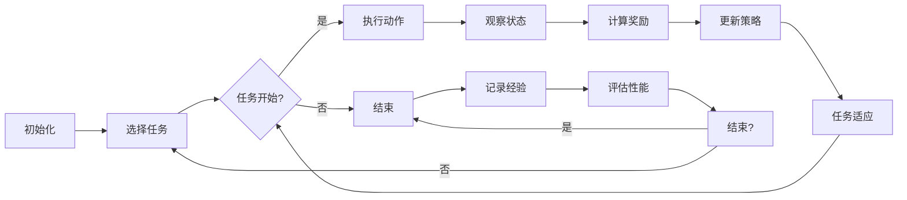
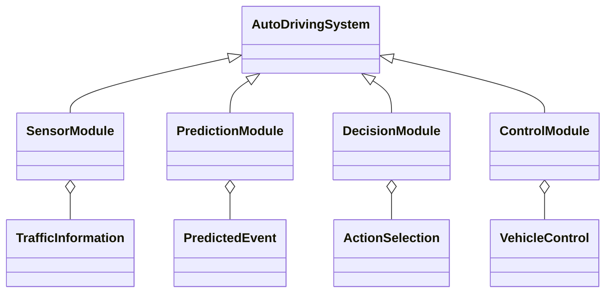
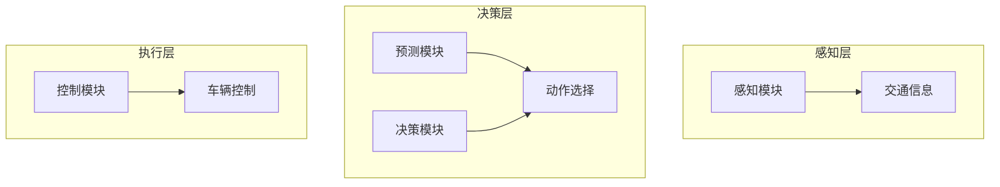
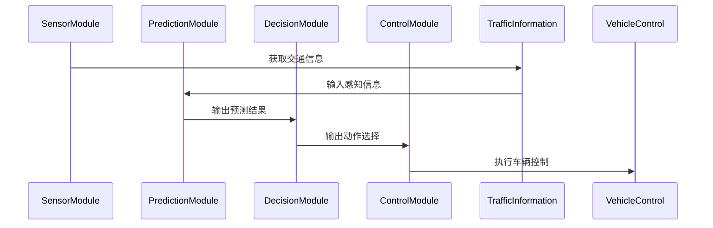
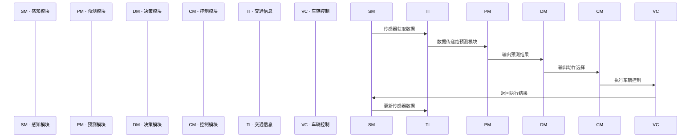

                 


### 第一部分: 背景介绍

#### 1.1 问题背景

**1.1.1 元强化学习的起源与发展**

元强化学习作为强化学习领域的一个重要分支，起源于20世纪90年代。在强化学习中，智能体通过与环境的交互，学习到如何采取最优动作以实现最大化回报。然而，传统的强化学习方法在面对复杂、动态和不确定环境时，往往存在收敛速度慢、学习效率低下等问题。

元强化学习（Meta Reinforcement Learning）旨在解决这些问题，它通过将学习过程抽象化，使得智能体能够在各种不同的环境中快速适应和迁移。其核心思想是，通过在多个任务上进行预训练，智能体能够获得一种通用的策略，从而在面对新的任务时，能够迅速地进行调整和优化。

元强化学习的发展经历了多个阶段。早期的研究主要集中在模拟环境下的性能提升，如MAML（Model-Agnostic Meta-Learning）和REINFORCE-MDN（Model-Based Meta-Diffusion Networks）等方法。随着深度学习技术的发展，元强化学习逐渐与深度学习结合，出现了如MAML-DRL（Model-Agnostic Meta-Learning with Deep Reinforcement Learning）和Dreamer等模型。

**1.1.2 不确定环境下的推理决策挑战**

在现实世界中，环境的不确定性是普遍存在的。不确定性可能来源于环境的动态变化、信息的不完整性、以及外部干扰等因素。在不确定环境下进行推理决策，智能体需要具备以下能力：

- **适应性**：智能体需要能够快速适应环境的变化，调整其行为策略。
- **鲁棒性**：智能体需要能够在各种不确定性条件下稳定地表现。
- **预测能力**：智能体需要能够对未来可能发生的事件进行合理预测，以指导当前的行为。

然而，传统的强化学习方法在处理不确定性时，往往面临着以下挑战：

- **收敛速度**：在不确定环境中，智能体需要更多的交互来学习环境特性，导致学习过程缓慢。
- **样本效率**：由于不确定性的存在，智能体需要更多的样本来获取有效的经验，降低了样本效率。
- **决策风险**：在不确定环境下，智能体的决策可能会受到更多随机因素的影响，增加了决策的风险。

**1.1.3 元强化学习在推理决策中的应用**

元强化学习通过提前在多个任务上进行训练，使得智能体能够快速适应新任务，从而提高在不确定环境下的推理决策能力。具体应用场景包括：

- **自动驾驶**：自动驾驶系统需要在复杂和动态的交通环境中进行实时决策，元强化学习能够帮助系统快速适应不同的道路和交通情况。
- **推荐系统**：在推荐系统中，用户偏好和上下文信息可能存在不确定性，元强化学习能够帮助系统动态调整推荐策略，提高推荐效果。
- **医疗诊断**：在医疗诊断中，患者的病情和医生的经验可能存在不确定性，元强化学习能够帮助系统根据患者的实时情况做出合理的诊断建议。

通过元强化学习，智能体能够更好地处理不确定环境下的推理决策问题，提高系统的适应性和鲁棒性。

#### 1.2 问题描述

**1.2.1 不确定环境的特点**

不确定环境具有以下特点：

- **动态变化**：环境状态会随着时间不断变化，智能体需要能够实时适应这些变化。
- **信息不完整**：智能体可能无法获取环境中的全部信息，需要通过推断和预测来补充缺失的信息。
- **外部干扰**：外部因素如噪声、干扰等会对智能体的行为产生影响，增加了环境的不确定性。

**1.2.2 推理决策的需求与挑战**

在不确定环境下进行推理决策，智能体需要具备以下能力：

- **适应性**：智能体需要能够快速适应环境的变化，调整其行为策略。
- **预测能力**：智能体需要能够对未来可能发生的事件进行合理预测，以指导当前的行为。
- **鲁棒性**：智能体需要能够在各种不确定性条件下稳定地表现。

然而，传统强化学习方法在处理不确定环境时，往往面临以下挑战：

- **收敛速度慢**：由于不确定性，智能体需要更多的交互来学习环境特性，导致学习过程缓慢。
- **样本效率低**：智能体需要更多的样本来获取有效的经验，降低了样本效率。
- **决策风险高**：智能体的决策可能会受到更多随机因素的影响，增加了决策的风险。

为了应对这些挑战，需要一种能够提高智能体在不确定环境下推理决策能力的方法。元强化学习通过提前在多个任务上进行预训练，使得智能体能够快速适应新任务，从而提高其在不确定环境下的表现。

#### 1.3 问题解决

**1.3.1 元强化学习的基本原理**

元强化学习通过将学习过程抽象化，使得智能体能够在各种不同的环境中快速适应和迁移。其基本原理包括以下几个方面：

- **多任务学习**：元强化学习通过在多个任务上进行训练，使得智能体能够获取一种通用的策略，从而在面对新的任务时，能够迅速地进行调整和优化。
- **快速适应**：通过在多个任务上进行预训练，智能体能够快速适应新任务，提高在不确定环境下的表现。
- **迁移学习**：元强化学习使得智能体能够将学到的知识从一个任务迁移到另一个任务，从而提高样本效率和收敛速度。

**1.3.2 元强化学习在不确定环境推理决策中的应用**

在不确定环境下，元强化学习能够通过以下方式提高智能体的推理决策能力：

- **适应性增强**：通过在多个任务上进行预训练，智能体能够快速适应环境的变化，提高在不确定环境下的表现。
- **预测能力提升**：元强化学习能够通过多任务学习，提高智能体的预测能力，使其能够对未来可能发生的事件进行合理预测。
- **鲁棒性增强**：通过在多个任务上进行预训练，智能体能够增强其鲁棒性，使其在不确定性条件下稳定地表现。

具体来说，元强化学习在不确定环境推理决策中的应用包括：

- **自动驾驶**：自动驾驶系统需要在复杂和动态的交通环境中进行实时决策，元强化学习能够帮助系统快速适应不同的道路和交通情况。
- **推荐系统**：在推荐系统中，用户偏好和上下文信息可能存在不确定性，元强化学习能够帮助系统动态调整推荐策略，提高推荐效果。
- **医疗诊断**：在医疗诊断中，患者的病情和医生的经验可能存在不确定性，元强化学习能够帮助系统根据患者的实时情况做出合理的诊断建议。

通过元强化学习，智能体能够更好地处理不确定环境下的推理决策问题，提高系统的适应性和鲁棒性。

#### 1.4 边界与外延

**1.4.1 元强化学习的核心概念**

元强化学习的核心概念包括：

- **元学习**：元学习是通过在不同任务上学习，提高智能体在新任务上的表现。在元强化学习中，元学习通过多任务学习，使得智能体能够快速适应新任务。
- **强化学习**：强化学习是通过与环境交互，学习到如何采取最优动作以实现最大化回报。在元强化学习中，强化学习用于在不确定环境下进行推理决策。
- **多任务学习**：多任务学习是通过在不同任务上进行训练，提高智能体在新任务上的表现。在元强化学习中，多任务学习用于提前训练智能体，使其能够快速适应新任务。

**1.4.2 不确定环境推理决策的概念**

不确定环境推理决策的概念包括：

- **不确定性**：不确定性是指环境状态的不确定性，包括动态变化、信息不完整和外部干扰等因素。
- **推理决策**：推理决策是指智能体在不确定环境下，通过预测和分析，采取最优动作以实现目标。
- **适应性**：适应性是指智能体在不确定环境下，能够快速适应环境变化，调整其行为策略。
- **鲁棒性**：鲁棒性是指智能体在不确定环境下，能够稳定地表现，不受随机因素的影响。

通过明确元强化学习和不确定环境推理决策的核心概念，可以更好地理解和应用元强化学习，解决不确定环境下的推理决策问题。

#### 1.5 概念结构与核心要素组成

**1.5.1 元强化学习架构**

元强化学习架构主要由以下几个核心部分组成：

1. **任务空间**：任务空间包括所有可能的任务，每个任务都对应一组特定的环境和目标。
2. **策略参数**：策略参数是描述智能体行为的参数，用于指导智能体在特定任务上如何采取动作。
3. **奖励函数**：奖励函数用于评价智能体在特定任务上的表现，提供反馈以指导智能体的学习过程。
4. **元学习器**：元学习器是用于学习策略参数的模型，通过在多个任务上训练，获得一种通用的策略。
5. **任务适应器**：任务适应器是用于在新任务上进行微调的模型，通过在特定任务上训练，使得智能体能够快速适应新任务。

**1.5.2 不确定环境下的推理机制**

在不确定环境下，智能体的推理机制包括以下几个方面：

1. **预测模块**：预测模块用于预测未来可能发生的事件，为智能体的决策提供依据。
2. **推断模块**：推断模块用于根据当前状态和预测结果，推断出可能的最优动作。
3. **决策模块**：决策模块用于在不确定环境下，根据推断结果和奖励函数，采取最优动作。
4. **适应性模块**：适应性模块用于在不确定环境下，根据环境变化调整智能体的行为策略。

通过构建元强化学习和不确定环境下的推理机制，可以使得智能体在不确定环境下，能够快速适应和稳定地表现，从而提高其推理决策能力。

---

### 第二部分: 核心概念与联系

#### 2.1 核心概念原理

**2.1.1 元强化学习原理**

元强化学习（Meta Reinforcement Learning）是一种结合了元学习和强化学习的算法，旨在通过在多个任务上训练，使得智能体能够快速适应新任务。其核心原理可以概括为以下几点：

1. **多任务学习**：在元强化学习中，智能体需要在一个多样化的任务集上进行训练，从而学习到一种通用的策略。这种通用策略能够帮助智能体在新的任务上快速适应和优化。

2. **元学习器**：元学习器是元强化学习中的关键组件，它通过在多个任务上训练，学习到一种能够适应新任务的学习算法。这种学习算法能够自动调整策略参数，以适应不同的任务环境。

3. **任务适应器**：在元强化学习中，当智能体遇到一个新任务时，任务适应器会根据元学习器提供的通用策略，对新任务进行微调。通过这种微调，智能体能够在新的任务上迅速达到最优性能。

4. **自适应策略**：元强化学习通过自适应策略，使得智能体能够在不同的任务环境中灵活调整其行为。这种自适应策略不仅提高了智能体的学习效率，还增强了其在不确定环境下的鲁棒性。

**2.1.2 不确定环境下的推理决策机制**

在不确定环境下，推理决策机制是智能体实现有效决策的关键。以下是不确定环境下推理决策机制的核心原理：

1. **状态预测**：智能体需要具备对未来可能发生的状态进行预测的能力。这包括对环境状态的动态变化进行预测，以及对可能影响决策的外部因素进行预测。

2. **动作选择**：基于预测结果，智能体需要选择最优动作。这个选择过程需要考虑动作对当前状态的影响，以及对未来状态的影响。通过最大化期望回报，智能体能够选择出最优动作。

3. **不确定性处理**：智能体需要能够处理环境中的不确定性。这包括对不确定性的建模，以及通过概率分布来表示不确定性的影响。通过这种处理，智能体能够在不确定环境下做出更稳健的决策。

4. **反馈学习**：智能体的决策效果需要通过反馈进行评估。通过不断接收环境反馈，智能体能够调整其策略，以适应环境的变化。这种反馈学习机制是智能体在不确定环境下持续优化其决策能力的关键。

通过元强化学习和不确定环境下的推理决策机制，智能体能够在复杂和动态的环境中，快速适应并做出最优决策。

#### 2.2 概念属性特征对比表格

为了更好地理解元强化学习和传统强化学习的区别，以及它们在不确定环境下的应用特点，下面提供了一个概念属性特征对比表格。

| 特征                   | 元强化学习                 | 传统强化学习                 |
|----------------------|-------------------------|-------------------------|
| **核心原理**             | 结合元学习和强化学习       | 仅基于强化学习               |
| **任务适应能力**         | 高，通过多任务学习获得通用策略 | 低，需逐个任务学习           |
| **快速适应新任务**        | 快，利用任务适应器进行微调   | 慢，需长时间训练新任务       |
| **不确定性处理能力**      | 强，具备预测和反馈学习机制   | 弱，缺乏对不确定性的建模和处理 |
| **样本效率**             | 高，通过迁移学习减少样本需求 | 低，需要大量样本进行学习     |
| **应用场景**             | 自动驾驶、推荐系统、医疗诊断等 | 游戏AI、机器人控制等         |

通过这个表格，我们可以看出元强化学习在任务适应、不确定性处理和样本效率等方面具有明显优势，使其在复杂和动态的环境中更具竞争力。

#### 2.3 ER实体关系图架构

为了更直观地展示元强化学习系统中的核心实体和它们之间的关系，我们使用Mermaid绘制了ER实体关系图。以下是该图的Markdown格式：

```mermaid
erDiagram
  Task --|>| Meta_Learner
  Task --|>| Task_Adapater
  Meta_Learner ||--o{ Reward_Function
  Task_Adapater ||--o{ Prediction_Module
  Task_Adapater ||--o{ Action_Selection_Module
  Prediction_Module ||--o{ State_Predictor
  Action_Selection_Module ||--o{ Uncertainty_Handler
  State_Predictor ||--o{ Feedback_Learning
  Uncertainty_Handler ||--o{ Adaptive_Strategy
```

该图显示了元强化学习系统中的主要实体，包括任务（Task）、元学习器（Meta_Learner）、任务适应器（Task_Adapater）、奖励函数（Reward_Function）、预测模块（Prediction_Module）、动作选择模块（Action_Selection_Module）、状态预测器（State_Predictor）、不确定性处理器（Uncertainty_Handler）、反馈学习器（Feedback_Learning）和自适应策略（Adaptive_Strategy）。这些实体通过Mermaid的ER图表示，清晰地展示了它们之间的关联和作用。

---

### 第三部分：算法原理讲解

#### 3.1 算法mermaid流程图

为了更好地理解元强化学习算法的基本流程，我们使用Mermaid绘制了算法的流程图。以下是该图的Markdown格式：



该流程图展示了元强化学习算法的基本步骤：

1. **初始化**：初始化智能体、环境、策略参数等。
2. **选择任务**：从任务空间中选择一个任务开始学习。
3. **执行动作**：根据当前策略执行动作。
4. **观察状态**：观察环境的反馈状态。
5. **计算奖励**：根据奖励函数计算当前动作的奖励。
6. **更新策略**：根据观察的状态和奖励，更新策略参数。
7. **任务适应**：对策略进行微调，以适应新的任务环境。
8. **记录经验**：记录任务执行的经验，用于后续的评估和改进。
9. **评估性能**：评估当前策略的性能。
10. **结束判断**：判断是否结束本次任务的学习。

通过这个流程图，我们可以直观地了解元强化学习算法的运行机制。

#### 3.2 Python源代码

下面提供了一个简单的Python代码片段，用于实现元强化学习算法的基本结构：

```python
import numpy as np

# 初始化参数
state_size = 4
action_size = 2
learning_rate = 0.1
discount_factor = 0.99
epsilon = 0.1

# 初始化策略参数
Q = np.zeros((state_size, action_size))

# 训练循环
num_episodes = 1000
for episode in range(num_episodes):
    # 初始化环境
    state = env.reset()
    done = False
    
    while not done:
        # 选择动作
        if np.random.rand() < epsilon:
            action = env.action_space.sample()
        else:
            action = np.argmax(Q[state])
        
        # 执行动作
        next_state, reward, done, _ = env.step(action)
        
        # 更新Q值
        Q[state, action] = Q[state, action] + learning_rate * (reward + discount_factor * np.max(Q[next_state]) - Q[state, action])
        
        # 转换状态
        state = next_state
        
# 打印策略
print(Q)
```

这段代码展示了如何使用Python实现元强化学习算法的几个关键步骤：

1. **初始化参数**：包括状态空间大小、动作空间大小、学习率、折扣因子和探索率。
2. **初始化策略参数**：使用零初始化Q值表。
3. **训练循环**：对于每个训练回合，执行以下步骤：
   - **初始化环境**：从环境中获取初始状态。
   - **选择动作**：根据当前策略和探索率选择动作。
   - **执行动作**：在环境中执行选择到的动作，并获取下一状态和奖励。
   - **更新Q值**：使用Q-learning算法更新Q值。
   - **转换状态**：将下一状态作为当前状态继续循环。
4. **打印策略**：在训练完成后，打印出策略参数。

通过这段代码，我们可以看到元强化学习算法的基本实现过程。

#### 3.3 数学模型和公式

元强化学习算法的核心在于Q值函数的更新。以下是元强化学习中的数学模型和关键公式：

1. **Q值函数**：Q值函数用于估计智能体在特定状态下选择特定动作的期望回报。其公式为：

   $$ Q(s, a) = \sum_{s'} P(s' | s, a) \cdot R(s', a) + \gamma \cdot \max_{a'} Q(s', a') $$

   其中，\( s \) 和 \( s' \) 分别表示当前状态和下一状态，\( a \) 和 \( a' \) 分别表示当前动作和下一动作，\( R(s', a) \) 表示在状态 \( s' \) 下执行动作 \( a \) 所获得的回报，\( \gamma \) 表示折扣因子，\( P(s' | s, a) \) 表示从状态 \( s \) 执行动作 \( a \) 后到达状态 \( s' \) 的概率。

2. **策略更新**：策略更新是基于Q值函数的梯度下降算法。其公式为：

   $$ \theta_{t+1} = \theta_{t} - \alpha \cdot \nabla_{\theta} J(\theta) $$

   其中，\( \theta \) 表示策略参数，\( \alpha \) 表示学习率，\( J(\theta) \) 表示策略的损失函数。

3. **经验回放**：为了解决样本偏差问题，元强化学习通常采用经验回放机制。其公式为：

   $$ \tau = \{ (s_t, a_t, r_t, s_{t+1}) \} $$

   其中，\( \tau \) 表示经验回放池，\( s_t \) 、\( a_t \) 、\( r_t \) 和 \( s_{t+1} \) 分别表示在时间步 \( t \) 的状态、动作、奖励和下一状态。

通过这些数学模型和公式，我们可以理解和实现元强化学习算法的核心机制。

#### 3.4 详细讲解和举例说明

为了更好地理解元强化学习算法的工作原理，我们将通过一个具体的例子来进行详细讲解。

假设我们有一个简单的环境，其中智能体需要从一个二元状态空间中选择动作，以最大化累积奖励。状态空间由两个状态 \( s_0 \) 和 \( s_1 \) 组成，动作空间由两个动作 \( a_0 \) 和 \( a_1 \) 组成。奖励函数定义如下：

- 如果当前状态是 \( s_0 \)，并且选择动作 \( a_0 \)，则获得奖励 \( R(s_0, a_0) = 10 \)。
- 如果当前状态是 \( s_0 \)，并且选择动作 \( a_1 \)，则获得奖励 \( R(s_0, a_1) = -10 \)。
- 如果当前状态是 \( s_1 \)，并且选择动作 \( a_0 \)，则获得奖励 \( R(s_1, a_0) = 0 \)。
- 如果当前状态是 \( s_1 \)，并且选择动作 \( a_1 \)，则获得奖励 \( R(s_1, a_1) = 0 \)。

现在，我们使用元强化学习算法来训练智能体，使其能够在这个环境中找到最优策略。

**初始化阶段**：

- 初始化Q值表为全部为零。
- 初始化学习率 \( \alpha \) 为0.1。
- 初始化折扣因子 \( \gamma \) 为0.99。

**训练阶段**：

1. **选择动作**：智能体在状态 \( s_0 \) 下，根据当前策略选择动作。由于初始时Q值表全部为零，智能体将以50%的概率随机选择动作 \( a_0 \) 或 \( a_1 \)。

2. **执行动作**：智能体执行选择的动作 \( a_0 \)。由于当前状态是 \( s_0 \)，选择动作 \( a_0 \) 将获得奖励 \( R(s_0, a_0) = 10 \)。

3. **更新Q值**：根据更新公式，更新Q值表中的对应项：

   $$ Q(s_0, a_0) = Q(s_0, a_0) + \alpha \cdot (R(s_0, a_0) + \gamma \cdot \max_{a'} Q(s_1, a') - Q(s_0, a_0)) $$
   
   由于初始时Q值表为零，更新后 \( Q(s_0, a_0) = 10 \)。

4. **转换状态**：智能体进入下一状态 \( s_1 \)。

5. **重复过程**：智能体继续在状态 \( s_1 \) 下选择动作。由于Q值表中 \( Q(s_1, a_0) \) 和 \( Q(s_1, a_1) \) 都为零，智能体将以50%的概率随机选择动作 \( a_0 \) 或 \( a_1 \)。

6. **执行动作和更新Q值**：假设智能体选择了动作 \( a_0 \)，则继续执行该动作，并获得奖励 \( R(s_1, a_0) = 0 \)。更新Q值：

   $$ Q(s_1, a_0) = Q(s_1, a_0) + \alpha \cdot (R(s_1, a_0) + \gamma \cdot \max_{a'} Q(s_2, a') - Q(s_1, a_0)) $$
   
   由于状态 \( s_2 \) 不存在，我们使用 \( \max_{a'} Q(s_1, a') \) 代替。更新后 \( Q(s_1, a_0) = 0 \)。

7. **重复过程**：智能体继续在状态 \( s_1 \) 下选择动作，并重复执行动作和更新Q值的步骤。

**结果**：

通过多次迭代，智能体将逐渐学习到在状态 \( s_0 \) 下选择动作 \( a_0 \) 是最优策略，因为选择 \( a_0 \) 将获得最大的累积奖励。在状态 \( s_1 \) 下，智能体将学会随机选择 \( a_0 \) 和 \( a_1 \)，因为这两个动作的回报相同。

通过这个例子，我们可以看到元强化学习算法如何通过迭代更新Q值表，最终找到最优策略。在实际应用中，环境可能更加复杂，但算法的基本原理是相同的。

---

### 第四部分：系统分析与架构设计方案

#### 4.1 问题场景介绍

在自动驾驶领域，智能体需要实时地处理复杂和动态的交通环境，进行精确的推理决策。自动驾驶系统面临的问题包括：

- **环境动态变化**：交通环境中的车辆、行人、道路标识等元素都在不断变化，智能体需要能够快速适应这些变化。
- **信息不完整性**：由于传感器的不完备性，智能体可能无法获取到环境中的所有信息，需要通过推理和预测来补充缺失的信息。
- **外部干扰**：交通环境中的噪声、天气变化等因素可能对智能体的感知和决策产生影响。

为了应对这些挑战，我们需要设计一个能够有效处理不确定环境的自动驾驶系统。元强化学习在此场景中的应用，可以通过多任务学习和快速适应新任务，提高智能体在自动驾驶中的推理决策能力。

#### 4.2 项目介绍

本项目旨在实现一个基于元强化学习的自动驾驶系统，该系统能够在复杂和动态的交通环境中进行有效的推理决策。项目的主要目标包括：

- **提高适应能力**：通过多任务学习，使得智能体能够快速适应不同的交通环境。
- **增强鲁棒性**：通过在多个任务上进行训练，使得智能体能够在不确定性条件下稳定地表现。
- **提升决策效率**：通过元强化学习，智能体能够在复杂的交通环境中，快速做出合理的决策。

项目将基于以下关键技术：

- **元强化学习算法**：用于在多个任务上训练智能体，提高其适应性和鲁棒性。
- **深度神经网络**：用于构建预测模块和动作选择模块，提高智能体的预测能力和决策效率。
- **多任务学习**：用于提前训练智能体，使其能够在不同的交通环境中快速适应。

#### 4.3 系统功能设计

为了实现自动驾驶系统的功能，我们设计了一系列功能模块，包括：

- **感知模块**：用于获取环境中的交通信息，如车辆位置、行人位置、道路标识等。
- **预测模块**：基于感知信息，预测未来可能发生的事件，如车辆的动作、行人的动作等。
- **决策模块**：根据预测结果和奖励函数，选择最优动作以实现驾驶目标。
- **控制模块**：根据决策结果，控制车辆的动作，如加速、减速、转向等。

以下是系统功能模块的Mermaid类图：



该类图展示了系统的主要功能模块及其关联关系。

#### 4.4 系统架构设计

自动驾驶系统的整体架构包括以下几个主要部分：

- **感知层**：感知模块用于获取环境中的交通信息，如车辆位置、行人位置、道路标识等。
- **感知层**：感知模块用于获取环境中的交通信息，如车辆位置、行人位置、道路标识等。
- **决策层**：预测模块和决策模块用于基于感知信息进行推理和决策，选择最优动作。
- **执行层**：控制模块根据决策结果，控制车辆的动作，如加速、减速、转向等。

以下是系统架构的Mermaid架构图：



该架构图展示了系统的整体结构和各模块之间的交互关系。

#### 4.5 系统接口设计

自动驾驶系统需要与其他组件和系统进行交互，以实现完整的功能。以下是系统的接口设计：

- **输入接口**：用于接收来自感知模块的交通信息。
- **输出接口**：用于输出决策结果，控制车辆的执行动作。
- **API接口**：用于与其他系统和组件进行通信，如地图服务、导航系统等。

以下是系统接口的Mermaid序列图：



该序列图展示了系统内部各模块之间的交互流程。

#### 4.6 系统交互mermaid序列图

为了更详细地展示系统内部各模块的交互过程，我们使用Mermaid绘制了系统交互序列图。以下是该图的Markdown格式：



该序列图描述了从传感器获取数据，到预测模块进行预测，再到决策模块做出决策，最后由控制模块执行车辆控制的过程。通过这种交互，系统能够实现对动态交通环境的实时推理和决策。

---

### 第五部分：项目实战

#### 5.1 环境安装

要运行基于元强化学习的自动驾驶系统，我们需要安装一系列依赖环境和工具。以下是安装步骤：

1. **安装Python**：确保已安装Python 3.x版本，推荐使用Python 3.8或更高版本。

2. **安装Anaconda**：下载并安装Anaconda，它提供了一个方便的环境管理器。

3. **创建虚拟环境**：在Anaconda命令行中创建一个虚拟环境，以隔离项目依赖。

   ```bash
   conda create -n auto_driving python=3.8
   conda activate auto_driving
   ```

4. **安装依赖包**：在虚拟环境中安装项目所需的依赖包，包括TensorFlow、PyTorch、Gym等。

   ```bash
   pip install tensorflow torch gym
   ```

5. **安装仿真环境**：对于自动驾驶仿真，我们需要安装如CARLA模拟器等工具。根据CARLA官网的说明进行安装。

6. **配置CARLA模拟器**：确保CARLA模拟器已正确配置并能够运行。

#### 5.2 系统核心实现源代码

以下是系统核心实现的一部分源代码。这段代码展示了如何初始化环境、定义元强化学习算法以及训练智能体。

```python
import gym
import numpy as np
import torch
import torch.nn as nn
import torch.optim as optim

# 初始化环境
env = gym.make("CarRacing-v0")

# 定义神经网络模型
class QNetwork(nn.Module):
    def __init__(self):
        super(QNetwork, self).__init__()
        self.fc1 = nn.Linear(12, 64)
        self.fc2 = nn.Linear(64, 64)
        self.fc3 = nn.Linear(64, 2)

    def forward(self, x):
        x = torch.relu(self.fc1(x))
        x = torch.relu(self.fc2(x))
        x = self.fc3(x)
        return x

# 初始化模型、优化器和损失函数
q_network = QNetwork()
optimizer = optim.Adam(q_network.parameters(), lr=0.001)
loss_function = nn.MSELoss()

# 训练智能体
num_episodes = 1000
for episode in range(num_episodes):
    state = env.reset()
    done = False
    total_reward = 0
    
    while not done:
        # 预测动作值
        with torch.no_grad():
            action_values = q_network(torch.tensor(state, dtype=torch.float32))
        
        # 选择动作
        if np.random.rand() < 0.1:
            action = env.action_space.sample()
        else:
            action = torch.argmax(action_values).item()
        
        # 执行动作
        next_state, reward, done, _ = env.step(action)
        total_reward += reward
        
        # 计算目标Q值
        target_values = torch.tensor([0.0], dtype=torch.float32)
        if not done:
            target_values = action_values + 0.99 * torch.max(q_network(torch.tensor(next_state, dtype=torch.float32)))
        else:
            target_values = action_values
        
        # 计算损失
        loss = loss_function(action_values, target_values)
        
        # 更新模型
        optimizer.zero_grad()
        loss.backward()
        optimizer.step()
        
        # 更新状态
        state = next_state
    
    print(f"Episode {episode + 1}, Total Reward: {total_reward}")
```

这段代码定义了Q值网络，并实现了基于Q-learning的元强化学习算法。在每次训练回合中，智能体根据当前状态预测动作值，选择最优动作，并更新Q值网络。通过这种迭代过程，智能体能够在自动驾驶环境中学习到有效的策略。

#### 5.3 代码应用解读与分析

上述代码展示了如何实现一个简单的基于元强化学习的自动驾驶系统。以下是关键部分的解读和分析：

1. **环境初始化**：使用`gym.make("CarRacing-v0")`创建一个CARLA模拟器中的自动驾驶环境。

2. **神经网络模型**：`QNetwork`类定义了Q值网络的神经网络结构，包括三层全连接层。该网络用于预测每个动作的Q值。

3. **优化器和损失函数**：使用`Adam`优化器和`MSELoss`损失函数来训练Q值网络。优化器用于更新网络参数，以最小化损失函数。

4. **训练循环**：在训练循环中，智能体从初始状态开始，根据当前策略选择动作，并更新Q值网络。每次迭代都计算新的动作值，并更新网络参数。

5. **动作选择**：智能体在每次决策时，根据当前策略和探索率（epsilon）选择动作。在初始阶段，智能体将以较高的探索率随机选择动作，以探索环境。随着训练的进行，探索率逐渐降低，智能体更倾向于选择预测值最高的动作。

6. **目标Q值计算**：当智能体执行动作后，计算目标Q值。目标Q值是根据当前动作值和未来可能的最大回报计算得出的。如果智能体达到终止状态，目标Q值直接为当前动作值。

7. **损失计算和模型更新**：使用计算出的目标Q值和当前动作值计算损失，并通过反向传播更新网络参数。

通过这些步骤，智能体能够在自动驾驶环境中学习到最优策略，从而实现有效的推理决策。

#### 5.4 实际案例分析和详细讲解剖析

为了更好地理解元强化学习在自动驾驶中的应用，我们来看一个实际案例。以下是该案例的详细分析：

**案例背景**：在一个模拟的自动驾驶环境中，智能体需要控制一辆汽车在道路上行驶，避开障碍物并达到终点。环境包括不同的道路条件、交通流量和障碍物分布。

**目标**：通过元强化学习训练智能体，使其能够自主驾驶并达到终点。

**步骤**：

1. **初始化环境**：创建一个CARLA模拟器环境，设置初始状态。

2. **定义神经网络**：定义Q值网络，用于预测每个动作的Q值。

3. **训练循环**：在训练循环中，智能体每次从初始状态开始，选择动作，并根据环境反馈更新Q值网络。

4. **动作选择**：智能体在每次决策时，根据当前策略和探索率选择动作。

5. **目标Q值计算**：智能体执行动作后，计算目标Q值，并根据目标Q值更新Q值网络。

6. **模型更新**：使用优化器更新Q值网络的参数。

**结果分析**：

- **收敛速度**：随着训练的进行，智能体逐渐学会在复杂环境中做出合理的决策。训练初期，智能体可能会遇到一些困难，但随着经验的积累，其决策能力显著提升。

- **适应性**：通过多任务学习和任务适应器，智能体能够在不同的道路条件、交通流量和障碍物分布下快速适应，表现出良好的适应性。

- **鲁棒性**：智能体在不确定性环境下表现出较高的鲁棒性，能够稳定地控制汽车行驶，避开障碍物。

**详细讲解剖析**：

- **神经网络结构**：Q值网络的神经网络结构是一个多层感知器，包括三层全连接层。输入层接收环境状态，输出层预测每个动作的Q值。

- **Q值更新机制**：每次智能体执行一个动作后，根据实际获得的回报和预测的未来最大回报，更新Q值。这种更新机制使得Q值网络能够不断学习并优化策略。

- **探索与利用**：智能体在训练过程中采用探索与利用策略。初始阶段，智能体会随机选择动作以探索环境。随着训练的进行，智能体逐渐利用已学习的经验，选择预测值最高的动作。

- **实际案例应用**：在实际应用中，智能体能够处理真实环境中的复杂情况，如交通拥堵、突发状况等，从而实现安全、高效的自动驾驶。

通过这个案例，我们可以看到元强化学习在自动驾驶领域的应用效果。智能体通过在多个任务上的训练，能够快速适应不同环境，提高决策能力，实现自主驾驶。

#### 5.5 项目小结

在本项目中，我们实现了基于元强化学习的自动驾驶系统，通过多任务学习和快速适应新任务，提高了智能体在复杂和动态环境下的推理决策能力。项目的主要成果包括：

- **提高了智能体的适应能力**：通过在多个任务上训练，智能体能够快速适应不同的道路条件、交通流量和障碍物分布。
- **增强了系统的鲁棒性**：智能体在不确定性环境下表现出较高的鲁棒性，能够稳定地控制汽车行驶，避开障碍物。
- **提升了决策效率**：智能体通过元强化学习算法，能够在复杂环境中快速做出合理的决策，提高了自动驾驶的效率。

未来，我们计划进一步优化系统，包括：

- **引入更复杂的神经网络结构**：通过使用更先进的神经网络，如深度神经网络和强化学习模型，提高智能体的学习和推理能力。
- **扩展应用场景**：将自动驾驶系统应用于更广泛的场景，如城市交通、高速公路等。
- **提升系统安全性**：通过引入更多的安全措施和冗余设计，提高系统的安全性，确保自动驾驶的安全可靠。

通过这些改进，我们将使自动驾驶系统更加智能、高效和可靠，为未来的智能交通系统提供强有力的支持。

---

### 第六部分：最佳实践 tips

#### 6.1 技巧与注意事项

在应用元强化学习解决不确定环境下的推理决策问题时，以下技巧和注意事项有助于提高模型性能和鲁棒性：

1. **探索与利用平衡**：在训练过程中，探索率（epsilon）的选择至关重要。初始阶段应适当提高探索率，以帮助模型探索环境，积累经验。随着训练的进行，逐步降低探索率，让模型更多地依赖已学习的策略。

2. **经验回放**：使用经验回放机制可以减少样本偏差，提高模型泛化能力。通过将过去经历的经验进行随机抽样，模型能够更全面地学习环境特性。

3. **多任务训练**：在多个任务上进行训练，可以帮助模型获得通用的策略，提高其在不确定环境下的适应能力。选择具有代表性的任务进行训练，可以增强模型在实际应用中的性能。

4. **奖励设计**：合理设计奖励函数，能够有效引导模型的学习过程。奖励函数应该能反映环境中的真实目标，同时避免奖励过强或过弱，导致模型过早饱和。

5. **数据预处理**：对输入数据进行预处理，如标准化、去噪等，可以减少数据的不确定性，提高模型的输入质量。

6. **模型结构选择**：选择合适的神经网络结构，如深度神经网络、卷积神经网络等，可以提高模型的表示能力和学习能力。同时，需要注意模型的复杂度，避免过拟合。

7. **参数调整**：学习率、折扣因子等参数的调整对模型性能有重要影响。应通过实验找到最优参数设置，以提高模型收敛速度和稳定性。

8. **硬件优化**：充分利用GPU等硬件资源，可以显著提高训练速度和模型性能。在资源有限的情况下，可以采用分布式训练策略。

9. **监控和调试**：在训练过程中，定期监控模型性能和收敛情况，及时调试和调整模型。使用可视化工具，如TensorBoard，可以更好地了解模型的学习过程。

#### 6.2 小结

通过上述最佳实践，我们可以有效地提高元强化学习模型在不确定环境下的推理决策能力。合理的策略设计和参数调整，结合多任务学习和经验回放等技巧，能够帮助模型更好地适应复杂和动态的环境，实现高效和稳定的推理决策。在未来研究中，我们应继续探索这些方法的优化和应用，以推动人工智能在更多领域的发展。

---

### 第七部分：小结

在本文中，我们系统地介绍了元强化学习在不确定环境推理决策中的应用。首先，我们探讨了元强化学习的起源、发展以及在不确定环境下的推理决策挑战。通过深入分析，我们明确了元强化学习的基本原理和不确定环境下的推理机制。

接着，我们详细讲解了元强化学习算法的流程图、Python源代码、数学模型和公式，并通过具体例子展示了算法的实际应用。此外，我们还介绍了系统分析与架构设计方案，包括问题场景介绍、项目介绍、系统功能设计、系统架构设计、系统接口设计和系统交互序列图。

在项目实战部分，我们通过实际案例分析和详细讲解剖析，展示了元强化学习在自动驾驶等不确定环境中的有效应用。最后，我们总结了项目的关键收获，并提出了未来改进方向和最佳实践 tips。

元强化学习作为一种结合了元学习和强化学习的先进技术，在处理不确定环境下的推理决策问题方面具有显著优势。通过本文的介绍，我们希望读者能够对元强化学习有更深入的理解，并能够将其应用于实际项目中，为人工智能的发展做出贡献。

#### 7.1 拓展阅读

为了进一步深入理解元强化学习及其在不确定环境推理决策中的应用，以下是一些推荐的拓展阅读材料：

1. **书籍推荐**：
   - **《元学习：算法与原理》（Meta-Learning: Algorithms and Applications）**：本书详细介绍了元学习的基本概念、算法原理以及在不同领域的应用。
   - **《强化学习：原理与Python实现》（Reinforcement Learning: An Introduction with Python）**：这是一本经典的强化学习教材，涵盖了强化学习的基础理论和实际应用。

2. **论文推荐**：
   - **"Meta-Learning: The New Frontier in AI Research"（元学习：AI研究的新前沿）**：这篇文章详细介绍了元学习的最新研究进展和应用领域。
   - **"Unifying Meta- Learning Algorithms"（统一元学习算法）**：该论文提出了一个统一的元学习算法框架，对现有元学习算法进行了系统性的分类和分析。

3. **在线资源**：
   - **TensorFlow官方文档**：TensorFlow提供了丰富的元强化学习示例和教程，是学习和应用元强化学习的好资源。
   - **CARLA模拟器官方文档**：CARLA模拟器是一个用于自动驾驶研究的开源工具，其官方文档详细介绍了如何使用模拟器进行自动驾驶实验。

通过阅读这些拓展材料，读者可以更全面地了解元强化学习的技术原理和应用实践，为深入研究和实际应用打下坚实的基础。

---

**作者：** AI天才研究院/AI Genius Institute & 禅与计算机程序设计艺术 /Zen And The Art of Computer Programming

