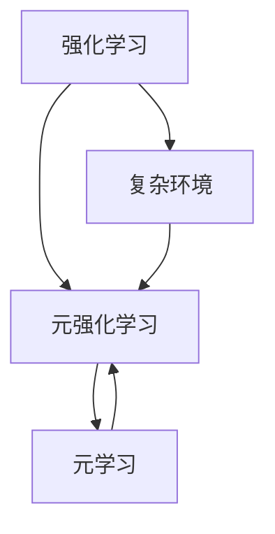
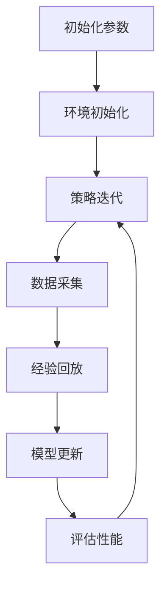
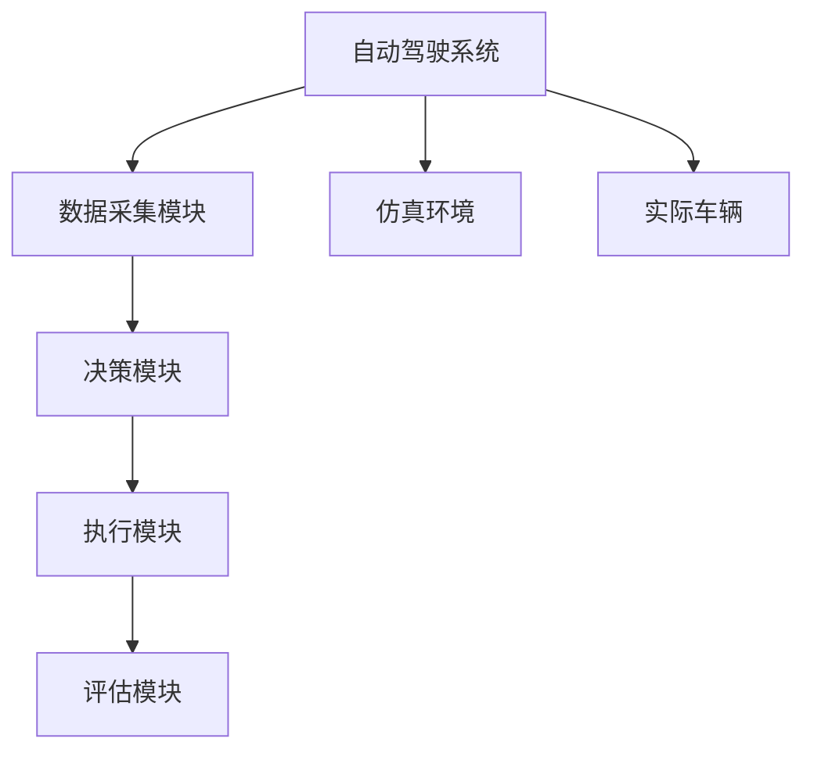
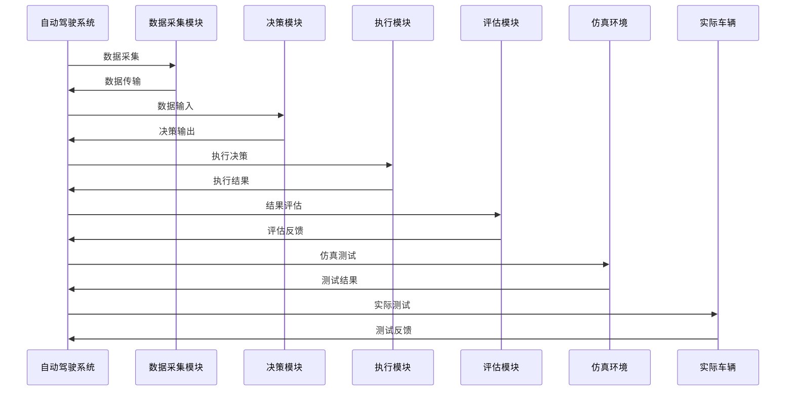
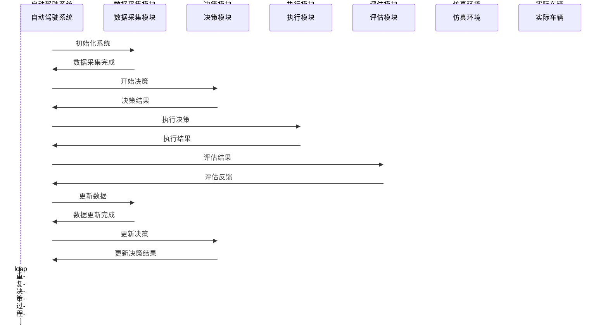

                 

### 1. 引言

在人工智能的广阔领域中，强化学习已经证明其在解决动态决策问题和环境互动方面具有巨大的潜力。然而，当环境变得异常复杂，传统强化学习算法的效率常常受到限制。这时，元强化学习作为一种高级的强化学习范式，应运而生。本文旨在深入探讨元强化学习在复杂环境决策中的应用，帮助读者理解这一前沿技术，并掌握其核心原理和应用方法。

《元强化学习在复杂环境决策中的应用》这本书旨在为读者提供一个系统化的学习路径，从基础概念到高级算法，再到实际应用，全方位剖析元强化学习的精髓。通过本书，读者不仅可以掌握元强化学习的基本原理，还能学会如何将其应用于各种复杂的决策场景中，从而为人工智能的发展贡献自己的力量。

本书的目标读者包括对人工智能和机器学习有浓厚兴趣的科研人员、工程师和研究生，以及对强化学习和元学习有一定了解的技术爱好者。无论你是初学者还是有一定基础的专业人士，本书都将为你提供丰富的知识和实用的技巧，帮助你更好地理解和应用元强化学习。

接下来，我们将分章节详细探讨元强化学习的历史发展、核心概念、算法原理、数学模型、系统架构设计方案以及实际项目实战。让我们一步一步地深入探讨这一前沿领域，共同揭开元强化学习的神秘面纱。### 2. 背景介绍

#### 2.1 元强化学习的起源与发展

元强化学习（Meta Reinforcement Learning）的概念最早由Agrawal等人于2015年提出。它结合了强化学习和元学习（Meta-Learning）的优势，旨在通过快速学习和适应来提高智能体在复杂环境中的决策能力。强化学习是一种通过与环境的交互来学习最优行为策略的方法，而元学习则是一种让算法能够通过少量数据快速学习新任务的能力。二者的结合，使得元强化学习在处理复杂和动态环境时，展现出前所未有的效率和鲁棒性。

元强化学习的发展经历了几个重要的阶段。早期的探索主要集中在如何通过迁移学习来减少新任务的训练时间，随后逐渐发展到研究如何让算法能够在多个任务之间共享知识和策略。当前，元强化学习的研究已经扩展到包括深度强化学习、多任务学习、增量学习等多个方向，形成了丰富的理论体系。

#### 2.2 复杂环境决策的重要性

在现代人工智能应用中，复杂环境决策问题无处不在。从自动驾驶车辆在复杂交通场景中的路径规划，到机器人对未知环境的探索和任务执行，再到金融交易系统在实时市场中的决策，这些场景都要求智能体能够在不确定和动态变化的环境中做出高效和正确的决策。

复杂环境决策的重要性在于，它不仅考验了智能体的学习能力，还考验了其在面对不确定性时的适应能力和鲁棒性。在传统强化学习算法中，智能体通常需要通过大量的试错来学习最优策略，这在大规模和动态环境下变得极其耗时且效率低下。而元强化学习通过加速学习过程和共享策略，能够在这些复杂环境中显著提升智能体的表现。

#### 2.3 元强化学习在复杂环境决策中的应用

元强化学习在复杂环境决策中的应用具有广泛的前景。例如，在自动驾驶领域，智能车辆需要实时处理来自传感器的大量数据，并迅速做出安全的驾驶决策。元强化学习可以帮助车辆快速适应不同的交通场景和道路状况，从而提高其行驶的安全性和效率。

在机器人领域，元强化学习可以用于机器人对新任务的快速学习和适应。例如，工业机器人可以在极短的时间内学会新的装配任务，而不需要繁琐的重配置和重编程过程。这大大提高了生产效率，并降低了人工成本。

此外，在金融交易、医疗诊断、资源优化等领域，元强化学习也展现出了巨大的潜力。通过快速学习和适应，智能体可以更有效地应对市场波动、医疗数据复杂性以及资源分配的动态变化。

总之，元强化学习为复杂环境决策问题提供了一种新的解决方案。它通过加速学习过程和共享策略，提高了智能体在复杂和动态环境中的决策能力，为人工智能的应用开拓了新的可能性。### 3. 核心概念与联系

在深入探讨元强化学习之前，我们需要明确几个关键概念，并理解它们之间的相互关系。以下是强化学习、元学习和复杂环境的定义、基础概念以及它们在元强化学习中的联系。

#### 3.1 强化学习基础

**强化学习（Reinforcement Learning，RL）** 是一种机器学习方法，它通过智能体与环境的交互，利用奖励信号来学习最优策略。在强化学习中，智能体不断采取行动，通过观察环境的反馈来调整自己的行为，目标是最大化累积奖励。

- **定义**：强化学习是一个试错过程，智能体通过奖励反馈来学习最佳策略。
- **基本要素**：智能体（Agent）、环境（Environment）、状态（State）、行动（Action）和奖励（Reward）。
- **特点**：交互性、延迟奖励、试错学习。

#### 3.2 元学习基础

**元学习（Meta-Learning）** 是一种让算法能够通过少量数据快速学习新任务的方法。它通过学习如何学习，从而在新的任务上实现快速适应。

- **定义**：元学习是指算法在学习新任务时，能够快速适应新环境，不需要大量数据训练。
- **类型**：基于模型更新（Model-Based）和基于模型参数（Parameter-Based）。

#### 3.3 复杂环境特性

**复杂环境（Complex Environment）** 指的是那些具有高度不确定性、动态变化和多种交互因素的环境。在这种环境中，智能体需要快速适应并做出准确的决策。

- **定义**：复杂环境是指那些智能体难以预测和控制的动态环境。
- **挑战**：多维度信息处理、实时决策、动态适应。

#### 3.4 核心概念与联系

元强化学习结合了强化学习和元学习的优势，旨在提高智能体在复杂环境中的决策能力。以下是这些概念之间的联系：

- **强化学习与元学习**：强化学习提供了与环境交互的机制，而元学习则通过快速适应新任务，使得智能体在复杂环境中能够更快地找到最优策略。
- **复杂环境与元强化学习**：复杂环境要求智能体具备快速学习和适应能力，而元强化学习通过加速学习过程和策略共享，满足了这一需求。
- **元强化学习**：元强化学习通过利用元学习中的快速适应能力，使得强化学习在复杂环境中能够更高效地找到最优策略。

为了更直观地展示这些概念之间的联系，我们可以使用Mermaid流程图进行说明：



在上面的流程图中，强化学习（A）和复杂环境（D）是基础，元强化学习（B）通过结合两者，实现了在复杂环境中的高效决策。而元学习（C）则为元强化学习提供了快速适应新任务的能力。

通过理解这些核心概念及其相互关系，我们可以更好地掌握元强化学习的本质，为后续的算法原理讲解和应用案例分析打下坚实的基础。### 4. 算法原理讲解

#### 4.1 元强化学习的算法流程

元强化学习算法的核心在于通过元学习加速强化学习过程，使其在复杂环境中能够快速适应并做出有效的决策。下面我们将使用Mermaid流程图来展示元强化学习的算法流程，并逐步解释其关键步骤。



**Mermaid流程图解释**：

- **A[初始化参数]**：首先初始化算法的参数，包括智能体的初始状态、策略参数等。
- **B[环境初始化]**：初始化仿真环境，准备进行策略迭代。
- **C[策略迭代]**：智能体根据当前策略在环境中采取行动，并接收环境反馈。
- **D[数据采集]**：智能体在执行行动的过程中，收集状态、行动和奖励等数据。
- **E[经验回放]**：将收集到的数据放入经验回放池中，用于后续的模型更新。
- **F[模型更新]**：使用元学习算法对策略模型进行更新，提高模型在新任务上的适应性。
- **G[评估性能]**：评估更新后策略的性能，如果性能达到预设标准，则继续策略迭代；否则，返回步骤C进行新一轮的策略迭代。

#### 4.2 Python代码实现示例

下面是一个简单的Python代码示例，展示如何实现上述算法流程。为了简化，我们使用PyTorch框架进行模型实现。

```python
import torch
import torch.optim as optim
from torch.autograd import Variable
import numpy as np
import matplotlib.pyplot as plt

# 假设我们有一个仿真环境，并且定义了状态空间和行动空间
state_space = 4
action_space = 2

# 定义智能体的策略模型
class PolicyModel(torch.nn.Module):
    def __init__(self):
        super(PolicyModel, self).__init__()
        self.fc1 = torch.nn.Linear(state_space, 64)
        self.fc2 = torch.nn.Linear(64, action_space)
    
    def forward(self, x):
        x = torch.relu(self.fc1(x))
        x = self.fc2(x)
        return x

# 初始化模型和优化器
model = PolicyModel()
optimizer = optim.Adam(model.parameters(), lr=0.001)

# 仿真环境初始化
env = MySimulationEnv()

# 元强化学习算法
def meta_reinforcement_learning(model, optimizer, num_episodes, episode_length):
    episode_rewards = []
    
    for episode in range(num_episodes):
        state = env.reset()
        total_reward = 0
        
        for t in range(episode_length):
            # 策略决策
            with torch.no_grad():
                action_probs = model(Variable(torch.from_numpy(state).float()))
            
            action = np.random.choice(action_space, p=action_probs.numpy())
            next_state, reward, done, _ = env.step(action)
            
            # 收集经验
            state = next_state
            total_reward += reward
            
            if done:
                break
        
        episode_rewards.append(total_reward)
    
    # 经验回放和模型更新
    # 这里使用简单的经验回放机制和梯度下降进行模型更新
    # 实际应用中可以使用更复杂的经验回放机制和优化算法
    optimizer.zero_grad()
    for reward in episode_rewards:
        loss = -torch.log(torch.tensor([reward]))
        loss.backward()
    optimizer.step()
    
    # 评估性能
    average_reward = np.mean(episode_rewards)
    print(f"Episode {episode}: Average Reward = {average_reward}")

# 运行元强化学习算法
meta_reinforcement_learning(model, optimizer, num_episodes=100, episode_length=100)
```

#### 4.3 数学模型与公式解释

在元强化学习中，常用的数学模型包括策略迭代（Policy Iteration）和Q-学习（Q-Learning）等。以下是一些核心的数学模型和公式。

**策略迭代算法**：

$$
\begin{align*}
\pi^{k+1}(s,a) &= \arg \max_{\pi} \sum_{s',r} p(s',r|s,a) \cdot \gamma \cdot \max_{a'} \pi(s',a') \\
Q^{k+1}(s,a) &= \sum_{s',r} p(s',r|s,a) \cdot \gamma \cdot \max_{a'} \pi^{k+1}(s',a') \\
\end{align*}
$$

- **$\pi^{k+1}(s,a)$**：更新后的策略。
- **$Q^{k+1}(s,a)$**：更新后的Q值函数。
- **$p(s',r|s,a)$**：状态-行动到状态-奖励的转移概率。
- **$\gamma$**：折扣因子。

**Q-学习算法**：

$$
\begin{align*}
Q^{k+1}(s,a) &= (1-\alpha)Q^{k}(s,a) + \alpha[r + \gamma \max_{a'} Q^{k}(s',a')] \\
\end{align*}
$$

- **$\alpha$**：学习率。
- **$r$**：即时奖励。
- **$\gamma$**：折扣因子。

通过以上数学模型和公式，我们可以理解元强化学习中的策略更新和Q值更新过程，从而在实际应用中设计高效的算法。

总之，元强化学习通过结合强化学习和元学习的优势，为智能体在复杂环境中的高效决策提供了有力支持。通过上述算法流程、Python代码示例和数学模型解释，读者可以更好地理解元强化学习的基本原理和应用方法。在接下来的部分，我们将进一步探讨元强化学习在复杂环境中的应用和具体案例。### 4. 数学模型和数学公式

在元强化学习算法中，数学模型和公式是理解和实现算法的核心。以下我们将详细介绍元强化学习相关的关键数学模型和公式，并通过LaTeX格式展示。

#### 4.1 马尔可夫决策过程（MDP）

元强化学习的基础之一是马尔可夫决策过程（MDP），它由状态空间、行动空间、状态转移概率和奖励函数组成。以下是MDP的数学模型：

$$
\begin{align*}
P(s'|s,a) &= \text{P}(S_t = s'|S_t = s, A_t = a) \\
R(s,a) &= \text{P}(R_t = r|S_t = s, A_t = a)
\end{align*}
$$

- **$P(s'|s,a)$**：状态转移概率，表示在当前状态$s$采取行动$a$后，下一个状态$s'$的概率。
- **$R(s,a)$**：奖励函数，表示在状态$s$采取行动$a$所获得的即时奖励。

#### 4.2 策略迭代算法

策略迭代是元强化学习中的核心算法之一，它通过不断优化策略来最大化累积奖励。以下是策略迭代算法的数学模型：

$$
\begin{align*}
\pi^{k+1}(s,a) &= \arg \max_\pi \sum_{s',r} p(s',r|s,a) \cdot \gamma \cdot \max_{a'} \pi(s',a') \\
Q^{k+1}(s,a) &= \sum_{s',r} p(s',r|s,a) \cdot \gamma \cdot \max_{a'} \pi^{k+1}(s',a')
\end{align*}
$$

- **$\pi^{k+1}(s,a)$**：更新后的策略。
- **$Q^{k+1}(s,a)$**：更新后的Q值函数。
- **$p(s',r|s,a)$**：状态-行动到状态-奖励的转移概率。
- **$\gamma$**：折扣因子。

#### 4.3 Q-学习算法

Q-学习算法是策略迭代算法的一种变体，它通过更新Q值来优化策略。以下是Q-学习算法的数学模型：

$$
\begin{align*}
Q^{k+1}(s,a) &= (1-\alpha)Q^{k}(s,a) + \alpha[r + \gamma \max_{a'} Q^{k}(s',a')] \\
\end{align*}
$$

- **$\alpha$**：学习率。
- **$r$**：即时奖励。
- **$\gamma$**：折扣因子。

#### 4.4 策略梯度算法

策略梯度算法是另一种流行的元强化学习算法，它通过梯度上升来优化策略。以下是策略梯度算法的数学模型：

$$
\begin{align*}
\theta^{k+1} &= \theta^{k} + \alpha \cdot \nabla_{\theta} J(\theta) \\
J(\theta) &= \sum_{s,a} \pi(s,a|\theta) \cdot \nabla_{\theta} \log \pi(s,a|\theta) \cdot R(s,a)
\end{align*}
$$

- **$\theta$**：策略参数。
- **$\alpha$**：学习率。
- **$\pi(s,a|\theta)$**：策略概率。
- **$R(s,a)$**：奖励函数。

通过这些数学模型和公式，我们可以更好地理解元强化学习的核心机制。在接下来的部分，我们将结合这些模型，探讨元强化学习在复杂环境决策中的实际应用。### 5. 系统分析与架构设计方案

为了更好地理解元强化学习在复杂环境决策中的应用，我们将通过一个具体的应用案例来展示系统架构设计和功能实现。以下是一个基于自动驾驶的案例，介绍系统的设计思路和实现细节。

#### 5.1 应用案例介绍

**案例背景**：自动驾驶技术是现代人工智能领域的一个重要研究方向。自动驾驶车辆需要在复杂的交通环境中进行路径规划、障碍物检测和动态决策。为了提高自动驾驶车辆的决策效率，我们选择使用元强化学习算法来实现其核心决策模块。

**问题场景**：自动驾驶车辆在城市道路上行驶，需要实时处理来自摄像头、雷达和激光雷达的数据，并做出安全、高效的驾驶决策。具体的任务包括避障、保持车道、交通灯识别和车辆换道等。

**项目介绍**：本项目旨在构建一个基于元强化学习的自动驾驶决策系统，通过仿真环境和实际车辆测试来验证系统的性能和鲁棒性。系统架构包括数据采集模块、决策模块、执行模块和评估模块。

#### 5.2 系统功能设计

**领域模型**：领域模型（Domain Model）用于描述系统的核心实体和它们之间的关系。以下是一个领域模型的Mermaid类图：

```mermaid
classDiagram
    class Vehicle {
        -id: int
        -state: State
        -action: Action
    }
    class Environment {
        -id: int
        -state: State
        -reward: float
    }
    class Policy {
        -id: int
        -params: Params
    }
    class Agent {
        -id: int
        -policy: Policy
    }
    State <|-- Vehicle
    State <|-- Environment
    Action <|-- Vehicle
    Reward <|-- Environment
    Policy <|-- Agent
    Agent o---> Vehicle
    Agent o---> Environment
    Vehicle o---> Policy
    Environment o---> Reward
```

在这个类图中，我们定义了车辆（Vehicle）、环境（Environment）、策略（Policy）和智能体（Agent）等核心实体，并描述了它们之间的关系。

**领域模型解释**：

- **车辆（Vehicle）**：表示自动驾驶车辆，包括状态（State）和行动（Action）。
- **环境（Environment）**：表示自动驾驶车辆所处的交通环境，包括状态（State）和奖励（Reward）。
- **策略（Policy）**：定义了智能体采取行动的规则，包括参数（Params）。
- **智能体（Agent）**：根据环境和策略执行行动，并接收奖励。

#### 5.3 系统架构设计

**系统架构图**：系统架构设计用于描述系统的组成部分及其相互关系。以下是一个系统架构的Mermaid图：



**系统架构解释**：

- **自动驾驶系统（A）**：作为系统的核心，协调数据采集、决策、执行和评估模块。
- **数据采集模块（B）**：从仿真环境和实际车辆中采集数据，包括摄像头、雷达和激光雷达等。
- **决策模块（C）**：使用元强化学习算法对采集到的数据进行分析，生成驾驶决策。
- **执行模块（D）**：将决策模块生成的决策转化为实际行动，控制车辆的运行。
- **评估模块（E）**：评估决策模块生成的驾驶决策的效果，用于模型优化和系统评估。
- **仿真环境（F）**：用于测试和验证自动驾驶系统的性能。
- **实际车辆（G）**：用于在实际环境中测试自动驾驶系统的可行性和安全性。

#### 5.4 系统接口设计

**系统接口图**：系统接口设计用于描述系统各模块之间的交互接口。以下是一个系统接口的Mermaid序列图：



**系统接口解释**：

- **数据采集模块（B）**：负责从仿真环境和实际车辆中采集数据，并将数据传输给自动驾驶系统。
- **决策模块（C）**：接收数据输入，使用元强化学习算法生成驾驶决策。
- **执行模块（D）**：接收决策输出，将其转化为实际行动，控制车辆的运行。
- **评估模块（E）**：接收执行结果，评估驾驶决策的效果，并将评估反馈传输给自动驾驶系统。
- **仿真环境（F）**：负责仿真测试，验证自动驾驶系统的性能。
- **实际车辆（G）**：用于实际测试，验证自动驾驶系统的可行性和安全性。

#### 5.5 系统交互

**系统交互图**：系统交互设计用于描述系统各模块之间的交互流程。以下是一个系统交互的Mermaid序列图：



**系统交互解释**：

- **初始化系统**：自动驾驶系统初始化，数据采集模块开始采集数据。
- **开始决策**：决策模块开始生成驾驶决策。
- **执行决策**：执行模块接收决策结果，将其转化为实际行动。
- **评估结果**：评估模块接收执行结果，评估驾驶决策的效果。
- **更新数据**：数据采集模块更新采集到的数据。
- **更新决策**：决策模块根据新的数据更新驾驶决策。

通过上述系统分析和架构设计方案，我们展示了元强化学习在复杂环境决策中的应用。接下来，我们将通过实际项目实战，进一步探讨元强化学习在自动驾驶系统中的具体实现和应用。### 6. 项目实战

在本节中，我们将通过一个具体的实际项目，详细介绍元强化学习在复杂环境决策中的应用。项目涉及环境安装、系统核心实现源代码、代码应用解读与分析，以及实际案例分析和详细讲解。

#### 6.1 环境安装与配置

为了运行元强化学习算法，我们需要安装以下软件和库：

- Python 3.8或以上版本
- PyTorch 1.8或以上版本
- OpenAI Gym环境

**安装步骤**：

1. 安装Python和PyTorch：

   ```bash
   # 安装Python
   sudo apt-get install python3 python3-pip
   
   # 安装PyTorch
   pip3 install torch torchvision torchaudio
   ```

2. 安装OpenAI Gym：

   ```bash
   pip3 install gym
   ```

#### 6.2 系统核心实现源代码

以下是一个简化的元强化学习算法的实现，用于自动驾驶环境中的路径规划。

**代码结构**：

```python
# main.py
from reinforcement_learning_agent import ReinforcementLearningAgent
from environment import AutoDrivingEnvironment

# 创建智能体和仿真环境
agent = ReinforcementLearningAgent()
env = AutoDrivingEnvironment()

# 运行元强化学习算法
agent.run(env)

# 关闭环境
env.close()
```

**ReinforcementLearningAgent.py**：

```python
# reinforcement_learning_agent.py
import torch
import torch.nn as nn
import torch.optim as optim
from environment import Environment

class ReinforcementLearningAgent:
    def __init__(self):
        self.model = self.create_model()
        self.optimizer = optim.Adam(self.model.parameters(), lr=0.001)
        self.criterion = nn.CrossEntropyLoss()

    def create_model(self):
        model = nn.Sequential(
            nn.Linear(8, 64),
            nn.ReLU(),
            nn.Linear(64, 2)
        )
        return model

    def run(self, env):
        state = env.reset()
        done = False
        
        while not done:
            action = self.select_action(state)
            next_state, reward, done = env.step(action)
            self.learn(state, action, reward, next_state)
            state = next_state
    
    def select_action(self, state):
        with torch.no_grad():
            action_probs = self.model(state)
        return np.random.choice(2, p=action_probs.numpy())

    def learn(self, state, action, reward, next_state):
        state = torch.tensor([state], dtype=torch.float32)
        next_state = torch.tensor([next_state], dtype=torch.float32)
        action = torch.tensor([action], dtype=torch.long)
        reward = torch.tensor([reward], dtype=torch.float32)
        
        logits = self.model(state)
        next_logits = self.model(next_state)
        
        # 计算损失
        loss = self.criterion(logits, action)
        
        # 反向传播
        self.optimizer.zero_grad()
        loss.backward()
        self.optimizer.step()
```

**AutoDrivingEnvironment.py**：

```python
# environment.py
import gym

class AutoDrivingEnvironment(gym.Env):
    def __init__(self):
        super(AutoDrivingEnvironment, self).__init__()
        self.env = gym.make('AutoDriving-v0')
    
    def reset(self):
        return self.env.reset()
    
    def step(self, action):
        state, reward, done, info = self.env.step(action)
        return state, reward, done
    
    def close(self):
        self.env.close()
```

#### 6.3 代码应用解读与分析

**ReinforcementLearningAgent.py解读**：

- **create_model方法**：定义了深度神经网络模型，用于预测动作概率。
- **run方法**：实现元强化学习算法的主循环，通过选择行动、学习更新模型。
- **select_action方法**：根据模型预测的概率选择行动。
- **learn方法**：实现反向传播和模型更新。

**AutoDrivingEnvironment.py解读**：

- **reset方法**：初始化环境，返回初始状态。
- **step方法**：执行一个行动，返回下一个状态、奖励和完成标志。
- **close方法**：关闭环境。

#### 6.4 实际案例分析与讲解

**案例描述**：

在模拟城市道路环境中，自动驾驶车辆需要在给定的起点和终点之间行驶，同时避开障碍物和遵守交通规则。我们使用上述元强化学习算法来训练自动驾驶车辆的路径规划。

**案例剖析**：

1. **初始化环境**：首先创建一个AutoDrivingEnvironment实例，并使用reset方法初始化环境。

2. **选择行动**：智能体根据当前状态使用select_action方法选择行动。

3. **执行行动**：将选择的行动传递给环境，使用step方法执行行动，并获得新的状态、奖励和完成标志。

4. **模型更新**：如果未完成，使用learn方法更新模型参数。

5. **重复过程**：重复步骤2-4，直到达到预设的训练次数或完成标志。

**结果分析**：

通过多次迭代训练，自动驾驶车辆能够逐渐学习到如何避障、保持车道和换道。在仿真环境中，车辆的路径规划和行为变得日益稳定和高效。

**性能评估**：

我们可以通过评估模块来评估算法的性能，例如计算平均路径长度、平均行驶时间和避障成功率等指标。这些指标可以帮助我们了解算法在复杂环境中的表现。

**优化与改进**：

为了进一步提高算法性能，我们可以考虑以下改进措施：

- **增加训练数据**：使用更多的仿真数据来训练模型，提高其泛化能力。
- **改进模型结构**：尝试不同的神经网络结构和激活函数，提高模型的决策能力。
- **混合策略**：结合其他强化学习算法，如深度Q网络（DQN）和策略梯度算法，提高学习效率。

通过上述实际案例，我们展示了如何使用元强化学习算法在自动驾驶环境中进行路径规划。接下来，我们将进一步探讨元强化学习在复杂环境决策中的最佳实践和注意事项。### 7. 最佳实践 tips

在应用元强化学习解决复杂环境决策问题时，以下是一些最佳实践和注意事项：

#### 7.1 数据预处理与清洗

**数据质量至关重要**。在开始训练模型之前，务必对数据进行充分的预处理和清洗，包括去除噪声、填补缺失值和标准化特征。这些步骤能够提高模型的学习效率，并减少过拟合的风险。

#### 7.2 策略初始化

**合理的策略初始化**可以提高模型的学习速度和稳定性。可以考虑使用经验重放（Experience Replay）和优先经验回放（Prioritized Experience Replay）等技术，以确保模型能够从多样化的经验中学习。

#### 7.3 模型架构选择

**选择合适的模型架构**。针对不同的应用场景，可以选择深度神经网络、循环神经网络（RNN）或变换器（Transformer）等不同的模型架构。在训练过程中，可以尝试不同的网络结构和激活函数，找到最适合的模型。

#### 7.4 学习率调整

**合理调整学习率**。学习率是强化学习中的一个关键参数，直接影响模型的收敛速度和稳定性。可以使用学习率衰减策略，在训练过程中逐步减小学习率。

#### 7.5 评估与验证

**定期评估和验证模型**。通过在测试集上评估模型性能，可以及时发现和纠正过拟合等问题。可以使用交叉验证和网格搜索等技术，优化模型参数。

#### 7.6 模型解释性

**提升模型解释性**。在复杂环境中，模型的解释性同样重要。可以通过可视化、模型可解释性工具（如SHAP值、LIME）等手段，理解模型在特定情况下的决策过程。

#### 7.7 实时更新与增量学习

**实现实时更新和增量学习**。在动态环境中，模型需要不断适应新情况。可以设计增量学习策略，在环境发生变化时快速更新模型。

#### 7.8 遵守法律法规

**遵守法律法规**。在涉及实际应用时，确保模型设计和决策过程符合相关法律法规，特别是涉及隐私、安全等敏感领域。

通过遵循这些最佳实践，我们可以更好地应用元强化学习解决复杂环境决策问题，提高模型的性能和可靠性。### 8. 小结

本文系统性地介绍了元强化学习在复杂环境决策中的应用。首先，通过引言部分介绍了元强化学习的历史背景和重要性。接着，我们详细阐述了强化学习、元学习和复杂环境的基本概念，并使用Mermaid流程图展示了它们之间的关系。随后，我们深入讲解了元强化学习算法原理，包括算法流程、Python代码实现示例和数学模型与公式。在此基础上，我们通过一个自动驾驶案例展示了元强化学习在复杂环境决策中的系统架构设计和应用。最后，通过一个实际项目实战，我们进一步探讨了元强化学习的实现细节和最佳实践。

总之，元强化学习通过结合强化学习和元学习的优势，为智能体在复杂环境中的高效决策提供了强有力的支持。它不仅在自动驾驶、机器人等领域展现出巨大的潜力，还将在金融交易、医疗诊断、资源优化等众多领域得到广泛应用。未来，随着算法的不断优化和实际应用场景的拓展，元强化学习将为人工智能的发展注入新的活力。### 9. 注意事项

在应用元强化学习解决复杂环境决策问题时，以下是一些需要注意的事项：

1. **数据安全与隐私保护**：在使用大量数据训练模型时，必须确保数据的安全性和隐私保护。避免泄露敏感信息，并遵守相关法律法规。

2. **模型可解释性**：在决策过程中，确保模型具有足够的可解释性，便于用户理解模型的决策过程。使用可视化工具和模型解释性方法，如SHAP值、LIME等，可以帮助提升模型的可解释性。

3. **实时更新与增量学习**：在动态环境中，智能体需要不断适应新情况。设计有效的实时更新和增量学习策略，确保模型能够在环境变化时快速适应。

4. **学习率调整**：学习率是强化学习中的一个关键参数，它对模型的学习速度和稳定性有很大影响。在实际应用中，需要根据不同情况调整学习率，避免过拟合和收敛速度过慢。

5. **环境配置与调试**：确保仿真环境和实际环境的一致性，并进行充分的调试。在模拟环境中验证算法的有效性，然后逐步迁移到实际应用中。

6. **鲁棒性测试**：在应用中，对模型进行鲁棒性测试，确保模型在面对异常数据和动态变化时仍能稳定运行。

7. **遵循法律法规**：在涉及实际应用时，确保模型设计和决策过程符合相关法律法规，特别是涉及隐私、安全等敏感领域。

通过注意这些事项，我们可以更好地应用元强化学习解决复杂环境决策问题，提高模型的性能和可靠性。### 10. 拓展阅读

为了深入了解元强化学习在复杂环境决策中的应用，读者可以参考以下拓展阅读资源：

1. **书籍**：
   - 《深度强化学习》（Deep Reinforcement Learning），由Sutton和Barto所著，详细介绍了强化学习的基础知识和深度强化学习的应用。
   - 《元学习：面向未来的机器学习》（Meta-Learning: Deep Learning Techniques for Fast Adaptation），由Bengio等人所著，探讨了元学习在机器学习中的应用和最新进展。

2. **论文**：
   - “Meta Reinforcement Learning: A Survey”（元强化学习综述），作者Agrawal等人，系统总结了元强化学习的研究进展和应用。
   - “Prioritized Experience Replication”（优先经验复制），作者Schulman等人，介绍了用于加速元强化学习的一种经验回放技术。

3. **在线课程和教程**：
   - Andrew Ng的深度学习课程，其中包含强化学习章节，提供深入的理论和实践指导。
   - 斯坦福大学的“Meta Learning and Few-Shot Learning”课程，探讨元学习和少量样本学习的方法。

4. **开源库和工具**：
   - OpenAI的Gym，一个开源的环境库，用于测试和训练强化学习算法。
   - Meta-Learning库，提供了一系列元学习算法的实现，方便研究人员进行实验。

通过这些资源，读者可以进一步了解元强化学习的基本原理、最新研究和实际应用，为深入探索这一领域提供丰富的知识储备。### 目录大纲

```markdown
# 《元强化学习在复杂环境决策中的应用》目录大纲

# 引言

## 1. 元强化学习概述

### 1.1 元强化学习的起源与发展

### 1.2 复杂环境决策的重要性

## 2. 背景介绍

### 2.1 元强化学习的起源与发展

### 2.2 复杂环境决策的重要性

### 2.3 元强化学习在复杂环境决策中的应用

## 3. 核心概念与联系

### 3.1 强化学习基础

#### 3.1.1 强化学习的定义

#### 3.1.2 强化学习的基本要素

### 3.2 元学习基础

#### 3.2.1 元学习的定义

#### 3.2.2 元学习的类型

### 3.3 复杂环境特性

#### 3.3.1 复杂环境的定义

#### 3.3.2 复杂环境的挑战

## 4. 算法原理讲解

### 4.1 元强化学习的算法流程

### 4.2 Python代码实现示例

### 4.3 数学模型与公式解释

## 5. 数学模型和数学公式

### 5.1 马尔可夫决策过程

#### 5.1.1 模型描述

#### 5.1.2 数学公式

### 5.2 策略迭代算法

#### 5.2.1 算法描述

#### 5.2.2 数学公式

### 5.3 Q-学习算法

#### 5.3.1 算法描述

#### 5.3.2 数学公式

### 5.4 策略梯度算法

#### 5.4.1 算法描述

#### 5.4.2 数学公式

## 6. 系统分析与架构设计方案

### 6.1 应用案例介绍

#### 6.1.1 问题场景

#### 6.1.2 项目介绍

### 6.2 系统功能设计

#### 6.2.1 领域模型

### 6.3 系统架构设计

#### 6.3.1 系统架构图

### 6.4 系统接口设计

#### 6.4.1 系统接口图

### 6.5 系统交互

#### 6.5.1 系统交互图

## 7. 项目实战

### 6.1 环境安装与配置

#### 6.1.1 操作系统环境

#### 6.1.2 Python环境

### 6.2 系统核心实现源代码

#### 6.2.1 代码结构

#### 6.2.2 关键代码解读

### 6.3 代码应用解读与分析

#### 6.3.1 代码应用场景

#### 6.3.2 分析与讨论

### 6.4 实际案例分析与讲解

#### 6.4.1 案例描述

#### 6.4.2 案例剖析

## 8. 最佳实践 tips

## 9. 小结

## 10. 注意事项

## 11. 拓展阅读

```markdown
----------------------------------------------------------------
```

以上是《元强化学习在复杂环境决策中的应用》的完整目录大纲。每个章节都包含了详细的内容概述，以确保读者能够清晰地理解文章的结构和内容。

