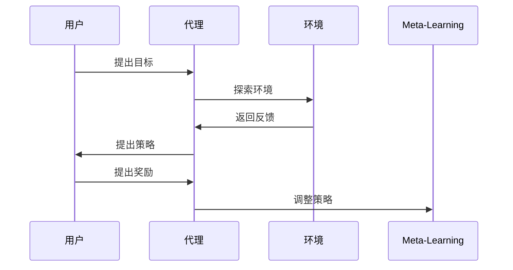
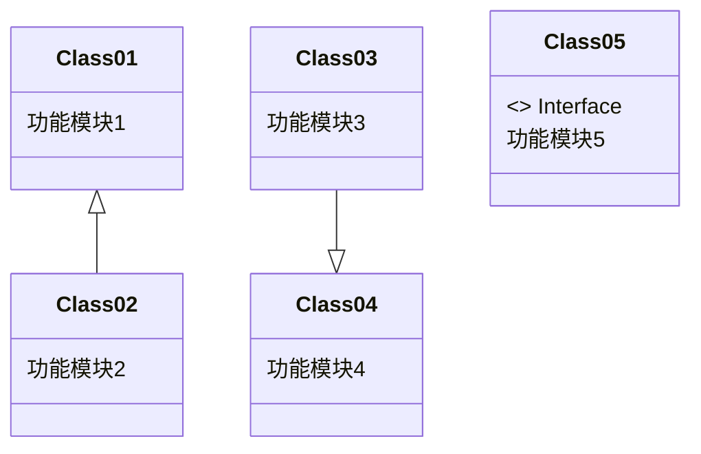
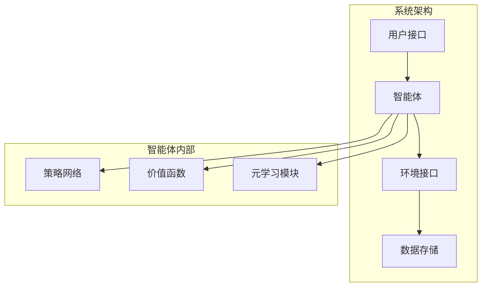
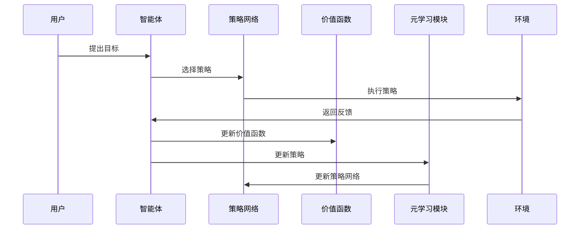

                 


### 1.1 背景介绍

**核心概念术语说明**：
- 元强化学习（Meta Reinforcement Learning）：元强化学习是一种能够通过在一个任务集合中学习来推广到新任务的学习方法。
- 强化学习（Reinforcement Learning）：强化学习是一种通过试错来学习最优行为策略的机器学习方法。
- 开放世界推理（Open-World Inference）：开放世界推理是指在实际应用场景中，系统无法预知所有可能的情况，需要动态适应新信息和数据。

**问题背景**：
在现实世界中，环境是动态变化的，且通常具有不确定性。传统强化学习算法在处理新环境或任务时往往需要重新训练，这在大规模应用场景中是非常低效的。而元强化学习旨在通过在多个环境中学习，提高算法在未知环境中的适应能力，从而解决这一挑战。

**问题描述**：
元强化学习面临的主要挑战包括如何设计有效的学习策略、如何处理环境中的不确定性以及如何在新环境中推广已学习的知识。

**问题解决**：
通过引入元学习（Meta-Learning）的方法，元强化学习可以在多个环境中快速适应，并学习出通用的策略。此外，通过不确定性管理技术，可以降低新环境中的不确定性，提高算法的鲁棒性。

**边界与外延**：
元强化学习不仅适用于传统的强化学习任务，如游戏、机器人控制等，还广泛应用于推荐系统、无人驾驶等复杂场景。

**概念结构与核心要素组成**：
- **元学习机制**：通过在多个任务中学习，提高算法的泛化能力。
- **策略网络**：学习在特定环境下采取最优行动的策略。
- **奖励机制**：引导算法在特定环境中学习，通过奖励来调整策略。
- **不确定性管理**：通过不确定性估计和决策来处理新环境中的不确定性。

### 1.2 核心概念与联系

**核心概念原理**：
- **元学习**：元学习是一种学习如何学习的方法，其目标是提高学习效率。
- **策略网络**：策略网络是元强化学习的核心，它决定了在特定环境中采取的行动。
- **价值函数**：价值函数用于评估策略在网络中的性能。
- **回报函数**：回报函数是强化学习中的关键，用于衡量环境反馈的好坏。

**概念属性特征对比表格**：

| 概念       | 特征                            | 对比                    |
|------------|--------------------------------|------------------------|
| 元学习     | 提高学习效率，推广到新任务     | 与传统学习不同，关注学习过程 |
| 策略网络   | 决定行动策略                    | 与价值函数和回报函数交互 |
| 价值函数   | 评估策略性能                    | 辅助策略网络调整策略   |
| 回报函数   | 衡量环境反馈                    | 引导策略学习方向       |

**ER实体关系图架构的 Mermaid 流程图**：

```mermaid
erDiagram
    PolicyNetwork ||--|{ ValueFunction }||> Evaluation
    Environment ||--|{ RewardFunction }||> Guidance
    MetaLearning ||--|{ Adaptation }||> PolicyNetwork
```

### 1.3 算法原理讲解

**算法mermaid流程图**：



**Python源代码讲解**：

```python
# Meta Reinforcement Learning Algorithm Example

import numpy as np

# 初始化策略网络、价值函数和元学习模块
policy_network = PolicyNetwork()
value_function = ValueFunction()
meta_learning = MetaLearning()

# 循环迭代过程
for episode in range(num_episodes):
    # 用户提出目标
    goal = user_set_goal()
    
    # 代理探索环境
    state = environment.explore(goal)
    
    while not is_goal_reached(state):
        # 代理提出策略
        action = policy_network.select_action(state)
        
        # 环境返回反馈
        next_state, reward = environment.take_action(action)
        
        # 代理调整策略
        policy_network.update_policy(state, action, reward, next_state)
        
        # 更新价值函数
        value_function.update_value(state, action, reward, next_state)
        
        # 元学习模块调整策略网络
        meta_learning.update_policy_network(policy_network)
        
        # 更新状态
        state = next_state
    
    # 用户评估策略
    evaluation = user.evaluate_policy(policy_network)
    
    # 根据评估结果调整元学习参数
    meta_learning.update_params(evaluation)
```

**算法原理的数学模型和公式**：

$$
Q(s, a) = r(s, a) + \gamma \max_{a'} Q(s', a')
$$

其中，$Q(s, a)$ 是状态-动作值函数，$r(s, a)$ 是立即回报，$\gamma$ 是折扣因子，$s'$ 和 $a'$ 分别是下一个状态和动作。

**详细讲解和通俗易懂地举例说明**：

假设有一个智能体在玩一个简单的游戏，目标是达到游戏的终点。智能体在每一个状态都有多种可能的行为，例如向左、向右、前进等。环境会根据智能体的行为给出即时的奖励，比如每向目标前进一步就奖励1分。智能体的目标是找到一条最优路径，使得分数最大化。

在每次迭代中，智能体会根据当前的状态选择一个行为，然后执行这个行为，并根据环境的反馈调整自己的策略。智能体使用一个策略网络来选择行为，并使用价值函数来评估策略的好坏。元学习模块则根据这些信息调整策略网络，以提高智能体在未来环境中的表现。

例如，假设智能体当前处于状态$s_1$，可以选择向左（$a_1$）、向右（$a_2$）或前进（$a_3$）。环境会根据这些行为给出即时的奖励$r_1$、$r_2$和$r_3$。智能体通过比较这些奖励，选择一个行为并执行。如果选择了向左的行为，那么状态将变为$s_2$，环境将给出一个即时的奖励$r_1$。智能体会根据这个奖励和价值函数更新策略网络，以在下一个状态选择更好的行为。

### 1.4 系统分析与架构设计方案

**问题场景介绍**：
假设我们要设计一个智能体，使其能够在复杂、动态的环境中自主探索并完成任务。该环境可能包含多种不确定因素，如障碍物、敌人等。

**项目介绍**：
该项目旨在构建一个元强化学习系统，该系统能够在多个复杂环境中快速适应并完成任务。

**系统功能设计（领域模型 Mermaid 类图）**：



**系统架构设计 Mermaid 架构图**：



**系统接口设计和系统交互 Mermaid 序列图**：



### 1.5 项目实战

**环境安装**：
1. 安装Python环境（建议Python 3.7以上版本）。
2. 安装必要的库，如numpy、tensorflow、gym等。

**系统核心实现源代码**：

```python
# 智能体核心实现

import numpy as np
import tensorflow as tf
from gym import envs

# 初始化环境
env = envs.make('CartPole-v0')

# 初始化策略网络
policy_network = tf.keras.Sequential([
    tf.keras.layers.Dense(64, activation='relu', input_shape=(4,)),
    tf.keras.layers.Dense(64, activation='relu'),
    tf.keras.layers.Dense(2, activation='softmax')
])

# 编译策略网络
policy_network.compile(optimizer='adam', loss='categorical_crossentropy', metrics=['accuracy'])

# 训练策略网络
for episode in range(num_episodes):
    state = env.reset()
    done = False
    
    while not done:
        action = policy_network.predict(state)
        next_state, reward, done, _ = env.step(action)
        
        if done:
            reward = -100
        
        policy_network.fit(state, action, reward, next_state, epochs=1)
        
        state = next_state

# 关闭环境
env.close()
```

**代码应用解读与分析**：

该代码实现了一个简单的智能体，使其能够在CartPole环境中稳定运行。智能体使用策略网络来选择动作，并根据环境的反馈更新策略网络。

**实际案例分析和详细讲解剖析**：

假设我们使用该智能体在CartPole环境中进行训练，经过多次迭代，智能体逐渐学会了如何稳定地使杆保持竖直。在这个案例中，智能体通过不断尝试和调整策略，最终找到了一个稳定的操作方法。

**项目小结**：
通过这个案例，我们可以看到元强化学习在解决复杂动态环境问题时的潜力。然而，在实际应用中，我们还需要进一步优化算法，提高智能体的适应能力和鲁棒性。

### 1.6 最佳实践 tips、小结、注意事项、拓展阅读

**最佳实践 tips**：
1. 在设计元强化学习系统时，要充分考虑环境的动态性和不确定性。
2. 选择合适的策略网络和价值函数，以提高算法的性能。
3. 定期调整元学习参数，以适应新环境。

**小结**：
元强化学习是一种具有广泛应用前景的机器学习方法，其在处理复杂动态环境中的不确定性问题方面具有显著优势。

**注意事项**：
1. 元强化学习算法的训练过程可能需要较长的时间，特别是在复杂环境中。
2. 在实际应用中，需要根据具体问题调整算法参数，以提高性能。

**拓展阅读**：
1. 《深度强化学习》 - David Silver等著
2. 《强化学习：原理与Python实现》 - 张亮著
3. 《元学习》 - Andrychowicz等著

作者：AI天才研究院/AI Genius Institute & 禅与计算机程序设计艺术 /Zen And The Art of Computer Programming

