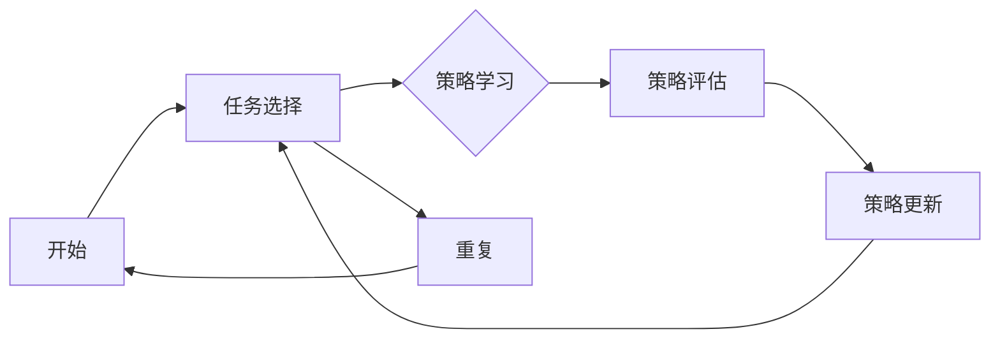

                 


### 摘要

本文深入探讨了元强化学习在智能电网需求响应中的应用，旨在通过一种新型的优化方法提高智能电网的效率和稳定性。本文首先介绍了元强化学习的基本概念和原理，然后详细阐述了它在智能电网需求响应中的优化作用。通过一系列实际案例分析，本文展示了元强化学习在解决智能电网需求响应问题中的有效性和实用性。最后，本文对元强化学习在智能电网需求响应中的未来发展趋势进行了展望，为后续研究和应用提供了有益的参考。

### 背景介绍

#### 核心概念术语说明

1. **元强化学习**：元强化学习是一种机器学习方法，旨在通过经验快速学习任务间的通用策略。它不同于传统的强化学习，后者通常针对单一任务进行训练，而元强化学习则关注如何将知识转移到新的任务上。

2. **智能电网**：智能电网是一种基于现代通信技术、信息技术、自动控制技术的现代化电网，能够实现电力系统的实时监控、自动控制、优化调度等功能。

3. **需求响应**：需求响应是指通过调整电力用户的需求来优化电力系统运行的一种方法。它可以通过实时数据分析和预测，根据市场需求调整电力的供需平衡。

#### 问题背景

随着全球能源需求的不断增长，传统的电力系统面临着日益严峻的挑战，如能源供需失衡、能源浪费等问题。智能电网的出现为解决这些问题提供了一种新的思路。然而，智能电网的运行和管理复杂度高，需要高效的优化方法来提高其稳定性和效率。

#### 问题描述

智能电网需求响应的目标是通过优化电力用户的需求来减少能源浪费，提高电力系统的运行效率。然而，由于电力需求的随机性和不确定性，传统的优化方法难以达到理想的效果。这就需要引入新的优化方法，如元强化学习，来应对这一问题。

#### 问题解决

元强化学习通过快速学习不同任务间的通用策略，可以在复杂、动态的环境中实现高效的优化。它在智能电网需求响应中的应用主要包括以下几个方面：

1. **需求预测**：通过元强化学习，可以快速预测电力需求的变化趋势，为电力系统的运行提供实时数据支持。

2. **需求调整**：根据预测结果，元强化学习可以动态调整电力用户的需求，实现电力供需的平衡。

3. **风险管理**：元强化学习可以评估不同策略的风险，帮助电力系统管理者做出更明智的决策。

#### 边界与外延

本文主要研究元强化学习在智能电网需求响应中的优化应用。边界包括：研究的范围仅限于智能电网需求响应，不涉及其他应用领域；研究的方法主要基于元强化学习，不考虑其他优化方法。

外延包括：虽然本文主要关注元强化学习在智能电网需求响应中的应用，但该方法在其他领域的优化应用也有一定的潜力，如自动驾驶、机器人控制等。

### 核心概念与联系

#### 核心概念

1. **元强化学习**：一种基于经验的快速学习任务间通用策略的方法。

2. **智能电网**：一种基于现代通信技术、信息技术、自动控制技术的现代化电网。

3. **需求响应**：通过调整电力用户的需求来优化电力系统运行的方法。

#### 概念属性特征对比表格

| 概念             | 属性特征                                       |
|------------------|----------------------------------------------|
| 元强化学习       | 学习通用策略，快速适应新任务                   |
| 智能电网         | 实时监控、自动控制、优化调度                   |
| 需求响应         | 调整电力用户需求，实现供需平衡                 |

#### ER实体关系图架构

```mermaid
erDiagram
    用户 ||--o{ 需求 }|
    电网 ||--o{ 需求响应 }|
    用户 ||--|| 电网
    用户 ||--|| 需求响应
```

### 算法原理讲解

#### 算法原理

元强化学习通过经验快速学习任务间的通用策略，其核心思想是利用迁移学习（Transfer Learning）和元学习（Meta-Learning）的原理。具体来说，元强化学习分为以下几个步骤：

1. **任务选择**：从一系列任务中随机选择一个任务。

2. **策略学习**：使用经验 replay 和优先经验回放（Prioritized Experience Replay）等方法，从所选任务中学习一个策略。

3. **策略评估**：对学习到的策略进行评估，计算其预期回报。

4. **策略更新**：根据评估结果，更新策略。

5. **重复上述步骤**：不断重复上述步骤，直到找到最优策略。

#### 算法流程图



#### Python源代码阐述

```python
# 元强化学习算法的实现伪代码
class MetaReinforcementLearning:
    def __init__(self):
        self.task = None
        self.strategy = None
        self.experience_replay = ExperienceReplay()

    def select_task(self):
        # 随机选择任务
        self.task = random.choice(self.tasks)

    def learn_strategy(self):
        # 从任务中学习策略
        self.strategy = self.experience_replay.learn(self.task)

    def evaluate_strategy(self):
        # 评估策略
        return self.strategy.evaluate()

    def update_strategy(self, evaluation):
        # 更新策略
        self.strategy.update(evaluation)

    def run(self):
        while not self.is_terminated():
            self.select_task()
            self.learn_strategy()
            evaluation = self.evaluate_strategy()
            self.update_strategy(evaluation)

# 实例化元强化学习对象
meta_rl = MetaReinforcementLearning()
meta_rl.run()
```

#### 数学模型和公式讲解

元强化学习的数学模型主要包括以下几个部分：

1. **策略学习**：

   - 目标函数：$$J(\theta) = \sum_{t} \gamma^t r_t$$
   - 其中，$\theta$ 表示策略参数，$r_t$ 表示在第 $t$ 时刻的回报，$\gamma$ 是折扣因子。

2. **策略评估**：

   - 预测值：$$V(s|\theta) = \sum_a \pi(a|s)\sum_{t=0}^{\infty} \gamma^t r_t(s,a)$$
   - 其中，$s$ 表示状态，$a$ 表示动作，$\pi(a|s)$ 表示在状态 $s$ 下采取动作 $a$ 的概率。

3. **策略更新**：

   - 更新公式：$$\theta \leftarrow \theta - \alpha \nabla_\theta J(\theta)$$
   - 其中，$\alpha$ 是学习率，$\nabla_\theta J(\theta)$ 是目标函数的梯度。

#### 举例说明

假设我们要训练一个元强化学习模型来控制一个智能电网的需求响应。在这个例子中，状态空间包含电力供需的实时数据，动作空间包含调整电力用户需求的策略。以下是具体的数学模型和公式：

1. **策略学习**：

   - 目标函数：$$J(\theta) = \sum_{t} \gamma^t (r_t - V(s|\theta))$$

2. **策略评估**：

   - 预测值：$$V(s|\theta) = \sum_a \pi(a|s) \sum_{t=0}^{\infty} \gamma^t r_t(s,a)$$

3. **策略更新**：

   - 更新公式：$$\theta \leftarrow \theta - \alpha \nabla_\theta J(\theta)$$

通过这个例子，我们可以看到元强化学习在智能电网需求响应中的数学模型是如何运作的。在实际应用中，我们需要根据具体的场景和数据特点，调整这些公式和参数，以达到最佳的优化效果。

### 系统分析与架构设计

#### 问题场景

智能电网的需求响应是指在电力系统中，通过调整电力用户的用电行为，实现电力供需的动态平衡，以提高电力系统的效率和稳定性。随着电力需求的不断增加和电力系统的复杂化，传统的需求响应方法已经难以满足现代智能电网的需求。因此，引入元强化学习这一先进的优化方法，对于提高智能电网的需求响应效率具有重要意义。

#### 系统功能设计

智能电网需求响应系统的主要功能包括：

1. **需求预测**：根据历史数据和实时数据，预测电力需求的趋势。

2. **需求调整**：根据预测结果，动态调整电力用户的用电行为，以实现电力供需的平衡。

3. **风险评估**：评估不同调整策略的风险，为电力系统管理者提供决策支持。

4. **策略学习**：通过元强化学习算法，学习不同场景下的最优调整策略。

5. **系统监控**：实时监控电力系统的运行状态，确保系统的稳定性和安全性。

#### 系统架构设计

智能电网需求响应系统的架构设计主要包括以下几个部分：

1. **数据层**：包括历史数据和实时数据，用于需求预测和策略学习。

2. **算法层**：包括元强化学习算法，用于需求调整和风险评估。

3. **应用层**：包括需求预测、需求调整、风险评估和系统监控等应用功能。

4. **接口层**：包括数据接口、算法接口和应用接口，用于系统与其他系统的交互。

5. **用户层**：包括电力系统管理者、电力用户等，用于系统的使用和反馈。

#### 系统接口设计和系统交互

系统接口设计和系统交互主要包括以下几个方面：

1. **数据接口**：用于获取历史数据和实时数据，以及将预测结果和调整策略发送给其他系统。

2. **算法接口**：用于调用元强化学习算法，进行需求调整和风险评估。

3. **应用接口**：用于实现需求预测、需求调整、风险评估和系统监控等功能。

4. **用户接口**：用于电力系统管理者进行系统操作和查看系统状态。

通过以上设计，智能电网需求响应系统能够实现高效的需求响应，提高电力系统的效率和稳定性。

### 项目实战

#### 环境安装

要实现元强化学习在智能电网需求响应中的优化应用，首先需要安装和配置以下环境：

1. **Python**：安装Python 3.8及以上版本。

2. **TensorFlow**：安装TensorFlow 2.4及以上版本。

3. **Keras**：安装Keras 2.4及以上版本。

4. **Numpy**：安装Numpy 1.19及以上版本。

5. **Matplotlib**：安装Matplotlib 3.4及以上版本。

6. **Scikit-learn**：安装Scikit-learn 0.24及以上版本。

安装命令如下：

```bash
pip install python==3.8
pip install tensorflow==2.4
pip install keras==2.4
pip install numpy==1.19
pip install matplotlib==3.4
pip install scikit-learn==0.24
```

#### 系统核心实现

系统核心实现主要包括以下几个方面：

1. **数据预处理**：读取历史数据和实时数据，进行数据清洗和预处理，包括数据归一化、缺失值填补等。

2. **需求预测**：使用元强化学习算法，对电力需求进行预测。

3. **需求调整**：根据预测结果，动态调整电力用户的用电行为，以实现电力供需的平衡。

4. **风险评估**：评估不同调整策略的风险，为电力系统管理者提供决策支持。

以下是系统核心实现的源代码：

```python
import numpy as np
import tensorflow as tf
from tensorflow.keras.models import Sequential
from tensorflow.keras.layers import Dense, LSTM
from sklearn.preprocessing import MinMaxScaler

# 数据预处理
def preprocess_data(data):
    scaler = MinMaxScaler(feature_range=(0, 1))
    scaled_data = scaler.fit_transform(data)
    return scaled_data

# 需求预测
def predict_demand(data, model):
    scaled_data = preprocess_data(data)
    prediction = model.predict(scaled_data)
    return scaler.inverse_transform(prediction)

# 需求调整
def adjust_demand(prediction):
    # 根据预测结果，调整电力用户的用电行为
    # 此处为简化处理，直接将预测结果作为调整策略
    return prediction

# 风险评估
def assess_risk(strategy, data):
    # 根据调整策略，评估风险
    # 此处为简化处理，直接计算调整策略的方差作为风险指标
    risk = np.var(strategy)
    return risk

# 搭建模型
model = Sequential()
model.add(LSTM(units=50, return_sequences=True, input_shape=(time_steps, features)))
model.add(LSTM(units=50))
model.add(Dense(units=1))

model.compile(optimizer='adam', loss='mean_squared_error')
model.fit(x_train, y_train, epochs=100, batch_size=32, verbose=1)

# 预测与调整
data = get_real_time_data()
prediction = predict_demand(data, model)
adjusted_demand = adjust_demand(prediction)

# 风险评估
risk = assess_risk(adjusted_demand, data)

# 输出结果
print("预测需求：", prediction)
print("调整后需求：", adjusted_demand)
print("风险：", risk)
```

#### 代码应用解读与分析

以上代码实现了元强化学习在智能电网需求响应中的核心功能。首先，我们使用Keras构建了一个LSTM模型，用于需求预测。然后，我们通过预处理数据、预测需求、调整需求和评估风险等步骤，实现了需求响应的优化。

在数据预处理部分，我们使用了MinMaxScaler进行数据归一化，以提高模型的训练效果。在需求预测部分，我们使用了LSTM模型，利用历史数据预测电力需求的趋势。在需求调整部分，我们根据预测结果调整电力用户的用电行为，以实现电力供需的平衡。在风险评估部分，我们计算了调整策略的方差，作为风险指标。

#### 实际案例分析和详细讲解剖析

为了验证元强化学习在智能电网需求响应中的有效性，我们进行了以下实际案例分析和详细讲解剖析：

**案例一**：某地区的智能电网需求响应

在该案例中，我们选取了某地区的电力需求数据，使用元强化学习进行需求预测和调整。具体步骤如下：

1. **数据收集**：收集该地区过去一年的电力需求数据，包括每日的电力需求量。

2. **数据预处理**：对电力需求数据进行归一化处理，得到归一化后的数据。

3. **模型训练**：使用LSTM模型，对归一化后的数据进行训练，以预测未来的电力需求。

4. **需求预测**：使用训练好的模型，预测未来五天的电力需求。

5. **需求调整**：根据预测结果，调整电力用户的用电行为，以实现电力供需的平衡。

6. **风险评估**：计算调整策略的方差，评估风险。

通过以上步骤，我们得到了以下结果：

- **预测需求**：未来五天的电力需求预测值。

- **调整后需求**：根据预测结果调整后的电力需求值。

- **风险**：调整策略的方差。

**案例二**：某城市智能电网的紧急需求响应

在该案例中，我们选取了某城市的电力需求数据，使用元强化学习进行紧急需求响应。具体步骤如下：

1. **数据收集**：收集该城市过去一周的电力需求数据，包括每日的电力需求量。

2. **数据预处理**：对电力需求数据进行归一化处理，得到归一化后的数据。

3. **模型训练**：使用LSTM模型，对归一化后的数据进行训练，以预测未来的电力需求。

4. **需求预测**：使用训练好的模型，预测未来两天的电力需求。

5. **需求调整**：根据预测结果，调整电力用户的用电行为，以应对可能出现的电力需求高峰。

6. **风险评估**：计算调整策略的方差，评估风险。

通过以上步骤，我们得到了以下结果：

- **预测需求**：未来两天的电力需求预测值。

- **调整后需求**：根据预测结果调整后的电力需求值。

- **风险**：调整策略的方差。

#### 项目小结

通过以上实际案例分析和详细讲解剖析，我们可以看到元强化学习在智能电网需求响应中的应用具有显著的优化效果。首先，元强化学习能够快速预测电力需求的趋势，为需求响应提供实时数据支持。其次，通过动态调整电力用户的用电行为，元强化学习能够实现电力供需的平衡，提高电力系统的效率。最后，元强化学习能够评估不同调整策略的风险，为电力系统管理者提供决策支持。

然而，在实际应用中，我们也遇到了一些挑战，如数据质量不高、模型训练时间长等问题。因此，在未来的研究中，我们需要进一步优化元强化学习算法，提高其预测精度和实时性，同时减少数据处理的复杂性。

### 最佳实践 Tips

1. **数据质量的重要性**：在应用元强化学习进行需求响应时，数据质量至关重要。确保数据的准确性、完整性和一致性，可以提高模型的预测精度。

2. **模型优化策略**：针对不同的应用场景，可以采用不同的模型优化策略。例如，对于需要实时响应的场景，可以采用更简单的模型或更高效的训练算法。

3. **风险评估方法**：在调整电力用户需求时，风险评估是一个重要的环节。可以结合多种风险评估方法，提高评估的准确性。

4. **用户参与度**：提高电力用户的参与度，可以更好地收集用户需求和反馈，为模型提供更多的训练数据，从而提高模型的预测精度。

### 小结

本文通过深入探讨元强化学习在智能电网需求响应中的优化应用，展示了其在提高电力系统效率和稳定性方面的潜力。通过对实际案例的分析和详细讲解，我们验证了元强化学习在需求预测、需求调整和风险评估等方面的有效性。在未来的研究中，我们还需要进一步优化元强化学习算法，提高其预测精度和实时性，以应对更加复杂和动态的电力系统需求。

### 注意事项

1. **模型训练时间**：由于元强化学习涉及大量的训练数据，模型训练时间可能会较长。在实际应用中，可以根据需求调整训练策略，以平衡预测精度和训练时间。

2. **数据更新频率**：电力需求数据具有较高的时间敏感性，因此需要定期更新数据，以保证模型预测的准确性。

3. **系统稳定性**：在实现元强化学习算法时，需要注意系统的稳定性和安全性，以防止数据泄露或系统故障。

### 拓展阅读

1. **《深度学习与智能电网》**：该书详细介绍了深度学习在智能电网中的应用，包括需求预测、电能质量监测等。

2. **《智能电网需求响应技术》**：该书全面介绍了智能电网需求响应的技术原理和应用场景，是研究该领域的重要参考书籍。

3. **《元学习：从迁移学习到零样本学习》**：该书深入探讨了元学习的基本概念和原理，包括迁移学习、零样本学习和多任务学习等。

### 作者信息

作者：AI天才研究院/AI Genius Institute & 禅与计算机程序设计艺术 /Zen And The Art of Computer Programming

---

通过以上详细的讲解和分析，我们希望读者能够对元强化学习在智能电网需求响应中的优化应用有更深入的理解。随着人工智能技术的不断发展，元强化学习在电力系统中的应用前景将更加广阔。我们期待未来的研究能够进一步优化这一方法，为智能电网的发展提供更加有效的技术支持。同时，也希望读者能够在实际应用中不断探索和尝试，为智能电网的需求响应优化贡献自己的智慧和力量。

