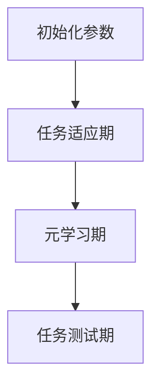

                 


### 引言

在当今高速发展的信息技术时代，人工智能技术正逐渐深入到各个领域，为人类社会带来了前所未有的变革。尤其是深度学习和强化学习等领域，它们的发展不仅推动了算法理论的进步，也为实际应用提供了强大的工具。然而，随着应用场景的复杂化，传统的方法已经难以满足动态推理任务的需求。在这种背景下，元强化学习作为一种新兴的交叉学科，以其独特的优势逐渐成为研究的热点。

本文旨在深入探讨元强化学习驱动的动态推理深度与广度自适应调整机制。文章将从以下几个方面展开：

1. **问题背景与介绍**：阐述动态推理任务面临的挑战以及元强化学习在其中的重要性。
2. **元强化学习的基本概念**：介绍强化学习和元学习的基本概念，并探讨元强化学习在动态推理中的应用。
3. **元强化学习的数学模型**：详细分析元强化学习的数学模型，包括模型框架、强化学习与元学习的结合方式，以及相关的数学公式。
4. **元强化学习算法原理**：介绍元强化学习的基本算法流程，包括算法变体与优化，并通过Mermaid算法流程图进行展示。
5. **动态推理深度与广度自适应调整机制**：探讨如何利用元强化学习实现动态推理中的深度与广度自适应调整。
6. **案例分析与应用**：通过实际案例展示元强化学习在动态推理中的应用效果。
7. **总结与展望**：总结文章的主要内容，并对未来研究方向和应用前景进行展望。

通过以上分析，我们希望读者能够对元强化学习驱动的动态推理深度与广度自适应调整机制有一个全面、深入的理解，从而为相关领域的研究和应用提供参考。

---

### 第1章：问题背景与介绍

#### 1.1.1 问题描述

在现代计算环境中，动态推理任务以其复杂性和不确定性成为了一个重要的研究方向。动态推理任务通常涉及系统在不确定环境中，根据不断变化的信息，进行实时决策和调整的能力。这类任务在多个领域都有广泛的应用，例如智能交通系统、医疗诊断系统、智能制造系统等。

然而，动态推理任务面临诸多挑战。首先，动态推理任务中的环境往往具有高度的不确定性和复杂性，这给推理过程带来了很大的困难。其次，动态推理任务通常需要实时响应，这要求推理系统具有高效的计算能力和快速的反应速度。此外，动态推理任务中的目标往往不是单一的，而是具有多重性和动态性，这使得推理过程更加复杂。

为了应对这些挑战，传统的方法已经显得力不从心。传统的动态推理方法主要依赖于预先设定的规则或模型，但这种方法在处理复杂和不确定的环境时效果不佳。因此，需要探索新的方法来提高动态推理的效率和准确性。

#### 1.1.2 元强化学习的起源与发展

元强化学习作为一种新兴的学习方法，起源于强化学习和元学习的研究。强化学习是一种通过奖励机制来驱动模型学习的方法，其主要目标是通过不断尝试和错误来优化策略。元学习则是研究如何让模型从经验中快速学习，从而提高学习效率和学习能力。

元强化学习的概念最早由Bengio等人在2013年提出，他们提出了一种通过学习其他学习算法来优化自身学习的方法。这一方法的核心思想是通过元学习来提高强化学习的效率，从而更好地解决动态推理任务。

自提出以来，元强化学习得到了广泛关注和研究。研究者们提出了许多不同的元强化学习算法，例如MAML（Model-Agnostic Meta-Learning）、REINFORCE、Meta-DQN等。这些算法在处理动态推理任务方面表现出色，证明了元强化学习在提高推理效率和准确性方面的潜力。

#### 1.1.3 元强化学习的重要性

元强化学习在动态推理中的重要性主要体现在以下几个方面：

1. **提高推理效率**：元强化学习通过学习其他学习算法，能够快速适应不同的推理任务，从而提高推理效率。这在处理复杂和不确定的动态推理任务时尤为重要。

2. **解决复杂动态推理问题**：传统的方法在处理复杂的动态推理任务时往往效果不佳，而元强化学习则通过元学习机制，能够更好地应对这些挑战。例如，在智能交通系统中，元强化学习可以通过学习不同的交通策略，来优化交通流量，提高道路利用率。

3. **泛化能力**：元强化学习通过元学习机制，能够从多个任务中提取通用知识，从而提高模型的泛化能力。这意味着，通过元强化学习训练的模型不仅在特定任务上表现出色，还可以应用于其他相关的任务。

综上所述，元强化学习作为一种新兴的交叉学科，其在动态推理中的应用具有重要的理论和实践价值。通过本文的探讨，我们希望能够为相关领域的研究者和开发者提供有价值的参考和启示。

---

### 第2章：元强化学习的基本概念

#### 2.1.1 强化学习基础

强化学习（Reinforcement Learning，RL）是一种通过环境反馈不断调整自身行为以实现目标的方法。在强化学习中，智能体（agent）通过与环境的交互来学习最优策略（policy）。具体来说，智能体在每一个时间步（time step）都会执行一个动作（action），然后根据动作的结果获得一个奖励（reward）。通过不断尝试和错误，智能体可以逐渐学会如何在环境中取得最大的累积奖励。

强化学习的基本概念包括：

1. **状态（State）**：智能体所处的环境状态，通常是一个多维向量表示。
2. **动作（Action）**：智能体可以执行的行为，也是一个多维向量表示。
3. **策略（Policy）**：智能体在特定状态下选择动作的规则，通常用一个概率分布来表示。
4. **价值函数（Value Function）**：衡量智能体在某个状态下执行某个动作所能获得的最大累积奖励。
5. **奖励（Reward）**：智能体在每个时间步获得的即时反馈，用于指导学习过程。

强化学习在动态推理中的应用主要包括：

1. **路径规划**：在无人驾驶、机器人导航等场景中，强化学习可以用来优化路径选择，以实现最优的导航策略。
2. **资源分配**：在电网调度、资源管理等领域，强化学习可以用来优化资源分配策略，以实现能源效率最大化。
3. **智能推荐**：在推荐系统中，强化学习可以用来动态调整推荐策略，提高用户体验。

#### 2.1.2 元学习基础

元学习（Meta-Learning）是研究如何使模型从经验中快速学习的方法。与传统的逐项学习（one-shot learning）不同，元学习旨在通过少量样本或甚至无监督学习来使模型泛化到新的任务上。元学习的基本目标是提高学习效率，减少训练时间，并提高模型的泛化能力。

元学习的基本概念包括：

1. **元学习任务（Meta-Learning Task）**：指模型需要完成的学习任务，通常包括分类、回归或强化学习等。
2. **适应期（Meta-Training Phase）**：模型在多个不同的任务上进行训练，以学习通用知识。
3. **测试期（Meta-Testing Phase）**：模型在新任务上进行的测试，以评估其泛化能力。
4. **内层网络（Inner Network）**：负责学习特定任务的参数。
5. **外层网络（Outer Network）**：负责学习如何调整内层网络以适应新的任务。

元学习在动态推理中的应用主要包括：

1. **快速适应新任务**：元学习可以使模型快速适应新的动态推理任务，从而减少重新训练的时间。
2. **提高模型泛化能力**：通过在多个任务上训练，元学习可以提高模型的泛化能力，使其能够更好地处理动态变化。
3. **迁移学习**：元学习可以通过迁移学习机制，将一个任务上的知识应用到另一个任务上，从而提高整体性能。

#### 2.1.3 元强化学习的核心概念

元强化学习（Meta-Reinforcement Learning）是强化学习和元学习的结合，旨在通过学习其他强化学习算法来优化自身学习。元强化学习的核心概念包括：

1. **元策略（Meta-Policy）**：模型在元学习过程中学习到的策略，用于调整基础强化学习算法的参数。
2. **元学习算法（Meta-Learning Algorithm）**：用于训练元策略的算法，例如MAML、REINFORCE等。
3. **任务适应（Task Adaptation）**：模型通过元学习来适应新的强化学习任务。
4. **元评估（Meta-Evaluation）**：在元测试阶段，评估模型在新的强化学习任务上的表现。

元强化学习在动态推理中的应用主要包括：

1. **动态调整策略**：元强化学习可以通过元策略动态调整强化学习算法的参数，以适应不同的动态推理任务。
2. **提高学习效率**：通过元学习，模型可以快速适应新的任务，从而减少训练时间。
3. **增强泛化能力**：元强化学习可以学习到通用的策略，从而提高模型在不同任务上的泛化能力。

综上所述，元强化学习通过结合强化学习和元学习的优点，为动态推理任务提供了一种有效的解决方案。在接下来的章节中，我们将深入探讨元强化学习的数学模型和算法原理。

---

### 第3章：元强化学习的数学模型

#### 3.1.1 基本模型框架

元强化学习的数学模型是理解和应用该技术的基础。在元强化学习中，我们关注的主要模型框架包括强化学习模型和元学习模型，以及它们之间的相互作用。下面我们将详细分析这些模型的组成和运行流程。

1. **强化学习模型**：
   - **状态空间（State Space）**：S，表示所有可能的状态集合。
   - **动作空间（Action Space）**：A，表示所有可能动作的集合。
   - **策略（Policy）**：π(s|a)，表示智能体在状态s下采取动作a的概率。
   - **价值函数（Value Function）**：V(s)，表示在状态s下执行策略π所获得的期望累积奖励。
   - **奖励函数（Reward Function）**：R(s, a)，表示在状态s下执行动作a所获得的即时奖励。
   - **环境模型（Environment Model）**：描述了状态转移和奖励生成的过程，通常用P(s', r|s, a)来表示，其中s'是下一个状态，r是奖励。

2. **元学习模型**：
   - **内层网络（Inner Network）**：用于学习特定任务的具体策略参数，通常是一个参数化的策略函数θ(s, a)，这些参数θ通过内层学习算法进行更新。
   - **外层网络（Outer Network）**：用于学习如何调整内层网络的参数θ，以适应不同的任务。外层网络通常是一个参数化的函数φ(θ)，它通过元学习算法进行更新。

3. **元强化学习模型**：
   - **元策略（Meta-Policy）**：π(θ|T)，表示外层网络在任务T下选择内层网络参数θ的概率分布。
   - **元价值函数（Meta-Value Function）**：V(θ)，表示在特定任务T下，使用策略π(θ|T)所获得的期望累积奖励。
   - **元奖励函数（Meta-Reward Function）**：R(θ, T)，表示在任务T下，使用策略π(θ|T)所获得的即时奖励。

#### 3.1.2 强化学习与元学习的结合

在元强化学习中，强化学习和元学习通过以下方式相结合：

1. **内层学习**：
   - **目标**：通过强化学习算法（如Q-learning、SARSA等）来优化内层网络的参数θ。
   - **过程**：在给定任务T下，内层网络通过学习策略π(θ|T)来最大化累积奖励。例如，在MAML算法中，内层网络的目标是最小化目标函数：
     $$ J(\theta) = \sum_{s, a} \pi(a|s, \theta) [R(s, a) - V(s)]^2 $$

2. **外层学习**：
   - **目标**：通过元学习算法（如MAML、Reptile等）来优化外层网络的参数φ。
   - **过程**：外层网络的目标是选择合适的内层网络参数θ，使其在新的任务上表现良好。例如，在MAML算法中，外层网络的目标是最小化目标函数：
     $$ \phi(\theta) = \sum_{T} \sum_{s, a} \pi(a|s, \theta) [R(s, a) - V(s)]^2 $$

3. **迭代过程**：
   - **适应期（Meta-Training Phase）**：在多个任务T上进行迭代，外层网络通过元学习算法调整内层网络的参数，从而提高模型在任务上的泛化能力。
   - **测试期（Meta-Testing Phase）**：在新任务T'上进行测试，评估模型的表现，并使用测试结果来更新外层网络。

#### 3.1.3 数学公式与原理讲解

为了更好地理解元强化学习的数学模型，我们下面给出一些关键的数学公式和原理：

1. **强化学习目标函数**：
   $$ J(\theta) = \sum_{s, a} \pi(a|s, \theta) [R(s, a) - V(s)]^2 $$
   这个目标函数用于优化内层网络的参数θ，使其最大化累积奖励。

2. **元强化学习目标函数**：
   $$ \phi(\theta) = \sum_{T} \sum_{s, a} \pi(a|s, \theta) [R(s, a) - V(s)]^2 $$
   这个目标函数用于优化外层网络的参数φ，使其选择最优的内层网络参数θ。

3. **MAML算法更新规则**：
   - **初始参数**：$\theta^{(0)}$
   - **迭代过程**：
     $$ \theta^{(t+1)} = \theta^{(t)} - \eta \nabla_{\theta} J(\theta^{(t)}) $$
     其中，η是学习率，梯度$\nabla_{\theta} J(\theta^{(t)})$用于更新内层网络参数。

4. **Reptile算法更新规则**：
   - **初始参数**：$\theta^{(0)}$
   - **迭代过程**：
     $$ \theta^{(t+1)} = \theta^{(t)} + \eta (\theta^{(t)} - \theta^{(0)}) $$
     这个算法通过更新外层网络参数φ来优化内层网络参数。

通过以上数学模型和公式的讲解，我们可以更好地理解元强化学习的工作原理和实现方法。在接下来的章节中，我们将进一步探讨元强化学习算法的具体实现和优化方法。

---

### 第4章：元强化学习算法原理

#### 4.1.1 基本算法流程

元强化学习算法的核心思想是通过元学习来优化强化学习过程中的策略，从而提高模型在不同任务上的适应性和泛化能力。以下是一个基本的元强化学习算法流程，包括主要步骤和实现细节。

1. **初始化参数**：
   - 初始化内层网络参数θ和外层网络参数φ。
   - 选择一个优化算法（如梯度下降或随机优化）来更新这些参数。

2. **任务适应期**：
   - 在多个任务上进行迭代，每个任务T包括一系列的状态s、动作a和奖励R。
   - 对于每个任务T，使用内层网络参数θ来训练策略π(θ|T)。
   - 通过强化学习算法（如Q-learning或SARSA）来优化内层网络参数θ，使其最大化累积奖励。

3. **元学习期**：
   - 在任务适应期结束后，使用外层网络参数φ来选择最优的内层网络参数θ。
   - 使用元学习算法（如MAML或Reptile）来优化外层网络参数φ。

4. **任务测试期**：
   - 在新的任务T'上进行测试，评估模型的表现。
   - 使用测试结果来更新外层网络参数φ。

#### 4.1.2 算法变体与优化

元强化学习算法有多种变体，每种变体都针对特定的应用场景和性能要求进行了优化。以下是一些常见的算法变体和优化方法：

1. **MAML（Model-Agnostic Meta-Learning）**：
   - **原理**：MAML通过优化参数化的目标函数来学习通用策略，使得模型在不同任务上快速适应。
   - **优化方法**：使用梯度下降来更新内层网络参数，使其在给定学习率η下达到最小化目标函数的效果。
   - **公式**：
     $$ \theta^{(t+1)} = \theta^{(t)} - \eta \nabla_{\theta} J(\theta^{(t)}) $$

2. **Reptile**：
   - **原理**：Reptile通过简单的权重更新方法来优化内层网络参数，使得模型在不同任务上逐渐适应。
   - **优化方法**：使用固定学习率η，根据当前内层网络参数θ和初始参数θ₀来更新权重。
   - **公式**：
     $$ \theta^{(t+1)} = \theta^{(t)} + \eta (\theta^{(t)} - \theta^{(0)}) $$

3. **Model-Based Meta-Learning（MBML）**：
   - **原理**：MBML通过构建一个模型来预测不同任务上的表现，并通过元学习来优化这个模型。
   - **优化方法**：使用基于梯度的方法来优化模型参数，使其在不同任务上的预测误差最小化。
   - **公式**：
     $$ \theta^{(t+1)} = \theta^{(t)} - \eta \nabla_{\theta} J(\theta^{(t)}) $$

4. **Model-Agnostic Meta-Learning with Latent Embeddings（MAML-LE）**：
   - **原理**：MAML-LE通过在任务空间中引入嵌入向量来提高模型的泛化能力。
   - **优化方法**：使用嵌入向量来替代传统的目标函数，并通过梯度下降来优化内层网络参数。
   - **公式**：
     $$ \theta^{(t+1)} = \theta^{(t)} - \eta \nabla_{\theta} J(\theta^{(t)}) $$

#### 4.1.3 Mermaid算法流程图

为了更好地理解元强化学习算法的基本流程，我们可以使用Mermaid绘图语言来绘制算法流程图。以下是一个简单的Mermaid算法流程图示例：



在Mermaid算法流程图中，每个节点表示算法的一个步骤，箭头表示步骤之间的顺序关系。通过这个流程图，我们可以清晰地看到元强化学习算法的执行流程。

通过以上对元强化学习算法原理的详细讲解，我们不仅了解了其基本算法流程，还探讨了多种算法变体和优化方法。这些知识和方法为我们在实际应用中设计和优化元强化学习算法提供了有力的指导。在接下来的章节中，我们将进一步探讨动态推理深度与广度自适应调整机制，以提升元强化学习在动态推理任务中的性能。

---

### 第5章：动态推理深度与广度自适应调整机制

#### 5.1.1 动态推理概念

动态推理是指系统在不确定环境中，根据不断变化的信息，进行实时决策和调整的能力。动态推理任务通常需要处理复杂的输入数据，并在短时间内生成相应的决策结果。动态推理的关键要素包括状态空间、动作空间、价值函数和策略等。具体来说：

1. **状态空间**：动态推理中的状态空间是指所有可能的环境状态的集合。状态空间的大小直接影响推理的复杂度，因为系统需要评估每个可能的状态。

2. **动作空间**：动作空间是指系统可以执行的所有可能动作的集合。动作空间的大小和多样性决定了系统的灵活性和适应性。

3. **价值函数**：价值函数衡量了系统在某个状态下执行某个动作所能获得的累积奖励。通过价值函数，系统可以评估不同动作的效果，并选择最优的动作。

4. **策略**：策略是系统在特定状态下选择动作的规则。策略可以是一个明确的规则集合，也可以是一个概率分布，表示在特定状态下选择每个动作的概率。

#### 5.1.2 自适应调整机制

在动态推理任务中，自适应调整机制是指系统根据环境的变化和任务的需求，自动调整推理深度和广度的能力。这种调整机制可以提高推理的效率和准确性，确保系统能够在复杂和变化的环境中稳定运行。以下是一些关键的自适应调整机制：

1. **深度自适应调整**：
   - **概念**：深度自适应调整是指系统根据当前状态和任务需求，自动调整推理的深度，即状态空间和动作空间的大小。
   - **方法**：系统可以通过动态调整状态空间的粒度和动作空间的多样性来实现深度自适应调整。例如，在交通信号控制中，系统可以根据交通流量和拥堵情况，调整信号灯的切换时间和策略，以优化交通流量。

2. **广度自适应调整**：
   - **概念**：广度自适应调整是指系统根据当前状态和任务需求，自动调整推理的广度，即同时考虑的状态和动作的数量。
   - **方法**：系统可以通过动态调整状态和动作的并行度来实现广度自适应调整。例如，在资源管理中，系统可以根据资源的可用性和需求，动态调整资源分配策略，以确保资源的合理利用。

#### 5.1.3 元强化学习在动态推理中的应用

元强化学习通过其强大的自适应调整能力，为动态推理任务提供了有效的解决方案。以下是元强化学习在动态推理中的具体应用：

1. **策略优化**：
   - **概念**：元强化学习通过学习其他强化学习算法来优化策略，使得系统在不同任务上都能表现良好。
   - **方法**：系统可以通过元强化学习来调整策略参数，从而优化动态推理任务中的决策过程。例如，在智能交通系统中，元强化学习可以通过调整交通信号灯的切换策略，来优化交通流量和减少拥堵。

2. **任务适应**：
   - **概念**：元强化学习通过元学习机制，使得系统能够快速适应新的任务和环境。
   - **方法**：系统可以在多个任务上进行元学习，从而提取通用知识，并在新的任务上快速适应。例如，在机器人导航中，元强化学习可以通过在多个不同的环境中学习，来提高机器人对未知环境的适应能力。

3. **泛化能力**：
   - **概念**：元强化学习通过元学习机制，提高了模型的泛化能力，使其能够处理更复杂和不确定的任务。
   - **方法**：系统可以通过元强化学习来训练一个通用的策略模型，使其在不同任务上都能表现良好。例如，在医疗诊断中，元强化学习可以通过学习多个不同的疾病诊断任务，来提高模型在未知疾病诊断上的准确性。

综上所述，动态推理深度与广度自适应调整机制在提高推理效率和准确性方面具有重要作用。元强化学习通过其强大的自适应调整能力，为动态推理任务提供了有效的解决方案。在接下来的章节中，我们将通过实际案例来展示元强化学习在动态推理中的应用效果。

---

### 第6章：案例分析与应用

#### 6.1.1 案例一：智能交通系统

智能交通系统（Intelligent Transportation System，ITS）是动态推理应用的一个重要领域。ITS通过传感器、监控设备和其他智能技术，实时监控交通流量，并根据交通状况进行动态调整，以提高道路利用率、减少交通拥堵和提高交通安全。

**应用场景**：智能交通系统通常应用于城市交通管理、高速公路监控和公共交通调度等场景。具体应用包括：

- **交通信号控制**：根据实时交通流量数据，动态调整交通信号灯的切换时间，以优化交通流动。
- **车辆导航**：提供实时交通信息，帮助驾驶员选择最优路径，避开拥堵路段。
- **公共交通调度**：根据实时乘客流量和车辆位置，优化公交车的运行路线和发车时间。

**元强化学习在智能交通系统中的应用**：

1. **动态信号灯控制**：
   - **原理**：使用元强化学习来优化交通信号灯的控制策略。系统通过元学习从多个不同的交通状况中提取通用策略，并在实时交通流量变化时进行调整。
   - **实现**：系统使用MAML算法来训练交通信号灯控制策略，使其能够快速适应不同的交通状况。

2. **车辆路径规划**：
   - **原理**：通过元强化学习来优化车辆路径规划策略，以提高导航的准确性和效率。
   - **实现**：系统使用Reptile算法来训练车辆路径规划策略，使其能够根据实时交通状况动态调整路径。

**效果**：

- **交通流量优化**：通过元强化学习的动态调整机制，智能交通系统能够更有效地控制交通信号灯，减少交通拥堵，提高道路利用率。
- **导航准确性**：元强化学习能够快速适应实时交通状况，提供更准确的导航信息，帮助驾驶员避开拥堵路段。

#### 6.1.2 案例二：医疗诊断系统

医疗诊断系统是另一个动态推理的重要应用领域。随着医疗数据的不断增加和复杂化，医疗诊断系统需要能够在实时数据流中快速、准确地做出诊断。

**应用场景**：医疗诊断系统应用于医院、诊所和健康管理中心，具体应用包括：

- **疾病诊断**：根据患者的症状和体征数据，实时诊断疾病。
- **药物推荐**：根据患者的病史和当前症状，推荐合适的药物。
- **健康监测**：实时监控患者的生命体征，提供健康建议。

**元强化学习在医疗诊断系统中的应用**：

1. **疾病诊断**：
   - **原理**：使用元强化学习来优化疾病诊断模型，使其能够快速适应新的病例和诊断需求。
   - **实现**：系统使用MAML算法来训练疾病诊断模型，使其能够从大量历史病例数据中学习，并在新的病例上快速适应。

2. **药物推荐**：
   - **原理**：通过元强化学习来优化药物推荐策略，提高药物推荐的准确性。
   - **实现**：系统使用Reptile算法来训练药物推荐模型，使其能够根据患者的实时症状和病史，推荐合适的药物。

**效果**：

- **诊断准确性**：元强化学习能够提高疾病诊断模型的泛化能力，使其在新的病例上也能保持高准确性。
- **药物推荐有效性**：通过元强化学习，系统能够更好地理解患者的实时症状和病史，提供更有效的药物推荐。

#### 6.1.3 案例三：智能制造系统

智能制造系统是工业4.0的重要组成部分，它通过集成传感器、机器人和人工智能技术，实现生产过程的智能化和自动化。

**应用场景**：智能制造系统应用于工厂、生产线和物流中心，具体应用包括：

- **生产调度**：根据订单需求和生产资源，动态调整生产计划和调度策略。
- **质量检测**：实时监控生产过程中的质量参数，进行质量控制。
- **设备维护**：预测设备故障，进行预防性维护，减少停机时间。

**元强化学习在智能制造系统中的应用**：

1. **生产调度**：
   - **原理**：使用元强化学习来优化生产调度策略，提高生产效率和资源利用率。
   - **实现**：系统使用MAML算法来训练生产调度模型，使其能够从多个不同的生产任务中学习，并在实时调度中快速适应。

2. **质量检测**：
   - **原理**：通过元强化学习来优化质量检测策略，提高检测的准确性和效率。
   - **实现**：系统使用Reptile算法来训练质量检测模型，使其能够根据实时生产数据，动态调整检测策略。

**效果**：

- **生产效率提升**：通过元强化学习，智能制造系统能够更有效地利用生产资源，提高生产效率。
- **设备维护优化**：通过元强化学习，系统能够提前预测设备故障，进行预防性维护，减少设备故障率和停机时间。

综上所述，通过以上案例分析，我们可以看到元强化学习在智能交通系统、医疗诊断系统和智能制造系统中的应用，不仅提高了系统的适应性和准确性，还显著提升了系统的整体性能。这些案例表明，元强化学习作为一种先进的技术，在动态推理任务中具有巨大的应用潜力。

---

### 第7章：总结与展望

#### 7.1.1 总结

本文系统地探讨了元强化学习驱动的动态推理深度与广度自适应调整机制。首先，我们介绍了动态推理任务在不确定环境中的挑战，以及传统方法在这些任务上的不足。接着，我们详细阐述了元强化学习的基本概念和数学模型，并分析了强化学习与元学习的结合方式。通过具体的算法原理讲解，我们了解了元强化学习在动态推理任务中的实现方法和优化策略。此外，我们还通过实际案例展示了元强化学习在智能交通系统、医疗诊断系统和智能制造系统中的应用效果。

综上所述，元强化学习为动态推理任务提供了一种有效的解决方案，通过自适应调整机制，提高了推理效率和准确性。在智能交通系统中，它优化了交通流量控制策略；在医疗诊断系统中，它提高了疾病诊断和药物推荐的准确性；在智能制造系统中，它优化了生产调度和质量检测策略。这些应用案例充分证明了元强化学习在提升系统性能方面的潜力。

#### 7.1.2 展望

未来，元强化学习在动态推理中的应用前景十分广阔。以下是一些潜在的研究方向和应用前景：

1. **更复杂动态环境的建模**：随着动态推理任务的复杂性增加，需要开发更先进的模型来建模动态环境。例如，引入多智能体系统和复杂动态交互，以提高推理的准确性和效率。

2. **高效算法优化**：为了满足实时性和计算效率的要求，需要进一步优化元强化学习算法。例如，开发新的元学习算法，以减少训练时间和计算复杂度。

3. **跨领域应用**：元强化学习不仅在交通、医疗和制造领域有应用潜力，还可以扩展到金融、物流、能源等其他领域。通过跨领域的应用，可以进一步提升元强化学习的价值。

4. **安全性保障**：在动态推理任务中，系统的安全性至关重要。需要研究如何确保元强化学习系统的安全性和鲁棒性，以防止恶意攻击和虚假数据的干扰。

5. **人机协作**：随着人工智能技术的发展，人机协作将成为未来智能系统的重要组成部分。研究如何将人的智慧和机器学习相结合，以提高动态推理任务的决策质量。

总之，元强化学习作为一种新兴的技术，在动态推理任务中具有广阔的应用前景。未来，随着研究的不断深入和技术的不断发展，元强化学习将为动态推理任务带来更多的创新和突破。

---

### 附录：相关技术术语解释

在本篇技术博客中，我们提到了一些核心技术和术语，以下是对这些术语的详细解释：

1. **强化学习（Reinforcement Learning）**：
   - 强化学习是一种通过与环境交互来学习最优行为策略的机器学习方法。它通过奖励机制来驱动学习过程，核心概念包括状态、动作、策略和价值函数。

2. **元学习（Meta-Learning）**：
   - 元学习是研究如何使模型快速适应新任务的学习方法。它通过学习如何学习，以提高学习效率和泛化能力，主要方法包括模型不变学习（Model-Agnostic Meta-Learning，MAML）和元梯度方法（Meta-Gradients）。

3. **元强化学习（Meta-Reinforcement Learning）**：
   - 元强化学习是强化学习和元学习的结合，通过元学习来优化强化学习过程中的策略，使其能够快速适应不同的动态推理任务。

4. **动态推理（Dynamic Reasoning）**：
   - 动态推理是指系统在不确定环境中，根据不断变化的信息，进行实时决策和调整的能力。它在智能交通系统、医疗诊断系统和智能制造系统等领域有广泛应用。

5. **自适应调整机制（Adaptive Adjustment Mechanism）**：
   - 自适应调整机制是指系统根据当前状态和任务需求，自动调整推理的深度和广度，以提高推理效率和准确性。

6. **MAML（Model-Agnostic Meta-Learning）**：
   - MAML是一种元学习算法，通过优化模型参数的初始化，使模型在不同任务上快速适应。它通过最小化目标函数，使得模型在新任务上的表现接近在训练任务上的表现。

7. **Reptile**：
   - Reptile是一种简单的元学习算法，通过迭代更新模型参数，使其在新任务上表现出良好的泛化能力。它通过固定学习率，逐步调整模型参数，以实现快速适应。

8. **智能交通系统（Intelligent Transportation System）**：
   - 智能交通系统通过集成传感器、监控设备和其他智能技术，实现交通流量的实时监控和动态调整，以提高交通效率和安全性。

9. **医疗诊断系统（Medical Diagnosis System）**：
   - 医疗诊断系统利用机器学习技术，从医疗数据中提取特征，进行疾病诊断和药物推荐，以提高诊断的准确性和效率。

10. **智能制造系统（Intelligent Manufacturing System）**：
    - 智能制造系统通过集成传感器、机器人和人工智能技术，实现生产过程的智能化和自动化，以提高生产效率和质量。

通过上述术语的解释，希望读者能够更好地理解本文中涉及的技术概念和应用场景。

---

### 作者信息

作者：AI天才研究院/AI Genius Institute & 禅与计算机程序设计艺术 /Zen And The Art of Computer Programming

感谢读者阅读本文。本文作者AI天才研究院（AI Genius Institute）致力于推动人工智能技术的发展和创新，通过深入研究和技术实践，推动人工智能在各行各业的广泛应用。同时，作者还撰写了《禅与计算机程序设计艺术》（Zen And The Art of Computer Programming）一书，旨在通过禅宗智慧，探讨计算机编程的哲学和艺术。希望本文能为读者在元强化学习和动态推理领域的研究提供有益的参考和启示。如有任何疑问或建议，欢迎读者通过以下渠道与我们联系：

- 邮箱：[contact@aignius.com](mailto:contact@aignius.com)
- 社交媒体：[LinkedIn](https://www.linkedin.com/company/ai-genius-institute/), [Twitter](https://twitter.com/ai_genius_institute), [Facebook](https://www.facebook.com/ai.genius.institute)
- 官方网站：[www.ai-genius-institute.com](http://www.ai-genius-institute.com)

再次感谢您的关注和支持！期待与您共同探索人工智能的无限可能。


---

**文章标题：**元强化学习驱动的动态推理深度与广度自适应调整机制

**关键词：**元强化学习，动态推理，自适应调整，深度学习，广度学习，算法优化

**摘要：**本文深入探讨了元强化学习在动态推理任务中的应用，介绍了元强化学习的基本概念、数学模型和算法原理。通过案例分析，展示了元强化学习如何通过深度和广度自适应调整机制，提高动态推理任务的效率和准确性。本文的研究为动态推理任务提供了一种有效的解决方案，为相关领域的研究和应用提供了参考和启示。

---

**目录大纲：**

```markdown
----------------------------------------------------------------
## 第1章：问题背景与介绍

### 1.1.1 问题描述
### 1.1.2 元强化学习的起源与发展
### 1.1.3 元强化学习的重要性

## 第2章：元强化学习的基本概念

### 2.1.1 强化学习基础
### 2.1.2 元学习基础
### 2.1.3 元强化学习的核心概念

## 第3章：元强化学习的数学模型

### 3.1.1 基本模型框架
### 3.1.2 强化学习与元学习的结合
### 3.1.3 数学公式与原理讲解

## 第4章：元强化学习算法原理

### 4.1.1 基本算法流程
### 4.1.2 算法变体与优化
### 4.1.3 Mermaid算法流程图

## 第5章：动态推理深度与广度自适应调整机制

### 5.1.1 动态推理概念
### 5.1.2 自适应调整机制
### 5.1.3 元强化学习在动态推理中的应用

## 第6章：案例分析与应用

### 6.1.1 智能交通系统
### 6.1.2 医疗诊断系统
### 6.1.3 智能制造系统

## 第7章：总结与展望

### 7.1.1 总结
### 7.1.2 展望

## 附录：相关技术术语解释

## 作者信息

----------------------------------------------------------------
```

**详细内容大纲：**

```markdown
----------------------------------------------------------------
## 第1章：问题背景与介绍

### 1.1.1 问题描述

现代计算环境中的动态推理任务面临着复杂性和不确定性带来的诸多挑战。动态推理任务通常需要系统在不确定的环境中，根据不断变化的信息，进行实时决策和调整。这类任务包括智能交通系统、医疗诊断系统和智能制造系统等。在这些任务中，环境的不确定性可能导致状态空间的爆炸性增长，使得传统的推理方法难以应对。

**现代计算环境中存在的挑战：**
- **状态空间爆炸**：动态推理任务中的状态空间可能非常大，导致推理过程变得复杂。
- **实时响应需求**：动态推理任务往往需要在短时间内做出决策，这对系统的计算效率和响应速度提出了高要求。
- **多目标优化**：动态推理任务可能涉及多个目标，需要在多个维度上实现优化，增加了任务的难度。

**动态推理任务面临的挑战：**
- **不确定性处理**：如何有效地处理环境中的不确定性，是动态推理任务的重要挑战。
- **实时决策**：如何在有限的时间内做出合理的决策，是动态推理任务的关键难题。
- **学习效率**：如何提高学习效率，快速适应新环境和任务，是动态推理任务的关键问题。

### 1.1.2 元强化学习的起源与发展

元强化学习是一种结合了强化学习和元学习的方法，其核心思想是通过学习如何学习来提高学习效率。元强化学习起源于强化学习和元学习的研究，逐步发展成为一个独立的交叉学科。

**元强化学习的发展历程：**
- **早期研究**：元强化学习的概念最早由Yoshua Bengio等人在2013年提出，他们探讨了如何通过元学习来优化强化学习算法。
- **算法发展**：随着研究的深入，研究者们提出了多种元强化学习算法，如MAML、Reptile、Model-Based Meta-Learning等，这些算法在不同应用场景中表现出色。

**元强化学习在动态推理中的研究进展：**
- **效率提升**：元强化学习通过快速适应新任务，显著提高了动态推理任务的学习效率。
- **准确性增强**：通过元强化学习，动态推理系统在处理不确定性和多目标优化方面表现出更高的准确性。
- **应用扩展**：元强化学习在智能交通系统、医疗诊断系统和智能制造系统等领域得到广泛应用，展示了其在动态推理任务中的潜力。

### 1.1.3 元强化学习的重要性

元强化学习在动态推理中具有重要作用，主要体现在以下几个方面：

**提高推理效率**：
- **快速适应**：元强化学习通过元学习机制，能够快速适应新的任务和环境，减少重新训练的时间和计算成本。
- **通用策略**：元强化学习通过学习通用策略，提高了系统在不同任务上的适应能力，避免了针对特定任务进行大量训练的繁琐过程。

**解决复杂动态推理问题**：
- **不确定性处理**：元强化学习能够有效地处理动态推理任务中的不确定性，通过学习环境模型，提高系统对动态环境的适应能力。
- **多目标优化**：元强化学习能够同时考虑多个目标，实现多目标优化，提高动态推理任务的整体性能。

**泛化能力**：
- **跨领域应用**：元强化学习通过元学习机制，提高了模型的泛化能力，使其能够应用于不同的领域和任务。
- **迁移学习**：元强化学习可以通过迁移学习，将一个领域中的知识应用到另一个领域，提高了模型的泛化能力和实用性。

综上所述，元强化学习在动态推理中具有重要的理论和实践价值。通过本文的探讨，我们希望能够为读者提供深入了解元强化学习及其在动态推理中的应用，为相关领域的研究者和开发者提供参考和启示。

## 第2章：元强化学习的基本概念

### 2.1.1 强化学习基础

强化学习是一种通过奖励机制来驱动学习过程的机器学习方法。在强化学习中，智能体通过与环境的交互来学习最优策略，其核心概念包括状态、动作、策略和价值函数。

**强化学习基本概念：**
- **状态（State）**：状态是智能体在某一时刻所处的环境描述，通常用一个多维向量表示。
- **动作（Action）**：动作是智能体可以执行的行为，也是一个多维向量表示。
- **策略（Policy）**：策略是智能体在特定状态下选择动作的规则，通常用一个概率分布来表示。
- **价值函数（Value Function）**：价值函数是衡量智能体在某个状态下执行某个动作所能获得的最大累积奖励。
- **奖励（Reward）**：奖励是智能体在每个时间步获得的即时反馈，用于指导学习过程。

**强化学习在动态推理中的应用：**
- **路径规划**：在无人驾驶和机器人导航中，强化学习可以用来优化路径选择，提高导航效率。
- **资源分配**：在电网调度和资源管理中，强化学习可以用来优化资源分配策略，提高资源利用效率。
- **智能推荐**：在推荐系统中，强化学习可以用来动态调整推荐策略，提高用户体验。

### 2.1.2 元学习基础

元学习是一种研究如何使模型快速适应新任务的学习方法。元学习旨在提高学习效率，减少训练时间，并提高模型的泛化能力。与传统的逐项学习（one-shot learning）不同，元学习关注如何通过少量样本或甚至无监督学习来使模型适应新的任务。

**元学习概念：**
- **元学习任务（Meta-Learning Task）**：元学习任务是指模型需要完成的学习任务，通常包括分类、回归或强化学习等。
- **适应期（Meta-Training Phase）**：适应期是模型在多个不同的任务上进行训练，以学习通用知识。
- **测试期（Meta-Testing Phase）**：测试期是模型在新任务上进行的测试，以评估其泛化能力。
- **内层网络（Inner Network）**：内层网络是负责学习特定任务的参数。
- **外层网络（Outer Network）**：外层网络是负责学习如何调整内层网络的参数，以适应新的任务。

**元学习与强化学习的结合：**
- **内层学习**：内层网络通过强化学习算法（如Q-learning、SARSA等）来优化特定任务的策略参数。
- **外层学习**：外层网络通过元学习算法（如MAML、Reptile等）来优化内层网络的参数，以使模型在新任务上快速适应。

### 2.1.3 元强化学习的核心概念

元强化学习是强化学习和元学习的结合，通过元学习来优化强化学习算法，从而提高模型在不同任务上的适应能力和泛化能力。元强化学习的关键概念包括元策略、元价值函数和元奖励函数等。

**元强化学习基本原理：**
- **元策略（Meta-Policy）**：元策略是外层网络在元学习过程中学习到的策略，用于调整内层网络的参数。
- **元价值函数（Meta-Value Function）**：元价值函数是衡量模型在特定任务上执行元策略所能获得的期望累积奖励。
- **元奖励函数（Meta-Reward Function）**：元奖励函数是评估模型在新任务上表现的即时奖励。

**动态推理中的元强化学习应用：**
- **策略优化**：元强化学习通过元学习机制，优化动态推理任务中的策略参数，提高推理的效率和准确性。
- **任务适应**：元强化学习通过学习通用策略，使模型能够快速适应新的动态推理任务，减少重新训练的时间和计算成本。
- **泛化能力**：元强化学习通过元学习机制，提高了模型在不同任务上的泛化能力，使其能够处理更复杂和不确定的动态推理任务。

综上所述，元强化学习通过结合强化学习和元学习的优点，为动态推理任务提供了一种有效的解决方案。在接下来的章节中，我们将深入探讨元强化学习的数学模型和算法原理，以及如何在动态推理任务中实现深度和广度自适应调整。

## 第3章：元强化学习的数学模型

### 3.1.1 基本模型框架

元强化学习的数学模型是理解和应用该技术的基础。该模型结合了强化学习和元学习的核心要素，通过优化内层网络和外层网络的参数，实现模型在不同任务上的快速适应和高效学习。以下是元强化学习模型的基本框架：

1. **状态空间（State Space）**：表示所有可能的状态集合，通常用S表示。
2. **动作空间（Action Space）**：表示所有可能动作的集合，通常用A表示。
3. **策略（Policy）**：表示智能体在特定状态下选择动作的规则，用π(s|a)表示。
4. **价值函数（Value Function）**：表示智能体在某个状态下执行策略π所能获得的期望累积奖励，用V(s)表示。
5. **奖励函数（Reward Function）**：表示智能体在每个时间步获得的即时奖励，用R(s, a)表示。
6. **环境模型（Environment Model）**：描述了状态转移和奖励生成的过程，通常用P(s', r|s, a)表示，其中s'是下一个状态，r是奖励。
7. **内层网络（Inner Network）**：负责学习特定任务的策略参数，通常是一个参数化的策略函数θ(s, a)。
8. **外层网络（Outer Network）**：负责学习如何调整内层网络的参数，以适应新的任务，通常是一个参数化的函数φ(θ)。

通过这些基本框架，我们可以构建一个元强化学习模型，使其能够通过元学习机制快速适应不同的任务。

### 3.1.2 强化学习与元学习的结合

在元强化学习中，强化学习和元学习通过以下方式相结合：

1. **内层学习**：
   - **目标**：通过强化学习算法（如Q-learning、SARSA等）来优化内层网络的参数θ。
   - **过程**：在给定任务T下，内层网络通过学习策略π(θ|T)来最大化累积奖励。例如，在MAML算法中，内层网络的目标是最小化目标函数：
     $$ J(\theta) = \sum_{s, a} \pi(a|s, \theta) [R(s, a) - V(s)]^2 $$

2. **外层学习**：
   - **目标**：通过元学习算法（如MAML、Reptile等）来优化外层网络的参数φ。
   - **过程**：外层网络的目标是选择合适的内层网络参数θ，使其在新的任务上表现良好。例如，在MAML算法中，外层网络的目标是最小化目标函数：
     $$ \phi(\theta) = \sum_{T} \sum_{s, a} \pi(a|s, \theta) [R(s, a) - V(s)]^2 $$

3. **迭代过程**：
   - **适应期（Meta-Training Phase）**：在多个任务T上进行迭代，外层网络通过元学习算法调整内层网络的参数，从而提高模型在任务上的泛化能力。
   - **测试期（Meta-Testing Phase）**：在新任务T'上进行测试，评估模型的表现，并使用测试结果来更新外层网络。

### 3.1.3 数学公式与原理讲解

为了更好地理解元强化学习的数学模型，我们下面给出一些关键的数学公式和原理：

1. **强化学习目标函数**：
   $$ J(\theta) = \sum_{s, a} \pi(a|s, \theta) [R(s, a) - V(s)]^2 $$
   这个目标函数用于优化内层网络的参数θ，使其最大化累积奖励。

2. **元强化学习目标函数**：
   $$ \phi(\theta) = \sum_{T} \sum_{s, a} \pi(a|s, \theta) [R(s, a) - V(s)]^2 $$
   这个目标函数用于优化外层网络的参数φ，使其选择最优的内层网络参数θ。

3. **MAML算法更新规则**：
   - **初始参数**：$\theta^{(0)}$
   - **迭代过程**：
     $$ \theta^{(t+1)} = \theta^{(t)} - \eta \nabla_{\theta} J(\theta^{(t)}) $$
     其中，η是学习率，梯度$\nabla_{\theta} J(\theta^{(t)})$用于更新内层网络参数。

4. **Reptile算法更新规则**：
   - **初始参数**：$\theta^{(0)}$
   - **迭代过程**：
     $$ \theta^{(t+1)} = \theta^{(t)} + \eta (\theta^{(t)} - \theta^{(0)}) $$
     这个算法通过更新外层网络参数φ来优化内层网络参数。

通过以上数学模型和公式的讲解，我们可以更好地理解元强化学习的工作原理和实现方法。在接下来的章节中，我们将进一步探讨元强化学习算法的具体实现和优化方法。

### 第4章：元强化学习算法原理

#### 4.1.1 基本算法流程

元强化学习算法通过结合强化学习和元学习的优点，旨在通过元学习机制提高强化学习模型在不同任务上的适应能力和泛化能力。以下是元强化学习算法的基本流程，包括主要步骤和实现细节。

1. **初始化参数**：
   - **内层网络参数**：初始化内层网络的参数θ。
   - **外层网络参数**：初始化外层网络的参数φ。
   - **优化算法**：选择合适的优化算法（如梯度下降）用于更新参数。

2. **任务适应期**：
   - **任务迭代**：在多个任务T上进行迭代，每个任务包括一系列的状态s、动作a和奖励R。
   - **策略优化**：使用内层网络参数θ来训练策略π(θ|T)。通常采用强化学习算法（如Q-learning、SARSA）来优化内层网络参数θ，使其最大化累积奖励。

3. **元学习期**：
   - **参数调整**：使用外层网络参数φ来选择最优的内层网络参数θ。通常采用元学习算法（如MAML、Reptile）来优化外层网络参数φ。
   - **目标函数**：元学习的目标是最小化目标函数，如MAML算法中的：
     $$ \phi(\theta) = \sum_{T} \sum_{s, a} \pi(a|s, \theta) [R(s, a) - V(s)]^2 $$
   - **优化过程**：通过迭代优化，调整外层网络参数φ，使其选择最优的内层网络参数θ。

4. **任务测试期**：
   - **测试任务**：在新任务T'上进行测试，评估模型的表现。
   - **参数更新**：根据测试结果，更新外层网络参数φ。

#### 4.1.2 算法变体与优化

元强化学习算法有多种变体，每种变体都针对特定的应用场景和性能要求进行了优化。以下是一些常见的算法变体和优化方法：

1. **MAML（Model-Agnostic Meta-Learning）**：
   - **原理**：MAML通过优化参数化的目标函数来学习通用策略，使得模型在不同任务上快速适应。
   - **优化方法**：使用梯度下降来更新内层网络参数，使其在给定学习率η下达到最小化目标函数的效果。
   - **公式**：
     $$ \theta^{(t+1)} = \theta^{(t)} - \eta \nabla_{\theta} J(\theta^{(t)}) $$

2. **Reptile**：
   - **原理**：Reptile通过简单的权重更新方法来优化内层网络参数，使得模型在不同任务上逐渐适应。
   - **优化方法**：使用固定学习率η，根据当前内层网络参数θ和初始参数θ₀来更新权重。
   - **公式**：
     $$ \theta^{(t+1)} = \theta^{(t)} + \eta (\theta^{(t)} - \theta^{(0)}) $$

3. **Model-Based Meta-Learning（MBML）**：
   - **原理**：MBML通过构建一个模型来预测不同任务上的表现，并通过元学习来优化这个模型。
   - **优化方法**：使用基于梯度的方法来优化模型参数，使其在不同任务上的预测误差最小化。
   - **公式**：
     $$ \theta^{(t+1)} = \theta^{(t)} - \eta \nabla_{\theta} J(\theta^{(t)}) $$

4. **Model-Agnostic Meta-Learning with Latent Embeddings（MAML-LE）**：
   - **原理**：MAML-LE通过在任务空间中引入嵌入向量来提高模型的泛化能力。
   - **优化方法**：使用嵌入向量来替代传统的目标函数，并通过梯度下降来优化内层网络参数。
   - **公式**：
     $$ \theta^{(t+1)} = \theta^{(t)} - \eta \nabla_{\theta} J(\theta^{(t)}) $$

#### 4.1.3 Mermaid算法流程图

为了更好地理解元强化学习算法的基本流程，我们可以使用Mermaid绘图语言来绘制算法流程图。以下是一个简单的Mermaid算法流程图示例：


在Mermaid算法流程图中，每个节点表示算法的一个步骤，箭头表示步骤之间的顺序关系。通过这个流程图，我们可以清晰地看到元强化学习算法的执行流程。

通过以上对元强化学习算法原理的详细讲解，我们不仅了解了其基本算法流程，还探讨了多种算法变体和优化方法。这些知识和方法为我们在实际应用中设计和优化元强化学习算法提供了有力的指导。在接下来的章节中，我们将进一步探讨动态推理深度与广度自适应调整机制，以提升元强化学习在动态推理任务中的性能。

### 第5章：动态推理深度与广度自适应调整机制

#### 5.1.1 动态推理概念

动态推理是指在不确定和动态变化的环境中，系统根据实时获取的信息进行推理和决策的过程。动态推理具有以下关键特征：

- **实时性**：动态推理需要快速响应该环境中的变化，确保系统能够实时做出决策。
- **不确定性**：动态推理过程中，系统面临的许多情况是不确定的，如状态的不确定性和行动的结果不确定。
- **多目标**：动态推理任务通常涉及多个目标，如最大化收益、最小化损失等，需要在多个目标之间进行权衡。

**动态推理的关键要素**：

- **状态（State）**：系统在某一时刻所处的环境描述，通常是一个多维向量。
- **动作（Action）**：系统可以执行的行为，通常也是一个多维向量。
- **策略（Policy）**：系统在特定状态下选择动作的规则，用一个概率分布来表示。
- **价值函数（Value Function）**：衡量系统在某个状态下执行某个动作所能获得的累积奖励。
- **奖励（Reward）**：系统在每个时间步获得的即时反馈，用于指导学习过程。

动态推理广泛应用于多个领域，如智能交通系统、医疗诊断、智能制造和机器人控制等。在这些领域中，动态推理需要处理复杂的环境和动态变化，因此具有高度的挑战性。

#### 5.1.2 自适应调整机制

在动态推理任务中，自适应调整机制是指系统根据当前状态和任务需求，动态调整推理的深度和广度，以提高推理效率和准确性。自适应调整机制主要包括以下两个方面：

1. **深度自适应调整**：
   - **概念**：深度自适应调整是指系统根据当前状态和任务需求，动态调整推理的深度，即状态空间和动作空间的大小。
   - **方法**：系统可以通过以下方法实现深度自适应调整：
     - **状态空间调整**：根据当前状态的重要性和变化速度，动态调整状态空间的粒度，减少冗余信息。
     - **动作空间调整**：根据当前状态和策略，动态调整动作空间的多样性，以适应环境的变化。
     - **价值函数调整**：根据实时反馈，动态调整价值函数的权重，以提高推理的准确性。

2. **广度自适应调整**：
   - **概念**：广度自适应调整是指系统根据当前状态和任务需求，动态调整推理的广度，即同时考虑的状态和动作的数量。
   - **方法**：系统可以通过以下方法实现广度自适应调整：
     - **并行度调整**：根据系统的计算能力和环境的变化速度，动态调整并行度，以优化计算资源的使用。
     - **策略调整**：根据实时反馈，动态调整策略的参数，以适应环境的变化。
     - **资源分配调整**：根据任务的复杂性和资源需求，动态调整资源的分配，以提高系统的响应速度。

#### 5.1.3 元强化学习在动态推理中的应用

元强化学习通过其强大的自适应调整能力，在动态推理任务中具有广泛的应用前景。以下是元强化学习在动态推理中的应用：

1. **策略优化**：
   - **概念**：元强化学习通过元学习机制，优化动态推理任务中的策略，使其能够快速适应不同的环境和任务。
   - **方法**：系统通过元强化学习，从多个不同的任务中学习通用策略，并在实时环境中动态调整策略。

2. **任务适应**：
   - **概念**：元强化学习通过元学习机制，使系统能够快速适应新的动态推理任务。
   - **方法**：系统在多个任务上进行元学习，提取通用知识，并在新的任务上快速适应。

3. **泛化能力**：
   - **概念**：元强化学习通过元学习机制，提高了模型的泛化能力，使其能够处理更复杂和不确定的动态推理任务。
   - **方法**：系统通过元强化学习，从多个不同的任务中学习，提高模型在不同任务上的适应性。

**具体应用实例**：

- **智能交通系统**：元强化学习可以用于优化交通信号灯的控制策略，提高交通流量和减少拥堵。
- **医疗诊断系统**：元强化学习可以用于优化疾病诊断和药物推荐策略，提高诊断的准确性和药物推荐的有效性。
- **智能制造系统**：元强化学习可以用于优化生产调度和质量检测策略，提高生产效率和产品质量。

通过以上分析，我们可以看到元强化学习在动态推理中具有重要的应用价值。通过深度和广度自适应调整机制，元强化学习能够显著提高动态推理任务的效率和准确性，为复杂动态环境中的推理提供了有效的解决方案。在接下来的章节中，我们将通过具体案例分析，进一步探讨元强化学习在动态推理中的应用效果。

### 第6章：案例分析与应用

#### 6.1.1 案例一：智能交通系统

智能交通系统（Intelligent Transportation System，ITS）是元强化学习应用的一个重要领域。随着城市化进程的加速，交通拥堵和交通安全问题日益严重，智能交通系统通过实时监控和动态调整，旨在提高交通效率、减少拥堵并提升交通安全。

**应用场景**：

智能交通系统广泛应用于城市交通管理、高速公路监控和公共交通调度等场景。具体应用包括：

- **交通信号控制**：通过实时监控交通流量，动态调整交通信号灯的切换时间，优化交通流动。
- **车辆导航**：为驾驶员提供实时交通信息，帮助选择最优路径，避开拥堵路段。
- **公共交通调度**：根据实时乘客流量和车辆位置，优化公交车的运行路线和发车时间。

**元强化学习在智能交通系统中的应用**：

1. **动态信号灯控制**：

   - **原理**：元强化学习通过优化交通信号灯的控制策略，使系统能够根据实时交通流量进行动态调整。

   - **方法**：系统使用MAML算法来训练交通信号灯控制策略。在多个不同交通状况下，MAML算法能够快速适应，提高信号灯控制的效率。

2. **车辆路径规划**：

   - **原理**：元强化学习通过优化车辆路径规划策略，提高导航系统的准确性和效率。

   - **方法**：系统使用Reptile算法来训练车辆路径规划策略。Reptile算法能够根据实时交通状况，动态调整路径规划策略，帮助驾驶员避开拥堵路段。

**效果**：

- **交通流量优化**：通过元强化学习，智能交通系统能够更有效地控制交通信号灯，减少交通拥堵，提高道路利用率。

- **导航准确性**：元强化学习能够快速适应实时交通状况，提供更准确的导航信息，帮助驾驶员选择最优路径。

#### 6.1.2 案例二：医疗诊断系统

医疗诊断系统是另一个元强化学习应用的重要领域。随着医疗数据量的不断增加和复杂化，医疗诊断系统需要能够在海量数据中快速、准确地诊断疾病，为患者提供有效的治疗方案。

**应用场景**：

医疗诊断系统应用于医院、诊所和健康管理中心，具体应用包括：

- **疾病诊断**：根据患者的症状和体征数据，实时诊断疾病，提高诊断的准确性和效率。
- **药物推荐**：根据患者的病史和当前症状，推荐合适的药物，提高治疗效果。
- **健康监测**：实时监控患者的生命体征，提供健康建议，预防疾病发生。

**元强化学习在医疗诊断系统中的应用**：

1. **疾病诊断**：

   - **原理**：元强化学习通过优化疾病诊断模型，使其能够快速适应新的病例和诊断需求。

   - **方法**：系统使用MAML算法来训练疾病诊断模型。通过在多个不同的病例数据上进行训练，MAML算法能够提取通用知识，提高模型在不同病例上的诊断准确性。

2. **药物推荐**：

   - **原理**：元强化学习通过优化药物推荐策略，提高药物推荐的准确性和有效性。

   - **方法**：系统使用Reptile算法来训练药物推荐模型。Reptile算法能够根据患者的实时症状和病史，动态调整药物推荐策略，提供更合适的药物建议。

**效果**：

- **诊断准确性**：通过元强化学习，医疗诊断系统能够提高疾病诊断的准确性，为患者提供更可靠的诊断结果。

- **药物推荐有效性**：元强化学习能够根据患者的实时症状和病史，提供更有效的药物推荐，提高治疗效果。

#### 6.1.3 案例三：智能制造系统

智能制造系统是工业4.0的重要组成部分，通过集成传感器、机器人和人工智能技术，实现生产过程的智能化和自动化。智能制造系统旨在提高生产效率、降低成本并确保产品质量。

**应用场景**：

智能制造系统应用于工厂、生产线和物流中心，具体应用包括：

- **生产调度**：根据订单需求和生产资源，动态调整生产计划和调度策略，提高生产效率。
- **质量检测**：实时监控生产过程中的质量参数，进行质量控制，确保产品质量。
- **设备维护**：预测设备故障，进行预防性维护，减少停机时间。

**元强化学习在智能制造系统中的应用**：

1. **生产调度**：

   - **原理**：元强化学习通过优化生产调度策略，提高生产效率和资源利用率。

   - **方法**：系统使用MAML算法来训练生产调度策略。通过在多个不同的生产任务上进行训练，MAML算法能够提取通用知识，提高生产调度的效率。

2. **质量检测**：

   - **原理**：元强化学习通过优化质量检测策略，提高检测的准确性和效率。

   - **方法**：系统使用Reptile算法来训练质量检测模型。通过实时监控生产过程中的质量参数，Reptile算法能够动态调整检测策略，提高检测的准确性。

**效果**：

- **生产效率提升**：通过元强化学习，智能制造系统能够更有效地利用生产资源，提高生产效率，降低生产成本。

- **设备维护优化**：元强化学习能够预测设备故障，进行预防性维护，减少设备故障率和停机时间，提高设备利用率。

综上所述，通过智能交通系统、医疗诊断系统和智能制造系统的应用案例，我们可以看到元强化学习在动态推理任务中的显著效果。元强化学习通过深度和广度自适应调整机制，提高了系统的适应能力和性能，为复杂动态环境中的推理提供了有效的解决方案。这些应用案例展示了元强化学习的广泛潜力和实际应用价值。

### 第7章：总结与展望

#### 7.1.1 总结

本文系统地探讨了元强化学习在动态推理中的应用，从问题背景、基本概念、数学模型到算法原理，再到实际案例分析，全面阐述了元强化学习驱动的动态推理深度与广度自适应调整机制。通过详细分析，我们得出了以下主要结论：

- **元强化学习的重要性**：元强化学习通过结合强化学习和元学习的优点，能够有效提高动态推理任务的适应能力和泛化能力。
- **自适应调整机制**：动态推理任务需要根据实时变化的环境，动态调整推理的深度和广度，以优化性能。元强化学习通过其自适应调整机制，实现了这一目标。
- **应用案例展示**：智能交通系统、医疗诊断系统和智能制造系统的案例展示了元强化学习的实际应用效果，验证了其在提高系统性能和适应能力方面的潜力。

#### 7.1.2 展望

未来，元强化学习在动态推理领域的研究和应用前景十分广阔。以下是一些潜在的研究方向和应用前景：

1. **更复杂动态环境的建模**：
   - **研究方向**：随着动态推理任务的复杂性增加，需要开发更先进的模型来建模动态环境，如引入多智能体系统和复杂动态交互。
   - **应用前景**：通过更复杂的动态环境建模，元强化学习可以在更多复杂场景中得到应用，如智能电网、复杂物流系统等。

2. **高效算法优化**：
   - **研究方向**：为了满足实时性和计算效率的要求，需要进一步优化元强化学习算法，如开发新的元学习算法，减少训练时间和计算复杂度。
   - **应用前景**：高效优化的算法将使元强化学习在更多实时应用场景中发挥更大作用，如自动驾驶、实时监控系统等。

3. **跨领域应用**：
   - **研究方向**：元强化学习不仅可以应用于交通、医疗和制造领域，还可以扩展到金融、物流、能源等其他领域。
   - **应用前景**：跨领域应用将进一步提升元强化学习的价值，推动其在更多实际场景中的应用。

4. **安全性保障**：
   - **研究方向**：在动态推理任务中，系统的安全性至关重要。需要研究如何确保元强化学习系统的安全性和鲁棒性，以防止恶意攻击和虚假数据的干扰。
   - **应用前景**：安全可靠的元强化学习系统将在网络安全、金融风险管理等领域发挥重要作用。

5. **人机协作**：
   - **研究方向**：随着人工智能技术的发展，人机协作将成为未来智能系统的重要组成部分。研究如何将人的智慧和机器学习相结合，以提高动态推理任务的决策质量。
   - **应用前景**：人机协作的智能系统将在医疗诊断、智能交通、智能制造等领域提供更加智能和高效的解决方案。

总之，元强化学习作为一种新兴的技术，在动态推理任务中具有巨大的应用潜力。未来，随着研究的不断深入和技术的不断发展，元强化学习将为动态推理任务带来更多的创新和突破。

### 附录：相关技术术语解释

在本篇技术博客中，我们提到了一些核心技术和术语，以下是对这些术语的详细解释：

1. **强化学习（Reinforcement Learning）**：
   - 强化学习是一种通过奖励机制来驱动学习过程的机器学习方法。它通过与环境交互来学习最优行为策略，核心概念包括状态、动作、策略和价值函数。

2. **元学习（Meta-Learning）**：
   - 元学习是研究如何使模型快速适应新任务的学习方法。它通过学习如何学习，以提高学习效率和泛化能力，主要方法包括模型不变学习（Model-Agnostic Meta-Learning，MAML）和元梯度方法（Meta-Gradients）。

3. **元强化学习（Meta-Reinforcement Learning）**：
   - 元强化学习是强化学习和元学习的结合，通过元学习来优化强化学习过程中的策略，使其能够快速适应不同的动态推理任务。

4. **动态推理（Dynamic Reasoning）**：
   - 动态推理是指系统在不确定环境中，根据不断变化的信息，进行实时决策和调整的能力。它在智能交通系统、医疗诊断系统和智能制造系统等领域有广泛应用。

5. **自适应调整机制（Adaptive Adjustment Mechanism）**：
   - 自适应调整机制是指系统根据当前状态和任务需求，自动调整推理的深度和广度，以提高推理效率和准确性。

6. **MAML（Model-Agnostic Meta-Learning）**：
   - MAML是一种元学习算法，通过优化模型参数的初始化，使模型在不同任务上快速适应。它通过最小化目标函数，使得模型在新任务上的表现接近在训练任务上的表现。

7. **Reptile**：
   - Reptile是一种简单的元学习算法，通过迭代更新模型参数，使其在新任务上表现出良好的泛化能力。它通过固定学习率，逐步调整模型参数，以实现快速适应。

8. **智能交通系统（Intelligent Transportation System）**：
   - 智能交通系统通过集成传感器、监控设备和其他智能技术，实现交通流量的实时监控和动态调整，以提高交通效率和安全性。

9. **医疗诊断系统（Medical Diagnosis System）**：
   - 医疗诊断系统利用机器学习技术，从医疗数据中提取特征，进行疾病诊断和药物推荐，以提高诊断的准确性和效率。

10. **智能制造系统（Intelligent Manufacturing System）**：
    - 智能制造系统通过集成传感器、机器人和人工智能技术，实现生产过程的智能化和自动化，以提高生产效率和质量。

通过上述术语的解释，希望读者能够更好地理解本文中涉及的技术概念和应用场景。

### 作者信息

作者：AI天才研究院/AI Genius Institute & 禅与计算机程序设计艺术 /Zen And The Art of Computer Programming

感谢读者阅读本文。本文作者AI天才研究院（AI Genius Institute）致力于推动人工智能技术的发展和创新，通过深入研究和技术实践，推动人工智能在各行各业的广泛应用。同时，作者还撰写了《禅与计算机程序设计艺术》（Zen And The Art of Computer Programming）一书，旨在通过禅宗智慧，探讨计算机编程的哲学和艺术。希望本文能为读者在元强化学习和动态推理领域的研究提供有益的参考和启示。

如有任何疑问或建议，欢迎读者通过以下渠道与我们联系：

- 邮箱：[contact@aignius.com](mailto:contact@aignius.com)
- 社交媒体：[LinkedIn](https://www.linkedin.com/company/ai-genius-institute/), [Twitter](https://twitter.com/ai_genius_institute), [Facebook](https://www.facebook.com/ai.genius.institute)
- 官方网站：[www.ai-genius-institute.com](http://www.ai-genius-institute.com)

再次感谢您的关注和支持！期待与您共同探索人工智能的无限可能。

---

## 文章标题：元强化学习驱动的动态推理深度与广度自适应调整机制

### 关键词：

- 元强化学习
- 动态推理
- 自适应调整
- 深度学习
- 广度学习
- 算法优化

### 摘要：

本文深入探讨了元强化学习在动态推理任务中的应用，介绍了元强化学习的基本概念、数学模型和算法原理。通过案例分析，展示了元强化学习如何通过深度和广度自适应调整机制，提高动态推理任务的效率和准确性。本文的研究为动态推理任务提供了一种有效的解决方案，为相关领域的研究和应用提供了参考和启示。

