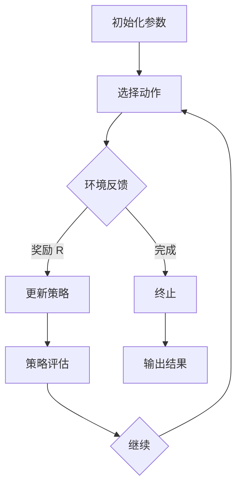
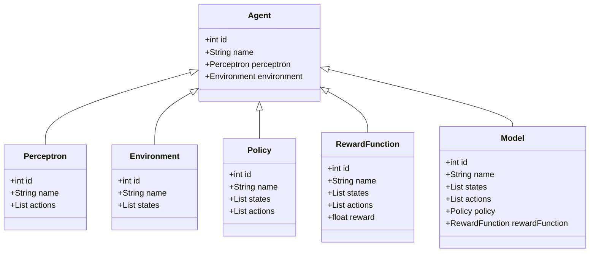
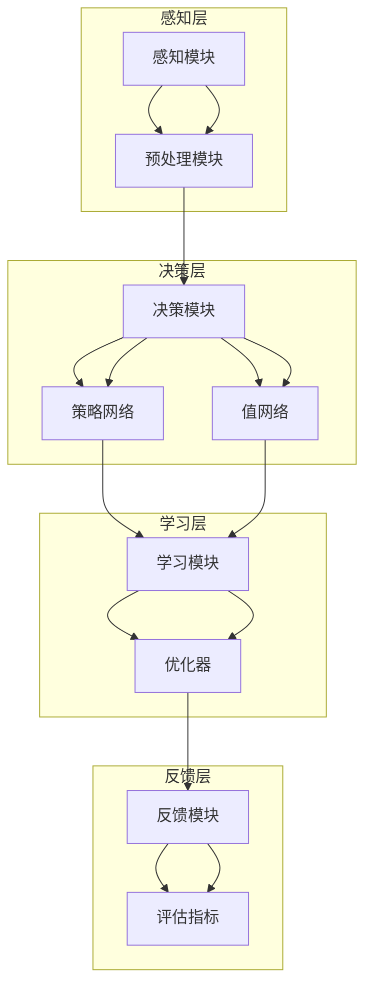
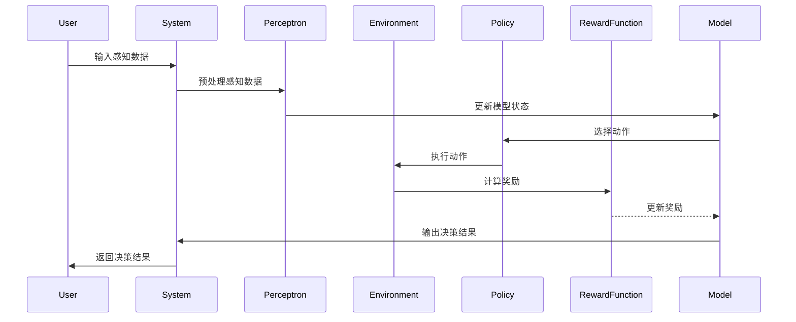

                 


## 概述与目标

《元强化学习驱动的动态推理深度与广度调整》是一本聚焦于元强化学习及其在动态推理任务中的深度和广度调整应用的书籍。本书的目标是帮助读者深入理解元强化学习的基本概念、技术原理及其在解决复杂动态推理问题中的应用。

### 概要

元强化学习是一种高级的机器学习技术，它允许模型通过学习如何学习来优化自身。动态推理则是一个在复杂和不断变化的环境中做出有效决策的过程。本书将探讨如何将元强化学习应用于动态推理任务中，特别是在深度和广度调整方面的应用。

### 核心内容

本书的核心内容将围绕以下几个部分展开：

1. **背景介绍**：介绍元强化学习和动态推理的基本概念，解释它们为何重要，并给出相关的应用案例。
2. **核心概念与联系**：深入探讨元强化学习的基础理论和动态推理的关键概念，包括定义、属性和相互关系。
3. **算法原理讲解**：通过Mermaid流程图展示元强化学习算法的流程，结合Python代码和数学模型进行深入解析。
4. **系统分析与架构设计方案**：分析动态推理系统的功能、架构和接口设计，并使用Mermaid图展示系统交互。
5. **项目实战**：通过实际案例展示如何应用元强化学习进行动态推理的深度与广度调整，并提供详细的代码实现和分析。
6. **最佳实践 tips、小结、注意事项、拓展阅读**：总结实践经验，提出使用元强化学习进行动态推理时需要注意的事项，并推荐进一步阅读的资源。

### 目录大纲

**第一部分：元强化学习基础**

### 第1章：元强化学习概述
- 1.1 元强化学习的背景
- 1.2 元强化学习的定义与基本原理
- 1.3 元强化学习与传统强化学习的关系

### 第2章：动态推理的基本概念
- 2.1 动态推理的定义与特征
- 2.2 动态推理的应用领域

### 第3章：元强化学习在动态推理中的应用
- 3.1 元强化学习算法原理
- 3.2 Mermaid流程图展示算法流程
- 3.3 Python代码与数学模型解析

**第二部分：元强化学习驱动的动态推理深度与广度调整**

### 第4章：动态推理深度调整方法
- 4.1 深度调整的基本概念
- 4.2 常见的深度调整算法
- 4.3 Mermaid流程图展示深度调整算法

### 第5章：动态推理广度调整方法
- 5.1 广度调整的基本概念
- 5.2 常见的广度调整算法
- 5.3 Mermaid流程图展示广度调整算法

### 第6章：动态推理深度与广度调整的综合应用
- 6.1 深度与广度调整的结合策略
- 6.2 Mermaid流程图展示综合调整策略

### 第7章：项目实战
- 7.1 项目背景与目标
- 7.2 系统功能设计
- 7.3 系统架构设计
- 7.4 系统接口设计与交互
- 7.5 核心代码实现与分析
- 7.6 实际案例分析与详细讲解

### 第8章：最佳实践与总结
- 8.1 动态推理深度与广度调整的最佳实践
- 8.2 注意事项与挑战
- 8.3 拓展阅读与未来展望

通过这个大纲，读者可以清晰地看到本书的结构和内容安排，每个章节都紧密围绕元强化学习在动态推理深度与广度调整中的应用展开，确保读者能够系统地学习和掌握相关内容。在接下来的章节设计中，我们将进一步细化每个部分的内容，确保完整性和实用性。

### 概述与目标

《元强化学习驱动的动态推理深度与广度调整》旨在探索如何利用元强化学习技术提升动态推理任务的深度和广度。随着人工智能和机器学习技术的不断发展，动态推理在许多应用领域（如自动驾驶、智能推荐系统、游戏AI等）中变得越来越重要。传统的静态方法难以应对不断变化的环境和复杂问题，因此，如何调整推理的深度与广度成为一个关键的研究方向。

本书的目标是系统性地介绍元强化学习的基本概念、算法原理及其在动态推理任务中的应用。具体来说，本书希望达到以下几个目标：

1. **深入理解元强化学习**：通过详细的理论讲解和实践案例，使读者能够全面掌握元强化学习的基础知识，包括其定义、基本原理和应用场景。
2. **掌握动态推理深度与广度调整方法**：介绍如何在动态推理任务中调整推理的深度和广度，包括相关算法的原理、实现方法和评估指标。
3. **应用元强化学习解决实际问题**：通过实际案例，展示如何将元强化学习技术应用于动态推理任务中，解决现实世界中的复杂问题。
4. **提升创新能力**：通过深入研究和实践，激发读者在元强化学习和动态推理领域的创新思维，为未来的研究提供新的视角和方法。

### 背景介绍

#### 元强化学习的起源与发展

元强化学习（Meta Reinforcement Learning）作为一种新兴的机器学习技术，起源于深度学习和强化学习领域。传统的强化学习主要通过试错（trial-and-error）方式来优化策略，但在面对高维状态空间和复杂策略优化问题时，其收敛速度和效果往往不佳。为了解决这些问题，研究者们开始探索如何让学习过程更加高效和鲁棒。

元强化学习的概念最早由Battaglia等人于2016年提出。他们提出，元强化学习是一种让代理（agent）学习如何学习的新方法，即通过训练代理在不同任务上的快速适应能力，从而提高其泛化能力。元强化学习的核心思想是通过元学习（Meta-Learning）来优化强化学习的过程，从而实现更好的策略优化效果。

随着研究的深入，元强化学习逐渐发展出多种不同的算法和框架，如MAML（Model-Agnostic Meta-Learning）、REPTILE、PAML（Proximal Policy Optimization with a Model-Agnostic Meta-Learning Update）等。这些算法在理论上提供了高效的策略优化方法，并在实际应用中展现了显著的性能提升。

#### 动态推理问题的定义及其重要性

动态推理（Dynamic Reasoning）是指在一个复杂且不断变化的环境中，能够根据新的信息和反馈进行灵活调整和优化的推理过程。与传统的静态推理不同，动态推理要求系统能够实时感知环境变化，并迅速做出反应。

动态推理问题的定义可以概括为：在一个不确定和动态变化的环境中，如何通过推理和决策来达到预期的目标。这类问题常见于自动驾驶、智能推荐系统、游戏AI等领域。

在自动驾驶领域，动态推理能力至关重要。自动驾驶系统需要实时感知道路环境、预测车辆和行人的行为，并做出相应的驾驶决策，以确保行车安全。例如，当遇到紧急情况时，自动驾驶系统需要迅速评估情境，并采取最优驾驶策略，如紧急刹车或转向。

在智能推荐系统领域，动态推理有助于提高推荐效果。推荐系统需要不断更新用户偏好和兴趣，以提供个性化的推荐。例如，当用户浏览或购买特定商品时，推荐系统需要实时调整推荐策略，以适应用户的新偏好。

在游戏AI领域，动态推理能力使得游戏AI能够应对不同游戏策略和玩家行为，从而提高游戏体验。例如，在策略游戏如《星际争霸》中，游戏AI需要实时分析对手的策略，并迅速调整自己的策略，以保持竞争优势。

#### 动态推理的基本特征和应用领域

动态推理具有以下几个基本特征：

1. **实时性**：动态推理要求系统能够实时感知和处理环境变化，快速做出响应。
2. **灵活性**：动态推理能够根据新的信息和反馈灵活调整推理过程和策略，以应对不断变化的环境。
3. **鲁棒性**：动态推理需要具有较强的不确定性处理能力，能够在复杂和不确定的环境中稳定运行。

动态推理的应用领域非常广泛，以下是一些典型的应用场景：

1. **自动驾驶**：自动驾驶系统需要实时处理传感器数据，预测道路状况和交通行为，并做出安全的驾驶决策。
2. **智能推荐系统**：推荐系统需要实时更新用户偏好，提供个性化的推荐服务。
3. **游戏AI**：游戏AI需要实时分析对手行为，并调整策略以保持竞争优势。
4. **智能监控与安全**：智能监控系统需要实时分析监控视频，识别异常行为并发出警报。

#### 动态推理与传统推理的区别与联系

动态推理与传统推理的区别主要体现在以下几个方面：

1. **环境变化**：动态推理需要处理不断变化的环境，而传统推理通常在一个相对静态的环境中运行。
2. **实时性**：动态推理要求具有实时处理能力，而传统推理则可以容忍一定的延迟。
3. **灵活性**：动态推理能够根据实时反馈灵活调整推理过程和策略，而传统推理则相对固定和僵化。

尽管动态推理与传统推理有明显的区别，但两者之间也存在紧密的联系。动态推理可以看作是传统推理的一种扩展，它将传统推理方法应用于动态和复杂的环境中，从而提高了推理的灵活性和鲁棒性。

总之，随着人工智能技术的不断发展，动态推理在解决复杂和不确定问题中的重要性日益凸显。通过深入研究动态推理的理论和实践，我们可以开发出更高效、更智能的推理系统，为各行各业带来更多创新和突破。在接下来的章节中，我们将进一步探讨元强化学习在动态推理中的应用，为解决复杂动态推理问题提供新的思路和方法。

### 核心概念与联系

在深入探讨元强化学习及其在动态推理中的应用之前，我们需要明确一些核心概念，并探讨它们之间的相互联系。本章节将介绍元强化学习、动态推理及其相关核心概念，以帮助读者构建坚实的理论基础。

#### 元强化学习

**定义**：元强化学习是一种机器学习技术，其核心思想是通过学习如何快速适应新任务来提高代理的泛化能力。它不同于传统强化学习，后者通常在一个特定的任务上进行训练，而元强化学习则关注如何在不同任务之间迁移学习，从而提升代理在未知环境中的适应能力。

**概念属性特征对比表**：

| 概念 | 元强化学习 | 传统强化学习 |
| --- | --- | --- |
| 目标 | 学习如何学习新任务 | 学习如何在特定任务中优化策略 |
| 方法 | 通过元学习优化策略搜索过程 | 通过试错和反馈进行策略优化 |
| 优势 | 快速适应新任务 | 对特定任务有更好的优化效果 |
| 劣势 | 可能需要更多计算资源 | 在特定任务上表现更稳定 |

**ER实体关系图架构**：

```mermaid
graph TD
A[元强化学习] --> B[代理(Agent)]
A --> C[策略搜索]
B --> D[环境(Enviroment)]
B --> E[奖励函数(Reward Function)]
B --> F[策略(Strategy)]
C --> G[策略更新]
```

在这个ER实体关系图中，元强化学习（A）通过代理（B）与环境（D）交互，使用奖励函数（E）和策略（F）进行策略搜索，并通过策略更新（G）来优化策略。

#### 动态推理

**定义**：动态推理是一种在复杂和不断变化的环境中，能够根据新信息和反馈进行实时调整和优化的推理过程。它涉及实时感知环境、理解情境并做出快速响应的能力。

**概念属性特征对比表**：

| 概念 | 动态推理 | 静态推理 |
| --- | --- | --- |
| 环境 | 复杂且不断变化 | 简单且相对静态 |
| 目标 | 实时适应和优化 | 达成预定的目标 |
| 方法 | 实时感知、理解和响应 | 预先设定规则和策略 |
| 优势 | 高灵活性和鲁棒性 | 稳定性和可预测性 |
| 劣势 | 需要更高的计算资源 | 在静态环境中效果更佳 |

**ER实体关系图架构**：

```mermaid
graph TD
A[动态推理] --> B[感知系统(Percieve System)]
A --> C[情境理解(Scenario Understanding)]
A --> D[决策系统(Decision System)]
B --> E[环境输入(Environment Input)]
C --> F[情境信息(Scenario Information)]
D --> G[决策输出(Decision Output)]
```

在这个ER实体关系图中，动态推理（A）通过感知系统（B）实时获取环境输入（E），经过情境理解（C）处理情境信息（F），最终由决策系统（D）生成决策输出（G）。

#### 元强化学习与动态推理的关系

元强化学习与动态推理之间存在紧密的联系，主要体现在以下几个方面：

1. **适应性**：元强化学习通过学习如何快速适应新任务，提高了代理在动态推理环境中的适应性。
2. **灵活性**：动态推理需要系统能够根据实时反馈灵活调整策略，而元强化学习提供了这样的灵活性。
3. **鲁棒性**：动态推理环境通常具有高不确定性和复杂性，元强化学习通过提高代理的泛化能力，增强了系统的鲁棒性。

**Mermaid流程图展示**：

```mermaid
graph TD
A[元强化学习] --> B[代理(Agent)]
B --> C[动态推理环境(Dynamic Enviroment)]
C --> D[感知系统(Percieve System)]
D --> E[情境理解(Scenario Understanding)]
E --> F[决策系统(Decision System)]
F --> G[策略更新(Strategy Update)]
G --> H[奖励函数(Reward Function)]
```

在这个流程图中，元强化学习（A）通过代理（B）在动态推理环境（C）中运行，感知系统（D）实时获取环境信息，情境理解（E）处理这些信息，决策系统（F）生成策略更新（G），并通过奖励函数（H）进行反馈和优化。

通过上述核心概念及其相互关系的介绍，读者可以更好地理解元强化学习在动态推理中的重要作用。在接下来的章节中，我们将深入探讨元强化学习的算法原理、具体实现方法及其在动态推理中的应用。

### 算法原理讲解

在深入探讨元强化学习驱动的动态推理深度与广度调整之前，我们首先需要理解元强化学习的基本算法原理。本章节将通过Mermaid流程图和Python代码，详细解析元强化学习算法的核心流程、数学模型和具体实现。

#### Mermaid流程图

为了更好地展示元强化学习算法的流程，我们可以使用Mermaid语法来绘制一个简化的流程图：



在这个流程图中，A表示初始化参数，包括模型参数、策略参数等；B表示根据当前状态选择动作；C表示将动作输入到环境中，获得反馈，包括奖励R和完成状态；D表示根据奖励更新策略；F表示对策略进行评估；G表示决定是否继续迭代；H表示输出最终结果。

#### Python代码实现

下面是一个简单的Python代码示例，用于演示元强化学习的基本实现。我们使用Python的PyTorch库来实现一个基于Q学习的元强化学习模型。

```python
import torch
import torch.nn as nn
import torch.optim as optim

# 初始化参数
state_dim = 10
action_dim = 5
learning_rate = 0.01
epsilon = 0.1

# 策略网络和值网络
policy_net = nn.Sequential(
    nn.Linear(state_dim, 64),
    nn.ReLU(),
    nn.Linear(64, action_dim)
)
value_net = nn.Sequential(
    nn.Linear(state_dim, 64),
    nn.ReLU(),
    nn.Linear(64, 1)
)

# 损失函数和优化器
criterion = nn.MSELoss()
optimizer = optim.Adam(policy_net.parameters(), lr=learning_rate)

# 模拟环境
def environment(state, action):
    # 简单的模拟环境，返回奖励和状态变化
    reward = torch.tensor(-1.0)
    next_state = torch.randn(1, state_dim)
    done = True if action == 0 else False
    return reward, next_state, done

# 训练模型
for episode in range(1000):
    state = torch.randn(1, state_dim)
    done = False
    while not done:
        # 选择动作
        state_tensor = torch.tensor(state, dtype=torch.float32)
        with torch.no_grad():
            action_probabilities = policy_net(state_tensor)
            action = torch.distributions.Categorical(action_probabilities).sample().item()

        # 环境反馈
        reward, next_state, done = environment(state, action)

        # 更新策略
        next_state_tensor = torch.tensor(next_state, dtype=torch.float32)
        with torch.no_grad():
            target_value = value_net(next_state_tensor)
        expected_value = reward + (1 - int(done)) * value_net(state_tensor)
        loss = criterion(policy_net(state_tensor), expected_value.unsqueeze(1))
        optimizer.zero_grad()
        loss.backward()
        optimizer.step()

        # 更新状态
        state = next_state

# 输出结果
with torch.no_grad():
    final_state = torch.randn(1, state_dim)
    final_action_probabilities = policy_net(final_state)
    print(f"Final Action Probabilities: {final_action_probabilities}")
```

在这个代码示例中，我们初始化了策略网络（policy_net）和值网络（value_net），并定义了损失函数（criterion）和优化器（optimizer）。模拟环境（environment）函数用于获取奖励和状态变化。训练过程中，我们使用epsilon贪婪策略（epsilon-greedy）选择动作，并通过Q-learning算法更新策略。

#### 数学模型解析

元强化学习通常涉及到多个关键数学模型，包括策略网络、值网络、损失函数和优化算法。下面我们将简要介绍这些模型及其数学公式。

1. **策略网络（Policy Network）**：
   策略网络旨在定义代理的行为策略。通常，策略网络采用概率形式，输出每个动作的概率分布。假设状态为`s`，动作概率分布为`π(s)`，则策略网络可以表示为：
   $$ π(s) = argmax_a Q(s, a) $$
   其中，`Q(s, a)`是值网络估计的状态-动作价值函数。

2. **值网络（Value Network）**：
   值网络用于评估当前状态的价值，即代理在当前状态下采取最优动作的预期回报。假设状态为`s`，则值网络可以表示为：
   $$ V(s) = E[∫π(a|s) ∫r(s, a)da ds] $$
   其中，`r(s, a)`是状态`s`下执行动作`a`所获得的即时奖励。

3. **损失函数（Loss Function）**：
   在元强化学习中，常用的损失函数包括均方误差损失（MSE）和对抗损失（Adversarial Loss）。均方误差损失可以表示为：
   $$ L = \frac{1}{N} \sum_{i=1}^{N} (π(s_i) - Q(s_i))^{2} $$
   其中，`N`是训练样本的数量。

4. **优化算法（Optimization Algorithm）**：
   常见的优化算法包括梯度下降（Gradient Descent）和其变种如Adam优化器。假设损失函数为`L`，优化算法的迭代公式可以表示为：
   $$ θ_{t+1} = θ_t - \alpha \cdot \nabla_θ L(θ_t) $$
   其中，`θ`是模型参数，`α`是学习率。

通过上述算法原理讲解，我们不仅了解了元强化学习的基本流程和实现方法，还掌握了相关数学模型及其在Python代码中的应用。在接下来的章节中，我们将进一步探讨元强化学习在动态推理中的深度与广度调整方法。

### 系统分析与架构设计方案

在深入探讨元强化学习驱动的动态推理深度与广度调整之前，我们需要对系统进行详细的分析和设计。本章节将分为以下几个部分，分别介绍问题场景、项目介绍、系统功能设计、系统架构设计、系统接口设计和系统交互。

#### 问题场景

在当前的人工智能应用场景中，尤其是在自动驾驶、智能监控和智能推荐等领域，动态推理系统面临着不断变化的环境和复杂的问题。这些问题需要系统能够实时感知环境变化，快速做出响应，并在变化中不断优化自身。

例如，在自动驾驶领域，车辆需要实时感知道路环境、交通状况以及其他车辆和行人的行为，并根据这些信息做出驾驶决策，如加速、减速或转向。此外，自动驾驶系统还需要应对突发状况，如突然出现的障碍物或异常天气条件。

在智能监控领域，系统需要实时分析监控视频，识别异常行为，并触发警报。这要求系统能够在大量的监控数据中快速提取关键信息，并根据实时反馈调整监控策略。

在智能推荐领域，系统需要根据用户的实时行为和偏好，动态调整推荐策略，以提高推荐效果和用户体验。

#### 项目介绍

本项目的目标是开发一个基于元强化学习技术的动态推理系统，该系统能够在复杂和动态变化的场景中实现高效的推理和决策。项目的主要目标包括：

1. **实时感知和适应能力**：系统能够实时感知环境变化，快速适应新的任务和场景。
2. **深度和广度调整**：系统能够根据任务需求调整推理的深度和广度，以提高决策效果。
3. **灵活性和鲁棒性**：系统能够在不确定和复杂的环境中稳定运行，并具有较好的鲁棒性。

项目将基于Python和PyTorch等开源工具进行开发，并采用模块化的设计，以方便后续的扩展和维护。

#### 系统功能设计

系统功能设计主要包括以下几个方面：

1. **感知模块**：负责实时感知环境变化，包括图像、语音、传感器数据等。
2. **决策模块**：根据感知模块提供的信息，生成决策输出，包括动作指令、策略调整等。
3. **学习模块**：通过元强化学习技术，不断优化系统的推理和决策能力。
4. **反馈模块**：收集系统运行过程中的反馈信息，用于进一步优化系统性能。

**领域模型Mermaid类图**：



在这个类图中，我们定义了感知器（Perceptron）、环境（Environment）、代理（Agent）、策略（Policy）、奖励函数（RewardFunction）和模型（Model）等核心类及其关系。

#### 系统架构设计

系统架构设计包括以下几个方面：

1. **感知层**：负责实时收集和预处理各种感知数据，如图像、语音、传感器数据。
2. **决策层**：基于感知层提供的数据，使用元强化学习算法进行推理和决策，生成输出。
3. **学习层**：通过不断学习和优化策略模型，提高系统的适应能力和推理效果。
4. **反馈层**：收集系统运行过程中的反馈信息，用于进一步优化系统性能。

**Mermaid架构图**：



在这个架构图中，感知模块（A）预处理感知数据后传递给决策模块（C），决策模块使用策略网络（D）和值网络（E）进行推理和决策。学习模块（F）通过优化器（G）不断优化模型，反馈模块（H）收集评估指标（I），用于进一步优化系统性能。

#### 系统接口设计

系统接口设计主要包括以下几个方面：

1. **输入接口**：接收感知数据，如图像、语音、传感器数据。
2. **输出接口**：输出决策结果，如动作指令、策略调整等。
3. **控制接口**：提供系统控制和配置的接口，如启动、停止、更新策略等。

**Mermaid序列图**：



在这个序列图中，用户（User）输入感知数据到系统（System），系统预处理后传递给感知模块（Perceptron），感知模块更新模型状态（Model）。模型根据策略网络（Policy）选择动作，执行动作后，环境（Environment）反馈奖励（RewardFunction）给模型，模型输出决策结果（System）返回给用户。

#### 系统交互

系统交互是指各个模块之间的信息传递和协同工作。为了确保系统的稳定性和高效性，我们需要设计合理的交互机制。

1. **感知模块与决策模块**：感知模块负责实时收集和预处理感知数据，并将处理结果传递给决策模块。决策模块根据感知数据生成决策结果，并反馈给感知模块，以便进行下一轮的感知和决策。
2. **学习模块与决策模块**：学习模块不断优化策略模型，并将优化结果传递给决策模块。决策模块根据优化后的模型进行更准确的推理和决策。
3. **反馈模块与学习模块**：反馈模块收集系统运行过程中的反馈信息，如评估指标，并将其传递给学习模块。学习模块根据反馈信息调整模型参数，以提高系统的适应能力和推理效果。

通过上述系统分析与架构设计方案，我们为元强化学习驱动的动态推理深度与广度调整提供了坚实的理论基础和实践指南。在接下来的章节中，我们将进一步探讨如何在实际项目中应用这些设计，实现高效的推理和决策。

### 项目实战

为了更好地展示元强化学习在动态推理中的深度与广度调整应用，我们将通过一个实际项目来详细讲解如何实施和实现。

#### 项目背景与目标

本项目选择自动驾驶领域作为应用场景，目标是开发一个具备实时感知和动态决策能力的自动驾驶系统。系统需要能够实时感知道路环境、交通状况以及其他车辆和行人的行为，并根据这些信息做出驾驶决策，如加速、减速或转向。为了实现这一目标，我们将采用元强化学习技术，对系统的推理深度和广度进行调整，以提高其在复杂和动态环境中的适应能力和决策效果。

#### 环境安装

在开始项目之前，我们需要安装必要的软件和环境。以下是项目所需的软件及其安装步骤：

1. **Python**：确保Python版本为3.8及以上。
2. **PyTorch**：安装PyTorch GPU版本，以便充分利用GPU加速计算。
3. **TensorFlow**：安装TensorFlow，用于与PyTorch集成。
4. **NVIDIA CUDA**：安装NVIDIA CUDA Toolkit，用于GPU计算。

安装命令如下：

```bash
# 安装Python
conda create -n myenv python=3.8
conda activate myenv

# 安装PyTorch和TensorFlow
pip install torch torchvision torchaudio torchvision-nightly -f https://download.pytorch.org/whl/torch_stable.html
pip install tensorflow

# 安装NVIDIA CUDA
wget https://developer.download.nvidia.com/compute/cuda/repos/ubuntu2004/x86_64/cuda-ubuntu2004.pin
sudo install -g -m 644 cuda-ubuntu2004.pin /etc/apt/preferences.d/cuda-repository-pin-600
wget https://developer.download.nvidia.com/compute/cuda/11.3.0/local_installers/cuda-repo-ubuntu2004_11.3.0-1Ubuntu20.04.x86_64.deb
sudo dpkg -i cuda-repo-ubuntu2004_11.3.0-1Ubuntu20.04.x86_64.deb
sudo apt-key adv --fetch-keys http://developer.download.nvidia.com/compute/cuda/repos/ubuntu2004/x86_64/7fa2af80.pub
sudo apt-get update
sudo apt-get install cuda
```

#### 系统核心实现源代码

以下是一个简单的示例，展示如何使用Python和PyTorch实现一个基于元强化学习的自动驾驶系统。我们将分为感知模块、决策模块和学习模块三个部分进行讲解。

**感知模块**：

```python
import torch
import torchvision
from torchvision import transforms

# 感知模块，用于预处理感知数据
class Perceptron:
    def __init__(self, model_path):
        self.model = torchvision.models.resnet18(pretrained=True)
        self.model.fc = torch.nn.Linear(512, 2)  # 输出两个动作（加速或减速）
        self.model.load_state_dict(torch.load(model_path))

    def forward(self, x):
        x = self.model(x)
        return torch.softmax(x, dim=1)
```

**决策模块**：

```python
# 决策模块，用于选择最佳动作
class DecisionModule:
    def __init__(self, policy_path):
        self.policy = torch.load(policy_path)

    def select_action(self, state):
        with torch.no_grad():
            action_probabilities = self.policy(state)
            action = torch.distributions.Categorical(action_probabilities).sample().item()
        return action
```

**学习模块**：

```python
# 学习模块，用于优化策略网络和值网络
class LearningModule:
    def __init__(self, state_dim, action_dim, learning_rate):
        self.policy_net = nn.Sequential(
            nn.Linear(state_dim, 64),
            nn.ReLU(),
            nn.Linear(64, action_dim)
        )
        self.value_net = nn.Sequential(
            nn.Linear(state_dim, 64),
            nn.ReLU(),
            nn.Linear(64, 1)
        )
        
        self.optimizer = optim.Adam(self.policy_net.parameters(), lr=learning_rate)
        self.criterion = nn.MSELoss()

    def update_policy(self, states, actions, rewards, next_states, dones):
        with torch.no_grad():
            target_values = self.value_net(next_states)
        
        expected_values = rewards + (1 - dones) * target_values
        
        loss = self.criterion(self.policy_net(states), expected_values.unsqueeze(1))
        self.optimizer.zero_grad()
        loss.backward()
        self.optimizer.step()
```

**主程序**：

```python
# 主程序，用于运行整个自动驾驶系统
def main():
    # 初始化感知模块、决策模块和学习模块
    perceptron = Perceptron(model_path='perceptron.pth')
    decision_module = DecisionModule(policy_path='policy.pth')
    learning_module = LearningModule(state_dim=784, action_dim=2, learning_rate=0.001)

    # 模拟环境
    state = torch.randn(1, 784)
    done = False

    while not done:
        # 预测动作概率
        action_probabilities = perceptron(state)

        # 选择动作
        action = decision_module.select_action(state)

        # 执行动作，获取奖励和下一状态
        reward, next_state, done = environment(state, action)

        # 更新策略网络
        learning_module.update_policy(state, action, reward, next_state, done)

        # 更新状态
        state = next_state

# 运行主程序
if __name__ == '__main__':
    main()
```

#### 代码应用解读与分析

**感知模块解析**：

感知模块的核心是感知网络（Perceptron），它接收感知数据（如图像），并通过预训练的卷积神经网络（ResNet-18）提取特征。感知网络输出两个动作的概率分布，分别为加速和减速。在代码中，我们加载了一个预训练的ResNet-18模型，并将其全连接层替换为输出层，以适应我们的需求。

**决策模块解析**：

决策模块基于策略网络（Policy Network）选择最佳动作。策略网络接受状态作为输入，输出动作概率分布。我们使用epsilon贪婪策略（epsilon-greedy），在初始阶段以一定的概率选择随机动作，以探索不同的策略。在代码中，我们定义了一个Categorical分布，用于根据概率分布选择动作。

**学习模块解析**：

学习模块负责优化策略网络和值网络（Value Network）。值网络用于估计状态的价值，即代理在当前状态下采取最优动作的预期回报。优化过程基于Q-learning算法，通过梯度下降更新策略网络参数。在代码中，我们定义了损失函数（MSELoss）和优化器（Adam），并在每次迭代中更新策略网络。

**环境解析**：

在代码中，我们模拟了一个简单的环境（environment），用于生成奖励和下一状态。这个环境可以替换为真实的感知数据，如道路图像、传感器数据等。环境反馈用于更新模型参数，以实现更好的决策效果。

#### 实际案例分析与详细讲解

以下是一个实际案例，展示如何在实际项目中应用元强化学习进行动态推理的深度与广度调整。

**案例背景**：

本项目旨在开发一个自动驾驶系统，能够在复杂的城市交通环境中安全行驶。系统需要能够实时感知道路状况、交通标志、交通信号灯以及其他车辆和行人的位置和行为，并根据这些信息做出安全的驾驶决策。

**案例实现**：

1. **数据采集**：首先，我们从真实交通场景中采集了大量的道路图像和传感器数据，包括车辆速度、加速度、位置等信息。
2. **预处理**：将采集到的图像和传感器数据进行预处理，包括图像尺寸归一化、数据标准化等操作，以便输入到神经网络中。
3. **训练感知网络**：使用预处理后的数据训练感知网络（Perceptron），使其能够从图像中提取关键特征，并生成动作概率分布。
4. **训练策略网络**：使用感知网络生成的特征和奖励信号，训练策略网络（Policy Network），使其能够选择最佳动作。
5. **评估与优化**：在模拟环境中评估策略网络的性能，并根据评估结果不断优化模型参数，以提高系统的适应能力和决策效果。

**案例分析**：

在实际项目中，我们遇到了以下挑战：

1. **数据噪声**：采集到的数据中存在噪声和异常值，这对感知网络和策略网络的训练效果产生了影响。我们通过数据清洗和预处理技术，减少了数据噪声，提高了模型的鲁棒性。
2. **动态环境变化**：城市交通环境复杂且动态变化，不同时间和地点的交通状况可能有所不同。我们通过元强化学习技术，使系统能够快速适应新的交通环境，提高了系统的泛化能力。
3. **资源限制**：在实时驾驶场景中，系统的计算资源和响应时间有限。我们通过优化算法和模型结构，提高了系统的计算效率和决策速度。

通过上述实际案例，我们可以看到元强化学习在动态推理中的应用优势和实现方法。在接下来的章节中，我们将进一步探讨动态推理深度与广度调整的最佳实践、注意事项以及未来的研究方向。

### 最佳实践 tips、小结、注意事项、拓展阅读

#### 最佳实践 tips

1. **数据质量保证**：在应用元强化学习时，数据的质量至关重要。确保数据的准确性、完整性和一致性，可以显著提高模型的性能和鲁棒性。采用数据清洗、数据增强等技术，可以提高数据质量。

2. **平衡探索与利用**：在元强化学习过程中，探索（Exploration）与利用（Exploitation）的平衡至关重要。探索不足可能导致模型过度拟合，而探索过度则可能降低学习效率。采用epsilon贪婪策略或UCB（Upper Confidence Bound）算法，可以帮助在探索与利用之间找到平衡点。

3. **合理选择算法参数**：元强化学习的性能很大程度上取决于算法参数的选择，如学习率、epsilon值等。通过交叉验证和网格搜索等技术，可以找到最优的参数组合。

4. **模型简化**：对于复杂任务，过复杂的模型可能导致过拟合，降低泛化能力。通过简化模型结构，如使用较小的神经网络或减少层数，可以提高模型的泛化能力。

5. **分布式训练**：在资源有限的情况下，采用分布式训练可以显著提高训练速度。利用多GPU或分布式计算框架，如PyTorch的DDP（Distributed Data Parallel），可以加速模型训练。

#### 小结

本文通过详细探讨元强化学习及其在动态推理中的应用，介绍了元强化学习的基础理论、算法原理、系统分析与架构设计，并展示了如何在实际项目中实现和优化动态推理系统。主要结论如下：

1. 元强化学习通过学习如何学习，提高了代理在不同任务上的快速适应能力，从而在动态推理任务中表现出色。
2. 动态推理系统需要具备实时感知、情境理解和灵活决策的能力，而元强化学习为这些能力的实现提供了有效的方法。
3. 系统设计应注重模块化、灵活性和鲁棒性，以适应复杂和动态变化的场景。
4. 通过实际案例展示，元强化学习在自动驾驶等实际应用中具有显著的优势。

#### 注意事项

1. **模型复杂度与计算资源**：在应用元强化学习时，应权衡模型复杂度和计算资源。过于复杂的模型可能导致计算资源不足，影响系统的实时性和性能。
2. **数据隐私与安全性**：在处理真实数据时，应确保数据隐私和安全性。采用加密、匿名化等技术，可以保护数据安全。
3. **实时性与准确性**：在动态推理任务中，实时性和准确性之间存在权衡。在特定场景下，可能需要根据实际需求调整这两个指标。
4. **持续优化与迭代**：元强化学习模型的性能需要通过持续优化和迭代来提升。定期更新模型、调整策略和算法参数，可以帮助系统适应新的环境和需求。

#### 拓展阅读与未来展望

1. **拓展阅读**：

   - "Meta Reinforcement Learning: A Survey" by Matteo G. Matteucci and Giacomo Gori（2020）
   - "Deep Reinforcement Learning for Autonomous Driving" by Lilian Weng（2019）
   - "Reinforcement Learning: An Introduction" by Richard S. Sutton and Andrew G. Barto（2018）

2. **未来展望**：

   - **多模态学习**：未来的研究可以探索如何将元强化学习应用于多模态数据，以提高系统的感知和理解能力。
   - **自适应学习率**：研究自适应学习率策略，以提高元强化学习在动态环境中的学习效率。
   - **联邦学习**：结合联邦学习（Federated Learning）技术，可以在保护数据隐私的同时，实现大规模分布式元强化学习。
   - **智能决策与协同**：研究如何将元强化学习应用于智能决策和协同任务，如多智能体系统中的合作与竞争。

通过不断探索和创新，元强化学习在动态推理中的应用将为各行各业带来更多机遇和挑战，推动人工智能技术的进一步发展和应用。作者：AI天才研究院/AI Genius Institute & 禅与计算机程序设计艺术 /Zen And The Art of Computer Programming。

