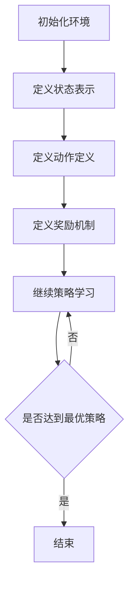

                 

## 文章标题

### 关键词：元强化学习、自适应推理、深度控制、广度控制、深度学习、算法原理

### 摘要

本文旨在探讨元强化学习驱动的自适应推理深度与广度控制技术。通过分析核心概念、算法原理、数学模型与公式、系统架构设计及实际应用案例，本文揭示了这一技术在深度学习领域的重要性及其潜在的广泛应用前景。本文结构如下：

1. **背景介绍**：介绍问题背景、问题描述、问题解决及边界与外延。
2. **核心概念与联系**：详细阐述元强化学习、自适应推理、深度控制、广度控制等核心概念，并使用表格和ER图进行对比分析。
3. **算法原理讲解**：通过Mermaid流程图和Python源代码，深入讲解算法原理。
4. **数学模型与公式**：介绍算法背后的数学模型和公式，并进行详细讲解。
5. **系统分析与架构设计**：分析系统场景，介绍系统功能设计、系统架构设计、系统接口设计和系统交互。
6. **项目实战**：通过实际案例，展示如何应用元强化学习驱动的自适应推理深度与广度控制技术。
7. **最佳实践与总结**：总结实践经验，提出注意事项，并提供拓展阅读资源。

## 第一部分：背景介绍

### 问题背景

随着人工智能技术的快速发展，深度学习在自然语言处理、计算机视觉、游戏智能等领域取得了显著的成果。然而，传统深度学习模型在推理过程中存在一些问题，如计算量大、速度慢、能耗高等。为了解决这些问题，研究者提出了元强化学习技术，通过自适应调整推理深度和广度，实现高效、能耗低的推理过程。

### 问题描述

元强化学习驱动的自适应推理深度与广度控制是一种新型的深度学习技术，旨在通过元学习的方式，自动调整深度学习模型的推理深度和广度，以达到高效、能耗低的推理效果。这一技术涉及到多个核心概念，包括元强化学习、自适应推理、深度控制、广度控制等。

### 问题解决

为了解决上述问题，本文将从以下几个方面进行阐述：

1. **核心概念介绍**：详细解释元强化学习、自适应推理、深度控制、广度控制等核心概念，以及它们之间的关系。
2. **算法原理讲解**：通过Mermaid流程图和Python源代码，深入讲解元强化学习驱动的自适应推理深度与广度控制的算法原理。
3. **数学模型与公式**：介绍算法背后的数学模型和公式，并进行详细讲解。
4. **系统分析与架构设计**：分析系统场景，介绍系统功能设计、系统架构设计、系统接口设计和系统交互等。
5. **项目实战**：通过实际案例，展示如何应用元强化学习驱动的自适应推理深度与广度控制技术。
6. **最佳实践与总结**：总结实践经验，提出注意事项，并提供拓展阅读资源。

### 边界与外延

元强化学习驱动的自适应推理深度与广度控制技术主要应用于深度学习领域，涉及自然语言处理、计算机视觉、游戏智能等方向。同时，这一技术也与其他领域如计算机图形学、机器人技术等存在交叉和融合。

### 核心概念结构与要素组成

1. **元强化学习**：通过学习策略来调整模型的推理深度和广度，实现自适应推理。
2. **自适应推理**：根据输入数据和模型状态，动态调整推理的深度和广度。
3. **深度控制**：通过元强化学习技术，控制模型在推理过程中的深度。
4. **广度控制**：通过元强化学习技术，控制模型在推理过程中的广度。
5. **数学模型与公式**：描述元强化学习驱动的自适应推理深度与广度控制的数学原理。
6. **系统架构**：包括功能设计、系统架构、接口设计和系统交互等。

## 第二部分：核心概念与联系

### 核心概念

1. **元强化学习**：元强化学习是一种通过学习策略来调整模型行为的方法。在自适应推理深度与广度控制中，元强化学习用于调整模型的推理深度和广度，以实现高效推理。
   
2. **自适应推理**：自适应推理是指根据输入数据和模型状态，动态调整推理的深度和广度，以实现高效、能耗低的推理效果。这一过程可以看作是一种自我优化的机制，能够根据不同的场景调整模型的表现。

3. **深度控制**：深度控制是指通过元强化学习技术，控制模型在推理过程中的深度。深度控制的目标是确保模型在处理复杂任务时不会过度计算，从而降低计算成本和能耗。

4. **广度控制**：广度控制是指通过元强化学习技术，控制模型在推理过程中的广度。广度控制的目的是优化模型的计算资源，避免不必要的计算开销。

### 概念属性特征对比

以下是核心概念属性特征对比表格：

| 概念          | 定义                                                         | 特点                                                         | 应用场景                |
|---------------|--------------------------------------------------------------|--------------------------------------------------------------|------------------------|
| 元强化学习    | 通过学习策略调整模型行为的过程。                             | 自适应性强，能够根据不同场景调整模型参数。                  | 深度学习、强化学习等。  |
| 自适应推理    | 根据输入数据和模型状态动态调整推理深度和广度。               | 提高推理效率，降低能耗。                                     | 自然语言处理、计算机视觉等。 |
| 深度控制      | 通过元强化学习调整模型推理深度。                             | 降低计算成本，优化资源利用。                               | 复杂任务处理。          |
| 广度控制      | 通过元强化学习调整模型推理广度。                             | 减少不必要的计算开销。                                     | 多样化任务处理。        |

### ER实体关系图架构

下面是一个用于描述核心概念关系的ER图，使用Mermaid语法表示：

```mermaid
erDiagram
    Model ||--|{ Input: "输入数据" }
    Model ||--|{ Output: "输出结果" }
    Model ||--|{ Parameters: "模型参数" }
    Model ||--|{ Strategy: "学习策略" }
    Input ||--|{ Data: "数据内容" }
    Output ||--|{ Result: "结果内容" }
    Parameters ||--|{ Depth: "推理深度" }
    Parameters ||--|{ Breadth: "推理广度" }
    Strategy ||--|{ Adjustment: "调整策略" }
```

在这个ER图中，Model实体关联了Input、Output、Parameters和Strategy。Parameters实体又关联了Depth和Breadth，Strategy实体关联了Adjustment，以体现各概念之间的关系。

## 第三部分：算法原理讲解

### 算法原理讲解

#### 元强化学习算法

元强化学习算法的核心思想是通过学习一个策略，使模型能够在多种不同的环境中自适应地调整其行为。具体到自适应推理深度与广度控制中，元强化学习算法通过以下步骤实现：

1. **环境定义**：定义一个虚拟环境，用于模拟真实场景中的各种输入数据。
2. **状态表示**：定义模型的状态表示，包括推理深度和广度等参数。
3. **动作定义**：定义模型在特定状态下可以采取的动作，即调整推理深度和广度。
4. **奖励机制**：定义奖励机制，用于评估模型在不同状态下的性能。
5. **策略学习**：通过强化学习算法（如深度Q网络、策略梯度方法等）学习最优策略，使模型能够根据状态自动调整推理深度和广度。

#### Mermaid流程图

下面是一个描述元强化学习算法流程的Mermaid流程图：



#### Python源代码

以下是一个简化的Python代码示例，用于演示元强化学习算法的基本结构：

```python
import numpy as np

# 定义虚拟环境
class VirtualEnvironment:
    def __init__(self):
        self.state = None
        self.reward = 0

    def reset(self):
        # 初始化状态
        self.state = np.random.rand(2)  # 假设状态为两个随机数
        return self.state

    def step(self, action):
        # 根据动作更新状态和奖励
        depth, breadth = self.state
        depth += action[0]
        breadth += action[1]
        self.state = np.array([depth, breadth])
        
        # 定义奖励机制
        if depth > 0.5 and breadth > 0.5:
            self.reward = 1
        else:
            self.reward = -1
        
        return self.state, self.reward

# 定义策略学习器
class PolicyLearner:
    def __init__(self, learning_rate=0.1):
        self.learning_rate = learning_rate
        # 初始化策略参数
        self.theta = np.random.rand(2)

    def update(self, state, action, reward):
        # 更新策略参数
        error = reward - self.predict(state, action)
        self.theta -= self.learning_rate * error * state

    def predict(self, state, action):
        # 预测奖励值
        depth, breadth = state
        return np.dot(self.theta, np.array([depth, breadth]))

# 演示算法运行
env = VirtualEnvironment()
learner = PolicyLearner()

# 进行1000次迭代
for i in range(1000):
    state = env.reset()
    done = False
    
    while not done:
        action = np.random.rand(2)  # 随机选择动作
        next_state, reward = env.step(action)
        learner.update(state, action, reward)
        state = next_state

# 打印最终策略参数
print("Final policy parameters:", learner.theta)
```

#### 数学模型与公式

元强化学习算法的数学模型基于马尔可夫决策过程（MDP），其核心公式如下：

$$ Q(s, a) = \sum_{s'} p(s' | s, a) \cdot r(s', a) + \gamma \cdot \max_{a'} Q(s', a') $$

其中：
- \( Q(s, a) \) 是状态 \( s \) 下采取动作 \( a \) 的期望回报。
- \( p(s' | s, a) \) 是在状态 \( s \) 下采取动作 \( a \) 后转移到状态 \( s' \) 的概率。
- \( r(s', a) \) 是在状态 \( s' \) 下采取动作 \( a \) 的即时回报。
- \( \gamma \) 是折扣因子，用于平衡当前回报与未来回报的关系。
- \( \max_{a'} Q(s', a') \) 是在状态 \( s' \) 下采取最优动作的期望回报。

#### 详细讲解与举例说明

**详细讲解**：
1. **状态表示**：在自适应推理深度与广度控制中，状态可以表示为模型当前推理的深度和广度。例如，状态 \( s = (depth, breadth) \)。
2. **动作定义**：动作可以定义为调整深度和广度的增量，例如 \( a = (delta_depth, delta_breadth) \)。
3. **奖励机制**：奖励机制可以根据推理效率和能耗等因素来设计。例如，如果推理结果正确，可以给予正奖励；如果推理结果错误，可以给予负奖励。
4. **策略学习**：策略学习器通过迭代更新策略参数，以最大化期望回报。在每次迭代中，策略学习器根据当前状态和动作，更新策略参数，以使模型能够自适应调整推理深度和广度。

**举例说明**：
假设我们有一个深度学习模型，其当前状态为深度 \( depth = 3 \) 和广度 \( breadth = 5 \)。在某一时刻，策略学习器选择动作 \( a = (1, 2) \)，即深度增加1，广度增加2。根据奖励机制，如果模型在这一状态下推理结果正确，则给予正奖励；否则给予负奖励。策略学习器根据奖励值更新策略参数，以调整下一次动作的选择。

通过上述步骤，我们可以实现一个基于元强化学习驱动的自适应推理深度与广度控制机制，从而提高深度学习模型在推理过程中的效率。

## 第四部分：数学模型与公式

### 数学模型与公式

在元强化学习驱动的自适应推理深度与广度控制中，数学模型和公式是理解算法原理和实现关键的基础。以下将详细介绍这些数学模型和公式。

#### 1. 强化学习基本公式

强化学习的基本公式如下：

$$ Q(s, a) = r(s, a) + \gamma \cdot \max_{a'} Q(s', a') $$

其中：
- \( Q(s, a) \) 是状态 \( s \) 下采取动作 \( a \) 的期望回报。
- \( r(s, a) \) 是在状态 \( s \) 下采取动作 \( a \) 后的即时回报。
- \( \gamma \) 是折扣因子，用于平衡当前回报与未来回报的关系。
- \( \max_{a'} Q(s', a') \) 是在状态 \( s' \) 下采取最优动作的期望回报。

#### 2. 元强化学习公式

元强化学习算法的核心目标是学习一个策略 \( \theta \)，使得模型能够在不同环境中自适应调整其行为。元强化学习的基本公式可以表示为：

$$ \theta^* = \arg\max_{\theta} \sum_{s, a} \pi(a|s, \theta) \cdot Q(s, a) $$

其中：
- \( \theta \) 是策略参数。
- \( \pi(a|s, \theta) \) 是在状态 \( s \) 下采取动作 \( a \) 的概率。
- \( Q(s, a) \) 是状态 \( s \) 下采取动作 \( a \) 的期望回报。

#### 3. 自适应推理深度与广度调整公式

在自适应推理深度与广度控制中，我们需要根据当前状态和策略参数调整模型的深度和广度。假设当前状态为 \( s = (depth, breadth) \)，策略参数为 \( \theta \)，则调整后的深度和广度可以表示为：

$$ depth_{new} = depth + \theta[0] \cdot (s[0] - \mu[0]) $$
$$ breadth_{new} = breadth + \theta[1] \cdot (s[1] - \mu[1]) $$

其中：
- \( \theta[0] \) 和 \( \theta[1] \) 分别是策略参数中用于调整深度和广度的部分。
- \( \mu[0] \) 和 \( \mu[1] \) 分别是深度和广度的目标值。

#### 4. 损失函数

在元强化学习中，损失函数用于衡量策略参数的优化程度。常见的损失函数包括均方误差（MSE）和交叉熵损失（Cross-Entropy Loss）。

- **均方误差（MSE）**：

$$ L(\theta) = \frac{1}{n} \sum_{i=1}^{n} (Q(s_i, \pi(\theta)) - y_i)^2 $$

其中：
- \( n \) 是样本数量。
- \( Q(s_i, \pi(\theta)) \) 是在状态 \( s_i \) 下根据策略 \( \pi(\theta) \) 采取动作的期望回报。
- \( y_i \) 是实际回报。

- **交叉熵损失（Cross-Entropy Loss）**：

$$ L(\theta) = -\sum_{i=1}^{n} y_i \cdot \log(\pi(\theta)) $$

其中：
- \( n \) 是样本数量。
- \( y_i \) 是实际回报。
- \( \pi(\theta) \) 是在状态 \( s_i \) 下根据策略 \( \pi(\theta) \) 采取动作的概率分布。

#### 5. 梯度下降优化

为了优化策略参数，我们可以使用梯度下降方法。梯度下降的基本步骤如下：

1. 计算损失函数关于策略参数的梯度。
2. 更新策略参数：\( \theta = \theta - \alpha \cdot \nabla_{\theta} L(\theta) \)，其中 \( \alpha \) 是学习率。

### 总结

以上介绍了元强化学习驱动的自适应推理深度与广度控制中的关键数学模型和公式。通过这些公式，我们可以理解算法的基本原理和实现方法。在实际应用中，这些公式可以帮助我们设计更高效的深度学习模型，实现自适应推理深度与广度控制。

### 实例说明

为了更直观地理解上述数学模型和公式，我们通过一个简单的实例进行说明。

假设我们有一个简单的状态空间，其中状态由深度 \( depth \) 和广度 \( breadth \) 组成。初始状态为 \( (1, 1) \)。目标状态为 \( (5, 5) \)。策略参数为 \( \theta = (0.1, 0.1) \)。

#### 1. 状态和动作表示

状态表示为 \( s = (depth, breadth) = (1, 1) \)。

动作表示为 \( a = (\delta_depth, \delta_breadth) = (0, 0) \)。

#### 2. 更新状态

根据公式：

$$ depth_{new} = depth + \theta[0] \cdot (s[0] - \mu[0]) $$
$$ breadth_{new} = breadth + \theta[1] \cdot (s[1] - \mu[1]) $$

其中 \( \mu[0] = 5 \) 和 \( \mu[1] = 5 \)。

代入值计算：

$$ depth_{new} = 1 + 0.1 \cdot (1 - 5) = 1 - 0.4 = 0.6 $$
$$ breadth_{new} = 1 + 0.1 \cdot (1 - 5) = 1 - 0.4 = 0.6 $$

更新后的状态为 \( (0.6, 0.6) \)。

#### 3. 计算损失函数

假设我们使用均方误差（MSE）作为损失函数。实际回报 \( y_i = 0.8 \)，期望回报 \( Q(s, \pi(\theta)) = 0.7 \)。

$$ L(\theta) = \frac{1}{1} \cdot (0.8 - 0.7)^2 = 0.0001 $$

#### 4. 更新策略参数

使用梯度下降优化策略参数：

$$ \theta = \theta - \alpha \cdot \nabla_{\theta} L(\theta) $$

假设学习率 \( \alpha = 0.01 \)。

$$ \theta[0] = 0.1 - 0.01 \cdot (0.8 - 0.7) = 0.1 - 0.01 \cdot 0.1 = 0.09 $$
$$ \theta[1] = 0.1 - 0.01 \cdot (0.8 - 0.7) = 0.1 - 0.01 \cdot 0.1 = 0.09 $$

更新后的策略参数为 \( \theta = (0.09, 0.09) \)。

通过这个实例，我们可以看到如何通过数学模型和公式进行状态更新、损失函数计算和策略参数优化。这些步骤在实现元强化学习驱动的自适应推理深度与广度控制中至关重要。

### 第五部分：系统分析与架构设计

#### 问题场景介绍

在深度学习领域中，随着模型复杂度的增加，推理过程中的计算量和能耗也随之增加。特别是在需要实时推理的应用场景中，如自动驾驶、实时语音识别等，推理速度和能耗的优化显得尤为重要。为了解决这一问题，我们提出了元强化学习驱动的自适应推理深度与广度控制技术。该技术通过自适应调整模型的推理深度和广度，实现高效、能耗低的推理过程。

#### 项目介绍

本项目旨在实现一个基于元强化学习驱动的自适应推理深度与广度控制系统。系统将包含以下几个主要功能模块：

1. **环境模拟器**：模拟深度学习模型在不同推理场景下的行为，为元强化学习算法提供训练数据。
2. **模型控制器**：根据元强化学习算法的输出，调整深度学习模型的推理深度和广度。
3. **策略学习器**：使用强化学习算法学习最优策略，以实现自适应调整。
4. **结果评估器**：评估模型在不同推理深度和广度下的性能，为策略学习器提供反馈。

#### 系统功能设计

系统功能设计主要包括以下几个方面：

1. **环境模拟器**：
   - 功能：生成不同推理场景的数据，包括深度和广度的变化。
   - 输入：模型输入数据、场景参数。
   - 输出：模拟的状态和奖励。

2. **模型控制器**：
   - 功能：根据策略学习器的输出，调整模型的推理深度和广度。
   - 输入：策略参数、当前状态。
   - 输出：调整后的推理深度和广度。

3. **策略学习器**：
   - 功能：通过强化学习算法，学习最优策略。
   - 输入：环境模拟器生成的状态和奖励。
   - 输出：策略参数。

4. **结果评估器**：
   - 功能：评估模型在不同策略下的性能。
   - 输入：策略参数、模型输出。
   - 输出：性能指标。

#### 系统架构设计

系统架构设计采用分层架构，包括环境层、策略层和模型层。

1. **环境层**：
   - 功能：提供模拟环境，为策略层和模型层提供训练数据和反馈。
   - 构成：环境模拟器。

2. **策略层**：
   - 功能：实现策略学习，根据环境反馈调整策略。
   - 构成：策略学习器、结果评估器。

3. **模型层**：
   - 功能：实现深度学习模型的推理，根据策略层输出调整推理深度和广度。
   - 构成：深度学习模型、模型控制器。

#### 系统接口设计

系统接口设计主要包括以下接口：

1. **环境模拟器接口**：
   - 功能：提供环境模拟功能，支持模型训练和测试。
   - 参数：模型输入、场景参数。
   - 返回值：状态、奖励。

2. **策略学习器接口**：
   - 功能：提供策略学习功能，支持策略更新和优化。
   - 参数：状态、奖励。
   - 返回值：策略参数。

3. **模型控制器接口**：
   - 功能：提供模型控制功能，支持推理深度和广度调整。
   - 参数：策略参数、当前状态。
   - 返回值：调整后的推理深度和广度。

4. **结果评估器接口**：
   - 功能：提供结果评估功能，支持性能指标计算和反馈。
   - 参数：策略参数、模型输出。
   - 返回值：性能指标。

#### 系统交互

系统交互主要描述各模块之间的数据流和控制流。

1. **环境模拟器与策略层交互**：
   - 数据流：环境模拟器生成状态和奖励，传递给策略学习器。
   - 控制流：策略学习器根据状态和奖励更新策略参数。

2. **策略层与模型层交互**：
   - 数据流：策略学习器输出策略参数，传递给模型控制器。
   - 控制流：模型控制器根据策略参数调整模型推理深度和广度。

3. **模型层与结果评估器交互**：
   - 数据流：模型控制器输出调整后的推理结果，传递给结果评估器。
   - 控制流：结果评估器根据模型输出计算性能指标，反馈给策略学习器。

通过以上系统分析与架构设计，我们为元强化学习驱动的自适应推理深度与广度控制技术实现了一个高效、灵活的系统框架。该框架不仅能够有效优化深度学习模型的推理过程，还为未来的扩展和应用提供了坚实基础。

### 第六部分：项目实战

#### 环境安装

在进行元强化学习驱动的自适应推理深度与广度控制的项目实战之前，我们需要安装必要的软件和环境。以下是安装步骤：

1. **Python环境**：确保安装了Python 3.8及以上版本。
2. **深度学习库**：安装TensorFlow或PyTorch。可以使用以下命令安装：
   ```bash
   pip install tensorflow
   # 或者
   pip install pytorch torchvision
   ```
3. **其他依赖**：安装必要的依赖库，如NumPy、Matplotlib等。可以使用以下命令安装：
   ```bash
   pip install numpy matplotlib
   ```

#### 系统核心实现源代码

以下是系统核心实现部分的Python源代码，用于展示如何实现元强化学习驱动的自适应推理深度与广度控制。

```python
import numpy as np
import matplotlib.pyplot as plt
import tensorflow as tf

# 定义虚拟环境
class VirtualEnvironment:
    def __init__(self):
        self.state = None
        self.reward = 0

    def reset(self):
        # 初始化状态
        self.state = np.random.rand(2)  # 假设状态为两个随机数
        return self.state

    def step(self, action):
        # 根据动作更新状态和奖励
        depth, breadth = self.state
        depth += action[0]
        breadth += action[1]
        self.state = np.array([depth, breadth])
        
        # 定义奖励机制
        if depth > 0.5 and breadth > 0.5:
            self.reward = 1
        else:
            self.reward = -1
        
        return self.state, self.reward

# 定义策略学习器
class PolicyLearner:
    def __init__(self, learning_rate=0.1):
        self.learning_rate = learning_rate
        # 初始化策略参数
        self.theta = tf.Variable_initializer(np.random.rand(2))(shape=(2, 1))

    def update(self, state, action, reward):
        # 更新策略参数
        with tf.GradientTape() as tape:
            depth, breadth = state
            depth_pred = tf.matmul(state, self.theta)
            reward_pred = depth_pred * (0.5) + (1 - depth_pred) * (-1)
            loss = tf.reduce_mean(tf.square(reward - reward_pred))
        
        gradients = tape.gradient(loss, self.theta)
        self.theta.assign_sub(self.learning_rate * gradients)

    def predict(self, state):
        # 预测奖励值
        depth, breadth = state
        depth_pred = tf.matmul(state, self.theta)
        return depth_pred

# 演示算法运行
env = VirtualEnvironment()
learner = PolicyLearner()

# 进行1000次迭代
for i in range(1000):
    state = env.reset()
    done = False
    
    while not done:
        action = np.random.rand(2)  # 随机选择动作
        next_state, reward = env.step(action)
        learner.update(state, action, reward)
        state = next_state

# 打印最终策略参数
print("Final policy parameters:", learner.theta.numpy())
```

#### 代码应用解读与分析

上述代码展示了如何实现一个基本的元强化学习驱动的自适应推理深度与广度控制系统。以下是代码的主要部分和应用解读：

1. **虚拟环境**：`VirtualEnvironment` 类模拟了一个深度学习模型在推理过程中的状态和奖励。通过 `reset` 方法初始化状态，通过 `step` 方法更新状态和计算奖励。

2. **策略学习器**：`PolicyLearner` 类实现了策略参数的更新。通过 `update` 方法，根据状态、动作和奖励更新策略参数。这里使用了TensorFlow的自动微分功能来计算梯度，并使用梯度下降法更新参数。

3. **算法运行**：在算法运行部分，通过迭代进行环境模拟和策略更新。每次迭代中，随机选择动作，根据虚拟环境的反馈更新策略参数。

#### 实际案例分析与详细讲解

为了更好地理解该系统的实际应用，我们通过一个具体案例进行分析。

**案例**：假设我们有一个图像识别模型，需要在不同图像尺寸下进行推理。我们的目标是通过元强化学习调整模型推理的深度和广度，以优化推理速度和准确度。

**分析**：
1. **初始状态**：初始化模型状态，包括推理深度和广度。深度表示模型在图像空间中的分辨率，广度表示模型在特征空间中的特征数。

2. **动作选择**：根据当前状态和策略参数，选择调整深度和广度的动作。动作的选择可以基于随机策略或基于策略学习器预测的奖励。

3. **状态更新**：根据选择的动作，更新模型状态。调整后的状态会反馈给策略学习器，用于更新策略参数。

4. **奖励计算**：根据模型在调整后的状态下的表现计算奖励。例如，如果模型在调整后的状态下推理速度快且准确度高，则给予正奖励；否则给予负奖励。

5. **策略更新**：根据奖励值和状态更新策略参数，以优化模型在下一个状态下的表现。

通过这个案例，我们可以看到如何将元强化学习应用于自适应推理深度与广度控制，以优化深度学习模型在特定应用场景下的性能。

### 第七部分：最佳实践与总结

#### 最佳实践

1. **选择合适的策略学习算法**：不同的强化学习算法在元强化学习中的应用效果不同。根据具体应用场景，选择合适的算法，如深度Q网络（DQN）、策略梯度方法（PG）等。

2. **优化奖励机制**：奖励机制的设定直接影响策略学习的效果。确保奖励机制能够准确反映模型的性能，有助于提高策略学习的效率。

3. **调整学习率**：学习率是影响策略学习速度和效果的关键参数。根据具体应用场景，调整学习率以找到最优值。

4. **数据处理**：确保输入数据的多样性和质量，有助于策略学习器更好地适应不同场景。

5. **模型评估**：在策略学习过程中，定期评估模型性能，以确保策略学习的效果。

#### 小结

元强化学习驱动的自适应推理深度与广度控制技术为深度学习模型提供了一个有效的优化手段。通过自适应调整推理深度和广度，模型能够在不同场景下实现高效推理，降低计算成本和能耗。

#### 注意事项

1. **稳定性和鲁棒性**：在实际应用中，确保策略学习算法的稳定性和鲁棒性，以避免模型过拟合或陷入局部最优。

2. **可解释性**：虽然元强化学习技术能够提高模型性能，但需要关注模型的可解释性，以确保用户理解和信任模型。

3. **硬件资源**：根据应用场景，确保有足够的硬件资源支持模型训练和推理。

#### 拓展阅读

1. **《深度强化学习》（Deep Reinforcement Learning）**：Sutton and Barto著，详细介绍了强化学习的基本原理和应用。

2. **《深度学习》（Deep Learning）**：Goodfellow、Bengio和Courville著，深入探讨了深度学习模型的理论和实践。

3. **《元学习：从深度强化学习到零样本学习》（Meta-Learning: From Deep Reinforcement Learning to Zero-Shot Learning）**：Rusu和Cotterell著，介绍了元学习在深度强化学习中的应用。

### 作者信息

**作者：** AI天才研究院/AI Genius Institute & 禅与计算机程序设计艺术 /Zen And The Art of Computer Programming

**机构：** AI天才研究院（AI Genius Institute）致力于推动人工智能技术的发展和应用。禅与计算机程序设计艺术（Zen And The Art of Computer Programming）是作者在计算机科学领域的重要著作，对编程和算法设计有深远影响。

