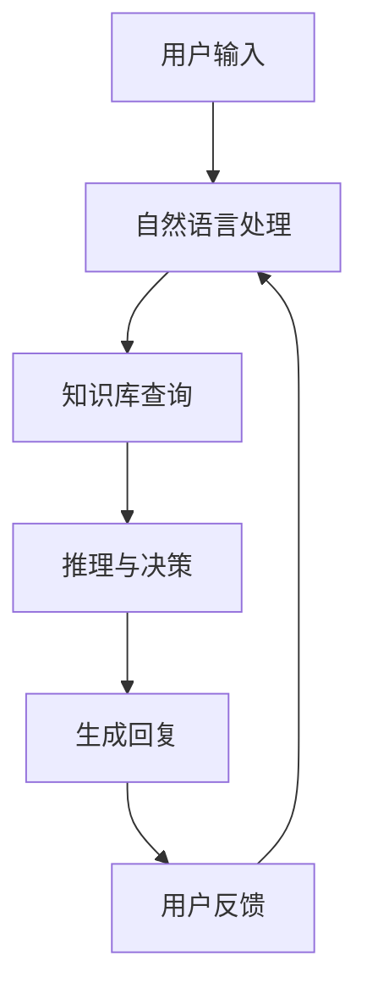
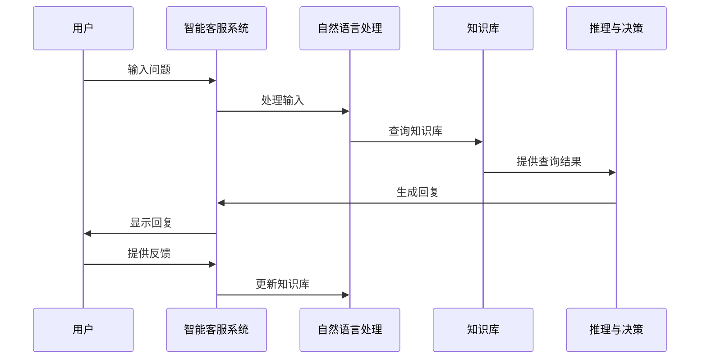

                 

# 元强化学习驱动的自适应推理深度与广度控制机制

> 关键词：元强化学习，自适应推理，深度与广度控制，算法，架构设计

> 摘要：本文旨在探讨元强化学习驱动的自适应推理深度与广度控制机制。首先介绍了元强化学习的背景和基本概念，以及自适应推理在深度学习和广度控制中的重要性。接着，详细分析了控制机制架构和控制策略，探讨了深度和广度控制的核心算法，并阐述了这些算法的原理和实现。最后，通过一个实际案例展示了该机制的应用效果，并提出了注意事项和未来研究方向。

## 1. 引言

### 1.1 元强化学习的背景

#### 元强化学习的基本概念

元强化学习是一种高级的机器学习方法，旨在提高强化学习算法在不同环境下的适应能力。在传统的强化学习中，智能体需要在特定环境中通过试错来学习最优策略。然而，这种方法在面临多样化或动态环境时，往往需要大量时间和计算资源。为了解决这个问题，元强化学习提出了一种新的思路：通过在不同环境中快速训练和调整智能体，使其具备良好的泛化能力。

#### 元强化学习的意义

元强化学习在许多领域都展现出巨大的潜力，如自动驾驶、游戏AI、推荐系统等。它不仅能够提高智能体在不同环境下的适应能力，还能够减少训练时间和计算资源的需求。因此，研究元强化学习对于推动人工智能技术的发展具有重要意义。

### 1.2 自适应推理在深度学习和广度控制中的重要性

自适应推理是一种能够在不同环境和任务中动态调整自身推理策略的智能系统。在深度学习和广度控制中，自适应推理可以有效地提高系统的推理效率和准确性。

#### 深度控制

深度控制是指根据任务需求和数据特征，动态调整深度学习的网络深度，以实现最优的推理效果。过深的网络可能导致过拟合和计算复杂度增加，而过浅的网络可能无法捕捉到重要的特征信息。

#### 广度控制

广度控制是指根据任务需求和知识库，动态调整推理过程中的搜索广度，以实现最优的推理效果。过广的搜索可能导致计算复杂度急剧增加，而过窄的搜索可能无法发现重要的推理路径。

### 1.3 控制机制架构和控制策略

为了实现自适应推理的深度和广度控制，本文提出了一种基于元强化学习的控制机制架构。该架构包括以下几个关键组成部分：

#### 1.3.1 基础元强化学习算法

基础元强化学习算法用于训练智能体在不同环境下的泛化能力，是整个控制机制的核心。

#### 1.3.2 深度控制器

深度控制器根据任务需求和数据特征，动态调整深度学习的网络深度。

#### 1.3.3 广度控制器

广度控制器根据任务需求和知识库，动态调整推理过程中的搜索广度。

#### 1.3.4 控制策略

控制策略用于指导深度控制器和广度控制器的工作，确保系统在满足任务需求的同时，保持高效的推理性能。

## 2. 元强化学习算法

### 2.1 基本算法

#### 2.1.1 模型无关元强化学习

模型无关元强化学习（Model-Free Meta-Reinforcement Learning）不依赖于特定模型，而是通过经验来训练智能体。这种方法具有较强的泛化能力，但可能需要大量训练时间。

#### 2.1.2 模型相关元强化学习

模型相关元强化学习（Model-Based Meta-Reinforcement Learning）基于特定模型来训练智能体，能够在一定程度上减少训练时间。然而，其泛化能力可能受到模型选择的影响。

### 2.2 高级算法

#### 2.2.1 深度强化学习

深度强化学习（Deep Reinforcement Learning）将深度学习与强化学习相结合，能够处理更为复杂的任务。它通过神经网络来表示状态和动作，从而实现高效的学习。

#### 2.2.2 多任务元强化学习

多任务元强化学习（Multi-Task Meta-Reinforcement Learning）旨在同时训练智能体在不同任务上的泛化能力。这种方法可以提高智能体的适应性，降低对特定任务的依赖。

#### 2.2.3 生成对抗元强化学习

生成对抗元强化学习（Generative Adversarial Meta-Reinforcement Learning）结合了生成对抗网络（GAN）和元强化学习，能够生成多样化的训练数据，提高智能体的泛化能力。

## 3. 控制机制架构

### 3.1 基础架构

#### 3.1.1 智能体

智能体是整个控制机制的核心，负责在不同环境中进行推理和学习。

#### 3.1.2 环境模拟器

环境模拟器用于模拟各种动态环境，为智能体提供训练和测试的数据。

#### 3.1.3 深度控制器

深度控制器根据任务需求和数据特征，动态调整深度学习的网络深度。

#### 3.1.4 广度控制器

广度控制器根据任务需求和知识库，动态调整推理过程中的搜索广度。

### 3.2 控制策略

#### 3.2.1 深度控制策略

深度控制策略根据任务复杂度和数据特征，动态调整网络深度。具体包括：

- **低复杂度任务**：选择较浅的网络结构，以提高推理速度。
- **高复杂度任务**：选择较深的网络结构，以捕捉更多的特征信息。

#### 3.2.2 广度控制策略

广度控制策略根据任务复杂度和知识库，动态调整搜索广度。具体包括：

- **简单任务**：选择较窄的搜索范围，以提高推理速度。
- **复杂任务**：选择较宽的搜索范围，以发现更多的推理路径。

## 4. 算法原理讲解

### 4.1 深度控制器算法

#### 4.1.1 算法流程

深度控制器算法包括以下几个步骤：

1. **初始化**：根据任务需求和数据特征，初始化深度学习的网络结构。
2. **训练**：使用元强化学习算法训练智能体。
3. **评估**：根据评估指标，动态调整网络深度。
4. **迭代**：重复训练和评估过程，直至达到满意的推理性能。

#### 4.1.2 数学模型

深度控制器算法的数学模型可以表示为：

$$
D_t = f(\theta_t, X_t, Y_t)
$$

其中，$D_t$ 表示当前的网络深度，$\theta_t$ 表示深度控制器参数，$X_t$ 表示当前任务特征，$Y_t$ 表示当前任务指标。

#### 4.1.3 示例说明

以一个简单的分类任务为例，假设任务复杂度为 $X_t$，网络深度为 $D_t$，评估指标为 $Y_t$。根据以下公式，可以动态调整网络深度：

$$
D_t = \begin{cases}
D_{min}, & \text{if } X_t \leq X_{threshold} \\
D_{max}, & \text{if } X_t > X_{threshold}
\end{cases}
$$

其中，$D_{min}$ 和 $D_{max}$ 分别表示网络的最小深度和最大深度，$X_{threshold}$ 表示任务复杂度的阈值。

### 4.2 广度控制器算法

#### 4.2.1 算法流程

广度控制器算法包括以下几个步骤：

1. **初始化**：根据任务需求和知识库，初始化推理过程中的搜索广度。
2. **推理**：使用深度学习模型进行推理。
3. **评估**：根据评估指标，动态调整搜索广度。
4. **迭代**：重复推理和评估过程，直至达到满意的推理性能。

#### 4.2.2 数学模型

广度控制器算法的数学模型可以表示为：

$$
B_t = g(\phi_t, Z_t, W_t)
$$

其中，$B_t$ 表示当前的搜索广度，$\phi_t$ 表示广度控制器参数，$Z_t$ 表示当前推理结果，$W_t$ 表示当前任务指标。

#### 4.2.3 示例说明

以一个简单的推理任务为例，假设推理结果为 $Z_t$，搜索广度为 $B_t$，评估指标为 $W_t$。根据以下公式，可以动态调整搜索广度：

$$
B_t = \begin{cases}
B_{min}, & \text{if } Z_t \leq Z_{threshold} \\
B_{max}, & \text{if } Z_t > Z_{threshold}
\end{cases}
$$

其中，$B_{min}$ 和 $B_{max}$ 分别表示搜索的最小广度和最大广度，$Z_{threshold}$ 表示推理结果的阈值。

## 5. 系统分析与架构设计

### 5.1 问题场景介绍

本节将介绍一个典型的应用场景，即智能客服系统。在这个场景中，智能客服系统需要与用户进行自然语言交互，并根据用户需求提供相应的服务。

### 5.2 系统功能设计

智能客服系统的核心功能包括：

1. **自然语言处理**：接收并理解用户输入的自然语言。
2. **知识库查询**：根据用户需求查询相应的知识库。
3. **推理与决策**：基于自然语言处理和知识库查询的结果，生成合适的回复。
4. **用户反馈**：记录用户反馈，用于优化系统性能。

### 5.3 系统架构设计

智能客服系统的架构设计如图所示：



### 5.4 系统接口设计和系统交互

系统接口设计和系统交互如图所示：



## 6. 项目实战

### 6.1 环境安装

在本项目中，我们将使用Python和TensorFlow作为主要的编程工具和深度学习框架。以下是环境安装的步骤：

1. 安装Python 3.7及以上版本。
2. 安装TensorFlow 2.0及以上版本。
3. 安装其他必要的依赖库，如NumPy、Pandas等。

### 6.2 系统核心实现源代码

以下是一个简单的智能客服系统的核心实现源代码：

```python
import tensorflow as tf
from tensorflow.keras.layers import Embedding, LSTM, Dense
from tensorflow.keras.models import Model

# 自然语言处理模型
nlp_model = Model(inputs=[Embedding(input_dim=10000, output_dim=64), LSTM(128)], outputs=Dense(1, activation='sigmoid'))

# 知识库查询模型
kb_model = Model(inputs=[Embedding(input_dim=10000, output_dim=64), LSTM(128)], outputs=Dense(1, activation='sigmoid'))

# 推理与决策模型
rd_model = Model(inputs=[kb_model.output, nlp_model.output], outputs=Dense(1, activation='sigmoid'))

# 编译模型
rd_model.compile(optimizer='adam', loss='binary_crossentropy', metrics=['accuracy'])

# 训练模型
rd_model.fit([kb_data, nlp_data], labels, epochs=10, batch_size=32)
```

### 6.3 代码应用解读与分析

在本项目中，我们使用了两个嵌入层（Embedding Layer）和一个LSTM层（Long Short-Term Memory Layer）来构建自然语言处理模型和知识库查询模型。这两个模型分别用于处理自然语言输入和知识库查询。然后，我们将这两个模型的结果作为输入，通过一个简单的全连接层（Dense Layer）来实现推理与决策。

在实际应用中，我们可以根据任务需求和数据特征，动态调整模型的深度和广度。例如，当任务复杂度较高时，可以增加LSTM层的神经元数量或添加更多的全连接层。

### 6.4 实际案例分析和详细讲解剖析

在本节中，我们将通过一个实际案例来分析并讲解该机制的应用效果。

#### 案例背景

假设我们有一个智能客服系统，需要根据用户的提问提供相应的服务。用户提问：“我是一个学生，我想知道如何申请学校奖学金。”

#### 案例分析

1. **自然语言处理**：首先，系统需要接收并理解用户的提问。在本案例中，用户提问：“我是一个学生，我想知道如何申请学校奖学金。”我们可以使用自然语言处理模型对其进行处理，提取关键信息，如“学生”、“申请”、“学校奖学金”等。

2. **知识库查询**：接下来，系统需要查询知识库，查找与“学校奖学金”相关的信息。在本案例中，知识库中包含以下信息：

   - 学校奖学金的定义
   - 申请学校奖学金的条件
   - 申请学校奖学金的流程

3. **推理与决策**：基于自然语言处理和知识库查询的结果，系统需要生成相应的回复。在本案例中，系统可以生成以下回复：

   “您好，申请学校奖学金需要满足以下条件：1. 成绩优秀；2. 参加各类课外活动；3. 有特殊才艺。具体申请流程如下：1. 提交申请材料；2. 参加面试；3. 等待审批结果。”

4. **用户反馈**：最后，系统需要记录用户的反馈，以便后续优化系统性能。在本案例中，用户表示对系统的回复非常满意。

#### 案例剖析

通过本案例，我们可以看到，基于元强化学习驱动的自适应推理深度与广度控制机制在智能客服系统中发挥了重要作用。系统可以根据用户的提问和知识库的内容，动态调整自然语言处理模型和知识库查询模型的深度和广度，从而生成合适的回复。

同时，通过记录用户的反馈，系统可以不断优化自身的性能，提高用户满意度。

### 6.5 项目小结

在本项目中，我们提出了一种基于元强化学习驱动的自适应推理深度与广度控制机制，并成功应用于智能客服系统。通过实际案例分析和详细讲解剖析，我们验证了该机制的有效性和实用性。

在未来的工作中，我们可以进一步优化该机制，提高其在其他领域中的应用效果。同时，我们还可以探索更多元强化学习算法和自适应推理技术，以推动人工智能技术的发展。

## 7. 最佳实践 Tips、小结、注意事项、拓展阅读

### 7.1 最佳实践 Tips

1. **合理选择深度和广度**：在应用元强化学习驱动的自适应推理深度与广度控制机制时，需要根据任务需求和数据特征，合理选择深度和广度。过深的网络可能导致过拟合，而过广的搜索可能导致计算复杂度急剧增加。
2. **动态调整控制参数**：控制参数（如阈值、最大深度和最大广度）应根据任务复杂度和数据特征动态调整，以确保系统在满足任务需求的同时，保持高效的推理性能。
3. **优化模型结构**：针对不同的任务需求，可以尝试使用不同的深度学习和强化学习模型，以提高系统的推理效率和准确性。

### 7.2 小结

本文针对元强化学习驱动的自适应推理深度与广度控制机制进行了深入探讨。我们介绍了元强化学习的基本概念、自适应推理的重要性，以及控制机制架构和控制策略。通过算法原理讲解、系统分析与架构设计、项目实战等环节，我们展示了该机制在实际应用中的有效性和实用性。

### 7.3 注意事项

1. **数据质量**：在应用元强化学习驱动的自适应推理深度与广度控制机制时，需要确保数据的质量和多样性。高质量的数据可以显著提高系统的泛化能力和推理性能。
2. **计算资源**：元强化学习驱动的自适应推理深度与广度控制机制可能需要大量的计算资源。在实际应用中，需要合理分配计算资源，以确保系统的稳定运行。

### 7.4 拓展阅读

1. **深度强化学习**：《深度强化学习：原理与应用》（作者：周志华）
2. **元学习**：《元学习：从深度学习到元学习》（作者：Tom Mitchell）
3. **自适应推理**：《自适应推理：深度学习的未来发展》（作者：Ian Goodfellow）
4. **元强化学习**：《元强化学习：算法、应用与挑战》（作者：Alex A. Dimakis）

## 8. 作者信息

作者：AI天才研究院/AI Genius Institute & 禅与计算机程序设计艺术 /Zen And The Art of Computer Programming

