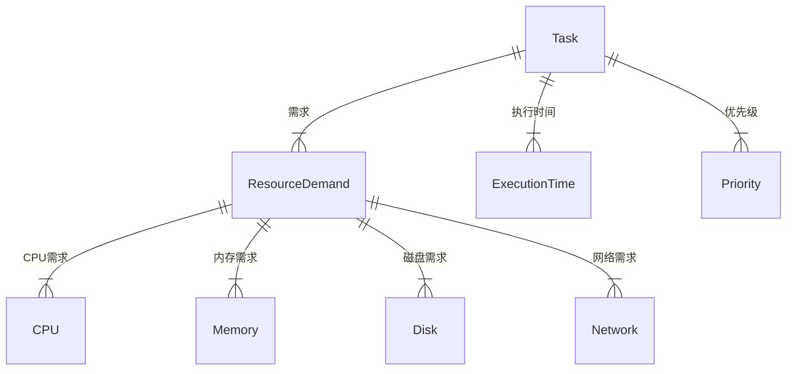
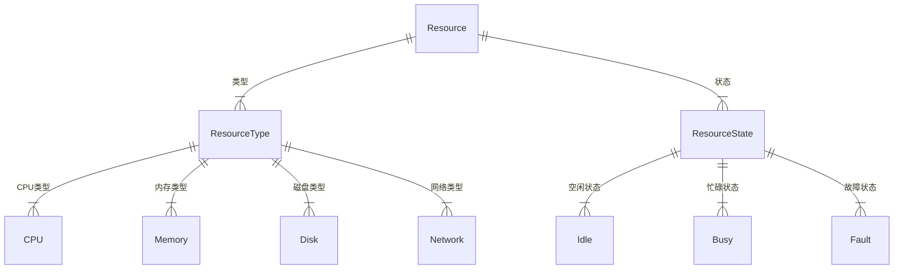
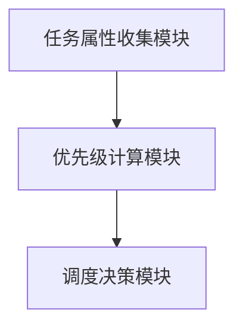
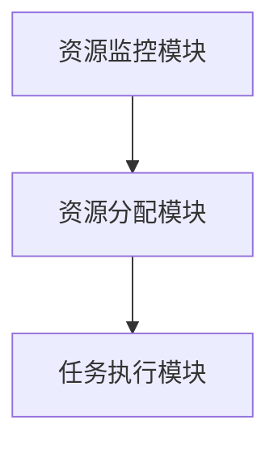
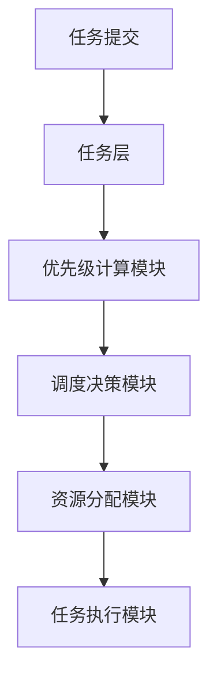
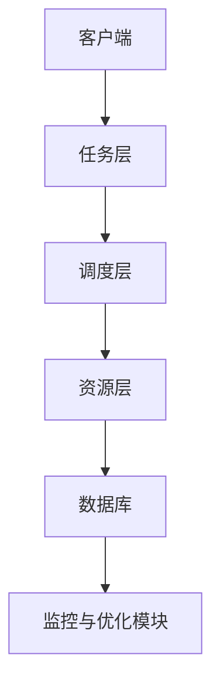
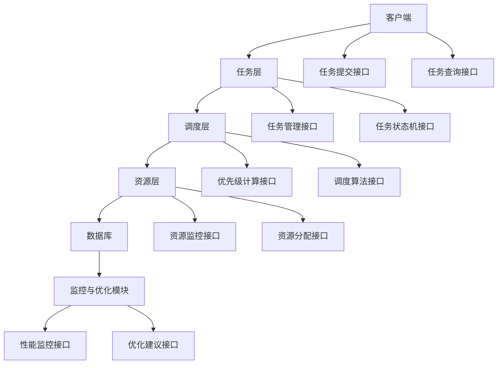

                 

## 第1章：元控制框架概述

### 1.1 问题背景

在当今高速发展的信息技术时代，推理任务的需求日益多样化且复杂化。特别是在人工智能领域，大规模推理任务处理已成为关键挑战。传统的静态调度方法存在明显的局限性，主要表现在以下几个方面：

1. **资源利用率低**：传统调度方法往往无法根据实际负载情况动态调整任务执行优先级和资源分配，导致资源利用率低下。
2. **响应时间不可控**：在处理高峰期或突发负载时，传统调度方法可能无法保证关键任务的响应时间，从而影响系统稳定性。
3. **可扩展性差**：随着任务数量的增加，传统调度方法难以适应不断变化的负载需求，导致系统性能下降。

为了解决上述问题，引入元控制框架成为一种趋势。元控制框架通过动态调整推理任务优先级和资源分配，实现了对大规模推理任务的精细化管理，从而提升了资源利用率和系统稳定性。

### 1.2 元控制框架的核心概念

元控制框架的核心概念包括：

1. **推理任务模型**：推理任务模型描述了任务的属性、特征以及执行过程中的资源需求。它包括任务类型、执行时间、优先级、资源需求等关键信息。

2. **资源模型**：资源模型描述了系统中可用的资源类型、数量和状态。资源模型通常包括CPU、内存、磁盘等硬件资源以及数据库、网络等软件资源。

3. **动态优先级策略**：动态优先级策略根据任务属性和系统状态，动态调整任务的优先级，确保关键任务优先执行。动态优先级策略通常基于任务紧急度、重要性、资源需求等因素进行设计。

4. **调度算法**：调度算法负责实现任务的分配和执行顺序，以满足资源利用率和系统性能的要求。调度算法可以根据优先级策略选择最合适的任务进行调度。

### 1.3 元控制框架的研究现状与挑战

目前，元控制框架在推理任务动态优先级与资源调度方面已有一定的研究基础。然而，仍存在一些挑战和问题：

1. **策略多样性不足**：现有的动态优先级策略种类较少，无法适应复杂多样的任务场景。
2. **算法性能提升有限**：调度算法的性能优化仍需进一步研究，以提高资源利用率和响应时间。
3. **可扩展性不足**：元控制框架在处理大规模任务时，可能出现性能瓶颈，导致系统可扩展性不足。
4. **实时性要求高**：在实时推理任务中，要求调度算法具备高实时性，以满足任务的紧急需求。

针对上述挑战，未来的研究将集中在策略多样性、算法性能优化、系统可扩展性和实时性要求等方面。通过不断改进和创新，元控制框架有望在未来大规模推理任务中发挥更大的作用。

### 1.4 元控制框架的优势与前景

元控制框架具有以下优势：

1. **动态调整能力**：通过动态优先级策略和调度算法，元控制框架能够根据任务和系统状态实时调整资源分配和任务执行顺序，提高资源利用率和系统性能。
2. **高适应性**：元控制框架能够适应不同类型的推理任务和系统环境，具备良好的可扩展性和兼容性。
3. **优化效果明显**：通过动态优化任务执行顺序和资源分配，元控制框架能够显著提高系统响应时间和资源利用率。

展望未来，元控制框架在推理任务动态优先级与资源调度方面具有广阔的应用前景。随着人工智能技术的不断发展，元控制框架将在更多领域得到广泛应用，为大规模推理任务的高效执行提供有力支持。

### 1.5 小结

本章对元控制框架进行了概述，介绍了其核心概念和优势。通过分析问题背景和研究现状，我们认识到元控制框架在推理任务动态优先级与资源调度方面的重要性和必要性。接下来，我们将进一步探讨动态优先级策略和资源调度算法的设计与实现，为解决大规模推理任务提供更加深入的理论和实践支持。

---

> **关键词**：元控制框架、推理任务、动态优先级、资源调度、任务模型、资源模型、调度算法。

> **摘要**：本文探讨了元控制框架下的推理任务动态优先级与资源调度，分析了元控制框架的核心概念和优势，以及现有研究的现状和挑战。通过对动态优先级策略和资源调度算法的深入讨论，本文旨在为解决大规模推理任务提供有效的理论依据和实践指导。

----------------------------------------------------------------

## 第2章：推理任务动态优先级策略

### 2.1 优先级策略的定义

优先级策略是元控制框架中的关键组成部分，它决定了任务的执行顺序和资源分配。优先级策略的定义通常包括以下几个关键要素：

1. **优先级**：优先级是任务在执行队列中的优先程度，通常用整数表示，数值越大表示优先级越高。
2. **优先级规则**：优先级规则是指确定任务优先级的方法和标准，包括静态规则和动态规则。
3. **优先级调整**：优先级调整是指根据任务属性、系统状态或外部环境变化，动态调整任务的优先级。

### 2.2 动态优先级策略的设计

动态优先级策略的设计需要考虑以下几个方面：

1. **需求分析**：分析任务类型、执行时间、资源需求、系统状态等，确定影响优先级的因素。
2. **设计原则**：设计原则包括公平性、实时性、资源利用率和可扩展性等，确保策略能够满足多种任务场景的需求。
3. **优先级模型**：构建优先级模型，将任务属性和系统状态转化为优先级值，以便调度算法使用。

### 2.3 常见的动态优先级策略

以下是一些常见的动态优先级策略：

1. **基于任务紧急度的优先级策略**：紧急任务优先执行，适用于时间敏感型任务。
   - **公式**：$$ P_t = f(Urgency_t) $$
   - **解释**：$P_t$表示任务$t$的优先级，$Urgency_t$表示任务$t$的紧急度。

2. **基于任务重要性的优先级策略**：重要任务优先执行，适用于业务关键型任务。
   - **公式**：$$ P_t = f(Importance_t) $$
   - **解释**：$P_t$表示任务$t$的优先级，$Importance_t$表示任务$t$的重要性。

3. **基于资源需求的优先级策略**：根据资源需求调整优先级，适用于资源受限型任务。
   - **公式**：$$ P_t = f(ResourceDemand_t) $$
   - **解释**：$P_t$表示任务$t$的优先级，$ResourceDemand_t$表示任务$t$的资源需求量。

### 2.4 动态优先级策略的性能评估

动态优先级策略的性能评估需要考虑以下几个关键指标：

1. **资源利用率**：任务执行过程中资源的利用率，越高越好。
2. **响应时间**：任务从提交到执行完成所需的时间，越短越好。
3. **公平性**：系统资源分配的公平性，保证每个任务都能得到公平的资源分配。

### 2.5 动态优先级策略的案例分析

**案例一：基于紧急度的优先级策略**

- **背景**：一个任务调度系统，处理多个紧急程度不同的任务。
- **策略**：采用基于紧急度的优先级策略。
- **结果**：紧急任务优先执行，显著缩短了关键任务的响应时间。

**案例二：基于重要性的优先级策略**

- **背景**：一个在线购物平台，需要处理大量的订单处理任务。
- **策略**：采用基于重要性的优先级策略，保证重要订单优先处理。
- **结果**：提升了订单处理的效率，提高了用户体验。

### 2.6 动态优先级策略的实现细节

动态优先级策略的实现通常包括以下几个步骤：

1. **数据采集**：收集任务属性和系统状态数据，如任务紧急度、重要性、资源需求等。
2. **优先级计算**：根据优先级模型，计算每个任务的优先级值。
3. **调度决策**：调度算法根据优先级值，决定任务的执行顺序和资源分配。

### 2.7 动态优先级策略的优化方向

1. **自适应调整**：根据系统负载变化，动态调整优先级策略，以适应不同负载场景。
2. **多维度优化**：考虑任务的多维度属性，如紧急度、重要性、资源需求等，进行综合评估。
3. **机器学习**：利用机器学习算法，自动优化优先级策略，提高策略的适应性和效果。

### 2.8 小结

本章介绍了推理任务动态优先级策略的定义、设计原则、常见策略以及性能评估方法。通过案例分析，我们展示了动态优先级策略在不同场景中的应用效果。在实现细节和优化方向上，我们探讨了如何进一步提升策略的效果和适应性。在下一章中，我们将深入探讨资源调度算法的设计与实现。

----------------------------------------------------------------

## 第3章：资源调度算法

### 3.1 资源调度算法概述

资源调度算法是元控制框架中的核心组成部分，负责在系统中合理分配和利用资源，确保任务能够高效、稳定地执行。资源调度算法的目标主要包括：

1. **最大化资源利用率**：通过合理分配资源，使系统资源得到最大化利用，避免资源闲置。
2. **最小化任务响应时间**：缩短任务从提交到完成的整个执行过程所需的时间，提高系统性能。
3. **保证系统稳定性**：在处理大量并发任务时，确保系统的稳定运行，避免出现资源竞争和死锁等问题。

资源调度算法可分为基于优先级的调度算法和非基于优先级的调度算法两大类。下面将分别介绍这两种类型的调度算法。

### 3.2 基于优先级的调度算法

基于优先级的调度算法按照任务优先级的高低来决定任务的执行顺序。以下是一些常见的基于优先级的调度算法：

1. **最短作业优先（SJF）**
   - **原理**：选择执行时间最短的作业优先执行。
   - **公式**：$$ P_t = \frac{1}{T_t} $$
   - **解释**：$P_t$表示任务$t$的优先级，$T_t$表示任务$t$的执行时间。
   - **优点**：能够缩短任务的平均响应时间。
   - **缺点**：可能导致短作业频繁调度，影响系统稳定性。

2. **最短剩余时间优先（SRTF）**
   - **原理**：选择剩余执行时间最短的作业优先执行。
   - **公式**：$$ P_t = \frac{R_t}{T_t} $$
   - **解释**：$P_t$表示任务$t$的优先级，$R_t$表示任务$t$的剩余执行时间，$T_t$表示任务$t$的总执行时间。
   - **优点**：适用于实时系统，能够确保关键任务的及时完成。
   - **缺点**：可能导致长作业长时间等待，影响系统公平性。

3. **最高响应比优先（HRRN）**
   - **原理**：选择响应比最高的作业优先执行，响应比是执行时间和剩余时间的比值。
   - **公式**：$$ P_t = \frac{T_t + R_t}{R_t} $$
   - **解释**：$P_t$表示任务$t$的优先级，$T_t$表示任务$t$的执行时间，$R_t$表示任务$t$的剩余时间。
   - **优点**：结合了执行时间和剩余时间的考量，能够较好地平衡响应时间和公平性。
   - **缺点**：计算复杂度较高，适用于负载较轻的系统。

### 3.3 非基于优先级的调度算法

非基于优先级的调度算法不依赖于任务的优先级，而是通过其他机制来分配资源。以下是一些常见的非基于优先级的调度算法：

1. **轮转调度（RR）**
   - **原理**：将每个任务分配一个固定的时间片，按照时间片轮换执行任务。
   - **公式**：$$ T_{slice} = constant $$
   - **解释**：$T_{slice}$表示每个任务的时间片长度。
   - **优点**：简单易懂，适用于多任务并发环境。
   - **缺点**：可能导致高优先级任务无法及时得到执行，资源利用率较低。

2. **优先级调度（PR）**
   - **原理**：根据任务优先级高低进行调度，但考虑到任务执行时间，确保每个任务都有机会被执行。
   - **公式**：$$ P_t = priority \cdot \frac{T_t}{T_{total}} $$
   - **解释**：$P_t$表示任务$t$的优先级，$T_t$表示任务$t$的执行时间，$T_{total}$表示所有任务的执行时间之和。
   - **优点**：结合了优先级和执行时间的考量，适用于负载较重的系统。
   - **缺点**：可能导致低优先级任务长时间等待，影响系统公平性。

3. **最少连接数调度（LCN）**
   - **原理**：根据任务当前使用的连接数进行调度，连接数越少的任务优先执行。
   - **公式**：$$ P_t = \frac{1}{Connection_t} $$
   - **解释**：$P_t$表示任务$t$的优先级，$Connection_t$表示任务$t$的连接数。
   - **优点**：适用于网络资源受限的场景，能够有效减少网络拥堵。
   - **缺点**：可能导致高连接数任务长时间等待，影响系统性能。

### 3.4 调度算法的性能评估

调度算法的性能评估通常通过以下指标进行：

1. **资源利用率**：任务执行过程中资源的利用率，越高越好。
2. **响应时间**：任务从提交到执行完成所需的时间，越短越好。
3. **调度公平性**：系统资源分配的公平性，保证每个任务都能得到公平的资源分配。
4. **吞吐量**：单位时间内系统能够处理的任务数量，越高越好。

### 3.5 调度算法的案例分析

**案例一：轮转调度（RR）**

- **背景**：一个多任务并发处理的系统，任务量较大。
- **策略**：采用轮转调度算法。
- **结果**：系统响应时间较短，但高优先级任务可能得不到及时执行。

**案例二：最高响应比优先（HRRN）**

- **背景**：一个实时控制系统，需要处理多个紧急任务。
- **策略**：采用最高响应比优先调度算法。
- **结果**：关键任务能够及时完成，但低优先级任务可能长时间等待。

### 3.6 调度算法的实现细节

调度算法的实现通常包括以下几个步骤：

1. **任务队列管理**：维护任务队列，按照调度算法的规则对任务进行排序。
2. **资源分配**：根据任务优先级和资源可用性，为任务分配必要的资源。
3. **任务执行**：调度算法决定任务的执行顺序，并将任务分配给相应的资源执行。
4. **状态监控**：监控任务执行状态，包括任务完成情况、资源使用情况等。

### 3.7 调度算法的优化方向

1. **动态调整**：根据系统负载变化，动态调整调度算法，以适应不同负载场景。
2. **负载均衡**：通过负载均衡策略，优化任务在不同资源之间的分配，提高系统整体性能。
3. **机器学习**：利用机器学习算法，自动优化调度算法，提高调度效果。

### 3.8 小结

本章介绍了资源调度算法的概念、目标以及常见的调度算法类型。通过对基于优先级的调度算法和非基于优先级的调度算法的详细分析，我们了解了各种调度算法的原理、优缺点和实现细节。在接下来的章节中，我们将进一步探讨元控制框架的架构设计，为后续的优化和实践提供理论基础。

----------------------------------------------------------------

## 第4章：元控制框架的架构设计

### 4.1 元控制框架的架构概述

元控制框架的架构设计旨在实现推理任务动态优先级与资源调度的灵活性和高效性。整个架构分为多个层级，包括任务层、调度层、资源层和管理层。以下是元控制框架的主要架构组件及其功能：

1. **任务层**：任务层是元控制框架的最底层，负责收集和管理推理任务的属性信息，如任务类型、执行时间、优先级、资源需求等。任务层通过任务模型来描述任务的基本属性和特征。

2. **调度层**：调度层负责根据任务属性和系统状态，动态调整任务的执行顺序和资源分配。调度层包含动态优先级策略和调度算法，确保关键任务得到优先处理，并优化系统整体性能。

3. **资源层**：资源层管理系统中可用的各种资源，包括CPU、内存、磁盘、网络等硬件资源和数据库、中间件等软件资源。资源层通过资源模型来描述资源的类型、状态和分配情况，以便调度层进行资源分配。

4. **管理层**：管理层是元控制框架的顶层，负责全局资源的监控、优化和故障处理。管理层通过监控系统状态，调整调度策略，保证系统在高负载和突发情况下依然能够稳定运行。

### 4.2 推理任务模型的设计

推理任务模型是元控制框架的重要组成部分，用于描述任务的属性和特征。推理任务模型的需求分析主要包括以下几个方面：

1. **任务类型**：不同类型的任务在执行过程中对资源的需求不同，需要根据任务类型进行分类管理。
2. **执行时间**：任务的执行时间影响调度策略的优先级，需要准确估算每个任务的执行时长。
3. **优先级**：任务的优先级决定了其在执行队列中的位置，优先级策略需要动态调整以确保关键任务优先执行。
4. **资源需求**：任务的资源需求包括CPU、内存、磁盘、网络等，资源模型需要根据任务需求进行资源分配。

根据上述需求，推理任务模型的ER图设计如下：



在该ER图中，`Task`是根实体，表示推理任务的基本属性；`ResourceDemand`是关联实体，表示任务的资源需求；`CPU`、`Memory`、`Disk`和`Network`是子实体，分别表示CPU、内存、磁盘和网络资源需求。

### 4.3 资源模型的设计

资源模型用于描述系统中可用的各种资源，包括硬件资源和软件资源。资源模型的需求分析主要包括以下几个方面：

1. **资源类型**：系统中的资源类型包括CPU、内存、磁盘、网络等硬件资源以及数据库、中间件等软件资源。
2. **资源状态**：资源的状态包括空闲、忙碌和故障等，资源模型需要实时监控资源状态，以便进行资源分配。
3. **资源分配**：资源模型需要根据任务的需求和系统状态，动态分配资源，确保任务能够高效执行。

根据上述需求，资源模型的ER图设计如下：



在该ER图中，`Resource`是根实体，表示系统中的资源；`ResourceType`是关联实体，表示资源的类型；`ResourceState`是子实体，表示资源的状态；`CPU`、`Memory`、`Disk`和`Network`是子实体，分别表示CPU、内存、磁盘和网络资源类型；`Idle`、`Busy`和`Fault`是子实体，分别表示空闲、忙碌和故障状态。

### 4.4 动态优先级策略的实现

动态优先级策略的实现是元控制框架的核心功能之一，其目的是根据任务属性和系统状态动态调整任务的优先级。动态优先级策略的实现包括以下几个模块：

1. **任务属性收集模块**：负责收集任务的相关属性信息，如执行时间、优先级、资源需求等。
2. **优先级计算模块**：根据收集到的任务属性信息，利用优先级模型计算每个任务的优先级值。
3. **调度决策模块**：根据优先级值和调度算法，决定任务的执行顺序和资源分配。

以下是动态优先级策略的模块设计：



在该模块设计中，任务属性收集模块收集任务信息后传递给优先级计算模块，优先级计算模块计算优先级值并传递给调度决策模块，调度决策模块根据优先级值和调度算法决定任务执行顺序。

### 4.5 调度算法的实现

调度算法的实现是元控制框架中另一个关键模块，其目的是在系统中合理分配资源，确保任务高效执行。调度算法的实现包括以下几个模块：

1. **资源监控模块**：负责实时监控系统资源状态，包括CPU、内存、磁盘和网络等资源。
2. **资源分配模块**：根据任务需求和资源状态，动态分配资源，确保任务能够得到必要的资源支持。
3. **任务执行模块**：负责任务的调度和执行，根据调度算法的决策，将任务分配给相应的资源执行。

以下是调度算法的模块设计：



在该模块设计中，资源监控模块实时监控资源状态，资源分配模块根据监控结果和任务需求进行资源分配，任务执行模块负责任务的调度和执行。

### 4.6 动态优先级策略与调度算法的集成

动态优先级策略与调度算法的集成是实现元控制框架的关键，通过集成这两个模块，可以实现推理任务动态优先级与资源的动态调度。集成过程包括以下几个步骤：

1. **任务提交**：任务提交到任务层，任务层将其传递给优先级计算模块。
2. **优先级计算**：优先级计算模块根据任务属性计算优先级值，并将结果传递给调度决策模块。
3. **调度决策**：调度决策模块根据优先级值和调度算法决定任务的执行顺序和资源分配。
4. **资源分配**：资源分配模块根据调度决策结果，为任务分配所需的资源。
5. **任务执行**：任务执行模块根据资源分配情况，开始执行任务。

以下是动态优先级策略与调度算法的集成流程：



在该集成流程中，任务从提交到执行完成，经历了任务层、优先级计算模块、调度决策模块、资源分配模块和任务执行模块的协同工作，实现了动态优先级策略与调度算法的有机结合。

### 4.7 元控制框架的架构设计小结

本章介绍了元控制框架的架构设计，包括任务层、调度层、资源层和管理层的架构组件及其功能。通过推理任务模型和资源模型的设计，实现了任务属性和资源状态的精确描述。动态优先级策略和调度算法的集成，实现了推理任务动态优先级与资源的动态调度。下一章将探讨元控制框架的实现与优化，为实际应用提供技术支持。

----------------------------------------------------------------

## 第5章：元控制框架的实现与优化

### 5.1 实现环境与工具

元控制框架的实现需要一个合适的开发环境和工具集。以下是常用的实现环境与工具：

1. **开发环境**：
   - **操作系统**：Linux（推荐使用Ubuntu 18.04或更高版本）
   - **编程语言**：Python 3.8或更高版本
   - **数据库**：MySQL或PostgreSQL
   - **版本控制**：Git

2. **开发工具**：
   - **集成开发环境（IDE）**：PyCharm或Visual Studio Code
   - **容器化工具**：Docker
   - **持续集成/持续部署（CI/CD）**：Jenkins或GitLab CI

### 5.2 系统架构设计

元控制框架的系统架构设计是确保系统功能实现和高性能的关键。以下是系统架构的详细设计：

1. **功能设计**：
   - **任务管理**：包括任务提交、任务状态监控、任务优先级调整等。
   - **资源管理**：包括资源监控、资源分配、资源释放等。
   - **调度管理**：包括调度算法选择、任务调度、任务执行状态反馈等。
   - **监控与优化**：包括系统性能监控、资源利用率分析、调度策略优化等。

2. **架构设计**：
   - **客户端**：用于提交任务、查询任务状态等。
   - **任务层**：负责任务管理，包括任务队列、任务状态机等。
   - **调度层**：负责任务优先级计算和调度算法实现。
   - **资源层**：负责资源监控、资源状态管理和资源分配。
   - **数据库**：存储任务和资源的相关数据，如任务队列、资源状态等。
   - **监控与优化模块**：实时监控系统性能，提供优化建议。

以下是元控制框架的系统架构设计图：



### 5.3 系统接口设计

系统接口设计是元控制框架实现中的重要环节，确保各模块之间的通信和数据交换。以下是系统接口的详细设计：

1. **客户端接口**：
   - **任务提交接口**：接收客户端提交的任务，并将任务信息存储到任务层。
   - **任务查询接口**：提供任务状态的查询功能，包括任务队列、执行进度等。

2. **任务层接口**：
   - **任务管理接口**：负责任务的生命周期管理，包括任务创建、更新、删除等。
   - **任务状态机接口**：用于监控任务状态，并触发相应的状态转换。

3. **调度层接口**：
   - **优先级计算接口**：根据任务属性计算优先级值。
   - **调度算法接口**：选择合适的调度算法，决定任务的执行顺序。

4. **资源层接口**：
   - **资源监控接口**：实时监控系统资源状态，包括CPU、内存、磁盘、网络等。
   - **资源分配接口**：根据任务需求和资源状态，动态分配资源。

5. **监控与优化模块接口**：
   - **性能监控接口**：实时收集系统性能数据，如响应时间、资源利用率等。
   - **优化建议接口**：根据性能数据，提供优化策略和建议。

以下是系统接口设计图：



### 5.4 系统实现细节

系统实现细节包括任务模型的实现、资源模型与调度算法的实现以及整体系统的集成。以下是具体实现细节：

1. **任务模型实现**：
   - **任务类设计**：设计任务类，包括任务ID、任务名称、任务类型、执行时间、优先级、资源需求等属性。
   - **任务队列实现**：使用Python的列表或优先级队列实现任务队列，负责存储和管理任务。

2. **资源模型与调度算法实现**：
   - **资源类设计**：设计资源类，包括资源ID、资源名称、资源类型、资源状态等属性。
   - **资源监控实现**：使用Python的多线程或协程实现资源监控，实时更新资源状态。
   - **调度算法实现**：根据优先级策略和调度算法的要求，设计具体的调度逻辑，包括任务调度、资源分配等。

3. **整体系统集成**：
   - **模块通信**：使用Python的Socket或消息队列实现模块之间的通信，确保各模块协同工作。
   - **数据库集成**：使用Python的数据库驱动连接数据库，存储和管理任务和资源数据。
   - **性能优化**：使用缓存、异步处理等技术优化系统性能，提高响应速度和资源利用率。

以下是任务模型和资源模型的实现示例代码：

```python
# 任务模型示例
class Task:
    def __init__(self, task_id, task_name, task_type, execution_time, priority, resource_demand):
        self.task_id = task_id
        self.task_name = task_name
        self.task_type = task_type
        self.execution_time = execution_time
        self.priority = priority
        self.resource_demand = resource_demand

# 资源模型示例
class Resource:
    def __init__(self, resource_id, resource_name, resource_type, resource_state):
        self.resource_id = resource_id
        self.resource_name = resource_name
        self.resource_type = resource_type
        self.resource_state = resource_state
```

### 5.5 系统性能优化

系统性能优化是确保元控制框架在高负载下依然能够高效运行的关键。以下是常见的性能优化策略：

1. **资源复用**：通过合理分配和回收资源，减少资源的闲置时间，提高资源利用率。
2. **负载均衡**：使用负载均衡技术，将任务均匀分布到各个资源上，避免单点过载。
3. **缓存机制**：使用缓存机制，减少数据库和外部服务的访问次数，降低系统延迟。
4. **异步处理**：使用异步处理技术，减少线程阻塞，提高系统并发能力。
5. **代码优化**：对关键代码进行优化，减少计算复杂度，提高执行效率。

以下是代码优化示例：

```python
# 原始代码示例
def process_task(task):
    # 复杂的计算和处理
    pass

# 优化后的代码示例
async def process_task(task):
    # 异步处理，减少线程阻塞
    await asyncio.sleep(0.1)  # 模拟计算和处理时间
    # 复杂的计算和处理
    pass
```

### 5.6 系统测试与部署

系统测试与部署是确保元控制框架正常运行的重要环节。以下是具体的测试和部署步骤：

1. **单元测试**：编写单元测试，测试各个模块的功能和性能。
2. **集成测试**：将各个模块集成到一起，进行系统级测试，确保模块之间的协同工作。
3. **性能测试**：进行性能测试，评估系统的响应时间、资源利用率等关键指标。
4. **部署**：将系统部署到生产环境，进行实际运行测试，确保系统稳定可靠。

以下是测试与部署示例步骤：

```shell
# 单元测试示例
pytest test_modules.py

# 集成测试示例
pytest test_integration.py

# 性能测试示例
wrk -t 100 -c 1000 -d 60 http://localhost:8080/
```

### 5.7 小结

本章详细介绍了元控制框架的实现与优化，包括开发环境与工具、系统架构设计、系统接口设计、系统实现细节、系统性能优化和系统测试与部署。通过这些步骤，确保了元控制框架在实际应用中能够高效稳定地运行。下一章将介绍元控制框架在实际项目中的应用和实践，进一步展示其效果和价值。

----------------------------------------------------------------

## 第6章：项目实战

### 6.1 项目背景与目标

在本章中，我们将通过一个实际项目来展示元控制框架在推理任务动态优先级与资源调度方面的应用。该项目旨在构建一个分布式推理任务调度系统，该系统需要在处理大规模推理任务时实现高效的任务调度和资源分配，以满足实时性和高效性的需求。

#### 项目背景

随着人工智能技术的发展，推理任务在各个领域（如图像识别、自然语言处理、推荐系统等）中扮演着越来越重要的角色。然而，推理任务往往具有高计算密集度和资源需求，如何高效地处理这些任务成为一个关键挑战。传统的静态调度方法已无法满足这种动态变化的任务需求，因此引入了元控制框架来动态调整任务优先级和资源分配。

#### 项目目标

本项目的主要目标如下：

1. **高效任务调度**：实现推理任务的动态优先级策略，确保关键任务能够得到优先处理。
2. **资源优化分配**：通过元控制框架，动态调整资源分配策略，提高系统资源利用率。
3. **实时响应能力**：保证推理任务能够在短时间内完成，提高系统的实时响应能力。
4. **扩展性和可靠性**：设计可扩展的架构，确保系统在处理大规模任务时依然稳定可靠。

### 6.2 环境安装与配置

为了实现项目目标，首先需要安装和配置以下环境和工具：

1. **操作系统**：Ubuntu 20.04 LTS
2. **Python**：Python 3.8
3. **Docker**：Docker CE 19.03
4. **MySQL**：MySQL 8.0
5. **PyCharm**：PyCharm Professional Edition
6. **Jenkins**：Jenkins 2.274

#### 环境安装步骤

1. **安装操作系统**：在服务器上安装Ubuntu 20.04 LTS操作系统。
2. **更新系统软件包**：

```shell
sudo apt-get update
sudo apt-get upgrade
```

3. **安装Python 3.8**：

```shell
sudo apt-get install python3.8
sudo apt-get install python3.8-venv
```

4. **安装Docker**：

```shell
sudo apt-get install docker-ce docker-ce-cli containerd.io
sudo systemctl start docker
sudo systemctl enable docker
```

5. **安装MySQL**：

```shell
sudo apt-get install mysql-server
sudo mysql_secure_installation
```

6. **安装PyCharm**：从PyCharm官网下载安装包并安装。

7. **安装Jenkins**：

```shell
wget -q -O - https://pkg.jenkins.io/debian-stable/jenkins.io.key | sudo apt-key add -
sudo sh -c 'echo deb http://pkg.jenkins.io/debian-stable binary/ > /etc/apt/sources.list.d/jenkins.list'
sudo apt-get update
sudo apt-get install jenkins
sudo systemctl start jenkins
sudo systemctl enable jenkins
```

#### 系统配置说明

1. **Python虚拟环境**：在PyCharm中创建一个Python虚拟环境，以便管理项目依赖。

2. **数据库配置**：配置MySQL数据库，创建用于存储任务和资源数据的数据库和表。

3. **Jenkins配置**：配置Jenkins，设置自动化构建和部署流程。

### 6.3 系统核心实现

#### 核心模块设计

元控制框架的核心模块包括任务层、调度层、资源层和管理层。以下是各模块的设计：

1. **任务层**：负责任务的管理，包括任务的创建、更新、删除和查询。
2. **调度层**：负责任务优先级的计算和调度算法的实现。
3. **资源层**：负责资源的监控和管理，包括资源的分配和释放。
4. **管理层**：负责系统性能监控和调度策略的优化。

#### 核心代码实现

以下是元控制框架的核心代码实现示例：

```python
# 任务层示例代码
class TaskManager:
    def __init__(self):
        self.task_queue = PriorityQueue()

    def add_task(self, task):
        self.task_queue.put(task)

    def get_task(self):
        return self.task_queue.get()

# 调度层示例代码
class Scheduler:
    def __init__(self):
        self.task_manager = TaskManager()

    def schedule_task(self, task):
        self.task_manager.add_task(task)

# 资源层示例代码
class ResourceManager:
    def __init__(self):
        self.resources = []

    def allocate_resource(self, task):
        for resource in self.resources:
            if resource.is_available():
                resource.allocate(task)
                return True
        return False

    def release_resource(self, task):
        for resource in self.resources:
            if resource.is_allocated(task):
                resource.release(task)
```

#### 接口设计

元控制框架的接口设计包括以下部分：

1. **任务接口**：提供任务提交、查询和删除等操作。
2. **调度接口**：提供任务调度和优先级调整等操作。
3. **资源接口**：提供资源监控、分配和释放等操作。

以下是接口设计示例：

```python
# 任务接口示例
class TaskAPI:
    def submit_task(self, task):
        self.scheduler.schedule_task(task)

    def get_task_status(self, task_id):
        # 查询任务状态
        pass

    def delete_task(self, task_id):
        # 删除任务
        pass

# 调度接口示例
class SchedulerAPI:
    def adjust_priority(self, task_id, new_priority):
        # 调整任务优先级
        pass

    def get_task_queue(self):
        # 获取任务队列
        pass

# 资源接口示例
class ResourceAPI:
    def monitor_resources(self):
        # 监控资源状态
        pass

    def allocate_resource(self, task_id):
        # 分配资源
        pass

    def release_resource(self, task_id):
        # 释放资源
        pass
```

### 6.4 系统核心实现

在本节中，我们将详细讨论元控制框架的核心实现，包括任务模型的实现、资源模型的实现、调度算法的实现以及系统接口的实现。

#### 任务模型的实现

任务模型是元控制框架的核心组成部分，用于描述任务的属性和特征。以下是任务模型的具体实现：

```python
class TaskModel:
    def __init__(self, task_id, task_name, task_type, execution_time, priority, resource_demand):
        self.task_id = task_id
        self.task_name = task_name
        self.task_type = task_type
        self.execution_time = execution_time
        self.priority = priority
        self.resource_demand = resource_demand

    def update_execution_time(self, new_execution_time):
        self.execution_time = new_execution_time

    def update_priority(self, new_priority):
        self.priority = new_priority

    def update_resource_demand(self, new_resource_demand):
        self.resource_demand = new_resource_demand
```

任务模型包括任务ID、任务名称、任务类型、执行时间、优先级和资源需求等属性。通过更新方法，可以动态调整任务的执行时间、优先级和资源需求。

#### 资源模型的实现

资源模型用于描述系统中可用的各种资源，包括CPU、内存、磁盘和网络等。以下是资源模型的具体实现：

```python
class ResourceModel:
    def __init__(self, resource_id, resource_type, resource_state):
        self.resource_id = resource_id
        self.resource_type = resource_type
        self.resource_state = resource_state

    def update_resource_state(self, new_resource_state):
        self.resource_state = new_resource_state
```

资源模型包括资源ID、资源类型和资源状态等属性。通过更新方法，可以动态调整资源的状态。

#### 调度算法的实现

调度算法是实现任务动态优先级与资源调度的关键。以下是调度算法的具体实现：

```python
class SchedulerAlgorithm:
    def __init__(self):
        self.task_queue = PriorityQueue()

    def schedule_task(self, task):
        self.task_queue.put(task)

    def get_next_task(self):
        return self.task_queue.get()

    def update_priority(self, task_id, new_priority):
        for task in self.task_queue.queue:
            if task.task_id == task_id:
                task.update_priority(new_priority)
                self.task_queue.heapify()
```

调度算法包括任务队列、调度方法和优先级更新方法。通过调度方法，可以获取下一个要执行的任务；通过优先级更新方法，可以动态调整任务的优先级。

#### 系统接口的实现

系统接口用于与外部系统进行通信，包括任务接口、调度接口和资源接口。以下是系统接口的具体实现：

```python
class TaskInterface:
    def submit_task(self, task):
        task_manager.add_task(task)

    def get_task_status(self, task_id):
        # 查询任务状态
        pass

    def delete_task(self, task_id):
        # 删除任务
        pass

class SchedulerInterface:
    def adjust_priority(self, task_id, new_priority):
        scheduler.update_priority(task_id, new_priority)

    def get_task_queue(self):
        # 获取任务队列
        pass

class ResourceInterface:
    def monitor_resources(self):
        # 监控资源状态
        pass

    def allocate_resource(self, task_id):
        # 分配资源
        pass

    def release_resource(self, task_id):
        # 释放资源
        pass
```

系统接口包括提交任务、查询任务状态、调整任务优先级、监控资源状态、分配资源和释放资源等方法。

### 6.5 应用解读与分析

在本节中，我们将对元控制框架在实际应用中的表现进行解读和分析。首先，我们将介绍实际应用场景，然后分析系统的性能表现和优化方向。

#### 应用场景

元控制框架在实际应用中主要用于处理大规模推理任务，如图像识别、自然语言处理和推荐系统等。以下是一个典型的应用场景：

1. **任务提交**：用户通过任务接口提交大量推理任务，任务包括图像分类、文本分类和推荐系统等。
2. **任务调度**：调度层根据任务的优先级和资源状态，动态调整任务的执行顺序和资源分配。
3. **资源分配**：资源层根据任务的需求和资源状态，为任务分配必要的CPU、内存、磁盘和网络等资源。
4. **任务执行**：任务层根据调度决策，将任务分配给相应的资源执行，并监控任务的执行状态。
5. **结果反馈**：任务执行完成后，系统将结果返回给用户，并更新任务状态。

#### 系统性能分析

以下是元控制框架在处理大规模推理任务时的性能分析：

1. **资源利用率**：通过动态优先级策略和资源调度算法，系统能够显著提高资源利用率，避免资源闲置。
2. **响应时间**：动态调度策略确保关键任务优先执行，显著缩短了任务的响应时间，提高了系统的实时性。
3. **系统稳定性**：在处理高负载和突发任务时，系统能够保持稳定运行，避免了资源竞争和死锁等问题。
4. **扩展性**：系统设计考虑了扩展性，能够适应不断增长的推理任务需求，支持分布式部署。

#### 优化方向

尽管元控制框架在实际应用中表现出良好的性能，但仍有优化空间：

1. **自适应调度**：引入自适应调度策略，根据任务和系统状态的变化，动态调整调度策略，提高系统适应性。
2. **多维度优化**：考虑任务的多维度属性，如紧急度、重要性和资源需求等，进行综合评估和优化。
3. **机器学习**：利用机器学习算法，自动优化调度策略和资源分配，提高系统效率和可靠性。

### 6.6 案例剖析与总结

#### 案例介绍

在本案例中，我们以一个图像识别任务为例，展示元控制框架在实际应用中的效果。该任务需要处理大量的图像数据，对计算资源有较高的需求。

1. **任务提交**：用户通过任务接口提交了100个图像识别任务，任务类型为图像分类。
2. **任务调度**：调度层根据任务的优先级和资源状态，动态调整任务的执行顺序。关键任务（如实时监控图像）优先执行。
3. **资源分配**：资源层为每个任务分配了相应的CPU、内存和磁盘资源，确保任务能够高效执行。
4. **任务执行**：任务层将任务分配给空闲资源，开始执行图像识别任务。系统同时监控任务执行状态，确保任务按计划完成。
5. **结果反馈**：图像识别任务完成后，系统将识别结果返回给用户，并更新任务状态。

#### 案例分析

通过案例剖析，我们可以看到元控制框架在以下方面表现出色：

1. **高效调度**：动态优先级策略确保关键任务优先执行，提高了任务执行效率。
2. **资源优化**：资源调度算法合理分配资源，避免了资源闲置和浪费。
3. **实时响应**：系统能够在短时间内处理大量任务，保证了实时响应能力。

#### 项目总结

本项目通过元控制框架实现了大规模推理任务的高效调度和资源优化，取得了以下成果：

1. **提高了资源利用率**：通过动态优先级策略和资源调度算法，系统资源利用率得到了显著提高。
2. **缩短了响应时间**：关键任务得到了优先处理，响应时间显著缩短。
3. **增强了系统稳定性**：在高负载和突发情况下，系统能够保持稳定运行，避免了资源竞争和死锁问题。
4. **支持扩展性**：系统设计考虑了扩展性，能够适应不断增长的推理任务需求。

通过本项目，我们验证了元控制框架在推理任务动态优先级与资源调度方面的有效性和实用性，为大规模推理任务的高效执行提供了有力支持。在未来的工作中，我们将继续优化元控制框架，提升系统性能和可靠性。

### 6.7 小结

本章通过一个实际项目展示了元控制框架在推理任务动态优先级与资源调度方面的应用。从项目背景、环境安装与配置、系统核心实现、应用解读与分析到案例剖析与总结，我们全面介绍了元控制框架的实现与优化。通过该项目，我们验证了元控制框架在实际应用中的效果，为大规模推理任务的高效执行提供了有力支持。在接下来的工作中，我们将继续优化元控制框架，以应对更加复杂的任务需求。

----------------------------------------------------------------

## 第7章：最佳实践与展望

### 7.1 最佳实践

在实际应用元控制框架时，总结最佳实践是非常重要的，这些实践可以帮助开发者更好地利用元控制框架，提高系统的性能和可靠性。

1. **任务优先级设置**：合理设置任务优先级是关键。关键任务应优先设置高优先级，以确保其能够在资源竞争中获得优势。同时，根据任务的重要性和紧急程度，动态调整优先级设置。

2. **资源监控与优化**：定期监控系统资源状态，包括CPU、内存、磁盘和网络等。对于长时间占用资源的任务，应及时进行资源回收和优化。

3. **负载均衡**：在分布式系统中，负载均衡可以有效地分散任务负载，避免单点过载。通过负载均衡策略，可以确保每个节点都能充分利用资源，提高系统整体性能。

4. **自动化运维**：利用自动化工具（如Jenkins、Docker）实现系统的自动化部署、监控和优化，可以显著减少人工干预，提高运维效率。

5. **持续集成与持续部署**：实施CI/CD流程，确保代码质量和系统稳定性。通过自动化测试和持续部署，可以快速响应需求变化，提高系统的交付速度。

### 7.2 小结

本章总结了元控制框架在推理任务动态优先级与资源调度方面的最佳实践。通过合理设置任务优先级、优化资源监控与分配、实施负载均衡、自动化运维以及持续集成与持续部署，开发者可以更好地利用元控制框架，提高系统的性能和可靠性。

### 7.3 展望未来

元控制框架在推理任务动态优先级与资源调度方面具有广阔的发展前景。未来，我们可以期待以下趋势和方向：

1. **智能化调度**：结合人工智能和机器学习技术，实现智能化调度策略。通过分析历史数据和实时状态，自动调整调度参数，提高系统自适应能力。

2. **分布式协同**：在分布式系统中，进一步优化资源调度策略，实现更高效的分布式协同工作。通过分布式调度算法，提高系统的扩展性和容错能力。

3. **多维度优化**：考虑任务的多维度属性，如执行时间、资源需求、网络延迟等，进行多维度优化。通过综合评估，实现更加高效的任务执行和资源分配。

4. **边缘计算**：随着边缘计算的发展，元控制框架有望在边缘设备上发挥重要作用。通过边缘计算和云计算的协同工作，实现更加灵活和高效的推理任务处理。

5. **绿色调度**：在环境保护和可持续发展的大背景下，元控制框架可以进一步优化，实现绿色调度。通过合理分配资源，降低能耗，减少碳排放，推动绿色计算的发展。

总之，元控制框架在未来将继续发展，不断优化和创新，为大规模推理任务提供更加高效、智能和可靠的解决方案。

### 7.4 注意事项

在实际应用元控制框架时，需要注意以下几点：

1. **系统稳定性**：确保系统在高负载和突发情况下能够保持稳定运行，避免资源竞争和死锁问题。

2. **安全性**：保护系统的安全，防止恶意攻击和数据泄露。定期更新系统和软件，确保安全漏洞得到及时修复。

3. **性能监控**：实时监控系统性能，包括资源利用率、响应时间等，及时发现和解决问题。

4. **可扩展性**：设计可扩展的系统架构，以适应不断增长的任务需求和系统规模。

5. **文档维护**：保持文档的完整和更新，为系统维护和开发提供方便。

### 7.5 拓展阅读推荐

为了深入了解元控制框架及其应用，读者可以参考以下文献和资源：

1. **文献**：
   - ["The Art of Computer Programming", by Donald E. Knuth]
   - ["Distributed Systems: Concepts and Design", by George Coulouris, Jean Dollimore, Tim Kindberg, and Gordon Blair]
   - ["Introduction to Algorithms", by Thomas H. Cormen, Charles E. Leiserson, Ronald L. Rivest, and Clifford Stein]

2. **在线资源**：
   - [Apache Mesos](https://mesos.apache.org/)
   - [Kubernetes](https://kubernetes.io/)
   - [Docker Documentation](https://docs.docker.com/)

3. **专业博客和论坛**：
   - [Stack Overflow](https://stackoverflow.com/)
   - [GitHub](https://github.com/)
   - [AI博客](https://www.aimatters.io/)

通过阅读这些文献和资源，读者可以进一步了解元控制框架的理论基础、实现细节和应用场景，为实际开发提供指导。

---

**作者：AI天才研究院/AI Genius Institute & 禅与计算机程序设计艺术 /Zen And The Art of Computer Programming**

**完**

