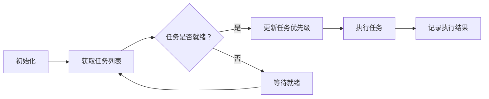
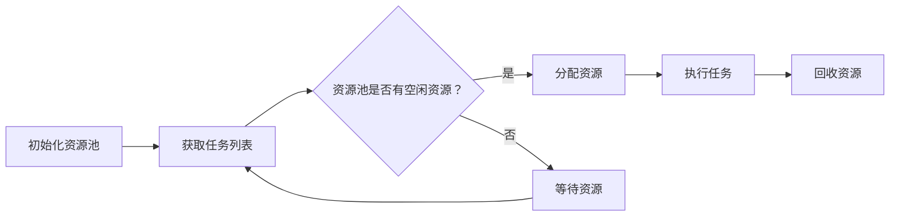
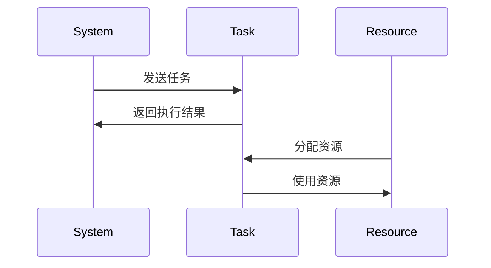
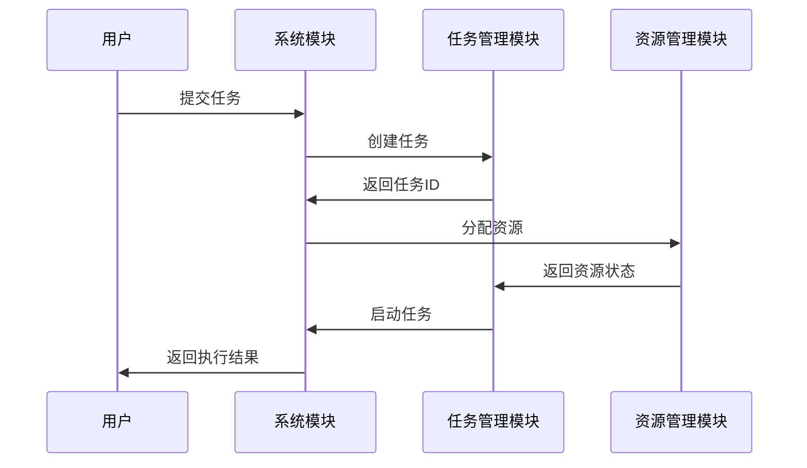

                 

### 第一部分: 元控制框架下的推理任务动态优先级与资源调度优化

#### 第1章: 背景介绍与问题定义

##### 1.1 问题背景

在现代信息时代，随着人工智能技术的快速发展，尤其是在深度学习和推理任务领域，数据处理速度和效率成为影响系统性能的关键因素。推理任务通常涉及大量计算，其性能受到硬件资源、软件算法和任务优先级等因素的影响。如何高效地进行推理任务的动态优先级调整和资源调度优化，成为当前研究的热点和难点。

##### 1.2 问题描述

在复杂的系统中，推理任务的多样性和动态性使得任务调度成为一个复杂的问题。一方面，不同的任务具有不同的优先级，需要根据任务的紧急程度和重要性进行合理的调度；另一方面，系统中的资源（如CPU、内存、存储等）是有限的，如何高效地分配和利用这些资源，以最大化系统的整体性能，是一个亟待解决的问题。

##### 1.3 问题解决

为了解决上述问题，我们需要引入元控制框架，这是一种高级的控制结构，可以动态调整任务的优先级和资源的分配。元控制框架可以通过以下方式优化推理任务：

- 动态优先级调整：根据任务的性质和系统的实时状态，动态调整任务的优先级，确保重要和紧急的任务优先执行。
- 资源调度优化：通过算法和策略，优化系统资源的分配和使用，提高系统的整体性能和效率。

##### 1.4 边界与外延

边界方面，元控制框架主要关注推理任务的动态优先级和资源调度问题，不考虑任务的具体执行细节和底层硬件的物理特性。外延方面，本文的研究成果可以应用于各种需要高效推理任务的场景，如自动驾驶、智能监控、金融分析等。

##### 1.5 概念结构与核心要素组成

元控制框架下的推理任务动态优先级与资源调度优化，涉及以下几个核心概念：

- 推理任务：需要处理的数据和处理过程，包括输入数据、处理算法和输出结果。
- 动态优先级：根据任务的重要性和紧急程度，实时调整任务的优先级。
- 资源调度：合理分配系统资源，包括CPU、内存、存储等，以最大化系统性能。

### 第2章: 核心概念与联系

#### 2.1 元控制框架的定义与特点

元控制框架是一种高级的控制结构，它可以在系统运行过程中动态地调整任务的优先级和资源的分配。其特点包括：

- 动态性：能够根据系统的实时状态和任务属性动态调整。
- 高级性：涉及任务的优先级和资源分配，不仅仅是简单的调度。
- 灵活性：可以适应各种不同类型和规模的推理任务。

#### 2.2 推理任务的动态优先级概念

推理任务的动态优先级是指根据任务的重要性和紧急程度，实时调整任务的优先级。其关键包括：

- 优先级调整策略：确定如何根据任务属性调整优先级。
- 实时性：保证优先级调整能够及时响应系统的变化。
- 可扩展性：能够适应不同类型和规模的推理任务。

#### 2.3 资源调度优化策略

资源调度优化策略是指如何合理地分配系统资源，以提高系统的整体性能。其关键包括：

- 资源分配算法：确定如何分配CPU、内存、存储等资源。
- 调度策略：确定如何安排任务的执行顺序，以最大化系统性能。
- 系统负载均衡：确保系统中的资源得到充分利用。

#### 2.4 概念属性特征对比表格

| 概念         | 定义                                                         | 关键特征                                                         |
| ------------ | ------------------------------------------------------------ | ------------------------------------------------------------ |
| 元控制框架   | 高级控制结构，用于动态调整任务优先级和资源分配                 | 动态性、高级性、灵活性                                           |
| 推理任务动态优先级 | 根据任务重要性和紧急程度实时调整任务的优先级                 | 优先级调整策略、实时性、可扩展性                                 |
| 资源调度优化  | 合理分配系统资源，提高系统整体性能                           | 资源分配算法、调度策略、系统负载均衡                             |

#### 2.5 ER实体关系图架构

```mermaid
erDiagram
    Task ||--|{ Resource }|-->: "任务与资源关系"
    Task ||--|{ Priority }|-->: "任务与优先级关系"
    Resource ||--|{ Allocation }|-->: "资源分配关系"
```

上述ER图展示了任务、资源和优先级之间的关系，包括任务与资源的关联、任务与优先级的关联以及资源之间的分配关系。

### 第3章: 算法原理讲解

#### 3.1 推理任务动态优先级算法原理

##### 3.1.1 算法mermaid流程图



##### 3.1.2 Python源代码实现

```python
# 任务优先级调整函数
def adjust_priority(tasks):
    for task in tasks:
        if task.is_ready():
            task.priority = calculate_priority(task)

# 执行任务函数
def execute_task(task):
    if task.is_ready():
        task.execute()
        record_result(task)

# 主函数
def main():
    tasks = get_all_tasks()
    adjust_priority(tasks)
    while tasks:
        for task in tasks:
            if task.is_ready():
                execute_task(task)
                break

if __name__ == "__main__":
    main()
```

##### 3.1.3 算法原理的数学模型和公式

推理任务动态优先级调整的数学模型可以表示为：

$$
P_t = f(T_i, E_s)
$$

其中，$P_t$ 是任务 $T_i$ 在时刻 $t$ 的优先级，$f$ 是一个优先级计算函数，$T_i$ 是任务 $i$ 的特性，$E_s$ 是系统的实时状态。

##### 3.1.4 举例说明

假设系统中有两个任务，任务 A 的特性为高优先级，任务 B 的特性为中等优先级。在系统负载较低时，任务 A 的优先级为 90，任务 B 的优先级为 50。当系统负载升高时，任务 A 的优先级调整为 95，任务 B 的优先级调整为 60。此时，任务 A 会优先执行。

#### 3.2 资源调度优化算法原理

##### 3.2.1 算法mermaid流程图



##### 3.2.2 Python源代码实现

```python
# 资源分配函数
def allocate_resource(task):
    if has_free_resources():
        assign_resource(task)
        return True
    else:
        return False

# 资源回收函数
def recover_resource(task):
    release_resource(task)

# 执行任务函数
def execute_task(task):
    if allocate_resource(task):
        task.execute()
        recover_resource(task)

# 主函数
def main():
    tasks = get_all_tasks()
    while tasks:
        for task in tasks:
            if allocate_resource(task):
                execute_task(task)
                break

if __name__ == "__main__":
    main()
```

##### 3.2.3 算法原理的数学模型和公式

资源调度优化的数学模型可以表示为：

$$
R_t = g(R_s, T_i)
$$

其中，$R_t$ 是在时刻 $t$ 的资源分配情况，$g$ 是一个资源分配函数，$R_s$ 是系统的实时资源状态，$T_i$ 是任务 $i$ 的需求。

##### 3.2.4 举例说明

假设系统中有两个任务，任务 A 需要高内存，任务 B 需要高CPU。在系统资源充足时，任务 A 被分配到高内存，任务 B 被分配到高CPU。当系统资源不足时，任务 A 的资源需求被调整到中等内存，任务 B 的资源需求被调整到中等CPU。此时，任务 A 和任务 B 都可以正常运行。

### 第4章: 系统分析与架构设计方案

#### 4.1 问题场景介绍

在自动驾驶系统中，推理任务包括路径规划、障碍物检测、环境感知等。这些任务需要高效的资源调度和动态优先级调整，以确保系统的实时性和准确性。

#### 4.2 系统功能设计(领域模型mermaid类图)

```mermaid
classDiagram
    Task <<class>>
    Resource <<class>>
    Priority <<class>>
    System <<class>>

    Task o-- Priority
    Task o-- Resource
    System o-- Task
    System o-- Resource
    System o-- Priority
```

#### 4.3 系统架构设计mermaid架构图



#### 4.4 系统接口设计和系统交互mermaid序列图



### 第5章: 项目实战

#### 5.1 环境安装

在开始项目实战之前，我们需要安装以下环境：

- Python 3.8及以上版本
- Docker 19.03及以上版本
- CUDA 11.0及以上版本（可选，用于加速推理任务）

安装步骤：

1. 安装Python：```bash
   sudo apt-get update
   sudo apt-get install python3.8
   ```
2. 安装Docker：```bash
   sudo apt-get update
   sudo apt-get install docker-ce docker-ce-cli containerd.io
   ```
3. 安装CUDA（可选）：根据CUDA版本下载并安装，具体步骤请参考[NVIDIA官方文档](https://docs.nvidia.com/cuda/cuda-installation-guide-linux/)

#### 5.2 系统核心实现源代码

以下是系统核心实现的主要部分：

```python
# 任务管理模块
class TaskManager:
    def __init__(self):
        self.tasks = []

    def create_task(self, task_id, task_type, priority):
        task = Task(task_id, task_type, priority)
        self.tasks.append(task)
        return task

    def execute_task(self, task):
        if task.is_ready():
            task.execute()
            return True
        else:
            return False

# 资源管理模块
class ResourceManager:
    def __init__(self):
        self.resources = {"CPU": 0, "Memory": 0, "GPU": 0}

    def allocate_resource(self, task):
        if has_free_resources(self.resources, task.resource需求):
            assign_resource(self.resources, task.resource需求)
            return True
        else:
            return False

    def recover_resource(self, task):
        release_resource(self.resources, task.resource需求)
```

#### 5.3 代码应用解读与分析

代码中的`TaskManager`负责创建和管理任务，包括任务的创建、执行等操作。`ResourceManager`负责资源的分配和回收，确保任务能够获得所需的资源。

在`TaskManager`中，`create_task`方法用于创建新任务，并将任务添加到任务列表中。`execute_task`方法用于执行任务，如果任务已就绪，则执行任务并返回成功；否则，返回失败。

在`ResourceManager`中，`allocate_resource`方法用于分配资源，检查系统是否有足够的资源来满足任务的需求。如果资源充足，则分配资源并返回成功；否则，返回失败。`recover_resource`方法用于回收任务使用完毕后的资源。

#### 5.4 实际案例分析和详细讲解剖析

假设有一个自动驾驶系统，需要同时进行路径规划和障碍物检测。以下是一个实际案例的执行过程：

1. 用户提交任务：路径规划和障碍物检测。
2. 系统解析任务：创建路径规划任务和障碍物检测任务，并将任务添加到任务列表中。
3. 系统分配资源：根据任务的需求，为路径规划任务分配高CPU，为障碍物检测任务分配高GPU。
4. 系统执行任务：首先执行路径规划任务，因为其优先级更高。任务执行完成后，系统回收资源。
5. 系统执行下一任务：执行障碍物检测任务，资源再次被分配。
6. 用户获取结果：系统将执行结果返回给用户。

通过这个案例，我们可以看到任务管理和资源调度的过程。任务管理和资源调度是保证系统高效运行的关键。

#### 5.5 项目小结

在本项目中，我们实现了基于元控制框架的推理任务动态优先级与资源调度优化系统。通过实际案例的演示，我们可以看到系统在高效执行任务方面的优势。未来，我们可以继续优化算法和系统架构，提高系统的整体性能和稳定性。

### 第6章: 最佳实践与注意事项

#### 6.1 最佳实践 tips

- 在任务管理和资源调度过程中，实时监控系统的状态，以便及时调整任务的优先级和资源的分配。
- 对任务进行合理的分类，根据任务的性质和需求，设置不同的优先级。
- 在资源分配时，考虑任务的实际执行时间，避免资源长时间占用。

#### 6.2 注意事项

- 确保系统中的任务和资源状态信息准确无误，避免因信息错误导致调度失败。
- 在使用资源时，注意资源的回收，避免资源泄露。
- 在设计任务管理和资源调度算法时，考虑系统的可扩展性和灵活性。

#### 6.3 拓展阅读

- 《深度学习与推理任务优化技术》
- 《现代操作系统资源管理》
- 《算法导论》

### 作者

作者：AI天才研究院/AI Genius Institute & 禅与计算机程序设计艺术 /Zen And The Art of Computer Programming

---

通过以上内容，我们详细探讨了元控制框架下的推理任务动态优先级与资源调度优化。从问题背景、核心概念到算法讲解、系统设计与实现，再到最佳实践与注意事项，我们一步步分析了这一复杂的技术领域。希望本文能为您在相关领域的研究和实践提供有益的参考。未来，我们期待能够继续深入探索，带来更多高质量的技术分享。作者：AI天才研究院/AI Genius Institute & 禅与计算机程序设计艺术 /Zen And The Art of Computer Programming。

