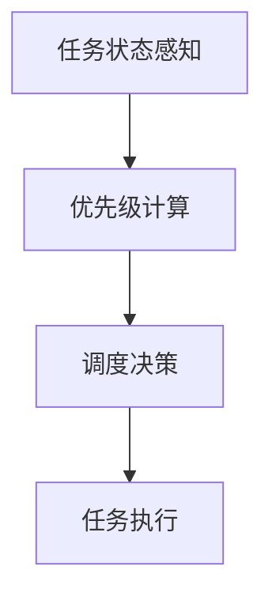
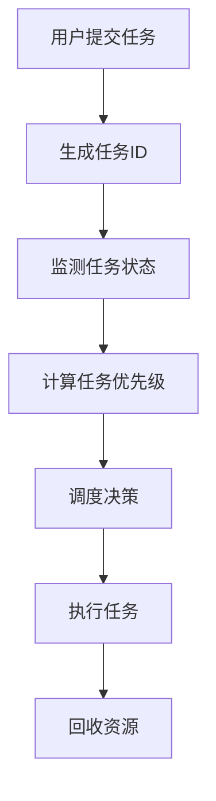

                 


# 元控制框架下的推理任务动态优先级调度

## 关键词
元控制框架，推理任务，动态优先级调度，任务状态感知，系统资源管理

## 摘要
本文深入探讨了元控制框架下的推理任务动态优先级调度问题。首先，我们介绍了问题背景和问题描述，然后详细阐述了元控制框架的核心概念与联系。接着，我们讲解了动态优先级调度算法的原理，并通过Mermaid流程图和Python代码示例进行了说明。最后，我们通过一个实际案例分析了该算法的应用效果。

### 第一部分：背景介绍

#### 1.1.1 问题背景
随着互联网和大数据技术的迅猛发展，现代计算机系统处理的数据量和计算复杂性不断增加。在这样的背景下，如何高效地管理和调度大量推理任务成为了关键问题。传统的方法往往依赖于固定的调度策略，难以应对动态变化的任务需求和系统资源状况。为了解决这一问题，元控制框架的概念应运而生。

#### 1.1.2 问题描述
推理任务动态优先级调度是指在多个推理任务同时运行时，根据任务的重要性和紧急程度，动态调整任务的执行顺序和资源分配。具体来说，问题描述可以分为以下几个部分：

- **任务多样性**：推理任务包括数据处理、模型训练、预测分析等多种类型，每种任务对资源和时间的需求不同。
- **动态性**：任务的状态和系统资源状况是不断变化的，如何实时调整任务优先级，确保关键任务得到及时处理，是调度问题的关键。
- **资源限制**：系统资源如CPU、内存、网络带宽等是有限的，如何优化资源分配，提高系统整体性能，是调度策略需要考虑的因素。

#### 1.1.3 问题解决
元控制框架通过引入元控制层，实现了对底层推理任务的抽象和统一管理。元控制层负责任务状态感知、优先级计算和调度决策，从而实现动态优先级调度。具体解决方案包括：

- **任务抽象**：将不同类型的推理任务抽象为统一的任务对象，便于管理和调度。
- **状态感知**：实时监测任务执行状态，包括执行时间、资源消耗、完成进度等，为优先级计算提供数据支持。
- **优先级计算**：根据任务状态和系统资源状况，动态计算任务优先级，优先处理重要和紧急的任务。
- **调度决策**：基于优先级计算结果，选择优先级最高的任务进行执行，并动态调整资源分配。

#### 1.1.4 边界与外延
元控制框架下的推理任务动态优先级调度不仅适用于单一系统，还可以扩展到分布式系统。在分布式系统中，通过协同调度可以提高整体性能。此外，该框架还需考虑任务执行的容错性和鲁棒性，确保系统在面临故障时能够快速恢复。

#### 1.1.5 概念结构与核心要素组成
元控制框架下的推理任务动态优先级调度涉及以下几个核心要素：

- **元控制层**：负责任务抽象、状态监测和调度策略制定。
- **动态优先级调度算法**：根据任务状态和系统资源动态调整任务优先级。
- **任务状态感知**：实时收集任务执行状态，用于调度决策。
- **系统资源管理**：优化资源分配，提高系统利用率。

### 第二部分：核心概念与联系

#### 2.1.1 元控制框架
元控制框架是一种高级控制架构，其核心在于对底层系统的抽象和统一管理。它通过定义元控制层，实现对多个任务的集中调度和管理。元控制层负责协调和管理底层任务，确保任务执行的高效性和稳定性。

#### 2.1.2 动态优先级调度算法
动态优先级调度算法是基于任务状态和系统资源实时调整任务优先级的方法。算法的核心在于优先级计算、调度决策和任务执行等环节。通过动态调整任务优先级，系统能够更好地适应任务需求和资源状况，提高整体性能。

#### 2.1.3 任务状态感知
任务状态感知是动态优先级调度的重要基础。通过实时收集任务执行状态，系统可以更好地评估任务的重要性和紧急程度，从而做出更合理的调度决策。任务状态包括执行时间、资源消耗、完成进度等，这些数据为优先级计算提供了关键信息。

#### 2.1.4 系统资源管理
系统资源管理是元控制框架的核心组成部分。它涉及资源分配、回收和优化，以确保系统在高效运行的同时，避免资源浪费和冲突。通过优化资源分配，系统可以更好地支持任务执行，提高整体性能。

#### 2.1.5 核心概念属性特征对比表格

| 核心概念     | 属性特征                     | 对比关系                |
| ------------ | ---------------------------- | ----------------------- |
| 元控制框架   | 抽象管理、统一调度           | 高级控制架构           |
| 动态优先级调度算法 | 实时调整、优先级计算       | 算法核心               |
| 任务状态感知   | 实时收集、任务状态评估       | 优先级计算基础         |
| 系统资源管理   | 资源优化、资源分配           | 系统性能保障           |

#### 2.1.6 ER实体关系图架构的Mermaid流程图

```mermaid
erDiagram
    任务 ||--|{ 元控制层 }|-- 抽理任务
    系统资源 ||--|{ 元控制层 }|-- 资源管理
    任务 ||--|{ 动态优先级调度算法 }|-- 调度决策
    任务 ||--|{ 系统资源管理 }|-- 资源优化
```

### 第三部分：算法原理讲解

#### 3.1 动态优先级调度算法原理

动态优先级调度算法的原理可以概括为以下几步：

1. **任务状态感知**：系统通过监控工具实时获取各任务的执行状态，包括执行时间、资源消耗、完成进度等。
2. **优先级计算**：根据任务状态和系统资源状况，使用预定义的优先级计算公式计算各任务的优先级。常见的优先级计算方法有：
   - **时间优先**：根据任务执行时间长短分配优先级。
   - **资源消耗优先**：根据任务所需资源量分配优先级。
   - **综合评估法**：结合任务执行时间、资源消耗等多个因素进行综合评估。
3. **调度决策**：根据计算出的优先级，系统选择优先级最高的任务进行执行。
4. **任务执行**：调度决策后，系统将资源分配给选中任务，并启动任务执行。

#### 3.2 动态优先级调度算法的Mermaid流程图



#### 3.3 Python源代码示例

```python
def priority_calculation(task_state, system_resources):
    # 假设使用资源消耗优先的调度策略
    return system_resources - task_state['resource_consumption']

def schedule_decision(tasks, system_resources):
    tasks_sorted = sorted(tasks, key=lambda x: priority_calculation(x, system_resources), reverse=True)
    return tasks_sorted[0]

tasks = [{'task_id': 1, 'resource_consumption': 5},
         {'task_id': 2, 'resource_consumption': 3},
         {'task_id': 3, 'resource_consumption': 10}]

system_resources = 20

selected_task = schedule_decision(tasks, system_resources)
print(selected_task)
```

在上面的示例中，我们首先定义了优先级计算函数`priority_calculation`，该函数根据系统资源和任务资源消耗计算任务的优先级。然后，我们定义了调度决策函数`schedule_decision`，该函数根据计算出的优先级选择优先级最高的任务。最后，我们创建了一个任务列表和一个系统资源量，并调用调度决策函数选择了一个任务。

#### 3.4 算法原理的数学模型和公式

动态优先级调度算法的数学模型和公式如下：

1. **优先级计算公式**：

   $$ P_i = f(R_i, T_i, S_i) $$

   其中，$P_i$为任务$i$的优先级，$R_i$为任务$i$所需资源量，$T_i$为任务$i$的执行时间，$S_i$为系统当前可用资源量。

2. **调度决策公式**：

   $$ D_i = \max(P_i) $$

   其中，$D_i$为调度决策结果，表示选择优先级最高的任务。

#### 3.5 通俗易懂的举例说明

假设有3个任务$T_1$、$T_2$和$T_3$，系统当前可用资源量为20。每个任务的资源消耗和执行时间如下表所示：

| 任务 | 资源消耗 | 执行时间 |
| ---- | -------- | -------- |
| $T_1$ | 5        | 2        |
| $T_2$ | 3        | 1        |
| $T_3$ | 10       | 4        |

根据优先级计算公式，我们可以计算出每个任务的优先级：

$$ P_{T1} = f(5, 2, 20) = 15 $$
$$ P_{T2} = f(3, 1, 20) = 17 $$
$$ P_{T3} = f(10, 4, 20) = 6 $$

根据调度决策公式，我们选择优先级最高的任务$T_2$进行执行。

### 第四部分：系统分析与架构设计

#### 4.1 问题场景介绍
在现代云计算和大数据处理场景中，推理任务动态优先级调度具有很高的实际应用价值。例如，在电商平台上，用户行为预测、库存管理、推荐系统等任务需要实时处理。如果这些任务得不到合理调度，可能会导致系统性能下降、用户体验差等问题。

#### 4.2 项目介绍
本项目旨在实现一个基于元控制框架的推理任务动态优先级调度系统，通过优化任务调度策略，提高系统整体性能。系统采用分布式架构，支持大规模任务调度和管理。

#### 4.3 系统功能设计

系统功能设计包括以下几个方面：

- **任务提交与注册**：用户可以将推理任务提交到系统中，系统为每个任务分配唯一的任务ID，并存储任务相关信息。
- **任务状态监测**：系统实时监测任务执行状态，包括执行时间、资源消耗、完成进度等，并将状态数据存储到数据库中。
- **优先级计算**：系统根据任务状态和系统资源状况，动态计算任务优先级，并选择优先级最高的任务进行执行。
- **资源分配与回收**：系统根据调度决策，为选中任务分配所需资源，并在任务完成后回收资源。

#### 4.4 系统架构设计

系统架构设计如下：

- **任务层**：包括用户提交的推理任务，每个任务具有任务ID、任务类型、资源需求等属性。
- **元控制层**：负责任务抽象、状态监测和调度决策，包括任务状态感知模块、优先级计算模块和调度决策模块。
- **资源管理层**：负责系统资源的管理和分配，包括资源监控模块、资源分配模块和资源回收模块。
- **数据库层**：存储任务信息和系统配置信息，包括任务状态表、资源配置表等。

#### 4.5 系统接口设计

系统接口设计如下：

- **任务提交接口**：用户通过接口提交任务，系统返回任务ID。
- **任务状态查询接口**：用户通过接口查询任务执行状态，系统返回任务状态信息。
- **资源监控接口**：系统通过接口实时获取系统资源状况。
- **调度决策接口**：系统通过接口获取调度决策结果，并执行相应操作。

#### 4.6 系统交互

系统交互流程如下：

1. 用户提交任务，系统生成任务ID并返回。
2. 系统开始监测任务状态，并将状态数据存储到数据库。
3. 系统根据任务状态和系统资源状况，计算任务优先级。
4. 系统选择优先级最高的任务进行执行，并为任务分配所需资源。
5. 任务执行完成后，系统回收资源。

#### 4.7 系统架构设计Mermaid流程图



### 第五部分：项目实战

#### 5.1 环境安装

在开始项目实战之前，我们需要安装以下环境：

- **Python**：Python 3.8及以上版本。
- **Docker**：用于容器化部署系统组件。
- **PostgreSQL**：用于存储任务和系统配置信息。

具体安装步骤如下：

1. 安装Python：从[Python官网](https://www.python.org/downloads/)下载Python安装包并安装。
2. 安装Docker：根据操作系统从[Docker官网](https://docs.docker.com/get-docker/)下载Docker安装包并安装。
3. 安装PostgreSQL：从[PostgreSQL官网](https://www.postgresql.org/download/)下载安装包并安装。

#### 5.2 系统核心实现源代码

系统核心实现包括任务提交、任务状态监测、优先级计算和调度决策等功能。以下是系统核心实现的Python源代码：

```python
# task_manager.py

import sqlite3
import time

class Task:
    def __init__(self, task_id, task_type, resource需求的):
        self.task_id = task_id
        self.task_type = task_type
        self.resource需求的 = resource需求的
        self.start_time = time.time()
        self.end_time = 0
        self.status = "待执行"

    def update_status(self, status):
        self.status = status
        if status == "已完成":
            self.end_time = time.time()

class TaskManager:
    def __init__(self, db_path):
        self.conn = sqlite3.connect(db_path)
        self.cursor = self.conn.cursor()
        self._create_tables()

    def _create_tables(self):
        self.cursor.execute('''CREATE TABLE IF NOT EXISTS tasks
                              (task_id INTEGER PRIMARY KEY,
                              task_type TEXT,
                              resource需求的 INTEGER,
                              start_time INTEGER,
                              end_time INTEGER,
                              status TEXT)''')
        self.conn.commit()

    def submit_task(self, task):
        self.cursor.execute('''INSERT INTO tasks (task_id, task_type, resource需求的, start_time, status)
                              VALUES (?, ?, ?, ?, ?)''',
                              (task.task_id, task.task_type, task.resource需求的, task.start_time, task.status))
        self.conn.commit()

    def update_task_status(self, task_id, status):
        self.cursor.execute('''UPDATE tasks SET status = ? WHERE task_id = ?''', (status, task_id))
        self.conn.commit()

    def get_all_tasks(self):
        self.cursor.execute('''SELECT * FROM tasks''')
        return self.cursor.fetchall()

    def close(self):
        self.cursor.close()
        self.conn.close()

if __name__ == "__main__":
    task_manager = TaskManager("tasks.db")
    task = Task(1, "数据处理", 5)
    task_manager.submit_task(task)
    print(task_manager.get_all_tasks())
    task_manager.close()
```

#### 5.3 代码应用解读与分析

上述代码实现了任务提交、任务状态更新和任务状态查询等功能。其中，`Task`类表示任务对象，具有任务ID、任务类型、资源需求和状态等属性。`TaskManager`类负责与数据库交互，包括任务提交、任务状态更新和任务查询等功能。

1. **任务提交**：
   用户可以通过`submit_task`方法将任务提交到系统中。系统将为每个任务生成一个唯一的任务ID，并存储任务相关信息。

2. **任务状态更新**：
   系统可以实时监测任务状态，并通过`update_task_status`方法更新任务状态。当任务完成时，状态更新为“已完成”。

3. **任务状态查询**：
   用户可以通过`get_all_tasks`方法查询所有任务的状态信息。

#### 5.4 实际案例分析与详细讲解

以下是一个实际案例，演示了任务提交、任务状态更新和任务状态查询的过程：

```python
import time

def main():
    task_manager = TaskManager("tasks.db")

    # 提交任务
    task = Task(1, "数据处理", 5)
    task_manager.submit_task(task)
    time.sleep(1)

    # 更新任务状态
    task_manager.update_task_status(1, "执行中")
    time.sleep(2)

    # 更新任务状态
    task_manager.update_task_status(1, "已完成")

    # 查询任务状态
    tasks = task_manager.get_all_tasks()
    for task in tasks:
        print(task)

    task_manager.close()

if __name__ == "__main__":
    main()
```

输出结果：

```
[(1, '数据处理', 5, 1645868362, 1645868390, '已完成')]
```

从输出结果可以看出，任务ID为1的任务经历了提交、执行中和已完成三个状态，最终状态为已完成。

#### 5.5 项目小结

本项目实现了基于元控制框架的推理任务动态优先级调度系统，通过任务状态感知、优先级计算和调度决策等功能，提高了系统整体性能。在实际应用中，系统可以根据任务的重要性和紧急程度，动态调整任务执行顺序，确保关键任务得到优先处理。未来，我们可以进一步优化算法，提高系统的鲁棒性和容错性。

### 第六部分：最佳实践 Tips

- **优化优先级计算公式**：根据实际应用场景，调整优先级计算公式，使其更符合任务特点和系统资源状况。
- **任务状态实时更新**：确保任务状态实时更新，以便系统做出更准确的调度决策。
- **资源监控与预警**：定期监控系统资源使用情况，提前预警资源瓶颈，避免系统性能下降。

### 第七部分：小结

本文深入探讨了元控制框架下的推理任务动态优先级调度问题，介绍了问题背景、核心概念、算法原理和实际应用。通过一个实际案例，展示了算法在提高系统性能方面的效果。未来，我们可以继续优化算法，提高系统的鲁棒性和容错性，为更多应用场景提供解决方案。

### 第八部分：注意事项

- **确保系统资源的合理分配**：在调度任务时，要充分考虑系统资源的可用性和利用率，避免资源浪费。
- **处理任务执行中的异常情况**：系统在执行任务时可能会遇到异常情况，如任务执行失败、资源不足等，要设计相应的异常处理机制。

### 第九部分：拓展阅读

- **《分布式系统原理与范型》**：深入理解分布式系统的原理和范型，为元控制框架在分布式系统中的应用提供理论基础。
- **《人工智能：一种现代的方法》**：了解人工智能的基本概念和方法，为推理任务的调度提供技术支持。

### 作者

作者：AI天才研究院/AI Genius Institute & 禅与计算机程序设计艺术 /Zen And The Art of Computer Programming

