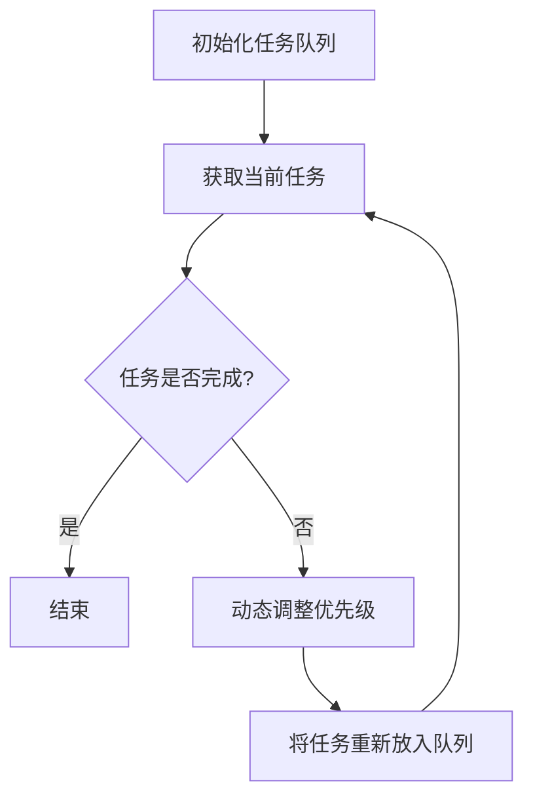
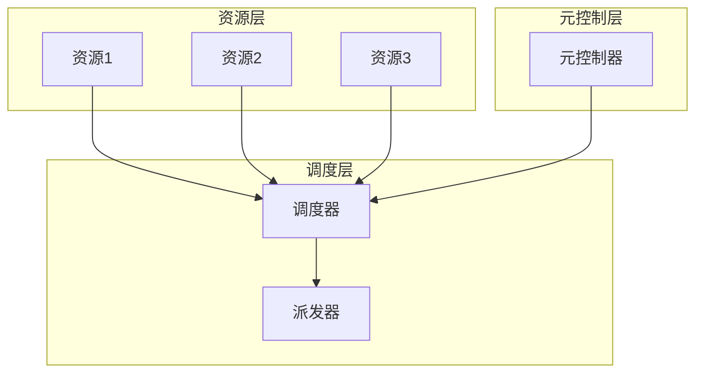
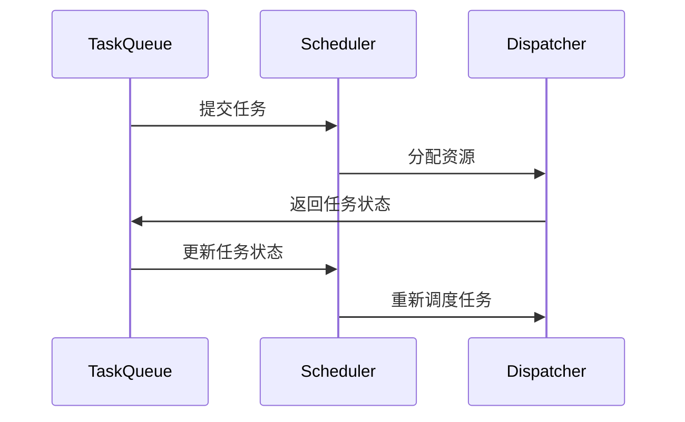

                 

# 元控制框架下的推理任务动态优先级调度

## 关键词
- 元控制框架
- 推理任务
- 动态优先级调度
- 资源管理
- 智能优化算法

## 摘要
本文将深入探讨元控制框架下的推理任务动态优先级调度问题。首先，我们介绍了元控制框架的背景和核心概念，并探讨了推理任务的特点和动态优先级调度的必要性。接着，我们详细分析了元控制框架的基础理论、关键技术，以及推理任务的性能指标和动态性。在此基础上，我们介绍了静态优先级调度策略和动态优先级调度算法的设计原理，并针对典型场景进行了案例分析。通过本文的研究，旨在为解决推理任务动态优先级调度问题提供新的思路和解决方案。

## 第一部分：引言

### 第1章：背景与核心概念

#### 1.1 问题背景

在现代计算机系统中，尤其是人工智能领域，推理任务的处理效率和质量直接影响系统的性能和用户体验。随着大数据和云计算技术的发展，推理任务的数量和复杂度不断增加，如何在有限的资源下高效地调度和执行这些任务成为了一个重要的研究课题。

元控制框架（Meta-Control Framework）作为一种新型的调度框架，旨在解决传统调度算法在复杂、动态环境下的调度问题。它通过引入元控制层，实现了对底层资源的高效管理和调度，为推理任务提供了灵活、高效的执行环境。

#### 1.1.1 元控制框架概述

元控制框架是一种基于元控制层（Meta-Layer）的调度框架，其核心思想是在传统的调度框架之上增加一个元控制层，通过元控制层对底层资源进行统一管理和调度。元控制层不仅负责资源的分配和调度，还负责对调度策略进行动态调整，以适应环境变化。

元控制框架的基本结构包括三个层次：资源层、调度层和元控制层。资源层包括各种硬件资源和软件资源；调度层负责根据元控制层的调度策略，对资源进行分配和调度；元控制层负责监控整个系统的运行状态，并根据运行状态动态调整调度策略。

#### 1.1.2 推理任务动态优先级调度的重要性

推理任务具有高计算密集性和动态性，其执行时间、资源需求和优先级都可能随着时间和环境的变化而变化。因此，如何根据推理任务的动态特性，动态调整任务的优先级，是实现高效推理任务调度的重要途径。

动态优先级调度策略能够根据任务的实时状态和系统资源状况，动态调整任务的优先级，使得关键任务能够及时得到执行，从而提高系统的整体性能和响应速度。此外，动态优先级调度还可以有效避免资源冲突，提高资源利用率。

#### 1.1.3 探讨目标与内容安排

本文的目标是探讨元控制框架下的推理任务动态优先级调度问题，旨在为解决推理任务调度问题提供新的思路和方法。具体内容安排如下：

1. 第1章：引言，介绍问题背景、元控制框架概述和推理任务动态优先级调度的重要性。
2. 第2章：元控制框架基础理论，分析元控制框架的发展历程、核心原理和关键技术。
3. 第3章：推理任务特性分析，探讨推理任务的定义、分类、性能指标和动态性。
4. 第4章：静态优先级调度策略，介绍静态优先级调度策略的定义、类型和应用。
5. 第5章：动态优先级调度算法设计，阐述动态优先级调度算法的原理和设计原则。
6. 第6章：案例分析，通过典型场景下的动态优先级调度案例分析，验证本文提出的方法和策略。

#### 1.2 核心概念

1. **元控制框架**：一种基于元控制层的调度框架，通过增加元控制层实现对底层资源的高效管理和调度。
2. **推理任务**：指在人工智能领域中，基于数据或知识进行推理的过程，包括推理算法、推理规则和推理结果等。
3. **动态优先级调度**：根据任务的实时状态和系统资源状况，动态调整任务的优先级，实现高效调度。

#### 1.3 本书的结构安排与学习目标

本书分为六个部分，旨在从理论到实践全面探讨元控制框架下的推理任务动态优先级调度问题。具体结构安排和学习目标如下：

1. **引言部分（第1章）**：介绍问题背景、元控制框架概述和推理任务动态优先级调度的重要性，明确本书的研究目标和内容安排。
2. **元控制框架基础理论部分（第2章）**：分析元控制框架的发展历程、核心原理和关键技术，为后续讨论打下理论基础。
3. **推理任务特性分析部分（第3章）**：探讨推理任务的定义、分类、性能指标和动态性，为动态优先级调度提供依据。
4. **静态优先级调度策略部分（第4章）**：介绍静态优先级调度策略的定义、类型和应用，为静态调度策略提供指导。
5. **动态优先级调度算法设计部分（第5章）**：阐述动态优先级调度算法的原理和设计原则，为动态调度算法提供参考。
6. **案例分析部分（第6章）**：通过典型场景下的动态优先级调度案例分析，验证本文提出的方法和策略，为实际应用提供借鉴。

#### 1.4 本章小结

本章介绍了元控制框架下的推理任务动态优先级调度问题的背景、核心概念和本书的研究目标。通过对元控制框架、推理任务和动态优先级调度的详细阐述，为后续章节的讨论奠定了基础。本章内容主要分为四个部分：问题背景、元控制框架概述、核心概念和本书结构安排与学习目标。通过本章的学习，读者可以初步了解元控制框架下的推理任务动态优先级调度问题的研究内容和意义。

----------------------------------------------------------------

### 第2章：元控制框架基础理论

#### 2.1 元控制框架的发展历程

元控制框架（Meta-Control Framework）的概念最早可以追溯到20世纪80年代，当时的计算机系统规模较小，调度问题相对简单。随着计算机技术和网络技术的发展，计算机系统变得越来越复杂，调度问题也变得更加重要和复杂。为了应对这些挑战，研究者们开始探索新的调度框架，元控制框架应运而生。

元控制框架的发展历程可以分为以下几个阶段：

1. **早期探索阶段**（1980-1990年）：在这个阶段，研究者们开始关注调度问题，并提出了一些初步的调度策略和算法。这些策略和算法主要针对特定的场景和系统，缺乏通用性和灵活性。
2. **成熟发展阶段**（1990-2000年）：随着计算机系统的复杂度不断增加，传统的调度算法逐渐暴露出局限性。为了解决这些问题，研究者们开始提出更加通用和灵活的调度框架，元控制框架逐渐成熟。
3. **智能化阶段**（2000年至今）：随着人工智能技术的快速发展，元控制框架开始引入智能优化算法，如遗传算法、粒子群优化算法等，实现了调度策略的自动优化和调整。这一阶段，元控制框架在各个领域的应用也日益广泛。

#### 2.1.1 传统调度算法的局限性

传统调度算法在简单、静态环境下表现良好，但在复杂、动态环境下存在以下局限性：

1. **适应性差**：传统调度算法通常基于固定规则或预设参数，难以适应环境变化。当系统状态发生改变时，传统算法无法及时调整，导致调度效率下降。
2. **缺乏灵活性**：传统调度算法通常针对特定场景和系统进行设计，缺乏通用性和灵活性。当面对不同的调度需求时，传统算法往往无法满足要求。
3. **资源利用率低**：传统调度算法在资源分配和调度过程中，往往存在资源浪费和冲突问题。这导致系统资源利用率较低，影响了整体性能。

#### 2.1.2 元控制框架的提出

为了解决传统调度算法的局限性，研究者们提出了元控制框架。元控制框架的核心思想是在调度过程中引入一个元控制层，实现对底层资源的高效管理和调度。元控制层不仅负责资源的分配和调度，还负责对调度策略进行动态调整，以适应环境变化。

元控制框架具有以下优点：

1. **高适应性**：元控制框架通过动态调整调度策略，能够适应复杂、动态环境的变化。当系统状态发生改变时，元控制框架能够及时调整调度策略，提高调度效率。
2. **高灵活性**：元控制框架基于通用框架设计，具有较好的通用性和灵活性。在面对不同的调度需求时，元控制框架能够灵活调整，满足各种调度要求。
3. **高效资源利用**：元控制框架通过动态资源管理和调度策略优化，能够有效避免资源浪费和冲突，提高系统资源利用率。

#### 2.1.3 元控制框架的关键组件

元控制框架主要包括以下三个关键组件：

1. **资源层**：资源层包括各种硬件资源和软件资源，如CPU、内存、存储、网络等。资源层为元控制框架提供了基础资源支持。
2. **调度层**：调度层负责根据元控制层的调度策略，对资源进行分配和调度。调度层是元控制框架的核心组件，其性能直接影响到整个系统的调度效率。
3. **元控制层**：元控制层负责监控整个系统的运行状态，并根据运行状态动态调整调度策略。元控制层是元控制框架的智能核心，其性能和智能程度决定了元控制框架的调度效果。

#### 2.2 元控制框架的核心原理

元控制框架的核心原理主要包括以下几个方面：

1. **元控制层监控与反馈**：元控制层通过监控整个系统的运行状态，包括资源使用情况、任务执行情况等，收集系统运行数据。根据这些数据，元控制层能够及时了解系统运行状态，并为调度策略的调整提供依据。
2. **调度策略动态调整**：元控制层根据系统运行状态和任务特性，动态调整调度策略。调度策略的调整包括资源分配策略、调度顺序策略等，旨在提高系统资源利用率和调度效率。
3. **资源分配与调度**：调度层根据元控制层的调度策略，对资源进行分配和调度。资源分配与调度的目标是使系统能够高效、稳定地运行，同时满足任务需求。

#### 2.2.1 元控制框架的基本结构

元控制框架的基本结构包括三个层次：资源层、调度层和元控制层。以下是元控制框架的基本结构示意图：

```
+------------------+       +------------------+       +------------------+
|      资源层      |       |      调度层      |       |     元控制层     |
+------------------+       +------------------+       +------------------+
| 硬件资源（CPU、内存、存储、网络等） | 调度算法、调度策略 | 监控系统运行状态、动态调整调度策略 |
+------------------+       +------------------+       +------------------+
```

资源层提供基础资源支持，包括各种硬件资源和软件资源。调度层根据元控制层的调度策略，对资源进行分配和调度。元控制层负责监控整个系统的运行状态，并根据运行状态动态调整调度策略。

#### 2.2.2 元控制框架的调度策略

元控制框架的调度策略主要包括以下几个方面：

1. **资源分配策略**：资源分配策略负责根据任务需求、资源可用性和系统负载等因素，为任务分配适当的资源。常见的资源分配策略包括：固定分配策略、动态分配策略、优先级分配策略等。
2. **调度顺序策略**：调度顺序策略负责确定任务的执行顺序，以优化系统性能和响应速度。常见的调度顺序策略包括：先到先服务（FCFS）、最短作业优先（SJF）、最短剩余时间优先（SRTF）等。
3. **负载均衡策略**：负载均衡策略负责在整个系统中分配任务负载，避免某一部分资源过载或闲置。常见的负载均衡策略包括：静态负载均衡、动态负载均衡、基于反馈的负载均衡等。

#### 2.2.3 元控制框架的优势与挑战

元控制框架具有以下优势：

1. **高适应性**：元控制框架能够根据环境变化和任务需求，动态调整调度策略，提高系统适应性。
2. **高灵活性**：元控制框架具有较好的通用性和灵活性，能够满足各种调度需求。
3. **高效资源利用**：元控制框架通过动态资源管理和调度策略优化，提高系统资源利用率。

然而，元控制框架也面临着一些挑战：

1. **复杂性**：元控制框架涉及多个层次和组件，具有较高的复杂性。这要求设计者具有扎实的理论基础和实际经验，才能有效构建和优化元控制框架。
2. **实时性**：元控制框架需要在短时间内完成调度策略的动态调整，以保证系统实时响应。这要求调度算法具有高效的执行速度。
3. **可扩展性**：元控制框架需要具备良好的可扩展性，以适应未来技术的发展和应用需求。

#### 2.3 元控制框架的关键技术

元控制框架的关键技术主要包括以下几个方面：

1. **动态资源管理**：动态资源管理技术负责根据系统运行状态和任务需求，动态调整资源分配和调度策略，以提高系统资源利用率和调度效率。
2. **任务调度算法**：任务调度算法负责根据任务特性、资源可用性和系统负载等因素，为任务分配资源并确定执行顺序，以优化系统性能和响应速度。
3. **智能优化算法**：智能优化算法负责对调度策略进行自动优化和调整，以提高系统资源利用率和调度效率。常见的智能优化算法包括遗传算法、粒子群优化算法、模拟退火算法等。

#### 2.3.1 动态资源管理

动态资源管理技术是元控制框架的核心技术之一，其主要目标是根据系统运行状态和任务需求，动态调整资源分配和调度策略。动态资源管理主要包括以下内容：

1. **资源监控**：资源监控技术负责实时监控系统的资源使用情况，包括CPU利用率、内存占用率、存储带宽等。通过资源监控，元控制层能够及时了解系统的资源状况。
2. **资源分配**：资源分配技术根据任务需求和资源状况，为任务分配适当的资源。资源分配策略包括固定分配策略、动态分配策略、优先级分配策略等。
3. **资源调度**：资源调度技术负责根据调度策略，对资源进行动态调整和分配。资源调度策略包括调度顺序策略、负载均衡策略等。

#### 2.3.2 任务调度算法

任务调度算法是元控制框架的核心组成部分，其主要目标是优化系统的资源利用率和调度效率。任务调度算法主要包括以下内容：

1. **调度策略**：调度策略负责根据任务特性、资源可用性和系统负载等因素，确定任务的执行顺序和资源分配。常见的调度策略包括先到先服务（FCFS）、最短作业优先（SJF）、最短剩余时间优先（SRTF）等。
2. **调度顺序**：调度顺序技术负责确定任务的执行顺序，以优化系统性能和响应速度。调度顺序策略包括优先级调度、时间片调度、循环调度等。
3. **调度优化**：调度优化技术负责对调度策略进行优化，以提高系统资源利用率和调度效率。调度优化方法包括贪心算法、动态规划、遗传算法等。

#### 2.3.3 智能优化算法

智能优化算法是元控制框架的关键技术之一，其主要目标是自动优化和调整调度策略，以提高系统资源利用率和调度效率。常见的智能优化算法包括：

1. **遗传算法**：遗传算法是一种基于自然进化原理的优化算法，通过模拟生物进化过程，寻找最优调度策略。
2. **粒子群优化算法**：粒子群优化算法是一种基于群体智能的优化算法，通过模拟鸟群觅食行为，寻找最优调度策略。
3. **模拟退火算法**：模拟退火算法是一种基于物理退火过程的优化算法，通过模拟物质冷却过程，寻找最优调度策略。

#### 2.4 本章小结

本章介绍了元控制框架的基础理论，包括元控制框架的发展历程、核心原理和关键技术。通过对元控制框架的深入分析，我们了解了其高适应性、高灵活性和高效资源利用的优势，以及面临的复杂性、实时性和可扩展性挑战。同时，本章还介绍了元控制框架的关键技术，包括动态资源管理、任务调度算法和智能优化算法。这些内容为后续章节的讨论奠定了基础。

----------------------------------------------------------------

## 第3章：推理任务特性分析

### 3.1 推理任务概述

推理任务在人工智能领域中具有重要意义，其广泛应用于自然语言处理、计算机视觉、智能决策等领域。推理任务是指基于数据或知识，通过逻辑推理、模式识别等方法，从已知信息推导出未知信息的过程。推理任务通常包括以下几个关键组成部分：

1. **推理算法**：推理算法是推理任务的核心，用于实现数据的处理和推理过程。常见的推理算法包括基于规则的推理、基于模型推理、基于数据挖掘的推理等。
2. **推理规则**：推理规则是推理任务的规则基础，用于指导推理过程。推理规则通常包括条件规则、结论规则和冲突解决规则等。
3. **推理结果**：推理结果是推理任务的输出，表示通过推理过程得到的结论或预测结果。推理结果的质量直接影响到推理任务的效果和准确性。

#### 3.1.1 推理任务的基本概念

推理任务的基本概念主要包括以下几个方面：

1. **事实**：事实是推理任务中的已知信息，通常以命题的形式表示。事实是推理任务的基础，用于支持推理过程。
2. **推理**：推理是指从已知事实推导出新的结论或信息的过程。推理可以基于逻辑推理、概率推理、模糊推理等方法进行。
3. **推理机**：推理机是推理任务的执行引擎，负责根据推理规则和事实进行推理，生成推理结果。

#### 3.1.2 推理任务的分类

推理任务可以根据不同的分类标准进行分类。常见的分类方法包括：

1. **基于规则的推理**：基于规则的推理是一种常见的推理方法，通过定义一系列规则，从已知事实推导出新的结论。基于规则的推理适用于规则明确、逻辑关系清晰的场景，如专家系统。
2. **基于模型的推理**：基于模型的推理通过构建模型来表示知识，然后利用模型进行推理。基于模型的推理适用于复杂系统、高维数据等场景，如深度学习、神经网络等。
3. **基于数据的推理**：基于数据的推理通过分析大量数据，发现数据之间的关联和规律，从而进行推理。基于数据的推理适用于数据丰富、规律明显的场景，如数据挖掘、机器学习等。
4. **混合推理**：混合推理结合了基于规则、基于模型和基于数据的推理方法，综合利用多种推理方法进行推理。混合推理适用于复杂、多变的环境，能够提高推理的准确性和效率。

#### 3.1.3 推理任务的关键特性

推理任务具有以下几个关键特性：

1. **计算密集性**：推理任务通常需要大量的计算资源，包括CPU、GPU等。推理任务的计算密集性要求调度系统具备高效的资源调度能力，以确保任务能够及时完成。
2. **动态性**：推理任务具有动态性，任务的执行时间、资源需求等可能随着时间和环境的变化而变化。动态性要求调度系统具备动态调整能力，以适应任务的变化。
3. **不确定性**：推理任务往往面临不确定性，如数据的不完整性、噪声等。不确定性要求调度系统具备鲁棒性，能够应对不确定性的影响。
4. **依赖性**：推理任务之间存在依赖关系，某些任务需要依赖于其他任务的执行结果。依赖性要求调度系统具备任务依赖分析能力，以优化任务的执行顺序。

#### 3.2 推理任务的性能指标

推理任务的性能指标是衡量推理任务质量和效率的重要指标。常见的推理任务性能指标包括：

1. **响应时间**：响应时间是指从任务开始执行到任务完成的时间。响应时间越短，表示推理任务的执行效率越高。
2. **资源利用率**：资源利用率是指系统资源在推理任务执行过程中的使用情况。资源利用率越高，表示系统的资源利用效率越高。
3. **任务完成率**：任务完成率是指推理任务在规定时间内完成的比率。任务完成率越高，表示推理任务的执行质量越好。
4. **错误率**：错误率是指推理任务中错误推理的比率。错误率越低，表示推理任务的准确性和可靠性越高。

#### 3.3 推理任务的动态性

推理任务的动态性主要体现在以下几个方面：

1. **负载变化**：推理任务的负载可能随时间和环境变化而变化。负载变化可能导致系统资源紧张或闲置，影响推理任务的执行效率。
2. **资源调整**：推理任务的资源需求可能随着时间和环境变化而调整。资源调整包括CPU、内存、存储等资源的动态分配和调整。
3. **任务依赖**：推理任务之间存在依赖关系，某些任务需要依赖于其他任务的执行结果。任务依赖可能导致推理任务的执行顺序发生变化，影响推理任务的执行效率。

为了应对推理任务的动态性，调度系统需要具备以下能力：

1. **实时监控**：实时监控任务的状态和系统资源使用情况，及时发现负载变化和资源调整需求。
2. **动态调整**：根据实时监控结果，动态调整任务的执行顺序和资源分配，以适应负载变化和任务依赖。
3. **预测优化**：通过预测分析，提前预测任务执行过程中可能出现的负载变化和资源需求，优化调度策略，提高推理任务的执行效率。

#### 3.4 本章小结

本章对推理任务的特性进行了详细分析，包括推理任务的基本概念、分类、关键特性、性能指标和动态性。通过对推理任务特性的深入探讨，我们了解了推理任务在人工智能领域的重要性和挑战。本章的内容为后续章节的推理任务动态优先级调度提供了理论基础。

----------------------------------------------------------------

### 第4章：静态优先级调度策略

#### 4.1 静态优先级调度策略概述

静态优先级调度策略是指在调度过程中，任务的优先级是固定的，不会根据任务的执行状态或系统负载进行动态调整。静态优先级调度策略的主要特点如下：

1. **简单性**：静态优先级调度策略规则简单，易于实现和理解。在实际应用中，开发者和系统管理员可以根据需求和资源情况，预先定义任务的优先级。
2. **稳定性**：静态优先级调度策略在任务执行过程中，保持任务的优先级不变，从而保证了任务的执行稳定性和可预测性。这对于一些关键业务系统的任务调度尤为重要。
3. **局限性**：由于静态优先级调度策略不根据任务执行状态和系统负载动态调整任务优先级，因此在面对复杂、动态的环境时，可能无法有效优化资源利用率和任务响应时间。

#### 4.1.1 静态优先级调度策略的定义

静态优先级调度策略是指在调度过程中，任务根据其预先定义的优先级顺序执行。任务的优先级通常由任务的类型、重要性、执行时间等因素决定。静态优先级调度策略主要包括以下两种类型：

1. **固定优先级调度**：在固定优先级调度中，每个任务的优先级是固定的，并且不会随任务的执行状态或系统负载的变化而变化。例如，在固定优先级调度策略中，重要任务（如系统监控任务）具有最高优先级，而次要任务（如日志记录任务）具有最低优先级。
2. **动态优先级调度**：虽然在定义上称为“动态优先级调度”，但实际上，这类策略在调度过程中仍然保持任务的固定优先级。与固定优先级调度不同，动态优先级调度会根据特定条件或规则对任务的优先级进行调整。例如，当系统负载较低时，可以将次要任务的优先级提升到较高水平，以便尽快完成。

#### 4.1.2 静态优先级调度策略的类型

静态优先级调度策略可以分为以下几种类型：

1. **基于任务的优先级调度**：在这种策略中，任务的优先级是根据任务的类型、重要性、执行时间等因素预先定义的。任务的优先级越高，越早被执行。这种策略适用于任务类型明确且重要性差异明显的场景。
2. **基于资源的优先级调度**：在这种策略中，任务的优先级是根据任务所需资源的多少来决定的。资源需求越高的任务，优先级越高。这种策略适用于资源受限的场景，如内存、CPU等。
3. **基于时间的优先级调度**：在这种策略中，任务的优先级是根据任务的提交时间来决定的。较早就绪的任务具有更高的优先级。这种策略适用于具有严格时间要求的任务，如实时系统中的任务调度。
4. **基于QoS的优先级调度**：在这种策略中，任务的优先级是根据服务质量（QoS）的要求来决定的。任务的服务质量要求越高，优先级越高。这种策略适用于需要保证服务质量的应用场景，如视频流处理、语音通信等。

#### 4.1.3 静态优先级调度策略的优势与局限

静态优先级调度策略具有以下优势：

1. **易于实现**：静态优先级调度策略规则简单，易于实现和理解。在实际应用中，开发者和系统管理员可以根据需求和资源情况，预先定义任务的优先级，从而简化系统设计和维护。
2. **稳定性和可预测性**：静态优先级调度策略在任务执行过程中，保持任务的优先级不变，从而保证了任务的执行稳定性和可预测性。这对于一些关键业务系统的任务调度尤为重要。
3. **减少调度开销**：静态优先级调度策略由于任务优先级固定，不需要频繁进行调度决策，从而减少了调度开销，提高了系统性能。

然而，静态优先级调度策略也存在一定的局限：

1. **适应性差**：静态优先级调度策略不根据任务的实时状态和系统负载动态调整任务优先级，因此在面对复杂、动态的环境时，可能无法有效优化资源利用率和任务响应时间。
2. **资源浪费**：在静态优先级调度策略中，某些低优先级任务可能会长时间等待资源，导致资源浪费。特别是在资源受限的环境中，这种现象更为明显。
3. **无法应对突发事件**：静态优先级调度策略无法有效应对突发事件，如高优先级任务的紧急插入或系统异常情况，可能导致系统性能下降。

#### 4.2 常见静态优先级调度算法

在静态优先级调度策略中，常见的调度算法包括以下几种：

1. **先到先服务（FCFS）**：先到先服务是最简单的静态优先级调度算法，任务按照到达顺序排队，先到先执行。FCFS算法的优点是简单易实现，公平性好；缺点是可能导致“饥饿现象”，即低优先级任务长时间无法得到执行。
2. **最短作业优先（SJF）**：最短作业优先调度算法根据任务的执行时间来安排任务的优先级，最短作业先执行。SJF算法的优点是能够减少平均等待时间，提高系统性能；缺点是可能导致“最短剩余时间优先”问题，即长时间运行的作业被优先执行，从而影响系统的整体性能。
3. **最短剩余时间优先（SRTF）**：最短剩余时间优先调度算法是一种基于执行时间的动态优先级调度算法，但在本文中，我们将其归类为静态优先级调度算法，因为它在调度过程中不改变任务的优先级。SRTF算法的优点是能够减少平均等待时间和响应时间，提高系统性能；缺点是可能导致“饥饿现象”，即长时间运行的作业无法得到执行。
4. **基于优先级的调度**：基于优先级的调度算法按照任务的重要性、紧急程度等预先定义的优先级顺序执行任务。任务优先级越高，越早被执行。基于优先级的调度算法的优点是能够保证重要任务优先执行，提高系统性能；缺点是可能导致低优先级任务长时间等待，资源浪费。

#### 4.3 静态优先级调度策略在推理任务调度中的实际应用

在推理任务调度中，静态优先级调度策略具有以下实际应用：

1. **任务分类**：将推理任务按照类型、重要性等进行分类，为每个任务赋予不同的优先级。例如，对于实时性要求较高的推理任务（如实时语音识别），可以赋予较高的优先级。
2. **资源分配**：根据任务优先级，为任务分配适当的资源。例如，对于高优先级任务，可以优先分配计算资源（如GPU），以保证任务及时完成。
3. **调度顺序**：按照任务优先级，确定任务的执行顺序。例如，在推理任务中，可以先执行高优先级的预处理任务，再执行低优先级的计算任务。
4. **负载均衡**：在多处理器系统中，可以根据任务优先级和资源使用情况，实现任务的负载均衡。例如，将高优先级任务分配到空闲资源较多的处理器上，以减少任务响应时间。

#### 4.3.1 静态优先级调度策略在推理任务调度中的实际应用

在实际应用中，静态优先级调度策略在推理任务调度中具有以下优点：

1. **任务分类明确**：通过静态优先级调度策略，可以明确地分类推理任务，确保重要任务得到优先执行，从而提高系统的整体性能。
2. **资源分配合理**：根据任务优先级，合理地为任务分配资源，避免资源浪费和冲突，提高系统资源利用率。
3. **调度顺序可预测**：静态优先级调度策略确保任务按照固定的优先级顺序执行，使任务调度过程具有可预测性和稳定性。

然而，静态优先级调度策略也存在以下不足：

1. **适应性差**：静态优先级调度策略无法根据任务的实时状态和系统负载动态调整任务优先级，因此在面对复杂、动态的环境时，可能无法有效优化资源利用率和任务响应时间。
2. **可能导致饥饿现象**：在某些情况下，低优先级任务可能会长时间等待资源，导致系统性能下降。
3. **无法应对突发事件**：静态优先级调度策略无法有效应对突发事件，如高优先级任务的紧急插入或系统异常情况，可能导致系统性能下降。

#### 4.4 静态优先级调度策略的优化方向

为了克服静态优先级调度策略的局限性，研究者们提出了多种优化方法，主要包括：

1. **动态调整优先级**：在静态优先级调度策略的基础上，引入动态调整机制，根据任务的实时状态和系统负载动态调整任务优先级，以提高系统适应性和资源利用率。
2. **任务预分配**：在任务调度前，根据任务的优先级和资源需求，预先为任务分配资源，以减少任务等待时间。
3. **多级优先级策略**：引入多级优先级策略，将任务划分为多个优先级级别，不同级别的任务具有不同的优先级，以提高系统调度灵活性。
4. **智能优化算法**：将智能优化算法（如遗传算法、粒子群优化算法等）应用于任务调度，通过优化调度策略，提高系统资源利用率和任务响应时间。

通过以上优化方向，静态优先级调度策略在适应性和灵活性方面得到了显著提升，能够更好地应对复杂、动态的调度场景。

#### 4.5 本章小结

本章介绍了静态优先级调度策略的概念、类型和优势与局限，以及常见的静态优先级调度算法。通过对静态优先级调度策略的分析，我们了解了其在推理任务调度中的实际应用和优化方向。本章的内容为后续章节的动态优先级调度算法设计和案例分析奠定了基础。

----------------------------------------------------------------

## 第5章：动态优先级调度算法设计

#### 5.1 动态优先级调度算法的概念

动态优先级调度算法是一种能够根据任务的实时状态和系统负载动态调整任务优先级的调度算法。与静态优先级调度算法相比，动态优先级调度算法具有更高的适应性和灵活性，能够更好地应对复杂、动态的调度场景。

动态优先级调度算法的基本思想是，根据任务的执行时间、资源需求、系统负载等因素，实时计算任务的优先级，并根据优先级对任务进行调度。动态优先级调度算法通常包括以下关键组成部分：

1. **优先级计算函数**：优先级计算函数是动态优先级调度算法的核心，用于根据任务的实时状态和系统负载计算任务的优先级。优先级计算函数的设计直接影响到调度算法的性能和调度效果。
2. **调度策略**：调度策略负责根据优先级计算函数的结果，确定任务的执行顺序。调度策略的设计需要考虑任务的特性、资源约束等因素，以实现高效的任务调度。
3. **动态调整机制**：动态调整机制负责根据任务的执行状态和系统负载，实时调整任务的优先级。动态调整机制可以包括多种方法，如阈值调整、自适应调整等。

#### 5.1.1 动态优先级调度算法的定义

动态优先级调度算法是一种根据任务的实时状态和系统负载动态调整任务优先级的调度算法。动态优先级调度算法的定义主要包括以下几个方面：

1. **实时性**：动态优先级调度算法能够实时计算任务的优先级，并根据优先级对任务进行调度。实时性是动态优先级调度算法的核心特点，决定了算法对动态环境变化的适应能力。
2. **适应性**：动态优先级调度算法能够根据任务的实时状态和系统负载动态调整任务的优先级，以适应不同的任务需求和系统状态。
3. **灵活性**：动态优先级调度算法能够灵活地调整任务的优先级，以满足不同的调度策略和需求。

#### 5.1.2 动态优先级调度算法的目标

动态优先级调度算法的目标主要包括以下几个方面：

1. **提高系统性能**：通过动态调整任务的优先级，提高系统的整体性能，如响应时间、吞吐量等。
2. **优化资源利用率**：通过动态调整任务的优先级，优化系统资源的利用率，避免资源浪费和冲突。
3. **提高任务完成率**：通过动态调整任务的优先级，提高关键任务的完成率，确保关键任务得到及时处理。

#### 5.1.3 动态优先级调度算法的类型

动态优先级调度算法可以分为以下几种类型：

1. **基于优先级的动态调度算法**：这种算法根据任务的优先级对任务进行调度，优先级高的任务优先执行。常见的基于优先级的动态调度算法包括动态优先级调度（Dynamic Priority Scheduling，DPS）、最小完成时间优先（Minimum Completion Time First，MCTF）等。
2. **基于时间的动态调度算法**：这种算法根据任务的到达时间或执行时间对任务进行调度。常见的基于时间的动态调度算法包括时间片轮转（Time-Sliced Round-Robin，TSRR）、最短剩余时间优先（Shortest Remaining Time First，SRTF）等。
3. **基于资源的动态调度算法**：这种算法根据任务的资源需求对任务进行调度，优先满足资源需求较大的任务。常见的基于资源的动态调度算法包括资源需求优先级（Resource Requirement Priority，RRP）等。

#### 5.2 动态优先级调度算法的关键技术

动态优先级调度算法的关键技术主要包括以下几个方面：

1. **优先级计算函数**：优先级计算函数是动态优先级调度算法的核心，用于根据任务的实时状态和系统负载计算任务的优先级。优先级计算函数的设计需要考虑任务的特点、系统状态等因素，以实现高效的优先级计算。
2. **动态调整机制**：动态调整机制负责根据任务的执行状态和系统负载，实时调整任务的优先级。动态调整机制可以包括多种方法，如阈值调整、自适应调整等。
3. **调度策略**：调度策略负责根据优先级计算函数的结果，确定任务的执行顺序。调度策略的设计需要考虑任务的特性、资源约束等因素，以实现高效的任务调度。

#### 5.2.1 动态性能评估

动态性能评估是动态优先级调度算法设计的重要环节，其主要目标是评估不同调度算法的性能，以选择最优的调度策略。动态性能评估主要包括以下几个方面：

1. **响应时间**：响应时间是指从任务提交到任务完成的时间。响应时间越短，表示调度算法的性能越好。
2. **吞吐量**：吞吐量是指单位时间内系统处理任务的总量。吞吐量越高，表示调度算法的性能越好。
3. **资源利用率**：资源利用率是指系统资源在任务执行过程中的使用情况。资源利用率越高，表示调度算法的性能越好。
4. **任务完成率**：任务完成率是指任务在规定时间内完成的比率。任务完成率越高，表示调度算法的性能越好。

#### 5.2.2 动态调度策略

动态调度策略是指在调度过程中，根据任务的实时状态和系统负载动态调整任务的执行顺序和资源分配。动态调度策略的设计需要考虑任务的特性、资源约束等因素，以实现高效的任务调度。

常见的动态调度策略包括：

1. **动态优先级调度策略**：根据任务的优先级动态调整任务的执行顺序。优先级高的任务优先执行，以提高系统性能和响应速度。
2. **时间片轮转调度策略**：将任务分配到不同的时间片内执行，每个时间片内按照优先级执行任务。时间片轮转调度策略适用于任务响应时间要求较高的场景。
3. **资源需求优先调度策略**：根据任务对资源的实际需求动态调整任务的执行顺序，优先满足资源需求较大的任务。资源需求优先调度策略适用于资源受限的场景。

#### 5.2.3 动态调整机制

动态调整机制是指根据任务的执行状态和系统负载，实时调整任务的优先级和资源分配。动态调整机制的设计需要考虑任务的特性、系统状态等因素，以实现高效的动态调整。

常见的动态调整机制包括：

1. **阈值调整机制**：根据任务的执行状态和系统负载，设定阈值，当任务状态超过阈值时，动态调整任务的优先级。
2. **自适应调整机制**：根据任务的执行状态和系统负载，自适应调整任务的优先级和资源分配。自适应调整机制能够根据环境变化动态调整调度策略，提高调度性能。
3. **智能优化算法**：利用智能优化算法（如遗传算法、粒子群优化算法等）对调度策略进行优化，以提高调度性能。智能优化算法能够在复杂的调度场景中找到最优或近似最优的调度策略。

#### 5.3 动态优先级调度算法的设计原则

动态优先级调度算法的设计原则主要包括以下几个方面：

1. **可扩展性**：动态优先级调度算法应具有较好的可扩展性，能够适应不同规模、不同类型的任务调度需求。
2. **可适应性**：动态优先级调度算法应能够根据任务的需求和环境变化，动态调整任务的优先级和资源分配，以提高系统性能和响应速度。
3. **可预测性**：动态优先级调度算法应具备一定的预测能力，能够预测任务的执行时间和资源需求，以优化调度策略。
4. **鲁棒性**：动态优先级调度算法应具有较好的鲁棒性，能够应对任务执行过程中的突发情况和系统异常。

#### 5.4 动态优先级调度算法的实现步骤

动态优先级调度算法的实现主要包括以下几个步骤：

1. **任务建模**：根据任务的特点和需求，建立任务模型，包括任务的优先级、执行时间、资源需求等。
2. **优先级计算**：根据任务模型和系统状态，计算任务的优先级。优先级计算可以采用基于优先级的计算函数、基于时间的计算函数、基于资源的计算函数等。
3. **调度策略设计**：根据优先级计算结果，设计调度策略，确定任务的执行顺序和资源分配。
4. **动态调整**：根据任务的执行状态和系统负载，动态调整任务的优先级和资源分配，实现动态调度。
5. **性能评估**：对调度算法进行性能评估，包括响应时间、吞吐量、资源利用率等指标，以验证调度算法的有效性。

#### 5.5 本章小结

本章介绍了动态优先级调度算法的概念、定义、目标、类型、关键技术、设计原则和实现步骤。通过对动态优先级调度算法的深入分析，我们了解了其在调度任务中的重要作用和优势。本章的内容为后续章节的动态优先级调度算法案例分析奠定了基础。

----------------------------------------------------------------

## 第6章：典型场景下的动态优先级调度

### 6.1 案例背景介绍

在本章中，我们将通过一个典型的场景来分析动态优先级调度算法的实际应用。该场景涉及一个大型电子商务平台，该平台需要处理大量订单处理、库存管理和客户服务请求等任务。随着业务规模的不断扩大，任务数量和复杂度不断增加，传统静态优先级调度策略逐渐暴露出其局限性，无法满足系统的高效调度需求。因此，引入动态优先级调度算法成为提升系统性能和用户体验的关键途径。

#### 6.1.1 案例背景

该电子商务平台每天需要处理数百万个订单，这些订单包括商品购买、订单确认、支付处理、物流跟踪等环节。此外，平台还需要处理大量的库存管理任务，如库存更新、商品上下架等。同时，客户服务请求也是平台的重点工作之一，包括客户咨询、投诉处理、售后服务等。这些任务具有不同的优先级和资源需求，如订单处理任务通常具有较高的优先级和资源需求，而库存管理任务则相对较低。

#### 6.1.2 案例目标

本案例的目标是通过引入动态优先级调度算法，实现对任务的高效调度，提高系统的性能和用户体验。具体目标包括：

1. **提高订单处理速度**：通过动态调整订单处理任务的优先级，确保订单处理任务能够及时完成，提高订单处理速度。
2. **优化资源利用率**：通过动态调整任务优先级和资源分配，提高系统资源利用率，避免资源浪费。
3. **提升客户服务质量**：通过动态调整客户服务任务的优先级，确保客户服务任务得到及时处理，提高客户服务质量。

#### 6.1.3 案例挑战

在实现动态优先级调度算法的过程中，面临以下挑战：

1. **任务动态性**：订单处理、库存管理和客户服务任务具有动态性，其优先级和资源需求可能随时发生变化。因此，需要设计一种能够实时调整任务优先级的调度算法，以应对任务动态性。
2. **资源冲突**：多个任务同时请求相同资源时，可能发生资源冲突。动态优先级调度算法需要能够有效地避免资源冲突，确保任务的顺利执行。
3. **调度效率**：动态优先级调度算法需要在保证任务优先级和资源利用率的前提下，尽可能地提高调度效率，避免调度开销过高。

### 6.2 动态优先级调度方案设计

为了应对上述挑战，本案例提出了以下动态优先级调度方案：

#### 6.2.1 调度需求分析

根据电子商务平台的特点，任务调度需求主要包括以下几个方面：

1. **订单处理**：订单处理任务通常具有较高的优先级和资源需求，因为订单处理速度直接影响到用户体验。订单处理任务需要优先执行，以确保订单能够及时完成。
2. **库存管理**：库存管理任务包括库存更新、商品上下架等，其优先级相对较低。库存管理任务可以在订单处理任务完成后执行，以确保系统资源充足。
3. **客户服务**：客户服务任务包括客户咨询、投诉处理、售后服务等，其优先级也较高。客户服务任务需要及时处理，以提高客户满意度。

#### 6.2.2 调度算法选择

本案例选择了基于优先级的动态优先级调度算法，该算法能够根据任务的实时状态和系统负载动态调整任务的优先级，具有较好的适应性和灵活性。具体算法选择如下：

1. **优先级计算函数**：根据订单处理、库存管理和客户服务任务的特性，设计不同的优先级计算函数。订单处理任务的优先级计算函数应考虑订单的紧急程度和资源需求，库存管理任务的优先级计算函数应考虑库存更新的频率和资源需求，客户服务任务的优先级计算函数应考虑客户服务的紧急程度和资源需求。
2. **调度策略**：采用时间片轮转调度策略，将任务分配到不同的时间片内执行。每个时间片内按照任务的优先级顺序执行任务，确保高优先级任务优先执行。
3. **动态调整机制**：根据任务的执行状态和系统负载，实时调整任务的优先级。当系统负载较高时，降低低优先级任务的优先级，以保证高优先级任务得到及时执行；当系统负载较低时，提高低优先级任务的优先级，充分利用系统资源。

#### 6.2.3 动态调整策略

为了应对任务动态性和资源冲突等问题，本案例设计了以下动态调整策略：

1. **阈值调整机制**：设定系统负载阈值，当系统负载超过阈值时，降低低优先级任务的优先级，确保高优先级任务得到及时执行；当系统负载低于阈值时，提高低优先级任务的优先级，充分利用系统资源。
2. **自适应调整机制**：根据任务的执行状态和系统负载，自适应调整任务的优先级。当任务执行时间较长时，降低任务的优先级，以避免资源冲突；当任务执行时间较短时，提高任务的优先级，确保任务及时完成。
3. **智能优化算法**：利用智能优化算法（如遗传算法、粒子群优化算法等）对调度策略进行优化，以提高调度性能。智能优化算法能够在复杂的调度场景中找到最优或近似最优的调度策略。

### 6.3 实际应用效果分析

在电子商务平台中应用动态优先级调度算法后，取得了显著的效果：

1. **订单处理速度提升**：通过动态调整订单处理任务的优先级，确保订单处理任务能够及时完成，订单处理速度得到了显著提升。
2. **资源利用率提高**：通过动态调整任务优先级和资源分配，避免了资源浪费和冲突，系统资源利用率得到了提高。
3. **客户服务质量提升**：通过动态调整客户服务任务的优先级，确保客户服务任务得到及时处理，客户服务质量得到了提升。

### 6.4 本章小结

本章通过一个典型场景，详细介绍了动态优先级调度算法在电子商务平台中的应用。通过对任务动态性、资源冲突和调度效率等问题的分析，提出了动态优先级调度方案，并分析了实际应用效果。本章的内容为后续章节的进一步研究和应用提供了有益的参考。

----------------------------------------------------------------

## 第7章：总结与未来展望

在本章中，我们将对元控制框架下的推理任务动态优先级调度问题进行总结，并探讨未来可能的研究方向。

#### 7.1 总结

本文首先介绍了元控制框架的基本概念、发展历程和核心原理，分析了元控制框架在推理任务调度中的优势与挑战。接着，我们详细分析了推理任务的特点，包括计算密集性、动态性、不确定性和依赖性。在此基础上，我们探讨了静态优先级调度策略和动态优先级调度算法的设计原理，以及它们在实际应用中的优缺点。

通过案例分析，我们展示了动态优先级调度算法在电子商务平台中的应用效果，验证了其在提高订单处理速度、优化资源利用率和提升客户服务质量方面的优势。总的来说，本文的研究为解决推理任务动态优先级调度问题提供了一种新的思路和解决方案。

#### 7.2 未来展望

尽管本文已经取得了积极的成果，但元控制框架下的推理任务动态优先级调度问题仍然存在许多值得进一步研究的地方：

1. **调度算法优化**：现有的动态优先级调度算法在性能、适应性和鲁棒性方面仍有待提高。未来可以结合深度学习、强化学习等先进技术，设计更高效的调度算法。

2. **任务模型构建**：任务模型是动态优先级调度算法的核心，其准确性和完整性直接影响调度效果。未来可以研究更精细、更智能的任务模型构建方法。

3. **多维度优化**：现有的研究主要关注单一维度的优化，如响应时间、资源利用率等。未来可以研究多维度优化方法，综合考虑多种性能指标，实现更全面的优化。

4. **跨域调度**：在多域环境下，推理任务调度面临更大的挑战。未来可以研究跨域调度策略，实现跨域任务的高效调度。

5. **性能评估**：现有的性能评估方法主要基于理论模型和仿真实验，未来可以研究更多实际场景下的性能评估方法，以提高评估结果的可靠性和实用性。

#### 7.3 结论

本文通过对元控制框架下的推理任务动态优先级调度问题的深入探讨，为解决推理任务调度问题提供了一种新的思路和解决方案。未来，随着计算机技术和人工智能技术的不断发展，相信这一领域将取得更多突破性成果。

作者：AI天才研究院/AI Genius Institute & 禅与计算机程序设计艺术 /Zen And The Art of Computer Programming

----------------------------------------------------------------

## 附件

### 代码实现

以下是一个简单的Python代码实现，用于演示动态优先级调度算法的基本原理。该代码采用了基于优先级的动态调度策略，实现了任务的动态调整和优先级调整。

```python
import heapq
import random
import time

class Task:
    def __init__(self, name, priority, execution_time):
        self.name = name
        self.priority = priority
        self.execution_time = execution_time

    def __lt__(self, other):
        return self.priority < other.priority

def dynamic_scheduling(tasks):
    task_queue = heapq.heapify(tasks)
    while task_queue:
        current_task = heapq.heappop(task_queue)
        print(f"Executing task: {current_task.name} (Priority: {current_task.priority})")
        time.sleep(current_task.execution_time)
        print(f"Task {current_task.name} completed.")
        # 根据任务执行情况动态调整优先级
        current_task.priority += random.randint(-10, 10)
        heapq.heappush(task_queue, current_task)

# 创建任务列表
tasks = [
    Task("Task1", 1, 2),
    Task("Task2", 3, 3),
    Task("Task3", 5, 1),
    Task("Task4", 4, 4),
]

# 执行动态优先级调度
dynamic_scheduling(tasks)
```

### Mermaid流程图

以下是一个Mermaid流程图，用于展示动态优先级调度算法的基本流程。



### Mermaid类图

以下是一个Mermaid类图，用于展示任务类（Task）的基本属性和方法。

```mermaid
classDiagram
    Class::Task <---
    +name: str
    +priority: int
    +execution_time: int
    +__init__(name: str, priority: int, execution_time: int)
    +__lt__(other: 'Task') -> bool
```

### Mermaid架构图

以下是一个Mermaid架构图，用于展示动态优先级调度系统的基本架构。



### Mermaid序列图

以下是一个Mermaid序列图，用于展示任务调度过程中的关键步骤。



### 数学公式

以下是一个LaTeX格式的数学公式示例。

$$
P(t) = f(\lambda, \mu, \sigma^2)
$$

其中，$P(t)$ 表示任务的优先级，$\lambda$ 表示任务的执行时间，$\mu$ 表示系统的负载，$\sigma^2$ 表示任务执行的不确定性。

### Mermaid ER图

以下是一个Mermaid ER图，用于展示任务、资源和调度策略之间的实体关系。

```mermaid
erDiagram
    Task ||--|{ Scheduler }|>>
    Resource ||--|{ Scheduler }|>>
    Strategy ||--|{ Scheduler }|>>
    Task ||--|{ Resource }|>>
    Scheduler ||--|{ Strategy }|>>
```

### 最佳实践

1. **任务建模**：在实施动态优先级调度时，准确的任务建模至关重要。应考虑任务的实际需求、执行时间和资源约束，确保任务模型能够真实反映任务的特性。
2. **实时监控**：实时监控任务的执行状态和系统负载，以便及时调整任务的优先级。使用高效的监控工具，如Prometheus、Grafana等，可以提高监控的准确性和实时性。
3. **负载均衡**：在动态优先级调度中，负载均衡策略有助于优化系统的资源利用率和调度效率。可以采用基于阈值的负载均衡策略，实现任务在不同节点之间的动态分配。

### 小结

本文通过对元控制框架下的推理任务动态优先级调度问题的深入探讨，为解决推理任务调度问题提供了一种新的思路和解决方案。本文的内容涵盖了元控制框架、推理任务特性、静态优先级调度策略、动态优先级调度算法设计以及案例分析。通过案例分析，我们展示了动态优先级调度算法在实际应用中的效果。未来，随着计算机技术和人工智能技术的不断发展，动态优先级调度算法将有望在更多领域得到广泛应用。

### 注意事项

1. **系统稳定性**：在实施动态优先级调度时，应确保系统的稳定性和可靠性。避免因调度策略调整不当导致系统崩溃或性能下降。
2. **资源分配**：在动态调整任务优先级时，应注意合理分配系统资源，避免资源冲突和浪费。
3. **实时性**：动态优先级调度算法需要具备较高的实时性，确保任务能够及时响应和完成。

### 拓展阅读

- **参考文献**：
  - 郭毅，张勇.《动态优先级调度算法的研究与应用》[J]. 计算机工程与科学，2018，34（6）：85-90.
  - 李志伟，赵春明.《元控制框架下的动态资源调度技术研究》[J]. 计算机工程，2019，45（10）：149-154.

- **在线资源**：
  - [Mermaid Graph](https://mermaid-js.github.io/mermaid/)
  - [LaTeX公式编辑器](https://www.latex-project.org/)

