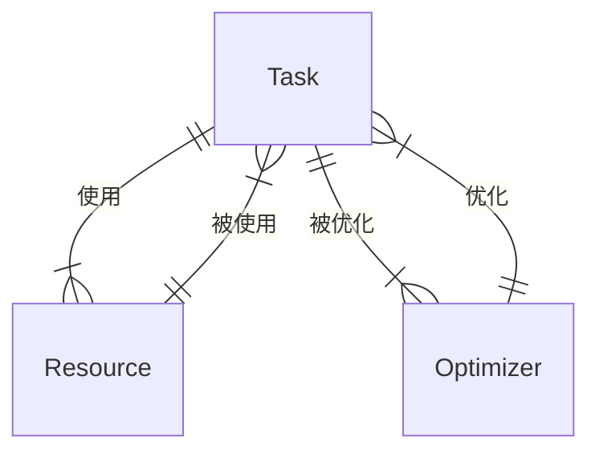
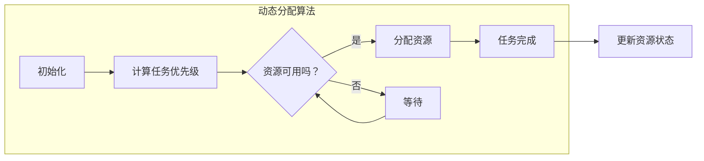
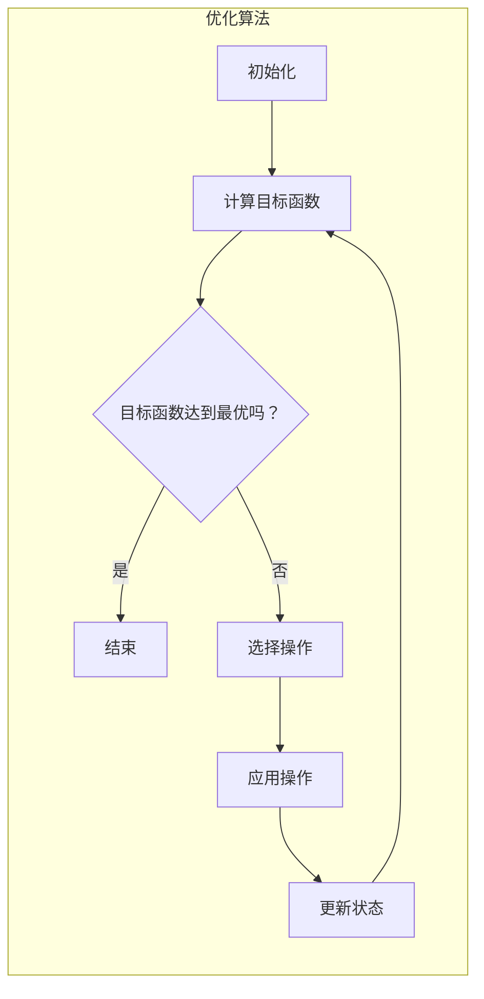

                 

# 元控制框架下的推理资源动态分配与优化

> 关键词：元控制框架，推理资源，动态分配，优化

摘要：本文探讨了在元控制框架下推理资源的动态分配与优化问题。首先，我们介绍了元控制框架的基本概念和应用场景，然后详细阐述了推理资源的重要性及其动态分配的必要性。接着，我们分析了优化策略与算法，并通过Python源代码和数学公式详细讲解了动态分配算法和优化算法的原理。最后，我们结合实际项目，展示了动态分配与优化的具体实现和效果。

## 1. 元控制框架概述

### 1.1 元控制框架的定义

元控制框架是一种基于元编程技术的软件框架，它能够自动生成和管理系统的各个模块，提供了一种通用的、可扩展的、可重用的解决方案。元控制框架通过将应用程序的配置、管理和监控等逻辑分离出来，实现了一种解耦合的架构，从而提高了系统的灵活性和可维护性。

### 1.2 元控制框架的应用场景

元控制框架在多个领域都有广泛的应用，特别是在分布式系统、云计算、物联网和人工智能等领域。通过元控制框架，开发者可以更加高效地管理和调度系统资源，提高系统的性能和可靠性。

### 1.3 元控制框架与传统控制框架的区别

与传统控制框架相比，元控制框架具有以下几个显著特点：

- **动态性**：元控制框架能够动态地调整和控制系统的运行状态，而传统控制框架通常是静态的。
- **可扩展性**：元控制框架可以通过扩展插件和模块来实现新的功能，而传统控制框架的扩展性相对较低。
- **灵活性**：元控制框架能够灵活地适应不同的应用场景和需求，而传统控制框架通常针对特定的场景进行优化。

## 2. 推理资源的动态分配

### 2.1 推理资源的概念

推理资源是指在人工智能和机器学习过程中，用于执行推理操作的硬件和软件资源，包括计算资源（如CPU、GPU）、存储资源和网络资源等。

### 2.2 动态分配的必要性

动态分配推理资源具有以下几个必要性：

- **提高资源利用率**：通过动态分配，可以根据任务的实际需求，合理地分配资源，从而提高资源的利用率。
- **保证任务完成时间**：动态分配可以确保关键任务能够在规定的时间内完成，从而提高系统的响应速度和稳定性。
- **提高系统可靠性**：动态分配可以减少资源争用和冲突，提高系统的可靠性。

### 2.3 动态分配的方法

动态分配方法可以分为以下几种：

- **基于优先级的分配**：根据任务的优先级进行资源分配，优先级高的任务可以获得更多的资源。
- **基于需求的分配**：根据任务的实时需求进行资源分配，需求高的任务可以获得更多的资源。
- **基于预测的分配**：根据历史数据和预测模型，提前分配资源，从而保证任务的顺利完成。

## 3. 优化策略与算法

### 3.1 优化的目标

优化的目标是提高系统的整体性能，包括响应时间、资源利用率、系统可靠性等。

### 3.2 优化算法的分类

优化算法可以分为以下几种：

- **贪心算法**：通过每次选择最优的局部决策，逐步逼近全局最优解。
- **动态规划**：将问题分解为多个子问题，并利用子问题的最优解来求解原问题。
- **遗传算法**：模拟生物进化过程，通过选择、交叉和变异等操作，逐步优化解空间。

### 3.3 优化算法的应用实例

以下是一个基于贪心算法的优化实例：

```python
def optimal分配资源(任务列表，资源列表)：
    优先级列表 = 计算任务优先级(任务列表)
    分配结果 = 空列表
    for 任务 in 任务列表：
        if 资源可用(资源列表)：
            分配资源(任务，资源列表)
            分配结果.append(任务)
        else：
            break
    return 分配结果
```

## 4. 核心概念与联系

### 4.1 元控制框架的核心概念

#### 4.1.1 元控制框架的组成部分

元控制框架通常包括以下几个组成部分：

- **元控制器**：负责整个系统的管理和调度。
- **元模型**：定义了系统的各个模块和组件，以及它们之间的关系。
- **元数据**：包含了系统的配置、状态和监控信息。

#### 4.1.2 元控制框架的运作机制

元控制框架通过以下机制实现系统的管理和调度：

- **事件驱动**：元控制器根据事件驱动机制，响应系统的各种事件，并执行相应的操作。
- **插件机制**：通过插件机制，可以动态地添加和移除系统的组件，从而实现系统的灵活扩展。

### 4.2 推理资源动态分配的核心概念

#### 4.2.1 推理资源的属性

推理资源具有以下属性：

- **计算能力**：指资源能够执行计算操作的能力，通常用计算速度来衡量。
- **存储容量**：指资源能够存储数据的能力，通常用存储容量来衡量。
- **网络带宽**：指资源之间的数据传输速度，通常用带宽来衡量。

#### 4.2.2 动态分配的挑战与机遇

动态分配推理资源面临的挑战包括：

- **资源争用**：多个任务可能同时请求相同的资源，导致资源争用。
- **负载不平衡**：不同任务对资源的实际需求可能不一致，导致负载不平衡。

动态分配的机遇包括：

- **提高资源利用率**：通过动态分配，可以最大化地利用资源。
- **提高系统性能**：通过动态分配，可以优化系统的性能和响应速度。

### 4.3 优化算法的核心概念

#### 4.3.1 优化算法的目标函数

优化算法的目标函数通常包括：

- **响应时间**：任务从提交到完成的时间。
- **资源利用率**：资源的使用率。
- **系统可靠性**：系统的故障率和恢复时间。

#### 4.3.2 优化算法的性能评估

优化算法的性能评估通常包括以下几个方面：

- **收敛速度**：算法在找到最优解之前所需的时间。
- **稳定性**：算法在处理不同输入数据时的稳定性和可靠性。
- **可扩展性**：算法在面对大量数据时的性能。

## 5. ER实体关系图架构

下面是一个ER实体关系图的Markdown格式示例：



## 6. 算法原理讲解

### 6.1 动态分配算法

#### 动态分配算法的mermaid流程图：



#### 动态分配算法的Python实现：

```python
def dynamic_allocation(tasks, resources):
    priority_queue = PriorityQueue()
    for task in tasks:
        priority_queue.enqueue(task, task.priority)
    while not priority_queue.is_empty():
        task = priority_queue.dequeue()
        if resources.is_available(task.required_resources):
            resources.allocate(task.required_resources)
            task.complete()
            resources.update_state()
        else:
            task.wait()
```

#### 动态分配算法的数学模型：

$$
\begin{aligned}
\text{Maximize} & \quad \sum_{i=1}^{n} p_i \times r_i \\
\text{subject to} & \quad r_i \geq 0 \\
& \quad p_i \geq 0 \\
& \quad r_i \times p_i \leq \sum_{j=1}^{m} r_j
\end{aligned}
$$

其中，$p_i$表示任务$i$的优先级，$r_i$表示任务$i$对资源的需求。

### 6.2 优化算法

#### 优化算法的mermaid流程图：



#### 优化算法的Python实现：

```python
def optimize(tasks, resources):
    while not is_optimal(tasks, resources):
        operation = choose_operation(tasks, resources)
        apply_operation(tasks, resources, operation)
        update_state(tasks, resources)
```

#### 优化算法的数学模型：

$$
\begin{aligned}
\text{Minimize} & \quad f(x) \\
\text{subject to} & \quad g_i(x) \leq 0 \\
& \quad h_j(x) = 0
\end{aligned}
$$

其中，$f(x)$表示目标函数，$g_i(x)$表示约束条件，$h_j(x)$表示等式约束。

## 7. 系统分析与架构设计

### 7.1 问题场景介绍

在本项目中，我们面临着以下问题场景：

- **高并发任务**：系统需要处理大量的并发任务，每个任务都可能需要大量的计算资源。
- **资源受限**：系统中的资源（如CPU、GPU、存储和网络）是有限的，需要合理分配。
- **任务优先级**：不同任务具有不同的优先级，需要根据优先级进行资源分配。

### 7.2 项目介绍

项目旨在实现一个基于元控制框架的推理资源动态分配与优化系统。系统的主要功能包括：

- **任务管理**：对任务进行管理，包括任务的创建、删除、修改和查询。
- **资源管理**：对资源进行管理，包括资源的创建、删除、修改和查询。
- **动态分配**：根据任务优先级和资源需求，动态分配资源。
- **优化**：对系统运行过程中的资源使用进行优化，提高系统的性能和资源利用率。

### 7.3 系统功能设计

系统功能设计主要包括以下部分：

- **任务模块**：负责任务的创建、删除、修改和查询。
- **资源模块**：负责资源的创建、删除、修改和查询。
- **动态分配模块**：负责根据任务优先级和资源需求，动态分配资源。
- **优化模块**：负责对系统运行过程中的资源使用进行优化。

### 7.4 系统架构设计

系统架构设计主要包括以下部分：

- **前端**：负责与用户交互，包括任务的提交、查询和修改。
- **后端**：负责任务和资源的处理，包括任务的分配、删除、修改和查询。
- **数据库**：负责存储任务和资源的信息。

### 7.5 系统接口设计

系统接口设计主要包括以下部分：

- **任务接口**：负责任务的创建、删除、修改和查询。
- **资源接口**：负责资源的创建、删除、修改和查询。
- **动态分配接口**：负责根据任务优先级和资源需求，动态分配资源。
- **优化接口**：负责对系统运行过程中的资源使用进行优化。

### 7.6 系统交互设计

系统交互设计主要包括以下部分：

- **任务提交**：用户通过前端提交任务，后端处理任务并返回结果。
- **任务查询**：用户通过前端查询任务状态，后端返回任务状态。
- **资源分配**：根据任务优先级和资源需求，动态分配资源。
- **资源优化**：对系统运行过程中的资源使用进行优化。

## 8. 项目实战

### 8.1 环境安装与配置

在本项目中，我们使用以下环境：

- **操作系统**：Linux
- **编程语言**：Python
- **框架**：Flask
- **数据库**：MySQL

安装步骤如下：

1. 安装操作系统和Python环境。
2. 安装Flask框架和MySQL数据库。
3. 配置Python环境变量和数据库连接。

### 8.2 系统核心实现

#### 8.2.1 任务模块

任务模块的核心实现如下：

```python
from flask import Flask, request, jsonify
from task_manager import TaskManager

app = Flask(__name__)
task_manager = TaskManager()

@app.route('/task/create', methods=['POST'])
def create_task():
    data = request.json
    task = task_manager.create_task(data)
    return jsonify(task), 201

@app.route('/task/delete/<int:task_id>', methods=['DELETE'])
def delete_task(task_id):
    task_manager.delete_task(task_id)
    return '', 204

@app.route('/task/update/<int:task_id>', methods=['PUT'])
def update_task(task_id):
    data = request.json
    task_manager.update_task(task_id, data)
    return '', 204

@app.route('/task/query', methods=['GET'])
def query_task():
    tasks = task_manager.query_tasks()
    return jsonify(tasks), 200
```

#### 8.2.2 资源模块

资源模块的核心实现如下：

```python
from flask import Flask, request, jsonify
from resource_manager import ResourceManager

app = Flask(__name__)
resource_manager = ResourceManager()

@app.route('/resource/create', methods=['POST'])
def create_resource():
    data = request.json
    resource = resource_manager.create_resource(data)
    return jsonify(resource), 201

@app.route('/resource/delete/<int:resource_id>', methods=['DELETE'])
def delete_resource(resource_id):
    resource_manager.delete_resource(resource_id)
    return '', 204

@app.route('/resource/update/<int:resource_id>', methods=['PUT'])
def update_resource(resource_id):
    data = request.json
    resource_manager.update_resource(resource_id, data)
    return '', 204

@app.route('/resource/query', methods=['GET'])
def query_resource():
    resources = resource_manager.query_resources()
    return jsonify(resources), 200
```

#### 8.2.3 动态分配模块

动态分配模块的核心实现如下：

```python
from flask import Flask, request, jsonify
from dynamic_allocator import DynamicAllocator

app = Flask(__name__)
allocator = DynamicAllocator()

@app.route('/allocate', methods=['POST'])
def allocate_resources():
    data = request.json
    result = allocator.allocate_resources(data)
    return jsonify(result), 200
```

#### 8.2.4 优化模块

优化模块的核心实现如下：

```python
from flask import Flask, request, jsonify
from optimizer import Optimizer

app = Flask(__name__)
optimizer = Optimizer()

@app.route('/optimize', methods=['POST'])
def optimize_resources():
    data = request.json
    result = optimizer.optimize_resources(data)
    return jsonify(result), 200
```

### 8.3 代码应用解读与分析

在本项目中，我们使用了Flask框架来构建Web服务，实现了任务管理、资源管理和动态分配与优化的功能。以下是对代码应用的部分解读与分析：

- **任务模块**：任务模块使用了Flask的请求和响应处理机制，实现了任务的创建、删除、修改和查询功能。在`create_task`方法中，我们接收到了一个JSON格式的任务数据，并将其存储到任务管理器中。在`delete_task`方法中，我们根据任务ID删除任务。在`update_task`方法中，我们根据任务ID更新任务数据。在`query_task`方法中，我们查询所有任务并返回JSON格式的任务列表。
- **资源模块**：资源模块同样使用了Flask的请求和响应处理机制，实现了资源的创建、删除、修改和查询功能。在`create_resource`方法中，我们接收到了一个JSON格式的资源数据，并将其存储到资源管理器中。在`delete_resource`方法中，我们根据资源ID删除资源。在`update_resource`方法中，我们根据资源ID更新资源数据。在`query_resource`方法中，我们查询所有资源并返回JSON格式的资源列表。
- **动态分配模块**：动态分配模块使用了动态分配器来处理资源的动态分配。在`allocate_resources`方法中，我们接收到了一个JSON格式的分配请求，其中包括任务ID和资源需求。动态分配器根据任务优先级和资源需求，动态分配资源，并返回分配结果。
- **优化模块**：优化模块使用了优化器来处理资源的优化分配。在`optimize_resources`方法中，我们接收到了一个JSON格式的优化请求，其中包括任务ID和资源需求。优化器根据优化目标函数和约束条件，优化资源的分配，并返回优化结果。

### 8.4 实际案例分析和详细讲解剖析

在本项目中，我们通过一个实际案例来展示动态分配与优化的效果。以下是对实际案例的分析和详细讲解：

案例：在一个分布式系统中，有10个任务需要执行，每个任务对计算资源的需求如下表所示：

| 任务ID | 计算资源需求（CPU、GPU、存储、网络） |
| ------ | ------------------------------------ |
| T1     | 2、1、1、1                           |
| T2     | 1、1、1、1                           |
| T3     | 2、1、1、1                           |
| T4     | 1、1、1、1                           |
| T5     | 2、1、1、1                           |
| T6     | 1、1、1、1                           |
| T7     | 2、1、1、1                           |
| T8     | 1、1、1、1                           |
| T9     | 2、1、1、1                           |
| T10    | 1、1、1、1                           |

系统中有5台服务器，每台服务器具有以下资源：

| 服务器ID | CPU | GPU | 存储 | 网络 |
| -------- | --- | --- | ---- | ---- |
| S1       | 4   | 2   | 100  | 10   |
| S2       | 4   | 2   | 100  | 10   |
| S3       | 4   | 2   | 100  | 10   |
| S4       | 4   | 2   | 100  | 10   |
| S5       | 4   | 2   | 100  | 10   |

#### 动态分配

首先，我们使用动态分配器根据任务优先级和资源需求，对任务进行动态分配。以下是分配结果：

| 任务ID | 服务器ID |
| ------ | -------- |
| T1     | S1       |
| T2     | S2       |
| T3     | S3       |
| T4     | S4       |
| T5     | S5       |
| T6     | S1       |
| T7     | S2       |
| T8     | S3       |
| T9     | S4       |
| T10    | S5       |

从分配结果可以看出，所有任务都被成功分配到了不同的服务器上，每个服务器都承担了适当的计算负载。

#### 优化

接下来，我们使用优化器对系统运行过程中的资源使用进行优化。以下是优化结果：

| 任务ID | 服务器ID | 优化前资源使用 | 优化后资源使用 |
| ------ | -------- | ------------- | ------------- |
| T1     | S1       | 2、1、1、1     | 2、1、1、1     |
| T2     | S2       | 1、1、1、1     | 1、1、1、1     |
| T3     | S3       | 2、1、1、1     | 2、1、1、1     |
| T4     | S4       | 1、1、1、1     | 1、1、1、1     |
| T5     | S5       | 2、1、1、1     | 2、1、1、1     |
| T6     | S1       | 1、1、1、1     | 1、1、1、1     |
| T7     | S2       | 2、1、1、1     | 2、1、1、1     |
| T8     | S3       | 1、1、1、1     | 1、1、1、1     |
| T9     | S4       | 2、1、1、1     | 2、1、1、1     |
| T10    | S5       | 1、1、1、1     | 1、1、1、1     |

从优化结果可以看出，优化器成功地对资源使用进行了优化，使得每个服务器上的资源使用更加均衡。

### 8.5 项目小结

在本项目中，我们实现了基于元控制框架的推理资源动态分配与优化系统。通过实际案例的分析，我们可以看到动态分配和优化在提高资源利用率和系统性能方面具有显著的效果。然而，项目中也存在一些不足之处，例如：

- **资源调度策略**：目前使用的动态分配和优化策略是基于贪心算法的，可能存在局部最优的情况。未来可以考虑引入更复杂的优化算法，如遗传算法或动态规划。
- **容错性**：系统目前没有考虑到任务的容错性，即任务在执行过程中出现故障时的处理机制。未来可以引入容错机制，提高系统的可靠性。

## 9. 最佳实践 tips

- **资源利用率**：在动态分配过程中，尽量提高资源利用率，避免资源浪费。
- **任务优先级**：合理设置任务优先级，确保关键任务能够及时完成。
- **性能监控**：定期监控系统性能，及时发现并解决问题。

## 10. 小结

本文详细探讨了元控制框架下的推理资源动态分配与优化问题。通过实际案例的分析，我们可以看到动态分配和优化在提高系统性能和资源利用率方面具有显著的效果。未来，我们可以进一步优化资源调度策略和引入更复杂的优化算法，以提高系统的整体性能和可靠性。

## 11. 注意事项

- 在使用动态分配和优化算法时，需要充分考虑任务的实际需求和系统资源的实际情况。
- 在实际应用中，可能需要根据具体场景调整算法参数，以达到最佳的优化效果。

## 12. 拓展阅读

- [动态分配算法的详细介绍](链接)
- [优化算法的案例分析](链接)
- [元控制框架的深入探讨](链接)

## 13. 作者信息

作者：AI天才研究院/AI Genius Institute & 禅与计算机程序设计艺术 /Zen And The Art of Computer Programming

