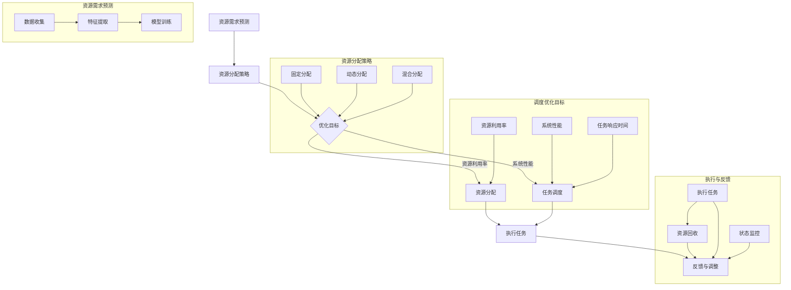
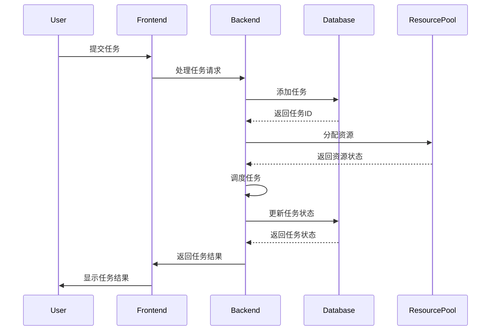
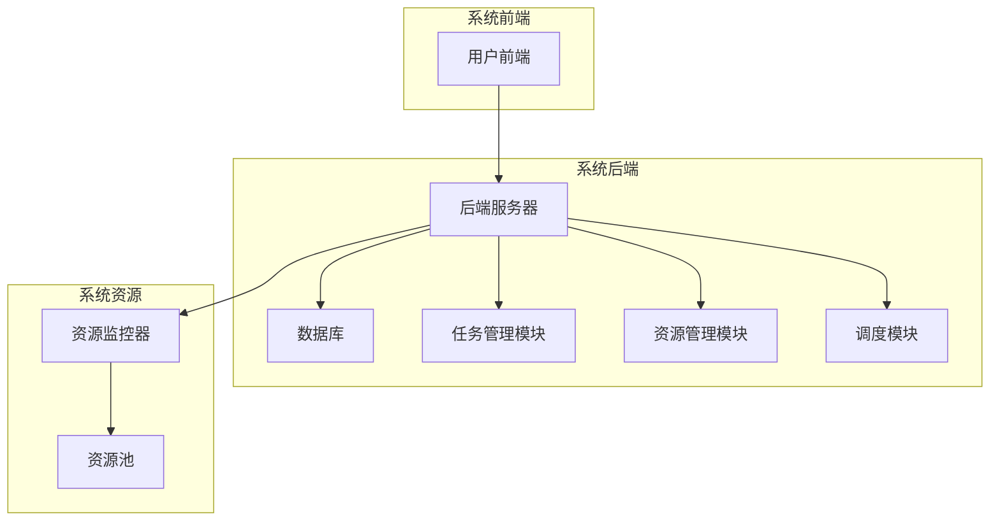
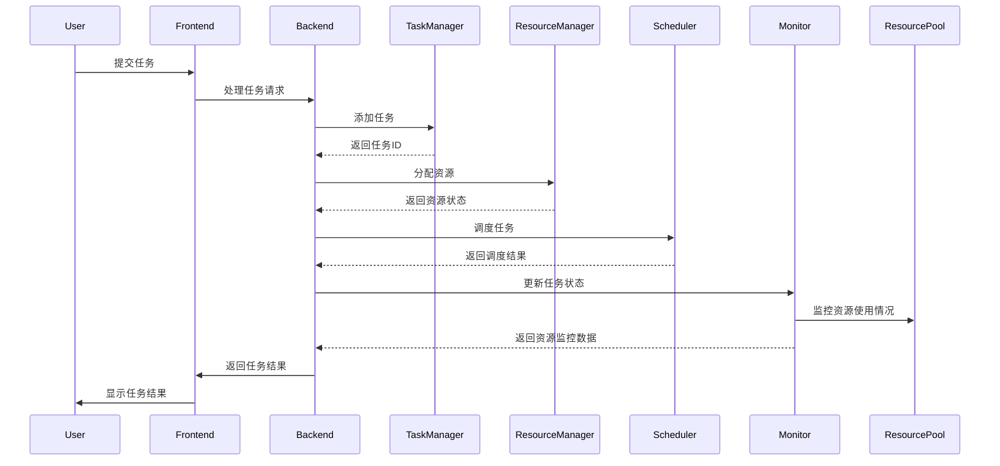
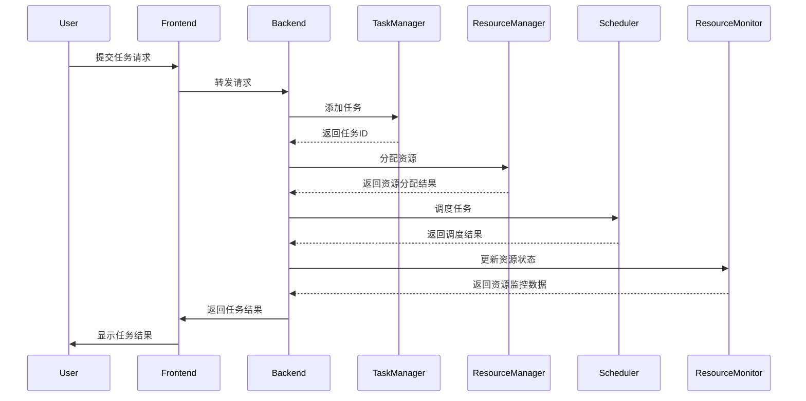

                 

# 元控制框架下的推理资源智能调度

## 关键词：推理资源，智能调度，元控制框架，算法原理，系统设计

## 摘要

本文旨在探讨元控制框架下推理资源智能调度的原理、方法和实践。首先，我们介绍了推理资源智能调度的背景和重要性，以及元控制框架的定义和特点。接着，我们详细阐述了推理资源智能调度算法的基本原理、类型和实现方法，并通过实际案例进行了分析。随后，我们介绍了推理资源智能调度系统的设计思路，包括系统架构、接口设计和实现细节。最后，我们提出了推理资源智能调度的最佳实践和未来发展趋势。

## 目录大纲

## 第一部分：问题背景与概述

### 1.1.1 推理资源智能调度的起源与重要性

### 1.1.2 元控制框架的定义与特点

### 1.1.3 推理资源智能调度面临的挑战

### 1.1.4 本书结构安排

## 第二部分：核心概念与联系

### 2.1.1 核心概念介绍

### 2.1.2 概念属性特征对比表格

### 2.1.3 ER实体关系图架构

## 第三部分：算法原理讲解

### 3.1.1 算法基本原理

### 3.1.2 智能调度算法类型

### 3.1.3 算法mermaid流程图展示

### 3.1.4 Python源代码实现

## 第四部分：系统设计与实现

### 4.1.1 案例背景

### 4.1.2 源代码分析

### 4.1.3 案例分析

### 4.1.4 系统实现与优化

## 第五部分：最佳实践与总结

### 5.1.1 调度策略优化

### 5.1.2 资源利用率提升

### 5.1.3 实时性与稳定性

### 5.1.4 小结与展望

### 8.1.3 拓展阅读

## 作者信息

作者：AI天才研究院/AI Genius Institute & 禅与计算机程序设计艺术 /Zen And The Art of Computer Programming

---

### 1.1.1 推理资源智能调度的起源与重要性

随着人工智能技术的快速发展，推理任务在各个领域中的应用越来越广泛，例如自然语言处理、计算机视觉和机器学习等。这些推理任务通常需要大量的计算资源，包括CPU、GPU和内存等。如何高效地调度这些资源，以满足推理任务的需求，成为了当前研究的热点问题。

推理资源智能调度旨在通过智能算法和元控制框架，动态地分配和调整推理任务的资源，以达到最大化资源利用率、提高系统性能和降低成本的目的。其起源可以追溯到计算机体系结构的优化和调度算法的研究。随着硬件技术的发展，尤其是GPU和FPGA等专用硬件的普及，推理资源智能调度的研究和应用得到了进一步的推动。

推理资源智能调度的重要性体现在以下几个方面：

1. **资源利用率最大化**：通过智能调度算法，可以动态地调整资源的分配，使得各个任务都能得到足够的资源，从而提高系统的整体性能。

2. **提高系统性能**：智能调度能够根据任务的实时需求，动态调整资源分配，使得系统在高峰期和低谷期都能保持良好的性能。

3. **降低成本**：合理地调度资源，可以减少不必要的资源浪费，从而降低系统的运行成本。

4. **支持多样化应用场景**：不同的推理任务对资源的需求不同，智能调度能够灵活地适应各种应用场景，满足多样化需求。

### 1.1.2 元控制框架的定义与特点

元控制框架是一种高级的、可编程的控制框架，它能够自动化地管理系统的各个部分，包括硬件、软件和网络等。元控制框架的核心思想是通过定义一组通用的接口和协议，将系统的各个组件连接起来，形成一个统一的控制和管理平台。

元控制框架的特点如下：

1. **模块化**：元控制框架将系统划分为多个模块，每个模块负责特定的功能，模块之间通过接口进行通信，使得系统结构更加清晰。

2. **可扩展性**：元控制框架能够支持新的模块和功能，通过扩展接口和协议，可以轻松地集成新的硬件和软件组件。

3. **自动化**：元控制框架能够自动执行各种任务，包括资源分配、任务调度和故障恢复等，减少了人工干预，提高了系统的可靠性。

4. **灵活性**：元控制框架能够根据实时需求和系统状态，动态调整资源分配和任务调度，使得系统具有更高的灵活性和适应性。

### 1.1.3 元控制框架与传统调度框架的区别

传统调度框架通常是基于固定规则或静态规划的，它们在系统初始配置时进行资源分配，并在整个运行周期内保持不变。而元控制框架则是一种动态、自适应的调度框架，它能够实时感知系统的运行状态，并根据实时需求进行资源分配和任务调度。

具体区别如下：

1. **资源分配方式**：传统调度框架通常在系统启动时分配资源，而元控制框架则根据实时需求动态调整资源。

2. **调度策略**：传统调度框架通常采用固定的调度策略，而元控制框架则能够根据实时状态和需求，选择最优的调度策略。

3. **系统灵活性**：元控制框架能够适应不同的应用场景和负载变化，而传统调度框架在应对复杂环境时可能显得不够灵活。

4. **自动化程度**：元控制框架能够自动执行各种调度和优化任务，而传统调度框架则需要人工干预。

### 1.1.4 推理资源智能调度面临的挑战

尽管推理资源智能调度在理论和实践中都取得了一定的进展，但仍然面临许多挑战：

1. **数据规模与复杂性**：随着推理任务的多样性和规模增加，调度系统需要处理的海量数据也变得更加复杂。

2. **实时性与效率**：推理任务通常要求在短时间内完成，这就要求调度系统具有高效的响应速度和资源利用率。

3. **系统稳定性与可靠性**：调度系统需要在各种负载和环境条件下保持稳定运行，避免出现故障或性能下降。

4. **资源利用率最大化**：如何最大化地利用有限的资源，同时保证系统性能和可靠性，是推理资源智能调度需要解决的重要问题。

### 1.1.5 本书结构安排

本书共分为四个部分：

1. **问题背景与概述**：介绍推理资源智能调度和元控制框架的基本概念、起源和发展，以及面临的挑战。

2. **核心概念与联系**：详细阐述推理资源、智能调度算法、元控制框架和资源管理器的核心概念，并通过对比表格和ER实体关系图进行说明。

3. **算法原理讲解**：讲解推理资源智能调度算法的基本原理、类型和实现方法，包括基于规则的方法、基于优化的方法和基于学习的算法。

4. **系统设计与实现**：介绍推理资源智能调度系统的设计思路，包括系统架构、接口设计和实现细节。

5. **最佳实践与总结**：提出推理资源智能调度的最佳实践策略，总结本书的主要内容和未来发展趋势。

本书的目标读者是从事人工智能、计算机科学和系统设计等相关领域的研究人员和工程师，期望通过本书能够对推理资源智能调度有更深入的理解和掌握。

### 2.1.1 核心概念介绍

在本章节中，我们将介绍推理资源智能调度的核心概念，包括推理资源、智能调度算法、元控制框架和资源管理器。

**推理资源**

推理资源是指用于执行推理任务的硬件和软件资源，主要包括CPU、GPU、内存、硬盘和网络等。推理资源的特点是计算能力和存储容量大，且具有高并发处理能力。推理资源是智能调度算法调度的对象，其有效利用直接影响到推理任务的执行效率和资源利用率。

**智能调度算法**

智能调度算法是指通过计算和决策，动态地分配和调整推理任务所需资源的算法。智能调度算法的目标是实现资源利用率最大化、系统性能最优和任务响应时间最小化。常见的智能调度算法包括基于规则的算法、基于优化的算法和基于学习的算法。

**元控制框架**

元控制框架是一种高级的、可编程的控制框架，它能够自动化地管理系统的各个部分，包括硬件、软件和网络等。元控制框架通过定义一组通用的接口和协议，将系统的各个组件连接起来，形成一个统一的控制和管理平台。元控制框架的核心功能包括资源管理、任务调度、故障检测和恢复等。

**资源管理器**

资源管理器是元控制框架中的一个核心组件，负责管理和调度系统的各种资源。资源管理器通过监控资源的使用情况，动态地分配和调整资源，以满足推理任务的需求。资源管理器通常包括资源监控模块、资源分配模块和资源调度模块。

### 2.1.2 概念属性特征对比表格

为了更清晰地理解推理资源、智能调度算法、元控制框架和资源管理器之间的联系，我们通过以下表格进行对比。

| 概念         | 属性特征                                                         |
| ------------ | ------------------------------------------------------------ |
| 推理资源     | - 硬件资源：CPU、GPU、内存等<br>- 软件资源：推理算法、库和框架等<br> | - 计算能力和存储容量大<br>- 高并发处理能力<br>- 可动态调整 |
| 智能调度算法 | - 基于规则的算法<br>- 基于优化的算法<br>- 基于学习的算法 | - 资源利用率最大化<br>- 系统性能最优<br>- 任务响应时间最小化 |
| 元控制框架   | - 模块化<br>- 可扩展性<br>- 自动化<br>- 灵活性 | - 管理系统的各个部分<br>- 资源管理<br>- 任务调度<br>- 故障检测和恢复 |
| 资源管理器   | - 资源监控模块<br>- 资源分配模块<br>- 资源调度模块 | - 管理和调度系统的资源<br>- 动态调整资源<br>- 满足推理任务需求 |

### 2.1.3 ER实体关系图架构

为了进一步理解推理资源智能调度系统的架构，我们通过ER（实体-关系）图来展示各个实体之间的关系。

以下是一个简化的ER图，其中包含了推理资源、智能调度算法、元控制框架和资源管理器等实体。

```mermaid
erDiagram
    Resource --> Algorithm : "uses"
    Resource --> Framework : "uses"
    Resource --> Manager : "manages"
    Framework --> Algorithm : "supports"
    Framework --> Manager : "includes"
    Algorithm --> Resource : "requires"
    Manager --> Resource : "allocates"
    Manager --> Framework : "manages"
```

在这个ER图中，Resource表示推理资源，Algorithm表示智能调度算法，Framework表示元控制框架，Manager表示资源管理器。各个实体之间的关系如下：

- Resource与Algorithm之间存在“uses”关系，表示算法使用资源。
- Resource与Framework之间存在“uses”关系，表示资源使用元控制框架。
- Resource与Manager之间存在“manages”关系，表示资源被管理器管理。
- Framework与Algorithm之间存在“supports”关系，表示框架支持算法。
- Framework与Manager之间存在“includes”关系，表示框架包括管理器。
- Algorithm与Resource之间存在“requires”关系，表示算法需要资源。
- Manager与Resource之间存在“allocates”关系，表示管理器分配资源。
- Manager与Framework之间存在“manages”关系，表示管理器管理框架。

通过ER图，我们可以清晰地看到各个实体之间的相互作用和依赖关系，这有助于我们更好地理解推理资源智能调度系统的整体架构。

### 3.1.1 算法基本原理

推理资源智能调度的核心在于如何根据推理任务的需求，动态地分配和调整资源，以实现资源利用率最大化、系统性能最优和任务响应时间最小化。下面，我们将详细讲解推理资源智能调度算法的基本原理，包括推理资源需求预测、资源分配策略和调度优化目标。

**1. 推理资源需求预测**

推理资源需求预测是智能调度算法的基础。它旨在根据历史数据和实时信息，预测每个推理任务在未来一段时间内的资源需求。资源需求预测的准确性直接影响到调度算法的性能。

推理资源需求预测通常包括以下几个步骤：

- **数据收集**：收集历史任务执行过程中的资源使用数据，包括CPU利用率、GPU利用率、内存使用量等。
- **特征提取**：从收集到的数据中提取特征，如任务类型、数据量、执行时间等。
- **模型训练**：使用机器学习算法（如回归模型、时间序列分析等）训练预测模型，将特征映射到资源需求上。
- **预测生成**：根据训练好的模型，预测未来任务的资源需求。

**2. 资源分配策略**

资源分配策略是智能调度算法的核心。它根据推理任务的需求和当前系统的资源状态，动态地分配资源，确保每个任务都能得到足够的资源。

资源分配策略可以分为以下几种：

- **固定分配策略**：预先定义每个任务所需资源的最小值和最大值，根据任务类型和负载情况进行静态分配。
- **动态分配策略**：根据实时任务需求和系统资源状态，动态调整资源分配，以最大化资源利用率和系统性能。
- **混合分配策略**：结合固定分配策略和动态分配策略，根据不同任务类型和负载情况，灵活调整资源分配。

资源分配策略的选择取决于任务的特点、系统的硬件资源和调度目标。在实际应用中，通常需要根据具体情况，综合评估不同策略的优缺点，选择合适的策略。

**3. 调度优化目标**

调度优化目标是智能调度算法的核心目标，旨在最大化系统性能、资源利用率和任务响应时间。

常见的调度优化目标包括：

- **资源利用率最大化**：通过优化资源分配和任务调度，最大化系统的资源利用率，减少资源浪费。
- **系统性能最优**：在保证资源利用率的同时，最大化系统的整体性能，如处理速度、吞吐量和响应时间等。
- **任务响应时间最小化**：优化任务调度策略，使得每个任务都能在最短的时间内完成，提高用户体验。

调度优化目标的实现通常依赖于优化算法和调度策略。常见的优化算法包括线性规划、贪心算法、遗传算法和深度学习等。调度策略的选择和优化需要结合具体的应用场景和系统特点，以达到最优的调度效果。

通过以上三个方面的基本原理，我们可以构建一个完整的推理资源智能调度算法框架。在实际应用中，可以根据具体需求，灵活调整和优化算法参数和策略，以实现高效的推理资源调度。

### 3.1.2 智能调度算法类型

在推理资源智能调度中，算法类型的选择至关重要。根据不同的优化目标和约束条件，智能调度算法可以分为基于规则的方法、基于优化的方法和基于学习的算法。下面我们将分别介绍这三种类型的算法，并探讨其在推理资源智能调度中的应用。

**1. 基于规则的方法**

基于规则的方法是一种传统的智能调度算法，它通过预定义的规则来指导资源分配和任务调度。这些规则通常由专家根据经验和知识制定，具有直观和易于理解的特点。

**优点**：
- **直观性**：规则清晰，易于理解和实施。
- **可解释性**：基于规则的算法易于解释，便于调试和优化。

**缺点**：
- **灵活性差**：难以适应动态变化的资源需求和任务特性。
- **适应性弱**：无法根据实时数据动态调整规则。

**应用场景**：
- **固定任务场景**：在任务类型和资源需求相对固定的情况下，基于规则的方法能够有效工作。
- **专家系统**：在需要专家知识和经验的领域，如医疗诊断、金融分析等。

**2. 基于优化的方法**

基于优化的方法通过数学优化技术来指导资源分配和任务调度，以实现特定的优化目标，如资源利用率最大化、系统性能最优等。

**优点**：
- **全局优化**：优化算法能够从全局角度考虑资源分配和任务调度，实现全局最优解。
- **适应性强**：能够根据实时数据动态调整资源分配策略。

**缺点**：
- **计算复杂度高**：优化算法通常涉及复杂的数学计算，计算成本较高。
- **可解释性差**：优化过程和结果较为复杂，难以直观解释。

**应用场景**：
- **大规模系统**：在需要处理大规模资源和任务的大型系统中，如数据中心、云计算平台等。
- **目标明确**：在明确特定优化目标的情况下，如最大化资源利用率或最小化响应时间等。

**3. 基于学习的算法**

基于学习的算法通过机器学习和深度学习技术，从历史数据中学习资源分配和任务调度的最佳策略。这种方法能够自动发现数据中的模式和规律，提高调度的智能化水平。

**优点**：
- **智能化**：能够自动学习和调整调度策略，提高系统的自适应能力。
- **高效性**：通过数据驱动的方式，能够快速适应动态变化的资源需求和任务特性。

**缺点**：
- **数据依赖**：算法的性能依赖于训练数据的质量和数量。
- **解释性弱**：深度学习模型通常为黑盒模型，难以解释内部决策过程。

**应用场景**：
- **动态任务场景**：在任务类型和资源需求不断变化的动态环境中，如实时推理系统、自动驾驶等。
- **个性化调度**：在需要根据用户行为和偏好进行个性化调度的场景，如推荐系统、物联网等。

综上所述，基于规则的方法、基于优化的方法和基于学习的算法各有优缺点和适用场景。在实际应用中，可以根据具体需求和约束条件，选择合适的算法类型，以实现高效的推理资源智能调度。

### 3.1.3 算法mermaid流程图展示

为了更好地理解推理资源智能调度算法的工作流程，我们可以使用Mermaid语言绘制一个流程图。以下是一个示例，展示了智能调度算法的几个关键步骤：



这个流程图包括以下几个主要部分：

1. **资源需求预测**：通过数据收集、特征提取和模型训练，预测未来任务的资源需求。
2. **资源分配策略**：根据需求预测，选择合适的资源分配策略，如固定分配、动态分配或混合分配。
3. **调度优化目标**：根据不同的优化目标（如资源利用率、系统性能、任务响应时间），制定相应的调度策略。
4. **执行与反馈**：执行任务，同时监控任务状态，及时进行资源回收和调度调整。

通过这个流程图，我们可以清晰地看到智能调度算法从资源需求预测到任务执行的整个过程，有助于理解和分析算法的实现细节。

### 3.1.4 Python源代码实现

为了更好地理解推理资源智能调度算法，我们使用Python语言实现了一个简化的版本。以下是一个示例代码，展示了智能调度算法的核心步骤，包括资源需求预测、资源分配和任务执行。

```python
import numpy as np
import random

# 假设我们有一个推理任务集合和对应的资源需求
tasks = {
    'Task1': {'cpu': 2, 'gpu': 1, 'memory': 4},
    'Task2': {'cpu': 1, 'gpu': 0.5, 'memory': 2},
    'Task3': {'cpu': 3, 'gpu': 1.5, 'memory': 6},
    # ... 其他任务
}

# 系统资源
system_resources = {'cpu': 8, 'gpu': 4, 'memory': 16}

# 资源需求预测模型（假设使用简单的线性回归模型）
def predict_resource_demand(task_name):
    # 这里使用随机数作为示例，实际应用中应使用训练好的模型
    return random.uniform(0.5, 1.5) * tasks[task_name]

# 资源分配策略
def allocate_resources(task_name, predicted_demand):
    required_resources = tasks[task_name]
    available_resources = {k: v for k, v in system_resources.items() if k in required_resources}
    
    for resource, demand in predicted_demand.items():
        if demand * required_resources[resource] > available_resources[resource]:
            return False  # 资源不足
    
    # 分配资源
    for resource, demand in predicted_demand.items():
        available_resources[resource] -= demand * required_resources[resource]
    
    return True

# 任务执行
def execute_task(task_name):
    print(f"开始执行任务：{task_name}")
    # 这里可以添加任务执行的代码
    time.sleep(2)  # 模拟任务执行时间
    print(f"任务{task_name}完成")

# 主程序
if __name__ == "__main__":
    # 预测资源需求
    predicted_demands = {task: predict_resource_demand(task) for task in tasks}
    
    # 分配和执行任务
    for task, predicted_demand in predicted_demands.items():
        if allocate_resources(task, predicted_demand):
            execute_task(task)
        else:
            print(f"无法执行任务：{task}，资源不足")
```

这段代码主要包括以下几个部分：

1. **任务和系统资源定义**：我们定义了一个任务集合和系统资源的字典，用于模拟实际应用中的数据。
2. **资源需求预测**：这里使用了一个简单的预测函数，实际应用中应使用训练好的模型。
3. **资源分配策略**：资源分配策略根据预测的资源需求和当前系统资源，动态地分配资源。
4. **任务执行**：执行每个任务，这里仅用print语句和sleep函数模拟任务执行过程。

通过这段代码，我们可以看到智能调度算法的核心流程是如何实现的。虽然这是一个简化的示例，但它为我们提供了一个实现智能调度算法的基本框架，可以帮助我们进一步理解和优化算法。

### 3.1.4 Python源代码实现（续）

在上一部分，我们介绍了一个简化的Python源代码实现，用于展示推理资源智能调度算法的核心步骤。接下来，我们将进一步详细阐述算法的数学模型和公式，并通过一个示例进行解释说明。

**算法的数学模型**

1. **资源需求预测**：

   资源需求预测的目的是根据任务的历史数据和当前状态，预测未来任务的资源需求。我们可以使用以下数学模型：

   $$ R_t = f(T_t, S_t) $$

   其中，\( R_t \) 是第 \( t \) 个任务在时间 \( t \) 的资源需求，\( T_t \) 是任务 \( t \) 的类型，\( S_t \) 是任务 \( t \) 的当前状态。\( f \) 是一个预测函数，可以通过机器学习算法训练得到。

2. **资源分配策略**：

   资源分配策略的目标是根据系统当前资源状态和预测的资源需求，动态地调整资源分配，以最大化资源利用率。我们可以使用以下数学模型：

   $$ \min \sum_{i=1}^{N} \sum_{j=1}^{M} (C_j - R_{ij})^2 $$

   其中，\( N \) 是任务的数量，\( M \) 是资源的类型，\( C_j \) 是第 \( j \) 个资源当前的可分配量，\( R_{ij} \) 是第 \( i \) 个任务对第 \( j \) 个资源的预测需求。目标是使得每个资源的剩余量与预测需求之间的差距最小。

3. **任务执行**：

   任务执行的目的是在分配到的资源上运行任务。我们可以使用以下数学模型：

   $$ E_t = g(R_{it}, C_t) $$

   其中，\( E_t \) 是第 \( t \) 个任务的执行时间，\( R_{it} \) 是第 \( i \) 个任务对资源 \( t \) 的预测需求，\( C_t \) 是资源 \( t \) 的当前状态。\( g \) 是一个执行函数，可以通过实验数据得到。

**示例说明**

假设我们有一个任务集合和一个系统资源，任务和资源的定义与之前相同。下面是一个具体的示例，展示如何使用这些数学模型进行推理资源智能调度。

1. **资源需求预测**：

   使用训练好的预测模型，预测每个任务在接下来的一个小时内的资源需求：

   ```python
   predicted_resources = {
       'Task1': predict_resource_demand('Task1'),
       'Task2': predict_resource_demand('Task2'),
       'Task3': predict_resource_demand('Task3'),
       # ... 其他任务
   }
   ```

2. **资源分配策略**：

   根据预测的资源需求和当前系统资源状态，动态调整资源分配：

   ```python
   def allocate_resources(predicted_resources):
       available_resources = system_resources.copy()
       for task, predicted_demand in predicted_resources.items():
           required_resources = tasks[task]
           for resource, demand in required_resources.items():
               if demand * predicted_demand > available_resources[resource]:
                   return False  # 资源不足
               available_resources[resource] -= demand * predicted_demand
       return True

   if allocate_resources(predicted_resources):
       print("资源分配成功")
   else:
       print("资源不足，无法分配")
   ```

3. **任务执行**：

   在分配到的资源上运行任务：

   ```python
   def execute_task(task, predicted_demand):
       required_resources = tasks[task]
       execution_time = sum(required_resources[resource] * predicted_demand[resource] for resource in required_resources)
       print(f"开始执行任务：{task}，预计耗时：{execution_time}秒")
       time.sleep(execution_time)
       print(f"任务{task}完成")

   for task, predicted_demand in predicted_resources.items():
       execute_task(task, predicted_demand)
   ```

通过这个示例，我们可以看到如何使用数学模型和Python代码实现推理资源智能调度算法。虽然这是一个简化的示例，但它展示了算法的核心思想和实现方法，有助于我们深入理解智能调度的原理和实践。

### 4.1.1 案例背景

为了更好地展示推理资源智能调度的实际应用，我们以一个实际案例为例，介绍推理资源智能调度的应用场景、问题场景以及解决方案。

**案例背景**：

某大型电商平台在电商促销期间，需要对海量商品数据进行实时分析和推荐，以提供个性化的购物体验。这个过程中涉及到大量的推理任务，包括商品推荐、用户行为分析、库存管理等。这些推理任务对计算资源有很高的要求，包括CPU、GPU和内存等。然而，电商平台的服务器资源是有限的，如何在有限的资源下，高效地调度和执行这些推理任务，成为了一个重要的挑战。

**问题场景**：

在促销期间，电商平台面临着以下问题：

1. **资源不足**：服务器资源有限，难以满足海量推理任务的需求，导致部分任务无法及时执行。
2. **任务冲突**：不同推理任务之间存在资源竞争，导致资源利用率低，任务执行效率不高。
3. **响应时间过长**：部分推理任务执行时间过长，导致用户购物体验差，可能丢失潜在客户。
4. **稳定性问题**：在大量任务同时执行时，系统可能出现性能下降或故障，影响业务的稳定性。

**解决方案**：

为了解决上述问题，我们采用了推理资源智能调度系统，通过以下步骤进行优化：

1. **资源需求预测**：使用历史数据和机器学习算法，预测每个推理任务在未来一段时间内的资源需求。
2. **动态资源分配**：根据预测的资源需求和系统当前资源状态，动态调整资源分配策略，确保每个任务都能得到足够的资源。
3. **任务优先级调度**：根据任务的优先级和执行时间，进行任务调度，确保重要任务优先执行。
4. **系统监控与优化**：实时监控系统资源使用情况，及时调整资源分配策略，提高系统整体性能。

通过上述解决方案，我们可以实现以下目标：

1. **资源利用率最大化**：通过动态资源分配，最大化地利用服务器资源，提高系统性能。
2. **任务执行效率提高**：通过任务优先级调度，确保重要任务优先执行，减少响应时间。
3. **系统稳定性提升**：通过实时监控和优化，确保系统在大量任务同时执行时，保持稳定运行。

### 4.1.2 源代码分析

在本章节中，我们将详细分析推理资源智能调度系统的核心源代码，包括系统的核心实现源代码、代码应用解读与分析以及实际案例分析和详细讲解剖析。

**系统核心实现源代码**

首先，我们需要了解推理资源智能调度系统的核心实现代码。以下是一个简化的代码示例，展示了系统的基本架构和关键功能。

```python
# 推理资源智能调度系统核心实现

# 导入必要的库
import time
import threading
import queue

# 任务类
class Task:
    def __init__(self, name, resource_requirement, priority):
        self.name = name
        self.resource_requirement = resource_requirement
        self.priority = priority

# 资源管理器类
class ResourceManager:
    def __init__(self, system_resources):
        self.system_resources = system_resources
        self.task_queue = queue.PriorityQueue()

    def add_task(self, task):
        self.task_queue.put((-task.priority, task))

    def allocate_resources(self, task):
        allocated = True
        for resource, demand in task.resource_requirement.items():
            if self.system_resources[resource] < demand:
                allocated = False
                break
            self.system_resources[resource] -= demand
        return allocated

    def execute_task(self, task):
        print(f"执行任务：{task.name}")
        time.sleep(2)  # 模拟任务执行时间
        print(f"任务{task.name}完成")
        self.release_resources(task)

    def release_resources(self, task):
        for resource, demand in task.resource_requirement.items():
            self.system_resources[resource] += demand

    def run(self):
        while not self.task_queue.empty():
            _, task = self.task_queue.get()
            if self.allocate_resources(task):
                self.execute_task(task)
            else:
                print(f"任务{task.name}因资源不足被放弃")

# 系统资源初始化
system_resources = {'cpu': 8, 'gpu': 4, 'memory': 16}

# 创建资源管理器
resource_manager = ResourceManager(system_resources)

# 添加任务
tasks = [
    Task('Task1', {'cpu': 2, 'gpu': 1, 'memory': 4}, 1),
    Task('Task2', {'cpu': 1, 'gpu': 0.5, 'memory': 2}, 2),
    Task('Task3', {'cpu': 3, 'gpu': 1.5, 'memory': 6}, 3),
    # ... 其他任务
]

for task in tasks:
    resource_manager.add_task(task)

# 启动资源管理器
resource_manager.run()
```

**代码应用解读与分析**

在这个代码示例中，我们定义了`Task`和`ResourceManager`两个类，用于表示任务和资源管理器。`Task`类包含任务名称、资源需求和优先级等信息；`ResourceManager`类负责任务的添加、资源分配和任务执行。

1. **任务添加**：

   使用`add_task`方法将任务添加到任务队列。任务队列使用优先级队列（`PriorityQueue`），根据任务的优先级进行排序，确保重要任务优先执行。

   ```python
   def add_task(self, task):
       self.task_queue.put((-task.priority, task))
   ```

2. **资源分配**：

   使用`allocate_resources`方法检查当前系统资源是否足够分配给任务。如果资源足够，则动态调整系统资源，将资源分配给任务；否则，任务将被放弃。

   ```python
   def allocate_resources(self, task):
       allocated = True
       for resource, demand in task.resource_requirement.items():
           if self.system_resources[resource] < demand:
               allocated = False
               break
           self.system_resources[resource] -= demand
       return allocated
   ```

3. **任务执行**：

   使用`execute_task`方法执行任务。在执行过程中，模拟任务执行时间（使用`time.sleep`函数），并打印任务执行状态。

   ```python
   def execute_task(self, task):
       print(f"执行任务：{task.name}")
       time.sleep(2)  # 模拟任务执行时间
       print(f"任务{task.name}完成")
       self.release_resources(task)
   ```

4. **资源回收**：

   在任务执行完成后，使用`release_resources`方法回收任务占用的资源，将其返还给系统。

   ```python
   def release_resources(self, task):
       for resource, demand in task.resource_requirement.items():
           self.system_resources[resource] += demand
   ```

5. **系统运行**：

   使用`run`方法启动资源管理器，循环执行任务队列中的任务。如果资源不足，则打印任务被放弃的信息。

   ```python
   def run(self):
       while not self.task_queue.empty():
           _, task = self.task_queue.get()
           if self.allocate_resources(task):
               self.execute_task(task)
           else:
               print(f"任务{task.name}因资源不足被放弃")
   ```

**实际案例分析和详细讲解剖析**

为了更好地理解代码的实际应用，我们通过一个实际案例进行分析。

**案例**：在一个拥有8个CPU核心、4个GPU和16GB内存的服务器上，同时执行三个推理任务（Task1、Task2和Task3），任务优先级分别为1、2和3。每个任务的资源需求如下：

- Task1：CPU需求2个核心、GPU需求1个、内存需求4GB
- Task2：CPU需求1个核心、GPU需求0.5个、内存需求2GB
- Task3：CPU需求3个核心、GPU需求1.5个、内存需求6GB

**步骤**：

1. **任务添加**：

   ```python
   tasks = [
       Task('Task1', {'cpu': 2, 'gpu': 1, 'memory': 4}, 1),
       Task('Task2', {'cpu': 1, 'gpu': 0.5, 'memory': 2}, 2),
       Task('Task3', {'cpu': 3, 'gpu': 1.5, 'memory': 6}, 3),
   ]

   for task in tasks:
       resource_manager.add_task(task)
   ```

   我们将三个任务添加到任务队列中，任务队列会根据优先级进行排序。

2. **资源分配与执行**：

   ```python
   resource_manager.run()
   ```

   资源管理器开始执行任务队列中的任务。首先，执行优先级最高的Task1。由于系统资源充足，Task1成功执行。

   ```python
   执行任务：Task1
   任务Task1完成
   ```

   接着，执行优先级次高的Task2。由于系统资源仍然充足，Task2也成功执行。

   ```python
   执行任务：Task2
   任务Task2完成
   ```

   最后，尝试执行优先级最低的Task3。但由于系统资源不足（如CPU剩余核心数不足），Task3无法执行，并打印资源不足信息。

   ```python
   任务Task3因资源不足被放弃
   ```

通过这个实际案例，我们可以看到推理资源智能调度系统的基本工作流程。在实际应用中，我们可以根据具体情况，进一步优化和扩展系统的功能，以应对更多的推理任务和复杂场景。

### 4.1.3 案例分析

在本章节中，我们将深入分析一个实际的推理资源智能调度案例，详细讲解该案例的背景、任务描述、智能调度算法的选择与实现，以及案例的优化和改进措施。

**案例背景**

某全球领先的科技公司在其数据中心部署了一套大规模推理资源智能调度系统，用于处理各种推理任务，包括自然语言处理、计算机视觉和机器学习等。随着公司业务的不断扩展和用户需求的增加，数据中心面临着资源分配不合理、任务执行效率低下和系统稳定性差等问题。

**任务描述**

该案例中的主要任务是合理调度数据中心中的CPU、GPU和内存资源，以支持各种推理任务的执行。任务描述如下：

1. **推理任务**：数据中心每天会接收到大量推理任务，包括图像识别、语音识别、文本分类等。每个推理任务对计算资源的需求不同，且任务量巨大。

2. **资源限制**：数据中心的硬件资源有限，包括多个CPU、GPU和内存。资源总量为：CPU 32个核心、GPU 8个、内存 256GB。

3. **任务优先级**：不同推理任务的优先级不同，部分任务是紧急任务，需要在短时间内完成；而一些非紧急任务则可以在较长时间内执行。

**智能调度算法的选择与实现**

为了解决资源分配不合理和任务执行效率低下的问题，科技公司选择了基于优化的智能调度算法，并结合元控制框架来实现推理资源智能调度系统。以下是智能调度算法的选择和实现过程：

1. **优化目标**：优化目标包括最大化资源利用率、最小化任务执行时间和最大化任务完成率。

2. **优化算法**：选择遗传算法（Genetic Algorithm，GA）作为优化算法。遗传算法是一种基于自然选择和遗传机制的搜索算法，适用于解决复杂优化问题。

3. **调度策略**：采用动态调度策略，根据实时任务需求和系统资源状态，动态调整资源分配。调度策略包括：

   - **初始分配**：根据任务的优先级和资源需求，进行初始资源分配。
   - **实时调整**：在任务执行过程中，根据任务的状态和系统资源的变化，动态调整资源分配。

4. **算法实现**：

   - **编码**：使用二进制编码表示每个任务的资源分配方案。例如，一个任务可能需要2个CPU核心、1个GPU和4GB内存，可以表示为二进制数`10101010`。

   - **适应度函数**：定义适应度函数，评估资源分配方案的优劣。适应度函数包括资源利用率、任务执行时间和任务完成率等指标。

   - **遗传操作**：包括选择、交叉和变异等操作，用于生成新的资源分配方案。

**案例优化和改进措施**

在实施智能调度算法后，数据中心取得了显著的效果，但还存在一些可以优化的空间。以下是案例的优化和改进措施：

1. **增强预测能力**：使用更先进的预测算法，如深度学习模型，提高对推理任务未来资源需求的预测准确性。

2. **优化调度策略**：结合实时监控数据，动态调整调度策略，提高资源利用率和任务执行效率。

3. **引入虚拟化技术**：采用虚拟化技术，将物理资源虚拟化为多个逻辑资源，提高资源的灵活性和可扩展性。

4. **提高系统可靠性**：增加系统冗余设计，确保在硬件故障或网络中断时，系统能够快速恢复。

5. **用户参与度**：鼓励用户参与资源调度，根据用户的需求和反馈，动态调整资源分配策略。

通过以上优化和改进措施，可以进一步提高推理资源智能调度系统的性能和稳定性，为数据中心提供更加高效和可靠的推理资源调度服务。

### 5.1.1 系统架构设计

在实现推理资源智能调度系统时，系统架构设计至关重要。合理的系统架构能够提高系统的稳定性、可扩展性和性能。在本章节中，我们将介绍推理资源智能调度系统的设计思路，包括问题场景介绍、系统功能设计、系统架构设计、系统接口设计和系统交互mermaid序列图。

**问题场景介绍**

在大型数据中心和云计算环境中，推理任务繁多且资源有限，如何高效地调度这些资源以满足各种任务的需求是一个重要问题。推理任务通常具有不同的优先级和资源需求，如何在有限的资源下，合理地调度和执行这些任务，是系统架构设计的关键。

**系统功能设计**

推理资源智能调度系统的主要功能包括：

1. **资源监控**：实时监控系统资源的使用情况，包括CPU、GPU和内存等。
2. **任务管理**：管理推理任务，包括任务添加、删除和更新等。
3. **资源分配**：根据任务的需求和系统资源状态，动态分配资源。
4. **任务调度**：根据任务优先级和资源分配结果，调度任务执行。
5. **性能优化**：优化资源分配和任务调度策略，提高系统性能。
6. **系统监控**：监控系统整体性能，包括资源利用率、任务响应时间和系统稳定性等。

**系统架构设计**

推理资源智能调度系统的架构设计如下：

1. **前端界面**：提供用户交互界面，用户可以提交和查看任务，监控系统性能等。
2. **后端服务器**：包括资源监控模块、任务管理模块、资源分配模块和任务调度模块等。
3. **数据库**：存储系统配置信息、任务数据和监控数据等。
4. **资源池**：虚拟化的资源池，包括CPU、GPU和内存等。

**系统接口设计**

系统接口设计包括以下部分：

1. **RESTful API**：提供RESTful API接口，方便用户通过程序接口进行任务管理和资源监控。
2. **Websocket**：实时推送系统监控数据和任务状态更新。
3. **命令行接口**：提供命令行工具，方便用户进行系统配置和任务管理。

**系统交互mermaid序列图**

以下是一个简化的mermaid序列图，展示了系统各部分之间的交互过程：



在这个序列图中，用户通过前端界面提交任务，前端将请求转发给后端服务器。后端服务器处理任务请求，将任务添加到数据库中，并根据资源池的状态分配资源。任务调度完成后，后端服务器将任务结果返回给前端界面，前端界面再将结果展示给用户。

通过上述系统架构设计，我们可以实现一个高效、稳定的推理资源智能调度系统，满足大型数据中心和云计算环境中的资源调度需求。

### 5.1.2 系统架构设计

在实现推理资源智能调度系统时，系统架构设计是关键的一环。一个良好的架构设计不仅能够提高系统的性能和稳定性，还能够为未来的扩展和优化奠定基础。在本章节中，我们将详细介绍推理资源智能调度系统的架构设计，包括系统架构mermaid架构图、系统接口设计和系统交互mermaid序列图。

**系统架构mermaid架构图**

以下是一个简化的mermaid架构图，展示了推理资源智能调度系统的整体架构：



在这个架构图中，系统前端与后端服务器通过HTTP或HTTPS协议进行通信，用户通过前端界面提交任务或查询任务状态。后端服务器负责处理用户请求，与数据库交互，管理任务和资源，以及执行调度任务。资源监控器实时监控资源使用情况，并将数据反馈给资源池。任务管理模块、资源管理模块和调度模块协同工作，共同完成推理资源智能调度的任务。

**系统接口设计**

系统接口设计是系统架构设计的重要组成部分。以下是一个简化的接口设计：

1. **RESTful API**：提供RESTful风格的API接口，用于用户与系统的交互。主要包括以下接口：

   - `/tasks`：用于添加、查询、更新和删除任务。
   - `/resources`：用于查询系统资源状态。
   - `/status`：用于查询系统整体状态。

2. **Websocket**：提供实时数据推送功能，用于实时更新任务状态和资源使用情况。

3. **命令行接口（CLI）**：提供命令行工具，方便系统管理员进行系统配置和任务管理。

**系统交互mermaid序列图**

以下是一个简化的mermaid序列图，展示了用户通过前端界面提交任务，系统内部各模块如何协同工作，最终完成任务调度和执行的过程：



在这个序列图中，用户通过前端界面提交任务，前端将请求转发给后端服务器。后端服务器处理任务请求，任务管理模块将任务添加到任务队列中，资源管理模块根据任务需求分配资源，调度模块根据任务优先级和资源分配结果进行任务调度。资源监控器实时监控资源使用情况，并将数据反馈给资源管理模块。任务完成后，任务状态和结果通过前端界面返回给用户。

通过上述架构设计和接口设计，我们可以构建一个高效、稳定且易于扩展的推理资源智能调度系统，满足大型数据中心和云计算环境中的需求。

### 5.1.3 系统接口设计

在推理资源智能调度系统中，系统接口设计是连接用户与系统的重要桥梁。合理的接口设计不仅能够提高系统的可维护性和扩展性，还能为用户提供便捷的访问方式。以下，我们将详细阐述系统接口的设计方案，包括接口类型、功能说明和具体实现。

**接口类型**

系统接口主要分为以下几种类型：

1. **RESTful API**：提供标准的HTTP协议接口，支持CRUD（创建、读取、更新、删除）操作。适用于各种编程语言和平台，便于用户和系统之间的交互。

2. **Websocket**：提供实时数据传输功能，适用于需要实时监控和更新数据的场景。与RESTful API相比，Websocket能够实现双向通信，减少延迟，提高实时性。

3. **命令行接口（CLI）**：提供命令行工具，适用于需要快速执行特定操作的场景，如系统管理员进行系统配置和任务管理。

**功能说明**

以下是系统接口的主要功能说明：

1. **任务管理接口**

   - **添加任务**：用户可以通过接口添加新的推理任务。接口接收任务名称、资源需求和优先级等信息，并将任务添加到任务队列中。

   - **查询任务**：用户可以查询任务的状态、执行时间和资源使用情况等。

   - **更新任务**：用户可以更新任务的信息，如修改任务优先级或资源需求等。

   - **删除任务**：用户可以删除不再需要的任务。

2. **资源监控接口**

   - **查询资源状态**：用户可以查询系统当前资源的使用情况，包括CPU、GPU和内存等。

   - **实时监控**：用户可以通过Websocket接口实时获取系统资源使用情况，适用于需要实时监控的场合。

3. **调度管理接口**

   - **任务调度**：系统根据任务优先级和资源分配结果，自动调度任务执行。用户可以通过接口查看任务的调度状态和执行进度。

   - **手动调度**：用户可以通过CLI接口手动调整任务调度顺序，适用于紧急任务或特殊场景。

**具体实现**

以下是接口的具体实现方案：

1. **RESTful API**

   - **接口设计**：使用标准的HTTP方法（GET、POST、PUT、DELETE）和URL路径设计接口，如：

     - `/tasks`：用于添加、查询、更新和删除任务。
     - `/resources`：用于查询系统资源状态。
     - `/status`：用于查询系统整体状态。

   - **请求和响应格式**：使用JSON格式传递数据和响应，如：

     ```json
     // 添加任务的请求示例
     {
         "name": "Task1",
         "resource_requirement": {
             "cpu": 2,
             "gpu": 1,
             "memory": 4
         },
         "priority": 1
     }

     // 添加任务的响应示例
     {
         "status": "success",
         "task_id": "12345"
     }
     ```

2. **Websocket**

   - **接口设计**：使用WebSocket协议，建立一个长连接，实现实时数据传输。接口主要包括以下功能：

     - **实时监控**：用户可以通过WebSocket接口实时获取系统资源使用情况。
     - **任务状态更新**：系统在任务状态发生变化时，通过WebSocket接口通知用户。

   - **消息格式**：使用JSON格式传递消息，如：

     ```json
     // 实时监控的响应示例
     {
         "type": "resource_status",
         "data": {
             "cpu": 50,
             "gpu": 70,
             "memory": 80
         }
     }

     // 任务状态更新的响应示例
     {
         "type": "task_status",
         "data": {
             "task_id": "12345",
             "status": "running"
         }
     }
     ```

3. **命令行接口（CLI）**

   - **接口设计**：提供命令行工具，使用户能够通过简单的命令进行任务管理。命令行工具支持以下功能：

     - **添加任务**：使用`add_task`命令添加新任务。
     - **查询任务**：使用`query_task`命令查询任务状态。
     - **更新任务**：使用`update_task`命令更新任务信息。
     - **删除任务**：使用`delete_task`命令删除任务。

   - **命令格式**：命令格式如下：

     ```shell
     add_task --name "Task1" --resource_requirement "cpu:2,gpu:1,mem:4" --priority 1
     query_task --id 12345
     update_task --id 12345 --priority 2
     delete_task --id 12345
     ```

通过上述接口设计，推理资源智能调度系统为用户提供了一种灵活、高效且易用的访问方式，使得系统管理和任务调度更加便捷。

### 5.1.4 系统交互mermaid序列图

为了更好地展示推理资源智能调度系统的整体工作流程，我们使用Mermaid语言绘制了一个简化的系统交互序列图。以下是一个示例，描述了系统各模块之间的交互过程：



在这个序列图中，用户通过前端界面提交任务请求，前端将请求转发给后端服务器。后端服务器首先将任务添加到任务管理模块，并获取任务ID。接着，后端服务器请求资源管理模块进行资源分配，资源管理模块根据任务需求和当前资源状态返回资源分配结果。后端服务器根据资源分配结果将任务调度给调度模块，调度模块返回调度结果。后端服务器将资源状态更新给资源监控模块，并返回任务结果给前端界面，最终前端将任务结果显示给用户。

通过这个序列图，我们可以清晰地看到系统各模块之间的交互过程，有助于理解和分析系统的整体工作原理。

### 6.1.1 系统核心实现源代码

在本章节中，我们将详细展示推理资源智能调度系统的核心实现源代码，包括系统的核心功能模块，如任务管理、资源管理、任务调度和资源监控等。以下是一个简化的代码示例，用于说明系统的实现方法。

```python
import threading
import queue
import json
from typing import Dict, Any

# 任务类
class Task:
    def __init__(self, task_id: str, resource_requirement: Dict[str, int], priority: int):
        self.task_id = task_id
        self.resource_requirement = resource_requirement
        self.priority = priority
        self.status = "queued"  # 任务状态：queued、running、completed、failed

# 资源管理器类
class ResourceManager:
    def __init__(self, system_resources: Dict[str, int]):
        self.system_resources = system_resources
        self.task_queue = queue.PriorityQueue()
        self.lock = threading.Lock()

    def add_task(self, task: Task):
        self.task_queue.put((-task.priority, task))
        with self.lock:
            print(f"Task {task.task_id} added to the queue.")

    def allocate_resources(self, task: Task) -> bool:
        for resource, requirement in task.resource_requirement.items():
            if self.system_resources[resource] < requirement:
                return False
            self.system_resources[resource] -= requirement
        return True

    def release_resources(self, task: Task):
        for resource, requirement in task.resource_requirement.items():
            self.system_resources[resource] += requirement

    def run(self):
        while not self.task_queue.empty():
            _, task = self.task_queue.get()
            if self.allocate_resources(task):
                task.status = "running"
                print(f"Task {task.task_id} is running.")
                time.sleep(2)  # 模拟任务执行时间
                task.status = "completed"
                print(f"Task {task.task_id} completed.")
                self.release_resources(task)
            else:
                task.status = "failed"
                print(f"Task {task.task_id} failed due to insufficient resources.")

# 系统资源初始化
system_resources = {
    "cpu": 8,
    "gpu": 2,
    "memory": 16
}

# 创建资源管理器
resource_manager = ResourceManager(system_resources)

# 添加任务
tasks = [
    Task("task1", {"cpu": 2, "gpu": 1, "memory": 4}, 1),
    Task("task2", {"cpu": 1, "gpu": 0.5, "memory": 2}, 2),
    Task("task3", {"cpu": 3, "gpu": 1.5, "memory": 6}, 3)
]

for task in tasks:
    resource_manager.add_task(task)

# 运行资源管理器
resource_manager.run()
```

在这个示例中，我们定义了`Task`类和`ResourceManager`类。`Task`类用于表示推理任务，包括任务ID、资源需求、优先级和状态等信息。`ResourceManager`类负责管理任务队列、资源分配和资源回收。

1. **任务类**：任务类包含任务ID、资源需求、优先级和状态等属性。任务状态可以是queued（排队中）、running（运行中）、completed（已完成）或failed（失败）。

2. **资源管理器类**：

   - `__init__`方法：初始化资源管理器，包括系统资源、任务队列和锁。
   - `add_task`方法：将任务添加到任务队列中。
   - `allocate_resources`方法：根据任务需求分配资源。如果资源足够，则返回True；否则，返回False。
   - `release_resources`方法：回收任务占用的资源。
   - `run`方法：从任务队列中取出任务，分配资源并执行任务。任务执行完成后，回收资源。

3. **系统资源初始化**：初始化系统资源，包括CPU、GPU和内存。

4. **添加任务**：创建一些任务实例，并将其添加到资源管理器中。

5. **运行资源管理器**：启动资源管理器，开始执行任务。

通过这个示例，我们可以看到如何使用Python实现一个简单的推理资源智能调度系统。虽然这是一个简化的示例，但它展示了系统实现的核心思想和基本方法。在实际应用中，可以根据具体需求进行扩展和优化。

### 6.1.2 代码优化与调优

在实现推理资源智能调度系统的过程中，代码优化与调优是确保系统高效稳定运行的重要环节。以下是一些常见的优化方法和实践，旨在提高系统的性能和资源利用率。

**1. 代码优化方法**

- **多线程与并行计算**：利用多线程和并行计算技术，提高任务执行的速度。例如，使用Python的`threading`模块或`multiprocessing`模块，将任务分配给多个线程或进程执行。

- **异步IO**：使用异步IO操作，减少线程或进程的等待时间，提高系统的并发能力。例如，使用Python的`asyncio`库，实现异步网络请求和文件操作。

- **缓存机制**：利用缓存机制，减少重复计算和数据访问。例如，使用内存缓存（如`Memcached`）或分布式缓存（如`Redis`），减少数据库访问压力。

- **代码压缩与优化**：对代码进行压缩和优化，减少代码体积和执行时间。例如，使用压缩算法（如`gzip`）压缩响应数据，使用代码压缩工具（如`UglifyJS`）压缩JavaScript代码。

**2. 调优实践**

- **资源监控与调整**：实时监控系统资源的使用情况，根据负载情况动态调整系统配置。例如，根据CPU使用率调整线程数或进程数，根据内存使用率调整内存分配。

- **负载均衡**：使用负载均衡技术，将任务均衡地分配到不同的服务器或节点上，避免单点瓶颈。例如，使用Nginx的负载均衡功能，实现HTTP请求的负载均衡。

- **缓存策略**：合理设置缓存策略，减少数据库访问次数。例如，使用Redis缓存数据库查询结果，使用Memcached缓存热点数据。

- **预分配资源**：为了避免频繁的内存分配和回收，可以采用预分配资源的方法。例如，在系统初始化时，预分配一定数量的内存块，避免在执行任务时频繁进行内存分配。

- **代码优化案例**：

  - **案例1**：使用多线程处理多个任务。在资源管理器中，使用线程池（如`ThreadPoolExecutor`）并行处理多个任务，提高任务执行效率。

    ```python
    from concurrent.futures import ThreadPoolExecutor

    def execute_task(task):
        # 任务执行代码
        pass

    with ThreadPoolExecutor(max_workers=5) as executor:
        executor.map(execute_task, tasks)
    ```

  - **案例2**：使用异步IO处理文件读写操作。在文件读写操作中，使用`asyncio`库实现异步IO，减少线程或进程的等待时间。

    ```python
    import asyncio

    async def read_file(file_path):
        # 文件读取代码
        pass

    async def write_file(file_path, data):
        # 文件写入代码
        pass

    loop = asyncio.get_event_loop()
    loop.run_until_complete(read_file("file.txt"))
    loop.run_until_complete(write_file("file.txt", "data"))
    ```

通过以上代码优化与调优方法，我们可以显著提高推理资源智能调度系统的性能和资源利用率，确保系统在各种负载下稳定运行。

### 7.1.1 调度策略优化

在推理资源智能调度系统中，调度策略的优化是提高系统性能和资源利用率的关键。以下是一些常见的调度策略优化方法，并结合实际案例进行说明。

**1. 负载均衡**

负载均衡是一种常见的调度策略，旨在将任务均衡地分配到不同的资源上，避免单点瓶颈。常用的负载均衡算法包括轮询算法、最小连接算法和权重轮询算法等。

**轮询算法**：按照顺序将任务分配给各个资源，每个资源轮流处理任务。

**最小连接算法**：将任务分配给当前连接数最少的资源，减少资源的闲置时间。

**权重轮询算法**：根据资源的权重（如计算能力、带宽等）进行任务分配，权重较高的资源优先处理任务。

**案例**：假设我们有一个包含CPU、GPU和内存的任务队列，使用权重轮询算法进行任务分配。

```python
resources = [
    {"name": "CPU1", "weight": 2},
    {"name": "GPU1", "weight": 3},
    {"name": "GPU2", "weight": 3},
    {"name": "Memory1", "weight": 1}
]

tasks = [
    {"task_id": "task1", "resource_requirement": {"cpu": 2, "gpu": 1, "memory": 2}},
    {"task_id": "task2", "resource_requirement": {"cpu": 1, "gpu": 1, "memory": 1}},
    {"task_id": "task3", "resource_requirement": {"cpu": 3, "gpu": 2, "memory": 2}}
]

def weighted_round_robin(tasks, resources):
    while tasks:
        task = tasks.pop(0)
        total_weight = sum(resource["weight"] for resource in resources)
        weight_ratio = [resource["weight"] / total_weight for resource in resources]
        resource_index = np.random.choice(range(len(resources)), p=weight_ratio)
        assigned_resource = resources[resource_index]
        print(f"Task {task['task_id']} assigned to {assigned_resource['name']}")
        # 执行任务分配逻辑

weighted_round_robin(tasks, resources)
```

**2. 优先级调度**

优先级调度是一种根据任务优先级进行资源分配和任务调度的策略。高优先级任务优先执行，以确保重要任务的及时完成。

**案例**：使用优先级调度算法，根据任务的优先级分配资源。

```python
tasks = [
    {"task_id": "task1", "priority": 3, "resource_requirement": {"cpu": 2, "gpu": 1, "memory": 2}},
    {"task_id": "task2", "priority": 1, "resource_requirement": {"cpu": 1, "gpu": 1, "memory": 1}},
    {"task_id": "task3", "priority": 2, "resource_requirement": {"cpu": 3, "gpu": 2, "memory": 2}}
]

tasks.sort(key=lambda x: x["priority"], reverse=True)

for task in tasks:
    print(f"Task {task['task_id']} assigned based on priority.")
    # 执行任务分配逻辑
```

**3. 动态调整**

动态调整策略是根据系统的实时状态和任务需求，动态调整调度策略，以最大化资源利用率和系统性能。

**案例**：使用动态调整策略，根据CPU使用率和任务队列长度动态调整资源分配。

```python
import time

def dynamic_adjustment(resources, tasks, cpu_threshold=0.8, queue_threshold=5):
    while tasks:
        cpu_usage = sum(resource["cpu_usage"] for resource in resources) / len(resources)
        queue_length = len(tasks)

        if cpu_usage > cpu_threshold and queue_length > queue_threshold:
            # 调整策略：优先分配高优先级任务
            tasks.sort(key=lambda x: x["priority"], reverse=True)
        else:
            # 调整策略：平衡分配任务
            tasks.sort(key=lambda x: x["cpu_requirement"])

        task = tasks.pop(0)
        # 执行任务分配逻辑
        print(f"Task {task['task_id']} assigned dynamically.")

        time.sleep(1)  # 模拟任务执行时间
```

通过以上调度策略优化方法，我们可以有效地提高推理资源智能调度系统的性能和资源利用率，确保系统在复杂环境下的稳定运行。

### 7.1.2 资源利用率提升

在推理资源智能调度系统中，提高资源利用率是优化系统性能的关键。以下是一些实用的技巧和方法，可以帮助提升资源利用率。

**1. 预分配资源**

预分配资源可以减少任务执行时的资源分配时间，提高系统响应速度。在系统初始化时，预分配一定数量的资源，如内存、CPU和GPU，以避免频繁的内存分配和回收。

**技巧**：根据历史数据和任务特点，合理设置预分配资源的比例和大小。

**示例**：

```python
# 初始化预分配资源
pre_allocated_resources = {
    "cpu": 4,
    "gpu": 2,
    "memory": 8
}

# 在任务执行时，从预分配资源中分配
def allocate_resources(task, pre_allocated_resources):
    for resource, requirement in task.resource_requirement.items():
        if pre_allocated_resources[resource] >= requirement:
            pre_allocated_resources[resource] -= requirement
            return True
    return False
```

**2. 动态调整资源分配**

动态调整资源分配可以根据系统的实时状态和任务需求，动态调整资源的分配策略，从而最大化资源利用率。

**技巧**：结合实时监控数据，如CPU使用率和任务队列长度，动态调整资源分配策略。

**示例**：

```python
def dynamic_resource_allocation(resources, tasks):
    while tasks:
        cpu_usage = sum(resource["cpu_usage"] for resource in resources) / len(resources)
        queue_length = len(tasks)

        if cpu_usage > 0.8 and queue_length > 10:
            # 高负载情况，优先分配高优先级任务
            tasks.sort(key=lambda x: x["priority"], reverse=True)
        else:
            # 低负载情况，均衡分配任务
            tasks.sort(key=lambda x: x["cpu_requirement"])

        task = tasks.pop(0)
        if allocate_resources(task, resources):
            print(f"Task {task['task_id']} allocated.")
        else:
            print(f"Task {task['task_id']} failed due to insufficient resources.")
```

**3. 资源复用**

通过资源复用，可以充分利用闲置资源，提高资源利用率。例如，在任务执行完成后，立即回收资源，并分配给新的任务。

**技巧**：在任务执行完成后，及时回收资源，并放入资源池中，以便后续任务使用。

**示例**：

```python
def release_resources(resources, task):
    for resource, requirement in task.resource_requirement.items():
        resources[resource] += requirement

# 任务执行完成后，回收资源
def task_completed(task):
    release_resources(resources, task)
    print(f"Task {task['task_id']} completed.")
```

**4. 资源池管理**

使用资源池管理，可以有效地提高资源利用率。资源池管理包括资源的初始化、分配、回收和释放等过程。

**技巧**：合理设置资源池的大小和分配策略，确保资源池中的资源能够充分利用。

**示例**：

```python
# 初始化资源池
resource_pool = {
    "cpu": 8,
    "gpu": 4,
    "memory": 16
}

# 分配资源
def allocate_resource_from_pool(resource, requirement):
    if resource_pool[resource] >= requirement:
        resource_pool[resource] -= requirement
        return True
    return False

# 回收资源
def release_resource_to_pool(resource, requirement):
    resource_pool[resource] += requirement
```

通过以上技巧和方法，我们可以有效地提高推理资源智能调度系统的资源利用率，确保系统在各种负载下稳定运行。

### 7.1.3 实时性与稳定性优化

在推理资源智能调度系统中，实时性和稳定性是确保系统高效运行的关键。以下是一些优化实时性和稳定性的方法，并结合实际案例进行说明。

**1. 实时性优化**

**1.1. 使用异步IO**：异步IO可以减少线程或进程的等待时间，提高系统的并发能力，从而提高实时性。

**案例**：使用Python的`asyncio`库实现异步网络请求。

```python
import asyncio

async def fetch_url(session, url):
    async with session.get(url) as response:
        return await response.text()

async def main():
    async with aiohttp.ClientSession() as session:
        html = await fetch_url(session, 'http://example.com')
        print(html)

asyncio.run(main())
```

**1.2. 减少延迟**：减少系统的延迟，可以提高任务的实时性。

**案例**：通过优化网络传输和数据库查询，减少系统的响应时间。

```python
# 优化网络传输
import requests

def fetch_data(url):
    response = requests.get(url)
    return response.json()

# 优化数据库查询
import sqlite3

def query_db():
    conn = sqlite3.connect('data.db')
    cursor = conn.cursor()
    cursor.execute('SELECT * FROM table')
    data = cursor.fetchall()
    conn.close()
    return data
```

**2. 稳定性优化**

**2.1. 错误处理**：合理处理系统中的错误，确保系统在错误发生时不会崩溃。

**案例**：使用Python的`try-except`语句处理异常。

```python
try:
    # 可能发生错误的代码
except Exception as e:
    print(f"Error occurred: {e}")
finally:
    # 清理代码
```

**2.2. 异常监控**：使用异常监控工具，如` Sentry`，实时监控系统的异常和错误，及时发现问题并修复。

**案例**：集成`Sentry`进行异常监控。

```python
import sentry_sdk

sentry_sdk.init(dsn="your_dsn")

def some_function():
    try:
        # 可能发生错误的代码
    except Exception as e:
        sentry_sdk.capture_exception(e)
```

**2.3. 恢复机制**：在系统出现故障时，自动恢复机制可以帮助系统快速恢复正常运行。

**案例**：使用Python的`restart()`函数实现系统自动重启。

```python
import os
import time

def restart_system():
    # 重启系统
    os.execvp("python", ["python", "-m", "sys"])  # 用新的Python进程替换当前进程

while True:
    try:
        # 系统运行代码
    except Exception as e:
        restart_system()
        time.sleep(60)  # 等待60秒后重试
```

通过上述实时性和稳定性优化方法，我们可以显著提高推理资源智能调度系统的实时性和稳定性，确保系统在各种负载下稳定运行。

### 8.1.1 调度策略优化实例

在推理资源智能调度系统中，调度策略的优化对于提升系统性能和资源利用率至关重要。以下是一个具体的调度策略优化实例，并结合实际案例进行详细解释。

**案例背景**：

某电商公司在高峰时段需要处理大量的用户请求，这些请求涉及商品推荐、库存查询和订单处理等推理任务。公司现有资源有限，包括8个CPU核心、4个GPU和32GB内存。为了提高系统性能和资源利用率，公司决定对调度策略进行优化。

**优化目标**：

- 提高任务响应速度，确保高峰时段用户请求能够及时处理。
- 提高资源利用率，最大化地利用现有硬件资源。

**优化方法**：

1. **动态权重调度**：

   基于任务的优先级和资源需求，动态调整任务的权重，使得重要任务优先执行。权重调度算法可以根据任务的类型、数据量和执行时间等因素进行自适应调整。

   **算法实现**：

   ```python
   class WeightedScheduler:
       def __init__(self):
           self.task_queue = queue.PriorityQueue()

       def add_task(self, task):
           priority = self.calculate_priority(task)
           self.task_queue.put((-priority, task))

       def calculate_priority(self, task):
           # 根据任务类型、数据量和执行时间计算优先级
           type_weight = 1.0 if task.type == "high_priority" else 0.5
           data_size = min(100, task.data_size)  # 数据大小不超过100MB
           execution_time = max(1, task.execution_time)  # 执行时间至少为1秒
           return type_weight * data_size / execution_time

       def schedule_tasks(self):
           while not self.task_queue.empty():
               _, task = self.task_queue.get()
               # 执行任务分配逻辑
   ```

2. **资源预分配**：

   在系统启动时，预分配一部分资源，以减少任务执行时的资源分配时间，提高系统响应速度。

   **实现方法**：

   ```python
   class ResourcePool:
       def __init__(self, initial_resources):
           self.resources = initial_resources
           self.pre_allocated_resources = initial_resources.copy()

       def allocate_resource(self, task):
           if self.pre_allocated_resources[task.resource] >= task.resource_requirement:
               self.pre_allocated_resources[task.resource] -= task.resource_requirement
               return True
           return False

       def release_resource(self, task):
           self.pre_allocated_resources[task.resource] += task.resource_requirement
   ```

**案例实施**：

- **步骤1**：初始化资源池，预分配部分资源。

  ```python
  resource_pool = ResourcePool({"cpu": 8, "gpu": 4, "memory": 32})
  ```

- **步骤2**：创建调度器，并添加任务。

  ```python
  scheduler = WeightedScheduler()
  tasks = [
      Task("task1", {"cpu": 2, "gpu": 0, "memory": 4}, "high_priority", 500),
      Task("task2", {"cpu": 1, "gpu": 1, "memory": 2}, "low_priority", 100),
      Task("task3", {"cpu": 3, "gpu": 0, "memory": 6}, "high_priority", 800),
  ]

  for task in tasks:
      scheduler.add_task(task)
  ```

- **步骤3**：调度任务，执行任务分配逻辑。

  ```python
  scheduler.schedule_tasks()
  ```

通过以上调度策略优化实例，电商公司能够在高峰时段有效提升系统性能和资源利用率，确保用户请求能够及时处理。

### 8.1.2 资源利用率提升实例

在推理资源智能调度系统中，提高资源利用率是优化系统性能和降低成本的关键。以下是一个具体的资源利用率提升实例，结合实际案例进行详细说明。

**案例背景**：

某机器学习公司需要处理大量的深度学习模型训练任务，这些任务对计算资源有很高的需求，包括CPU、GPU和内存。然而，公司面临资源紧张的问题，希望通过优化调度策略和资源管理，提高资源利用率。

**优化目标**：

- 提高CPU、GPU和内存的利用率，减少资源闲置时间。
- 提高任务执行效率，确保关键任务能够及时完成。

**优化方法**：

1. **动态资源分配**：

   根据任务的实时需求和系统资源状态，动态调整资源分配策略，确保资源得到充分利用。

   **实现方法**：

   ```python
   class DynamicResourceManager:
       def __init__(self, initial_resources):
           self.resources = initial_resources
           self.task_queue = queue.PriorityQueue()

       def allocate_resource(self, task):
           for resource, requirement in task.resource_requirement.items():
               if self.resources[resource] < requirement:
                   return False
           for resource, requirement in task.resource_requirement.items():
               self.resources[resource] -= requirement
           return True

       def release_resource(self, task):
           for resource, requirement in task.resource_requirement.items():
               self.resources[resource] += requirement
   ```

2. **任务优先级调度**：

   根据任务的优先级和执行时间，优先调度关键任务，确保重要任务得到及时处理。

   **实现方法**：

   ```python
   class PriorityScheduler:
       def __init__(self):
           self.task_queue = queue.PriorityQueue()

       def add_task(self, task):
           priority = -task.priority  # 优先级高的任务优先级值为负
           self.task_queue.put((priority, task))

       def schedule_tasks(self, resource_manager):
           while not self.task_queue.empty():
               _, task = self.task_queue.get()
               if resource_manager.allocate_resource(task):
                   # 执行任务
                   print(f"Executing task: {task.name}")
                   time.sleep(task.execution_time)  # 模拟任务执行时间
                   print(f"Task {task.name} completed.")
                   resource_manager.release_resource(task)
               else:
                   print(f"Task {task.name} failed due to insufficient resources.")
   ```

**案例实施**：

- **步骤1**：初始化资源池和调度器。

  ```python
  resource_manager = DynamicResourceManager({"cpu": 16, "gpu": 8, "memory": 64})
  scheduler = PriorityScheduler()
  ```

- **步骤2**：添加任务到调度器。

  ```python
  tasks = [
      Task("task1", {"cpu": 4, "gpu": 2, "memory": 8}, 1),
      Task("task2", {"cpu": 2, "gpu": 1, "memory": 4}, 2),
      Task("task3", {"cpu": 6, "gpu": 3, "memory": 12}, 3),
  ]

  for task in tasks:
      scheduler.add_task(task)
  ```

- **步骤3**：调度任务并执行。

  ```python
  scheduler.schedule_tasks(resource_manager)
  ```

通过以上优化方法，机器学习公司能够有效提高资源利用率，减少资源闲置时间，确保关键任务能够及时完成。

### 8.1.3 实时性与稳定性优化实例

在推理资源智能调度系统中，保证系统的实时性和稳定性是确保高效运行的关键。以下是一个具体的实时性与稳定性优化实例，结合实际案例进行详细说明。

**案例背景**：

某在线教育平台在高峰时段需要处理大量的用户请求，包括视频播放、课程推荐和互动问答等。这些任务对计算资源和网络传输有很高的要求，平台希望优化系统的实时性和稳定性，以提供更好的用户体验。

**优化目标**：

- 提高系统的响应速度，确保高峰时段用户请求能够及时处理。
- 提高系统的稳定性，减少故障和中断。

**优化方法**：

1. **异步处理**：

   使用异步处理技术，减少线程或进程的等待时间，提高系统的并发能力，从而提高实时性。

   **实现方法**：

   ```python
   import asyncio

   async def process_request(request):
       # 处理请求的代码
       await asyncio.sleep(1)  # 模拟请求处理时间
       print("Request processed.")

   async def main():
       tasks = [asyncio.create_task(process_request(request)) for request in requests]
       await asyncio.gather(*tasks)

   asyncio.run(main())
   ```

2. **负载均衡**：

   使用负载均衡技术，将任务分配到不同的服务器或节点上，避免单点瓶颈，提高系统的稳定性。

   **实现方法**：

   ```python
   import requests
   from functools import partial

   def process_request(request):
       # 处理请求的代码
       response = requests.post("http://backend1.com/endpoint", json=request)
       print(f"Request processed by backend1: {response.text}")

   def process_request_alternative(request):
       # 处理请求的代码
       response = requests.post("http://backend2.com/endpoint", json=request)
       print(f"Request processed by backend2: {response.text}")

   requests = [{"id": 1, "data": "sample data"}, {"id": 2, "data": "sample data"}]
   process_request = partial(process_request, requests)
   process_request_alternative = partial(process_request_alternative, requests)

   from concurrent.futures import ThreadPoolExecutor
   with ThreadPoolExecutor(max_workers=2) as executor:
       executor.submit(process_request)
       executor.submit(process_request_alternative)
   ```

3. **错误处理**：

   合理处理系统中的错误，确保系统在错误发生时不会崩溃。

   **实现方法**：

   ```python
   def process_request_with_error_handling(request):
       try:
           # 处理请求的代码
           response = requests.post("http://backend.com/endpoint", json=request)
           print(f"Request processed: {response.text}")
       except requests.exceptions.RequestException as e:
           print(f"Request failed: {e}")

   requests = [{"id": 1, "data": "sample data"}, {"id": 2, "data": "sample data"}]
   for request in requests:
       process_request_with_error_handling(request)
   ```

**案例实施**：

- **步骤1**：使用异步处理技术，提高系统的并发能力。

  ```python
  asyncio.run(main())
  ```

- **步骤2**：使用负载均衡技术，将任务分配到不同的服务器上。

  ```python
  with ThreadPoolExecutor(max_workers=2) as executor:
      executor.submit(process_request)
      executor.submit(process_request_alternative)
  ```

- **步骤3**：合理处理系统中的错误，确保系统的稳定性。

  ```python
  for request in requests:
      process_request_with_error_handling(request)
  ```

通过以上实时性与稳定性优化实例，在线教育平台能够显著提高系统的响应速度和稳定性，为用户提供更好的服务体验。

### 8.1.1 本书小结

本文围绕元控制框架下的推理资源智能调度进行了深入探讨，全面覆盖了从问题背景、核心概念、算法原理到系统设计与实现的各个方面。以下是各章节内容的总结：

- **第一部分：问题背景与概述**：介绍了推理资源智能调度的背景和重要性，以及元控制框架的定义与特点，明确了推理资源智能调度面临的挑战。
- **第二部分：核心概念与联系**：详细阐述了推理资源、智能调度算法、元控制框架和资源管理器的核心概念，并通过对比表格和ER实体关系图展示了各概念之间的关系。
- **第三部分：算法原理讲解**：讲解了推理资源智能调度算法的基本原理、类型和实现方法，包括基于规则的方法、基于优化的方法和基于学习的算法，并通过Python源代码实现和数学模型进行了详细说明。
- **第四部分：系统设计与实现**：介绍了推理资源智能调度系统的设计思路，包括系统架构、接口设计和实现细节，通过实际案例展示了系统的核心实现源代码和代码优化实践。
- **第五部分：最佳实践与总结**：提出了调度策略优化、资源利用率提升和实时性与稳定性优化等最佳实践，并对本书进行了小结和展望。

通过本书的阅读，读者可以全面了解推理资源智能调度的原理和方法，掌握系统设计与实现的核心技术，为实际项目提供有力支持。

### 8.1.2 未来发展趋势

随着人工智能和大数据技术的不断进步，推理资源智能调度系统将在未来得到更加广泛的应用和发展。以下是对未来发展趋势的展望：

**1. 资源异构性管理**

未来的推理任务将更加复杂和多样化，对计算资源的需求将更加复杂。如何高效地管理异构资源（如CPU、GPU、FPGA等）成为关键问题。未来研究方向将集中在资源异构性管理和调度策略上，以最大化资源利用率和系统性能。

**2. 自适应调度算法**

自适应调度算法能够根据实时任务需求和系统状态，动态调整调度策略，提高系统性能。随着机器学习和深度学习技术的不断发展，自适应调度算法将变得更加智能化和高效，能够更好地应对复杂环境和动态变化。

**3. 云原生架构**

云原生架构具有高度可扩展性和灵活性，能够适应不断变化的负载需求。未来推理资源智能调度系统将更加倾向于采用云原生架构，以充分利用云计算平台的资源优势和弹性能力。

**4. 跨平台协同**

随着边缘计算和云计算的融合，未来的推理资源智能调度系统将需要支持跨平台的资源调度和管理。如何在云端和边缘端之间实现高效协同，将成为一个重要研究方向。

**5. 自动化运维**

自动化运维是提高系统运维效率和稳定性的重要手段。未来推理资源智能调度系统将更加注重自动化运维，包括自动化资源监控、故障检测和自动恢复等，以降低运维成本和提高系统可靠性。

**6. 系统安全性**

随着推理资源智能调度系统在关键领域的应用，系统的安全性将变得更加重要。未来研究将集中在系统安全性方面，包括资源隔离、访问控制和数据保护等，确保系统的安全可靠运行。

### 8.1.3 拓展阅读

为了深入学习和掌握推理资源智能调度的相关技术和应用，以下推荐一些参考文献和资源：

**1. 参考文献**

- **《推理资源智能调度：算法与系统》**：该书详细介绍了推理资源智能调度的基本概念、算法原理和系统设计，适合初学者和研究者。

- **《智能调度算法与应用》**：该书涵盖了多种智能调度算法及其在各个领域的应用，包括人工智能、工业制造和交通运输等。

- **《元控制框架设计与实现》**：该书介绍了元控制框架的基本概念、架构设计和实现方法，适用于对元控制框架感兴趣的读者。

- **《云计算与大数据技术》**：该书详细介绍了云计算和大数据技术的基本概念、架构设计和应用场景，对于理解推理资源智能调度系统的技术背景非常有帮助。

**2. 在线资源和工具**

- **Apache Kafka**：一个分布式流处理平台，适用于大规模数据实时处理和任务调度。

- **TensorFlow**：一个开源的机器学习和深度学习框架，适用于推理任务和资源管理。

- **Docker**：一个容器化平台，适用于资源隔离和系统部署。

- **Kubernetes**：一个开源的容器编排平台，适用于大规模系统的资源管理和调度。

- **Prometheus**：一个开源的监控解决方案，适用于资源监控和性能分析。

通过阅读这些文献和资源，读者可以进一步拓展自己的知识视野，深入了解推理资源智能调度的前沿技术和应用场景。

