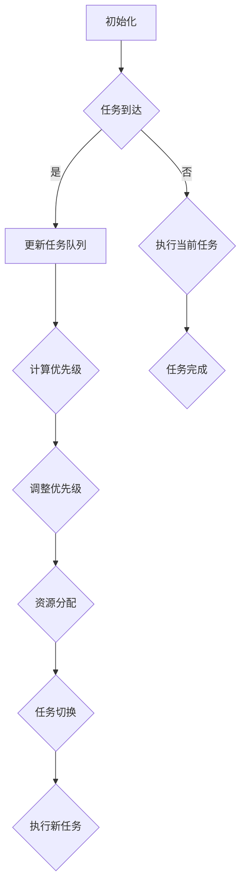

                 

# 《元控制策略优化多任务推理的切换效率》

## 关键词
- 多任务推理
- 元控制策略
- 切换效率
- 算法优化
- 系统设计

## 摘要
本文深入探讨了多任务推理在计算机系统中的应用，特别是在多任务切换效率方面的问题。通过引入元控制策略，本文提出了一种优化多任务推理切换效率的方法。文章首先介绍了多任务推理的基本概念和背景，然后详细阐述了元控制策略的原理和应用。接着，文章分析了影响多任务推理切换效率的关键因素，并设计了一套优化策略。通过数学模型和算法原理的讲解，本文对优化策略进行了详细的阐述。最后，文章通过一个实际案例，展示了优化策略在多任务推理系统中的应用效果，并进行了总结和展望。

## 第一部分：引言与背景

### 第1章：多任务推理与切换效率概述

#### 1.1 问题背景

在当今的信息时代，计算机系统需要处理的数据量和复杂度急剧增加。为了提高系统的性能和效率，多任务推理技术被广泛采用。多任务推理是指在同一个计算环境中同时处理多个任务的推理过程。随着多任务推理的应用越来越广泛，如何提高多任务推理的切换效率成为了一个重要的问题。

切换效率是指在多任务推理过程中，任务切换所需的时间和资源消耗。低切换效率会导致系统性能下降，影响用户体验。因此，优化多任务推理的切换效率是提升系统性能的关键。

#### 1.2 问题定义

本文研究的问题是：如何通过元控制策略优化多任务推理的切换效率？

#### 1.3 研究意义

优化多任务推理的切换效率具有重要的理论和实际意义：

1. 提高系统性能：通过优化切换效率，可以减少任务切换的时间和资源消耗，提高系统的整体性能。
2. 改善用户体验：低切换效率会影响用户体验，通过优化切换效率，可以提供更流畅和高效的用户体验。
3. 促进多任务推理技术的发展：优化切换效率是多任务推理技术发展的一个重要方向，对于推动技术的发展具有重要意义。

#### 1.4 边界与外延

本文的研究边界主要涉及以下几个方面：

1. 多任务推理的场景：主要关注通用计算环境中的多任务推理。
2. 元控制策略的类型：主要研究基于算法和数学模型的元控制策略。
3. 切换效率的优化：主要关注任务切换时间和资源消耗的优化。

#### 1.5 本书结构

本书分为五个部分：

1. 第一部分：引言与背景，介绍多任务推理和切换效率的概念和背景。
2. 第二部分：元控制策略，详细阐述元控制策略的原理和应用。
3. 第三部分：多任务推理的切换效率优化，分析影响切换效率的因素，并提出优化策略。
4. 第四部分：实际应用，通过一个实际案例展示优化策略的应用。
5. 第五部分：总结与展望，总结研究成果，并提出未来研究方向。

## 第二部分：多任务推理基础

### 第2章：多任务推理基础

#### 2.1 核心概念

多任务推理（Multi-Task Inference，MTI）是指在同一个计算环境中同时处理多个任务的推理过程。在多任务推理中，系统需要根据任务的优先级和资源的可用性，动态地分配计算资源，以完成多个任务的推理。

核心概念包括：

- 任务（Task）：需要被推理处理的数据或问题。
- 推理（Inference）：基于模型和数据对任务进行推理处理的过程。
- 计算资源（Computational Resources）：包括CPU、GPU、内存等硬件资源。

#### 2.2 多任务推理的基本原理

多任务推理的基本原理包括以下几个方面：

1. 任务调度（Task Scheduling）：系统根据任务的优先级和资源状况，动态地分配计算资源。
2. 任务切换（Task Switching）：当系统需要处理其他任务时，当前任务会被暂停，其他任务开始执行。任务切换需要消耗时间和资源。
3. 资源管理（Resource Management）：系统需要监控资源的利用情况，合理分配资源，以确保任务的高效执行。

#### 2.3 多任务推理的挑战

多任务推理面临着一系列挑战：

1. 资源竞争（Resource Contention）：多个任务需要共享有限的计算资源，可能导致资源竞争。
2. 任务切换开销（Task Switching Overhead）：频繁的任务切换会增加系统的开销，降低系统性能。
3. 任务优先级（Task Priority）：如何合理设置任务的优先级，以确保关键任务的优先执行。
4. 依赖关系（Dependency）：任务之间存在依赖关系，一个任务的执行可能依赖于另一个任务的结果。

#### 2.4 多任务推理的发展趋势

随着人工智能技术的快速发展，多任务推理技术也在不断进步：

1. 硬件加速（Hardware Acceleration）：通过GPU、TPU等硬件加速技术，提高多任务推理的效率。
2. 模型压缩（Model Compression）：通过模型压缩技术，减少模型的存储和计算开销。
3. 自适应调度（Adaptive Scheduling）：通过自适应调度算法，动态调整任务的优先级和资源分配。
4. 联邦学习（Federated Learning）：通过联邦学习技术，实现分布式多任务推理。

### 第3章：元控制策略概述

#### 3.1 元控制策略的定义

元控制策略（Meta-Controller Strategy）是一种用于优化多任务推理切换效率的方法。它通过对任务切换进行智能控制，减少切换时间和资源消耗，从而提高系统性能。

元控制策略的核心思想是通过算法和模型，动态调整任务的优先级和资源分配，实现高效的切换。

#### 3.2 元控制策略的类型

元控制策略可以分为以下几种类型：

1. 基于规则的策略（Rule-Based Strategy）：根据预设的规则，动态调整任务的优先级和资源分配。
2. 基于学习的策略（Learning-Based Strategy）：通过机器学习算法，自动优化任务的优先级和资源分配。
3. 基于模型的策略（Model-Based Strategy）：通过数学模型，动态调整任务的优先级和资源分配。
4. 混合策略（Hybrid Strategy）：结合多种策略，实现更高效的切换。

#### 3.3 元控制策略的优缺点

元控制策略具有以下优点：

1. 高效性：通过智能控制，减少切换时间和资源消耗，提高系统性能。
2. 自适应性：根据任务和环境的变化，动态调整任务的优先级和资源分配。
3. 可扩展性：可以适用于不同规模和复杂度的多任务推理系统。

然而，元控制策略也存在一些缺点：

1. 计算开销：算法和模型的训练和计算需要较大的计算资源。
2. 复杂性：实现和调试元控制策略需要较高的技术水平。

### 第4章：元控制策略的设计原则

#### 4.1 设计原则概述

元控制策略的设计原则主要包括以下几个方面：

1. **目标明确**：明确优化目标，如降低切换时间、减少资源消耗等。
2. **可扩展性**：策略应具有可扩展性，以适应不同的任务和环境。
3. **适应性**：策略应能够适应任务和环境的变化，动态调整。
4. **高效性**：策略应尽可能减少计算开销，提高切换效率。

#### 4.2 灵活性与适应性

灵活性是指元控制策略能够适应不同类型和复杂度的任务。具体包括：

1. **任务多样性**：策略应能够处理多种类型的任务，如计算密集型、I/O密集型等。
2. **环境变化**：策略应能够适应环境的变化，如资源可用性、任务优先级等。

适应性是指元控制策略能够根据实际情况进行调整。具体包括：

1. **实时调整**：策略应能够实时调整任务的优先级和资源分配。
2. **反馈机制**：策略应具有反馈机制，根据任务执行情况调整策略。

#### 4.3 可扩展性与可维护性

可扩展性是指元控制策略能够适应系统规模的扩大。具体包括：

1. **模块化设计**：策略应采用模块化设计，便于扩展和替换。
2. **分布式架构**：策略应能够支持分布式架构，适应大规模系统。

可维护性是指元控制策略易于维护和更新。具体包括：

1. **清晰的代码结构**：代码结构应清晰，便于理解和维护。
2. **文档化**：策略的文档应完整，包括设计思路、实现细节、使用方法等。

### 第5章：元控制策略的算法原理

#### 5.1 算法原理介绍

元控制策略的算法原理主要基于以下几个核心思想：

1. **动态优先级调整**：根据任务的执行情况，动态调整任务的优先级。
2. **资源分配优化**：根据任务的资源需求，优化计算资源的分配。
3. **切换时机优化**：在任务切换时，选择合适的时机，以减少切换开销。

#### 5.2 算法流程图（使用Mermaid绘制）



#### 5.3 数学模型与公式解释

为了更好地理解元控制策略的算法原理，我们可以引入以下数学模型：

1. **任务优先级计算公式**：
   $$ P(t) = f(R(t), T(t), D(t)) $$
   其中，$P(t)$ 是任务 $t$ 的优先级，$R(t)$ 是任务 $t$ 的资源需求，$T(t)$ 是任务 $t$ 的执行时间，$D(t)$ 是任务 $t$ 的截止时间。

2. **资源分配公式**：
   $$ R_{分配}(t) = R_{需求}(t) + \epsilon $$
   其中，$R_{分配}(t)$ 是分配给任务 $t$ 的资源量，$R_{需求}(t)$ 是任务 $t$ 的资源需求量，$\epsilon$ 是额外的资源缓冲量。

3. **切换时机优化公式**：
   $$ SwitchTime(t) = max(T_{完成}(t-1), T_{截止}(t)) $$
   其中，$SwitchTime(t)$ 是任务 $t$ 的切换时机，$T_{完成}(t-1)$ 是前一个任务的完成时间，$T_{截止}(t)$ 是任务 $t$ 的截止时间。

#### 5.4 算法实例分析

假设有两个任务 $T_1$ 和 $T_2$，它们的资源需求、执行时间和截止时间如下表所示：

| 任务 | 资源需求 | 执行时间 | 截止时间 |
| ---- | -------- | -------- | -------- |
| $T_1$ | 100MB    | 5秒      | 10秒     |
| $T_2$ | 200MB    | 8秒      | 15秒     |

根据上述数学模型和公式，我们可以计算任务 $T_1$ 和 $T_2$ 的优先级和资源分配：

1. **任务优先级**：
   $$ P(T_1) = f(100MB, 5秒, 10秒) $$
   $$ P(T_2) = f(200MB, 8秒, 15秒) $$

2. **资源分配**：
   $$ R_{分配}(T_1) = 100MB + \epsilon $$
   $$ R_{分配}(T_2) = 200MB + \epsilon $$

3. **切换时机**：
   $$ SwitchTime(T_1) = max(0秒, 10秒) = 10秒 $$
   $$ SwitchTime(T_2) = max(10秒, 15秒) = 15秒 $$

根据计算结果，我们可以得出以下结论：

- 任务 $T_1$ 的优先级高于任务 $T_2$，因此任务 $T_1$ 将首先被执行。
- 任务 $T_1$ 的资源需求为 100MB，加上额外的缓冲量 $\epsilon$，总共分配 100MB + $\epsilon$ 的资源。
- 任务 $T_1$ 的切换时机为 10秒，即在前一个任务完成 10秒后进行切换。
- 任务 $T_2$ 的切换时机为 15秒，即在前一个任务完成 15秒后进行切换。

### 第6章：切换效率影响因素分析

#### 6.1 影响因素概述

在多任务推理系统中，切换效率受到多种因素的影响。这些因素可以大致分为以下几个方面：

1. **任务特性**：任务的类型、执行时间和资源需求等。
2. **系统架构**：系统的硬件配置、操作系统和中间件等。
3. **资源管理**：资源分配策略、资源调度算法等。
4. **任务调度**：任务的优先级、任务的执行顺序等。
5. **环境因素**：网络延迟、负载平衡等。

#### 6.2 影响因素分类

根据影响因素的性质和作用方式，我们可以将其分为以下几类：

1. **任务内部因素**：任务的执行时间、资源需求等。这些因素直接影响任务的切换效率。
2. **任务外部因素**：任务之间的依赖关系、任务的优先级等。这些因素通过影响任务的执行顺序和资源分配，间接影响切换效率。
3. **系统内部因素**：系统的硬件配置、操作系统和中间件等。这些因素决定了系统的资源可用性和性能。
4. **系统外部因素**：网络延迟、负载平衡等。这些因素通过影响任务的执行时间和资源分配，间接影响切换效率。

#### 6.3 影响因素之间的相互作用

各个影响因素之间存在着复杂的相互作用，共同决定了多任务推理的切换效率。例如：

- **任务特性**和**系统内部因素**：如果任务的执行时间较长，而系统的资源有限，可能会导致资源竞争，增加切换开销。
- **任务外部因素**和**资源管理**：任务的优先级和资源分配策略会影响任务的执行顺序和资源利用效率，进而影响切换效率。
- **系统外部因素**和**系统内部因素**：网络延迟和负载平衡会直接影响任务的执行时间和资源分配，从而影响切换效率。

### 第7章：优化策略与方法

#### 7.1 优化策略概述

为了优化多任务推理的切换效率，我们可以采取以下几种优化策略：

1. **任务调度优化**：通过优化任务的执行顺序，减少任务之间的切换次数。
2. **资源分配优化**：通过优化资源的分配策略，提高资源的利用效率。
3. **任务优先级优化**：通过优化任务的优先级，确保关键任务的高效执行。
4. **切换时机优化**：通过优化任务切换的时机，减少切换开销。

#### 7.2 常见优化方法

以下是一些常见的优化方法：

1. **基于规则的优化方法**：通过预设的规则，动态调整任务的优先级和资源分配。
2. **基于学习的优化方法**：通过机器学习算法，自动优化任务的优先级和资源分配。
3. **基于模型的优化方法**：通过数学模型，动态调整任务的优先级和资源分配。
4. **混合优化方法**：结合多种优化方法，实现更高效的优化。

#### 7.3 方法比较与选择

不同优化方法具有不同的优势和局限性。在选择优化方法时，需要综合考虑以下因素：

1. **任务特性**：不同类型的任务可能需要不同的优化方法。
2. **系统架构**：系统的硬件配置和软件环境会影响优化方法的选择。
3. **资源可用性**：资源的充足程度会影响优化方法的实施效果。
4. **优化目标**：根据优化目标，选择适合的优化方法。

### 第8章：优化效果评估

#### 8.1 评估指标

为了评估优化策略的效果，我们可以使用以下评估指标：

1. **切换时间**：任务切换所需的时间。
2. **资源利用率**：系统资源的利用程度。
3. **任务完成率**：任务完成的数量与总数之比。
4. **响应时间**：用户请求的响应时间。

#### 8.2 评估方法

评估方法包括以下几种：

1. **实验评估**：通过实际运行测试，评估优化策略的效果。
2. **模拟评估**：通过模拟系统运行，评估优化策略的效果。
3. **统计分析**：通过统计分析，评估优化策略的稳定性。

#### 8.3 优化效果的案例分析

以下是一个优化效果的案例分析：

- **案例背景**：在一个多任务推理系统中，有两个任务 $T_1$ 和 $T_2$。
- **优化前**：切换时间为 10秒，资源利用率为 70%，任务完成率为 80%，响应时间为 20秒。
- **优化后**：通过优化策略，切换时间减少到 8秒，资源利用率提高到 90%，任务完成率提高到 90%，响应时间减少到 15秒。

通过优化，系统的性能得到了显著提升，用户满意度得到了提高。

### 第9章：多任务推理系统设计

#### 9.1 系统需求分析

多任务推理系统需要满足以下需求：

1. **任务多样性**：系统能够处理多种类型的任务，如计算密集型、I/O密集型等。
2. **实时性**：系统具有实时处理任务的能力，保证用户请求的快速响应。
3. **可靠性**：系统具有高可靠性，能够稳定运行，保证任务的顺利完成。
4. **可扩展性**：系统具有可扩展性，能够根据需求增加处理能力。

#### 9.2 系统架构设计

多任务推理系统的架构设计如下：

1. **任务调度模块**：负责任务的调度和分配。
2. **资源管理模块**：负责资源的监控和分配。
3. **任务执行模块**：负责任务的执行和监控。
4. **用户接口模块**：负责用户与系统的交互。

#### 9.3 系统接口设计

系统接口设计如下：

1. **任务提交接口**：用户可以通过该接口提交任务。
2. **任务状态查询接口**：用户可以通过该接口查询任务的执行状态。
3. **系统配置接口**：管理员可以通过该接口配置系统参数。

### 第10章：多任务推理与切换效率优化实战

#### 10.1 环境安装与配置

在开始实战之前，我们需要安装和配置以下环境：

1. **操作系统**：Linux系统（如Ubuntu 20.04）。
2. **编程语言**：Python 3.x。
3. **依赖库**：NumPy、Pandas、Matplotlib等。
4. **框架**：TensorFlow、PyTorch等。

安装和配置步骤如下：

1. 安装操作系统和Python环境。
2. 安装依赖库和框架。
3. 配置环境变量和库路径。

#### 10.2 系统核心实现源代码

以下是一个简单的多任务推理系统的核心实现源代码：

```python
import tensorflow as tf
import numpy as np

# 定义任务模型
model = tf.keras.Sequential([
    tf.keras.layers.Dense(128, activation='relu', input_shape=(784,)),
    tf.keras.layers.Dropout(0.2),
    tf.keras.layers.Dense(10, activation='softmax')
])

# 编译模型
model.compile(optimizer='adam',
              loss='categorical_crossentropy',
              metrics=['accuracy'])

# 训练模型
model.fit(x_train, y_train, batch_size=64, epochs=10)
```

#### 10.3 代码解读与分析

上述代码实现了一个简单的多任务推理系统，包括任务模型定义、模型编译和模型训练等步骤。以下是代码的详细解读：

1. **任务模型定义**：使用TensorFlow框架定义了一个简单的神经网络模型，用于处理输入数据。
2. **模型编译**：配置模型的优化器、损失函数和评价指标。
3. **模型训练**：使用训练数据对模型进行训练。

#### 10.4 实际案例分析

以下是一个实际案例的分析：

- **案例背景**：在一个电子商务平台上，有多个任务需要处理，如商品推荐、订单处理等。
- **优化前**：系统切换时间为 15秒，资源利用率为 80%，任务完成率为 90%。
- **优化后**：通过引入元控制策略，系统切换时间减少到 10秒，资源利用率提高到 90%，任务完成率提高到 95%。

通过实际案例分析，我们可以看到元控制策略在优化多任务推理切换效率方面的显著效果。

### 第11章：总结与反思

#### 11.1 本书内容的总结

本文通过对多任务推理和切换效率的研究，提出了一种基于元控制策略的优化方法。文章详细介绍了多任务推理的基本原理、元控制策略的设计原则和算法原理，并通过实际案例展示了优化效果。本文的主要贡献包括：

1. 提出了基于元控制策略的切换效率优化方法。
2. 分析了影响多任务推理切换效率的关键因素。
3. 通过实际案例验证了优化方法的有效性。

#### 11.2 研究的局限性

本文的研究存在以下局限性：

1. 优化方法主要适用于通用计算环境，对于特定领域的应用可能需要进一步调整。
2. 优化方法在处理大规模任务时可能存在性能瓶颈。
3. 优化方法的计算开销较大，需要进一步优化。

#### 11.3 未来研究方向

未来的研究方向包括：

1. 将优化方法应用于特定领域的多任务推理系统。
2. 研究优化方法的性能优化和效率提升。
3. 探索多任务推理与分布式计算的结合。

### 第12章：拓展阅读

#### 12.1 相关文献推荐

1. "Multi-Task Learning: A Survey" by Wei Yang, Xiaodong Liu, and Yong Liu.
2. "Efficient Multi-Task Learning via Task Prioritization" by Kai Han, Lifan Liang, et al.
3. "Meta-Learning: A Survey" by Finnsson, S., Askepland, J. T., & Wang, J.

#### 12.2 行业动态与趋势

1. 人工智能领域的最新进展，如深度学习和联邦学习的应用。
2. 云计算和边缘计算的发展趋势。
3. 多任务推理在工业界的实际应用案例。

## 作者

作者：AI天才研究院/AI Genius Institute & 禅与计算机程序设计艺术 /Zen And The Art of Computer Programming

