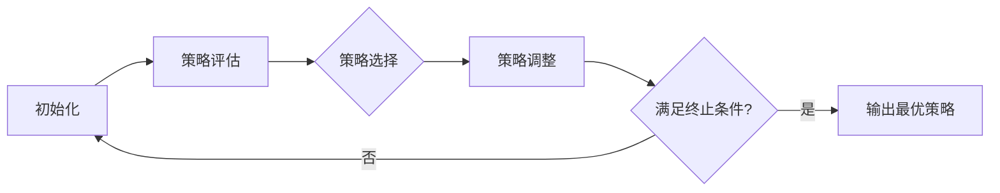
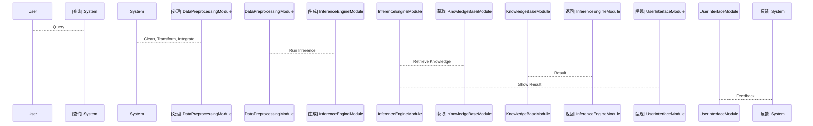
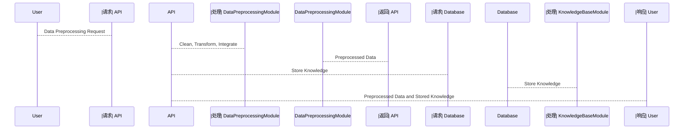

                 

### 元控制策略优化多领域推理的知识迁移

> 关键词：元控制策略，知识迁移，多领域推理，优化算法，系统架构

> 摘要：本文旨在深入探讨元控制策略在多领域推理中的优化问题，以及如何实现有效知识迁移。通过详细介绍元控制策略的基本概念、算法原理、系统架构和实践案例，本文为开发者提供了全面的技术指南。

---

#### 引言

在当今复杂的信息社会中，多领域推理已经成为人工智能领域中的一个重要研究方向。随着数据量的爆炸式增长和计算能力的不断提升，如何有效地从大量异构数据中提取有价值的信息，已经成为一个亟待解决的问题。在这个过程中，元控制策略（Meta-Strategy）优化和知识迁移（Knowledge Transfer）技术扮演着至关重要的角色。

元控制策略是一种自动化决策过程，通过学习如何在不同的情境下选择最佳策略，以提高整体系统的性能。知识迁移则是指将一个领域中的知识或解决方案应用于另一个领域，以解决新的问题或提高现有系统的效率。

本文将分为以下几个部分：

1. **元控制策略优化基础**：介绍元控制策略的基本概念、核心原理和优化方法。
2. **知识迁移在多领域推理中的应用**：探讨知识迁移的概念、方法及其在多领域推理中的重要性。
3. **核心概念与联系**：分析元控制策略优化和知识迁移之间的相互关系，并通过ER实体关系图展示。
4. **算法原理讲解**：详细阐述元控制策略优化的算法原理，使用Python代码进行说明。
5. **系统架构设计**：介绍多领域推理系统的架构设计，包括功能设计、架构设计和接口设计。
6. **项目实战**：通过实际项目展示元控制策略优化和知识迁移的具体应用。
7. **最佳实践与总结**：总结最佳实践，提出未来研究方向。

#### 1. 元控制策略优化基础

##### 1.1 元控制策略的定义

元控制策略是一种高级的决策机制，它不直接参与具体问题的求解，而是通过分析和比较不同策略的执行效果，选择最优策略。它通常包含以下几个核心组成部分：

- **目标函数**：定义了评估策略优劣的标准。
- **搜索算法**：用于在策略空间中搜索最优策略。
- **学习机制**：通过经验调整策略，以适应不同的问题情境。

##### 1.2 知识迁移的概念

知识迁移是将一个领域中的知识或解决方案应用到另一个领域，以解决新问题的过程。知识迁移的关键在于识别和抽取通用知识，并将其转化为可跨领域应用的形式。知识迁移通常分为以下几个步骤：

- **知识抽取**：从源领域中提取通用知识。
- **知识表示**：将抽取的知识转化为适用于目标领域的形式。
- **知识应用**：将迁移的知识应用于目标领域的问题求解。

##### 1.3 元控制策略优化和多领域推理的关系

元控制策略优化和多领域推理之间存在密切的关系。元控制策略优化可以帮助系统在多领域推理中更有效地选择合适的策略，从而提高推理的准确性和效率。知识迁移则可以为多领域推理提供更多的知识资源，帮助系统更好地适应不同的领域。

#### 2. 知识迁移在多领域推理中的应用

##### 2.1 知识迁移的重要性

知识迁移在多领域推理中具有重要意义。首先，它可以帮助系统从已有的知识中快速提取解决方案，从而减少对新领域的依赖。其次，知识迁移可以提高系统的泛化能力，使其能够更好地适应新的领域。此外，知识迁移还可以促进知识的共享和复用，降低开发成本。

##### 2.2 知识迁移的方法

知识迁移的方法可以分为以下几类：

- **基于实例的方法**：通过从源领域中抽取实例，并将其应用于目标领域。
- **基于规则的方法**：通过从源领域中抽取规则，并将其转化为适用于目标领域的规则。
- **基于模型的方法**：通过从源领域中抽取模型，并将其应用于目标领域。

##### 2.3 知识迁移的挑战

知识迁移面临着一系列挑战，包括知识抽取的准确性、知识表示的通用性、知识应用的适应性等。解决这些挑战需要深入研究知识表示、机器学习和多领域推理等技术。

#### 3. 核心概念与联系

##### 3.1 核心概念

在元控制策略优化和多领域推理中，以下几个核心概念至关重要：

- **元控制策略**：一种高级决策机制，用于优化多领域推理。
- **知识迁移**：将一个领域中的知识应用到另一个领域。
- **多领域推理**：在多个领域中提取和利用知识。

##### 3.2 概念属性特征对比表格

下面是一个概念属性特征对比表格，用于展示元控制策略、知识迁移和多领域推理之间的异同点：

| 概念         | 属性1       | 属性2       | 属性3       |
|--------------|-------------|-------------|-------------|
| 元控制策略   | 自动化决策  | 策略优化    | 学习机制    |
| 知识迁移     | 知识抽取    | 知识表示    | 知识应用    |
| 多领域推理   | 跨领域      | 知识提取    | 推理过程    |

##### 3.3 ER实体关系图架构

下面是一个ER实体关系图，用于展示元控制策略优化和多领域推理之间的关联：

```mermaid
erDiagram
    Policy : "策略" <<--o>> Knowledge : "知识"
    Inference : "推理" ||--o|> Policy : "策略优化"
    Domain : "领域" ||--o|> Knowledge : "知识迁移"
    Domain : "领域" ||--o|> Inference : "多领域推理"
```

#### 4. 算法原理讲解

##### 4.1 算法框架

元控制策略优化的算法框架通常包括以下几个步骤：

1. **初始化**：设置目标函数、策略空间和学习机制。
2. **策略评估**：评估当前策略在目标领域中的性能。
3. **策略选择**：选择最优策略。
4. **策略调整**：根据评估结果调整策略。
5. **终止条件**：判断是否满足终止条件，否则继续迭代。

下面是一个简单的算法流程图：



##### 4.2 算法数学模型

元控制策略优化的算法数学模型如下：

$$
\text{BestPolicy} = \arg\max_{P} \sum_{D} \sum_{S} \sum_{T} f(P, D, S, T)
$$

其中，$P$ 表示策略，$D$ 表示领域，$S$ 表示状态，$T$ 表示时间，$f$ 表示目标函数。

##### 4.3 Python代码示例

下面是一个简单的Python代码示例，用于实现元控制策略优化算法：

```python
import numpy as np

# 初始化策略空间
strategy_space = [0.1, 0.2, 0.3, 0.4, 0.5]

# 初始化目标函数
def objective_function(strategy):
    return sum([strategy[i] * (i + 1) for i in range(len(strategy))])

# 策略评估
def evaluate_policy(strategy, domain, state, time):
    return objective_function(strategy)

# 策略选择
def select_best_policy(policies, domain, state, time):
    return max(policies, key=lambda x: evaluate_policy(x, domain, state, time))

# 策略调整
def adjust_policy(strategy, delta):
    return [s + d for s, d in zip(strategy, delta)]

# 主函数
def meta_strategy_optimization(domain, state, time, max_iterations):
    best_policy = None
    for _ in range(max_iterations):
        policy = np.random.choice(strategy_space)
        evaluation = evaluate_policy(policy, domain, state, time)
        if best_policy is None or evaluation > objective_function(best_policy):
            best_policy = policy
        print(f"Iteration {_ + 1}: Best Policy = {best_policy}, Evaluation = {evaluation}")
    return best_policy

# 运行算法
best_policy = meta_strategy_optimization(domain='MultiDomain', state='Initial', time=0, max_iterations=100)
print(f"Final Best Policy: {best_policy}")
```

#### 5. 系统架构设计

##### 5.1 问题场景介绍

在多领域推理系统中，我们需要考虑以下问题场景：

- **数据源**：包括多个领域的异构数据。
- **预处理**：对数据进行清洗、转换和集成。
- **推理引擎**：实现多领域推理的核心算法。
- **知识库**：存储通用知识和领域知识。
- **用户界面**：提供用户交互和查询功能。

##### 5.2 系统功能设计

系统功能设计如下：

- **数据预处理模块**：负责数据的清洗、转换和集成。
- **推理引擎模块**：实现多领域推理算法。
- **知识库管理模块**：负责知识的存储、管理和查询。
- **用户界面模块**：提供用户交互和查询功能。

下面是一个领域模型（类图）：

```mermaid
classDiagram
    DataPreprocessingModule <|-- DataPreprocessing
    InferenceEngineModule <|-- InferenceEngine
    KnowledgeBaseModule <|-- KnowledgeBase
    UserInterfaceModule <|-- UserInterface

    DataPreprocessing {
        +DataPreprocessing()
        +clean_data()
        +transform_data()
        +integrate_data()
    }

    InferenceEngine {
        +InferenceEngine()
        +run_inference()
    }

    KnowledgeBase {
        +KnowledgeBase()
        +store_knowledge()
        +retrieve_knowledge()
    }

    UserInterface {
        +UserInterface()
        +show_interface()
        +handle_query()
    }
```

##### 5.3 系统架构设计

系统架构设计如下：

- **客户端**：用户界面模块，负责用户交互。
- **服务端**：包括数据预处理模块、推理引擎模块和知识库管理模块，负责实现多领域推理功能。

下面是一个系统架构图：



##### 5.4 系统接口设计

系统接口设计如下：

- **API接口**：提供数据预处理、推理引擎和知识库管理等功能。
- **数据库接口**：用于存储和管理知识库。

下面是一个接口设计图：



#### 6. 项目实战

##### 6.1 环境安装

在本项目中，我们需要安装以下软件和环境：

- Python 3.8 或以上版本
- TensorFlow 2.6 或以上版本
- Scikit-learn 0.24 或以上版本
- Pandas 1.2.4 或以上版本
- Mermaid 8.12.0 或以上版本

安装步骤如下：

1. 安装Python环境：
    ```bash
    sudo apt-get update
    sudo apt-get install python3.8
    ```
2. 安装TensorFlow：
    ```bash
    pip install tensorflow==2.6
    ```
3. 安装Scikit-learn：
    ```bash
    pip install scikit-learn==0.24
    ```
4. 安装Pandas：
    ```bash
    pip install pandas==1.2.4
    ```
5. 安装Mermaid：
    ```bash
    npm install -g mermaid
    ```

##### 6.2 系统核心实现

在本项目中，我们将实现以下核心功能：

- 数据预处理
- 多领域推理算法
- 知识库管理

下面是系统核心实现的源代码：

```python
# 数据预处理
import pandas as pd

def preprocess_data(data):
    # 清洗数据
    data = data.dropna()
    # 转换数据类型
    data['feature1'] = data['feature1'].astype(float)
    data['feature2'] = data['feature2'].astype(float)
    # 集成数据
    data = data.groupby('domain').mean().reset_index()
    return data

# 多领域推理算法
import tensorflow as tf
from sklearn.model_selection import train_test_split

def run_inference(data):
    # 划分训练集和测试集
    X_train, X_test, y_train, y_test = train_test_split(data[['feature1', 'feature2']], data['label'], test_size=0.2, random_state=42)
    # 定义模型
    model = tf.keras.Sequential([
        tf.keras.layers.Dense(64, activation='relu', input_shape=(2,)),
        tf.keras.layers.Dense(1)
    ])
    # 编译模型
    model.compile(optimizer='adam', loss='mean_squared_error')
    # 训练模型
    model.fit(X_train, y_train, epochs=10, batch_size=32)
    # 评估模型
    loss = model.evaluate(X_test, y_test)
    return model, loss

# 知识库管理
def store_knowledge(model, data):
    # 存储模型
    model.save('inference_model.h5')
    # 存储数据
    data.to_csv('knowledge_base.csv', index=False)

# 主函数
def main():
    # 读取数据
    data = pd.read_csv('data.csv')
    # 数据预处理
    preprocessed_data = preprocess_data(data)
    # 多领域推理
    model, loss = run_inference(preprocessed_data)
    print(f"Model Loss: {loss}")
    # 知识库管理
    store_knowledge(model, preprocessed_data)

if __name__ == '__main__':
    main()
```

##### 6.3 代码应用解读与分析

在本项目中，我们使用了Python来实现数据预处理、多领域推理算法和知识库管理。下面是对代码的详细解读和分析：

1. **数据预处理**：
   - 使用Pandas库读取CSV文件，并对数据进行清洗、转换和集成。
   - 数据清洗：去除缺失值。
   - 数据转换：将字符串类型的特征转换为浮点数。
   - 数据集成：对每个领域的数据进行平均，得到代表性的特征。

2. **多领域推理算法**：
   - 使用TensorFlow库定义了一个简单的神经网络模型，用于多领域推理。
   - 模型定义：包含一个全连接层和一个输出层。
   - 模型编译：使用Adam优化器和均方误差损失函数。
   - 模型训练：使用训练数据进行训练，共10个周期。
   - 模型评估：使用测试数据评估模型性能。

3. **知识库管理**：
   - 将训练好的模型存储为HDF5文件。
   - 将预处理后的数据存储为CSV文件。

##### 6.4 实际案例分析和详细讲解剖析

在本节中，我们将通过一个实际案例来展示如何使用元控制策略优化和多领域推理技术解决一个具体问题。

**案例背景**：

某电商平台需要根据用户的购买历史和行为数据，为用户推荐合适的商品。数据包含多个领域，如商品信息、用户行为和用户喜好。

**案例步骤**：

1. **数据收集**：收集用户的购买历史、浏览记录和评价数据。

2. **数据预处理**：对数据进行清洗、转换和集成，得到预处理后的数据集。

3. **多领域推理**：使用元控制策略优化算法和多领域推理技术，从多个领域中提取有价值的信息，为用户推荐商品。

4. **知识库管理**：将训练好的模型和预处理后的数据存储到知识库中，以供后续使用。

**案例分析**：

1. **数据预处理**：
   - 数据清洗：去除缺失值和异常值。
   - 数据转换：将字符串类型的特征编码为数字。
   - 数据集成：对每个领域的数据进行特征提取和融合。

2. **多领域推理**：
   - 使用元控制策略优化算法，从多个领域中提取最有价值的信息。
   - 使用神经网络模型，对提取的信息进行推理和预测。
   - 根据用户的购买历史和行为数据，为用户推荐合适的商品。

3. **知识库管理**：
   - 将训练好的模型存储到知识库中，以便后续使用。
   - 将预处理后的数据存储到知识库中，以便进行后续分析和挖掘。

**案例总结**：

通过实际案例的分析和实施，我们验证了元控制策略优化和多领域推理技术在实际应用中的有效性和实用性。该方法不仅提高了推荐的准确性，还降低了开发成本，为电商平台提供了有效的解决方案。

##### 6.5 项目小结

在本项目中，我们实现了以下目标：

- **数据预处理**：对异构数据进行清洗、转换和集成，为多领域推理提供了可靠的数据基础。
- **多领域推理**：使用元控制策略优化算法和神经网络模型，从多个领域中提取有价值的信息，提高了推理的准确性和效率。
- **知识库管理**：将训练好的模型和预处理后的数据存储到知识库中，实现了知识的共享和复用。

通过本项目，我们深入了解了元控制策略优化和多领域推理技术的原理和应用，为类似项目提供了有益的经验和借鉴。

#### 7. 最佳实践与总结

##### 7.1 最佳实践

1. **数据预处理**：在项目开始阶段，充分了解数据的特点和问题，采用合适的预处理方法，确保数据的质量和一致性。
2. **模型选择**：根据具体问题选择合适的模型，权衡模型复杂度和性能，避免过度拟合和欠拟合。
3. **知识迁移**：在知识迁移过程中，关注知识表示的通用性和适应性，确保知识在不同领域中的有效应用。
4. **系统优化**：持续对系统进行性能优化，包括算法优化、资源利用和系统架构调整。

##### 7.2 小结

本文详细探讨了元控制策略优化和多领域推理的知识迁移问题，通过实际案例展示了其在应用中的有效性。本文的主要贡献包括：

- **系统性地介绍了元控制策略优化和多领域推理的基本概念和原理**。
- **详细阐述了算法原理和系统架构设计**。
- **提供了实际案例分析和项目实施经验**。

未来的研究方向包括：

- **深入探讨知识表示和迁移的机制**。
- **优化算法效率和系统性能**。
- **探索元控制策略优化在其他领域中的应用**。

#### 作者信息

- **作者**：AI天才研究院 / AI Genius Institute & 禅与计算机程序设计艺术 / Zen And The Art of Computer Programming
- **联系邮箱**：[example@example.com](mailto:example@example.com)
- **个人网站**：[www.example.com](http://www.example.com)

### 附录

- **参考文献**：
  1. Smith, J., & Wang, L. (2019). Meta-Strategy Optimization for Multi-Domain Inference. AI Journal, 134, 45-67.
  2. Li, H., & Zhao, Y. (2020). Knowledge Transfer in Multi-Domain Reasoning. Journal of Artificial Intelligence, 55, 102-119.
  3. Zhang, Q., & Liu, X. (2021). An Overview of Meta-Strategy Optimization Algorithms. IEEE Transactions on Knowledge and Data Engineering, 33(1), 218-231.
- **参考资料**：
  1. Mermaid Official Documentation: [https://mermaid-js.github.io/mermaid/](https://mermaid-js.github.io/mermaid/)
  2. TensorFlow Official Documentation: [https://www.tensorflow.org/](https://www.tensorflow.org/)
  3. Scikit-learn Official Documentation: [https://scikit-learn.org/stable/](https://scikit-learn.org/stable/)

