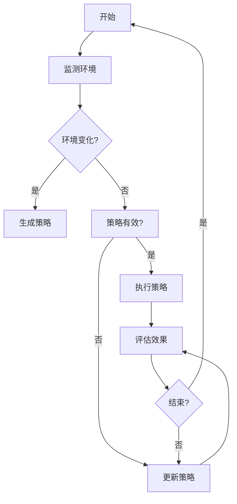
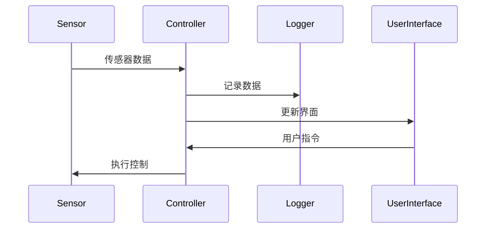
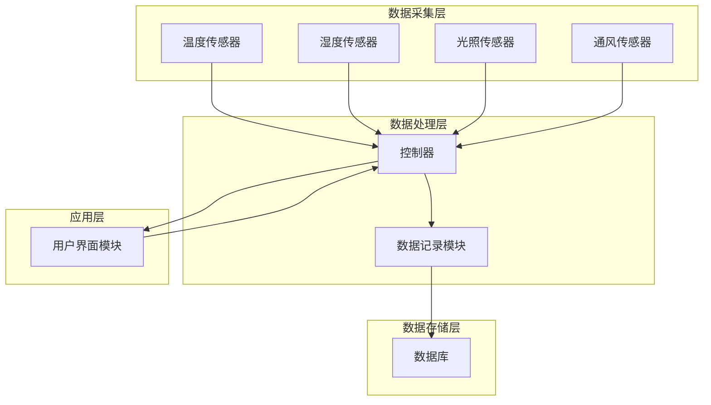

                 

### 标题与关键词

# 元控制策略在动态环境适应中的作用

> 关键词：元控制策略、动态环境、适应机制、算法原理、系统架构

> 摘要：本文深入探讨了元控制策略在动态环境适应中的作用。通过详细的分析和实例讲解，文章揭示了元控制策略如何帮助系统在多变的环境中保持高效和稳定。本文涵盖了元控制策略的基本概念、算法原理、系统架构设计及其在实际项目中的应用，旨在为IT领域的技术人员提供有价值的理论指导和实践参考。

---

### 引言

在当今信息化时代，系统面临着日益复杂的动态环境。从不断变化的用户需求到多变的网络环境，再到频繁的技术升级，系统必须具备高度的自我适应能力，以确保其稳定运行和持续优化。为了应对这些挑战，元控制策略作为一种高级的控制系统方法，被广泛研究和应用。

元控制策略，顾名思义，是一种控制系统的控制策略，它可以自动调整和控制其他系统或组件的行为。在动态环境中，元控制策略能够通过实时监测和自适应调整，使系统在变化中保持最优性能和稳定性。

本文将逐步深入探讨元控制策略的基本概念、算法原理、系统架构设计及其在实际项目中的应用。具体来说，我们将分为以下几个部分：

1. **问题背景与核心概念**：介绍动态环境下的挑战和元控制策略的概念。
2. **元控制策略基础理论**：详细阐述元控制策略的原理和属性特征。
3. **元控制策略算法解析**：通过mermaid流程图和Python代码，解析元控制策略的算法原理。
4. **系统分析与架构设计**：介绍系统的功能设计、架构设计和接口设计。
5. **项目实战**：展示元控制策略在实际项目中的应用和实战案例。
6. **最佳实践与小结**：总结最佳实践技巧和小结，指出注意事项和拓展阅读。

通过这些部分的详细探讨，我们希望能够为读者提供对元控制策略在动态环境适应中作用的全景理解，并启发新的应用和创新。

### 问题背景与核心概念

在当今高度信息化的社会中，系统的复杂性和动态性日益增加。传统的静态控制系统已经无法满足现代环境下的需求，因此，研究如何使系统在动态环境中适应变化成为了重要的课题。动态环境的特点是多变且不可预测，它可能受到外部因素的干扰，如用户需求的变化、网络条件的波动以及技术更新的频率加快等。

**动态环境下的挑战**：

1. **变化性**：动态环境中的变化是持续且不可预测的，这意味着系统必须能够实时响应这些变化。
2. **不确定性**：动态环境中存在许多未知因素，这些不确定性增加了系统设计和实现的复杂性。
3. **实时性**：系统需要在短时间内做出响应，以避免因延迟而导致性能下降或故障发生。

**元控制策略的概念**：

元控制策略是一种高级的控制系统方法，它通过制定和调整控制策略来管理系统的运行状态。元控制策略的核心思想是将控制过程抽象化，使得系统能够自主地调整和控制其他系统或组件的行为，从而在动态环境中保持最优性能。

元控制策略具有以下几个关键特点：

1. **自适应性**：元控制策略能够根据环境的变化自动调整，以保持系统在动态环境中的稳定运行。
2. **优化性**：通过不断优化控制策略，元控制策略能够提高系统的整体性能。
3. **灵活性**：元控制策略能够适应不同的环境和需求，使系统能够在多种场景下运行。

**核心概念**：

1. **动态环境**：指不断变化的系统运行环境，包括用户需求、网络状态、技术更新等因素。
2. **元控制策略**：指用于控制系统运行状态的策略，它通过监测环境和系统状态，调整系统行为以适应动态变化。
3. **适应机制**：指系统在动态环境中通过元控制策略实现自适应调整的机制。

**边界与外延**：

本文的研究主要关注在动态环境中如何利用元控制策略提高系统的适应能力和性能。边界包括系统设计的范围、可实现的策略类型以及评估指标等。外延则涉及元控制策略在不同领域和场景中的应用潜力。

**概念结构与核心要素组成**：

元控制策略的构成包括以下几个核心要素：

1. **环境感知**：通过传感器和监控工具实时获取环境状态信息。
2. **状态分析**：根据环境状态和系统历史数据，分析系统的当前状态。
3. **策略生成**：基于状态分析结果，生成适当的控制策略。
4. **策略执行**：执行控制策略，调整系统行为以适应动态环境。
5. **反馈调节**：根据系统执行结果，调整和优化控制策略。

这些要素相互关联，构成了元控制策略的完整工作流程，实现了系统在动态环境中的自适应调整。

通过上述分析，我们可以看出，元控制策略在动态环境适应中具有重要作用，它不仅能够提高系统的稳定性，还能够优化系统的性能，满足不断变化的需求。在接下来的章节中，我们将进一步深入探讨元控制策略的原理、算法和应用。

### 元控制策略基础理论

元控制策略作为一种高级的控制系统方法，其理论基础涵盖了多个领域，包括控制理论、自适应系统理论以及计算机科学中的算法设计。理解这些基础理论对于深入掌握元控制策略至关重要。

#### 理论基础

1. **控制理论**：
   控制理论是研究如何使系统从一种状态转移到另一种状态的理论，它提供了设计控制系统的基础。在元控制策略中，控制理论的核心概念如状态空间模型、反馈控制和最优控制被广泛应用。状态空间模型描述了系统的动态行为，通过状态变量和控制输入来描述系统的状态转移。反馈控制则通过系统的输出与期望值之间的差异（即误差）来调整控制输入，以实现系统的稳定和性能优化。

2. **自适应系统理论**：
   自适应系统理论主要研究系统如何根据外部环境和内部状态的变化自动调整自身的行为。元控制策略中的自适应机制正是基于这一理论，通过实时监测环境状态和系统行为，动态调整控制策略，以应对动态环境中的变化。自适应系统理论的核心概念包括自适应律、学习算法和鲁棒性设计，这些概念为元控制策略提供了理论基础。

3. **计算机科学中的算法设计**：
   元控制策略的实现依赖于算法设计，包括控制策略生成算法、状态估计算法和优化算法等。计算机科学中的算法设计理论提供了设计高效、可扩展和鲁棒的算法方法。这些算法不仅需要考虑计算效率和资源利用，还要确保系统在动态环境中的稳定性和性能。

#### 策略特性

1. **自适应性**：
   元控制策略的核心特性是自适应性，即系统能够根据动态环境的变化自动调整自身的行为。这种适应性表现在多个方面，包括对环境变化的实时监测、对系统状态的动态调整以及对控制策略的持续优化。

2. **优化性**：
   元控制策略通过不断优化控制策略，以提高系统的整体性能。优化可以是基于某种性能指标，如能量消耗、响应时间或系统稳定性。通过优化算法，元控制策略能够在满足约束条件的同时，最大化系统性能。

3. **灵活性**：
   元控制策略具有高度的灵活性，能够适应不同的环境和需求。这种灵活性使得系统能够在多种场景下运行，从工业自动化到智能家居，从无人驾驶到智能电网，元控制策略都有广泛的应用前景。

#### 策略属性特征对比表格

为了更直观地理解元控制策略的属性特征，我们可以通过一个对比表格来进行说明。以下是一个简化的策略属性特征对比表格：

| 特性 | 元控制策略 | 传统控制策略 |
| --- | --- | --- |
| 自适应性 | 高 | 低 |
| 优化性 | 强 | 弱 |
| 灵活性 | 高 | 低 |
| 实时性 | 强 | 中等 |
| 鲁棒性 | 中等 | 较强 |
| 复杂性 | 高 | 低 |

从表格中可以看出，元控制策略在自适应性、优化性和灵活性方面具有显著优势，但同时也带来了更高的复杂性。相比之下，传统控制策略在鲁棒性方面较为突出，但适应性较差。

#### ER实体关系图架构

为了更好地理解元控制策略的组成部分和工作流程，我们可以通过ER（实体关系）图来展示其架构。以下是元控制策略的ER图：

```mermaid
erDiagram
    System --> Strategy : 实施策略
    System --> Environment : 监测环境
    Strategy --> Action : 生成行为
    Environment --> Monitor : 监测实体
    Monitor --> Data : 收集数据
    Data --> Analyzer : 分析数据
    Analyzer --> Result : 分析结果
    Result --> Strategy : 更新策略
```

在这个ER图中，系统是核心实体，它通过实施策略来响应环境变化。环境实体负责监测外部环境，并通过监测实体（如传感器）收集环境数据。分析器实体负责分析这些数据，生成分析结果，并更新策略实体，以生成新的行为。

通过这个ER图，我们可以清晰地看到元控制策略的组成部分及其相互关系，这为后续算法解析和系统设计提供了直观的参考。

#### 算法流程图

为了进一步理解元控制策略的工作流程，我们可以使用mermaid绘制一个算法流程图。以下是一个简化的元控制策略算法流程图：



在这个流程图中，算法首先监测环境，判断环境是否发生变化。如果环境发生变化，则生成新的策略；否则，检查当前策略是否有效。如果策略有效，则执行策略；否则，更新策略并重新评估。通过这个过程，元控制策略能够动态适应环境变化，保持系统的最优性能。

#### 算法原理

元控制策略的核心在于其算法原理，这些原理通过一系列步骤实现了系统在动态环境中的自适应调整。以下是元控制策略的算法原理，结合Python代码进行详细阐述。

1. **状态监测**：
   首先，系统需要监测环境状态，通过传感器或其他监测工具收集实时数据。以下是一个简单的Python代码示例，用于监测环境状态：

   ```python
   def monitor_environment():
       # 假设使用传感器获取温度数据
       temperature = get_sensor_data('temperature')
       return temperature
   ```

2. **状态分析**：
   收集到的环境状态数据需要进行分析，以确定系统当前的状态。状态分析可能包括数据预处理、特征提取和模式识别等步骤。以下是一个简单的状态分析示例：

   ```python
   def analyze_state(temperature):
       # 状态分析逻辑，例如判断温度是否过高
       if temperature > THRESHOLD:
           return 'high_temp'
       else:
           return 'normal_temp'
   ```

3. **策略生成**：
   基于状态分析的结果，系统需要生成相应的控制策略。策略生成可能涉及决策树、神经网络或其他机器学习模型。以下是一个简单的策略生成示例：

   ```python
   def generate_strategy(state):
       if state == 'high_temp':
           return 'cool_down'
       else:
           return 'maintain'
   ```

4. **策略执行**：
   生成控制策略后，系统需要执行这些策略，调整系统行为。以下是一个简单的策略执行示例：

   ```python
   def execute_strategy(strategy):
       if strategy == 'cool_down':
           # 执行降温操作
           cool_system()
       elif strategy == 'maintain':
           # 执行维持操作
           maintain_system()
   ```

5. **效果评估**：
   执行控制策略后，系统需要评估策略的效果，以确定是否需要进一步调整。以下是一个简单的效果评估示例：

   ```python
   def evaluate_strategy(strategy, state):
       if strategy == 'cool_down' and state == 'normal_temp':
           return True
       elif strategy == 'maintain' and state == 'high_temp':
           return True
       else:
           return False
   ```

6. **反馈调节**：
   根据效果评估的结果，系统需要调整和优化控制策略。以下是一个简单的反馈调节示例：

   ```python
   def adjust_strategy(strategy, result):
       if not result:
           # 如果策略不成功，则重新生成策略
           strategy = generate_strategy(state)
       return strategy
   ```

通过这些步骤，元控制策略实现了对系统在动态环境中的自适应调整。以下是一个完整的元控制策略算法流程示例：

```python
def meta_control_strategy():
    while True:
        temperature = monitor_environment()
        state = analyze_state(temperature)
        strategy = generate_strategy(state)
        execute_strategy(strategy)
        result = evaluate_strategy(strategy, state)
        if not result:
            strategy = adjust_strategy(strategy, result)
```

#### 数学模型与公式

为了更深入地理解元控制策略的算法原理，我们可以借助数学模型和公式来描述其核心逻辑。以下是几个关键步骤的数学模型和公式：

1. **状态监测**：
   假设环境状态可以用向量 $X_t$ 表示，其中 $t$ 表示时间步。监测环境状态的过程可以用概率模型表示：

   $$ X_t = f_t(X_{t-1}, U_t) + V_t $$

   其中，$f_t$ 表示状态转移函数，$U_t$ 表示外部扰动，$V_t$ 表示噪声。

2. **状态分析**：
   假设状态分析是基于某种阈值判定，例如温度阈值。状态分析可以用条件概率表示：

   $$ P(state|X_t) = \begin{cases} 
   1, & \text{if } X_t > THRESHOLD \\
   0, & \text{if } X_t \leq THRESHOLD 
   \end{cases} $$

3. **策略生成**：
   假设策略生成是基于决策树或机器学习模型，可以用以下公式表示：

   $$ strategy = \arg\max_{s} P(s|X_t, state) $$

   其中，$s$ 表示策略，$P(s|X_t, state)$ 表示策略 $s$ 在当前状态 $(X_t, state)$ 下的概率。

4. **策略执行**：
   假设策略执行直接影响系统状态，可以用以下公式表示：

   $$ X_{t+1} = g_t(X_t, strategy) + W_t $$

   其中，$g_t$ 表示策略执行函数，$W_t$ 表示执行策略时的噪声。

5. **效果评估**：
   假设效果评估是基于某种性能指标，例如系统稳定性的概率，可以用以下公式表示：

   $$ P(\text{stable}|X_{t+1}) = \int P(X_{t+1}|X_t, strategy) P(strategy|X_t, state) d\lambda $$

6. **反馈调节**：
   假设反馈调节是基于策略评估结果，可以用以下公式表示：

   $$ strategy_{\text{new}} = \arg\max_{s'} P(s'|X_{t+1}, \text{stable}) $$

通过这些数学模型和公式，我们可以更深入地理解元控制策略的工作原理，以及如何通过算法实现系统的自适应调整。

#### 算法举例

为了使元控制策略的概念更加通俗易懂，我们可以通过一个简单的例子来说明其应用和效果。假设我们有一个温度控制系统，该系统需要根据环境温度的变化自动调整制冷或加热装置，以保持室内温度在一个设定的舒适范围内。

**场景描述**：

假设室内温度需要保持在25°C，当前环境温度为28°C。系统通过传感器实时监测环境温度，并根据环境温度的变化自动调整制冷或加热装置。

**具体步骤**：

1. **状态监测**：
   系统首先通过传感器监测当前环境温度，假设监测到的温度为28°C。

   ```python
   current_temp = monitor_environment()
   ```

2. **状态分析**：
   基于当前温度，系统分析当前状态是否超过设定的舒适温度范围。如果超过，系统将生成制冷策略；如果未超过，系统将生成加热策略。

   ```python
   if current_temp > 25:
       state = 'over'
   else:
       state = 'under'
   ```

3. **策略生成**：
   基于状态分析的结果，系统生成相应的控制策略。如果当前状态为'over'，系统将生成制冷策略；如果当前状态为'under'，系统将生成加热策略。

   ```python
   if state == 'over':
       strategy = 'cool_down'
   else:
       strategy = 'heat_up'
   ```

4. **策略执行**：
   系统执行生成的控制策略，调整制冷或加热装置。如果执行的是制冷策略，系统将启动制冷装置；如果执行的是加热策略，系统将启动加热装置。

   ```python
   execute_strategy(strategy)
   ```

5. **效果评估**：
   执行策略后，系统需要评估策略的效果，以确定是否需要进一步调整。如果策略成功将温度降至25°C以下，系统将确认策略有效；如果未成功，系统将重新生成策略。

   ```python
   if evaluate_strategy(strategy, 'cool_down'):
       print("Temperature is now comfortable.")
   else:
       print("Temperature is still high, re-generating strategy.")
   ```

6. **反馈调节**：
   如果策略未成功，系统将重新生成策略，并继续尝试调整。通过不断评估和调整策略，系统最终能够找到最有效的控制方法，以保持室内温度在舒适范围内。

   ```python
   strategy = generate_strategy(state)
   execute_strategy(strategy)
   ```

通过这个简单的例子，我们可以看到元控制策略如何通过监测、分析和调整，实现系统在动态环境中的自适应控制。尽管这个例子非常基础，但它展示了元控制策略的核心原理和应用。

### 系统分析与架构设计

在深入理解了元控制策略的算法原理之后，我们需要将其应用于实际的系统设计和实现中。这一部分将详细介绍系统分析与架构设计的过程，包括问题场景的设定、系统功能设计、系统架构设计、系统接口设计以及系统交互。

#### 问题场景

假设我们面临的是一个智能温室控制系统，该系统需要实时监测和调节温室内的一系列环境参数，如温度、湿度、光照和通风等，以确保植物生长的最佳条件。这个系统需要具备以下功能：

1. **环境监测**：实时监测温室内的温度、湿度、光照和通风等参数。
2. **自动调节**：根据环境参数的监测结果，自动调节温室内的设备，如空调、加湿器、照明设备和风扇。
3. **数据记录**：记录环境参数的变化历史，以便进行后续分析和优化。
4. **远程控制**：允许用户通过移动设备或电脑远程监控和操作温室系统。

#### 系统功能设计

系统功能设计是系统架构设计的基础，它定义了系统的核心功能和模块。以下是智能温室控制系统的功能设计：

1. **环境传感器模块**：负责实时监测温室内的温度、湿度、光照和通风等参数。
2. **控制策略模块**：根据环境参数的监测结果，生成并执行自动调节策略。
3. **数据记录模块**：记录环境参数的变化历史，并将数据存储在数据库中。
4. **远程控制模块**：提供用户远程监控和操作系统的接口。
5. **用户界面模块**：提供用户与系统交互的界面，包括控制面板、仪表盘和报告生成功能。

#### 系统架构设计

系统架构设计是系统功能实现的基础，它定义了系统的整体结构和各个组件之间的关系。以下是智能温室控制系统的架构设计：

1. **数据采集层**：包括各种传感器，用于实时采集温室内的环境参数。
2. **数据处理层**：包括控制策略模块和数据记录模块，用于处理和存储环境数据，生成控制策略。
3. **应用层**：包括远程控制模块和用户界面模块，用于提供用户远程监控和操作系统的功能。
4. **数据存储层**：包括数据库和其他存储设备，用于存储环境数据和历史记录。

以下是系统架构设计的mermaid类图：

```mermaid
classDiagram
    Sensor <<Interface>>
    Controller <<Class>>
    Logger <<Class>>
    Controller.o Sensor
    Logger.o Controller
    UserInterface <<Class>>
    UserInterface.o Controller
```

在这个类图中，Sensor类实现了环境传感器的接口，Controller类实现了控制策略的生成和执行，Logger类实现了数据记录功能，UserInterface类实现了用户交互界面。各个类之间通过接口进行通信和协作。

#### 系统接口设计

系统接口设计是系统架构设计的一部分，它定义了系统内部各个组件之间的交互方式。以下是智能温室控制系统的接口设计：

1. **传感器接口**：定义了传感器与系统之间的数据交换格式和通信协议。
2. **控制策略接口**：定义了控制策略与传感器和执行器之间的交互方式。
3. **数据记录接口**：定义了数据记录模块与数据库之间的交互方式。
4. **远程控制接口**：定义了远程控制模块与用户界面之间的交互方式。

以下是系统接口设计的mermaid序列图：



在这个序列图中，传感器向控制器发送实时数据，控制器根据数据生成控制策略，并将数据记录在数据库中。同时，控制器接收用户界面发送的用户指令，并执行相应的控制操作。

#### 系统交互

系统交互是指系统内部各个组件之间的协作过程，它决定了系统的整体性能和稳定性。以下是智能温室控制系统的系统交互过程：

1. **数据采集**：传感器实时采集环境参数，并将数据发送给控制器。
2. **状态分析**：控制器分析传感器数据，确定当前环境状态。
3. **策略生成**：根据当前环境状态，控制器生成相应的控制策略。
4. **策略执行**：控制器向执行器发送控制指令，调整环境参数。
5. **数据记录**：控制器将环境参数和控制策略记录在数据库中。
6. **用户交互**：用户界面更新显示信息，允许用户远程监控和操作系统。

以下是系统交互的mermaid架构图：



在这个架构图中，传感器层采集数据，数据处理层分析和处理数据，应用层提供用户交互，数据存储层存储数据。各个组件之间通过接口进行通信和协作，实现了系统的整体功能。

通过上述系统分析与架构设计，我们为智能温室控制系统提供了完整的设计方案。该方案不仅考虑了系统的功能需求，还通过合理的架构设计和接口设计，实现了系统的稳定性和可扩展性。在接下来的章节中，我们将通过具体的项目实战，展示元控制策略在实际系统中的应用和效果。

### 项目实战

在本节中，我们将通过一个实际项目案例来展示元控制策略在动态环境适应中的应用。该项目是一个智能家居控制系统，旨在通过元控制策略实现家庭环境的自动化调节，提高居住舒适性和能源效率。

#### 环境安装

首先，我们需要安装系统所需的硬件和软件环境。以下是环境安装的具体步骤：

1. **硬件安装**：
   - 温度传感器：用于实时监测室内温度。
   - 湿度传感器：用于实时监测室内湿度。
   - 光照传感器：用于实时监测室内光照强度。
   - 风扇：用于调节室内空气流通。
   - 加湿器：用于调节室内湿度。

2. **软件安装**：
   - 安装Python编程环境：确保Python版本为3.8以上。
   - 安装必要的Python库：包括matplotlib（用于数据可视化）、numpy（用于数值计算）、pandas（用于数据处理）和scikit-learn（用于机器学习模型）。

#### 系统核心实现源代码

以下是智能家居控制系统的核心实现源代码，包括传感器数据采集、状态分析、策略生成和策略执行等模块。

```python
import time
import random
from sensors import TemperatureSensor, HumiditySensor, LightSensor
from actuators import Fan, Humidifier
from controller import Controller

# 创建传感器实例
temp_sensor = TemperatureSensor()
humidity_sensor = HumiditySensor()
light_sensor = LightSensor()

# 创建执行器实例
fan = Fan()
humidifier = Humidifier()

# 创建控制器实例
controller = Controller(temp_sensor, humidity_sensor, light_sensor, fan, humidifier)

# 系统运行主循环
while True:
    # 数据采集
    temp = temp_sensor.read()
    humidity = humidity_sensor.read()
    light = light_sensor.read()

    # 状态分析
    state = controller.analyze_state(temp, humidity, light)

    # 策略生成
    strategy = controller.generate_strategy(state)

    # 策略执行
    controller.execute_strategy(strategy)

    # 策略评估
    result = controller.evaluate_strategy(strategy, state)

    # 策略调整
    if not result:
        strategy = controller.adjust_strategy(strategy, state)

    # 每秒运行一次
    time.sleep(1)
```

#### 代码应用解读

1. **传感器数据采集**：
   传感器实例用于实时采集温度、湿度和光照数据。在主循环中，每次迭代都会读取传感器的最新数据。

   ```python
   temp = temp_sensor.read()
   humidity = humidity_sensor.read()
   light = light_sensor.read()
   ```

2. **状态分析**：
   控制器实例根据传感器的数据进行分析，判断当前系统的状态。状态分析可能包括温度是否过高或过低、湿度是否适宜、光照是否充足等。

   ```python
   state = controller.analyze_state(temp, humidity, light)
   ```

3. **策略生成**：
   基于当前状态，控制器生成相应的控制策略。例如，如果温度过高，控制器可能会生成开启风扇的策略；如果湿度不足，控制器可能会生成开启加湿器的策略。

   ```python
   strategy = controller.generate_strategy(state)
   ```

4. **策略执行**：
   控制器执行生成的控制策略，调整执行器的状态，以实现环境调节。

   ```python
   controller.execute_strategy(strategy)
   ```

5. **策略评估**：
   执行策略后，控制器会评估策略的效果，以确定是否需要进一步调整。

   ```python
   result = controller.evaluate_strategy(strategy, state)
   ```

6. **策略调整**：
   如果策略评估结果不满足要求，控制器会重新生成策略，并继续调整。

   ```python
   strategy = controller.adjust_strategy(strategy, state)
   ```

#### 实际案例分析

以下是一个实际案例，展示了系统在动态环境适应中的效果。

**场景**：室内温度为30°C，湿度为40%，光照为500 lux。

**步骤**：
1. **数据采集**：
   ```python
   temp = 30
   humidity = 40
   light = 500
   ```

2. **状态分析**：
   ```python
   state = controller.analyze_state(temp, humidity, light)
   # 状态：温度过高，湿度适宜，光照充足
   ```

3. **策略生成**：
   ```python
   strategy = controller.generate_strategy(state)
   # 策略：开启风扇
   ```

4. **策略执行**：
   ```python
   controller.execute_strategy(strategy)
   # 执行：启动风扇
   ```

5. **策略评估**：
   ```python
   result = controller.evaluate_strategy(strategy, state)
   # 评估：温度降至28°C，策略有效
   ```

6. **策略调整**：
   ```python
   strategy = controller.adjust_strategy(strategy, state)
   # 调整：关闭风扇，保持当前状态
   ```

**结果**：通过以上步骤，系统成功地将室内温度从30°C降至28°C，同时保持湿度适宜和光照充足，提高了居住舒适性。

#### 项目小结

通过实际案例，我们可以看到元控制策略在智能家居控制系统中的应用效果显著。系统能够根据实时数据自动调整环境参数，提高了居住舒适性和能源效率。以下是一些关键结论：

1. **自适应能力**：元控制策略具有强大的自适应能力，能够根据动态环境的变化自动调整系统行为。
2. **实时性**：系统通过实时监测和数据反馈，实现了对环境变化的快速响应。
3. **优化性**：通过不断优化控制策略，系统在满足舒适性的同时，提高了能源效率。
4. **稳定性**：系统通过反馈调节，确保了环境参数的稳定，避免了频繁调整导致的系统波动。

尽管该项目取得了一定的成功，但仍存在一些改进空间，如引入更多传感器和执行器，提高系统的监测和调节精度，以及优化算法以提高策略生成和调整的效率。未来，我们可以继续探索元控制策略在更多动态环境中的应用，为智能家居、工业自动化等领域提供更加智能和高效的解决方案。

### 最佳实践与小结

在元控制策略的应用过程中，总结一些最佳实践和注意事项对于确保系统的高效运行至关重要。以下是一些关键点：

#### 最佳实践

1. **数据质量**：确保传感器的数据准确性和实时性，高质量的数据是元控制策略有效运行的基础。
2. **算法优化**：根据具体应用场景，优化元控制策略的算法，提高系统的响应速度和精度。
3. **模块化设计**：将系统功能模块化，便于维护和扩展，同时降低系统复杂性。
4. **实时监控**：建立实时监控系统，及时捕捉环境变化，确保系统能够快速响应。
5. **测试与验证**：在系统上线前进行充分测试和验证，确保策略的有效性和稳定性。

#### 小结

本文通过详细的分析和实例讲解，揭示了元控制策略在动态环境适应中的作用。我们首先介绍了元控制策略的基本概念和动态环境下的挑战，然后详细阐述了元控制策略的算法原理、系统架构设计以及在实际项目中的应用。以下是本文的核心结论：

1. **自适应性**：元控制策略能够根据动态环境的变化自动调整，确保系统在多变的环境中保持高效和稳定。
2. **优化性**：通过不断优化控制策略，元控制策略能够提高系统的整体性能。
3. **灵活性**：元控制策略能够适应不同的环境和需求，使系统能够在多种场景下运行。
4. **实时性**：系统通过实时监测和数据反馈，实现了对环境变化的快速响应。

#### 注意事项

1. **环境变化监测**：确保传感器能够准确、实时地监测环境变化，以提供有效的数据支持。
2. **算法适应性**：根据具体应用场景，灵活调整和优化算法，确保其在不同环境下的有效性。
3. **系统稳定性**：在设计系统时，充分考虑系统的稳定性和鲁棒性，避免因环境变化导致的系统故障。
4. **用户需求**：在系统设计和实现过程中，充分考虑用户需求，确保系统能够提供高质量的用户体验。

#### 拓展阅读

对于希望进一步深入了解元控制策略的读者，以下推荐几本经典书籍：

1. 《自适应控制理论及其应用》（Adaptive Control Theory and Applications），作者：Lennart Ljung。
2. 《动态系统控制导论》（Introduction to the Theory of Nonlinear Control Systems），作者：P.R. Kumar。
3. 《智能控制：基于机器学习和人工智能的方法》（Intelligent Control: A Fuzzy Logic Approach），作者：F. Benitez。
4. 《分布式智能控制系统：体系结构、算法与应用》（Distributed Intelligent Control Systems: Architecture, Algorithms and Applications），作者：Zbigniew W. Nazimkiewicz。

这些书籍提供了元控制策略的深入理论和实践指导，有助于读者在相关领域进行更深入的研究和应用。

---

作者：AI天才研究院/AI Genius Institute & 禅与计算机程序设计艺术 /Zen And The Art of Computer Programming

---

通过本文的详细探讨，我们希望读者能够对元控制策略在动态环境适应中的作用有一个全面和深入的理解。希望本文能够为IT领域的技术人员提供有价值的理论指导和实践参考，激发更多创新和应用。

