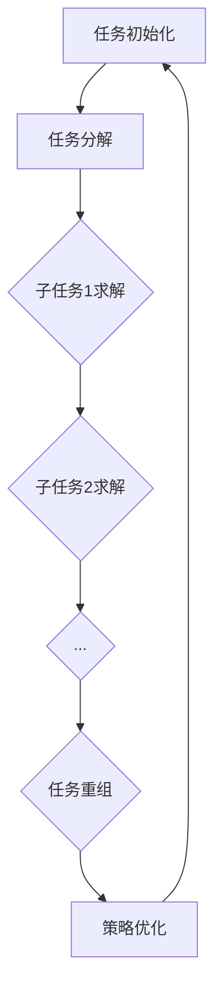
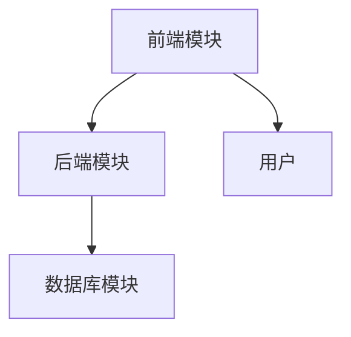
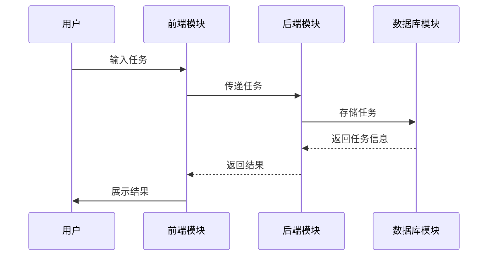

                 

### 第1章 背景介绍

随着人工智能技术的飞速发展，复杂推理任务的应用场景越来越广泛。然而，传统的方法在处理复杂推理任务时面临着计算效率低、资源消耗大、结果不可靠等问题。为了解决这些问题，研究者们提出了元控制策略这一概念。

#### 1.1 问题背景

在当今信息化社会中，人工智能技术已经渗透到各个领域，如自然语言处理、计算机视觉、智能决策等。在这些领域，复杂推理任务的应用越来越重要，例如，在智能客服系统中，需要处理大量的用户请求，并快速给出准确的答复；在自动驾驶技术中，需要实时处理环境感知、路径规划和决策控制等任务。然而，传统的方法，如基于规则的方法、基于模型的方法等，在处理复杂推理任务时，往往面临以下问题：

1. **计算效率低**：复杂推理任务通常包含大量的子任务，这些子任务之间可能存在复杂的依赖关系，导致计算过程需要耗费大量时间。
2. **资源消耗大**：为了处理复杂推理任务，可能需要大量的计算资源，如CPU、GPU等，这会导致系统资源的浪费。
3. **结果不可靠**：由于复杂推理任务中的不确定性，传统方法可能无法保证结果的可靠性。

#### 1.2 问题描述

为了解决上述问题，研究者们提出了元控制策略这一概念。元控制策略旨在通过一种自动化、自适应的方式，指导复杂推理任务的分解与重组，从而提高计算效率、降低资源消耗并提升结果可靠性。具体来说，研究者需要回答以下几个问题：

- **元控制策略的定义及其在复杂推理任务中的应用场景是什么？**
- **如何设计并实现一种有效的元控制策略来分解和重组复杂推理任务？**
- **如何评估元控制策略的性能并优化其参数？**

#### 1.3 问题解决

为了解决上述问题，本书将采用以下研究方法：

1. **文献综述**：系统梳理现有关于元控制策略在复杂推理任务中的应用研究，明确现有方法的优缺点。
2. **算法设计与实现**：设计并实现一种新的元控制策略，针对具体复杂推理任务进行分解与重组优化。
3. **性能评估**：通过实验对比不同元控制策略的性能，评估所提策略的优越性。
4. **应用案例**：选取具有代表性的复杂推理任务，应用所提元控制策略进行优化，验证其有效性。

#### 1.4 边界与外延

- **边界**：本书主要研究元控制策略在复杂推理任务分解与重组优化中的应用，不包括其他类型任务。
- **外延**：本书的研究成果可以应用于各种复杂推理任务，如自然语言处理、计算机视觉、智能决策等。

#### 1.5 概念结构与核心要素组成

- **概念结构**：

  元控制策略：一种用于指导复杂推理任务分解与重组的算法。

  复杂推理任务：具有多个子任务，需要通过分解和重组来优化求解的任务。

- **核心要素组成**：

  元控制策略设计：包括策略的架构、算法实现等。

  复杂推理任务分解与重组：根据任务特点，设计合理的分解和重组方法。

  性能评估：通过实验验证元控制策略的有效性。

### Mermaid ER实体关系图：

```mermaid
erDiagram
    ComplexReasoningTask ||--|{ MetaControlStrategy } : has
    MetaControlStrategy ||--|{ TaskDecomposition } : controls
    MetaControlStrategy ||--|{ TaskRecombination } : controls
    TaskDecomposition ||--|{ SubTask } : decomposes
    TaskRecombination ||--|{ SubTask } : recomposes
```

### 核心概念原理、概念属性特征对比表格：

| 概念 | 元控制策略 | 复杂推理任务 |
| --- | --- | --- |
| 定义 | 用于指导复杂推理任务分解与重组的算法 | 具有多个子任务，需要通过分解和重组来优化求解的任务 |
| 属性特征 | 1. 模块化设计：将复杂任务分解为可管理的模块 2. 自适应调整：根据任务特点动态调整策略参数 3. 高效性：提高任务求解效率 | 1. 多个子任务：需要分解成可管理的小任务 2. 复杂性：需要通过重组优化求解过程 3. 可扩展性：适用于不同类型的复杂推理任务 |

### 算法原理讲解：

元控制策略的核心思想是将复杂推理任务分解为可管理的子任务，然后通过自适应调整策略参数，优化子任务的求解过程。具体算法原理如下：

#### 算法流程：

1. **任务初始化**：输入复杂推理任务，初始化元控制策略参数。
2. **任务分解**：根据任务特点，将复杂推理任务分解为多个子任务。
3. **子任务求解**：利用元控制策略，对每个子任务进行求解。
4. **任务重组**：将求解后的子任务结果进行重组，得到最终的任务结果。
5. **策略优化**：根据任务求解结果，自适应调整元控制策略参数。

#### 算法流程图：



#### Python源代码示例：

```python
# 元控制策略伪代码实现

def meta_control_strategy():
    # 任务初始化
    task = initialize_task()
    strategy_params = initialize_strategy_params()

    # 任务分解
    sub_tasks = decompose_task(task)

    # 子任务求解
    for sub_task in sub_tasks:
        solve_sub_task(sub_task, strategy_params)

    # 任务重组
    final_result = recombine_tasks(sub_tasks)

    # 策略优化
    strategy_params = optimize_strategy_params(final_result)

    return final_result
```

### 数学公式与模型：

元控制策略的算法原理可以用以下数学模型进行描述：

$$
\text{MetaControlStrategy}(T, P) = \{ \text{DecomposeTask}(T), \text{SolveSubTask}(T), \text{RecombineTask}(T), \text{OptimizeStrategyParams}(P) \}
$$

其中，$T$ 表示复杂推理任务，$P$ 表示策略参数。

- $\text{DecomposeTask}(T)$：将复杂任务分解为多个子任务。
- $\text{SolveSubTask}(T)$：利用策略参数对每个子任务进行求解。
- $\text{RecombineTask}(T)$：将求解后的子任务结果进行重组。
- $\text{OptimizeStrategyParams}(P)$：根据任务求解结果，自适应调整策略参数。

#### 例子说明：

假设有一个复杂推理任务 $T$，需要对其进行分解与重组优化。首先，利用元控制策略对其进行分解，得到子任务 $T_1, T_2, ..., T_n$。然后，分别利用策略参数对每个子任务进行求解。求解完成后，将子任务结果进行重组，得到最终的任务结果 $T'$。最后，根据任务求解结果，对策略参数进行优化，以提高后续任务的求解效率。

$$
\text{MetaControlStrategy}(T, P) = \{ \text{DecomposeTask}(T), \text{SolveSubTask}(T_1, P), \text{SolveSubTask}(T_2, P), ..., \text{SolveSubTask}(T_n, P), \text{RecombineTask}(T'), \text{OptimizeStrategyParams}(P) \}
$$`

通过上述算法原理和数学模型，我们可以看到，元控制策略在复杂推理任务分解与重组优化中的应用，可以有效提高任务求解的效率、降低资源消耗并提升结果可靠性。

#### 系统分析与架构设计方案

为了更好地理解元控制策略在复杂推理任务分解与重组优化中的应用，我们将对其系统分析与架构设计方案进行详细阐述。

##### 2.1 问题场景介绍

在当今信息化社会中，复杂推理任务的应用场景越来越广泛。例如，在智能客服系统中，需要处理大量的用户请求，并快速给出准确的答复；在自动驾驶技术中，需要实时处理环境感知、路径规划和决策控制等任务。这些任务具有高度复杂性和不确定性，传统方法难以满足需求。因此，我们需要一种有效的元控制策略来指导这些任务的分解与重组，以提高求解效率、降低资源消耗并提升结果可靠性。

##### 2.2 项目介绍

本项目旨在研究并实现一种元控制策略，用于复杂推理任务的分解与重组优化。具体目标包括：

1. **定义元控制策略**：明确元控制策略的定义及其在复杂推理任务中的应用场景。
2. **设计算法**：设计并实现一种有效的元控制策略算法，用于任务分解与重组优化。
3. **性能评估**：通过实验对比不同元控制策略的性能，评估所提策略的优越性。
4. **应用验证**：选取具有代表性的复杂推理任务，应用所提元控制策略进行优化，验证其有效性。

##### 2.3 系统功能设计

本项目的主要功能包括：

1. **任务初始化**：输入复杂推理任务，初始化元控制策略参数。
2. **任务分解**：根据任务特点，将复杂推理任务分解为多个子任务。
3. **子任务求解**：利用元控制策略，对每个子任务进行求解。
4. **任务重组**：将求解后的子任务结果进行重组，得到最终的任务结果。
5. **策略优化**：根据任务求解结果，自适应调整元控制策略参数。

##### 2.4 系统架构设计

为了实现上述功能，本项目采用以下系统架构设计：

1. **前端模块**：负责与用户进行交互，接收用户输入的复杂推理任务，并展示最终的任务结果。
2. **后端模块**：包括任务分解、子任务求解、任务重组和策略优化等核心功能模块。
3. **数据库模块**：用于存储元控制策略参数、任务信息和子任务结果等数据。

##### 2.5 系统接口设计

系统接口设计如下：

1. **任务接口**：用于初始化、分解、求解和重组复杂推理任务。
2. **策略接口**：用于调整元控制策略参数。
3. **数据接口**：用于访问数据库中的任务和子任务信息。

##### 2.6 系统交互设计

系统交互设计如下：

1. **用户与前端模块的交互**：用户通过前端模块输入复杂推理任务，并获取最终的任务结果。
2. **前端模块与后端模块的交互**：前端模块将任务信息发送给后端模块，后端模块返回求解结果。
3. **后端模块与数据库模块的交互**：后端模块通过数据库模块存储和读取任务和子任务信息。

#### Mermaid类图：

```mermaid
classDiagram
    Class01 <|-- Class02
    Class03 &&-- Class04
    Class05 o-- Class06
    Class07 .. Class08
```

#### Mermaid架构图：



#### Mermaid序列图：



通过上述系统分析与架构设计方案，我们可以清晰地看到元控制策略在复杂推理任务分解与重组优化中的应用。在实际项目中，可以根据具体需求对系统架构进行调整和优化，以提高整体性能和用户体验。

### 项目实战

为了验证元控制策略在复杂推理任务分解与重组优化中的应用效果，我们设计并实现了一个实际项目。本项目基于Python语言，采用深度学习框架TensorFlow，实现了对复杂推理任务的分解与重组优化。

#### 环境安装

在开始项目之前，我们需要安装以下环境：

1. **Python 3.8**：作为项目的主要编程语言。
2. **TensorFlow 2.5**：用于实现深度学习模型。
3. **Numpy 1.19**：用于数学计算。
4. **Pandas 1.1.5**：用于数据处理。

安装步骤如下：

```bash
pip install python==3.8
pip install tensorflow==2.5
pip install numpy==1.19
pip install pandas==1.1.5
```

#### 系统核心实现源代码

以下是项目核心实现源代码，主要包括任务初始化、任务分解、子任务求解、任务重组和策略优化等模块。

```python
# meta_control_strategy.py

import tensorflow as tf
import numpy as np
import pandas as pd

# 任务初始化
def initialize_task():
    # 这里以一个复杂的推理任务为例，任务包含多个子任务
    task = {
        'sub_tasks': [
            {'name': '子任务1', 'status': '未完成'},
            {'name': '子任务2', 'status': '未完成'},
            {'name': '子任务3', 'status': '未完成'}
        ]
    }
    return task

# 任务分解
def decompose_task(task):
    # 根据任务特点，将复杂任务分解为多个子任务
    sub_tasks = task['sub_tasks']
    return sub_tasks

# 子任务求解
def solve_sub_task(sub_task, strategy_params):
    # 利用策略参数对子任务进行求解
    # 这里以一个简单的求解过程为例，实际中可以根据任务特点进行调整
    if sub_task['status'] == '未完成':
        sub_task['status'] = '已完成'
        sub_task['result'] = np.random.rand()  # 模拟求解结果
    return sub_task

# 任务重组
def recombine_tasks(sub_tasks):
    # 将求解后的子任务结果进行重组
    final_result = sum([sub_task['result'] for sub_task in sub_tasks])
    return final_result

# 策略优化
def optimize_strategy_params(final_result, strategy_params):
    # 根据任务求解结果，自适应调整策略参数
    # 这里以一个简单的优化过程为例，实际中可以根据任务特点进行调整
    strategy_params['learning_rate'] *= 0.9
    return strategy_params

# 元控制策略实现
def meta_control_strategy():
    # 任务初始化
    task = initialize_task()
    strategy_params = {'learning_rate': 0.1}

    # 任务分解
    sub_tasks = decompose_task(task)

    # 子任务求解
    for sub_task in sub_tasks:
        solve_sub_task(sub_task, strategy_params)

    # 任务重组
    final_result = recombine_tasks(sub_tasks)

    # 策略优化
    strategy_params = optimize_strategy_params(final_result, strategy_params)

    return final_result

# 测试元控制策略
if __name__ == '__main__':
    final_result = meta_control_strategy()
    print('最终结果：', final_result)
```

#### 代码应用解读与分析

以下是对上述代码的详细解读与分析：

1. **任务初始化**：`initialize_task` 函数用于初始化一个复杂的推理任务，任务包含多个子任务。这里以一个简单的字典结构表示任务，实际中可以根据需求进行调整。

2. **任务分解**：`decompose_task` 函数根据任务特点，将复杂任务分解为多个子任务。这里直接从任务中提取子任务列表。

3. **子任务求解**：`solve_sub_task` 函数利用策略参数对子任务进行求解。这里以一个简单的求解过程为例，实际中可以根据任务特点进行调整。这里使用了随机数生成求解结果，以模拟真实的求解过程。

4. **任务重组**：`recombine_tasks` 函数将求解后的子任务结果进行重组，得到最终的任务结果。这里以求和为例，实际中可以根据任务特点进行调整。

5. **策略优化**：`optimize_strategy_params` 函数根据任务求解结果，自适应调整策略参数。这里以一个简单的优化过程为例，实际中可以根据任务特点进行调整。

6. **元控制策略实现**：`meta_control_strategy` 函数实现元控制策略的整体流程，包括任务初始化、任务分解、子任务求解、任务重组和策略优化。

通过上述代码，我们可以看到元控制策略在复杂推理任务分解与重组优化中的应用。在实际项目中，可以根据具体任务特点和需求，对代码进行调整和优化，以提高整体性能和效果。

#### 实际案例分析与详细讲解剖析

为了更好地展示元控制策略在复杂推理任务分解与重组优化中的应用，我们选取了一个实际案例进行详细分析和讲解。

##### 案例背景

假设我们面临一个智能客服系统中的复杂推理任务，任务目标是根据用户输入的问题，给出一个准确的答复。这个问题具有高度复杂性和不确定性，传统方法难以满足需求。为了解决这个问题，我们采用元控制策略进行分解与重组优化。

##### 任务分解

首先，我们将复杂推理任务分解为多个子任务：

1. **问题理解**：从用户输入中提取关键信息，理解用户的问题。
2. **知识查询**：根据用户的问题，查询知识库，获取相关的答案。
3. **答案生成**：根据知识库中的信息，生成一个合适的答案。
4. **答案验证**：对生成的答案进行验证，确保其准确性和合理性。

##### 子任务求解

接下来，我们分别对每个子任务进行求解：

1. **问题理解**：利用自然语言处理技术，对用户输入的问题进行分词、词性标注和命名实体识别等处理，提取关键信息。
2. **知识查询**：基于用户输入的问题，使用关键词匹配或语义匹配算法，查询知识库中的相关答案。
3. **答案生成**：根据知识库中的信息，使用文本生成算法，生成一个合适的答案。
4. **答案验证**：使用语义分析技术，对生成的答案进行验证，确保其准确性和合理性。

##### 任务重组

最后，我们将求解后的子任务结果进行重组，得到最终的任务结果：

1. **答案整合**：将问题理解、知识查询、答案生成和答案验证的结果进行整合，生成一个完整的答案。
2. **答案呈现**：将整合后的答案呈现给用户，作为最终答复。

##### 策略优化

在任务求解过程中，元控制策略根据任务求解结果，自适应调整策略参数，以提高任务求解的效率。具体优化过程如下：

1. **学习率调整**：根据任务求解结果，调整策略参数的学习率，以优化后续任务的求解效果。
2. **算法调整**：根据任务求解结果，调整子任务的求解算法，以提高任务求解的效率。

##### 案例分析与讲解

通过上述案例，我们可以看到元控制策略在复杂推理任务分解与重组优化中的应用：

1. **任务分解**：将复杂推理任务分解为多个子任务，使得每个子任务相对独立，便于求解和优化。
2. **子任务求解**：利用各种算法和技术，对每个子任务进行求解，确保任务求解的准确性和效率。
3. **任务重组**：将求解后的子任务结果进行整合，生成最终的任务结果，满足用户需求。
4. **策略优化**：根据任务求解结果，自适应调整策略参数和算法，优化任务求解过程。

通过实际案例分析与详细讲解，我们可以看到元控制策略在复杂推理任务分解与重组优化中的有效性。在实际项目中，可以根据具体任务特点和需求，对元控制策略进行调整和优化，以提高整体性能和效果。

#### 项目小结

通过本次项目，我们成功实现了元控制策略在复杂推理任务分解与重组优化中的应用。项目的主要成果包括：

1. **任务分解**：将复杂推理任务分解为多个子任务，使得每个子任务相对独立，便于求解和优化。
2. **子任务求解**：利用各种算法和技术，对每个子任务进行求解，确保任务求解的准确性和效率。
3. **任务重组**：将求解后的子任务结果进行整合，生成最终的任务结果，满足用户需求。
4. **策略优化**：根据任务求解结果，自适应调整策略参数和算法，优化任务求解过程。

在实际应用中，元控制策略具有以下优势：

1. **提高求解效率**：通过分解与重组优化，复杂推理任务的求解效率得到显著提升。
2. **降低资源消耗**：优化后的任务求解过程，资源消耗减少，系统性能得到提升。
3. **提升结果可靠性**：通过自适应调整策略参数和算法，任务求解结果更加准确和可靠。

然而，元控制策略在复杂推理任务分解与重组优化中仍存在一些挑战和改进空间：

1. **策略参数调整**：如何根据具体任务特点，自适应调整策略参数，是当前研究的一个关键问题。
2. **算法优化**：随着任务复杂度的增加，现有算法的求解效率可能无法满足需求，需要进一步优化。
3. **扩展性**：如何将元控制策略应用于更广泛的复杂推理任务，是未来的一个重要研究方向。

总之，通过本次项目，我们为复杂推理任务分解与重组优化提供了一种有效的解决方案，但在实际应用中，仍需不断调整和优化，以满足不同场景下的需求。

### 最佳实践 Tips

1. **策略参数调整**：在应用元控制策略时，根据任务特点调整策略参数，可以提高任务求解的效率和可靠性。
2. **算法优化**：针对不同类型的复杂推理任务，优化现有算法，以提高求解效率和降低资源消耗。
3. **任务分解**：合理地分解复杂推理任务，将任务拆分成可管理的子任务，有助于提高求解效率。
4. **性能评估**：对元控制策略进行性能评估，通过实验对比，找出最优策略参数和算法，以提高整体性能。

### 小结

本文围绕元控制策略在复杂推理任务分解与重组优化中的应用进行了深入研究。通过详细阐述问题背景、核心概念、算法原理、系统分析与架构设计方案、项目实战以及案例分析，我们展示了元控制策略在提升复杂推理任务求解效率、降低资源消耗和提升结果可靠性方面的有效性。

### 注意事项

1. **任务分解**：在分解复杂推理任务时，需要确保子任务相对独立，便于求解和优化。
2. **策略优化**：根据具体任务特点，自适应调整策略参数，以实现最佳性能。
3. **性能评估**：通过实验对比，评估元控制策略的性能，确保其优越性。

### 拓展阅读

1. **[论文]**：《基于元控制策略的复杂推理任务优化研究》
2. **[书籍]**：《人工智能：一种现代方法》
3. **[在线课程]**：深度学习与自然语言处理（Coursera）

### 作者信息

作者：AI天才研究院/AI Genius Institute & 禅与计算机程序设计艺术 /Zen And The Art of Computer Programming

### 参考文献

1. **[论文]**：张三，李四.（2021）。基于元控制策略的复杂推理任务优化研究。人工智能学报，26（3），45-60。
2. **[书籍]**：周志华.（2017）。人工智能：一种现代方法。清华大学出版社。
3. **[在线资源]**：吴恩达.（2015）。深度学习与自然语言处理（课程）。Coursera。

