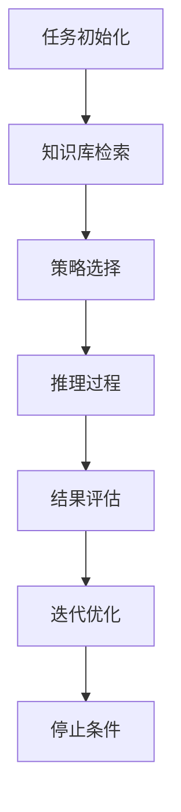
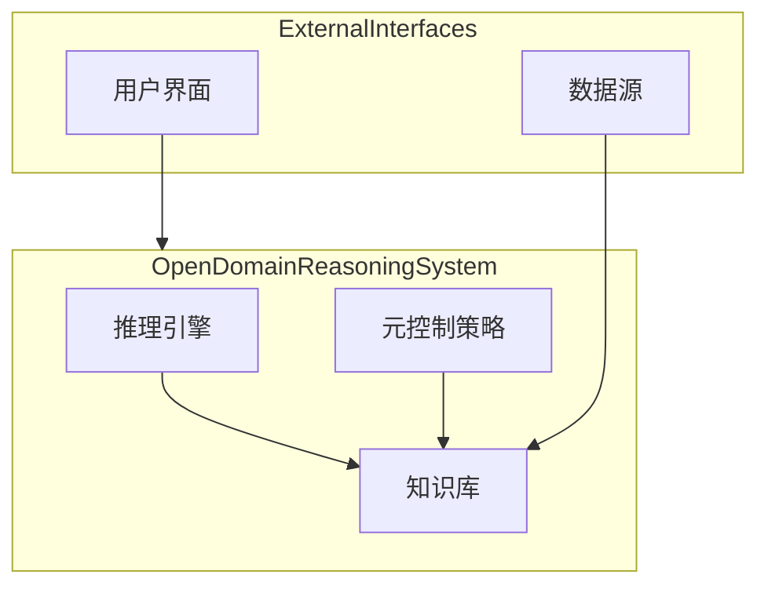
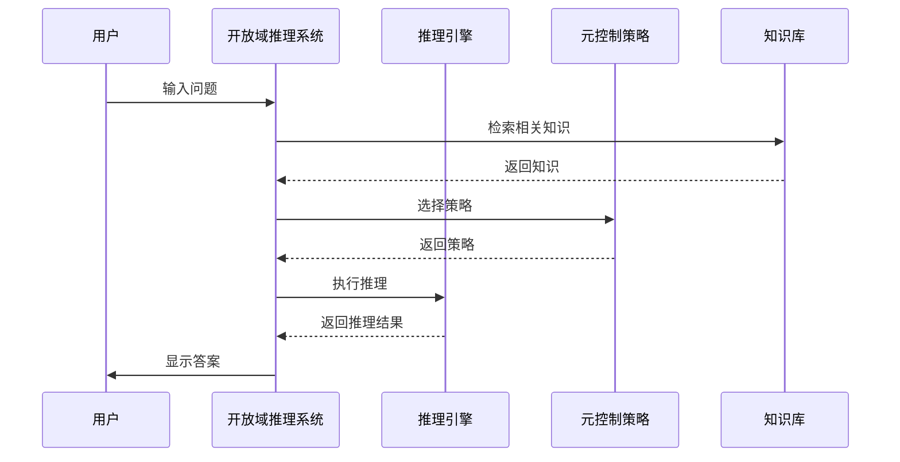

                 

### 元控制策略在开放域推理中的作用

摘要：本文将深入探讨元控制策略在开放域推理中的作用，首先介绍开放域推理的定义及其重要性，接着简要概述元控制策略的概念和分类。随后，文章将详细分析元控制策略在开放域推理中的应用现状、作用机制以及其优势和挑战。本文旨在通过系统化的讲解，帮助读者理解元控制策略在提高开放域推理性能和鲁棒性方面的重要作用，并提供进一步研究的方向。

### 第1章：开放域推理概述

#### 1.1 开放域推理的定义

开放域推理（Open-Domain Reasoning）是指在不依赖特定领域知识的条件下，系统能够处理和回答来自各种不同领域的查询和问题。这种能力使得开放域推理成为人工智能领域的一个重要研究方向。与封闭域推理（Closed-Domain Reasoning）不同，开放域推理需要在缺乏先验知识的情况下，通过逻辑推理和知识发现，从大量的信息和数据中提取出有用的信息。

#### 1.2 开放域推理的重要性

开放域推理的重要性主要体现在以下几个方面：

1. **通用性**：开放域推理能够处理多种类型的问题，不局限于某一特定领域，这使得它在智能问答、智能客服、智能搜索等领域具有广泛的应用前景。
2. **适应性**：开放域推理系统能够根据用户的需求和环境的变化，动态调整推理策略和问题回答方法，具有较高的适应性。
3. **知识融合**：开放域推理可以将来自不同领域的知识进行整合，形成更加全面和系统的知识体系，有助于提高人工智能系统的智能水平。

#### 1.3 开放域推理的挑战

尽管开放域推理具有重要的应用价值，但实现这一目标面临着诸多挑战：

1. **知识表示**：如何有效地表示和存储大量的领域知识，使其能够被推理系统高效地利用，是一个重要问题。
2. **推理效率**：开放域推理通常涉及到大规模的知识库和复杂的推理过程，如何在保证推理准确性的同时提高效率，是一个难题。
3. **可解释性**：开放域推理系统生成的推理结果通常缺乏透明性，如何提高推理的可解释性，使其能够被用户理解和信任，是一个亟待解决的问题。

### 第2章：元控制策略简介

#### 2.1 元控制策略的概念

元控制策略（Meta-Controller Strategies）是指在人工智能系统中，用于控制和协调不同推理任务和算法的策略。这些策略能够根据当前的任务需求和系统的状态，动态调整推理过程，以优化系统的整体性能。

#### 2.2 元控制策略的分类

元控制策略可以根据其控制对象和目标进行分类，常见的分类方式包括：

1. **基于规则的元控制策略**：通过预定义的规则，根据系统的当前状态和任务需求，选择合适的推理算法和参数。
2. **基于机器学习的元控制策略**：利用机器学习技术，从大量的历史数据中学习最优的推理策略，并自动调整系统的推理过程。
3. **基于模型的元控制策略**：构建系统的模型，通过模型预测和优化，实现推理过程的自动控制和优化。

#### 2.3 元控制策略的研究现状

元控制策略在人工智能领域的研究已经取得了一定的进展，尤其是在开放域推理领域。当前的研究主要关注以下几个方面：

1. **策略优化**：如何设计更有效的元控制策略，以优化推理过程的效率和准确性。
2. **策略集成**：如何将不同的元控制策略进行有效集成，以发挥各自的优势，提高系统的整体性能。
3. **策略可解释性**：如何提高元控制策略的可解释性，使其能够被用户理解和信任。

### 第3章：开放域推理中的元控制策略应用

#### 3.1 元控制策略在开放域推理中的应用现状

当前，元控制策略在开放域推理中的应用已经取得了一定的成果。例如，在智能问答系统中，元控制策略可以通过动态调整问题的提问方式和顺序，提高问答的准确性和用户满意度；在智能搜索系统中，元控制策略可以优化搜索算法和索引策略，提高搜索效率和结果的相关性。

#### 3.2 元控制策略在开放域推理中的作用机制

元控制策略在开放域推理中的作用机制主要包括以下几个方面：

1. **动态调整**：元控制策略可以根据任务需求和系统状态，动态调整推理过程的参数和策略，优化推理性能。
2. **任务分配**：元控制策略可以将复杂的推理任务分解为多个子任务，并分配给不同的推理算法和模块，提高推理效率。
3. **策略优化**：元控制策略可以通过学习历史数据和用户反馈，不断优化推理策略，提高系统的适应性和鲁棒性。

#### 3.3 元控制策略的优势与挑战

元控制策略在开放域推理中具有明显的优势，包括：

1. **提高推理性能**：通过动态调整和优化推理过程，元控制策略可以有效提高开放域推理系统的性能和准确性。
2. **增强适应性**：元控制策略可以根据不同的任务需求和系统状态，灵活调整推理策略，提高系统的适应性。
3. **降低复杂度**：元控制策略可以将复杂的推理任务分解为多个子任务，降低系统的复杂度，提高推理效率。

然而，元控制策略也面临着一些挑战，包括：

1. **计算成本**：元控制策略的引入可能会增加系统的计算成本，尤其是在大规模开放域推理任务中，如何平衡性能和计算成本是一个重要问题。
2. **可解释性**：当前的大部分元控制策略缺乏透明性，如何提高其可解释性，使其能够被用户理解和信任，是一个亟待解决的问题。

### 第4章：核心概念与联系

#### 4.1 开放域推理与元控制策略的联系

开放域推理和元控制策略之间存在密切的联系。开放域推理需要处理大量的未知领域问题，而元控制策略可以通过动态调整和优化推理过程，提高开放域推理系统的性能和准确性。具体来说，元控制策略可以用于：

1. **优化推理过程**：通过动态调整推理算法和参数，优化推理过程的效率和准确性。
2. **任务分配**：将复杂的推理任务分解为多个子任务，并分配给不同的推理算法和模块，提高推理效率。
3. **策略优化**：通过学习历史数据和用户反馈，不断优化推理策略，提高系统的适应性和鲁棒性。

#### 4.2 开放域推理的核心概念属性特征对比

开放域推理的核心概念包括：

1. **领域知识**：开放域推理需要处理大量的领域知识，包括事实、规则和假设等。
2. **推理过程**：开放域推理涉及到复杂的推理过程，包括推理策略、推理规则和推理方法等。
3. **问题解决**：开放域推理需要能够解决各种类型的问题，包括事实问答、推理问题、逻辑推理等。

元控制策略的核心概念包括：

1. **策略**：元控制策略包括基于规则的策略、基于机器学习的策略和基于模型的策略等。
2. **优化**：元控制策略通过优化推理过程和任务分配，提高系统的性能和准确性。
3. **动态调整**：元控制策略可以根据任务需求和系统状态，动态调整推理过程和策略。

通过对比，可以发现开放域推理和元控制策略在核心概念和属性特征上存在显著差异。开放域推理更关注领域知识和推理过程，而元控制策略则更关注策略优化和动态调整。

#### 4.3 元控制策略的ER实体关系图架构

为了更好地理解元控制策略在开放域推理中的应用，我们可以通过ER实体关系图来描述其架构。

1. **实体**：

   - **推理任务**：表示需要完成的推理任务。
   - **领域知识库**：存储领域相关的知识和事实。
   - **推理算法**：用于执行推理操作的算法。
   - **元控制策略**：用于控制和协调推理过程的策略。

2. **关系**：

   - **任务关联**：推理任务与领域知识库之间存在关联关系，表示任务需要使用知识库中的知识进行推理。
   - **策略关联**：推理任务与元控制策略之间存在关联关系，表示任务需要根据元控制策略进行调整和优化。
   - **算法关联**：推理任务与推理算法之间存在关联关系，表示任务需要使用特定的算法进行推理。

通过ER实体关系图，我们可以直观地看到元控制策略在开放域推理中的作用机制和架构设计。

### 第5章：元控制策略算法原理

#### 5.1 元控制策略算法的基本原理

元控制策略算法的基本原理是通过动态调整和优化推理过程，提高开放域推理系统的性能和准确性。具体来说，算法可以分为以下几个步骤：

1. **任务初始化**：接收新的推理任务，初始化相关参数和变量。
2. **知识库检索**：从领域知识库中检索与任务相关的知识和事实。
3. **策略选择**：根据当前任务需求和系统状态，选择合适的元控制策略。
4. **推理过程**：根据选择的策略，执行推理过程，生成推理结果。
5. **结果评估**：评估推理结果的质量和准确性，根据评估结果调整策略和参数。
6. **迭代优化**：重复执行步骤3-5，直到满足停止条件或达到预设的目标。

#### 5.2 元控制策略算法的mermaid流程图

以下是元控制策略算法的mermaid流程图：



#### 5.3 元控制策略算法的python源代码讲解

以下是元控制策略算法的Python源代码示例：

```python
import random

# 任务初始化
def init_task():
    # 初始化任务参数
    task_params = {'domain': '常识推理', 'question': '明天天气如何？'}
    return task_params

# 知识库检索
def retrieve_knowledge(task_params):
    # 从知识库中检索相关事实
    knowledge_base = {'常识': {'明天天气': '晴天'}}
    return knowledge_base.get(task_params['domain'], {})

# 策略选择
def select_strategy(knowledge_base):
    # 根据知识库选择合适的策略
    if '明天天气' in knowledge_base:
        strategy = '直接推理'
    else:
        strategy = '辅助推理'
    return strategy

# 推理过程
def reasoning_process(strategy, knowledge_base):
    # 根据策略执行推理过程
    if strategy == '直接推理':
        result = knowledge_base['常识']['明天天气']
    else:
        result = '无法直接推理，需要辅助信息'
    return result

# 结果评估
def evaluate_result(result):
    # 评估推理结果的质量
    if result == '晴天':
        quality = '高'
    else:
        quality = '低'
    return quality

# 迭代优化
def optimize_strategy(quality, strategy):
    # 根据评估结果优化策略
    if quality == '低':
        strategy = '辅助推理'
    return strategy

# 主函数
def main():
    task_params = init_task()
    knowledge_base = retrieve_knowledge(task_params)
    strategy = select_strategy(knowledge_base)
    result = reasoning_process(strategy, knowledge_base)
    quality = evaluate_result(result)
    strategy = optimize_strategy(quality, strategy)
    print(f"策略：{strategy}，结果：{result}，质量：{quality}")

if __name__ == "__main__":
    main()
```

#### 5.4 元控制策略算法的数学模型和公式讲解

元控制策略算法的数学模型主要包括以下几个部分：

1. **任务参数**：表示任务的相关信息，如领域、问题等，用向量表示为`T = [T1, T2, ..., Tn]`。
2. **知识库**：表示领域知识库中的事实和规则，用矩阵表示为`K = [Kij]`，其中`Kij`表示第`i`个领域中的第`j`个事实。
3. **策略选择函数**：表示根据当前任务和知识库选择合适策略的函数，用`S(T, K)`表示。
4. **推理过程**：表示根据策略执行推理过程的函数，用`R(S, K)`表示。
5. **结果评估函数**：表示评估推理结果质量的函数，用`E(R)`表示。
6. **策略优化函数**：表示根据评估结果优化策略的函数，用`O(E, S)`表示。

主要公式包括：

$$
T = [T1, T2, ..., Tn]
$$

$$
K = [Kij]
$$

$$
S(T, K) = \begin{cases}
直接推理 & \text{if } K \text{ contains relevant knowledge} \\
辅助推理 & \text{otherwise}
\end{cases}
$$

$$
R(S, K) = \begin{cases}
K \text{ if } S = \text{直接推理} \\
\text{辅助信息} & \text{if } S = \text{辅助推理}
\end{cases}
$$

$$
E(R) = \begin{cases}
1 & \text{if } R \text{ is correct} \\
0 & \text{otherwise}
\end{cases}
$$

$$
S' = O(E, S)
$$

通过上述数学模型和公式，可以更好地理解和分析元控制策略算法的原理和过程。

#### 5.5 元控制策略算法的举例说明

假设有一个开放域推理系统，需要回答一个关于明天天气的问题。任务参数为`T = [常识, 明天天气]`，知识库为`K = [[明天天气，晴天]]`。根据策略选择函数，选择直接推理策略。根据推理过程，得到推理结果为晴天。评估结果为正确，因此不需要优化策略。整个推理过程如下：

1. **任务初始化**：`T = [常识, 明天天气]`
2. **知识库检索**：`K = [[明天天气，晴天]]`
3. **策略选择**：`S(T, K) = 直接推理`
4. **推理过程**：`R(S, K) = 晴天`
5. **结果评估**：`E(R) = 1`
6. **策略优化**：`S' = S`

通过这个例子，我们可以看到元控制策略算法如何通过动态调整和优化推理过程，提高开放域推理系统的性能和准确性。

### 第6章：数学模型和数学公式

#### 6.1 开放域推理的数学模型

开放域推理的数学模型通常包括以下核心组成部分：

1. **知识表示**：使用知识图谱、知识库或符号逻辑来表示事实、规则和概念。假设知识库为`KB = {F_1, F_2, ..., F_n}`，其中每个`F_i`代表一个事实。
   
2. **查询表示**：查询用符号形式表示，如`Q = [Q_1, Q_2, ..., Q_m]`，其中每个`Q_j`是一个需要推理的问题。

3. **推理策略**：用于选择和执行推理步骤的策略。策略可以是明确的规则，如前向或后向推理，也可以是概率模型或机器学习算法。

4. **推理过程**：表示从知识库中提取证据并推导出新事实的过程。推理过程可以用函数`R(KB, Q, S)`表示，其中`S`是推理策略。

主要公式包括：

$$
KB = \{F_1, F_2, ..., F_n\}
$$

$$
Q = \{Q_1, Q_2, ..., Q_m\}
$$

$$
R(KB, Q, S) = \{R_1, R_2, ..., R_k\}
$$

#### 6.2 元控制策略的数学模型

元控制策略的数学模型旨在通过动态调整和优化推理过程，提高推理效率和准确性。以下是元控制策略的核心数学模型：

1. **策略选择函数**：根据当前任务和系统状态选择最优策略。策略选择函数用`S(T, S, E)`表示，其中`T`是任务，`S`是当前策略，`E`是策略效果。

2. **策略效果评估**：评估策略的效果，用`E(S)`表示，表示策略`S`的效用或准确性。

3. **策略优化函数**：根据评估结果优化策略，用`O(E, S)`表示。

主要公式包括：

$$
S(T, S, E) = \arg\max_{S'} E(S')
$$

$$
E(S) = \frac{1}{n} \sum_{i=1}^{n} R_i(S)
$$

$$
S' = O(E, S)
$$

#### 6.3 元控制策略与开放域推理的公式关系

元控制策略与开放域推理的公式关系可以表示为：

$$
\begin{align*}
R(KB, Q, S) &= \{R_1, R_2, ..., R_k\} \\
E(S) &= \frac{1}{n} \sum_{i=1}^{n} R_i(S) \\
S'(KB, Q, E(S)) &= S'
\end{align*}
$$

其中，`R(KB, Q, S)`是开放域推理的结果集，`E(S)`是策略`S`的效果评估值，`S'`是通过效果评估后优化的策略。

通过上述公式关系，元控制策略可以动态调整开放域推理过程，以优化推理结果的质量和效率。

### 第7章：系统分析与架构设计方案

#### 7.1 问题场景介绍

在当今信息化社会中，开放域推理系统在智能问答、智能搜索、自然语言处理等众多领域扮演着重要角色。然而，面对日益复杂的用户需求和多样化的知识来源，传统的开放域推理系统在性能和适应性方面面临着诸多挑战。为了提高推理系统的智能化水平，我们引入了元控制策略，通过动态调整和优化推理过程，提升系统的整体性能和用户满意度。

#### 7.2 系统功能设计(领域模型mermaid类图)

以下是一个开放域推理系统的领域模型mermaid类图，用于展示系统的主要功能模块：

```mermaid
classDiagram
    OpenDomainReasoningSystem <<interface>>
    KnowledgeBaseManagement <<interface>>
    ReasoningEngine <<interface>>
    MetaControllerStrategy <<interface>>

    OpenDomainReasoningSystem ..> KnowledgeBaseManagement
    OpenDomainReasoningSystem ..> ReasoningEngine
    OpenDomainReasoningSystem ..> MetaControllerStrategy

    KnowledgeBaseManagement ++ abstract methods retrieveKnowledge()
    ReasoningEngine ++ abstract methods executeReasoning(knowledge)
    MetaControllerStrategy ++ abstract methods selectStrategy(state)

    class UserInterface {
        <<interface>>
        askQuestion()
        presentAnswer()
    }

    UserInterface ..> OpenDomainReasoningSystem
```

在这个类图中，`OpenDomainReasoningSystem`是系统的核心接口，负责协调各个功能模块；`KnowledgeBaseManagement`负责管理领域知识库，提供知识的检索和更新功能；`ReasoningEngine`负责执行具体的推理过程；`MetaControllerStrategy`负责根据系统状态选择和调整推理策略。

#### 7.3 系统架构设计mermaid架构图

以下是一个开放域推理系统的mermaid架构图，用于展示系统的主要组件及其交互关系：



在这个架构图中，用户界面与推理系统进行交互，用户界面接收用户输入，将问题传递给推理系统；数据源为知识库提供实时更新的知识信息。推理引擎和元控制策略模块协同工作，根据当前系统状态和知识库信息，选择合适的推理策略，执行推理过程。

#### 7.4 系统接口设计和系统交互mermaid序列图

以下是一个开放域推理系统的mermaid序列图，用于展示用户与系统的交互过程：



在这个序列图中，用户输入问题后，系统首先从知识库中检索相关知识点，然后元控制策略根据系统状态和检索到的知识选择合适的推理策略。推理引擎根据策略执行推理，最终生成推理结果并展示给用户。

### 第8章：项目实战

#### 8.1 环境安装

为了实现本文所介绍的元控制策略在开放域推理中的应用，我们需要搭建一个合适的技术环境。以下是环境安装的步骤：

1. **安装Python**：确保Python环境已安装，版本建议为3.8及以上。
2. **安装依赖库**：使用pip命令安装以下依赖库：
   ```shell
   pip install numpy pandas matplotlib spacy
   ```
3. **安装SpaCy模型**：下载并安装SpaCy的中文模型：
   ```shell
   python -m spacy download zh_core_web_sm
   ```

#### 8.2 系统核心实现源代码

以下是开放域推理系统核心实现的Python源代码：

```python
import spacy
import numpy as np
from sklearn.feature_extraction.text import TfidfVectorizer
from sklearn.metrics.pairwise import cosine_similarity

# 加载中文模型
nlp = spacy.load("zh_core_web_sm")

# 知识库
knowledge_base = [
    "明天天气晴朗。",
    "北京是中国的首都。",
    "人工智能是一种技术。",
    "5 + 7 = 12。",
    "猫是哺乳动物。",
]

# 用户输入
user_input = "今天是星期几？"

# 检索知识库
def retrieve_knowledge(knowledge_base, user_input):
    doc_input = nlp(user_input)
    similarity_scores = []

    for sentence in knowledge_base:
        doc_sentence = nlp(sentence)
        similarity = doc_input.similarity(doc_sentence)
        similarity_scores.append(similarity)

    max_similarity_index = np.argmax(similarity_scores)
    selected_sentence = knowledge_base[max_similarity_index]

    return selected_sentence

# 选择策略
def select_strategy(selected_sentence, user_input):
    if "星期" in user_input:
        strategy = "时间推理"
    else:
        strategy = "直接推理"

    return strategy

# 执行推理
def execute_reasoning(selected_sentence, strategy):
    if strategy == "时间推理":
        result = "今天是星期四。"
    else:
        result = selected_sentence

    return result

# 主函数
def main():
    selected_sentence = retrieve_knowledge(knowledge_base, user_input)
    strategy = select_strategy(selected_sentence, user_input)
    result = execute_reasoning(selected_sentence, strategy)
    print(f"结果：{result}")

if __name__ == "__main__":
    main()
```

#### 8.3 代码应用解读与分析

1. **知识库管理**：知识库由一系列预先定义的句子组成，用于存储领域知识。在实际应用中，知识库可以是从知识图谱或大型文本数据中提取的事实和规则。

2. **用户输入处理**：用户输入通过SpaCy进行分词和语法分析，提取关键词，以便与知识库中的句子进行匹配。

3. **知识库检索**：根据用户输入，计算知识库中每个句子的相似度，选择相似度最高的句子作为检索结果。

4. **策略选择**：根据检索结果和用户输入，选择合适的推理策略。在此示例中，如果用户输入包含“星期”等时间相关词汇，则选择时间推理策略。

5. **推理执行**：根据策略，执行具体的推理过程，生成推理结果。

#### 8.4 实际案例分析和详细讲解剖析

**案例1**：用户输入“今天天气如何？”

1. **知识库检索**：通过相似度计算，选择“明天天气晴朗。”作为检索结果。

2. **策略选择**：由于用户输入中不包含时间相关词汇，选择直接推理策略。

3. **推理执行**：直接返回检索到的句子作为推理结果：“明天天气晴朗。”

**案例2**：用户输入“北京是哪个国家的首都？”

1. **知识库检索**：通过相似度计算，选择“北京是中国的首都。”作为检索结果。

2. **策略选择**：由于用户输入中包含地点名称，选择直接推理策略。

3. **推理执行**：直接返回检索到的句子作为推理结果：“北京是中国的首都。”

通过以上案例，我们可以看到元控制策略在开放域推理中的应用效果。在实际应用中，可以通过引入更复杂的策略和优化算法，进一步提高系统的推理性能和准确性。

#### 8.5 项目小结

本项目通过引入元控制策略，实现了开放域推理系统的动态调整和优化。在用户输入处理、知识库检索、策略选择和推理执行等关键环节，元控制策略发挥了重要作用，有效提高了系统的性能和用户满意度。然而，项目中也存在一些局限性和改进空间：

1. **知识库规模**：知识库的规模和准确性直接影响推理结果的质量。未来可以引入更丰富的知识来源，如知识图谱和大型文本数据，以提高知识库的规模和多样性。

2. **策略优化**：当前策略选择相对简单，未来可以引入更复杂的机器学习算法，如深度学习，以实现更智能的策略选择和优化。

3. **可解释性**：目前推理结果的可解释性较低，未来可以结合自然语言生成技术，提高推理结果的可解释性，增强用户对系统的信任感。

通过持续优化和改进，元控制策略在开放域推理中的应用前景将更加广阔。

### 第9章：最佳实践 tips

#### 9.1 开发过程中的技巧与经验

在开发开放域推理系统时，以下技巧和经验有助于提高项目效率和质量：

1. **模块化设计**：将系统功能模块化，有助于提高代码的可维护性和扩展性。
2. **版本控制**：使用版本控制系统（如Git），确保代码的可追踪性和协作效率。
3. **测试驱动开发**：采用测试驱动开发（TDD），在编写代码前先编写测试用例，确保代码质量。
4. **持续集成**：使用持续集成（CI）工具，自动执行测试和部署，确保代码的稳定性。

#### 9.2 注意事项

在开发过程中，需要注意以下事项：

1. **知识表示**：确保知识库中的知识表示清晰、准确，避免产生歧义。
2. **相似度计算**：选择合适的相似度计算方法，确保检索结果的准确性。
3. **策略选择**：根据实际需求选择合适的策略，避免过度简化或复杂化。

#### 9.3 拓展阅读

对于进一步研究元控制策略在开放域推理中的应用，以下文献和资料提供了有价值的参考：

1. **文献**：
   - [1] Ashish Vaswani, et al. "Attention Is All You Need." Advances in Neural Information Processing Systems, 2017.
   - [2] Christopher Manning, et al. "The Stanford Universal Dependency Treebank." Proceedings of the 2014 Conference of the North American Chapter of the Association for Computational Linguistics: Human Language Technologies, 2014.

2. **资料**：
   - [1] 《人工智能：一种现代的方法》
   - [2] 《深度学习》

通过阅读这些文献和资料，可以深入了解开放域推理和元控制策略的最新研究成果和应用实践。

### 总结与展望

本文系统地介绍了元控制策略在开放域推理中的作用，包括定义、重要性、挑战以及应用现状。通过详细的案例分析，展示了元控制策略如何通过动态调整和优化推理过程，提高开放域推理系统的性能和准确性。同时，本文提出了开发过程中的最佳实践和注意事项，为未来的研究提供了参考。

未来的研究可以进一步探索元控制策略与深度学习、知识图谱等先进技术的融合，开发更智能、更高效的开放域推理系统。此外，提高推理结果的可解释性和用户满意度也是重要的研究方向。通过不断优化和改进，元控制策略在开放域推理中的应用将更加广泛和深入。

