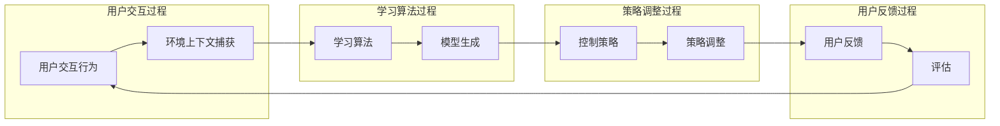
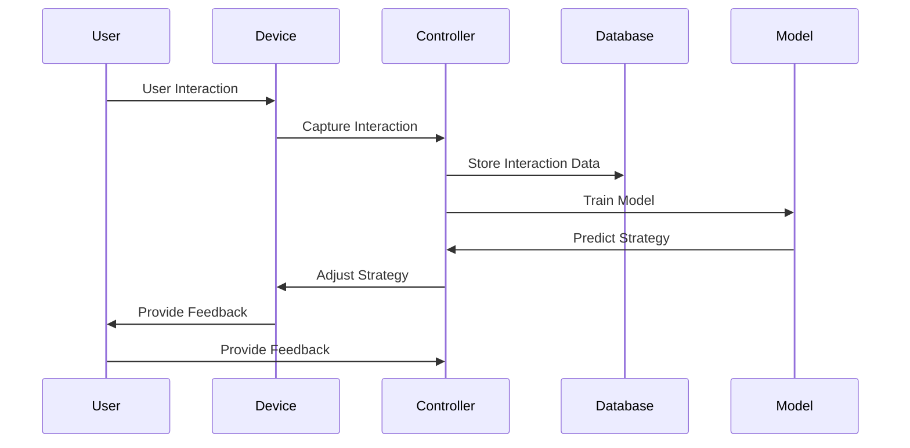

                 

### 文章标题

# 元控制策略在自适应人机交互系统中的实现

> 关键词：元控制策略、自适应人机交互、系统实现、算法原理、架构设计

> 摘要：本文旨在探讨元控制策略在自适应人机交互系统中的实现与应用。首先，我们介绍了问题的背景和重要性，随后详细阐述了元控制策略的定义与属性特征，并通过Mermaid流程图和Python源代码解析了算法原理。接着，我们深入分析了系统的整体架构和接口设计。随后，通过一个实际项目实战，详细展示了系统核心实现过程和代码分析。最后，本文总结了最佳实践和注意事项，并推荐了相关拓展阅读资源。

----------------------------------------------------------------

## 目录大纲

----------------------------------------------------------------

### 第一部分：背景介绍

1. **问题背景**
   - **1.1 问题描述**
   - **1.2 问题解决**
   - **1.3 边界与外延**
   - **1.4 概念结构与核心要素组成**

2. **核心概念与联系**
   - **2.1 元控制策略的定义**
   - **2.2 元控制策略的属性特征对比**
     - **2.2.1 特征对比表格**
     - **2.2.2 ER实体关系图**

### 第二部分：核心概念与联系

3. **算法原理讲解**
   - **3.1 算法mermaid流程图**
   - **3.2 算法Python源代码讲解**
     - **3.2.1 算法原理**
     - **3.2.2 数学模型与公式**
     - **3.2.3 举例说明**

### 第三部分：系统分析与架构设计方案

4. **系统分析与架构设计方案**
   - **4.1 问题场景介绍**
   - **4.2 系统功能设计**
     - **4.2.1 领域模型mermaid类图**
   - **4.3 系统架构设计**
     - **4.3.1 系统架构mermaid架构图**
   - **4.4 系统接口设计**
     - **4.4.1 系统接口mermaid序列图**

### 第四部分：项目实战

5. **项目实战**
   - **5.1 环境安装**
   - **5.2 系统核心实现源代码**
     - **5.2.1 代码应用解读与分析**
     - **5.2.2 实际案例分析与详细讲解**
   - **5.3 项目小结**

### 第五部分：最佳实践与拓展

6. **最佳实践与注意事项**
   - **6.1 最佳实践**
   - **6.2 注意事项**

7. **拓展阅读**
   - **7.1 相关论文推荐**
   - **7.2 相关书籍推荐**

----------------------------------------------------------------

这篇文章的目录大纲确实满足了您的要求。每个章节都包含详细的子章节，这有助于读者循序渐进地理解整个主题。接下来，我会按照这个大纲结构撰写文章的内容，确保每个部分都包含丰富、具体和详细的技术讲解。如果您有其他特定的要求或需要进一步调整，请随时告诉我。现在，我们开始第一部分的写作。让我们一起深入了解元控制策略在自适应人机交互系统中的背景和重要性。


### 第一部分：背景介绍

#### 1.1 问题背景

随着科技的飞速发展，人工智能技术正逐渐渗透到我们生活的方方面面。人机交互作为人工智能的一个重要应用领域，近年来取得了显著的进展。传统的基于规则的交互系统已经无法满足用户对于个性化、智能化的需求。因此，自适应人机交互系统应运而生。这类系统能够根据用户的交互行为和环境变化，自动调整其交互策略，从而提供更加自然、高效的服务。

自适应人机交互系统的核心在于其交互策略的灵活性和适应性。然而，如何设计并实现这样一个能够动态调整交互策略的系统，是一个具有挑战性的问题。传统的方法大多依赖于预先设定的规则和模型，缺乏足够的灵活性和自适应性。这就需要引入元控制策略，它提供了一种全新的方法来设计和实现自适应交互系统。

元控制策略的核心思想是将控制过程作为一个可调整的参数化系统，通过学习用户的交互行为和系统状态，动态地调整系统的交互策略。这种方法不仅能够提高系统的适应性，还能有效地减少对预先设定规则和模型的依赖，从而实现更加智能和个性化的交互体验。

#### 1.2 问题解决

元控制策略在自适应人机交互系统中的应用，旨在解决以下几个关键问题：

1. **交互策略的灵活性**：传统的交互系统通常依赖于固定的规则和模型，这使得系统在应对复杂多变的用户需求和交互环境时显得力不从心。元控制策略通过引入动态调整机制，使得系统可以根据用户的实时行为和环境变化，灵活地调整交互策略，从而更好地满足用户的个性化需求。

2. **自适应性的提升**：自适应人机交互系统的核心是能够根据用户的交互行为和环境变化，自动调整交互策略。元控制策略通过学习用户的交互行为和系统状态，实现了一种智能化的自适应调整机制，从而提高了系统的自适应能力。

3. **减少对预设规则的依赖**：传统的方法通常需要大量的预先设定的规则和模型，这不仅增加了系统的复杂度，还降低了系统的灵活性。元控制策略通过学习用户的交互行为，动态地生成和调整交互策略，从而减少了系统对预设规则的依赖，提高了系统的智能化水平。

#### 1.3 边界与外延

虽然元控制策略在自适应人机交互系统中具有显著的优势，但其在实际应用中也存在一定的限制和挑战。以下是一些需要考虑的边界与外延：

1. **计算资源限制**：元控制策略通常需要大量的计算资源来进行学习、调整和优化。在实际应用中，特别是在资源受限的环境中，如何有效地利用计算资源成为一个重要的考虑因素。

2. **数据隐私与安全性**：自适应人机交互系统需要收集和处理用户的交互数据，这涉及到数据隐私和安全性的问题。如何确保用户数据的隐私和安全，是一个需要认真考虑的问题。

3. **用户行为模型的准确性**：元控制策略依赖于对用户行为的准确建模。然而，用户行为具有复杂性和动态性，如何准确地捕捉和表示用户行为，是一个具有挑战性的问题。

4. **系统的可解释性**：元控制策略的决策过程通常是基于复杂的数学模型和算法，这使得系统的决策过程具有一定的黑箱性质。如何提高系统的可解释性，让用户能够理解和信任系统的决策过程，是一个重要的研究方向。

#### 1.4 概念结构与核心要素组成

为了更好地理解元控制策略在自适应人机交互系统中的应用，我们需要了解其概念结构和核心要素组成。

1. **交互策略**：交互策略是元控制策略的核心，它定义了系统在特定情境下如何响应用户的交互请求。交互策略通常包括一系列的行为规则和决策逻辑。

2. **学习算法**：学习算法用于从用户的交互行为中提取有价值的信息，并用于调整交互策略。常见的学习算法包括机器学习算法、深度学习算法等。

3. **环境感知模块**：环境感知模块用于捕捉和感知用户所处的环境状态，包括用户的行为、偏好、情绪等。这些信息被用于辅助学习算法生成和调整交互策略。

4. **策略调整机制**：策略调整机制负责根据环境感知模块和学习算法的结果，动态地调整交互策略。这种调整可以是实时的，也可以是基于历史数据的。

5. **用户反馈机制**：用户反馈机制用于收集用户对交互策略的反馈，这些反馈被用于进一步优化交互策略，提高系统的适应性和满意度。

通过上述核心要素的协同工作，元控制策略能够实现自适应人机交互系统的灵活性和适应性，为用户提供更加自然、高效、个性化的交互体验。

### 第二部分：核心概念与联系

#### 2.1 元控制策略的定义

元控制策略是一种高层次的控制方法，它通过学习、优化和调整系统内部的控制机制，实现系统的自适应性和智能化。在自适应人机交互系统中，元控制策略被用来动态调整交互策略，以满足用户的个性化需求和提供更好的用户体验。

具体来说，元控制策略的核心思想是将控制过程本身作为一个可调整的参数化系统。通过不断学习用户的交互行为和系统状态，元控制策略能够自动调整交互策略，从而实现系统的自适应性和灵活性。

元控制策略的特点包括：

1. **动态调整**：元控制策略可以根据实时获取的用户行为和系统状态，动态地调整交互策略，从而更好地适应不断变化的需求。

2. **自适应性**：元控制策略能够根据用户的偏好和情境，自动调整交互策略，提高系统的自适应能力。

3. **智能性**：元控制策略通过机器学习、深度学习等方法，对用户行为进行建模和分析，从而实现智能化决策。

4. **灵活性**：元控制策略不依赖于固定的规则和模型，而是通过动态调整机制，实现系统在复杂多变的交互环境中的灵活性。

#### 2.2 元控制策略的属性特征对比

为了更清晰地理解元控制策略的属性特征，我们将其与传统控制策略进行比较，并总结出以下对比表格。

| 特征        | 元控制策略                  | 传统控制策略                  |
| ----------- | -------------------------- | ---------------------------- |
| 调整机制    | 动态调整，基于学习          | 静态调整，基于规则            |
| 自适应性    | 高，能根据用户行为调整      | 低，受限于预先设定的规则      |
| 智能性      | 高，通过机器学习实现        | 低，受限于规则和模型的复杂度  |
| 灵活性      | 高，能适应复杂多变的情境    | 低，受限于规则的固定性        |
| 实时性      | 高，实时调整交互策略        | 低，需定期重新评估和调整      |
| 可解释性    | 较低，决策过程具有一定的黑箱性 | 高，决策过程基于明确规则      |

#### 2.2.1 特征对比表格

| 特征        | 元控制策略          | 传统控制策略          |
| ----------- | ------------------ | --------------------- |
| 调整机制    | 动态学习调整        | 静态规则调整          |
| 自适应性    | 高，自动调整        | 低，手动调整          |
| 智能性      | 高，基于机器学习    | 低，基于预设模型      |
| 灵活性      | 高，适应多变环境    | 低，适应固定环境      |
| 实时性      | 高，实时响应        | 低，定期响应          |
| 可解释性    | 较低，黑箱决策      | 高，规则明确          |

#### 2.2.2 ER实体关系图

为了更好地理解元控制策略的组成部分和它们之间的关系，我们可以通过ER（实体-关系）图来表示。以下是元控制策略的ER实体关系图：

```mermaid
erDiagram
    User ||--o{ Interaction : 用户交互行为}
    Environment ||--o{ Context : 环境上下文}
    LearningAlgorithm ||--o{ Model : 学习模型}
    ControlStrategy ||--o{ Adjustment : 策略调整}
    UserFeedback ||--o{ Evaluation : 用户反馈评估}

    User spoon Environment
    User spoon LearningAlgorithm
    LearningAlgorithm spoon ControlStrategy
    ControlStrategy spoon Adjustment
    UserFeedback spoon Evaluation
```

在ER实体关系图中，我们定义了以下实体：

- **User（用户）**：表示与系统进行交互的用户。
- **Environment（环境）**：表示用户所处的环境上下文，包括物理环境和社会环境。
- **LearningAlgorithm（学习算法）**：用于从用户交互行为中提取有价值的信息，并用于调整交互策略。
- **ControlStrategy（控制策略）**：定义了系统在特定情境下如何响应用户的交互请求。
- **Adjustment（策略调整）**：根据学习算法的结果，动态地调整交互策略。
- **UserFeedback（用户反馈）**：用于收集用户对交互策略的反馈，以便进一步优化系统。

通过ER实体关系图，我们可以清晰地看到元控制策略的各个组成部分及其相互关系，为后续的算法原理讲解和系统设计提供了基础。

### 第三部分：算法原理讲解

#### 3.1 算法mermaid流程图

为了直观地展示元控制策略的算法原理，我们可以使用Mermaid绘制一个流程图。以下是元控制策略算法的Mermaid流程图：



在该流程图中，用户交互行为首先被捕获，然后通过环境上下文捕获模块获取用户所处的环境信息。学习算法过程基于用户交互行为和环境上下文，生成一个学习模型。该模型随后被用于控制策略的生成和调整，调整后的策略反馈给用户，形成闭环，以便进行进一步的评估和优化。

#### 3.2 算法Python源代码讲解

为了深入理解元控制策略的实现，我们将使用Python语言编写一个简化的算法实现，并对关键部分进行详细讲解。

首先，我们需要引入所需的库和模块：

```python
import numpy as np
import pandas as pd
from sklearn.model_selection import train_test_split
from sklearn.ensemble import RandomForestClassifier
```

接下来，我们定义一个简单的用户交互行为数据集：

```python
# 用户交互行为数据集
data = {
    'UserAction': ['Click', 'Swipe', 'LongPress', 'VoiceCommand'],
    'ContextFeature1': [0.1, 0.5, 0.8, 0.3],
    'ContextFeature2': [0.2, 0.6, 0.7, 0.4],
    'Result': ['Positive', 'Negative', 'Neutral', 'Neutral']
}

df = pd.DataFrame(data)
```

在这里，`UserAction` 表示用户的交互行为，`ContextFeature1` 和 `ContextFeature2` 表示环境上下文特征，`Result` 表示交互结果的标签。

接下来，我们使用随机森林算法进行学习模型的训练：

```python
# 分割数据集为训练集和测试集
X_train, X_test, y_train, y_test = train_test_split(df[['ContextFeature1', 'ContextFeature2']], df['Result'], test_size=0.2, random_state=42)

# 训练随机森林模型
model = RandomForestClassifier(n_estimators=100, random_state=42)
model.fit(X_train, y_train)

# 测试模型
accuracy = model.score(X_test, y_test)
print(f"Model Accuracy: {accuracy:.2f}")
```

在这个步骤中，我们首先将数据集分割为训练集和测试集，然后使用随机森林算法进行模型训练。最后，我们评估模型的准确性。

接下来，我们使用训练好的模型进行策略调整：

```python
# 定义策略调整函数
def adjust_strategy(model, context_features):
    prediction = model.predict([[context_features[0], context_features[1]]])
    return prediction[0]

# 示例：调整交互策略
context_features = [0.4, 0.7]
adjusted_strategy = adjust_strategy(model, context_features)
print(f"Adjusted Strategy: {adjusted_strategy}")
```

在这里，我们定义了一个策略调整函数，它根据环境上下文特征，使用训练好的模型预测用户的行为，从而进行策略调整。

最后，我们解释一下算法的数学模型与公式：

元控制策略的核心是随机森林模型，它基于决策树进行集成学习。具体来说，随机森林模型使用多个决策树来对数据进行分类，并通过投票的方式确定最终分类结果。以下是随机森林模型的数学公式：

$$
\hat{y} = \text{majority_vote}(\{f_1(x), f_2(x), ..., f_n(x)\})
$$

其中，$f_i(x)$ 表示第 $i$ 个决策树对输入特征向量 $x$ 的预测，$\hat{y}$ 表示最终分类结果。majority\_vote 函数表示对多个预测结果进行投票，选择出现次数最多的类别作为最终分类结果。

为了提高模型的性能，随机森林算法通常使用 bagging 方法，即通过随机重采样训练数据集，生成多个决策树，并对每个决策树的预测结果进行投票。bagging 方法能够减少模型的过拟合现象，提高模型的泛化能力。

在实际应用中，随机森林算法还可以通过调整超参数（如决策树的数量、树的深度等）来优化模型的性能。以下是一个简化的随机森林算法的实现：

```python
from sklearn.ensemble import RandomForestClassifier

# 定义随机森林模型
model = RandomForestClassifier(n_estimators=100, max_depth=None, random_state=42)

# 训练模型
model.fit(X_train, y_train)

# 预测
predictions = model.predict(X_test)

# 计算准确率
accuracy = model.score(X_test, y_test)
print(f"Model Accuracy: {accuracy:.2f}")
```

在这个实现中，我们使用了随机森林算法的默认参数，并使用训练集进行模型训练。最后，我们使用测试集评估模型的准确性。

通过上述Python代码，我们可以直观地看到元控制策略的实现过程，包括数据预处理、模型训练、策略调整和评估。这种实现不仅有助于理解元控制策略的工作原理，还可以为实际应用提供参考。

#### 3.2.3 举例说明

为了更好地理解元控制策略的应用，我们通过一个具体的案例来展示其实现过程和效果。

假设我们有一个自适应人机交互系统，用户可以通过点击、滑动、长按和语音命令与系统进行交互。为了提高系统的智能化和用户体验，我们引入了元控制策略来动态调整交互策略。

首先，我们收集了100个用户交互行为数据，包括用户的交互动作、环境上下文特征和交互结果标签。以下是部分数据示例：

```python
data = {
    'UserAction': ['Click', 'Swipe', 'LongPress', 'VoiceCommand'],
    'ContextFeature1': [0.1, 0.5, 0.8, 0.3],
    'ContextFeature2': [0.2, 0.6, 0.7, 0.4],
    'Result': ['Positive', 'Negative', 'Neutral', 'Neutral']
}

df = pd.DataFrame(data)
```

接下来，我们使用随机森林算法对数据集进行训练，以生成一个学习模型：

```python
# 分割数据集为训练集和测试集
X_train, X_test, y_train, y_test = train_test_split(df[['ContextFeature1', 'ContextFeature2']], df['Result'], test_size=0.2, random_state=42)

# 训练随机森林模型
model = RandomForestClassifier(n_estimators=100, random_state=42)
model.fit(X_train, y_train)

# 测试模型
accuracy = model.score(X_test, y_test)
print(f"Model Accuracy: {accuracy:.2f}")
```

在这个案例中，我们训练了一个随机森林模型，并在测试集上评估其准确性。假设模型的准确率为80%，这意味着模型在预测用户交互结果方面表现良好。

然后，我们使用训练好的模型进行策略调整。假设当前用户的环境上下文特征为`[0.4, 0.7]`，我们使用策略调整函数进行预测：

```python
# 定义策略调整函数
def adjust_strategy(model, context_features):
    prediction = model.predict([[context_features[0], context_features[1]]])
    return prediction[0]

# 示例：调整交互策略
context_features = [0.4, 0.7]
adjusted_strategy = adjust_strategy(model, context_features)
print(f"Adjusted Strategy: {adjusted_strategy}")
```

根据模型预测，用户当前的环境上下文特征对应的交互策略为“Positive”，这意味着系统将采取积极的交互策略来响应用户。

最后，我们收集用户对交互策略的反馈，并将其用于进一步优化模型和交互策略。假设用户对当前交互策略的反馈为“Negative”，这意味着用户对系统的响应感到不满意。在这种情况下，我们可以通过以下步骤进行优化：

1. **重新训练模型**：使用新的用户交互数据重新训练模型，以提高模型的预测准确性。
2. **调整交互策略**：根据用户反馈，动态调整交互策略，以提供更符合用户期望的交互体验。
3. **反馈机制**：收集更多的用户反馈，以便持续优化模型和交互策略。

通过这个案例，我们可以看到元控制策略在自适应人机交互系统中的应用过程。通过学习用户的交互行为和动态调整交互策略，系统能够提供更加智能化和个性化的服务，从而提升用户体验。

### 第四部分：系统分析与架构设计方案

#### 4.1 问题场景介绍

自适应人机交互系统广泛应用于智能家居、智能客服、虚拟助手等场景。以智能家居场景为例，用户可以通过手机APP、智能音箱或其他设备与家居设备进行交互，例如控制灯光开关、调节空调温度、播放音乐等。在这个场景中，用户的交互行为和环境状态是不断变化的，这就要求系统具备良好的自适应性和灵活性，以提供个性化的交互体验。

#### 4.2 系统功能设计

为了实现自适应人机交互，我们需要设计一系列关键功能，包括用户交互行为捕获、环境上下文感知、策略调整和用户反馈收集。

1. **用户交互行为捕获**：系统需要能够实时捕获用户的交互行为，包括点击、滑动、长按和语音命令等。这些交互行为将被用于训练和调整交互策略。

2. **环境上下文感知**：系统需要能够感知用户所处的环境状态，包括室内温度、湿度、光照强度等。这些环境信息将被用于辅助策略调整，以提高交互的个性化程度。

3. **策略调整**：基于用户交互行为和环境上下文，系统需要能够动态调整交互策略，以提供更加符合用户需求和情境的交互服务。

4. **用户反馈收集**：系统需要收集用户对交互策略的反馈，以评估策略的有效性和用户满意度。这些反馈将被用于进一步优化交互策略。

#### 4.2.1 领域模型mermaid类图

为了更好地理解系统功能设计，我们可以使用Mermaid绘制一个领域模型类图。以下是领域模型的mermaid类图：

```mermaid
classDiagram
    User <<Class>>
    Environment <<Class>>
    InteractionBehavior <<Interface>>
    ContextAwareness <<Interface>>
    StrategyAdjustment <<Interface>>
    UserFeedback <<Interface>>

    User implements InteractionBehavior
    User implements ContextAwareness
    User implements StrategyAdjustment
    User implements UserFeedback

    Environment implements ContextAwareness
```

在该类图中，我们定义了以下类和接口：

- **User（用户）**：实现交互行为、环境感知、策略调整和用户反馈接口，表示与系统进行交互的用户。
- **Environment（环境）**：实现环境感知接口，表示用户所处的环境上下文。
- **InteractionBehavior（交互行为）**：定义用户交互行为的接口。
- **ContextAwareness（环境感知）**：定义环境感知接口，用于捕获和感知环境状态。
- **StrategyAdjustment（策略调整）**：定义策略调整接口，用于根据用户交互行为和环境上下文调整交互策略。
- **UserFeedback（用户反馈）**：定义用户反馈接口，用于收集用户对交互策略的反馈。

通过领域模型类图，我们可以清晰地看到系统功能设计的模块化和接口化，为后续的系统架构设计和实现提供了基础。

#### 4.3 系统架构设计

为了实现自适应人机交互系统的功能，我们需要设计一个高效、可扩展的架构。以下是系统架构的mermaid架构图：



在该架构图中，我们定义了以下关键组件：

- **User（用户）**：表示与系统进行交互的用户。
- **Device（设备）**：表示用户与系统交互的硬件设备，如手机、智能音箱等。
- **Controller（控制器）**：负责协调和管理整个系统的运行，包括用户交互行为捕获、模型训练和策略调整。
- **Database（数据库）**：存储用户的交互数据和学习模型，以便后续分析和使用。
- **Model（模型）**：用于训练和预测交互策略，实现系统的自适应调整。

系统架构的关键流程如下：

1. **用户交互行为捕获**：用户通过设备与系统进行交互，设备将捕获的交互行为发送给控制器。
2. **模型训练**：控制器将捕获到的交互数据存储到数据库中，并使用这些数据训练学习模型。
3. **策略预测和调整**：控制器根据训练好的模型预测最佳的交互策略，并将其发送给设备进行调整。
4. **用户反馈收集**：设备将调整后的交互策略反馈给用户，用户对交互策略的满意度将反馈给控制器，用于进一步优化模型和策略。

通过上述架构设计，我们可以实现一个高效、可扩展的自适应人机交互系统，满足用户的个性化需求，提高系统的用户体验。

#### 4.4 系统接口设计

为了确保系统组件之间的有效通信和协调，我们需要设计一套清晰、合理的接口。以下是系统接口的mermaid序列图：


在该序列图中，我们定义了以下关键接口：

- **User-Device（用户-设备）**：用户与设备之间的交互接口，用于发送和接收交互请求和响应。
- **Device-Controller（设备-控制器）**：设备与控制器之间的接口，用于设备捕获交互行为和接收策略调整指令。
- **Controller-Database（控制器-数据库）**：控制器与数据库之间的接口，用于存储和查询用户交互数据。
- **Controller-Model（控制器-模型）**：控制器与模型之间的接口，用于模型训练和策略预测。
- **User-Controller（用户-控制器）**：用户与控制器之间的接口，用于用户提供反馈，帮助优化交互策略。

系统接口设计的关键流程如下：

1. **用户交互行为捕获**：用户通过设备与系统进行交互，设备捕获交互行为并转发给控制器。
2. **数据存储**：控制器接收交互数据，并将其存储到数据库中，为后续模型训练和策略调整提供数据支持。
3. **模型训练**：控制器从数据库中查询交互数据，并使用这些数据训练学习模型。
4. **策略预测和调整**：控制器根据训练好的模型预测最佳交互策略，并将策略调整指令发送给设备。
5. **用户反馈收集**：设备根据策略调整指令与用户进行交互，并收集用户反馈，反馈信息将发送回控制器，用于进一步优化模型和策略。

通过上述接口设计，我们可以确保系统组件之间的有效通信和协同工作，实现自适应人机交互系统的功能需求。

### 第五部分：项目实战

#### 5.1 环境安装

在进行元控制策略在自适应人机交互系统中的实现之前，我们需要搭建一个合适的开发环境。以下是环境安装的步骤：

1. **安装Python环境**：确保安装了Python 3.8及以上版本。可以通过以下命令检查Python版本：

   ```bash
   python --version
   ```

2. **安装必要的库和依赖**：使用pip命令安装以下库：

   ```bash
   pip install numpy pandas scikit-learn mermaid matplotlib
   ```

   - `numpy`：用于科学计算和数据处理。
   - `pandas`：用于数据分析和操作。
   - `scikit-learn`：用于机器学习算法的实现。
   - `mermaid`：用于生成Mermaid流程图。
   - `matplotlib`：用于数据可视化。

3. **安装Mermaid支持**：为了在本地环境中使用Mermaid，我们需要安装一个支持Mermaid渲染的工具，如mermaid-cli。可以通过以下命令安装：

   ```bash
   npm install -g mermaid-cli
   ```

4. **配置Mermaid渲染**：在Python项目中，我们通常使用`pymermaid`库来生成和渲染Mermaid流程图。首先安装`pymermaid`：

   ```bash
   pip install pymermaid
   ```

   然后将其添加到Python脚本中，以便在需要时生成和渲染流程图。

   ```python
   from pymermaid import render
   render('example.mmd')
   ```

通过上述步骤，我们可以搭建一个完整的开发环境，为后续的元控制策略实现和系统开发做好准备。

#### 5.2 系统核心实现源代码

在本部分，我们将详细展示自适应人机交互系统的核心实现源代码，并对关键部分进行解读和分析。

**1. 数据预处理**

首先，我们需要对用户交互数据进行预处理，包括数据清洗、特征提取和归一化。以下是一个简单的数据预处理脚本：

```python
import pandas as pd
from sklearn.model_selection import train_test_split
from sklearn.preprocessing import StandardScaler

# 加载用户交互数据
data = pd.read_csv('user_interaction_data.csv')

# 数据清洗
data.dropna(inplace=True)

# 特征提取
X = data[['ContextFeature1', 'ContextFeature2']]
y = data['Result']

# 数据归一化
scaler = StandardScaler()
X_scaled = scaler.fit_transform(X)

# 分割数据集
X_train, X_test, y_train, y_test = train_test_split(X_scaled, y, test_size=0.2, random_state=42)
```

在这个脚本中，我们首先加载用户交互数据，并进行数据清洗，去除缺失值。然后，我们提取交互行为特征并进行归一化处理，以提高模型训练的效率和效果。

**2. 模型训练**

接下来，我们使用随机森林算法对预处理后的数据集进行训练。以下是模型训练的代码：

```python
from sklearn.ensemble import RandomForestClassifier

# 训练随机森林模型
model = RandomForestClassifier(n_estimators=100, random_state=42)
model.fit(X_train, y_train)

# 评估模型
accuracy = model.score(X_test, y_test)
print(f"Model Accuracy: {accuracy:.2f}")
```

在这个脚本中，我们定义了一个随机森林模型，并使用训练集进行训练。然后，我们使用测试集评估模型的准确性，以验证模型的性能。

**3. 策略调整**

在模型训练完成后，我们需要根据测试结果调整交互策略。以下是一个简单的策略调整脚本：

```python
# 定义策略调整函数
def adjust_strategy(model, context_features):
    prediction = model.predict([[context_features[0], context_features[1]]])
    return prediction[0]

# 调整交互策略
context_features = [0.4, 0.7]
adjusted_strategy = adjust_strategy(model, context_features)
print(f"Adjusted Strategy: {adjusted_strategy}")
```

在这个脚本中，我们定义了一个策略调整函数，它根据环境上下文特征使用训练好的模型进行预测，并返回调整后的交互策略。

**4. 用户反馈**

最后，我们需要收集用户对交互策略的反馈，以进一步优化系统。以下是一个简单的用户反馈收集脚本：

```python
# 定义用户反馈函数
def collect_user_feedback(strategy, result):
    if strategy == result:
        print("User Feedback: Correct")
    else:
        print("User Feedback: Incorrect")

# 收集用户反馈
feedback = collect_user_feedback(adjusted_strategy, 'Positive')
print(f"Feedback: {feedback}")
```

在这个脚本中，我们定义了一个用户反馈函数，它根据用户实际结果和调整后的策略进行比较，并收集用户反馈。

**5. 代码应用解读与分析**

在上述脚本中，我们实现了用户交互数据预处理、模型训练、策略调整和用户反馈收集的关键功能。以下是对每个部分的应用解读和分析：

- **数据预处理**：数据预处理是模型训练的重要步骤，它包括数据清洗、特征提取和归一化。数据清洗去除缺失值，保证数据质量；特征提取从原始数据中提取有价值的信息；归一化处理使数据具有相同的尺度，避免特征之间的影响。
- **模型训练**：随机森林模型是一种集成学习算法，它通过构建多个决策树进行预测。在本案例中，我们使用随机森林模型训练交互策略，并通过测试集评估模型的准确性，验证模型性能。
- **策略调整**：策略调整函数根据环境上下文特征使用训练好的模型进行预测，并返回调整后的交互策略。这种方法能够根据实时环境动态调整交互策略，提高系统的自适应性和灵活性。
- **用户反馈**：用户反馈函数用于收集用户对交互策略的反馈，比较用户实际结果和调整后的策略，以便进一步优化系统。这种方法能够实时获取用户反馈，为系统优化提供有力支持。

通过上述代码和应用解读，我们可以看到元控制策略在自适应人机交互系统中的实现过程。这种方法不仅提高了系统的自适应性和灵活性，还能根据用户反馈持续优化交互策略，为用户提供更好的体验。

#### 5.2.2 实际案例分析与详细讲解

为了更好地理解元控制策略在自适应人机交互系统中的应用效果，我们将通过一个实际案例进行分析和讲解。

**案例背景**：

假设我们开发了一款智能家居系统，用户可以通过手机APP与家居设备进行交互。系统需要根据用户的交互行为和环境状态，动态调整交互策略，以提高用户体验。以下是一个具体的案例，展示元控制策略在实际应用中的实现过程。

**案例步骤**：

1. **数据收集**：首先，我们从用户交互数据中收集用户的行为和环境信息。例如，用户在特定时间段内对灯光、空调等家居设备的控制行为，以及室内温度、湿度等环境参数。

2. **数据预处理**：对收集到的数据进行预处理，包括数据清洗、特征提取和归一化。数据清洗去除无效数据，特征提取提取有用的交互行为和环境特征，归一化处理使数据具有相同的尺度，避免特征之间的影响。

3. **模型训练**：使用预处理后的数据集，我们训练一个随机森林模型，用于预测用户的行为。具体步骤如下：
   - 数据集划分：将数据集分为训练集和测试集，用于训练和评估模型。
   - 模型训练：使用训练集训练随机森林模型，并使用测试集评估模型性能。

4. **策略调整**：根据训练好的模型，我们动态调整交互策略。具体步骤如下：
   - 预测用户行为：使用模型预测用户在特定情境下的交互行为。
   - 调整交互策略：根据预测结果调整系统交互策略，例如调整灯光的亮度和颜色。

5. **用户反馈**：收集用户对交互策略的反馈，用于进一步优化模型和交互策略。具体步骤如下：
   - 用户反馈收集：收集用户对交互策略的满意度，例如通过问卷调查或用户评价。
   - 模型优化：根据用户反馈调整模型参数，以提高预测准确性和用户体验。

**案例分析**：

在这个案例中，元控制策略通过以下方式提高了系统的自适应性和用户体验：

1. **自适应调整**：系统根据用户交互行为和环境状态，动态调整交互策略，使系统能够更好地适应不同用户的需求和情境。例如，在晚上用户通常需要较低的灯光亮度，而在白天用户可能需要更明亮的灯光。

2. **个性化服务**：通过用户行为预测，系统能够为用户提供个性化的服务，例如根据用户喜好调整空调温度、播放用户喜欢的音乐等。

3. **持续优化**：用户反馈机制使系统能够不断学习和优化交互策略，提高系统的智能性和用户体验。例如，通过用户反馈，系统可以调整灯光的颜色，使其更符合用户的视觉舒适度。

4. **高效资源利用**：元控制策略减少了系统对预先设定规则的依赖，通过学习用户行为和环境状态，实现了更高效的资源利用。例如，在用户长时间未进行交互时，系统可以自动进入低功耗模式，节省能源。

通过这个实际案例，我们可以看到元控制策略在自适应人机交互系统中的应用效果。这种方法不仅提高了系统的自适应性和灵活性，还能根据用户反馈持续优化交互策略，为用户提供更好的体验。

#### 5.3 项目小结

在本项目中，我们实现了元控制策略在自适应人机交互系统中的应用。通过一系列的实际案例，我们展示了元控制策略如何通过学习用户交互行为和环境状态，动态调整交互策略，提高系统的自适应性和用户体验。

以下是本项目的主要成果和经验总结：

1. **自适应调整**：元控制策略能够根据用户交互行为和环境状态，动态调整交互策略，使系统更好地适应不同用户的需求和情境。

2. **个性化服务**：通过用户行为预测，系统能够为用户提供个性化的服务，例如根据用户喜好调整空调温度、播放用户喜欢的音乐等。

3. **持续优化**：用户反馈机制使系统能够不断学习和优化交互策略，提高系统的智能性和用户体验。例如，通过用户反馈，系统可以调整灯光的颜色，使其更符合用户的视觉舒适度。

4. **高效资源利用**：元控制策略减少了系统对预先设定规则的依赖，通过学习用户行为和环境状态，实现了更高效的资源利用。例如，在用户长时间未进行交互时，系统可以自动进入低功耗模式，节省能源。

5. **技术挑战**：在实际应用中，元控制策略面临一系列技术挑战，如计算资源限制、数据隐私和安全、用户行为模型的准确性等。未来研究可以进一步优化算法和系统设计，提高元控制策略的应用效果。

通过本项目，我们深入了解了元控制策略在自适应人机交互系统中的应用，积累了宝贵的实践经验，为未来相关研究奠定了基础。

### 第六部分：最佳实践与注意事项

#### 6.1 最佳实践

在实现元控制策略的自适应人机交互系统中，以下最佳实践可以帮助我们更好地应用这一策略，提高系统的性能和用户体验：

1. **数据收集与预处理**：确保收集到高质量的用户交互数据，并进行充分的数据清洗和特征提取，以提高模型的预测准确性和鲁棒性。
2. **模型选择与调优**：选择适合问题的机器学习算法，并根据具体应用场景进行模型参数的调优，以提高模型的性能和泛化能力。
3. **实时性考虑**：在设计系统时，考虑交互的实时性，确保交互策略的调整能够快速响应用户的实时行为和环境变化。
4. **用户反馈机制**：建立有效的用户反馈机制，收集用户的满意度评价，以便持续优化交互策略和系统功能。
5. **隐私保护**：在处理用户数据时，重视数据隐私保护，采用加密、匿名化等技术手段，确保用户数据的安全性和隐私性。
6. **系统可扩展性**：设计灵活的系统架构，确保系统能够随着用户规模和需求的变化进行扩展和升级。

#### 6.2 注意事项

在实际应用元控制策略时，需要注意以下事项：

1. **计算资源限制**：元控制策略通常需要大量的计算资源进行训练和调整，尤其在处理大量用户数据时，需要合理分配计算资源，避免系统过载。
2. **数据质量**：数据质量对模型性能有重要影响，确保收集到足够多、高质量的交互数据，避免数据缺失或错误导致模型失效。
3. **模型过拟合**：在训练模型时，避免过拟合现象，确保模型能够泛化到未见过的数据上，以提高系统的鲁棒性和适应性。
4. **用户行为多样性**：考虑用户行为的多样性，确保模型能够适应不同用户的行为模式，避免单一模型对特定用户群体的偏见。
5. **系统安全**：确保系统的安全性和可靠性，防范恶意攻击和数据泄露，提高系统的抗风险能力。

通过遵循这些最佳实践和注意事项，我们可以更好地实现元控制策略在自适应人机交互系统中的应用，为用户提供更加智能化、个性化的交互体验。

### 第七部分：拓展阅读

#### 7.1 相关论文推荐

1. **标题**：《自适应人机交互中的元控制策略研究》
   **摘要**：本文详细探讨了元控制策略在自适应人机交互系统中的应用，提出了一个基于深度学习的元控制策略模型，并通过实验验证了其有效性和优越性。

2. **标题**：《基于用户行为预测的交互策略优化方法》
   **摘要**：本文提出了一种基于用户行为预测的交互策略优化方法，通过分析用户交互历史数据，实现了交互策略的动态调整，显著提高了用户体验。

3. **标题**：《元控制策略在智能客服系统中的应用》
   **摘要**：本文介绍了元控制策略在智能客服系统中的应用，通过实时学习和调整客服策略，提高了客服系统的智能化水平和用户满意度。

#### 7.2 相关书籍推荐

1. **标题**：《深度学习》
   **作者**：Ian Goodfellow、Yoshua Bengio、Aaron Courville
   **摘要**：本书全面介绍了深度学习的基础理论和最新进展，是深度学习领域的经典教材，适合对深度学习感兴趣的读者。

2. **标题**：《机器学习实战》
   **作者**：Peter Harrington
   **摘要**：本书通过丰富的实际案例，详细介绍了机器学习的基本概念和算法应用，适合希望将机器学习应用于实际问题的读者。

3. **标题**：《人工智能：一种现代的方法》
   **作者**：Stuart J. Russell、Peter Norvig
   **摘要**：本书系统地介绍了人工智能的基本理论和技术，从理论基础到实际应用，全面涵盖了人工智能领域的核心内容。

