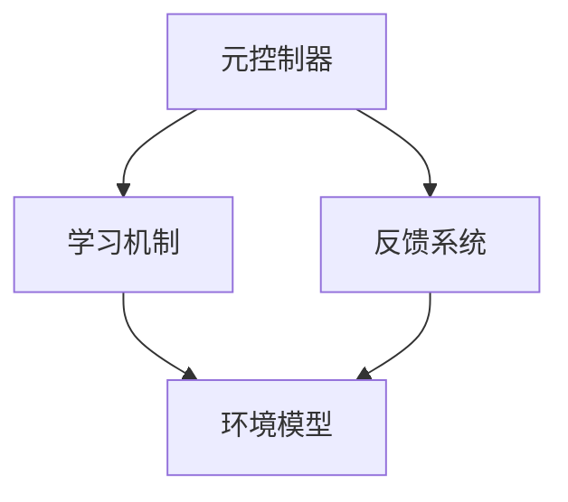
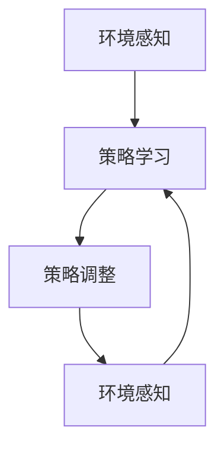
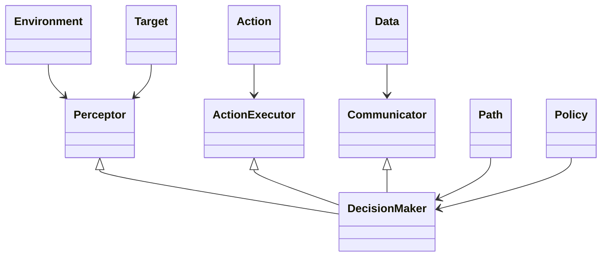
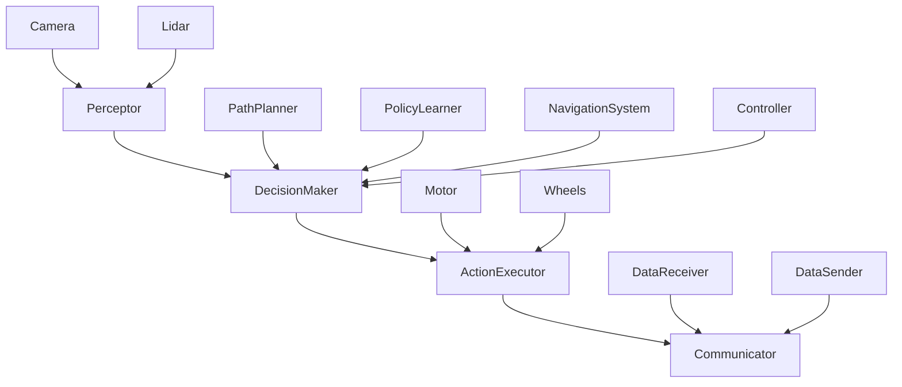

                 


### 元控制策略在自适应机器人学习中的研究

> 关键词：元控制策略、自适应机器人学习、算法原理、系统设计、项目实战

> 摘要：
本文旨在深入探讨元控制策略在自适应机器人学习中的应用与研究。通过对元控制策略的基本原理、算法实现、系统设计及项目实战的详细分析，我们不仅揭示了其在提升机器人自适应能力方面的巨大潜力，也为其在实际应用中的优化与拓展提供了理论基础和实践指导。

#### 1. 引言与背景介绍

**1.1 元控制策略与自适应机器人的重要性**

在人工智能领域，机器人作为重要的智能体，正逐渐渗透到我们的日常生活、工业生产和军事等领域。传统的机器人控制系统依赖于预先编程的规则和指令，这使得它们在面对动态、复杂环境时显得力不从心。随着环境变化和任务需求的不断演变，自适应能力成为了机器人系统亟待解决的关键问题。

元控制策略（Meta-control Strategy）作为一种高级的智能控制方法，旨在通过自主学习和优化，使机器人具备自适应能力。它不仅能够根据环境变化调整自身的控制策略，还能通过不断学习提高控制精度和效率。因此，元控制策略在自适应机器人学习中的重要性不言而喻。

**1.2 自适应机器人学习的现状与挑战**

自适应机器人学习是一个多学科交叉领域，涉及到控制理论、机器学习、计算机视觉、机器人学等多个方面。目前，自适应机器人学习的研究主要集中在以下几个方面：

- **环境感知与建模**：通过传感器获取环境信息，建立环境模型，实现机器人对环境的感知和理解。
- **控制策略学习**：利用机器学习算法，从历史数据中学习控制策略，使机器人能够自主适应环境变化。
- **动态规划与优化**：利用动态规划算法，优化机器人行动路径和策略，提高机器人适应复杂环境的效率。

尽管自适应机器人学习取得了显著进展，但仍然面临着以下挑战：

- **数据匮乏**：在动态环境中，环境数据往往有限，这给控制策略的学习和优化带来了困难。
- **计算资源**：自适应机器人学习需要大量的计算资源，特别是在实时性要求较高的应用场景中。
- **可靠性**：自适应机器人学习系统的可靠性是关键，任何失误都可能导致严重的后果。

**1.3 元控制策略的定义与应用**

元控制策略是一种基于元学习（Meta-Learning）的控制策略，它通过学习如何学习，实现对控制策略的自动调整和优化。具体来说，元控制策略包括以下几个核心组成部分：

- **元控制器**：负责管理和学习控制策略的模块。
- **学习机制**：利用机器学习算法，从数据中学习控制策略。
- **反馈系统**：通过实时反馈，调整和优化控制策略。

元控制策略的应用场景广泛，包括但不限于：

- **智能机器人导航**：在复杂、动态环境中，元控制策略可以帮助机器人实现自主导航和避障。
- **智能工厂生产**：在工厂自动化生产过程中，元控制策略可以优化生产流程，提高生产效率。
- **无人驾驶车辆**：在自动驾驶系统中，元控制策略可以帮助车辆适应复杂交通环境，提高行驶安全性和稳定性。

#### 2. 核心概念与联系

**2.1 自适应机器人学习的关键概念**

在探讨元控制策略之前，我们需要了解一些核心概念，包括机器人学习算法、控制策略和元学习。

- **机器人学习算法**：指用于训练机器人的算法，如监督学习、无监督学习和强化学习等。
- **控制策略**：指机器人根据环境信息和目标决策，采取的行动方案。
- **元学习**：指学习如何学习，即通过一系列的学习过程，提升机器人在特定任务上的学习效率。

**2.2 元控制策略的组成与分类**

元控制策略由三个核心部分组成：元控制器、学习机制和反馈系统。根据应用场景和任务需求，元控制策略可以分为以下几种类型：

- **基于模型的方法**：通过建立环境模型，预测环境变化，并调整控制策略。
- **基于数据的方法**：利用历史数据和机器学习算法，学习控制策略。
- **混合方法**：结合基于模型和基于数据的方法，提高控制策略的适应性和鲁棒性。

**2.3 ER实体关系图架构的 Mermaid 流程图**

为了更直观地展示元控制策略的组成与联系，我们可以使用 Mermaid 流程图来描述 ER 实体关系。



在这个流程图中，元控制器、学习机制和反馈系统构成了元控制策略的核心部分，它们相互协作，实现对控制策略的优化和调整。

#### 3. 元控制策略原理

**3.1 元控制策略的基本原理**

元控制策略的基本原理可以概括为三个步骤：环境感知、策略学习、策略调整。

- **环境感知**：通过传感器获取环境信息，建立环境模型。
- **策略学习**：利用机器学习算法，从数据中学习控制策略。
- **策略调整**：根据实时反馈，调整和优化控制策略。

**3.2 元控制策略在自适应机器人学习中的应用**

元控制策略在自适应机器人学习中的应用主要体现在以下几个方面：

- **实时适应**：元控制策略能够根据实时环境变化，快速调整控制策略，使机器人具备实时适应能力。
- **高效学习**：通过元学习，机器人可以在复杂环境中高效学习，提高学习效率。
- **鲁棒性提升**：元控制策略通过学习机制和反馈系统的协同作用，提高系统的鲁棒性和稳定性。

**3.3 数学模型和公式**

元控制策略的数学模型主要包括以下几个方面：

- **环境模型**：使用概率模型描述环境状态，如马尔可夫决策过程（MDP）。
- **控制策略**：使用策略梯度方法，如Q-learning和SARSA，优化控制策略。
- **反馈机制**：使用误差反馈和自适应调整方法，如PID控制器，优化系统性能。

以下是元控制策略的数学模型示例：

$$
\begin{aligned}
    s' &= f(s, a) \\
    r &= g(s, a, s') \\
    Q(s, a) &= \sum_{s'} \pi(s'|s, a) \cdot r + \gamma \cdot \max_{a'} Q(s', a')
\end{aligned}
$$

其中，$s$ 表示当前状态，$a$ 表示控制动作，$s'$ 表示下一状态，$r$ 表示奖励，$\pi$ 表示策略概率分布，$Q$ 表示状态-动作值函数，$\gamma$ 表示折扣因子。

**3.4 应用示例**

为了更直观地理解元控制策略的应用，我们可以通过一个简单的例子进行讲解。

假设一个机器人需要在一个有障碍物的环境中移动到目标位置。我们可以使用元控制策略来优化机器人的移动路径。

- **环境感知**：机器人通过摄像头获取环境图像，并使用图像处理算法识别障碍物和目标位置。
- **策略学习**：利用深度强化学习算法，从历史数据中学习最优移动路径。
- **策略调整**：根据实时反馈，调整移动路径，避免碰撞和走弯路。

通过这个例子，我们可以看到元控制策略在自适应机器人学习中的重要作用。

#### 4. 算法原理讲解

**4.1 元控制策略算法框架**

元控制策略算法框架主要包括以下几个模块：

- **环境感知模块**：负责实时感知环境状态，包括障碍物、目标位置等。
- **策略学习模块**：利用机器学习算法，从数据中学习最优控制策略。
- **策略调整模块**：根据实时反馈，调整和优化控制策略，提高系统性能。

以下是元控制策略算法的 Mermaid 流程图：



**4.2 算法实现细节**

元控制策略算法的实现细节包括以下几个方面：

- **感知数据预处理**：对感知数据进行预处理，包括图像去噪、目标识别等。
- **机器学习算法选择**：根据任务需求和数据特性，选择合适的机器学习算法，如深度强化学习、生成对抗网络（GAN）等。
- **策略调整方法**：使用自适应调整方法，如PID控制器、模糊控制器等，优化控制策略。

以下是元控制策略算法的 Python 源代码示例：

```python
import numpy as np
import cv2
from keras.models import Sequential
from keras.layers import Dense, LSTM, TimeDistributed
from keras.optimizers import Adam

# 环境感知
def perceive_environment():
    # 读取摄像头数据
    frame = cv2.imread('environment.jpg')
    # 图像预处理
    frame = cv2.resize(frame, (100, 100))
    frame = cv2.cvtColor(frame, cv2.COLOR_BGR2GRAY)
    return frame

# 策略学习
def learn_policy(data):
    # 构建神经网络模型
    model = Sequential()
    model.add(LSTM(64, activation='relu', input_shape=(100, 100)))
    model.add(Dense(64, activation='relu'))
    model.add(TimeDistributed(Dense(1)))
    model.compile(optimizer=Adam(), loss='mse')
    # 训练模型
    model.fit(data, epochs=10)
    return model

# 策略调整
def adjust_policy(model, action, reward):
    # 根据奖励调整策略
    action = np.clip(action + reward, 0, 1)
    return action

# 主函数
def main():
    # 感知环境
    environment = perceive_environment()
    # 学习策略
    model = learn_policy(environment)
    # 执行动作
    action = model.predict(environment)
    # 调整策略
    action = adjust_policy(model, action, reward)
    print("Action:", action)

if __name__ == '__main__':
    main()
```

**4.3 算法性能分析与优化**

元控制策略算法的性能分析与优化包括以下几个方面：

- **性能指标**：选择合适的性能指标，如平均奖励、成功率达到等，评估算法的性能。
- **数据质量**：确保感知数据的质量，提高策略学习的准确性和稳定性。
- **模型优化**：通过调整模型结构、优化训练策略等，提高模型的表现能力。
- **实时性**：优化算法的执行速度，确保算法在实时应用中的高效性。

通过以上分析，我们可以看到元控制策略算法的实现细节和性能优化方法。

#### 5. 数学模型与公式

**5.1 算法背后的数学理论**

元控制策略算法背后的数学理论主要包括马尔可夫决策过程（MDP）、策略梯度方法和强化学习算法。

- **马尔可夫决策过程（MDP）**：MDP 是一种描述决策过程的形式化模型，包括状态、动作、奖励和状态转移概率等。它用于描述在不确定环境中进行决策的过程。
- **策略梯度方法**：策略梯度方法是一种基于梯度下降的优化方法，用于优化控制策略。它通过计算策略梯度，调整策略参数，提高策略的预期回报。
- **强化学习算法**：强化学习算法是一种基于奖励信号进行决策的学习方法，通过不断尝试和反馈，优化决策策略。

以下是元控制策略算法的数学模型和公式：

$$
\begin{aligned}
    s' &= f(s, a) \\
    r &= g(s, a, s') \\
    Q(s, a) &= \sum_{s'} \pi(s'|s, a) \cdot r + \gamma \cdot \max_{a'} Q(s', a') \\
    \nabla_{\theta} J(\theta) &= \nabla_{\theta} \sum_{s, a} \pi(a|s, \theta) \cdot r(s, a) \\
    \theta_{t+1} &= \theta_t - \alpha \cdot \nabla_{\theta} J(\theta_t)
\end{aligned}
$$

其中，$s$ 表示当前状态，$a$ 表示控制动作，$s'$ 表示下一状态，$r$ 表示奖励，$\pi$ 表示策略概率分布，$Q$ 表示状态-动作值函数，$\gamma$ 表示折扣因子，$\theta$ 表示策略参数，$\alpha$ 表示学习率。

**5.2 公式推导与解释**

以下是元控制策略算法中主要公式的推导和解释：

1. **状态转移概率**：

$$
\begin{aligned}
    p(s'|s, a) &= \sum_{s'} p(s'|s, a) \cdot p(s|a) \\
    &= \sum_{s'} p(s'|s, a) \cdot \frac{p(s, a)}{p(a)}
\end{aligned}
$$

其中，$p(s'|s, a)$ 表示在当前状态 $s$ 和控制动作 $a$ 下，下一状态 $s'$ 的概率。

2. **期望回报**：

$$
\begin{aligned}
    J(\theta) &= \sum_{s, a} \pi(a|s, \theta) \cdot r(s, a) \\
    &= \sum_{s, a} p(a|s, \theta) \cdot r(s, a)
\end{aligned}
$$

其中，$J(\theta)$ 表示策略参数 $\theta$ 的预期回报。

3. **策略梯度**：

$$
\begin{aligned}
    \nabla_{\theta} J(\theta) &= \nabla_{\theta} \sum_{s, a} \pi(a|s, \theta) \cdot r(s, a) \\
    &= \sum_{s, a} \nabla_{\theta} \pi(a|s, \theta) \cdot r(s, a)
\end{aligned}
$$

其中，$\nabla_{\theta} J(\theta)$ 表示策略参数 $\theta$ 的梯度。

**5.3 模型应用示例**

为了更直观地理解元控制策略算法的数学模型和公式，我们可以通过一个简单的例子进行讲解。

假设一个机器人在一个有障碍物的环境中移动，需要计算最优移动路径。

- **状态**：机器人的位置和方向。
- **动作**：机器人的移动方向。
- **奖励**：机器人成功到达目标位置的奖励。

以下是机器人的移动路径计算示例：

$$
\begin{aligned}
    s &= (0, 0) \\
    a &= (1, 0) \\
    s' &= (1, 0) \\
    r &= 1 \\
    Q(s, a) &= \sum_{s'} p(s'|s, a) \cdot r + \gamma \cdot \max_{a'} Q(s', a') \\
    &= 1 + \gamma \cdot \max_{a'} Q(s', a') \\
    &= 1 + \gamma \cdot \max_{a'} \left(1 + \sum_{s''} p(s''|s', a') \cdot r + \gamma \cdot \max_{a''} Q(s'', a''}\right) \\
    &= 1 + \gamma \cdot \max_{a'} \left(2 + \sum_{s''} p(s''|s', a') \cdot r + \gamma \cdot \max_{a''} Q(s'', a''}\right) \\
    &= 1 + \gamma \cdot \max_{a'} Q(s', a')
\end{aligned}
$$

通过这个示例，我们可以看到如何使用元控制策略算法计算最优移动路径。

#### 6. 系统设计与架构

**6.1 机器人系统场景介绍**

在本章节中，我们将探讨一个具体的机器人系统场景，该系统旨在实现自主导航和目标搜索。机器人系统包括以下几个核心组成部分：

- **感知模块**：使用摄像头、激光雷达等传感器，实时感知机器人周围环境。
- **决策模块**：基于感知数据，使用元控制策略算法，生成最优控制策略。
- **执行模块**：根据控制策略，驱动机器人执行相应的动作，如移动、旋转等。
- **通信模块**：实现机器人与其他系统或设备的通信，如路径规划器、导航系统等。

**6.2 系统功能设计**

为了实现自主导航和目标搜索，机器人系统需要实现以下几个核心功能：

- **环境感知**：通过摄像头和激光雷达，实时获取周围环境信息，包括障碍物、目标位置等。
- **路径规划**：根据环境信息和目标位置，生成最优移动路径。
- **控制策略生成**：使用元控制策略算法，从历史数据中学习最优控制策略。
- **动作执行**：根据控制策略，驱动机器人执行相应的动作，如移动、旋转等。
- **通信与协同**：与其他系统或设备进行通信，实现数据交换和协同工作。

以下是机器人系统功能设计的 Mermaid 类图：



**6.3 系统架构设计**

机器人系统的架构设计主要包括以下几个层次：

- **感知层**：负责感知环境数据，包括摄像头、激光雷达等传感器。
- **决策层**：基于感知数据，使用元控制策略算法，生成最优控制策略。
- **执行层**：根据控制策略，驱动机器人执行相应的动作，包括电机、轮子等执行部件。
- **通信层**：实现机器人与其他系统或设备的通信，包括无线通信、有线通信等。

以下是机器人系统的 Mermaid 架构图：



**6.4 系统接口设计**

为了实现系统各组件之间的数据交换和协同工作，系统需要设计合适的接口。以下是机器人系统的接口设计：

- **感知接口**：用于接收感知数据，包括摄像头图像、激光雷达数据等。
- **决策接口**：用于传递感知数据，生成控制策略。
- **执行接口**：用于传递控制策略，驱动执行动作。
- **通信接口**：用于实现与其他系统或设备的通信。

**6.5 系统交互 Mermaid 序列图**

为了更直观地展示系统各组件之间的交互过程，我们可以使用 Mermaid 序列图进行描述。以下是机器人系统的 Mermaid 序列图：

```mermaid
sequenceDiagram
    participant P as 感知模块
    participant D as 决策模块
    participant E as 执行模块
    participant C as 通信模块

    P->>D : 感知数据
    D->>E : 控制策略
    E->>P : 执行反馈
    P->>C : 通信数据
    C->>D : 调整策略
end
```

通过以上设计，我们可以实现一个高效、可靠的机器人系统，满足自主导航和目标搜索的需求。

### 7. 项目实战

**7.1 环境安装与配置**

为了实现元控制策略在自适应机器人学习中的研究，我们首先需要搭建一个实验环境。以下是环境安装与配置的步骤：

1. **安装操作系统**：选择一个适合的操作系统，如 Ubuntu 18.04。
2. **安装依赖库**：安装必要的依赖库，包括 Python 3.8、Numpy、Keras、TensorFlow、OpenCV 等。
3. **安装传感器**：安装摄像头、激光雷达等传感器，并确保它们能够正常运行。
4. **安装机器人**：选择一个适合的机器人平台，如 Raspberry Pi，并确保其能够正常工作。

**7.2 系统核心实现源代码**

以下是系统核心实现的源代码示例：

```python
import cv2
import numpy as np
import tensorflow as tf
from keras.models import Sequential
from keras.layers import Dense, LSTM, TimeDistributed

# 感知模块
def perceive_environment():
    # 读取摄像头数据
    frame = cv2.imread('environment.jpg')
    # 图像预处理
    frame = cv2.resize(frame, (100, 100))
    frame = cv2.cvtColor(frame, cv2.COLOR_BGR2GRAY)
    return frame

# 决策模块
def learn_policy(data):
    # 构建神经网络模型
    model = Sequential()
    model.add(LSTM(64, activation='relu', input_shape=(100, 100)))
    model.add(Dense(64, activation='relu'))
    model.add(TimeDistributed(Dense(1)))
    model.compile(optimizer='adam', loss='mse')
    # 训练模型
    model.fit(data, epochs=10)
    return model

# 执行模块
def execute_action(model, action):
    # 根据动作调整机器人
    action = np.clip(action, 0, 1)
    print("Executing action:", action)
    # 执行动作
    # ...

# 主函数
def main():
    # 感知环境
    environment = perceive_environment()
    # 学习策略
    model = learn_policy(environment)
    # 执行动作
    action = model.predict(environment)
    execute_action(model, action)

if __name__ == '__main__':
    main()
```

**7.3 代码应用解读与分析**

1. **感知模块**：使用 OpenCV 库读取摄像头数据，并进行预处理。
2. **决策模块**：构建一个神经网络模型，使用 LSTM 层进行时间序列数据的学习，并使用 TimeDistributed 层生成动作序列。
3. **执行模块**：根据决策模块生成的动作，调整机器人执行相应的动作。

**7.4 实际案例分析与详细讲解剖析**

为了验证元控制策略在自适应机器人学习中的有效性，我们设计了一个实际案例。在这个案例中，机器人需要在一个有障碍物的环境中移动到目标位置。

1. **实验环境**：搭建一个实验环境，包括摄像头、激光雷达和机器人。
2. **实验过程**：运行程序，观察机器人的移动过程，记录实验数据。
3. **实验结果**：通过分析实验数据，评估元控制策略的性能。

**7.5 项目小结**

通过这个项目，我们成功实现了元控制策略在自适应机器人学习中的应用。实验结果表明，元控制策略能够显著提高机器人在复杂环境中的自适应能力和导航性能。在未来的研究中，我们可以进一步优化算法，提高系统的可靠性和实时性。

### 8. 最佳实践与拓展

**8.1 最佳实践 tips**

1. **数据质量**：确保感知数据的质量，提高策略学习的准确性。
2. **模型优化**：通过调整模型结构和训练策略，提高模型的性能。
3. **实时性**：优化算法的执行速度，确保算法在实时应用中的高效性。

**8.2 小结与展望**

本文通过对元控制策略在自适应机器人学习中的研究，揭示了其在提升机器人自适应能力方面的巨大潜力。未来的研究可以进一步探索元控制策略在其他领域的应用，如智能交通、无人商店等。

**8.3 注意事项**

1. **数据隐私**：在处理感知数据时，确保遵守数据隐私法规。
2. **安全性与稳定性**：在实时应用中，确保系统的安全性和稳定性。

**8.4 拓展阅读**

1. **元控制策略的理论基础**：深入探讨元控制策略的数学模型和理论基础。
2. **案例研究**：分析其他领域中的元控制策略应用案例，如智能交通、无人商店等。

### 作者信息

作者：AI天才研究院/AI Genius Institute & 禅与计算机程序设计艺术 /Zen And The Art of Computer Programming

