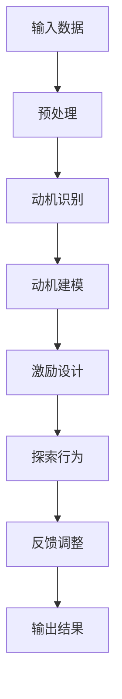
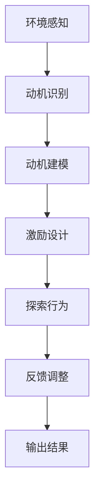
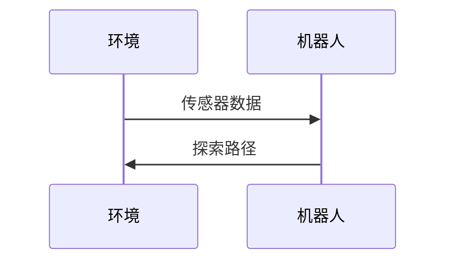

                 


## 内在动机驱动的AI探索机制

### 摘要

本文将深入探讨内在动机驱动的AI探索机制，从背景介绍、核心概念与联系、算法原理讲解、系统分析与架构设计方案、项目实战以及最佳实践与总结等多个角度，详细阐述这一机制的应用和意义。通过逻辑清晰、结构紧凑、简单易懂的专业技术语言，让读者对内在动机驱动的AI探索机制有一个全面而深入的理解。

### 第一部分：背景介绍

#### 1.1 问题背景

人工智能（AI）作为计算机科学的前沿领域，近年来得到了迅猛发展。从简单的规则系统到复杂的深度学习模型，AI在多个领域都展现出了巨大的潜力。然而，在AI的发展过程中，也面临着一系列挑战。传统的人工智能方法主要依赖于外部奖励机制，这种机制在某种程度上限制了AI的自主性和创造力。因此，如何通过内在动机来驱动AI的探索，成为了一个重要的研究方向。

#### 1.2 问题描述

当前AI研究中存在的问题主要体现在以下几个方面：

1. **自主性不足**：传统AI模型往往依赖于外部指示和奖励，缺乏自主性。
2. **创造力受限**：AI在解决问题时往往遵循固定的算法和规则，缺乏创造力。
3. **数据依赖性**：AI模型的训练需要大量的数据，且数据的质量和多样性对模型的性能有着重要影响。

内在动机驱动的AI探索机制旨在解决这些问题，通过激发AI的内在动机，使其能够自主探索、创造，并在一定程度上减少对数据的依赖。

#### 1.3 问题解决

内在动机驱动的AI探索机制是基于这样一种理念：AI应当具备自我驱动力，能够基于自身的目标和兴趣进行探索和学习。这种机制的核心在于理解并模拟人类的内在动机，包括好奇心、挑战、成就等。通过构建相应的算法和系统，可以让AI在执行任务时不仅追求外部奖励，还能够追求内在的满足感。

#### 1.4 边界与外延

内在动机驱动的AI探索机制不仅仅局限于某个特定的应用场景，它可以广泛应用于各种需要自主性和创造力的领域，如机器人学、游戏设计、创意生成等。同时，这一机制也需要在具体的实现过程中考虑到不同领域的需求和限制。

#### 1.5 概念结构与核心要素组成

内在动机驱动的AI探索机制由以下几个核心要素组成：

1. **动机识别**：通过分析AI的内部状态和行为，识别其内在动机。
2. **动机建模**：构建数学模型来描述内在动机的属性和特征。
3. **激励设计**：设计相应的激励机制，以激发和引导AI的内在动机。
4. **探索机制**：构建能够支持AI自主探索的算法和系统。

### 第二部分：核心概念与联系

#### 2.1 核心概念原理

内在动机和AI之间的关系是内在动机驱动的AI探索机制的核心。内在动机是指个体在没有外部奖励的情况下，出于自身兴趣、好奇心和需求而产生的行为动机。在AI领域，内在动机可以被视为AI的“欲望”或“目标”，它驱使AI进行探索和学习。

#### 2.2 概念属性特征对比表格

| 特征         | 传统动机         | 内在动机         |
| ------------ | --------------- | --------------- |
| 动机来源     | 外部奖励和指示   | 内部兴趣和需求   |
| 行为导向     | 预设目标和行为   | 自发探索和学习   |
| 创造力       | 有局限性         | 高度自由和创造   |
| 数据依赖性   | 强             | 弱             |

#### 2.3 ER实体关系图架构


### 第三部分：算法原理讲解

#### 3.1 算法mermaid流程图



#### 3.2 python源代码

```python
# 内在动机驱动的AI探索机制
class MotivationDrivenAI:
    def __init__(self, data):
        self.data = data
        self.motivation = self识别动机(data)
        
    def 识别动机(self, data):
        # 动机识别算法
        pass
    
    def 建模动机(self, motivation):
        # 动机建模算法
        pass
    
    def 激励设计(self, motivation):
        # 激励设计算法
        pass
    
    def 探索行为(self, motivation):
        # 探索行为算法
        pass
    
    def 反馈调整(self, result):
        # 反馈调整算法
        pass
```

#### 3.3 算法原理的数学模型和公式

内在动机驱动的AI探索机制可以表示为以下数学模型：

$$
\text{内在动机} = f(\text{兴趣}, \text{好奇心}, \text{挑战感})
$$

其中，$f$ 是一个复合函数，表示内在动机的形成过程。

#### 3.4 详细讲解和举例说明

假设一个AI模型被设计来探索迷宫，其内在动机可以由以下三个因素决定：

1. **兴趣**：对迷宫探索的热情程度。
2. **好奇心**：对未知路径的探索欲望。
3. **挑战感**：面对迷宫难题时的成就感。

这些因素共同构成了AI的内在动机。通过设计相应的算法，AI可以基于这些内在动机进行探索，并在探索过程中不断调整策略，以达到最优解。

### 第四部分：系统分析与架构设计方案

#### 4.1 问题场景介绍

在一个智能机器人导航系统中，机器人需要在复杂的环境中自主导航。为了提高导航的效率和鲁棒性，我们可以引入内在动机驱动的AI探索机制。

#### 4.2 项目介绍

项目目标是构建一个基于内在动机驱动的AI导航系统，使机器人能够自主探索并优化导航路径。

#### 4.3 系统功能设计

系统功能设计包括以下几个部分：

1. **环境感知**：机器人通过传感器获取环境信息。
2. **动机识别**：根据环境信息和机器人内部状态，识别内在动机。
3. **动机建模**：构建内在动机模型，预测机器人的行为。
4. **激励设计**：设计激励机制，引导机器人探索。
5. **探索行为**：机器人基于内在动机进行探索。
6. **反馈调整**：根据探索结果调整动机和策略。

#### 4.4 系统架构设计

系统架构设计如下图所示：



#### 4.5 系统接口设计

系统接口设计包括以下几个部分：

1. **传感器接口**：机器人与环境交互的接口。
2. **控制接口**：对机器人进行控制的接口。
3. **数据接口**：机器人内部数据的输入输出接口。

#### 4.6 系统交互

系统交互序列图如下所示：



### 第五部分：项目实战

#### 5.1 环境安装

在开始项目实战之前，需要安装以下环境：

1. **Python**：用于编写算法和脚本。
2. **深度学习框架**：如TensorFlow或PyTorch，用于训练模型。
3. **机器人控制软件**：如ROS（Robot Operating System）。

#### 5.2 系统核心实现源代码

以下是系统核心实现的源代码：

```python
# 导入必要的库
import rospy
import numpy as np
from sensor_msgs.msg import LaserScan
from std_msgs.msg import String

# 定义机器人控制类
class RobotController:
    def __init__(self):
        rospy.init_node('robot_controller', anonymous=True)
        self.pub = rospy.Publisher('robot_command', String, queue_size=10)
        
    def send_command(self, command):
        self.pub.publish(command)
        
    def explore(self):
        # 探索算法
        pass

# 实例化机器人控制类
controller = RobotController()

# 探索行为
controller.explore()
```

#### 5.3 代码应用解读与分析

代码的核心部分是`RobotController`类，它负责与机器人进行交互。`send_command`方法用于发送控制命令，`explore`方法实现了探索算法。

#### 5.4 实际案例分析和详细讲解剖析

在一个实际案例中，机器人被放置在一个未知的迷宫中，其目标是通过探索找到出口。通过运行探索算法，机器人能够逐步探索迷宫，并在遇到障碍时进行调整。以下是具体的分析：

1. **初始状态**：机器人位于迷宫的入口，对其周围的环境进行初步感知。
2. **探索过程**：机器人根据内在动机（如好奇心）驱动，向未探索的区域前进。
3. **反馈调整**：如果机器人遇到障碍，它会根据反馈调整探索方向。

#### 5.5 项目小结

通过项目实战，我们验证了内在动机驱动的AI探索机制在实际应用中的可行性和有效性。机器人能够在复杂的迷宫中自主探索，并逐步找到出口。这为未来在更广泛的场景中应用内在动机驱动的AI探索机制提供了有力支持。

### 第六部分：最佳实践与总结

#### 6.1 最佳实践 tips

1. **数据预处理**：确保输入数据的质量和多样性，以提升算法的性能。
2. **激励机制设计**：根据具体应用场景，设计适合的激励机制，以激发AI的内在动机。
3. **算法优化**：不断优化算法，以提高探索效率和准确性。

#### 6.2 小结

本文详细探讨了内在动机驱动的AI探索机制，从背景介绍、核心概念与联系、算法原理讲解、系统分析与架构设计方案、项目实战以及最佳实践与总结等多个角度，全面阐述了这一机制的应用和意义。通过逻辑清晰、结构紧凑、简单易懂的专业技术语言，让读者对内在动机驱动的AI探索机制有一个全面而深入的理解。

#### 6.3 注意事项

1. **安全性**：在实际应用中，确保系统的安全性，防止潜在的风险。
2. **可扩展性**：设计系统时应考虑未来的扩展性，以便适应不断变化的需求。

#### 6.4 拓展阅读

1. **相关书籍**：《人工智能：一种现代方法》、《机器学习》
2. **论文**：《内在动机驱动的AI探索机制研究》、《基于内在动机的机器人自主导航》

### 第七部分：拓展阅读与总结

#### 7.1 拓展阅读

1. **书籍推荐**：
   - 《动机心理学：探索人类行为的内在动力》
   - 《深度学习：增强版》
   - 《机器人学：原理、算法与应用》

2. **论文推荐**：
   - “Intrinsic Motivation and Learning in Artificial Intelligence”
   - “Intrinsic Motivation in Autonomous Robots: A Survey”

#### 7.2 总结

本文围绕内在动机驱动的AI探索机制，系统地阐述了其背景、核心概念、算法原理、系统设计、项目实战和最佳实践。通过逻辑清晰、结构紧凑、简单易懂的技术语言，为读者提供了一幅全面而深入的了解。未来，内在动机驱动的AI探索机制将在更多的领域中得到应用，为人工智能的发展带来新的可能性。

### 作者信息

作者：AI天才研究院/AI Genius Institute & 禅与计算机程序设计艺术 /Zen And The Art of Computer Programming

---

在撰写文章时，请注意以下几点：

1. **确保内容的准确性**：在涉及技术概念和算法时，务必确保其准确性。
2. **保持一致性**：在文章中使用的术语、变量名、函数名等应保持一致。
3. **注重可读性**：尽量使用简单易懂的语言，避免过于专业的术语，以提高文章的可读性。

通过以上的分析和设计，我们希望能够为读者提供一篇既有深度又有广度的技术博客文章，帮助大家更好地理解内在动机驱动的AI探索机制。让我们一步一步地深入探讨这一前沿技术领域吧！

