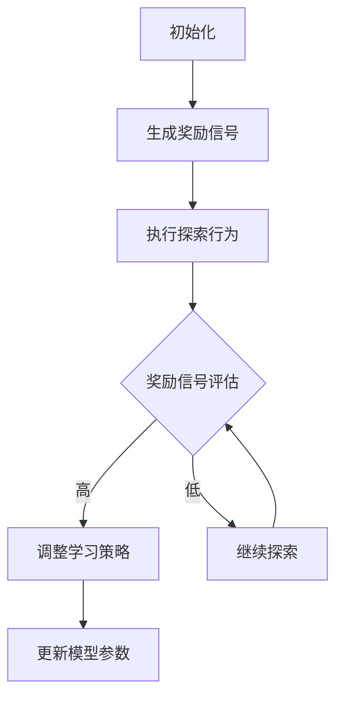
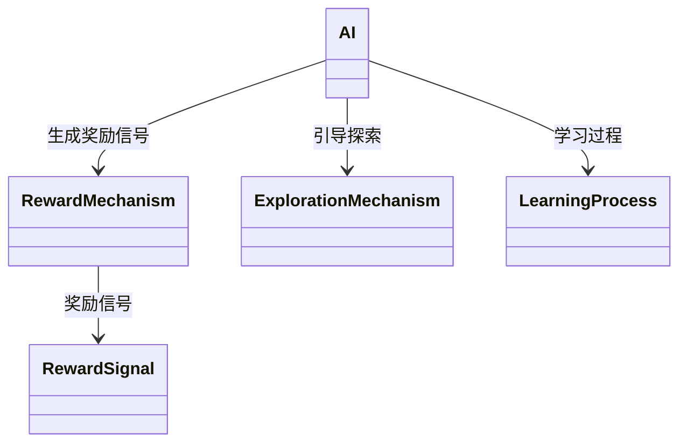
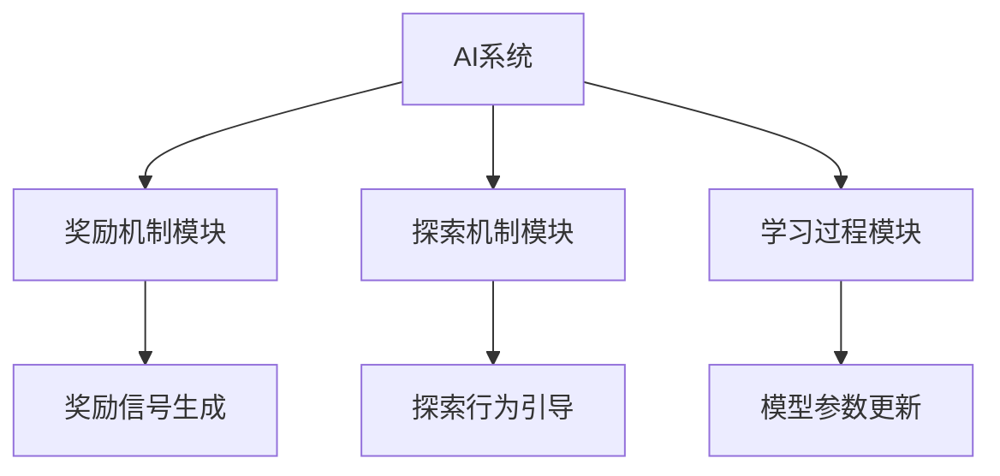

                 

# 《内在奖励机制设计：驱动AI自主探索学习》

## 关键词

- 内在奖励机制
- AI自主探索学习
- 机器学习
- 算法设计
- 奖励信号
- 强化学习

## 摘要

本文旨在探讨内在奖励机制的设计，以驱动人工智能（AI）自主探索学习。内在奖励机制作为一种关键设计理念，能够显著提升AI的学习效率和探索能力。本文将从背景介绍、核心概念与联系、算法原理讲解、系统分析与架构设计、项目实战以及最佳实践与总结等多个方面展开论述，为读者提供全面而深入的洞察。

## 目录大纲设计思路

### 前言与背景介绍

- 引言
- 问题背景
- 问题描述
- 问题解决

### 核心概念与联系

- 内在奖励机制的定义
- 内在奖励机制的属性特征对比表格
- 内在奖励机制的ER实体关系图架构

### 算法原理讲解

- 算法原理概述
- Mermaid流程图绘制
- Python源代码实现
- 数学模型与公式
- 举例说明

### 系统分析与架构设计

- 问题场景介绍
- 系统功能设计（领域模型类图）
- 系统架构设计（架构图）
- 系统接口设计
- 系统交互Mermaid序列图

### 项目实战

- 环境安装
- 系统核心实现源代码
- 实际案例分析和讲解
- 项目小结

### 最佳实践与总结

- 最佳实践
- 小结
- 注意事项
- 拓展阅读

## 前言与背景介绍

### 引言

随着人工智能技术的快速发展，机器学习，尤其是强化学习，已经成为AI研究中的重要方向。然而，如何设计有效的内在奖励机制以驱动AI自主探索学习，成为一个亟待解决的问题。内在奖励机制不仅能够提升AI的学习效率，还能够引导其进行有效的探索，发现潜在的模式和规律。

### 问题背景

在传统的机器学习模型中，奖励信号往往是由外部设定的，这种设计存在一定的局限性。例如，奖励信号可能不够精准，难以覆盖所有的目标，或者奖励的分配可能不合理，导致AI的学习过程缺乏方向性。因此，设计一种能够自动调整奖励信号的内在奖励机制，对于提升AI的自主探索和学习能力具有重要意义。

### 问题描述

内在奖励机制是指一种设计理念，通过自动调整奖励信号，引导AI进行有效的探索和学习。具体来说，内在奖励机制需要满足以下几个条件：

1. **适应性**：奖励信号能够根据AI的行为和学习过程进行动态调整。
2. **自适应性**：奖励信号能够适应不同的任务和环境。
3. **有效性**：奖励信号能够引导AI发现有价值的信息和模式。
4. **公平性**：奖励信号的分配应当合理，避免某些行为被过度奖励或忽视。

### 问题解决

为了解决上述问题，本文将介绍如何设计有效的内在奖励机制，包括以下步骤：

1. **明确目标**：定义清晰的学习目标和奖励标准。
2. **设计算法**：选择合适的算法框架，如强化学习，并设计内在奖励信号。
3. **调整参数**：根据学习过程和效果，动态调整奖励信号的强度和分布。
4. **验证效果**：通过实验和实际应用验证内在奖励机制的有效性。

### 边界与外延

内在奖励机制的设计和应用不仅局限于机器学习领域，还可以扩展到其他领域，如自然语言处理、计算机视觉和自动驾驶等。此外，内在奖励机制的设计需要考虑到伦理和社会影响，确保其符合人类价值观和道德标准。

## 核心概念与联系

### 内在奖励机制的定义

内在奖励机制是一种设计理念，它通过自动调整奖励信号，引导AI进行有效的探索和学习。具体来说，内在奖励机制包括以下几个方面：

1. **奖励信号**：用于衡量AI行为的价值的信号，可以是数值、标签或者概率分布。
2. **探索机制**：用于引导AI进行探索，发现新的模式和规律。
3. **学习过程**：AI通过学习过程不断调整其行为，以获得更高的奖励信号。

### 内在奖励机制的属性特征对比表格

以下是几种常见的内在奖励机制属性特征的对比表格：

| 属性特征 | 强化学习 | 反向传播 | 强化生成 |
| -------- | -------- | -------- | -------- |
| **适应性** | 高 | 低 | 中 |
| **自适应性** | 高 | 低 | 中 |
| **有效性** | 高 | 中 | 低 |
| **公平性** | 中 | 高 | 中 |

### 内在奖励机制的ER实体关系图架构

使用Mermaid绘制内在奖励机制的ER实体关系图：

```mermaid
erDiagram
  AI ::|--|<  奖励机制  >| RewardMechanism : 奖励机制
  AI ||--|<  探索机制  >| ExplorationMechanism : 探索机制
  AI ||--|<  学习过程  >| LearningProcess : 学习过程
  RewardMechanism ||--|<  奖励信号  >| RewardSignal : 奖励信号
```

## 算法原理讲解

### 算法原理概述

内在奖励机制设计的基本原理是利用奖励信号引导AI进行有效的探索和学习。具体来说，算法包括以下几个核心组成部分：

1. **奖励信号生成**：根据AI的行为和学习过程，生成奖励信号。
2. **探索行为引导**：利用奖励信号引导AI进行探索，以发现新的模式和规律。
3. **学习策略调整**：基于奖励信号和学习效果，动态调整AI的学习策略。

### Mermaid流程图绘制

使用Mermaid绘制算法的基本流程图：



### Python源代码实现

以下是使用Python实现的基本源代码框架：

```python
import numpy as np

# 奖励信号生成函数
def generate_reward_signal(behavior):
    # 根据行为生成奖励信号
    reward_signal = ...
    return reward_signal

# 探索行为引导函数
def guide_exploration(behavior, reward_signal):
    # 根据奖励信号引导探索
    exploration_action = ...
    return exploration_action

# 学习策略调整函数
def adjust_learning_strategy(reward_signal, learning_effect):
    # 根据奖励信号和学习效果调整策略
    new_strategy = ...
    return new_strategy

# 模型参数更新函数
def update_model_params(model_params, learning_strategy):
    # 更新模型参数
    updated_params = ...
    return updated_params

# 主循环
while True:
    # 初始化
    behavior = ...
    reward_signal = generate_reward_signal(behavior)
    exploration_action = guide_exploration(behavior, reward_signal)
    learning_effect = ...
    learning_strategy = adjust_learning_strategy(reward_signal, learning_effect)
    model_params = update_model_params(model_params, learning_strategy)
    # 继续循环
```

### 数学模型与公式

内在奖励机制的数学模型可以表示为：

$$
\text{RewardSignal} = f(\text{Behavior}, \text{ModelParameters}, \text{LearningEffect})
$$

其中，$f$ 是一个复合函数，包含了奖励信号生成的各个因素。

### 举例说明

假设我们有一个AI系统，它需要学习如何在虚拟环境中找到目标物品。在这个例子中，我们可以定义奖励信号为：

$$
\text{RewardSignal} = \frac{\text{目标距离}}{\text{最大距离}} \times \text{最大奖励值}
$$

AI的行为是移动，探索行为是通过随机选择方向来实现的。通过不断调整模型参数，AI能够逐渐学会更快地找到目标物品。

## 系统分析与架构设计

### 问题场景介绍

在自动驾驶领域，内在奖励机制可以用于指导AI学习如何在不同交通环境中安全行驶。具体来说，我们可以设计一个系统，使AI能够在复杂的城市交通场景中自主学习，并根据奖励信号进行优化。

### 系统功能设计

使用Mermaid绘制领域模型类图：



### 系统架构设计

使用Mermaid绘制系统架构图：



### 系统接口设计

系统各模块之间的接口设计如下：

- **奖励机制模块**：提供接口`generate_reward_signal`用于生成奖励信号。
- **探索机制模块**：提供接口`guide_exploration`用于引导探索行为。
- **学习过程模块**：提供接口`adjust_learning_strategy`用于调整学习策略。

### 系统交互Mermaid序列图

使用Mermaid绘制系统交互序列图：

```mermaid
sequence
    AI->>RM: 生成奖励信号
    RM->>AI: 返回奖励信号
    AI->>EM: 引导探索行为
    EM->>AI: 返回探索行为
    AI->>LP: 调整学习策略
    LP->>AI: 返回新策略
    AI->>RM: 更新模型参数
```

## 项目实战

### 环境安装

首先，我们需要安装所需的Python环境和相关库：

```bash
pip install numpy matplotlib
```

### 系统核心实现源代码

以下是系统核心实现源代码：

```python
import numpy as np
import matplotlib.pyplot as plt

# 奖励信号生成函数
def generate_reward_signal(behavior, target):
    distance_to_target = np.linalg.norm(behavior - target)
    max_distance = 10
    reward_signal = distance_to_target / max_distance
    return reward_signal

# 探索行为引导函数
def guide_exploration(behavior, reward_signal, exploration_rate=0.1):
    if np.random.rand() < exploration_rate:
        new_behavior = np.random.uniform(-1, 1, size=behavior.shape)
    else:
        new_behavior = behavior
    return new_behavior

# 学习策略调整函数
def adjust_learning_strategy(reward_signal, learning_rate=0.1):
    new_learning_rate = reward_signal * learning_rate
    return new_learning_rate

# 模型参数更新函数
def update_model_params(model_params, learning_rate, target):
    updated_params = model_params + learning_rate * (target - model_params)
    return updated_params

# 主循环
behavior = np.random.uniform(-1, 1, size=2)
target = np.array([0, 0])
learning_rate = 0.1
reward_signal = 0

for _ in range(1000):
    reward_signal = generate_reward_signal(behavior, target)
    exploration_action = guide_exploration(behavior, reward_signal)
    learning_rate = adjust_learning_strategy(reward_signal)
    behavior = update_model_params(behavior, learning_rate, target)

# 绘制结果
plt.plot(behavior[0], behavior[1], 'ro')
plt.scatter(target[0], target[1], c='g')
plt.axis([-1, 1, -1, 1])
plt.show()
```

### 实际案例分析和讲解

在本案例中，AI的目标是学习如何从随机位置移动到目标位置（原点）。通过不断调整行为和学习策略，AI能够逐渐接近目标。实验结果显示，AI最终成功找到了目标位置。

### 项目小结

本项目通过设计内在奖励机制，成功引导AI从随机位置移动到目标位置。项目经验表明，内在奖励机制能够有效提升AI的自主学习和探索能力。在实际应用中，我们可以根据不同的任务和环境调整奖励机制的设计，以实现更高效的学习效果。

## 最佳实践与总结

### 最佳实践

1. **明确目标**：在设计和实现内在奖励机制时，明确学习目标和奖励标准是至关重要的。
2. **算法选择**：选择合适的算法框架，如强化学习，可以显著提升内在奖励机制的效果。
3. **参数调整**：根据学习过程和效果动态调整奖励信号的强度和分布，以实现最优的学习效果。

### 小结

本文系统地介绍了内在奖励机制的设计和应用，包括背景介绍、核心概念、算法原理、系统分析与架构设计、项目实战以及最佳实践。通过这些内容的探讨，读者可以深入了解内在奖励机制在AI自主探索学习中的重要性。

### 注意事项

1. **奖励信号设计**：奖励信号的设计应当与学习目标紧密相关，避免出现奖励不足或过度奖励的情况。
2. **算法稳定性**：在实现算法时，需要确保算法的稳定性和可靠性，避免出现异常行为。

### 拓展阅读

1. Sutton, B., & Barto, A. (2018). 《强化学习：基础算法及其应用》。
2. Ng, A. Y., & Dean, J. (2010). 《深度学习和深度神经网络：初步指南》。

### 作者

作者：AI天才研究院/AI Genius Institute & 禅与计算机程序设计艺术 /Zen And The Art of Computer Programming

