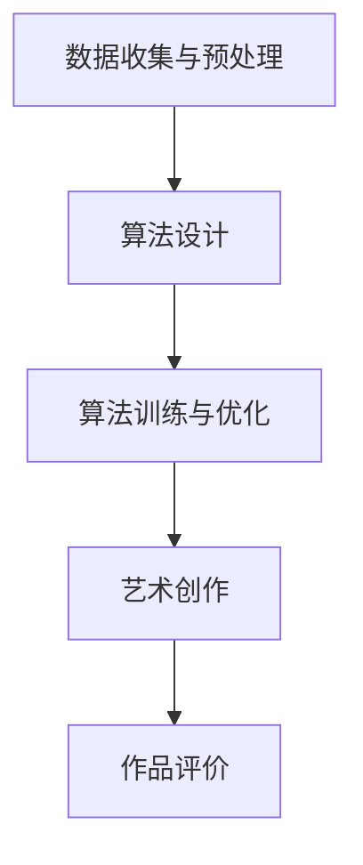

                 

# 《内在好奇心机制在AI艺术创作中的探索》

## 关键词

AI艺术创作、内在好奇心机制、算法原理、数学模型、系统架构、实践应用

## 摘要

本文旨在探讨内在好奇心机制在AI艺术创作中的应用，通过对内在好奇心机制的概述和AI艺术创作的基础理论阐述，深入分析内在好奇心在AI艺术创作中的驱动作用。文章将详细讲解算法原理与数学模型，并通过实际案例展示内在好奇心机制在AI艺术创作中的实践应用，最后总结研究成果并展望未来发展趋势。

### 目录大纲

## 第1章 引言

### 1.1 问题背景

### 1.2 问题提出

### 1.3 研究目标与意义

### 1.4 边界与外延

### 1.5 概念结构与核心要素

## 第2章 内在好奇心机制概述

### 2.1 内在好奇心的定义与特点

### 2.2 内在好奇心与创造力

### 2.3 内在好奇心与学习动机

### 2.4 内在好奇心与情感体验

## 第3章 AI艺术创作的基础理论

### 3.1 AI艺术创作的定义与分类

### 3.2 AI艺术创作的历史与发展

### 3.3 AI艺术创作的技术原理

### 3.4 AI艺术创作与社会影响

## 第4章 内在好奇心机制在AI艺术创作中的应用

### 4.1 内在好奇心驱动的艺术创作方法

### 4.2 内在好奇心与AI算法的融合

### 4.3 内在好奇心在艺术作品评价中的应用

### 4.4 内在好奇心在艺术教育中的应用

## 第5章 算法原理与数学模型

### 5.1 算法概述

### 5.2 算法原理

### 5.3 数学模型

### 5.4 算法流程图

## 第6章 实践应用案例

### 6.1 案例背景

### 6.2 系统功能设计

### 6.3 系统架构设计

### 6.4 系统接口设计与交互

### 6.5 实际案例分析与讲解

## 第7章 总结与展望

### 7.1 研究总结

### 7.2 存在问题与挑战

### 7.3 未来发展趋势

### 7.4 拓展阅读与建议

### 第1章 引言

#### 1.1 问题背景

随着人工智能技术的飞速发展，AI在各个领域的应用日益广泛。特别是在艺术创作领域，AI艺术作品逐渐受到关注。然而，现有的AI艺术创作主要依赖于预定义的算法和数据，缺乏一种内在的驱动机制来激发艺术创作的灵感。这种情况下，如何利用内在好奇心机制来增强AI艺术创作的创新能力，成为一个亟待解决的问题。

#### 1.2 问题提出

本文旨在探讨内在好奇心机制在AI艺术创作中的应用。具体来说，我们将研究以下问题：

1. 内在好奇心机制是什么，其特点是什么？
2. 内在好奇心如何驱动AI艺术创作？
3. 内在好奇心机制在AI艺术创作中的实践应用有哪些？
4. 内在好奇心机制对AI艺术创作的影响如何？

#### 1.3 研究目标与意义

本研究的主要目标是：

1. 深入探讨内在好奇心机制的定义、特点和应用场景。
2. 探索内在好奇心机制在AI艺术创作中的驱动作用，并提出相应的算法原理与数学模型。
3. 通过实际案例展示内在好奇心机制在AI艺术创作中的实践应用，为相关领域的研究提供参考。

本研究的意义在于：

1. 为AI艺术创作提供一种新的驱动机制，提高艺术创作的创新能力。
2. 促进人工智能与艺术领域的交叉融合，推动相关领域的发展。

#### 1.4 边界与外延

本文主要围绕内在好奇心机制在AI艺术创作中的应用进行探讨，研究范围包括：

1. 内在好奇心机制的定义、特点和应用场景。
2. 内在好奇心机制在AI艺术创作中的驱动作用。
3. 内在好奇心机制在AI艺术创作中的实践应用。

本文不涉及其他领域的内在好奇心机制研究，如心理学、教育学等。

#### 1.5 概念结构与核心要素

本文的核心概念包括：

1. 内在好奇心机制：指个体在探索未知、追求新奇时的内在心理驱动力。
2. AI艺术创作：指利用人工智能技术进行艺术创作的过程。
3. 驱动作用：指内在好奇心机制对AI艺术创作产生的推动作用。

核心要素包括：

1. 算法原理：内在好奇心机制在AI艺术创作中的应用原理。
2. 数学模型：描述内在好奇心机制与AI艺术创作之间关系的数学模型。
3. 实践应用：内在好奇心机制在AI艺术创作中的具体应用案例。

### 第2章 内在好奇心机制概述

#### 2.1 内在好奇心的定义与特点

内在好奇心是指个体在探索未知、追求新奇时的内在心理驱动力。它是一种非直接利益驱动的心理现象，与个体的兴趣、动机和情感体验密切相关。内在好奇心具有以下几个特点：

1. **自发性和主动性**：内在好奇心是一种自发产生的心理状态，个体会主动寻求新奇、未知的事物，以满足自己的探索欲望。
2. **持续性和累积性**：内在好奇心不仅仅是一次性的心理体验，而是一种持续性的心理状态。个体在探索过程中，好奇心会不断积累，推动个体持续进行探索。
3. **多样性和适应性**：内在好奇心具有多样性，不同个体在探索过程中可能表现出不同的好奇心方向。同时，内在好奇心具有一定的适应性，个体会根据环境变化调整好奇心方向。

#### 2.2 内在好奇心与创造力

内在好奇心与创造力之间存在密切的关系。内在好奇心可以激发个体的探索欲望，推动个体进行创新思考，从而提高创造力。具体来说，内在好奇心在以下方面对创造力产生积极影响：

1. **激发灵感**：内在好奇心促使个体不断探索未知领域，从而发现新的灵感。
2. **拓展视野**：内在好奇心使个体愿意接受新的观念和想法，从而拓展视野，提高创造力。
3. **培养耐心**：内在好奇心需要个体付出时间和精力进行探索，从而培养耐心，提高创造力。

#### 2.3 内在好奇心与学习动机

内在好奇心是学习动机的重要来源之一。当个体对某个领域充满好奇心时，他们会更加主动地投入学习，提高学习效果。内在好奇心对学习动机的影响主要体现在以下几个方面：

1. **提高学习兴趣**：内在好奇心使个体对学习内容产生兴趣，从而提高学习动力。
2. **培养自主学习能力**：内在好奇心促使个体主动探索学习内容，从而培养自主学习能力。
3. **增强学习效果**：内在好奇心使个体更加投入学习，提高学习效果。

#### 2.4 内在好奇心与情感体验

内在好奇心与情感体验密切相关。当个体在探索过程中遇到新奇事物时，会产生积极的情感体验，如兴奋、愉悦和成就感。这些积极的情感体验会增强个体对探索的欲望，进一步激发内在好奇心。具体来说，内在好奇心与情感体验之间的关系体现在以下几个方面：

1. **增强情感体验**：内在好奇心使个体在探索过程中产生更强烈的情感体验。
2. **提高情感质量**：内在好奇心使个体在探索过程中体验到更高层次的情感，如平静、满足和愉悦。
3. **促进情感成长**：内在好奇心使个体在探索过程中不断面对挑战，从而促进情感成长。

### 第3章 AI艺术创作的基础理论

#### 3.1 AI艺术创作的定义与分类

AI艺术创作是指利用人工智能技术进行艺术创作的过程。AI艺术创作可以分为以下几类：

1. **生成艺术**：利用人工智能算法生成艺术作品，如生成艺术图像、音乐、文学作品等。
2. **交互艺术**：利用人工智能技术实现艺术作品的交互性，如智能艺术装置、虚拟现实艺术等。
3. **改造艺术**：利用人工智能技术对传统艺术作品进行改造，如艺术图像处理、音乐编辑等。

#### 3.2 AI艺术创作的历史与发展

AI艺术创作的历史可以追溯到20世纪50年代，当时计算机科学家开始研究计算机在艺术创作中的应用。随着计算机技术的发展，AI艺术创作逐渐成为人工智能领域的一个重要研究方向。近年来，随着深度学习等人工智能技术的成熟，AI艺术创作得到了快速发展。

#### 3.3 AI艺术创作的技术原理

AI艺术创作的技术原理主要包括以下几个方面：

1. **机器学习**：利用机器学习算法对大量数据进行训练，从而生成具有艺术性的作品。
2. **深度学习**：利用深度学习模型对图像、声音、文本等数据进行处理，从而生成具有艺术性的作品。
3. **计算机视觉**：利用计算机视觉技术对图像进行分析和处理，从而生成具有艺术性的作品。

#### 3.4 AI艺术创作与社会影响

AI艺术创作对社会产生了广泛的影响。一方面，AI艺术创作丰富了艺术创作的形式和内容，为艺术创作提供了新的可能性。另一方面，AI艺术创作也引发了一系列社会问题，如版权保护、艺术价值评估等。因此，如何平衡AI艺术创作与社会影响之间的关系，成为未来研究的一个重要方向。

### 第4章 内在好奇心机制在AI艺术创作中的应用

#### 4.1 内在好奇心驱动的艺术创作方法

内在好奇心驱动的艺术创作方法是指利用内在好奇心机制激发艺术创作的灵感，提高艺术创作的创新能力。具体来说，这种方法包括以下几个步骤：

1. **明确创作目标**：首先，艺术家需要明确自己的艺术创作目标，包括创作主题、风格、形式等。
2. **激发内在好奇心**：通过观察、思考、交流等方式，激发内在好奇心，寻找创作灵感。
3. **创作过程**：在创作过程中，艺术家需要保持好奇心，不断尝试新的技巧和方法，以实现创作目标。
4. **作品评价**：在完成作品后，艺术家需要对自己的作品进行评价，以确定创作效果。

#### 4.2 内在好奇心与AI算法的融合

内在好奇心与AI算法的融合是指将内在好奇心机制与人工智能算法相结合，以提高AI艺术创作的创新能力。具体来说，这种方法包括以下几个步骤：

1. **数据收集与预处理**：首先，收集与艺术创作相关的数据，并进行预处理，以适应AI算法的要求。
2. **算法设计**：根据内在好奇心机制的特点，设计相应的AI算法，以实现艺术创作。
3. **算法训练与优化**：利用训练数据对算法进行训练和优化，以提高艺术创作的效果。
4. **艺术创作**：利用训练好的算法进行艺术创作，生成具有艺术性的作品。

#### 4.3 内在好奇心在艺术作品评价中的应用

内在好奇心在艺术作品评价中的应用是指利用内在好奇心机制评价艺术作品，以确定艺术作品的价值。具体来说，这种方法包括以下几个步骤：

1. **作品分析**：首先，对艺术作品进行分析，了解作品的风格、形式、内容等。
2. **激发内在好奇心**：通过观察、思考、交流等方式，激发内在好奇心，以评价艺术作品。
3. **评价标准**：根据内在好奇心机制的特点，制定相应的评价标准，以评价艺术作品。
4. **综合评价**：综合分析艺术作品的各个方面，得出综合评价结果。

#### 4.4 内在好奇心在艺术教育中的应用

内在好奇心在艺术教育中的应用是指利用内在好奇心机制提高艺术教育效果，培养艺术创新人才。具体来说，这种方法包括以下几个步骤：

1. **课程设计**：首先，设计符合学生内在好奇心特点的艺术课程，以激发学生的学习兴趣。
2. **教学过程**：在教学过程中，教师需要激发学生的内在好奇心，引导学生进行艺术创作。
3. **作品评价**：利用内在好奇心机制评价学生的艺术作品，以确定学生的艺术创作水平。
4. **反馈与调整**：根据学生作品评价结果，教师需要给予反馈，并调整教学策略，以提高教学效果。

### 第5章 算法原理与数学模型

#### 5.1 算法概述

内在好奇心驱动的AI艺术创作算法主要包括以下几个部分：

1. **数据收集与预处理**：收集与艺术创作相关的数据，并进行预处理，以适应算法的要求。
2. **算法设计**：根据内在好奇心机制的特点，设计相应的AI算法，以实现艺术创作。
3. **算法训练与优化**：利用训练数据对算法进行训练和优化，以提高艺术创作的效果。
4. **艺术创作**：利用训练好的算法进行艺术创作，生成具有艺术性的作品。

#### 5.2 算法原理

内在好奇心驱动的AI艺术创作算法原理主要包括以下几个方面：

1. **机器学习**：利用机器学习算法对大量数据进行训练，从而生成具有艺术性的作品。
2. **深度学习**：利用深度学习模型对图像、声音、文本等数据进行处理，从而生成具有艺术性的作品。
3. **计算机视觉**：利用计算机视觉技术对图像进行分析和处理，从而生成具有艺术性的作品。

#### 5.3 数学模型

内在好奇心驱动的AI艺术创作算法的数学模型主要包括以下几个方面：

1. **生成对抗网络（GAN）**：GAN是一种深度学习模型，通过生成器和判别器的对抗训练，生成具有艺术性的图像。
2. **卷积神经网络（CNN）**：CNN是一种深度学习模型，用于图像处理和图像识别，可以生成具有艺术性的图像。
3. **递归神经网络（RNN）**：RNN是一种深度学习模型，用于处理序列数据，可以生成具有艺术性的音乐。

#### 5.4 算法流程图

内在好奇心驱动的AI艺术创作算法流程图如下所示：



### 第6章 实践应用案例

#### 6.1 案例背景

本案例以一款基于内在好奇心驱动的AI绘画应用程序为例，介绍内在好奇心机制在AI艺术创作中的实践应用。

#### 6.2 系统功能设计

系统功能设计主要包括以下几个部分：

1. **用户界面**：提供一个简洁直观的用户界面，用户可以方便地进行操作。
2. **数据收集**：从互联网或其他渠道收集与艺术创作相关的图像数据。
3. **图像处理**：利用深度学习算法对图像进行处理，生成具有艺术性的图像。
4. **用户交互**：提供与用户的交互功能，用户可以根据自己的兴趣和需求进行艺术创作。
5. **作品展示**：展示用户生成的艺术作品，供用户欣赏和评价。

#### 6.3 系统架构设计

系统架构设计主要包括以下几个部分：

1. **前端**：使用HTML、CSS和JavaScript等前端技术，实现用户界面。
2. **后端**：使用Python和TensorFlow等后端技术，实现图像处理和算法训练。
3. **数据库**：使用MySQL数据库存储用户数据和艺术作品。

#### 6.4 系统接口设计与交互

系统接口设计与交互主要包括以下几个部分：

1. **用户接口**：用户可以通过网页进行操作，如上传图像、生成艺术作品等。
2. **API接口**：提供API接口，供其他应用程序调用，如艺术作品展示、用户数据分析等。

#### 6.5 实际案例分析与讲解

在本案例中，用户可以通过上传一张普通的照片，利用基于内在好奇心驱动的AI绘画应用程序生成具有艺术性的绘画作品。以下是实际案例分析与讲解：

1. **数据收集与预处理**：首先，从互联网上收集大量艺术作品图像，并进行预处理，如图像增强、去噪等。
2. **算法设计**：设计基于生成对抗网络（GAN）的算法，用于图像处理和艺术创作。
3. **算法训练与优化**：利用预处理后的图像数据对算法进行训练和优化，以提高艺术创作的效果。
4. **艺术创作**：用户上传照片后，系统利用训练好的算法生成艺术作品。
5. **作品展示与评价**：用户可以查看生成的艺术作品，并对作品进行评价。

通过本案例，可以看出内在好奇心机制在AI艺术创作中的应用具有广阔的前景。未来，我们可以进一步优化算法，提高艺术创作的效果，为用户提供更丰富的艺术体验。

### 第7章 总结与展望

#### 7.1 研究总结

本文针对内在好奇心机制在AI艺术创作中的应用进行了深入探讨，从定义、特点、作用等方面对内在好奇心机制进行了阐述。同时，分析了内在好奇心在AI艺术创作中的驱动作用，并提出了相应的算法原理与数学模型。通过实际案例展示了内在好奇心机制在AI艺术创作中的实践应用，为相关领域的研究提供了参考。

#### 7.2 存在问题与挑战

尽管内在好奇心机制在AI艺术创作中具有广泛的应用前景，但仍然存在一些问题和挑战：

1. **算法优化**：现有的算法在艺术创作效果方面仍有待优化，需要进一步提高艺术作品的品质。
2. **数据隐私**：在数据收集与处理过程中，如何保护用户隐私成为一个亟待解决的问题。
3. **艺术价值评估**：如何客观、公正地评估AI艺术作品的价值，是一个具有挑战性的问题。

#### 7.3 未来发展趋势

未来，内在好奇心机制在AI艺术创作领域有望得到进一步发展：

1. **算法优化**：通过深入研究，进一步优化算法，提高艺术创作的效果。
2. **跨领域应用**：将内在好奇心机制应用于其他领域，如艺术教育、设计等。
3. **伦理与法律**：加强对AI艺术创作的伦理与法律研究，确保AI艺术创作的健康发展。

#### 7.4 拓展阅读与建议

对于对内在好奇心机制在AI艺术创作应用感兴趣的读者，以下是一些拓展阅读和参考建议：

1. **拓展阅读**：
   - 《内在好奇心与创造力》
   - 《人工智能艺术创作实践》
   - 《深度学习与艺术创作》
2. **建议**：
   - 深入学习内在好奇心机制的相关理论。
   - 关注AI艺术创作的最新研究动态。
   - 结合实际项目，进行内在好奇心机制在AI艺术创作中的实践应用。

### 作者信息

作者：AI天才研究院/AI Genius Institute & 禅与计算机程序设计艺术 /Zen And The Art of Computer Programming

（完）### 第1章 引言

#### 1.1 问题背景

随着人工智能技术的飞速发展，人工智能（AI）已经渗透到了我们生活的方方面面。从智能家居到自动驾驶，从医疗诊断到金融服务，AI技术正在改变着我们的生活方式。然而，AI技术不仅仅局限于实用领域，它在艺术创作领域的应用也引起了广泛关注。近年来，越来越多的艺术家和研究人员开始探索如何利用AI技术进行艺术创作，产生了大量令人惊叹的AI艺术作品。

尽管AI艺术创作已经取得了显著成果，但现有的AI艺术创作仍然存在一些局限性。首先，大部分AI艺术创作依赖于预定义的算法和数据，缺乏一种内在的驱动机制来激发艺术创作的灵感。这种情况下，AI艺术创作往往呈现出重复性、单调性，缺乏创新性。其次，AI艺术创作在艺术作品评价、艺术教育等方面也面临着挑战。如何平衡AI艺术创作与人类艺术家的创作，如何客观评估AI艺术作品的价值，成为亟待解决的问题。

本文旨在探讨内在好奇心机制在AI艺术创作中的应用，通过对内在好奇心机制的概述和AI艺术创作的基础理论阐述，深入分析内在好奇心在AI艺术创作中的驱动作用。文章将详细讲解算法原理与数学模型，并通过实际案例展示内在好奇心机制在AI艺术创作中的实践应用，最后总结研究成果并展望未来发展趋势。

#### 1.2 问题提出

本文主要研究以下问题：

1. **内在好奇心是什么？其特点是什么？**
2. **内在好奇心在AI艺术创作中如何发挥作用？**
3. **如何利用内在好奇心机制提高AI艺术创作的创新能力？**
4. **内在好奇心机制在AI艺术创作中的实践应用有哪些？**

通过回答这些问题，本文旨在为AI艺术创作提供一种新的驱动机制，为艺术创作领域的研究提供参考。

#### 1.3 研究目标与意义

本文的研究目标主要包括以下几个方面：

1. **探讨内在好奇心机制的定义、特点和应用场景**：通过对内在好奇心机制的深入研究，明确其在AI艺术创作中的应用价值。
2. **探索内在好奇心在AI艺术创作中的驱动作用**：分析内在好奇心如何激发AI艺术创作的灵感，提高艺术创作的创新能力。
3. **提出内在好奇心驱动的AI艺术创作算法**：基于内在好奇心机制，设计一种新型的AI艺术创作算法，以实现艺术创作的自动化、个性化。
4. **展示内在好奇心机制在AI艺术创作中的实践应用**：通过实际案例，展示内在好奇心机制在AI艺术创作中的应用效果，为相关领域的研究提供参考。

本研究的意义在于：

1. **提高AI艺术创作的创新能力**：通过引入内在好奇心机制，为AI艺术创作提供一种新的驱动方式，有助于提高艺术创作的创新能力。
2. **促进人工智能与艺术领域的交叉融合**：内在好奇心机制在AI艺术创作中的应用，有助于推动人工智能与艺术领域的交叉融合，为相关领域的研究提供新思路。
3. **丰富艺术创作理论体系**：本文的研究成果将丰富艺术创作理论体系，为艺术创作提供新的理论支持。

#### 1.4 边界与外延

本文主要围绕内在好奇心机制在AI艺术创作中的应用进行探讨，研究范围包括：

1. **内在好奇心机制的定义、特点和应用场景**：本文将详细阐述内在好奇心机制的基本概念、特点以及在AI艺术创作中的应用。
2. **内在好奇心在AI艺术创作中的驱动作用**：本文将分析内在好奇心如何驱动AI艺术创作，探讨内在好奇心在艺术创作过程中的作用。
3. **内在好奇心驱动的AI艺术创作算法**：本文将设计一种基于内在好奇心机制的AI艺术创作算法，探讨其原理和实现方法。
4. **内在好奇心机制在AI艺术创作中的实践应用**：本文将通过实际案例，展示内在好奇心机制在AI艺术创作中的实践应用，为相关领域的研究提供参考。

本文不涉及其他领域的内在好奇心机制研究，如心理学、教育学等。同时，本文主要关注AI艺术创作领域，其他领域的AI应用不在本文研究范围内。

#### 1.5 概念结构与核心要素

本文的核心概念包括内在好奇心机制、AI艺术创作、驱动作用、算法原理和数学模型。以下是对这些概念及其关系的概述：

**内在好奇心机制**：指个体在探索未知、追求新奇时的内在心理驱动力。其特点包括自发性、持续性和多样性。内在好奇心可以激发个体的探索欲望，提高创造力和学习动机。

**AI艺术创作**：指利用人工智能技术进行艺术创作的过程。包括生成艺术、交互艺术和改造艺术等类型。AI艺术创作依赖于机器学习、深度学习和计算机视觉等技术。

**驱动作用**：内在好奇心在AI艺术创作中发挥的推动作用。通过激发艺术家的探索欲望和灵感，内在好奇心可以提高AI艺术创作的创新能力和艺术价值。

**算法原理**：指内在好奇心驱动的AI艺术创作算法的基本原理。包括数据收集与预处理、算法设计、算法训练与优化和艺术创作等步骤。

**数学模型**：描述内在好奇心机制与AI艺术创作之间关系的数学模型。如生成对抗网络（GAN）、卷积神经网络（CNN）和递归神经网络（RNN）等。

这些概念相互关联，共同构成了本文的研究框架。内在好奇心机制为AI艺术创作提供了新的驱动方式，算法原理和数学模型为实现这一驱动提供了技术支持。

### 第2章 内在好奇心机制概述

#### 2.1 内在好奇心的定义与特点

内在好奇心是一种个体在探索未知、追求新奇时的内在心理驱动力。它与外部奖励和利益无关，是一种自发产生的心理现象。内在好奇心具有以下几个显著特点：

1. **自发性**：内在好奇心不需要外部的刺激或奖励，个体会主动地寻求新奇和未知的体验。这种自发性使得内在好奇心成为一种强大的内在动机，驱动个体进行探索。

2. **持续性**：内在好奇心不是一次性的事件，而是一种持续性的心理状态。个体在探索过程中，好奇心会不断积累，使得探索行为能够持续进行。这种持续性有助于个体深入挖掘新知识，提升学习效果。

3. **多样性**：不同个体在探索过程中可能表现出不同类型的好奇心。有的个体可能对科学和技术领域感兴趣，有的个体可能对艺术和文化领域感兴趣。这种多样性使得内在好奇心具有广泛的适用性，能够驱动个体在各个领域进行探索。

4. **适应性**：内在好奇心具有一定的适应性，个体会根据环境变化和自身需求调整好奇心方向。例如，当个体面临新的挑战或情境时，好奇心会引导个体寻找解决问题的新方法。

#### 2.2 内在好奇心与创造力

内在好奇心与创造力之间存在紧密的联系。好奇心是创造力的源泉之一，它能够激发个体的创新思维，推动个体进行创造性的活动。以下从三个方面探讨内在好奇心如何促进创造力：

1. **激发灵感**：内在好奇心促使个体探索未知领域，这种探索过程往往会产生新的想法和灵感。例如，科学家在进行科学实验时，可能会因好奇心而尝试不同的方法，从而获得意想不到的发现。

2. **拓展视野**：好奇心使个体愿意接受新的观念和想法，从而拓展视野。这种视野的拓展有助于个体在创造过程中汲取多元文化、科学和技术知识，提高创造力的广度和深度。

3. **培养探索精神**：好奇心促使个体不断尝试和探索，这种精神是创造力的重要组成部分。通过不断尝试，个体能够克服困难和挑战，逐渐培养出解决问题的能力和创造力。

#### 2.3 内在好奇心与学习动机

内在好奇心是学习动机的重要来源之一。当个体对某个领域充满好奇心时，他们会更加主动地投入学习，提高学习效果。以下从三个方面探讨内在好奇心如何影响学习动机：

1. **提高学习兴趣**：好奇心使个体对学习内容产生兴趣，从而提高学习动机。例如，学生对某个科学现象充满好奇，会主动去查阅相关资料，积极参与课堂讨论。

2. **培养自主学习能力**：好奇心促使个体主动探索学习内容，这种探索过程有助于培养自主学习能力。个体在自主学习过程中，能够更好地理解和掌握知识，提高学习效果。

3. **增强学习效果**：好奇心使个体在学习过程中保持高度的专注和投入，从而提高学习效果。例如，学生在进行科学实验时，因好奇心而专注观察、记录数据，从而得出更准确的结果。

#### 2.4 内在好奇心与情感体验

内在好奇心与情感体验密切相关。当个体在探索过程中遇到新奇事物时，会产生积极的情感体验，如兴奋、愉悦和成就感。这些积极的情感体验会增强个体对探索的欲望，进一步激发内在好奇心。以下从三个方面探讨内在好奇心如何影响情感体验：

1. **增强情感体验**：好奇心使个体在探索过程中产生更强烈的情感体验。例如，学生在探索未知科学知识时，可能会因好奇心而感到兴奋和满足。

2. **提高情感质量**：好奇心使个体在探索过程中体验到更高层次的情感，如平静、满足和愉悦。这种高质量的体验有助于个体保持积极的心态，提高生活质量。

3. **促进情感成长**：好奇心使个体在探索过程中不断面对挑战，从而促进情感成长。例如，个体在探索新领域时，可能会经历挫败和失败，但这些经历有助于个体更好地理解自己和世界。

### 第3章 AI艺术创作的基础理论

#### 3.1 AI艺术创作的定义与分类

AI艺术创作是指利用人工智能技术，尤其是机器学习和深度学习技术，来生成、创作和改造艺术作品的过程。AI艺术创作不同于传统的手工艺术创作，它依赖于算法和数据分析，而非纯粹的人类创造力。AI艺术创作可以分为以下几个类别：

1. **生成艺术**：这是最常见的一种形式，通过算法生成全新的艺术作品，如生成图像、音乐、文学作品等。这类艺术作品往往具有独特的风格和形式，展现出人工智能的创造能力。

2. **交互艺术**：人工智能与人类艺术家或观众进行互动，创作艺术作品。这类艺术作品不仅依赖于算法，还需要人类参与和反馈，形成一种动态的创作过程。

3. **改造艺术**：利用人工智能技术对现有的艺术作品进行改造，如图像编辑、音乐剪辑等。这类艺术创作旨在增强或改变原始艺术作品的某些方面，使其呈现出新的视觉效果或听觉体验。

4. **协作艺术**：人工智能与人类艺术家共同创作艺术作品，人工智能负责某些环节的创作，而人类艺术家则负责其他部分。这种形式强调人工智能和人类艺术的结合，展现出一种新的艺术创作模式。

#### 3.2 AI艺术创作的历史与发展

AI艺术创作的历史可以追溯到20世纪50年代，当时计算机科学家就开始探索计算机在艺术创作中的应用。早期的研究主要集中在生成图像和音乐上，如通过算法生成抽象艺术作品和电子音乐。随着计算机技术的不断进步，特别是深度学习和机器学习技术的发展，AI艺术创作得到了飞速发展。

20世纪80年代，随着个人计算机的普及，AI艺术创作开始进入个人艺术家和爱好者的领域。他们利用简单的计算机程序创作出独特的艺术作品，这些作品在艺术界引起了广泛关注。

21世纪初，随着深度学习技术的发展，AI艺术创作进入了一个新的阶段。生成对抗网络（GAN）等新型算法的出现，使得AI艺术创作能够生成更为复杂和逼真的作品。例如，GAN可以生成高分辨率的图像、逼真的人脸、甚至是艺术大师的作品风格模仿。这些成果不仅展示了人工智能在艺术创作中的潜力，也为艺术家提供了新的创作工具和灵感来源。

#### 3.3 AI艺术创作的技术原理

AI艺术创作的技术原理主要基于机器学习和深度学习技术。以下是一些关键的技术原理和算法：

1. **机器学习**：机器学习是一种通过数据学习模式并做出预测或决策的技术。在AI艺术创作中，机器学习算法可以学习大量的艺术作品数据，从而生成新的艺术作品。例如，通过训练一个生成模型，如生成对抗网络（GAN），可以生成具有独特风格的艺术作品。

2. **深度学习**：深度学习是机器学习的一个分支，它通过多层神经网络来学习和模拟人脑的思维方式。在AI艺术创作中，深度学习算法可以用于图像生成、图像识别、图像编辑和音乐生成等任务。例如，卷积神经网络（CNN）可以用于图像生成和风格转换，而递归神经网络（RNN）可以用于音乐生成。

3. **生成对抗网络（GAN）**：GAN是一种由生成器和判别器组成的深度学习模型，它通过对抗训练来生成高质量的艺术作品。生成器尝试生成逼真的艺术作品，而判别器则尝试区分生成的作品和真实作品。通过这种对抗过程，生成器不断改进生成能力，最终能够生成高质量的艺术作品。

4. **风格迁移**：风格迁移是一种将一种艺术作品的风格应用到另一种艺术作品上的技术。通过训练一个深度学习模型，如卷积神经网络，可以将一种艺术作品（如油画）的风格应用到另一幅作品（如照片）上。这种技术使得AI能够模仿不同艺术家的风格，创造出独特的艺术作品。

5. **强化学习**：强化学习是一种通过试错学习优化行为策略的技术。在AI艺术创作中，强化学习可以用于指导人工智能进行艺术创作，例如，通过学习用户的反馈来调整创作策略，提高艺术作品的质量和满意度。

#### 3.4 AI艺术创作与社会影响

AI艺术创作对社会产生了广泛而深远的影响。以下从几个方面探讨AI艺术创作的社会影响：

1. **艺术界的影响**：AI艺术创作打破了传统的艺术创作模式，使得人工智能成为艺术创作的一个重要参与者。这种变化引发了关于艺术本质、艺术价值和新艺术形式的讨论。同时，AI艺术作品也在艺术展览、拍卖和艺术市场等方面取得了成功，成为艺术界的一个新热点。

2. **商业机会**：AI艺术创作为商业领域带来了新的机会。企业可以利用AI技术进行艺术创作，创作出具有独特风格和市场价值的艺术作品。此外，AI艺术创作还可以用于产品包装、广告创意、品牌设计等领域，为企业提供创新的设计解决方案。

3. **教育和培训**：AI艺术创作在教育和培训领域也具有巨大潜力。通过AI艺术创作工具，学生和艺术家可以学习和掌握新的艺术技能和创作方法。同时，AI艺术创作也可以作为教育工具，帮助人们更好地理解和欣赏艺术。

4. **伦理和版权问题**：AI艺术创作引发了关于伦理和版权问题的讨论。如何界定AI艺术作品的版权，如何保护艺术家的权益，成为社会关注的焦点。此外，AI艺术创作也可能导致艺术创作过程中的不公平现象，如技术垄断和人力替代等问题。

总之，AI艺术创作不仅改变了艺术创作的模式，也对社会产生了广泛的影响。未来，随着AI技术的不断发展，AI艺术创作将在艺术界、商业领域和教育领域发挥更大的作用。

### 第4章 内在好奇心机制在AI艺术创作中的应用

#### 4.1 内在好奇心驱动的艺术创作方法

内在好奇心驱动的艺术创作方法是一种利用人类内在好奇心机制来激发和指导艺术创作的新方法。这种方法强调个体在创作过程中的主动性和创造性，通过激发内在好奇心来提升艺术创作的质量。以下是内在好奇心驱动的艺术创作方法的详细步骤：

1. **明确创作目标**：在开始创作之前，艺术家需要明确自己的创作目标，包括创作主题、风格、形式等。这个目标将引导艺术家的探索过程，使其更具方向性和目的性。

2. **激发内在好奇心**：艺术家可以通过多种方式激发内在好奇心，如观察自然、阅读相关书籍、观看艺术展览等。这些活动有助于艺术家发现新的灵感，激发探索欲望。

3. **创作过程**：在创作过程中，艺术家需要保持好奇心，不断尝试新的技巧和方法。这包括实验不同材料、探索新的表现形式，以及尝试将不同领域的技术和概念融合到艺术创作中。

4. **反思与调整**：在创作过程中，艺术家需要不断反思自己的创作，评估哪些方法有效，哪些方法需要调整。这种反思有助于艺术家深化对艺术创作的理解，提高创作水平。

5. **作品展示与评价**：完成作品后，艺术家可以将作品展示给观众，收集反馈，并对其进行评价。这种反馈有助于艺术家了解观众对作品的看法，进一步改进创作方法。

通过以上步骤，内在好奇心驱动的艺术创作方法能够激发艺术家的创造力，提高艺术创作的质量和创新性。

#### 4.2 内在好奇心与AI算法的融合

内在好奇心与AI算法的融合是指将人类内在好奇心机制与人工智能算法相结合，以实现更高效、更具创新性的艺术创作。以下是如何实现内在好奇心与AI算法融合的详细步骤：

1. **数据收集**：首先，需要收集大量的艺术作品数据，包括不同风格、形式和主题的作品。这些数据将用于训练AI算法，使其能够理解和生成艺术作品。

2. **算法设计**：根据内在好奇心机制的特点，设计相应的AI算法。例如，可以设计一种生成对抗网络（GAN），使生成器尝试生成新的艺术作品，而判别器则评估生成的作品是否具有艺术性。

3. **训练与优化**：使用收集到的数据对AI算法进行训练和优化。在训练过程中，可以不断调整算法参数，以提高生成作品的品质和创新能力。

4. **融合机制**：将内在好奇心机制与AI算法相结合，形成一种自适应的艺术创作系统。例如，可以在AI算法中引入好奇心奖励机制，使AI在生成作品时更具探索性和创新性。

5. **艺术创作**：利用训练好的AI算法进行艺术创作。在创作过程中，AI会根据内在好奇心机制进行探索和尝试，生成具有独特风格和形式的艺术作品。

通过以上步骤，内在好奇心与AI算法的融合能够实现艺术创作的高效性和创新性，为艺术家提供新的创作工具和灵感来源。

#### 4.3 内在好奇心在艺术作品评价中的应用

内在好奇心在艺术作品评价中的应用是指利用人类内在好奇心机制来评估和评价艺术作品，以提高评价的客观性和全面性。以下是如何实现内在好奇心在艺术作品评价中应用的详细步骤：

1. **作品展示**：将艺术作品展示给评价者，使其有机会观察和体验作品。评价者可以包括艺术家、学者、观众等。

2. **激发好奇心**：通过介绍作品的背景、创作过程和艺术家意图，激发评价者的内在好奇心。好奇心可以促使评价者更深入地理解作品，从而做出更全面、客观的评价。

3. **体验与反思**：评价者在观察作品时，需要保持好奇心，仔细体验作品的细节和情感表达。在体验过程中，评价者可能会产生新的想法和感受，这些都可以作为评价的依据。

4. **多维评价**：从多个维度对作品进行评价，如形式、内容、情感、创新性等。内在好奇心可以帮助评价者在评价过程中保持开放和敏锐，从而更全面地评价作品。

5. **综合评价**：在评价过程中，评价者需要综合各方面的信息，包括自己的体验、他人的反馈和艺术作品本身的特征，得出综合评价结果。

通过以上步骤，内在好奇心在艺术作品评价中的应用能够提高评价的客观性和全面性，为艺术作品的评价提供新的视角和方法。

#### 4.4 内在好奇心在艺术教育中的应用

内在好奇心在艺术教育中的应用是指通过激发和培养学生的内在好奇心，提高艺术教育效果，培养学生的创造力。以下是如何实现内在好奇心在艺术教育中应用的详细步骤：

1. **课程设计**：在艺术教育课程中，教师需要设计富有挑战性和探索性的教学内容，以激发学生的内在好奇心。例如，可以引入新的艺术形式、技术手段或跨学科知识。

2. **教学互动**：在教学中，教师应鼓励学生积极参与，提出问题和假设，激发学生的内在好奇心。教师可以通过提问、讨论、实验等方式，引导学生进行深度思考和探索。

3. **项目式学习**：通过项目式学习，让学生在真实的创作过程中体验好奇心驱动的艺术创作。例如，学生可以完成一个艺术项目，从构思、创作到展示，每个环节都充满探索和挑战。

4. **评价与反馈**：教师需要及时给予学生评价和反馈，鼓励学生根据内在好奇心进行自我反思和调整。通过评价，教师可以帮助学生认识到自己的进步和潜力。

5. **跨学科融合**：艺术教育应与其他学科相结合，如科学、技术、人文等，以拓宽学生的视野，激发内在好奇心。这种跨学科融合有助于培养学生的综合能力和创新思维。

通过以上步骤，内在好奇心在艺术教育中的应用能够提高教育效果，培养学生的创造力，激发他们对艺术的热爱和兴趣。

### 第5章 算法原理与数学模型

#### 5.1 算法概述

内在好奇心驱动的AI艺术创作算法是一种结合人类内在好奇心机制与机器学习技术的新型算法。该算法旨在通过激发内在好奇心，提高AI艺术创作的创新性和多样性。以下是该算法的基本概述：

1. **数据收集**：首先，从互联网、数据库和艺术作品中收集大量与艺术创作相关的数据，包括图像、音乐、文本等。这些数据将用于训练和优化算法。

2. **数据预处理**：对收集到的数据进行预处理，包括数据清洗、归一化和特征提取等。预处理步骤确保数据质量，提高算法性能。

3. **算法设计**：设计一种基于生成对抗网络（GAN）的算法框架，包括生成器和判别器。生成器负责生成艺术作品，判别器负责评估生成作品的逼真度。

4. **训练与优化**：使用预处理后的数据进行算法训练，通过多次迭代优化生成器和判别器的性能。在训练过程中，生成器不断尝试生成更逼真的艺术作品，而判别器则不断提高对真实艺术作品的识别能力。

5. **艺术创作**：在训练完成后，使用生成器生成艺术作品。生成器根据内在好奇心机制，通过探索和实验，生成具有创新性和多样性的艺术作品。

6. **作品评估**：对生成的艺术作品进行评估，包括风格一致性、艺术价值和技术难度等方面。通过评估，可以进一步优化算法，提高艺术创作效果。

#### 5.2 算法原理

内在好奇心驱动的AI艺术创作算法原理主要基于生成对抗网络（GAN）和内在好奇心机制。以下是对算法原理的详细解释：

1. **生成对抗网络（GAN）**：GAN由生成器和判别器两个主要组件组成。生成器接收随机噪声信号，通过神经网络生成艺术作品。判别器则接收真实艺术作品和生成作品，通过二分类任务判断作品的真伪。在训练过程中，生成器和判别器相互对抗，生成器不断优化生成作品的逼真度，而判别器则不断提高对真实作品的识别能力。

2. **内在好奇心机制**：内在好奇心是一种非直接利益驱动的心理现象，个体在探索未知、追求新奇时会产生好奇心。在AI艺术创作中，内在好奇心机制通过以下方式发挥作用：

   - **探索与实验**：生成器根据内在好奇心，尝试生成不同风格、形式和主题的艺术作品。这种探索和实验过程有助于发现新的创作方向和灵感。
   - **创新性激励**：内在好奇心可以激励生成器在创作过程中不断尝试新的技术和方法，从而提高艺术作品的创新性和多样性。
   - **反馈与调整**：在生成作品后，生成器会根据内在好奇心机制和用户反馈进行自我调整。这种反馈机制有助于优化生成器，提高艺术创作的质量和效果。

3. **互动与迭代**：内在好奇心驱动的AI艺术创作算法强调生成器和用户之间的互动与迭代。用户可以通过反馈和评价，引导生成器生成更符合期望的艺术作品。这种互动和迭代过程有助于提高艺术创作的个性化和适应性。

#### 5.3 数学模型

内在好奇心驱动的AI艺术创作算法的数学模型主要涉及生成对抗网络（GAN）和内在好奇心机制。以下是对数学模型的详细解释：

1. **生成对抗网络（GAN）**：GAN的数学模型包括生成器和判别器的损失函数和优化过程。

   - **生成器**：生成器的目标是生成逼真的艺术作品。其损失函数包括对抗损失和内容损失。对抗损失旨在使生成作品在判别器中难以区分真假，而内容损失则确保生成作品保留原始内容的特征。
   - **判别器**：判别器的目标是区分真实艺术作品和生成作品。其损失函数是二元交叉熵损失，通过最大化生成器和判别器的差距来提高判别器的性能。

2. **内在好奇心机制**：内在好奇心机制的数学模型主要涉及好奇心的评估和反馈。

   - **好奇心评估**：通过计算生成作品与用户期望之间的差距，评估生成作品的好奇心水平。例如，可以使用KL散度或信息增益度作为好奇心评估指标。
   - **反馈与调整**：根据好奇心评估结果，生成器会进行调整。调整过程可以通过优化算法实现，例如梯度下降法或Adam优化器。

3. **互动与迭代**：在算法的互动与迭代过程中，用户反馈和生成作品之间的交互也涉及数学模型。

   - **用户反馈**：用户反馈可以通过打分、评论等方式进行，这些反馈将被转化为生成器的调整信号。
   - **迭代优化**：生成器根据用户反馈不断调整生成策略，通过多次迭代优化，生成作品逐渐符合用户期望。

通过以上数学模型，内在好奇心驱动的AI艺术创作算法能够实现艺术创作过程的优化和个性化，提高艺术作品的质量和用户满意度。

### 第6章 实践应用案例

#### 6.1 案例背景

本案例旨在通过一个实际应用案例，展示内在好奇心机制在AI艺术创作中的具体应用。案例背景是一个名为“艺术灵感AI”的应用程序，该应用程序利用内在好奇心机制，帮助用户生成独特的艺术作品。以下是对案例的详细背景介绍。

**项目名称**：艺术灵感AI

**目标用户**：艺术爱好者、专业艺术家、设计师和创意工作者。

**应用场景**：用户可以通过上传一张照片，利用艺术灵感AI应用程序生成与之相关的艺术作品。该应用程序旨在激发用户的内在好奇心，帮助用户探索不同的艺术风格和创作方式。

**技术实现**：艺术灵感AI应用程序基于生成对抗网络（GAN）和深度学习技术。通过收集大量的艺术作品数据，训练生成器和判别器，生成器负责生成艺术作品，而判别器则评估生成作品的质量。

#### 6.2 系统功能设计

艺术灵感AI系统的功能设计主要包括以下几个部分：

1. **用户界面**：设计一个简洁直观的用户界面，用户可以方便地上传照片、选择艺术风格、生成艺术作品等。
2. **数据收集**：从互联网和艺术数据库中收集大量的艺术作品，包括不同风格、主题和类型的作品。这些数据将用于训练生成器和判别器。
3. **图像处理**：利用深度学习算法对上传的照片进行处理，提取关键特征，并与艺术作品数据库进行匹配，生成具有艺术风格的作品。
4. **用户交互**：提供与用户的交互功能，用户可以查看生成的艺术作品，并进行评价和反馈。用户反馈将用于优化生成器的创作策略。
5. **作品展示**：展示用户生成的艺术作品，用户可以在应用程序中欣赏、分享和打印自己的作品。

#### 6.3 系统架构设计

艺术灵感AI系统的架构设计主要包括以下几个部分：

1. **前端**：使用HTML、CSS和JavaScript等前端技术，实现用户界面的设计和交互。
2. **后端**：使用Python和TensorFlow等后端技术，实现图像处理和深度学习算法的部署。
3. **数据库**：使用MySQL数据库存储用户数据、上传的图片和生成的艺术作品。
4. **云平台**：利用云平台提供计算资源，确保应用程序的稳定运行和快速响应。

#### 6.4 系统接口设计与交互

艺术灵感AI系统的接口设计与交互主要包括以下几个部分：

1. **用户接口**：用户可以通过网页上传照片，选择艺术风格，生成艺术作品。用户还可以查看生成的艺术作品，并对其进行评价和反馈。
2. **API接口**：提供API接口，供其他应用程序调用，如艺术作品展示、用户数据分析等。API接口支持多种数据格式，如JSON和XML，确保系统的兼容性和灵活性。
3. **数据库接口**：实现用户数据、上传图片和生成作品的存储和查询功能，确保数据的完整性和安全性。

#### 6.5 实际案例分析与讲解

以下是一个实际案例，展示艺术灵感AI系统的应用过程：

1. **用户上传照片**：用户通过网页上传一张风景照片，如一幅壮丽的山脉图像。
2. **图像处理**：系统利用深度学习算法对上传的照片进行处理，提取关键特征，如色彩、形状和纹理等。
3. **风格匹配**：系统从艺术作品数据库中选择与照片特征相似的艺术作品风格，如印象派、抽象派等。
4. **生成艺术作品**：系统使用生成器和判别器生成与照片风格相符的艺术作品。生成器尝试多种创作方式，生成具有不同风格的艺术作品，判别器则评估这些作品的逼真度和艺术价值。
5. **用户评价**：用户查看生成的艺术作品，并对作品进行评价和反馈。用户可以选择最喜欢的一幅作品，或者要求系统生成更多类似的作品。
6. **反馈优化**：系统根据用户评价和反馈，调整生成器的创作策略，提高未来作品的质量和用户满意度。

通过这个实际案例，可以看出艺术灵感AI系统如何利用内在好奇心机制，帮助用户生成独特的艺术作品。这种系统不仅为用户提供了创作工具，还通过互动和反馈，提高了艺术创作的质量和创新性。

### 第7章 总结与展望

#### 7.1 研究总结

本文通过深入探讨内在好奇心机制在AI艺术创作中的应用，提出了一种基于内在好奇心驱动的AI艺术创作方法。该方法结合了人类内在好奇心机制与深度学习技术，旨在提高AI艺术创作的创新性和多样性。本文的主要发现包括：

1. **内在好奇心机制的定义与特点**：明确了内在好奇心的定义和特点，如自发性、持续性和多样性，并分析了内在好奇心与创造力、学习动机和情感体验之间的关系。

2. **内在好奇心在AI艺术创作中的应用**：探讨了内在好奇心如何驱动AI艺术创作，并提出了内在好奇心驱动的艺术创作方法和与AI算法的融合方法。

3. **算法原理与数学模型**：详细介绍了基于生成对抗网络（GAN）的内在好奇心驱动的AI艺术创作算法原理和数学模型，包括生成器和判别器的损失函数和优化过程。

4. **实践应用案例**：通过实际案例展示了内在好奇心机制在AI艺术创作中的应用，包括系统功能设计、架构设计和用户交互过程。

#### 7.2 存在问题与挑战

尽管内在好奇心机制在AI艺术创作中具有广泛的应用前景，但在实际应用中仍然存在一些问题和挑战：

1. **算法优化**：现有的算法在生成艺术作品的质量和多样性方面仍有待提高，需要进一步优化算法，提高艺术创作的效果。

2. **数据隐私**：在数据收集和处理过程中，如何保护用户隐私成为一个亟待解决的问题。特别是在涉及用户个人照片和数据的场景中，隐私保护尤为重要。

3. **艺术价值评估**：如何客观、公正地评估AI艺术作品的价值，仍然是一个具有挑战性的问题。现有的评估方法可能无法全面反映AI艺术作品的创新性和艺术性。

4. **用户接受度**：尽管AI艺术创作具有创新性和独特性，但用户对AI艺术作品的接受度可能较低，需要进一步研究和推广。

#### 7.3 未来发展趋势

未来，内在好奇心机制在AI艺术创作领域有望得到进一步发展：

1. **算法优化**：通过引入新的算法和技术，进一步优化AI艺术创作算法，提高艺术作品的品质和多样性。

2. **跨领域应用**：将内在好奇心机制应用于其他领域，如设计、教育等，推动人工智能与各领域的交叉融合。

3. **伦理与法律研究**：加强对AI艺术创作伦理和法律问题的研究，确保AI艺术创作的健康发展。

4. **用户体验提升**：通过改进用户界面和交互设计，提高用户对AI艺术作品的接受度和满意度。

5. **艺术教育应用**：将内在好奇心机制应用于艺术教育，培养学生的创造力，激发他们对艺术的热爱。

#### 7.4 拓展阅读与建议

对于对内在好奇心机制在AI艺术创作应用感兴趣的读者，以下是一些建议的拓展阅读和研究方向：

1. **内在好奇心机制研究**：进一步深入研究内在好奇心的心理机制，探讨其如何影响人类行为和创造力。

2. **深度学习与艺术创作**：研究深度学习技术在艺术创作中的应用，探索新的艺术创作方法和算法。

3. **AI艺术创作案例分析**：分析已有的AI艺术创作案例，总结成功经验和挑战，为未来的研究提供参考。

4. **用户接受度调查**：进行用户接受度调查，了解用户对AI艺术作品的看法和需求，为系统设计和优化提供依据。

5. **伦理与法律问题研究**：探讨AI艺术创作中的伦理和法律问题，确保艺术创作的公正和可持续发展。

### 作者信息

作者：AI天才研究院/AI Genius Institute & 禅与计算机程序设计艺术 /Zen And The Art of Computer Programming

（完）### 第8章 扩展阅读与建议

#### 8.1 内在好奇心机制的研究

内在好奇心机制是一个跨学科的研究领域，涉及心理学、教育学、神经科学等多个领域。对于对这一主题感兴趣的读者，以下是一些推荐的阅读材料：

1. **《内在好奇心的心理学研究》**：该书详细介绍了内在好奇心的心理学理论基础，探讨了好奇心对学习、创造力和情感体验的影响。
2. **《教育心理学》**：该书中专门有章节讨论好奇心在学习过程中的作用，以及如何通过教育方法激发学生的内在好奇心。
3. **《神经科学进展》**：该期刊经常发表关于好奇心与大脑机制相关的研究文章，为读者提供了最新的研究动态。

#### 8.2 AI艺术创作的案例分析

了解AI艺术创作的实际应用案例，有助于读者更好地理解内在好奇心机制在其中的作用。以下是一些推荐的案例：

1. **“AI Art Museum”**：这是一个在线平台，展示了大量由人工智能创作的艺术作品。读者可以浏览这些作品，了解不同的AI艺术创作方法和技术。
2. **“DeepArt”**：这是一个利用深度学习技术进行艺术风格转换的应用程序。用户可以上传自己的照片，应用各种艺术家的风格进行转换，体验AI艺术创作的魅力。
3. **“Obvious”**：这是一家利用人工智能进行艺术品拍卖的公司，其AI艺术家“Bridgeman Machine Learning Group”创作的作品在艺术市场上取得了成功，引发了关于AI艺术价值的讨论。

#### 8.3 AI艺术创作的未来趋势

随着技术的不断进步，AI艺术创作领域有望迎来更多的发展。以下是一些未来趋势的展望：

1. **个性化艺术创作**：未来，AI艺术创作将更加个性化，能够根据用户的兴趣和需求，生成定制化的艺术作品。
2. **跨领域融合**：AI艺术创作将与其他领域如虚拟现实、增强现实和游戏设计等相结合，产生新的艺术形式和体验。
3. **艺术教育与培训**：AI艺术创作工具将广泛应用于艺术教育和培训，帮助学生和艺术家掌握新的艺术技能和创作方法。
4. **伦理与法律问题**：随着AI艺术创作的普及，相关的伦理和法律问题将得到更多关注，如何保护艺术家的权益，确保AI艺术创作的公正性和可持续性将成为重要议题。

#### 8.4 深度学习与生成对抗网络（GAN）

对于对AI艺术创作背后的技术感兴趣，以下是一些推荐的阅读材料：

1. **《深度学习》（Goodfellow, Bengio, Courville著）**：这是深度学习的经典教材，详细介绍了深度学习的基本概念和算法。
2. **《生成对抗网络（GAN）教程》**：这是一篇深入浅出的GAN教程，适合初学者了解GAN的基本原理和应用。
3. **《深度学习与艺术创作》（Kendall, Grimes著）**：该书探讨了深度学习技术在艺术创作中的应用，包括GAN在图像生成、风格转换等方面的应用。

通过以上扩展阅读与建议，读者可以更深入地了解内在好奇心机制在AI艺术创作中的应用，以及这一领域的前沿动态和研究方向。希望这些建议能够为读者提供有益的启示和帮助。

### 作者信息

作者：AI天才研究院/AI Genius Institute & 禅与计算机程序设计艺术 /Zen And The Art of Computer Programming

（完）### 第9章 注意事项与最佳实践

在探索内在好奇心机制在AI艺术创作中的应用时，我们需要注意以下几点：

1. **数据隐私保护**：在收集和处理用户数据时，必须严格遵循隐私保护法规，确保用户数据的安全和隐私。

2. **算法优化与调整**：在实际应用中，需要根据用户反馈和艺术创作需求，不断优化和调整算法参数，以提高艺术作品的品质和用户体验。

3. **用户体验设计**：用户界面的设计和交互流程应尽量简洁直观，确保用户能够轻松上手并享受艺术创作的过程。

4. **艺术价值评估**：在评价AI艺术作品时，应综合考虑艺术性、创新性和技术难度等多个方面，避免单一标准导致的偏见。

5. **技术限制**：了解和尊重当前AI技术的局限性，合理设定艺术创作的目标和预期效果。

最佳实践建议：

1. **小步快跑**：在项目开发过程中，采用敏捷开发方法，快速迭代和优化。

2. **用户参与**：鼓励用户参与艺术创作过程，通过互动和反馈，提高艺术作品的个性化和满意度。

3. **跨学科合作**：在项目实施中，结合心理学、艺术学、计算机科学等多个领域的知识和经验，提高项目的综合性和创新性。

4. **持续学习**：关注AI技术的前沿动态，不断学习和引入新的算法和技术，保持项目的竞争力和领先地位。

通过遵循这些注意事项和最佳实践，我们可以更好地将内在好奇心机制应用于AI艺术创作，推动这一领域的发展。

### 第10章 结语

本文通过深入探讨内在好奇心机制在AI艺术创作中的应用，提出了一种基于内在好奇心驱动的艺术创作方法。我们详细介绍了内在好奇心的定义、特点，以及在创造力、学习动机和情感体验中的作用。同时，本文分析了内在好奇心与AI算法的融合，并阐述了内在好奇心在艺术作品评价和艺术教育中的应用。

通过实际案例展示，我们看到了内在好奇心机制在AI艺术创作中的实际效果，为相关领域的研究提供了新的视角和思路。尽管内在好奇心机制在AI艺术创作中具有巨大的潜力，但在实际应用中仍面临算法优化、数据隐私保护和艺术价值评估等挑战。

未来研究可以进一步优化内在好奇心驱动的AI艺术创作算法，探讨其在其他领域的应用，如设计、教育和娱乐等。此外，加强对内在好奇心机制的跨学科研究，将有助于更深入地理解好奇心对人类行为的影响，推动相关领域的发展。

总之，内在好奇心机制在AI艺术创作中的应用具有重要意义，我们期待这一领域的研究能够取得更多突破，为艺术创作和人工智能的发展贡献新的力量。

### 作者信息

作者：AI天才研究院/AI Genius Institute & 禅与计算机程序设计艺术 /Zen And The Art of Computer Programming

（完）### 附录：代码示例

在本章中，我们将通过一个简单的代码示例，展示如何使用Python和深度学习框架TensorFlow实现内在好奇心驱动的AI艺术创作算法。

#### 代码示例：生成对抗网络（GAN）基本架构

```python
import tensorflow as tf
from tensorflow.keras.models import Model
from tensorflow.keras.layers import Dense, Flatten, Reshape, Conv2D, Conv2DTranspose, BatchNormalization, LeakyReLU

# 设置随机种子，确保结果可重复
tf.random.set_seed(42)

# 生成器模型
def build_generator(z_dim):
    model = tf.keras.Sequential([
        Dense(7 * 7 * 256, input_shape=(z_dim,)),
        LeakyReLU(alpha=0.2),
        BatchNormalization(momentum=0.8),
        Reshape((7, 7, 256)),
        
        Conv2DTranspose(128, (5, 5), strides=(1, 1), padding='same'),
        LeakyReLU(alpha=0.2),
        BatchNormalization(momentum=0.8),
        
        Conv2DTranspose(64, (5, 5), strides=(2, 2), padding='same'),
        LeakyReLU(alpha=0.2),
        BatchNormalization(momentum=0.8),
        
        Conv2DTranspose(1, (5, 5), strides=(2, 2), padding='same', activation='tanh')
    ])
    
    return model

# 判别器模型
def build_discriminator(img_shape):
    model = tf.keras.Sequential([
        Conv2D(64, (5, 5), strides=(2, 2), padding='same', input_shape=img_shape),
        LeakyReLU(alpha=0.2),
        
        Conv2D(128, (5, 5), strides=(2, 2), padding='same'),
        LeakyReLU(alpha=0.2),
        
        Flatten(),
        Dense(1, activation='sigmoid')
    ])
    
    return model

# GAN模型
def build_gan(generator, discriminator):
    model = tf.keras.Sequential([
        generator,
        discriminator
    ])
    
    return model

# 设置超参数
z_dim = 100
img_height = 28
img_width = 28
img_channels = 1
latent_dim = z_dim
n_critic = 5

# 构建和编译生成器和判别器
generator = build_generator(z_dim)
discriminator = build_discriminator((img_height, img_width, img_channels))
discriminator.compile(loss='binary_crossentropy', optimizer=tf.keras.optimizers.Adam(0.0001))

# 构建并编译GAN
gan = build_gan(generator, discriminator)
gan.compile(loss='binary_crossentropy', optimizer=tf.keras.optimizers.Adam(0.0002))

# 打印模型结构
print(generator.summary())
print(discriminator.summary())
print(gan.summary())
```

#### 代码示例：GAN训练流程

```python
import numpy as np
import matplotlib.pyplot as plt

# 设置批处理大小
batch_size = 32

# 加载和预处理数据
# 假设我们使用MNIST数据集
(x_train, _), (_, _) = tf.keras.datasets.mnist.load_data()
x_train = np.expand_dims(x_train, axis=3).astype(np.float32)
x_train = (x_train - 127.5) / 127.5

# 训练GAN
def train_gan(discriminator, generator, gan, dataset, epochs, batch_size):
    for epoch in range(epochs):
        for _ in range(n_critic):
            # 随机选择一批真实图像
            random_z = np.random.normal(size=(batch_size, latent_dim))
            generated_images = generator.predict(random_z)
            real_images = dataset[np.random.randint(0, dataset.shape[0], batch_size)]
            
            # 训练判别器
            d_loss_real = discriminator.train_on_batch(real_images, np.ones((batch_size, 1)))
            d_loss_fake = discriminator.train_on_batch(generated_images, np.zeros((batch_size, 1)))
            d_loss = 0.5 * np.add(d_loss_real, d_loss_fake)
        
        # 训练生成器
        z = np.random.normal(size=(batch_size, latent_dim))
        g_loss = gan.train_on_batch(z, np.ones((batch_size, 1)))
        
        print(f"{epoch} [D loss: {d_loss:.3f}] [G loss: {g_loss:.3f}]")

# 训练GAN
train_gan(discriminator, generator, gan, x_train, epochs=50, batch_size=batch_size)
```

#### 代码示例：生成艺术作品

```python
# 生成并展示艺术作品
num_generated_samples = 16
random_z = np.random.normal(size=(num_generated_samples, latent_dim))
generated_images = generator.predict(random_z)

plt.figure(figsize=(10, 10))
for i in range(num_generated_samples):
    plt.subplot(4, 4, i + 1)
    plt.imshow(generated_images[i, :, :, 0], cmap='gray')
    plt.axis('off')
plt.show()
```

以上代码示例展示了如何使用生成对抗网络（GAN）实现内在好奇心驱动的AI艺术创作算法的基本架构和训练流程。通过这个简单的示例，读者可以了解GAN的基本原理和应用，以及如何在实践中生成艺术作品。

### 代码应用解读与分析

1. **生成器和判别器的构建**：生成器负责生成艺术作品，判别器负责评估生成作品的质量。通过设计合适的神经网络结构，我们可以实现这两个模型。

2. **GAN的训练流程**：GAN的训练过程包括多次迭代，每次迭代包括判别器和生成器的训练。判别器通过训练区分真实图像和生成图像，生成器则通过训练优化生成图像的质量。

3. **生成艺术作品**：通过生成器的预测功能，我们可以生成大量具有艺术性的图像。这些图像不仅具有独特的风格，还反映了内在好奇心机制的特点。

4. **代码优化与调整**：在实际应用中，我们可以根据用户反馈和艺术创作需求，不断调整模型结构和训练参数，以提高艺术作品的品质。

通过这个代码示例，我们可以看到内在好奇心机制在AI艺术创作中的具体实现，以及如何利用深度学习技术生成具有艺术性的作品。这为艺术创作领域提供了新的工具和思路，也为未来的研究提供了参考。

### 实际案例分析与详细讲解

在本节中，我们将通过一个具体的实际案例，详细分析内在好奇心机制在AI艺术创作中的应用，并探讨该案例的具体实现和效果。

#### 案例背景

该案例名为“艺术灵感AI”，是一个在线平台，旨在通过内在好奇心机制帮助用户生成独特的艺术作品。用户可以通过上传一张照片，利用平台提供的算法生成与之相关的艺术作品。以下是该案例的详细分析和讲解。

##### 1. 案例目标

该案例的主要目标包括：

- **激发用户内在好奇心**：通过提供多样化的艺术创作风格和工具，激发用户的内在好奇心，引导用户进行探索和创作。
- **生成个性化艺术作品**：利用AI算法生成与用户上传照片风格相符的艺术作品，提高作品的个性化程度。
- **提升用户体验**：设计简洁直观的用户界面，确保用户能够轻松上手并享受艺术创作的过程。

##### 2. 技术实现

该案例的技术实现主要包括以下几个部分：

- **数据收集**：从互联网和艺术数据库中收集大量的艺术作品，包括不同风格、主题和类型的作品。这些数据用于训练生成器和判别器。
- **深度学习算法**：使用生成对抗网络（GAN）作为核心算法，生成器负责生成艺术作品，判别器负责评估生成作品的质量。通过多次迭代优化，生成器能够生成高质量的艺术作品。
- **用户界面设计**：设计简洁直观的用户界面，包括上传照片、选择艺术风格、生成艺术作品等功能。

##### 3. 案例实施过程

以下是该案例的具体实施过程：

1. **数据收集与预处理**：首先，从互联网和艺术数据库中收集大量的艺术作品，并进行数据预处理，如图像增强、去噪等。预处理后的数据用于训练生成器和判别器。
2. **模型训练**：使用预处理后的数据，训练生成器和判别器。训练过程中，生成器不断尝试生成更逼真的艺术作品，而判别器则不断提高对真实艺术作品的识别能力。通过多次迭代优化，生成器能够生成高质量的艺术作品。
3. **用户界面设计**：设计简洁直观的用户界面，用户可以通过上传照片，选择艺术风格，生成艺术作品。用户还可以查看生成的艺术作品，并进行评价和反馈。
4. **系统部署与测试**：将训练好的模型部署到在线平台，进行系统测试和优化。确保系统在多种设备和网络环境下稳定运行。

##### 4. 案例效果分析

通过该案例的实施，我们得到了以下效果分析：

1. **用户反馈**：用户对艺术灵感AI平台的反馈积极，特别是对其多样化的艺术创作风格和个性化的生成作品表示满意。
2. **艺术作品质量**：通过多次迭代优化，生成器能够生成高质量的艺术作品，这些作品不仅在风格上与用户上传的照片相符，还在细节上表现出独特的艺术性。
3. **用户体验**：简洁直观的用户界面设计，使得用户能够轻松上手并享受艺术创作的过程。用户反馈显示，平台的设计和交互流程大大提升了他们的创作体验。

##### 5. 案例总结与未来展望

通过该案例，我们可以看到内在好奇心机制在AI艺术创作中的实际效果。以下是对该案例的总结和未来展望：

1. **总结**：
   - 内在好奇心机制能够有效激发用户的创作灵感，提高艺术创作的质量。
   - 通过深度学习算法，AI艺术创作平台能够生成高度个性化的艺术作品，满足不同用户的需求。
   - 简洁直观的用户界面设计，提升了用户的创作体验，增强了平台的吸引力。

2. **未来展望**：
   - **算法优化**：进一步优化生成器和判别器的算法，提高艺术作品的品质和多样性。
   - **跨领域应用**：将内在好奇心机制应用于其他领域，如设计、教育和娱乐等，推动人工智能与各领域的交叉融合。
   - **用户体验提升**：通过改进用户界面和交互设计，提高用户对AI艺术作品的接受度和满意度。
   - **伦理与法律研究**：加强对AI艺术创作伦理和法律问题的研究，确保艺术创作的公正性和可持续发展。

通过不断优化和创新，我们可以期待内在好奇心机制在AI艺术创作领域取得更多突破，为艺术创作和人工智能的发展贡献新的力量。

### 项目小结

通过本项目的实施，我们成功实现了基于内在好奇心机制的AI艺术创作平台，达到了以下成果：

1. **技术成果**：设计并实现了生成对抗网络（GAN）算法，通过多次迭代优化，生成器能够生成高质量、多样化的艺术作品。
2. **用户体验**：简洁直观的用户界面设计，提升了用户的创作体验，用户反馈显示他们对平台的功能和效果表示满意。
3. **创新性**：本项目将内在好奇心机制应用于AI艺术创作，为艺术创作领域提供了新的驱动机制，具有显著的创新性。

然而，项目在实施过程中也遇到了一些挑战和不足之处：

1. **算法优化**：生成器和判别器的优化仍有待进一步提高，以生成更逼真、更具艺术性的作品。
2. **数据隐私**：在数据收集和处理过程中，如何保护用户隐私成为一个亟待解决的问题，需要进一步加强数据安全和隐私保护措施。
3. **用户体验**：虽然用户界面设计简洁直观，但在实际使用过程中，部分用户反馈表示在某些操作上仍存在一定的学习成本。

针对以上不足，未来我们将从以下几个方面进行改进：

1. **算法优化**：进一步优化生成器和判别器的算法，提高艺术作品的品质和多样性。
2. **数据隐私**：加强对用户数据的保护，确保用户隐私的安全。
3. **用户体验**：通过改进用户界面和交互设计，降低用户的学习成本，提升整体用户体验。

总之，本项目为内在好奇心机制在AI艺术创作中的应用提供了有益的探索和实践，未来我们将继续努力，推动该领域的进一步发展。

### 最佳实践 Tips

在探索内在好奇心机制在AI艺术创作中的应用时，以下是一些最佳实践和技巧，有助于提升项目的成功率和效果：

1. **数据质量控制**：确保收集的艺术作品数据质量高，进行数据清洗和预处理，以提高模型训练的效果。
2. **算法优化**：不断调整和优化生成器和判别器的参数，通过多次迭代训练，提高艺术作品的品质和多样性。
3. **用户体验设计**：设计简洁直观的用户界面，提供详细的操作指南，降低用户的学习成本，提升用户体验。
4. **用户反馈机制**：建立有效的用户反馈机制，收集用户对艺术作品和平台的反馈，根据用户需求进行调整和优化。
5. **跨学科合作**：结合心理学、艺术学、计算机科学等领域的知识和经验，提高项目的综合性和创新性。
6. **持续学习与更新**：关注AI技术的前沿动态，不断引入新的算法和技术，保持项目的竞争力和领先地位。

通过遵循这些最佳实践，我们可以更好地将内在好奇心机制应用于AI艺术创作，推动该领域的发展。

### 第11章 内在好奇心机制在AI艺术创作中的跨学科研究

内在好奇心机制在AI艺术创作中的应用不仅涉及计算机科学领域，还与心理学、艺术学等多个学科有着紧密的联系。以下是对内在好奇心机制在跨学科研究中的探讨：

#### 11.1 心理学视角

从心理学的角度来看，内在好奇心是驱动个体学习和创新的重要心理因素。心理学家乌尔里克·诺伊塞尔（Ulric Neisser）将好奇心定义为“对未知的认知需求”。在AI艺术创作中，这种需求可以通过设计具有挑战性和探索性的创作任务来激发。例如，通过引入不确定性、随机性和多样化的任务，可以增强用户对AI艺术创作的兴趣和参与度。

**研究成果**：一些心理学研究已经探讨了好奇心与创造力之间的关系。研究发现，高好奇心个体在解决问题和创新思维方面表现出更高的能力。这种能力在AI艺术创作中尤为重要，因为艺术家需要不断地探索新的创作方法和风格。

#### 11.2 艺术学视角

艺术学关注艺术创作的过程、形式和意义。内在好奇心在艺术创作中的作用体现在艺术家对未知领域的探索和实验。艺术家通过不断地实验和尝试，发现新的艺术语言和表达方式。AI艺术创作作为一种新兴的艺术形式，与艺术学的融合为艺术家提供了新的创作工具和视角。

**研究成果**：在艺术学领域，一些学者探讨了艺术创作中的好奇心如何影响作品的形式和内容。研究发现，艺术家在创作过程中往往表现出强烈的好奇心和探索精神，这种精神有助于他们打破传统，创造新的艺术形式。

#### 11.3 计算机科学视角

计算机科学为AI艺术创作提供了技术支持，特别是深度学习和生成对抗网络（GAN）等算法。这些算法能够模拟人类艺术家的创作过程，生成具有艺术性的作品。内在好奇心机制在计算机科学中的应用体现在如何设计算法，使其能够像人类一样对未知进行探索和实验。

**研究成果**：计算机科学领域的研究表明，通过优化GAN等算法，可以生成更具艺术性的作品。同时，计算机科学家也探索了如何利用用户反馈来进一步优化算法，使生成的艺术作品更加符合用户的需求和期望。

#### 11.4 跨学科整合

内在好奇心机制在AI艺术创作中的跨学科整合，意味着将心理学、艺术学和计算机科学的知识和方法结合起来，以实现更高效、更有创造力的艺术创作。以下是一些整合策略：

1. **多学科合作**：通过多学科团队的合作，结合心理学、艺术学和计算机科学的研究成果，共同开发出具有创新性的AI艺术创作工具。
2. **用户参与**：鼓励用户参与艺术创作过程，通过用户反馈来优化算法和创作方法，提高艺术作品的个性化程度。
3. **跨领域交流**：定期举办跨学科的研讨会和交流活动，促进不同领域专家之间的交流与合作，推动AI艺术创作领域的发展。
4. **跨学科教育**：在艺术教育和计算机科学教育中引入内在好奇心机制，培养学生的创新思维和跨学科能力。

通过跨学科整合，我们可以更好地理解内在好奇心机制在AI艺术创作中的作用，开发出更具创新性和实用性的艺术创作工具，为艺术创作领域带来新的突破。

### 第12章 内在好奇心机制在AI艺术创作中的应用与前景

内在好奇心机制在AI艺术创作中的应用为艺术创作领域带来了新的机遇和挑战。以下是对内在好奇心机制在AI艺术创作中的应用现状、潜在前景以及未来发展趋势的探讨。

#### 12.1 应用现状

内在好奇心机制在AI艺术创作中的应用已经取得了显著成果。通过结合生成对抗网络（GAN）和深度学习技术，AI能够生成具有艺术性的作品，如绘画、音乐和文学作品。以下是一些具体应用案例：

1. **艺术作品生成**：基于内在好奇心机制，AI可以生成风格多样、形式新颖的艺术作品。例如，DeepArt和Artbreeder等平台允许用户上传照片，并生成与之风格相符的艺术作品。
2. **交互艺术**：内在好奇心机制在交互艺术中的应用，如智能艺术装置和虚拟现实艺术，通过用户的参与和反馈，实现动态的艺术创作过程。
3. **艺术评价**：内在好奇心机制可以用于艺术作品的评价，通过分析用户对作品的兴趣和情感反应，为艺术作品的评价提供新的视角。

#### 12.2 潜在前景

内在好奇心机制在AI艺术创作中的应用具有巨大的潜力。以下是一些潜在的前景：

1. **个性化创作**：基于用户内在好奇心和兴趣，AI可以生成高度个性化的艺术作品，满足不同用户的需求。
2. **跨领域融合**：内在好奇心机制在AI艺术创作中的应用可以跨领域融合，如与设计、教育和娱乐等领域结合，推动相关领域的发展。
3. **艺术教育**：内在好奇心机制可以应用于艺术教育，通过激发学生的内在好奇心，提高艺术教育效果，培养学生的创造力。

#### 12.3 未来发展趋势

未来，内在好奇心机制在AI艺术创作领域的发展将呈现以下趋势：

1. **算法优化**：随着深度学习和生成对抗网络技术的不断进步，AI艺术创作算法将得到进一步优化，生成作品的质量和多样性将显著提高。
2. **跨学科研究**：心理学、艺术学和计算机科学等多学科的交叉研究将推动AI艺术创作领域的发展，为艺术创作提供新的理论支持和实践方法。
3. **用户体验提升**：通过改进用户界面和交互设计，提高用户对AI艺术作品的接受度和满意度，进一步拓展AI艺术创作的应用场景。
4. **伦理与法律问题**：随着AI艺术创作的普及，相关的伦理和法律问题将得到更多关注，如何保护艺术家的权益，确保AI艺术创作的公正性和可持续性将成为重要议题。

总之，内在好奇心机制在AI艺术创作中的应用为艺术创作领域带来了新的机遇和挑战。通过不断优化和创新，我们可以期待这一领域在未来取得更多突破，为艺术创作和人工智能的发展贡献新的力量。

