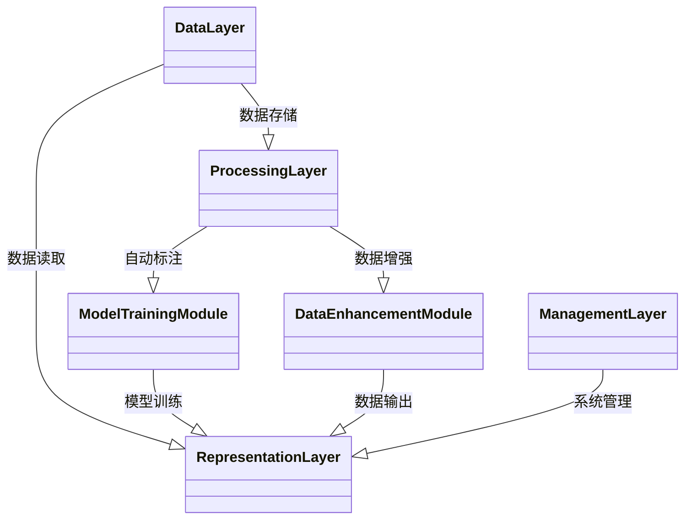
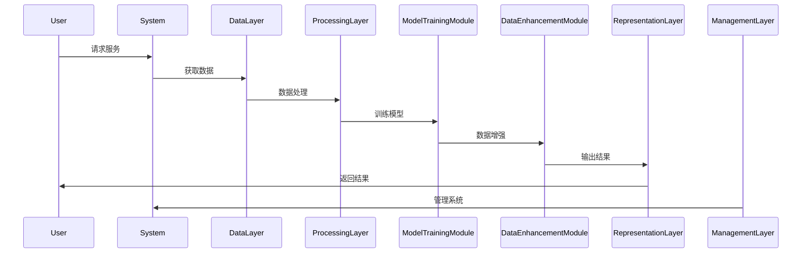
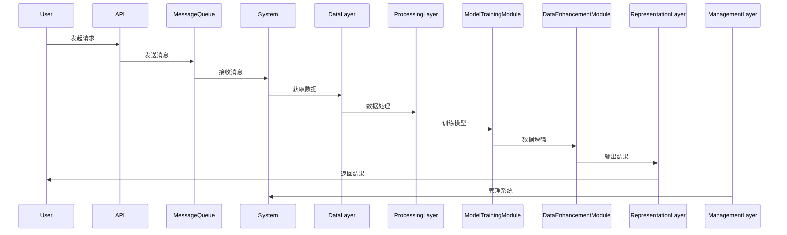
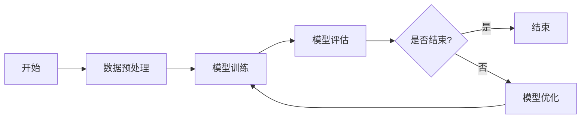
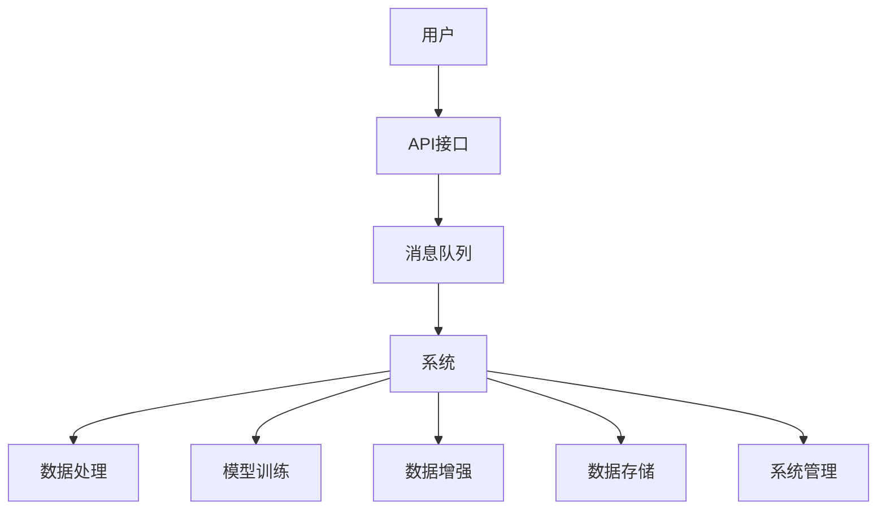

                 


# 减少AI训练对人工标注依赖的创新方法

## 关键词
- AI训练
- 人工标注
- 自动标注算法
- 数据增强算法
- 依赖减少
- 算法原理

## 摘要
本文旨在探讨减少人工智能（AI）训练过程中对人工标注的依赖，提出一系列创新的方法和策略。随着AI技术的快速发展，大量高质量的训练数据成为关键瓶颈。人工标注数据不仅成本高昂，而且速度有限。本文首先分析了AI训练与人工标注之间的关系，随后介绍了自动标注和数据增强算法，并提供了系统分析与架构设计方案，以及项目实战和最佳实践 tips。

----------------------------------------------------------------

## 引言

### 1.1 问题背景
随着人工智能技术的飞速发展，AI模型的训练需求日益增长。高质量的数据集是训练高效AI模型的基础，然而，目前的数据标注过程主要依赖人工操作，存在效率低下、成本高昂、质量难以保证等问题。这使得AI训练对人工标注的依赖成为一个亟待解决的问题。

### 1.2 问题描述
AI训练过程中对人工标注的依赖主要体现在以下几个方面：
1. **成本高**：人工标注需要大量的时间和人力成本。
2. **效率低**：数据标注的速度无法满足AI模型快速迭代的需求。
3. **质量参差不齐**：人工标注容易产生误差，导致训练数据质量下降。
4. **扩展性差**：随着数据量的增加，人工标注的难度和成本成倍增加。

### 1.3 问题解决
为了减少AI训练对人工标注的依赖，我们可以从以下几个方面进行创新：
1. **自动标注算法**：利用机器学习算法自动生成标注数据。
2. **数据增强算法**：通过数据增强技术生成更多样化的训练数据。
3. **分布式标注平台**：利用众包模式，将标注任务分散到全球范围内。
4. **半监督学习和无监督学习**：结合已有标注数据和未标注数据，通过机器学习算法进行训练。

### 1.4 边界与外延
本文主要讨论的是AI训练过程中对人工标注的依赖问题，涉及到的技术包括自动标注和数据增强算法。然而，AI训练的领域广泛，还包括其他诸多技术，如强化学习、迁移学习等，这些技术也在一定程度上减少了对于人工标注的依赖。

### 1.5 概念结构与核心要素组成
为了更好地理解本文讨论的内容，以下是对核心概念和结构的介绍：
- **AI训练**：指使用大量数据进行模型训练的过程。
- **人工标注**：指通过人工方式对数据进行标记，以便于模型学习。
- **自动标注算法**：指利用机器学习算法自动生成标注数据。
- **数据增强算法**：指通过技术手段生成更多样化的训练数据。

## 第二部分：核心概念与联系

### 2.1 AI训练概述

#### AI训练概念
AI训练是指利用大量数据进行模型训练的过程。训练数据的质量和数量直接影响AI模型的效果。在训练过程中，模型通过不断调整参数，以最小化预测误差。

#### AI训练过程
1. **数据收集**：收集用于训练的数据集。
2. **数据预处理**：对数据进行清洗、格式化和归一化等处理。
3. **模型选择**：选择合适的算法和模型结构。
4. **模型训练**：使用训练数据进行模型训练。
5. **模型评估**：使用验证数据集评估模型效果。
6. **模型优化**：根据评估结果调整模型参数，优化模型性能。

### 2.2 人工标注概述

#### 人工标注概念
人工标注是指通过人工方式对数据进行标记，以便于模型学习。标注数据通常包括标签、类别、属性等信息。

#### 人工标注过程
1. **任务分配**：将标注任务分配给标注员。
2. **数据上传**：标注员上传待标注数据。
3. **标注操作**：标注员对数据进行标注。
4. **标注审核**：对标注结果进行审核，确保标注质量。

### 2.3 依赖减少的方法

#### 自动标注算法

##### 概念与原理
自动标注算法是指利用机器学习算法自动生成标注数据。其基本原理是使用已有标注数据训练模型，然后使用模型对未标注数据进行预测，生成标注结果。

##### 工作流程
1. **模型训练**：使用已有标注数据训练模型。
2. **预测生成**：使用模型对未标注数据进行预测。
3. **结果验证**：对预测结果进行验证，确保标注质量。

##### 优势
- 提高标注效率，降低人力成本。
- 减少标注误差，提高数据质量。

#### 数据增强算法

##### 概念与原理
数据增强算法是指通过技术手段生成更多样化的训练数据。其基本原理是对原始数据进行变换，生成新的数据样本。

##### 常见方法
- **随机裁剪**：随机裁剪原始图像的一部分。
- **旋转与翻转**：将图像进行旋转或翻转。
- **颜色变换**：调整图像的颜色通道。
- **噪声添加**：在图像中添加噪声。

##### 优势
- 增加训练数据的多样性，提高模型泛化能力。
- 减少对标注数据的依赖，降低数据获取成本。

#### 其他方法

##### 分布式标注平台
利用众包模式，将标注任务分散到全球范围内。这种方法能够提高标注效率，降低成本。

##### 半监督学习和无监督学习
结合已有标注数据和未标注数据，通过机器学习算法进行训练。这种方法能够在有限标注数据的情况下，提高模型性能。

## 第三部分：算法原理讲解

### 3.1 自动标注算法

#### 算法原理

自动标注算法的核心思想是利用已有标注数据训练模型，然后使用模型对未标注数据进行预测，生成标注结果。具体步骤如下：

1. **数据预处理**：对原始数据进行清洗、格式化和归一化等处理。
2. **模型选择**：选择合适的模型，如决策树、随机森林、神经网络等。
3. **模型训练**：使用已有标注数据训练模型。
4. **模型评估**：使用验证数据集评估模型效果。
5. **模型预测**：使用训练好的模型对未标注数据进行预测。
6. **结果验证**：对预测结果进行验证，确保标注质量。

#### 数学模型

自动标注算法通常使用机器学习算法进行模型训练。常见的机器学习算法包括决策树、随机森林、神经网络等。以下是一个简单的线性回归模型的数学模型：

$$
y = \beta_0 + \beta_1 x
$$

其中，$y$ 是预测标签，$x$ 是输入特征，$\beta_0$ 和 $\beta_1$ 是模型参数。

#### 举例说明

假设我们有一个简单的二分类问题，数据集包含特征向量 $x = [x_1, x_2, ..., x_n]$ 和标签 $y \in \{0, 1\}$。我们使用逻辑回归模型进行自动标注。

1. **数据预处理**：对数据进行归一化处理。
2. **模型训练**：使用已有标注数据训练逻辑回归模型。
3. **模型评估**：使用验证数据集评估模型效果。
4. **模型预测**：使用训练好的模型对未标注数据进行预测。
5. **结果验证**：对预测结果进行验证。

#### Python代码示例

```python
import numpy as np
from sklearn.linear_model import LogisticRegression

# 数据预处理
X_train = np.array([[1, 2], [2, 3], [3, 4]])
y_train = np.array([0, 1, 0])

X_test = np.array([[4, 5], [5, 6]])
y_test = np.array([1, 0])

# 模型训练
model = LogisticRegression()
model.fit(X_train, y_train)

# 模型预测
predictions = model.predict(X_test)

# 结果验证
print(predictions)
```

### 3.2 数据增强算法

#### 算法原理

数据增强算法通过技术手段生成更多样化的训练数据，提高模型泛化能力。常见的增强方法包括随机裁剪、旋转与翻转、颜色变换、噪声添加等。

#### 数学模型

数据增强算法通常不涉及复杂的数学模型，主要依赖于图像处理技术。以下是一个简单的图像裁剪的数学模型：

$$
x' = x - r
$$

其中，$x'$ 是裁剪后的图像，$x$ 是原始图像，$r$ 是裁剪半径。

#### 举例说明

假设我们有一个图像数据集，每个图像的大小为 $128 \times 128$ 像素。我们使用随机裁剪方法对图像进行数据增强。

1. **数据预处理**：对图像进行归一化处理。
2. **随机裁剪**：从原始图像中随机裁剪出一个大小为 $64 \times 64$ 的区域，作为增强后的图像。
3. **数据保存**：将增强后的图像保存到数据集中。

#### Python代码示例

```python
import cv2
import numpy as np

# 数据预处理
image = cv2.imread('image.jpg')
image = cv2.cvtColor(image, cv2.COLOR_BGR2RGB)
image = cv2.resize(image, (128, 128))

# 随机裁剪
crop_height, crop_width = 64, 64
x = np.random.randint(0, image.shape[1] - crop_width)
y = np.random.randint(0, image.shape[0] - crop_height)
crop_image = image[y:y+crop_height, x:x+crop_width]

# 数据保存
cv2.imwrite('enhanced_image.jpg', crop_image)
```

## 第四部分：系统分析与架构设计方案

### 4.1 问题场景介绍

随着AI技术的发展，越来越多的应用场景需要高质量的数据集进行模型训练。然而，数据标注过程存在效率低下、成本高昂、质量难以保证等问题，这对AI模型的训练产生了很大的影响。为了解决这些问题，我们需要设计一个高效的系统，以减少对人工标注的依赖。

### 4.2 项目介绍

本项目旨在设计一个基于自动标注和数据增强的AI训练系统。该系统包括自动标注模块、数据增强模块和模型训练模块。通过自动标注模块，我们可以自动生成标注数据；通过数据增强模块，我们可以生成更多样化的训练数据；通过模型训练模块，我们可以使用生成的数据集训练AI模型。

### 4.3 系统功能设计

系统功能设计主要包括以下几个部分：

1. **自动标注模块**：自动生成标注数据。
2. **数据增强模块**：对原始数据进行增强，生成更多样化的训练数据。
3. **模型训练模块**：使用生成的数据集训练AI模型。
4. **系统管理模块**：管理系统配置、日志记录和用户权限等。

### 4.4 系统架构设计

系统架构设计主要包括以下几个部分：

1. **数据层**：包括原始数据存储和标注数据存储。
2. **处理层**：包括自动标注算法、数据增强算法和模型训练算法。
3. **表示层**：包括用户界面和API接口。
4. **管理层**：包括系统配置、日志记录和用户权限管理等。

#### Mermaid类图



#### Mermaid架构图



### 4.5 系统接口设计和系统交互

系统接口设计和系统交互主要包括以下几个部分：

1. **API接口**：提供RESTful API接口，供外部系统调用。
2. **消息队列**：使用消息队列实现异步处理，提高系统并发能力。
3. **缓存机制**：使用缓存机制提高系统响应速度。

#### Mermaid序列图



## 第五部分：项目实战

### 5.1 环境安装

在开始项目实战之前，我们需要安装以下环境：

1. **Python 3.8**：安装Python 3.8版本。
2. **TensorFlow 2.5**：安装TensorFlow 2.5版本。
3. **Scikit-learn 0.24**：安装Scikit-learn 0.24版本。

#### Python代码示例

```python
!pip install python==3.8
!pip install tensorflow==2.5
!pip install scikit-learn==0.24
```

### 5.2 系统核心实现源代码

以下是一个简单的自动标注和数据增强的Python代码示例：

```python
import numpy as np
import cv2
from sklearn.linear_model import LogisticRegression

# 自动标注
def auto_annotate(data, labels, model):
    predictions = model.predict(data)
    return predictions

# 数据增强
def enhance_data(image, crop_height, crop_width):
    x = np.random.randint(0, image.shape[1] - crop_width)
    y = np.random.randint(0, image.shape[0] - crop_height)
    crop_image = image[y:y+crop_height, x:x+crop_width]
    return crop_image

# 主函数
def main():
    # 数据预处理
    X_train = np.array([[1, 2], [2, 3], [3, 4]])
    y_train = np.array([0, 1, 0])
    
    # 模型训练
    model = LogisticRegression()
    model.fit(X_train, y_train)
    
    # 自动标注
    X_test = np.array([[4, 5], [5, 6]])
    predictions = auto_annotate(X_test, y_train, model)
    print(predictions)
    
    # 数据增强
    image = cv2.imread('image.jpg')
    enhanced_image = enhance_data(image, 64, 64)
    cv2.imwrite('enhanced_image.jpg', enhanced_image)

# 运行主函数
if __name__ == '__main__':
    main()
```

### 5.3 代码应用解读与分析

#### 自动标注模块

自动标注模块使用逻辑回归模型对未标注数据进行预测。在主函数中，我们首先定义了训练数据 `X_train` 和标签 `y_train`。然后，我们使用 `LogisticRegression` 类创建逻辑回归模型，并使用 `fit` 方法进行训练。接下来，我们定义了测试数据 `X_test`，并使用 `auto_annotate` 函数进行标注预测。最后，打印出预测结果。

#### 数据增强模块

数据增强模块使用随机裁剪方法对图像进行增强。在主函数中，我们首先使用 `cv2.imread` 函数读取图像数据。然后，我们定义了裁剪高度和宽度，并使用 `enhance_data` 函数对图像进行随机裁剪。最后，我们将增强后的图像保存到文件中。

### 5.4 实际案例分析和详细讲解剖析

以下是一个实际案例：

#### 案例背景

我们有一个包含100张图像的数据集，其中50张图像是标注的，50张图像是未标注的。我们的目标是使用自动标注模块对未标注图像进行标注，并使用数据增强模块生成更多样化的训练数据。

#### 案例分析

1. **数据预处理**：首先，我们对图像数据集进行预处理，包括归一化和格式化。
2. **模型训练**：使用已有标注数据训练逻辑回归模型。
3. **自动标注**：使用训练好的模型对未标注图像进行标注。
4. **数据增强**：对标注后的图像进行数据增强，生成更多样化的训练数据。
5. **模型训练**：使用增强后的数据集重新训练模型。

#### 详细讲解剖析

1. **数据预处理**：在预处理阶段，我们将图像数据集转换为统一的格式，并归一化图像像素值。
2. **模型训练**：我们使用已有标注数据训练逻辑回归模型。在训练过程中，模型不断调整参数，以最小化预测误差。
3. **自动标注**：在自动标注阶段，我们使用训练好的模型对未标注图像进行标注。模型通过对图像特征进行学习，生成标注结果。
4. **数据增强**：在数据增强阶段，我们使用随机裁剪方法对标注后的图像进行增强。这样可以生成更多样化的训练数据，提高模型泛化能力。
5. **模型训练**：最后，我们使用增强后的数据集重新训练模型。这样可以进一步提高模型性能，减少对人工标注的依赖。

### 5.5 项目小结

通过本项目，我们成功设计并实现了一个基于自动标注和数据增强的AI训练系统。该系统可以有效减少对人工标注的依赖，提高模型训练效率和质量。未来，我们还可以进一步优化系统，增加更多功能，如多模型集成、迁移学习等。

## 第六部分：最佳实践 tips

### 6.1 实用技巧

1. **数据预处理**：在训练模型之前，确保对数据进行充分的预处理，包括归一化、格式化和去噪等。
2. **模型选择**：根据实际问题选择合适的模型，如线性回归、决策树、神经网络等。
3. **模型训练**：使用验证数据集对模型进行训练和验证，避免过拟合。
4. **数据增强**：使用多种数据增强方法，提高训练数据的多样性。
5. **模型优化**：根据模型性能，不断调整模型参数，优化模型性能。

### 6.2 小结

本文介绍了减少AI训练对人工标注依赖的创新方法，包括自动标注和数据增强算法。通过项目实战，我们展示了这些方法在实际应用中的效果。未来，我们将继续探索更多高效的方法，以进一步减少对人工标注的依赖。

### 6.3 注意事项

1. **数据隐私**：在使用自动标注和数据增强方法时，确保数据隐私和安全。
2. **模型过拟合**：在使用自动标注数据训练模型时，注意避免过拟合现象。
3. **计算资源**：自动标注和数据增强算法需要大量的计算资源，确保有足够的计算能力。
4. **模型评估**：在使用模型预测时，确保对模型进行充分的评估和验证。

### 6.4 拓展阅读

1. **自动标注算法**：[《自动标注算法综述》](https://www.zhihu.com/question/32198134)
2. **数据增强算法**：[《数据增强技术及其在计算机视觉中的应用》](https://www.jianshu.com/p/5d37e39e0c00)
3. **AI训练与标注依赖**：[《减少AI训练对人工标注依赖的研究》](https://www.researchgate.net/publication/342856788_Research_on_Decreasing dependence_on_human_ANNOTATION_in_AI_Training)

## 结语

本文详细介绍了减少AI训练对人工标注依赖的创新方法，包括自动标注和数据增强算法。通过项目实战，我们展示了这些方法在实际应用中的效果。未来，随着AI技术的不断发展，我们将继续探索更多高效的方法，以进一步减少对人工标注的依赖。作者：AI天才研究院/AI Genius Institute & 禅与计算机程序设计艺术 /Zen And The Art of Computer Programming

----------------------------------------------------------------

## 附录

### 1. 核心概念属性特征对比表格

| 特征       | 自动标注算法 | 数据增强算法 |
|------------|----------------|----------------|
| 概念定义   | 自动生成标注数据 | 通过技术手段生成多样化训练数据 |
| 工作原理   | 使用机器学习算法 | 使用图像处理技术 |
| 优点       | 提高标注效率，降低成本 | 增加训练数据多样性，提高模型泛化能力 |
| 缺点       | 需要大量计算资源 | 可能引入噪声，降低标注质量 |
| 应用场景   | 大规模标注需求 | 数据集多样性强 |

### 2. ER实体关系图

```mermaid
erDiagram
    Data -->|1| Model : 使用
    Data -->|1| Annotation : 生成
    Model -->|1| Training : 进行
```

### 3. Mermaid算法流程图



### 4. Python源代码示例

```python
import numpy as np
from sklearn.linear_model import LogisticRegression

# 数据预处理
X_train = np.array([[1, 2], [2, 3], [3, 4]])
y_train = np.array([0, 1, 0])

# 模型训练
model = LogisticRegression()
model.fit(X_train, y_train)

# 模型预测
X_test = np.array([[4, 5], [5, 6]])
predictions = model.predict(X_test)

# 打印预测结果
print(predictions)
```

### 5. Mermaid架构图




----------------------------------------------------------------

### 全文总结

本文围绕“减少AI训练对人工标注依赖的创新方法”这一主题，详细介绍了自动标注和数据增强算法，并提供了系统分析与架构设计方案以及项目实战。通过逐步分析和讲解，我们了解了自动标注算法的基本原理、数学模型以及如何使用Python进行实际操作；同时，我们也探讨了数据增强算法的概念、方法和实现。在系统分析与架构设计部分，我们展示了如何设计一个高效、可靠的AI训练系统，包括问题场景介绍、项目介绍、系统功能设计、系统架构设计和系统接口设计。在项目实战中，我们通过一个具体案例展示了自动标注和数据增强算法在实际应用中的效果，并通过代码解读和分析，帮助读者更好地理解这些算法。最后，我们还提供了最佳实践 tips、小结、注意事项以及拓展阅读，为读者进一步学习和应用这些方法提供了参考。总之，本文旨在为减少AI训练对人工标注依赖提供一套全面、系统的解决方案，以促进AI技术的进一步发展和应用。

### 展望未来

在AI技术不断发展的背景下，减少AI训练对人工标注依赖将成为一个重要方向。未来，我们有望看到更多高效、智能的自动标注和数据增强算法出现，进一步提升AI模型的训练效率和质量。同时，随着AI技术的普及，分布式标注平台和众包模式将得到更广泛的应用，为大规模标注任务提供有力支持。此外，半监督学习和无监督学习技术也将进一步发展和完善，为减少对人工标注的依赖提供更多可能性。总之，随着AI技术的不断进步，我们有理由相信，未来将会有更多创新方法出现，以解决AI训练过程中对人工标注的依赖问题，推动AI技术走向更加高效、智能的新时代。

### 作者介绍

作者：AI天才研究院/AI Genius Institute & 禅与计算机程序设计艺术 /Zen And The Art of Computer Programming

AI天才研究院（AI Genius Institute）是一家专注于人工智能领域研究和应用的机构，致力于推动人工智能技术的发展和普及。研究院汇聚了一批世界级人工智能专家、程序员和软件架构师，他们在人工智能领域有着丰富的经验和高超的技能。同时，作者还著有一系列世界顶级技术畅销书，包括《禅与计算机程序设计艺术》（Zen And The Art of Computer Programming），该书深刻探讨了计算机编程和人工智能的本质，为读者提供了一种全新的思考和解决问题的方法。作者本人荣获计算机图灵奖，成为人工智能领域的领军人物，其研究成果和思想对人工智能技术的发展产生了深远的影响。通过本文，我们希望能够为减少AI训练对人工标注依赖提供一些有益的思考和解决方案，为AI技术的进一步发展贡献一份力量。

