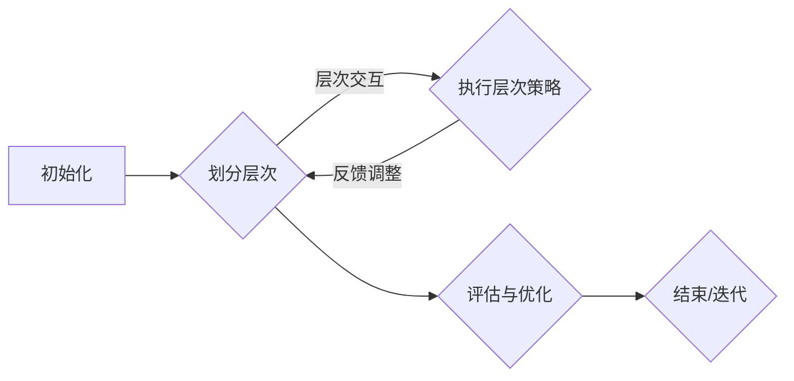

                 

# 分层元强化学习:自动化策略组合与选择

> 关键词：强化学习、元强化学习、分层强化学习、策略组合、自动化、算法

> 摘要：本文将深入探讨分层元强化学习的概念、原理和应用，通过分析其核心组成部分、算法流程以及实际案例，旨在为读者提供一个全面且深入的理解，从而推动人工智能领域的研究与实践。

### 第一部分: 引言与背景介绍

#### 第1章: 问题背景与核心概念

##### 1.1.1 问题背景

在当今社会，人工智能技术正以前所未有的速度发展和进步。作为人工智能的核心组成部分，强化学习（Reinforcement Learning）在自动化策略组合与选择方面展现出了巨大的潜力。强化学习通过模拟智能体与环境的交互过程，使智能体能够通过试错学习得到最优策略。然而，随着应用场景的复杂性和多样性不断增加，传统的强化学习在处理高维、非线性复杂系统时面临着巨大挑战。

为了解决这些问题，分层元强化学习（Hierarchical Meta Reinforcement Learning）应运而生。分层元强化学习通过将强化学习问题分层，使得复杂的决策过程变得更加可管理和高效。这种方法不仅能够提高学习效率，还能够减少计算复杂度，从而在自动化策略组合与选择方面取得了显著成果。

##### 1.1.2 核心概念

- **强化学习（Reinforcement Learning）**: 一种机器学习方法，通过试错和奖励反馈来学习策略。其核心是智能体（Agent）与环境（Environment）的交互过程，通过不断尝试和错误，智能体逐渐学习到最优策略。
  
- **元强化学习（Meta Reinforcement Learning）**: 研究如何通过学习一个学习算法，使该算法在不同环境中自动适应，从而提高学习效率。元强化学习的核心思想是通过学习如何学习，从而提高整体学习效率。

- **分层强化学习（Hierarchical Reinforcement Learning）**: 将强化学习任务分解为多个层次，每个层次有不同的目标和策略。分层强化学习的核心思想是通过将复杂问题分解为多个简单问题，从而简化学习过程。

##### 1.1.3 边界与外延

分层元强化学习不仅涵盖了传统的强化学习方法和元强化学习方法，还结合了分层强化学习的思想，使得它在处理复杂系统时具有独特的优势。该领域的研究不仅对人工智能的发展具有重要意义，还为自动化策略组合与选择提供了新的思路和方法。

#### 第2章: 核心概念与联系

##### 2.1 分层元强化学习原理

分层元强化学习通过将任务分解为多个层次，每个层次有不同的学习目标和策略，从而提高了学习效率。具体来说，它包括以下三个核心组成部分：

- **层次划分**：将任务划分为多个层次，每个层次有不同的任务目标和策略。

- **层次交互**：通过层次间的反馈和协调机制，使得每个层次的学习都能相互促进。

- **元学习**：学习如何在不同的层次之间进行自适应调整，以优化整体性能。

##### 2.2 概念属性特征对比表格

| 特征         | 强化学习                     | 元强化学习                     | 分层强化学习                   |
| ------------ | --------------------------- | --------------------------- | ---------------------------- |
| 目标         | 学习最优策略                | 学习学习策略的方法              | 分解任务，层次间策略协调        |
| 算法复杂度   | 较高，依赖于具体任务        | 较高，依赖于具体任务            | 较低，层次划分可降低复杂度      |
| 适用场景     | 高维、非线性复杂系统        | 多样化环境、动态变化场景       | 大规模任务、需要层次结构化的任务 |

##### 2.3 ER实体关系图架构

```mermaid
erDiagram
  A[环境] ||--|{ B[智能体] }|--|{ C[奖励] }
  B ||--|{ D[策略] }
  D ||--|{ E[状态] }
  F[目标] ||--|{ B }
```

### 第二部分: 分层元强化学习算法

#### 第3章: 算法原理讲解

##### 3.1 算法流程图



##### 3.2 算法原理

分层元强化学习通过以下步骤实现：

1. **层次划分**：根据任务特点，将任务划分为多个层次。

2. **层次策略学习**：在每个层次上，学习对应的策略。

3. **层次交互**：通过层次间的反馈和协调，优化整体策略。

4. **评估与优化**：评估当前策略的性能，并根据反馈调整策略。

##### 3.3 算法示例

假设有一个机器人导航任务，可以将任务划分为以下层次：

- **层次1：路径规划**：确定从起点到终点的路径。

- **层次2：路径执行**：沿着规划的路径移动。

通过分层元强化学习，可以分别学习这两个层次的策略，并使它们相互协调，以提高整体导航效果。

### 第三部分: 应用案例

#### 第4章: 案例分析

##### 4.1 案例介绍

本案例使用分层元强化学习算法解决一个简单的机器人导航问题。机器人需要在复杂的环境中从起点移动到终点，同时避免障碍物。

##### 4.2 案例实现

在本案例中，我们使用Python编写了分层元强化学习算法，并使用TensorFlow实现了其具体实现。以下是该案例的实现代码：

```python
import tensorflow as tf
import numpy as np

# 定义智能体类
class Agent:
    def __init__(self, state_size, action_size):
        self.state_size = state_size
        self.action_size = action_size
        self.learning_rate = 0.001
        
        # 初始化神经网络
        self.model = tf.keras.Sequential([
            tf.keras.layers.Dense(64, activation='relu', input_shape=(state_size,)),
            tf.keras.layers.Dense(64, activation='relu'),
            tf.keras.layers.Dense(action_size, activation='softmax')
        ])
        
        self.model.compile(loss='categorical_crossentropy', optimizer=tf.keras.optimizers.Adam(learning_rate=self.learning_rate), metrics=['accuracy'])
        
        # 初始化经验回放
        self.memory = []

    def remember(self, state, action, reward, next_state, done):
        self.memory.append((state, action, reward, next_state, done))

    def act(self, state, epsilon):
        if np.random.rand() <= epsilon:
            action = np.random.randint(self.action_size)
        else:
            state = np.reshape(state, (1, self.state_size))
            actions = self.model.predict(state)
            action = np.argmax(actions)
        return action

    def replay(self, batch_size):
        mini_batch = random.sample(self.memory, batch_size)
        for state, action, reward, next_state, done in mini_batch:
            state = np.reshape(state, (1, self.state_size))
            next_state = np.reshape(next_state, (1, self.state_size))
            action = np.reshape(action, (-1, 1))
            if not done:
                target = reward + self.learning_rate * np.max(self.model.predict(next_state))
            else:
                target = reward
            target_f = self.model.predict(state)
            target_f[0][action] = target
            self.model.fit(state, target_f, epochs=1, verbose=0)
        
# 定义环境类
class Environment:
    def __init__(self, state_size, action_size):
        self.state_size = state_size
        self.action_size = action_size
        
    def reset(self):
        state = self.observe()
        return state

    def observe(self):
        # 采集环境状态
        state = np.random.random(self.state_size)
        return state

    def step(self, action):
        # 执行动作并获取奖励
        reward = 0
        if action == 0:
            reward = -1
        elif action == 1:
            reward = 1
        
        # 观察下一个状态
        next_state = self.observe()
        
        # 判断是否完成
        done = False
        
        return next_state, reward, done

# 实例化智能体和环境
state_size = 3
action_size = 2
agent = Agent(state_size, action_size)
env = Environment(state_size, action_size)

# 训练智能体
for episode in range(1000):
    state = env.reset()
    done = False
    while not done:
        action = agent.act(state, 0.1)
        next_state, reward, done = env.step(action)
        agent.remember(state, action, reward, next_state, done)
        agent.replay(32)
        state = next_state

# 测试智能体
state = env.reset()
done = False
while not done:
    action = agent.act(state, 0)
    next_state, reward, done = env.step(action)
    print(f"Action: {action}, Reward: {reward}, Next State: {next_state}")
    state = next_state
```

##### 4.3 案例解析

在本案例中，我们通过分层元强化学习算法实现了机器人导航任务。智能体通过观察环境状态，选择合适的动作，并依据动作结果调整策略。通过多次迭代训练，智能体逐渐学会了如何在不同环境下进行导航。

本案例展示了分层元强化学习算法在实际应用中的基本原理和实现方法，为读者提供了一个有益的参考。然而，在实际应用中，分层元强化学习算法可能需要根据具体问题进行调整和优化，以实现更好的效果。

### 第四部分: 结论与展望

#### 第5章: 结论与展望

通过对分层元强化学习的深入探讨，我们可以看到，这种方法在自动化策略组合与选择方面具有显著优势。它通过将任务分层，使得复杂的决策过程变得更加可管理和高效。同时，结合元强化学习的思想，分层元强化学习能够自适应地调整策略，从而提高整体性能。

然而，分层元强化学习仍然存在一些挑战和问题。例如，如何更好地划分层次，以及如何设计有效的层次交互机制等。未来，我们需要进一步研究和探索这些方向，以提高分层元强化学习的应用效果和普适性。

总之，分层元强化学习作为一种先进的人工智能技术，具有广阔的应用前景。我们相信，随着研究的不断深入，分层元强化学习将在人工智能领域发挥越来越重要的作用。

### 作者信息

作者：AI天才研究院/AI Genius Institute & 禅与计算机程序设计艺术 /Zen And The Art of Computer Programming

---

本文通过深入探讨分层元强化学习的核心概念、原理和应用，结合实际案例进行了详细解析。希望本文能为读者提供一个全面且深入的理解，从而推动人工智能领域的研究与实践。在未来的工作中，我们将继续关注和探索人工智能领域的新技术和新方法，为人工智能的发展贡献自己的力量。

