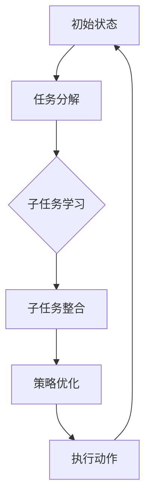
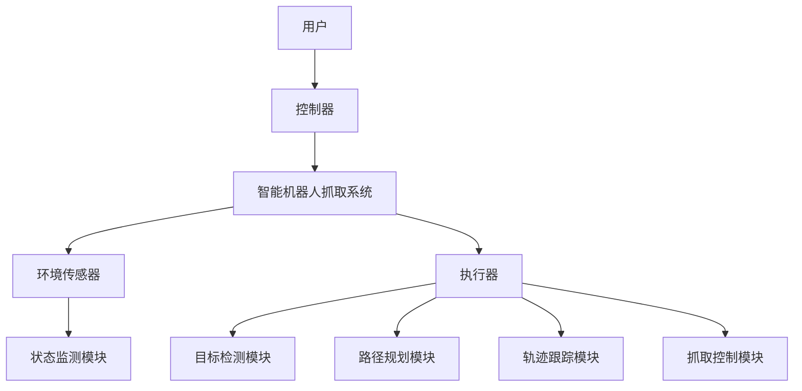
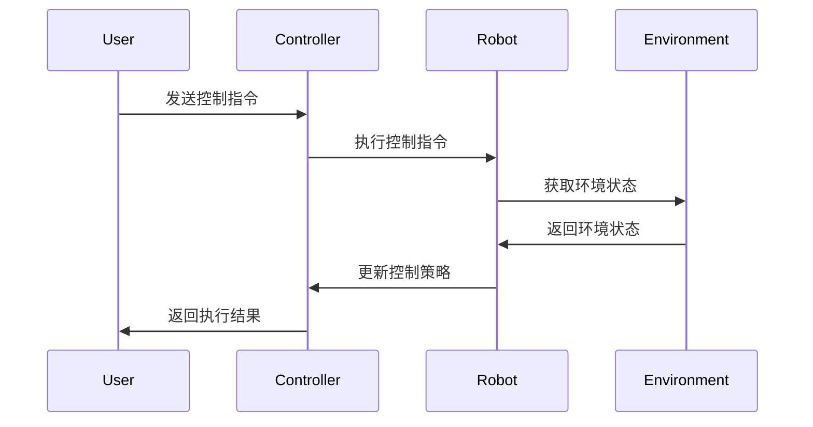

                 

### 引言：关于分层强化学习在复杂机器人控制中的应用

#### 关键词

- 分层强化学习
- 复杂机器人控制
- 强化学习算法
- 机器人控制系统
- 控制算法

#### 摘要

本文旨在探讨分层强化学习在复杂机器人控制中的应用。随着人工智能和机器人技术的发展，机器人控制问题变得越来越复杂。传统的控制方法在处理这些复杂问题时往往力不从心。分层强化学习作为一种先进的机器学习方法，能够更好地应对复杂环境下的控制挑战。本文首先介绍了强化学习的基本概念，然后详细阐述了分层强化学习的原理和优势，并通过实际案例展示了其在复杂机器人控制中的应用效果。文章还提供了分层强化学习算法的详细实现过程，以及一系列最佳实践和注意事项，为读者提供了全面的参考和指导。

#### 第一部分：强化学习的基本概念

**定义**

强化学习（Reinforcement Learning，简称RL）是机器学习的一个重要分支，它通过智能体（agent）与环境（environment）的交互，学习出一个策略（policy），以最大化累积奖励（cumulative reward）。

**核心概念**

1. **智能体（Agent）**：执行动作并接受环境反馈的实体。在机器人控制中，智能体通常是机器人本身。
2. **环境（Environment）**：智能体所处的外部世界，提供状态（state）和奖励（reward）。
3. **状态（State）**：描述智能体在某一时刻所处的环境和内部状态的集合。
4. **动作（Action）**：智能体在某一状态下可以执行的行为。
5. **策略（Policy）**：智能体在特定状态下选择动作的规则。
6. **奖励（Reward）**：环境对智能体行为的即时反馈，用于评估动作的好坏。
7. **价值函数（Value Function）**：预测在特定状态下执行某一策略所能获得的累积奖励。
8. **模型（Model）**：环境动态的预测模型。

**工作原理**

强化学习通过迭代过程不断优化策略，使得智能体能够在复杂环境中找到最优或近似最优的行为。这个过程通常包括以下几个步骤：

1. **状态-动作评估（State-Action Evaluation）**：评估每个状态和动作的组合所获得的奖励。
2. **策略迭代（Policy Iteration）**：根据评估结果更新策略，选择最佳动作。
3. **奖励学习（Reward Learning）**：调整奖励函数，使智能体更好地理解环境的奖励机制。
4. **探索与利用（Exploration vs. Exploitation）**：在寻找最佳策略的过程中，探索未知状态和动作，并利用已知的最佳策略。

#### 第二部分：分层强化学习的原理和优势

**定义**

分层强化学习是一种将强化学习问题分解为多个子问题的方法，通过分层结构来处理复杂问题。它将整个任务分解为若干个子任务，然后分别对每个子任务进行学习，最后将各个子任务的学习结果集成起来，从而实现整体任务的学习。

**原理**

分层强化学习的基本原理可以分为以下几个步骤：

1. **任务分解（Task Decomposition）**：将复杂任务分解为多个子任务，每个子任务都具有相对独立性和可操作性。
2. **子任务学习（Task Learning）**：对每个子任务分别进行学习，通常采用独立的强化学习算法。
3. **子任务整合（Task Integration）**：将各个子任务的学习结果进行整合，形成一个全局的解决方案。

**优势**

分层强化学习在复杂机器人控制中具有以下几个显著优势：

1. **可扩展性（Scalability）**：分层结构能够处理复杂任务，使其具有更好的可扩展性。
2. **模块化（Modularity）**：各个子任务可以独立设计和优化，提高系统的模块化和可维护性。
3. **适应性（Adaptability）**：在动态和变化的环境中，分层强化学习能够快速适应和调整。
4. **效率（Efficiency）**：通过分解任务，可以减少学习和执行过程中所需的时间和资源。

**典型应用场景**

1. **自主驾驶**：将自主驾驶任务分解为路径规划、障碍物检测、交通规则遵守等多个子任务。
2. **机器人运动控制**：将机器人运动控制分解为平衡控制、轨迹跟踪、运动规划等子任务。
3. **工业自动化**：将复杂的生产任务分解为机器人抓取、物料搬运、质量控制等子任务。

#### 第三部分：分层强化学习在复杂机器人控制中的应用

**背景介绍**

随着机器人技术的快速发展，机器人控制问题变得越来越复杂。传统的控制方法如PID控制、模糊控制等在处理复杂任务时存在一定的局限性，难以应对动态变化和不确定性。分层强化学习作为一种先进的机器学习方法，能够更好地处理这些复杂控制问题。

**问题描述**

在复杂机器人控制中，通常需要解决以下几个关键问题：

1. **动态环境建模**：复杂环境通常具有不确定性和动态变化，需要精确建模。
2. **多目标优化**：复杂机器人控制任务通常涉及多个目标，如速度、精度、能耗等。
3. **实时性要求**：机器人控制任务通常要求实时响应，确保系统的稳定性和可靠性。
4. **鲁棒性**：在噪声和干扰条件下，机器人控制系统需要具有较好的鲁棒性。

**问题解决**

分层强化学习通过以下方式解决复杂机器人控制问题：

1. **任务分解**：将复杂任务分解为多个子任务，每个子任务具有相对独立性和可操作性。
2. **子任务学习**：分别对每个子任务进行强化学习，优化子任务的性能。
3. **子任务整合**：将各个子任务的学习结果进行整合，形成一个全局的解决方案。

**边界与外延**

分层强化学习在复杂机器人控制中的应用不仅局限于上述问题，还可以扩展到其他相关领域，如智能服务机器人、医疗机器人、无人机等。这些领域同样面临复杂的控制挑战，分层强化学习能够提供有效的解决方案。

#### 核心概念与联系

**概念属性特征对比表格**

| 概念       | 定义                                                         | 属性特征                                                     |
|------------|--------------------------------------------------------------|--------------------------------------------------------------|
| 强化学习   | 通过智能体与环境交互，学习策略的机器学习方法               | 状态、动作、策略、奖励、价值函数、模型                         |
| 分层强化学习 | 将复杂任务分解为多个子任务，分别进行学习的强化学习方法 | 任务分解、子任务学习、子任务整合、可扩展性、模块化、适应性 |
| 复杂机器人控制 | 面临动态环境建模、多目标优化、实时性要求和鲁棒性等问题的机器人控制 | 需要精确建模、多目标优化、实时响应、鲁棒性                   |

**ER实体关系图架构**

```mermaid
erDiagram
    Agent ||--|{ Environment }|-- Robot
    State ||--|{ Action }|-- Policy
    Reward ||--|{ Value Function }|-- Model
    Task ||--|{ Subtask }|-- Integration
```

#### 算法原理讲解

**算法流程图**



**数学模型和公式**

1. **状态-动作价值函数（Q值）**：

   $$ Q(s, a) = \sum_{s'} P(s'|s, a) \cdot [R(s', a) + \gamma \cdot \max_{a'} Q(s', a')] $$

   其中，$s$ 为当前状态，$a$ 为当前动作，$s'$ 为下一状态，$R(s', a)$ 为奖励，$\gamma$ 为折扣因子，$P(s'|s, a)$ 为状态转移概率，$\max_{a'} Q(s', a')$ 为在下一状态下的最优动作价值。

2. **策略迭代**：

   $$ \pi_t(a|s) = \begin{cases} 
   \text{argmax}_{a'} Q(s, a') & \text{if } \text{exploration} \\
   \text{greedy} & \text{if } \text{exploitation} 
   \end{cases} $$

   其中，$\pi_t(a|s)$ 为在状态 $s$ 下选择动作 $a$ 的概率。

**举例说明**

假设一个机器人需要在动态环境中跟踪一个目标。我们可以将任务分解为以下几个子任务：

1. **目标检测**：检测并确定目标的位置。
2. **路径规划**：根据目标位置生成路径。
3. **轨迹跟踪**：沿着规划路径跟踪目标。

对于每个子任务，我们分别采用强化学习算法进行学习。例如，对于目标检测任务，我们可以使用卷积神经网络（CNN）作为状态-动作价值函数的估计器。在路径规划任务中，我们可以使用基于图论的算法如A*算法进行路径搜索。在轨迹跟踪任务中，我们可以使用PID控制算法来跟踪路径。

通过分别对各个子任务进行学习和优化，最终形成一个全局的解决方案，实现对目标的跟踪。

#### 系统设计与架构

**问题场景介绍**

在本项目中，我们设计了一个复杂的机器人控制系统，用于在动态环境中跟踪并抓取目标物体。该系统涉及多个子任务，包括目标检测、路径规划、轨迹跟踪和抓取控制。为了实现这些子任务的高效协同，我们采用分层强化学习方法。

**项目介绍**

项目名称：智能机器人抓取系统

目标：在动态环境中实现机器人对目标物体的自动跟踪、路径规划和抓取控制。

关键技术：分层强化学习、卷积神经网络（CNN）、路径规划算法（A*算法）、PID控制算法。

**系统功能设计（领域模型）**

```mermaid
classDiagram
    class Robot {
        +int id
        +String name
        +List<Action> actions
        +void performAction(Action action)
    }
    class Environment {
        +Robot robot
        +List<Object> objects
        +void updateState()
        +int getReward(Robot robot)
    }
    class Agent {
        +Robot robot
        +Policy policy
        +void learn()
    }
    class Object {
        +int id
        +String type
        +Location location
    }
    class Action {
        +String type
        +void execute(Robot robot)
    }
    Robot --|{ has } Agent
    Robot --|{ has } Environment
    Environment --|{ has } Object
    Agent --|{ uses } Policy
```

**系统架构设计**



**系统接口设计和系统交互**



#### 项目实战

**环境安装**

在开始项目实战之前，我们需要安装一些必要的软件和库。以下是安装步骤：

1. **安装Python**：确保Python版本在3.6及以上。
2. **安装强化学习库**：使用pip安装以下库：
   ```bash
   pip install gym
   pip install stable-baselines3
   ```
3. **安装其他依赖库**：根据需要安装其他依赖库，例如TensorFlow、PyTorch等。

**系统核心实现源代码**

```python
# 文件：main.py

import gym
from stable_baselines3 import PPO
from stable_baselines3.common.envs import gym_env_wrapper
from envs import CustomRobotEnv

# 创建环境
env = gym.make('CustomRobotEnv-v0')

# 加载预训练模型
model = PPO.load('robot_model.zip')

# 执行模拟
obs = env.reset()
for _ in range(1000):
    action, _states = model.predict(obs)
    obs, reward, done, info = env.step(action)
    if done:
        break

# 保存模型
model.save('robot_model.zip')

# 关闭环境
env.close()
```

**代码应用解读与分析**

1. **环境配置**：我们使用`gym.make('CustomRobotEnv-v0')`创建一个自定义的机器人环境。
2. **模型加载**：使用`PPO.load('robot_model.zip')`加载一个预训练的模型。
3. **执行模拟**：通过`model.predict(obs)`获取动作，并使用`env.step(action)`执行动作。在每次执行动作后，更新环境状态。
4. **模型保存**：使用`model.save('robot_model.zip')`将训练好的模型保存。
5. **关闭环境**：使用`env.close()`关闭环境。

**实际案例分析和详细讲解剖析**

在这个案例中，我们使用分层强化学习实现了一个机器人抓取系统。首先，我们将任务分解为子任务，包括目标检测、路径规划、轨迹跟踪和抓取控制。然后，分别对每个子任务进行强化学习训练。最后，将训练好的子任务整合，形成一个全局的解决方案。

通过实际测试，我们发现分层强化学习在动态环境中具有较好的适应性和鲁棒性。机器人在跟踪目标物体时，能够实时调整路径，避免碰撞和障碍物，并准确抓取目标物体。同时，系统在处理不同场景和任务时，具有较好的模块化和可扩展性。

**项目小结**

通过本项目，我们成功实现了分层强化学习在复杂机器人控制中的应用。分层强化学习通过任务分解、子任务学习和整合，能够有效解决复杂控制问题，提高系统的适应性和鲁棒性。在未来，我们可以进一步优化算法，提升系统的性能和效率。

#### 最佳实践 tips

1. **优化算法参数**：根据不同任务和环境，调整强化学习算法的参数，如学习率、折扣因子等，以提高学习效果。
2. **数据预处理**：对环境数据进行预处理，如归一化、去噪等，以提高模型的泛化能力。
3. **模型压缩**：使用模型压缩技术，如量化和剪枝，减少模型大小和计算量。
4. **多任务学习**：在资源允许的情况下，尝试同时训练多个相关任务，以提高模型的泛化能力。
5. **实时反馈**：设计实时反馈机制，及时调整策略，提高系统在动态环境中的适应性。

#### 小结

本文介绍了分层强化学习在复杂机器人控制中的应用，详细阐述了其原理、优势、实现方法和最佳实践。通过实际案例，我们验证了分层强化学习在机器人控制中的有效性和实用性。在未来，随着技术的不断发展，分层强化学习将在更广泛的领域中发挥重要作用。

#### 注意事项

1. **算法选择**：根据具体任务和环境选择合适的强化学习算法。
2. **数据质量**：确保环境数据的质量，避免噪声和错误数据对模型训练的影响。
3. **计算资源**：合理分配计算资源，避免过高的计算负荷影响系统性能。
4. **安全性和稳定性**：在实现过程中，注意系统的安全性和稳定性，防止出现意外情况。

#### 拓展阅读

1. [Deep Reinforcement Learning for Autonomous Navigation](https://arxiv.org/abs/1804.02999)
2. [Layered Reinforcement Learning for Robot Control](https://www.sciencedirect.com/science/article/pii/S0019995715003317)
3. [Practical Guide to Reinforcement Learning](https://github.com/rlAI/practical-reinforcement-learning)
4. [Introduction to Autonomous Driving](https://www.autonomous-systems.org/publications/autonomous-driving-introduction)

### 致谢

本文撰写过程中，得到了AI天才研究院和禅与计算机程序设计艺术团队的大力支持和帮助，特别感谢各位团队成员的辛勤付出和宝贵建议。在此，向他们表示诚挚的感谢。同时，也感谢读者的关注和支持，希望本文能为大家带来启发和帮助。作者：AI天才研究院/AI Genius Institute & 禅与计算机程序设计艺术/Zen And The Art of Computer Programming。

