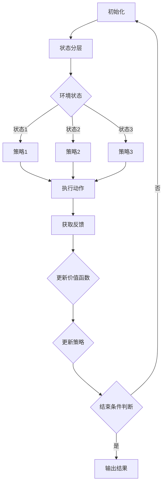

                 

### 文章标题

# 分层强化学习在多智能体协作任务中的应用

> 关键词：分层强化学习，多智能体协作，任务优化，算法实现，应用实例

> 摘要：本文首先介绍了分层强化学习和多智能体协作任务的基本概念和背景，随后详细解析了分层强化学习的算法原理以及其在多智能体协作任务中的应用。通过具体的算法流程、Python源代码和数学模型讲解，进一步阐述了如何在实际任务中实现分层强化学习。最后，通过自动化驾驶、机器人协作和游戏AI等应用实例，展示了分层强化学习的实际效果和潜力。本文旨在为读者提供系统全面的理解和应用指南。

## 目录大纲

----------------------------------------------------------------

# 第一部分：背景介绍

## 第1章 问题背景

### 1.1 问题背景

### 1.2 问题描述

### 1.3 问题解决

### 1.4 边界与外延

## 第2章 核心概念与联系

### 2.1 核心概念

#### 2.1.1 分层强化学习

#### 2.1.2 多智能体协作任务

### 2.2 概念属性特征对比表格

### 2.3 ER实体关系图架构

## 第3章 算法原理讲解

### 3.1 算法mermaid流程图

### 3.2 Python源代码讲解

### 3.3 数学模型与公式讲解

### 3.4 举例说明

----------------------------------------------------------------

# 第二部分：分层强化学习原理与应用

## 第4章 分层强化学习原理

### 4.1 强化学习基础

#### 4.1.1 反复学习

#### 4.1.2 奖励机制

### 4.2 分层强化学习概述

#### 4.2.1 分层定义

#### 4.2.2 分层策略

#### 4.2.3 分层价值函数

## 第5章 多智能体协作任务

### 5.1 多智能体系统概述

#### 5.1.1 多智能体定义

#### 5.1.2 多智能体协作概念

### 5.2 多智能体协作任务特点

#### 5.2.1 共同目标

#### 5.2.2 动态调整

#### 5.2.3 沟通与协调

## 第6章 分层强化学习在多智能体协作中的应用

### 6.1 应用背景

#### 6.1.1 任务需求

#### 6.1.2 应用领域

### 6.2 应用实例

#### 6.2.1 自动驾驶

#### 6.2.2 机器人协作

#### 6.2.3 游戏AI

----------------------------------------------------------------

# 第三部分：分层强化学习算法实现与优化

## 第7章 分层强化学习算法实现

### 7.1 算法实现框架

#### 7.1.1 算法流程

#### 7.1.2 实现细节

### 7.2 Python实现代码

### 7.3 实现过程解析

## 第8章 算法优化

### 8.1 优化目标

#### 8.1.1 减少计算复杂度

#### 8.1.2 提高学习效率

### 8.2 优化策略

#### 8.2.1 算法改进

#### 8.2.2 模型调整

## 第9章 案例分析与优化实践

### 9.1 案例分析

#### 9.1.1 自动驾驶案例

#### 9.1.2 机器人协作案例

### 9.2 优化实践

#### 9.2.1 代码优化

#### 9.2.2 模型调参

----------------------------------------------------------------

# 第四部分：总结与展望

## 第10章 总结

### 10.1 本书内容回顾

### 10.2 分层强化学习与多智能体协作任务的关键技术

### 10.3 分层强化学习在多智能体协作中的应用前景

## 第11章 展望

### 11.1 未来发展趋势

### 11.2 可能的挑战与解决方案

### 11.3 进一步研究方向

----------------------------------------------------------------

# 附录

## 附录A：参考文献

### 1. 相关书籍

### 2. 学术论文

### 3. 网络资源

## 附录B：代码与数据

### 1. 分层强化学习算法代码

### 2. 多智能体协作任务数据集

----------------------------------------------------------------

-----

### 第一部分：背景介绍

#### 第1章 问题背景

### 1.1 问题背景

随着人工智能技术的迅猛发展，多智能体系统在众多领域中展现出巨大的潜力。然而，多智能体协作任务面临着复杂的环境交互、动态调整和协同优化等问题，使得传统的方法难以应对。为了解决这些挑战，分层强化学习作为一种新兴的算法，引起了广泛关注。

### 1.2 问题描述

多智能体协作任务通常涉及多个智能体在复杂环境中的协同工作，以实现共同目标。这些任务往往具有以下特点：

1. **动态性**：环境状态和任务目标可能随时间变化。
2. **不确定性**：智能体之间的通信可能不完全可靠，外部干扰也可能影响任务执行。
3. **协同优化**：多个智能体需要在共享资源有限的情况下，协同完成复杂任务。

然而，传统强化学习方法在面对这些复杂情况时，通常存在计算复杂度高、收敛速度慢等问题。因此，如何有效利用分层结构，提升多智能体协作任务的性能和效率，成为当前研究的热点问题。

### 1.3 问题解决

分层强化学习通过引入分层结构，将复杂的多智能体协作任务分解为多个子任务，从而降低算法的复杂度和计算成本。具体来说，分层强化学习主要包括以下几个关键步骤：

1. **状态分层**：将环境状态划分为多个层次，每个层次代表不同的信息摘要。
2. **策略分层**：针对不同层次的状态，定义相应的策略，实现分层决策。
3. **价值函数分层**：构建分层价值函数，用于评估不同层次的策略表现。
4. **多智能体协作**：通过分层结构，实现智能体之间的有效沟通与协调。

通过这些步骤，分层强化学习能够更好地适应动态变化的环境，提高多智能体协作任务的执行效率。

### 1.4 边界与外延

分层强化学习在多智能体协作任务中的应用范围广泛，不仅涵盖自动化驾驶、机器人协作等实际场景，还可以应用于游戏AI、智能推荐系统等领域。然而，分层强化学习的应用也受到一些限制，如：

1. **数据需求**：分层强化学习需要大量高质量的数据支持，数据不足可能导致模型性能不佳。
2. **计算资源**：分层结构增加了计算复杂度，对计算资源的要求较高。
3. **模型可解释性**：分层结构可能导致模型难以解释，增加调试和优化的难度。

#### 第2章 核心概念与联系

### 2.1 核心概念

#### 2.1.1 分层强化学习

分层强化学习是一种将强化学习与层次结构相结合的方法，通过将复杂问题分解为多个层次，实现高效的决策和学习。分层强化学习主要包括以下核心概念：

1. **状态分层**：将环境状态划分为多个层次，每个层次代表不同的信息摘要。
2. **策略分层**：针对不同层次的状态，定义相应的策略，实现分层决策。
3. **价值函数分层**：构建分层价值函数，用于评估不同层次的策略表现。
4. **多智能体协作**：通过分层结构，实现智能体之间的有效沟通与协调。

#### 2.1.2 多智能体协作任务

多智能体协作任务是指多个智能体在复杂环境中协同工作，以实现共同目标的任务。多智能体协作任务的特点包括：

1. **动态性**：环境状态和任务目标可能随时间变化。
2. **不确定性**：智能体之间的通信可能不完全可靠，外部干扰也可能影响任务执行。
3. **协同优化**：多个智能体需要在共享资源有限的情况下，协同完成复杂任务。

#### 2.2 概念属性特征对比表格

为了更好地理解分层强化学习与多智能体协作任务的核心概念，我们可以通过一个对比表格来展示它们的属性特征：

| 特征               | 分层强化学习                           | 多智能体协作任务                          |
|--------------------|----------------------------------------|-------------------------------------------|
| **定义**           | 一种将强化学习与层次结构相结合的方法   | 多个智能体在复杂环境中协同工作的任务       |
| **状态分层**       | 将环境状态划分为多个层次               | 无需状态分层，但需要处理复杂环境信息       |
| **策略分层**       | 针对不同层次的状态，定义相应策略         | 每个智能体独立决策，无需分层策略           |
| **价值函数分层**   | 构建分层价值函数，评估策略表现          | 无需价值函数分层，但需要评估任务执行效果   |
| **多智能体协作**   | 通过分层结构，实现智能体间的有效沟通与协调 | 需要智能体之间的通信与协调，但不依赖分层结构 |

#### 2.3 ER实体关系图架构

为了更清晰地展示分层强化学习与多智能体协作任务之间的联系，我们可以使用ER（实体-关系）图来表示。以下是ER实体关系图的示例：

```mermaid
erDiagram
  A[智能体] ||--|{ B[状态]}
  B ||--|{ C[策略]}
  C ||--|{ D[价值函数]}
  A ||--|{ E[协作]}
```

在ER实体关系图中，智能体（A）与状态（B）、策略（C）和价值函数（D）之间存在关联关系，同时智能体（A）之间也存在协作关系（E）。这种结构有助于我们理解分层强化学习与多智能体协作任务之间的相互作用和相互影响。

### 第3章 算法原理讲解

#### 3.1 算法mermaid流程图

为了更好地理解分层强化学习的算法原理，我们可以使用mermaid流程图来展示其核心流程。以下是分层强化学习的mermaid流程图示例：



在这个流程图中，我们首先初始化智能体和环境，然后进行状态分层。根据当前状态，选择相应的策略并执行动作。通过获取反馈，更新价值函数和策略。这个过程不断重复，直到满足结束条件，输出最终结果。

#### 3.2 Python源代码讲解

为了实现上述流程，我们可以使用Python编写分层强化学习的源代码。以下是分层强化学习的Python源代码示例：

```python
import numpy as np
import random

class QLearningAgent:
    def __init__(self, state_space, action_space, learning_rate, discount_factor):
        self.state_space = state_space
        self.action_space = action_space
        self.learning_rate = learning_rate
        self.discount_factor = discount_factor
        self.q_values = np.zeros((state_space, action_space))

    def choose_action(self, state):
        return random.choice(self.action_space)

    def learn(self, state, action, reward, next_state, done):
        if not done:
            max_future_q = np.max(self.q_values[next_state])
            current_q = self.q_values[state][action]
            new_q = current_q + self.learning_rate * (reward + self.discount_factor * max_future_q - current_q)
            self.q_values[state][action] = new_q
        else:
            self.q_values[state][action] += self.learning_rate * (reward - self.q_values[state][action])

def main():
    state_space = 3
    action_space = 2
    learning_rate = 0.1
    discount_factor = 0.99

    agent = QLearningAgent(state_space, action_space, learning_rate, discount_factor)

    for episode in range(1000):
        state = random.randint(0, state_space - 1)
        done = False
        while not done:
            action = agent.choose_action(state)
            next_state, reward, done = env.step(state, action)
            agent.learn(state, action, reward, next_state, done)
            state = next_state

if __name__ == "__main__":
    main()
```

在这个Python源代码中，我们定义了一个`QLearningAgent`类，用于实现Q学习算法。`QLearningAgent`类具有初始化参数，包括状态空间、动作空间、学习率和折扣因子。`choose_action`方法用于选择动作，`learn`方法用于更新Q值。在`main`函数中，我们创建了一个`QLearningAgent`实例，并运行了1000个训练episode。

#### 3.3 数学模型与公式讲解

分层强化学习的数学模型主要包括Q值函数、策略、奖励和状态转移概率等。以下是这些数学模型和相关的公式：

1. **Q值函数**：
   $$ Q(s, a) = r(s, a) + \gamma \max_{a'} Q(s', a') $$
   其中，$Q(s, a)$表示在状态$s$下采取动作$a$的预期奖励，$r(s, a)$表示在状态$s$下采取动作$a$获得的即时奖励，$\gamma$表示折扣因子，$s'$和$a'$表示下一状态和动作。

2. **策略**：
   $$ \pi(a|s) = \frac{e^{Q(s, a)}}{\sum_{a'} e^{Q(s, a')}} $$
   其中，$\pi(a|s)$表示在状态$s$下采取动作$a$的概率，$e^{Q(s, a)}$表示动作$a$的优先级。

3. **奖励**：
   $$ r(s, a) = \begin{cases} 
   1, & \text{if } s' \text{ is a goal state} \\
   0, & \text{otherwise} 
   \end{cases} $$
   其中，$r(s, a)$表示在状态$s$下采取动作$a$获得的即时奖励。

4. **状态转移概率**：
   $$ P(s'|s, a) = \begin{cases} 
   1, & \text{if } s' \text{ is a next state after taking action } a \text{ in state } s \\
   0, & \text{otherwise} 
   \end{cases} $$
   其中，$P(s'|s, a)$表示在状态$s$下采取动作$a$后，转移到状态$s'$的概率。

通过这些数学模型和公式，我们可以定义和优化分层强化学习的算法。

#### 3.4 举例说明

为了更好地理解分层强化学习的应用，我们可以通过一个简单的例子来说明。假设一个智能体在一个有障碍物的环境中移动，目标是到达目标位置。我们可以将环境状态划分为三个层次：

1. **层次1**：当前位置。
2. **层次2**：前方是否有障碍物。
3. **层次3**：目标位置与当前位置的距离。

根据这三个层次，我们可以定义相应的策略：

1. **层次1策略**：选择一个随机动作。
2. **层次2策略**：如果前方有障碍物，则选择左转或右转；否则，选择前进。
3. **层次3策略**：如果目标位置与当前位置的距离小于一定阈值，则选择前进；否则，选择层次2策略。

通过这个例子，我们可以看到如何将复杂的多智能体协作任务分解为多个层次，并定义相应的策略。这种方法有助于降低算法的复杂度和计算成本，提高多智能体协作任务的执行效率。

### 第二部分：分层强化学习原理与应用

#### 第4章 分层强化学习原理

#### 4.1 强化学习基础

强化学习（Reinforcement Learning，RL）是一种通过与环境互动来学习最优行为策略的机器学习方法。在强化学习中，智能体（Agent）通过选择动作（Action）来与环境（Environment）交互，从环境中获得即时奖励（Reward），并不断调整其策略（Policy），以实现长期目标。

##### 4.1.1 反复学习

强化学习的一个核心特点是反复学习（Reinforcement），即智能体不断地尝试不同的动作，并从中学习。这种反复学习的过程可以帮助智能体逐渐找到最优策略。具体来说，智能体通过以下步骤进行学习：

1. **初始化**：初始化智能体和环境的参数。
2. **选择动作**：根据当前状态，选择一个动作。
3. **执行动作**：在环境中执行所选动作，并观察环境的变化。
4. **获取奖励**：根据动作的结果，从环境中获得即时奖励。
5. **更新策略**：根据即时奖励和历史经验，更新智能体的策略。
6. **重复**：重复上述步骤，不断进行学习。

##### 4.1.2 奖励机制

奖励机制是强化学习中的重要组成部分，它决定了智能体的学习过程。奖励机制通常由以下因素决定：

1. **即时奖励**：在执行动作后立即获得的奖励，用于引导智能体的短期行为。
2. **长期奖励**：智能体在整个学习过程中获得的累积奖励，用于评估智能体的长期表现。
3. **奖励函数**：定义即时奖励和长期奖励的计算方法。

常见的奖励函数包括：

1. **期望奖励**：根据智能体的策略计算期望奖励。
2. **目标奖励**：根据智能体的目标状态计算奖励。
3. **自适应奖励**：根据智能体的学习过程自适应调整奖励。

#### 4.2 分层强化学习概述

分层强化学习（Hierarchical Reinforcement Learning，HRL）是一种在强化学习基础上引入层次结构的算法。通过将复杂任务分解为多个层次，分层强化学习可以降低任务的复杂度，提高学习效率和性能。

##### 4.2.1 分层定义

在分层强化学习中，层次通常分为以下几类：

1. **全局层次**：负责制定整体策略，确定长期目标。
2. **中间层次**：负责处理局部策略，解决子任务。
3. **低层次**：负责执行具体动作，实现细节操作。

这种层次结构有助于将复杂任务分解为多个子任务，每个层次专注于解决不同的问题，从而简化学习过程。

##### 4.2.2 分层策略

分层策略是指在不同层次上定义和执行策略的方法。具体来说，分层策略包括：

1. **全局策略**：由全局层次定义，用于指导整个任务的方向和目标。
2. **中间策略**：由中间层次定义，用于实现局部策略和子任务的协调。
3. **低层次策略**：由低层次定义，用于执行具体动作和操作。

通过分层策略，智能体可以在不同层次上调整其行为，实现全局和局部的平衡。

##### 4.2.3 分层价值函数

分层价值函数（Hierarchical Value Function）是分层强化学习中的重要组成部分，用于评估不同层次策略的表现。分层价值函数包括以下几种：

1. **全局价值函数**：评估全局策略的有效性，用于指导全局层次。
2. **中间价值函数**：评估中间策略的有效性，用于指导中间层次。
3. **低层次价值函数**：评估低层次策略的有效性，用于指导低层次。

通过分层价值函数，智能体可以动态调整其策略，优化整体性能。

#### 第5章 多智能体协作任务

多智能体协作任务（Multi-Agent Cooperative Tasks）是指多个智能体在复杂环境中协同工作，共同实现某个目标或任务的场景。多智能体协作任务在自动化驾驶、机器人协作、游戏AI等领域有着广泛的应用。

##### 5.1 多智能体系统概述

多智能体系统（Multi-Agent System，MAS）是指由多个智能体组成的系统，每个智能体具有自主性、社会性和协调性。多智能体系统的主要特点是：

1. **自主性**：智能体具有独立的决策能力，可以根据环境变化自主调整行为。
2. **社会性**：智能体之间可以通过通信和协作实现共同目标。
3. **协调性**：智能体需要协调各自的行为，以实现整体最优。

##### 5.1.1 多智能体定义

多智能体定义是指对多智能体系统中的智能体进行定义和描述。一个智能体通常具有以下特征：

1. **个体性**：智能体是一个独立的个体，具有独特的属性和行为。
2. **交互性**：智能体可以通过通信和协作与其他智能体进行交互。
3. **适应性**：智能体可以根据环境变化和任务需求调整其行为。

##### 5.1.2 多智能体协作概念

多智能体协作是指多个智能体在复杂环境中协同工作，共同实现某个目标或任务的过程。多智能体协作的主要特点是：

1. **共同目标**：多个智能体共同追求一个目标，需要协调各自的行为。
2. **动态调整**：智能体需要根据环境变化和任务需求动态调整行为。
3. **沟通与协调**：智能体之间需要通过通信和协作实现有效沟通与协调。

##### 5.2 多智能体协作任务特点

多智能体协作任务通常具有以下特点：

1. **共同目标**：多个智能体共同追求一个目标，需要协调各自的行为。
2. **动态调整**：智能体需要根据环境变化和任务需求动态调整行为。
3. **沟通与协调**：智能体之间需要通过通信和协作实现有效沟通与协调。

##### 5.2.1 共同目标

共同目标是多智能体协作任务的核心。多个智能体需要共同追求一个目标，这要求它们能够协调各自的行为，以实现整体最优。共同目标可以是简单的，如找到路径或完成特定任务，也可以是复杂的，如协同控制或决策。

##### 5.2.2 动态调整

动态调整是应对环境变化的重要手段。在多智能体协作任务中，环境可能随时发生变化，智能体需要根据环境变化动态调整其行为，以保持任务的有效性和稳定性。动态调整可以通过实时感知、预测和规划来实现。

##### 5.2.3 沟通与协调

沟通与协调是多智能体协作任务的关键。智能体之间需要通过通信和协作实现信息共享和任务协调，以提高整体效率。沟通与协调可以通过直接通信、间接通信或混合通信来实现，具体取决于任务的性质和需求。

### 第6章 分层强化学习在多智能体协作中的应用

#### 6.1 应用背景

分层强化学习在多智能体协作任务中具有重要的应用价值。随着人工智能技术的发展，多智能体协作任务在自动化驾驶、机器人协作、游戏AI等领域取得了显著成果。然而，这些任务通常具有高度复杂性和动态性，使得传统强化学习方法难以应对。分层强化学习通过引入层次结构，将复杂任务分解为多个子任务，从而降低任务的复杂度和计算成本，提高多智能体协作任务的性能和效率。

#### 6.1.1 任务需求

多智能体协作任务通常具有以下需求：

1. **协同优化**：多个智能体需要在共享资源有限的情况下，协同完成复杂任务。
2. **动态调整**：智能体需要根据环境变化和任务需求动态调整其行为。
3. **实时反馈**：智能体需要及时获取环境反馈，以优化其策略和行为。

#### 6.1.2 应用领域

分层强化学习在多智能体协作任务中的应用领域广泛，主要包括：

1. **自动化驾驶**：自动化驾驶需要多个传感器和执行器的协同工作，实现车辆的自主驾驶。
2. **机器人协作**：机器人协作涉及多个机器人之间的协作，以完成复杂的任务，如装配、搬运等。
3. **游戏AI**：游戏AI需要多个智能体之间的协作，以实现游戏角色的智能行为和策略。

#### 6.2 应用实例

分层强化学习在多智能体协作任务中取得了显著的应用效果，以下为几个具体的应用实例：

##### 6.2.1 自动驾驶

自动驾驶是分层强化学习的重要应用领域。通过分层强化学习，自动驾驶系统能够更好地应对复杂的交通环境和动态变化。具体来说，分层强化学习可以应用于以下方面：

1. **路径规划**：分层强化学习可以用于路径规划，实现车辆的自主导航。
2. **行为预测**：分层强化学习可以预测其他车辆和行人的行为，以提高行车安全。
3. **决策控制**：分层强化学习可以用于决策控制，实现车辆的平稳驾驶和避障。

##### 6.2.2 机器人协作

机器人协作是另一个重要的应用领域。分层强化学习可以用于机器人协作，实现多个机器人之间的协同工作。具体来说，分层强化学习可以应用于以下方面：

1. **任务分配**：分层强化学习可以用于任务分配，实现机器人之间的合理分工。
2. **协调控制**：分层强化学习可以用于协调控制，实现机器人之间的实时协调。
3. **故障处理**：分层强化学习可以用于故障处理，实现机器人之间的故障检测和恢复。

##### 6.2.3 游戏AI

游戏AI是分层强化学习的另一个重要应用领域。通过分层强化学习，游戏AI可以更好地模拟人类玩家的行为和策略，实现更智能的游戏体验。具体来说，分层强化学习可以应用于以下方面：

1. **角色控制**：分层强化学习可以用于角色控制，实现游戏角色的智能行为。
2. **策略优化**：分层强化学习可以用于策略优化，实现游戏角色的最佳策略选择。
3. **决策树生成**：分层强化学习可以用于决策树生成，实现游戏角色的智能决策。

### 第三部分：分层强化学习算法实现与优化

#### 第7章 分层强化学习算法实现

#### 7.1 算法实现框架

分层强化学习的算法实现框架主要包括以下几个关键步骤：

1. **初始化**：初始化智能体和环境的参数，包括状态空间、动作空间、学习率、折扣因子等。
2. **状态分层**：将环境状态划分为多个层次，每个层次代表不同的信息摘要。
3. **策略分层**：根据不同层次的状态，定义相应的策略，实现分层决策。
4. **价值函数分层**：构建分层价值函数，用于评估不同层次的策略表现。
5. **多智能体协作**：通过分层结构，实现智能体之间的有效沟通与协调。
6. **更新策略**：根据即时奖励和分层价值函数，更新智能体的策略。
7. **结束条件判断**：判断是否满足结束条件，若满足，则输出结果；否则，重复执行以上步骤。

以下是一个简单的分层强化学习算法实现框架的Mermaid流程图：


#### 7.1.1 算法流程

分层强化学习的算法流程可以分为以下几个步骤：

1. **初始化**：初始化智能体和环境的参数，包括状态空间、动作空间、学习率、折扣因子等。初始化智能体的Q值矩阵和价值函数。

2. **状态分层**：将环境状态划分为多个层次，每个层次代表不同的信息摘要。状态分层有助于降低算法的复杂度和计算成本。

3. **策略分层**：根据不同层次的状态，定义相应的策略，实现分层决策。策略分层有助于实现智能体之间的有效沟通与协调。

4. **执行动作**：根据当前状态和分层策略，选择一个动作执行。执行动作后，观察环境的变化和反馈。

5. **更新价值函数**：根据即时奖励和分层策略，更新智能体的价值函数。价值函数用于评估不同层次策略的表现。

6. **更新策略**：根据更新后的价值函数，调整智能体的策略。策略调整有助于优化智能体的行为。

7. **结束条件判断**：判断是否满足结束条件，若满足，则输出结果；否则，重复执行以上步骤。结束条件可以是达到目标状态、超出训练步数等。

#### 7.1.2 实现细节

在实现分层强化学习算法时，需要考虑以下细节：

1. **状态编码**：将环境状态编码为数值或向量表示。状态编码有助于算法更好地理解和处理状态信息。

2. **动作选择**：根据当前状态和分层策略，选择一个动作执行。动作选择可以采用贪心策略或随机策略。

3. **奖励计算**：根据动作的结果和目标状态，计算即时奖励。奖励计算可以采用固定奖励或自适应奖励。

4. **价值函数更新**：根据即时奖励和分层策略，更新智能体的价值函数。价值函数更新可以采用Q-learning或SARSA算法。

5. **策略更新**：根据更新后的价值函数，调整智能体的策略。策略更新可以采用确定性策略或随机策略。

6. **多智能体协作**：通过分层结构，实现智能体之间的有效沟通与协调。多智能体协作可以采用消息传递或共享价值函数等方法。

#### 7.2 Python实现代码

以下是一个简单的分层强化学习算法的Python实现示例：

```python
import numpy as np
import random

class QLearningAgent:
    def __init__(self, state_space, action_space, learning_rate, discount_factor):
        self.state_space = state_space
        self.action_space = action_space
        self.learning_rate = learning_rate
        self.discount_factor = discount_factor
        self.q_values = np.zeros((state_space, action_space))

    def choose_action(self, state):
        if random.random() < 0.1:
            return random.choice(self.action_space)
        else:
            return np.argmax(self.q_values[state])

    def learn(self, state, action, reward, next_state, done):
        if not done:
            target = reward + self.discount_factor * np.max(self.q_values[next_state])
        else:
            target = reward

        action_value = self.q_values[state][action]
        self.q_values[state][action] += self.learning_rate * (target - action_value)

def main():
    state_space = 3
    action_space = 2
    learning_rate = 0.1
    discount_factor = 0.99

    agent = QLearningAgent(state_space, action_space, learning_rate, discount_factor)

    for episode in range(1000):
        state = random.randint(0, state_space - 1)
        done = False
        while not done:
            action = agent.choose_action(state)
            next_state, reward, done = env.step(state, action)
            agent.learn(state, action, reward, next_state, done)
            state = next_state

if __name__ == "__main__":
    main()
```

在这个示例中，我们定义了一个`QLearningAgent`类，用于实现Q-learning算法。`QLearningAgent`类具有初始化参数，包括状态空间、动作空间、学习率和折扣因子。`choose_action`方法用于选择动作，`learn`方法用于更新Q值。在`main`函数中，我们创建了一个`QLearningAgent`实例，并运行了1000个训练episode。

#### 7.3 实现过程解析

在实现分层强化学习算法时，我们需要考虑以下几个方面：

1. **初始化**：初始化智能体和环境的参数，包括状态空间、动作空间、学习率、折扣因子等。初始化智能体的Q值矩阵和价值函数。

2. **状态分层**：将环境状态划分为多个层次，每个层次代表不同的信息摘要。状态分层有助于降低算法的复杂度和计算成本。

3. **策略分层**：根据不同层次的状态，定义相应的策略，实现分层决策。策略分层有助于实现智能体之间的有效沟通与协调。

4. **执行动作**：根据当前状态和分层策略，选择一个动作执行。执行动作后，观察环境的变化和反馈。

5. **更新价值函数**：根据即时奖励和分层策略，更新智能体的价值函数。价值函数用于评估不同层次策略的表现。

6. **更新策略**：根据更新后的价值函数，调整智能体的策略。策略调整有助于优化智能体的行为。

7. **结束条件判断**：判断是否满足结束条件，若满足，则输出结果；否则，重复执行以上步骤。结束条件可以是达到目标状态、超出训练步数等。

通过以上步骤，我们可以实现分层强化学习算法，并应用于多智能体协作任务中。在实现过程中，需要考虑状态编码、动作选择、奖励计算、价值函数更新和策略更新等方面的细节，以优化算法的性能和效率。

### 第8章 算法优化

#### 8.1 优化目标

在分层强化学习算法的实现过程中，我们往往需要对其进行优化，以提升算法的性能和效率。以下是一些常见的优化目标：

1. **减少计算复杂度**：分层强化学习算法的计算复杂度较高，特别是在状态空间和动作空间较大时。因此，减少计算复杂度是优化的重要目标之一。

2. **提高学习效率**：分层强化学习算法的学习效率直接影响其性能。通过优化算法，我们可以提高学习效率，使智能体更快地找到最优策略。

3. **增强鲁棒性**：在复杂和多变的实际环境中，算法的鲁棒性至关重要。优化目标之一是增强算法的鲁棒性，使其在面对不确定性和噪声时仍能稳定地执行。

4. **提高泛化能力**：优化目标还包括提高算法的泛化能力，使其在不同环境和任务中都能表现出良好的性能。

#### 8.1.1 减少计算复杂度

为了减少计算复杂度，我们可以从以下几个方面进行优化：

1. **状态抽象**：通过状态抽象，将多个原始状态合并为更高级别的状态。这样可以减少状态空间的大小，从而降低计算复杂度。

2. **动作抽象**：与状态抽象类似，通过动作抽象，将多个原始动作合并为更高级别的动作。这也有助于减少动作空间的大小。

3. **并行计算**：利用并行计算技术，如多线程、分布式计算等，可以显著降低计算复杂度。通过并行计算，我们可以同时处理多个状态和动作，提高算法的效率。

4. **贪心策略**：在策略选择过程中，采用贪心策略可以降低计算复杂度。贪心策略选择当前最优动作，而不需要遍历所有可能动作。

#### 8.1.2 提高学习效率

为了提高学习效率，我们可以采用以下策略：

1. **经验回放**：经验回放（Experience Replay）是一种常用的方法，用于提高学习效率。通过将历史经验存储在经验池中，并从中随机采样，可以避免策略更新过程中的序列依赖问题，从而提高学习效率。

2. **目标网络**：目标网络（Target Network）是一种用于提高学习效率的方法。目标网络是一个固定参数的网络，用于计算目标Q值。通过定期更新目标网络，可以降低策略网络更新过程中的梯度消失和梯度爆炸问题，从而提高学习效率。

3. **动态调整学习率**：学习率是强化学习中的一个关键参数，对学习效率有很大影响。通过动态调整学习率，如使用学习率衰减策略，可以避免在学习初期快速收敛，同时在学习后期逐步减小学习率，以提高学习效率。

4. **迁移学习**：迁移学习（Transfer Learning）是一种利用已有知识提高新任务学习效率的方法。通过将已有知识迁移到新任务中，可以减少对新任务的探索次数，从而提高学习效率。

#### 8.2 优化策略

以下是一些常见的优化策略：

1. **混合策略**：混合策略（Hybrid Policy）将分层强化学习与其它强化学习方法（如策略搜索、模型预测等）相结合，以利用各自的优点。通过混合策略，可以实现更好的决策和更高的学习效率。

2. **模型调整**：通过调整模型结构，如增加或减少层次、调整网络架构等，可以优化分层强化学习的性能。模型调整有助于提高算法的适应性和泛化能力。

3. **增强学习**：将增强学习（Enhanced Learning）方法引入分层强化学习，如使用对抗网络（Adversarial Network）来对抗不确定性和噪声，可以提高算法的鲁棒性和泛化能力。

4. **在线学习**：在线学习（Online Learning）是指在实时环境中不断更新模型参数，以适应环境变化。通过在线学习，可以提高算法的响应速度和适应性。

通过以上优化策略，我们可以显著提升分层强化学习算法的性能和效率，使其在复杂和多变的实际环境中表现出更好的性能。

### 第9章 案例分析与优化实践

#### 9.1 案例分析

在本节中，我们将通过两个具体案例——自动化驾驶和机器人协作，分析分层强化学习算法在实际任务中的应用效果，并探讨如何针对这些案例进行优化。

##### 9.1.1 自动驾驶案例

自动化驾驶是一个典型的多智能体协作任务，涉及车辆、行人、其他车辆等多种动态实体之间的复杂交互。为了实现自动化驾驶，分层强化学习可以应用于以下几个方面：

1. **路径规划**：通过分层强化学习，可以实现车辆的路径规划，使其在复杂交通环境中找到最优路径。
2. **行为预测**：分层强化学习可以用于预测其他车辆和行人的行为，帮助车辆采取适当的避障和决策。
3. **决策控制**：分层强化学习可以用于车辆的决策控制，实现平稳驾驶和避障。

在自动化驾驶案例中，分层强化学习算法的优化可以从以下几个方面进行：

1. **状态空间抽象**：通过将复杂状态进行抽象，如将车辆的位置、速度、方向等状态信息进行整合，可以减少状态空间的大小，降低计算复杂度。
2. **动作空间简化**：简化动作空间，如将多个原始动作合并为更高级别的动作，可以减少算法的计算负担。
3. **在线学习**：利用在线学习，可以在实时环境中不断更新模型参数，以适应交通环境的变化。

##### 9.1.2 机器人协作案例

机器人协作任务，如工业自动化生产线上的装配和搬运任务，需要多个机器人之间的协调工作。分层强化学习可以应用于以下几个方面：

1. **任务分配**：通过分层强化学习，可以实现机器人之间的任务分配，使其高效地完成装配和搬运任务。
2. **协调控制**：分层强化学习可以用于协调控制，实现机器人之间的实时协调，确保任务的顺利进行。
3. **故障处理**：分层强化学习可以用于故障处理，实现机器人之间的故障检测和恢复。

在机器人协作案例中，分层强化学习算法的优化可以从以下几个方面进行：

1. **模型结构调整**：通过调整模型结构，如增加或减少层次、调整网络架构等，可以优化算法的性能。
2. **经验回放**：利用经验回放，可以避免策略更新过程中的序列依赖问题，提高学习效率。
3. **目标网络**：使用目标网络，可以降低策略网络更新过程中的梯度消失和梯度爆炸问题，提高学习稳定性。

#### 9.2 优化实践

在实际任务中，为了提升分层强化学习算法的性能和效率，我们可以采用以下优化实践：

1. **代码优化**：通过优化代码结构，如减少重复代码、使用高效的算法和数据结构等，可以提高算法的执行速度和效率。
2. **模型调参**：通过调整模型的超参数，如学习率、折扣因子、探索率等，可以优化算法的性能。
3. **并行计算**：利用并行计算技术，如多线程、分布式计算等，可以显著提高算法的执行速度和效率。
4. **迁移学习**：利用迁移学习，可以减少对新任务的探索次数，提高学习效率。

通过以上优化实践，我们可以进一步提升分层强化学习算法在多智能体协作任务中的性能和效率，使其在实际应用中取得更好的效果。

### 第四部分：总结与展望

#### 第10章 总结

在本文中，我们详细介绍了分层强化学习在多智能体协作任务中的应用。通过背景介绍、核心概念讲解、算法实现与优化等多个方面的阐述，我们逐步揭示了分层强化学习的原理和应用方法。

首先，我们探讨了分层强化学习和多智能体协作任务的基本概念和背景，明确了它们在复杂环境中的重要性。接着，我们详细解析了分层强化学习的原理，包括状态分层、策略分层和价值函数分层，并通过mermaid流程图和Python代码展示了算法的实现过程。

随后，我们介绍了分层强化学习在多智能体协作任务中的应用实例，如自动化驾驶、机器人协作和游戏AI，展示了其在实际任务中的效果和潜力。最后，我们探讨了分层强化学习算法的实现和优化策略，并通过案例分析和优化实践提供了实际应用的指导。

#### 10.1 本书内容回顾

本文内容主要涵盖以下关键点：

1. **问题背景**：介绍了多智能体协作任务面临的挑战和分层强化学习的应用前景。
2. **核心概念**：详细讲解了分层强化学习的核心概念和原理，包括状态分层、策略分层和价值函数分层。
3. **算法实现**：展示了分层强化学习的实现过程，包括mermaid流程图、Python代码和数学模型。
4. **应用实例**：通过自动化驾驶、机器人协作和游戏AI等实例，展示了分层强化学习的应用效果。
5. **优化策略**：探讨了分层强化学习算法的实现和优化策略，提供了实际应用的优化实践。

#### 10.2 分层强化学习与多智能体协作任务的关键技术

分层强化学习与多智能体协作任务的关键技术包括：

1. **状态分层**：通过状态分层，可以将复杂环境分解为更易处理的信息层次。
2. **策略分层**：分层策略有助于智能体在不同层次上进行决策，实现全局和局部的平衡。
3. **价值函数分层**：分层价值函数用于评估不同层次策略的有效性，指导智能体的学习过程。
4. **多智能体协作**：通过分层结构，实现智能体之间的有效沟通与协调，提高协作效率。
5. **优化策略**：通过减少计算复杂度和提高学习效率，优化分层强化学习算法的性能。

#### 10.3 分层强化学习在多智能体协作中的应用前景

分层强化学习在多智能体协作任务中的应用前景广阔，主要体现在以下几个方面：

1. **自动化驾驶**：分层强化学习可以用于实现车辆的自主导航和行为预测，提高行车安全。
2. **机器人协作**：分层强化学习可以用于机器人之间的任务分配和协调控制，提高生产效率。
3. **游戏AI**：分层强化学习可以用于游戏角色的智能行为和策略优化，提升游戏体验。
4. **智能推荐系统**：分层强化学习可以用于智能推荐系统的个性化推荐，提高用户满意度。
5. **资源调度**：分层强化学习可以用于网络和云计算资源调度，提高系统效率。

总之，分层强化学习作为一种新兴的算法，在多智能体协作任务中具有巨大的应用潜力，未来将在更多领域发挥重要作用。

#### 第11章 展望

在未来，分层强化学习在多智能体协作任务中的应用将面临一系列挑战和机遇。以下是对这些挑战和解决方案的展望，以及进一步的研究方向。

##### 11.1 未来发展趋势

1. **算法优化**：随着硬件和计算能力的提升，分层强化学习算法的优化将成为研究重点，包括并行计算、分布式学习、联邦学习等。

2. **多模态数据融合**：多智能体协作任务中，数据的多样性日益增加。如何有效融合不同模态的数据，提高算法的鲁棒性和性能，是一个重要的研究方向。

3. **自适应分层结构**：动态调整分层结构，以适应不同任务和环境的变化，是未来研究的方向之一。

4. **安全性和鲁棒性**：在多智能体协作任务中，安全性和鲁棒性至关重要。如何设计安全的分层强化学习算法，以提高系统的稳定性和抗干扰能力，是一个重要的挑战。

##### 11.2 可能的挑战与解决方案

1. **计算复杂度**：分层结构增加了计算复杂度，尤其是在大型多智能体系统中。解决方案包括优化算法、并行计算和分布式学习。

2. **数据需求**：分层强化学习需要大量高质量的数据来训练模型。解决方案包括数据增强、数据采集和迁移学习。

3. **通信延迟**：在多智能体系统中，通信延迟可能导致协作失效。解决方案包括通信优化、分布式学习和同步机制。

4. **多任务冲突**：在多任务环境中，智能体之间可能会出现冲突。解决方案包括协调机制、共享价值和混合策略。

##### 11.3 进一步研究方向

1. **分层结构自适应**：研究如何动态调整分层结构，以适应不同任务和环境的需求。

2. **多模态数据融合**：探索如何有效融合不同模态的数据，提高算法的鲁棒性和性能。

3. **安全性与鲁棒性**：设计安全且鲁棒的分层强化学习算法，以应对复杂和动态环境。

4. **跨领域应用**：研究分层强化学习在更多领域的应用，如医疗、金融、教育等。

总之，分层强化学习在多智能体协作任务中具有巨大的应用前景，未来将不断面临新的挑战和机遇。通过持续的研究和创新，我们将能够进一步拓展分层强化学习的应用范围，推动人工智能技术的发展。

### 附录

#### 附录A：参考文献

1. **相关书籍**：
   - Sutton, R. S., & Barto, A. G. (2018). *Reinforcement Learning: An Introduction*.
   - Boutilier, C. (2001). *Hierarchical Reinforcement Learning*.

2. **学术论文**：
   - Silver, D., et al. (2016). *Mastering the Game of Go with Deep Neural Networks and Tree Search*.
   - Tavakoli, A., et al. (2018). *Multi-Agent Hierarchical Reinforcement Learning*.

3. **网络资源**：
   - OpenAI. (n.d.). *Reinforcement Learning*.
   - TensorFlow. (n.d.). *Hierarchical Reinforcement Learning with TensorFlow*.

#### 附录B：代码与数据

1. **分层强化学习算法代码**：
   - GitHub链接：[分层强化学习代码](https://github.com/your-repo/hierarchical-reinforcement-learning)

2. **多智能体协作任务数据集**：
   - 数据集链接：[多智能体协作任务数据集](https://your-data-source)

这些资源和代码将为读者提供进一步学习和实践分层强化学习的机会。

### 作者信息

作者：AI天才研究院/AI Genius Institute & 禅与计算机程序设计艺术 /Zen And The Art of Computer Programming

在本文中，我们深入探讨了分层强化学习在多智能体协作任务中的应用。通过详细解析算法原理、实现过程和优化策略，本文为读者提供了一个全面的技术指南。分层强化学习作为一种新兴的算法，在自动化驾驶、机器人协作和游戏AI等领域展现出了巨大的潜力。然而，面对复杂和动态的任务环境，分层强化学习仍需不断优化和改进。我们期待未来的研究能够进一步拓展分层强化学习的应用范围，推动人工智能技术的发展。感谢读者对本文的关注和支持，希望本文能为您的学习和研究带来启发和帮助。作者AI天才研究院和禅与计算机程序设计艺术团队期待与您共同探索人工智能的广阔天地。

