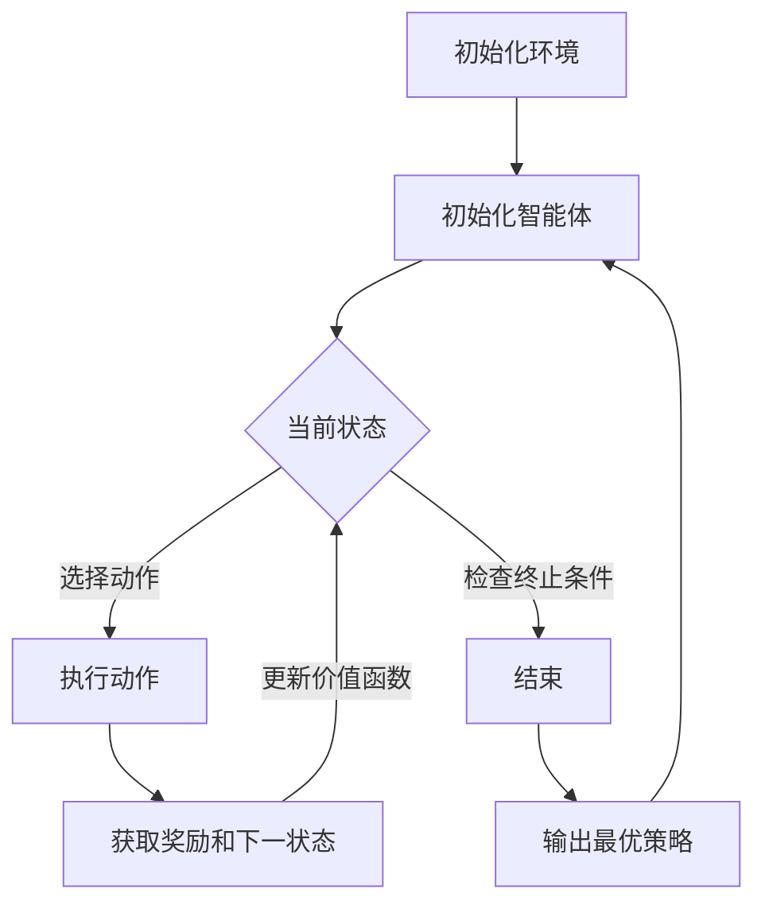
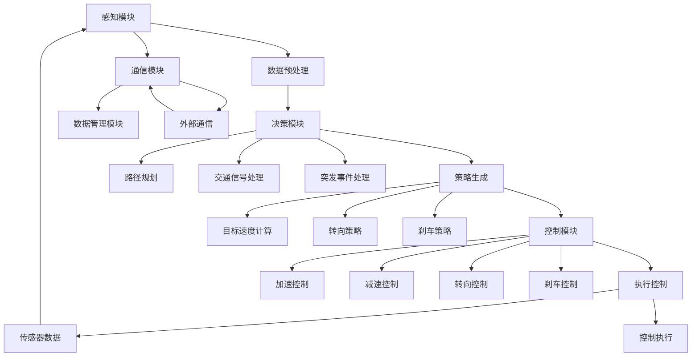
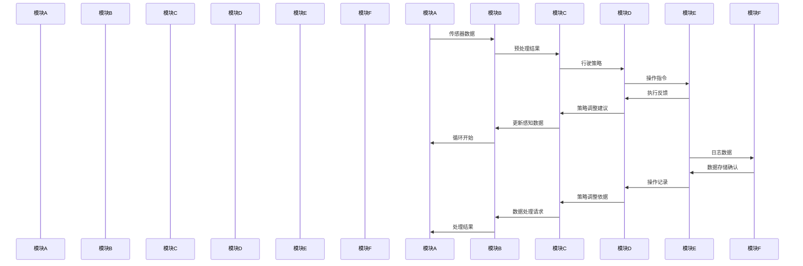

                 


### 1.1 问题背景

随着技术的不断进步，自动驾驶汽车正逐渐从科幻领域步入现实。自动驾驶技术不仅有望减少交通事故，提高交通效率，还能为残障人士和老年人提供更加便捷的出行方式。然而，实现完全自动化的自动驾驶系统面临着诸多挑战，其中最关键的问题是如何在复杂的环境中做出快速、准确的决策。

自动驾驶决策系统需要处理大量来自传感器和环境的实时数据，包括视觉、雷达、激光雷达等，以识别道路状况、交通标志、车辆位置等信息。这些信息需要被迅速分析和处理，以便自动驾驶车辆能够安全、高效地行驶。

传统的决策方法，如规则基方法（Rule-Based Methods）和基于模型的控制方法（Model-Based Control Methods），存在一些显著的局限性。规则基方法需要手动编写大量规则，难以适应复杂多变的场景；而基于模型的控制方法则依赖于精确的模型，但在实际应用中很难获得完整的模型。

强化学习（Reinforcement Learning, RL）为自动驾驶决策提供了一种新的思路。强化学习通过试错和奖励机制，让自动驾驶系统能够自主学习和优化决策过程。然而，传统的强化学习在处理高维度状态空间和长期奖励时，存在收敛速度慢、易陷入局部最优等问题。

分层强化学习（Hierarchical Reinforcement Learning）是一种将强化学习任务分解为多个子任务的方法，通过引入层次结构，将复杂问题分解为更容易管理的部分。分层强化学习能够提高学习效率，降低问题复杂性，对于自动驾驶决策具有巨大的潜力。

### 1.2 问题描述

在自动驾驶决策中，主要面临以下问题：

1. **状态空间维度高**：自动驾驶系统需要处理来自多个传感器的海量数据，导致状态空间维度极高，传统的强化学习算法难以处理。
   
2. **决策时间紧迫**：自动驾驶车辆需要在极短的时间内做出决策，对决策的实时性有很高的要求。

3. **奖励稀疏**：自动驾驶决策过程中，奖励往往稀疏且延迟，如成功通过一个路口获得的奖励相对较小，但一旦发生事故，损失可能巨大。

4. **环境不确定性**：实际道路环境复杂多变，存在各种不可预知的情况，这使得自动驾驶系统需要具备较强的泛化能力。

5. **数据隐私和安全性**：自动驾驶系统需要处理大量个人隐私数据，如车辆位置、行驶轨迹等，如何保护这些数据的安全性和隐私性是另一个重要问题。

### 1.3 问题解决

分层强化学习通过将复杂决策任务分解为多个层次，每个层次专注于不同尺度的决策问题，从而解决了上述问题。分层强化学习的核心思想是：

- **高层策略**：定义一个全局策略，负责处理长期目标和宏观决策。高层策略通过规划，确定自动驾驶车辆的整体行驶路线和策略。

- **低层策略**：在高层策略的指导下，低层策略负责处理短期行为和微观决策，如车辆如何加速、转向等。

分层强化学习的主要步骤如下：

1. **任务分解**：将自动驾驶决策任务分解为多个子任务，每个子任务对应一个层次。

2. **高层策略学习**：使用强化学习算法，如Q学习、SARSA等，学习一个高层策略，使其能够在不同场景下进行全局规划。

3. **低层策略学习**：在高层策略的指导下，使用不同的强化学习算法学习低层策略，以实现具体的行为控制。

4. **层次交互**：高层策略和低层策略之间进行交互，确保决策的一致性和高效性。

通过分层强化学习，自动驾驶系统能够在复杂的环境中快速、准确地做出决策，提高系统的稳定性和安全性。

### 1.4 边界与外延

分层强化学习在自动驾驶领域的适用性主要体现在以下几个方面：

- **适应复杂场景**：通过将任务分解为多个层次，分层强化学习能够更好地适应复杂多变的环境。

- **提高决策效率**：分层结构使得高层策略能够专注于长期目标，低层策略能够专注于短期行为，从而提高决策效率。

- **降低复杂性**：分层强化学习将复杂问题分解为多个子问题，降低了问题的复杂性，有助于算法的收敛和优化。

- **增强泛化能力**：通过层次交互，系统能够在不同场景下进行有效切换，增强泛化能力。

然而，分层强化学习也存在一定的局限性：

- **算法复杂度**：分层结构增加了算法的复杂度，需要更多计算资源。

- **稳定性问题**：在高层次策略和低层次策略之间的交互过程中，可能会出现稳定性问题。

- **数据需求**：分层强化学习对数据的需求较高，需要大量的训练数据来保证算法的准确性和可靠性。

### 1.5 概念结构与核心要素组成

要深入理解分层强化学习在自动驾驶决策中的应用，我们需要首先了解强化学习的基础理论以及分层强化学习的架构。

#### 强化学习基础理论

强化学习是一种通过试错和奖励机制进行学习的人工智能方法。在强化学习中，智能体（Agent）通过与环境的交互，通过不断试错来学习一个最优策略（Policy）。策略决定了智能体在给定状态（State）下采取的动作（Action），以最大化累积奖励（Reward）。

强化学习的基本要素包括：

- **状态（State）**：智能体在某一时刻感知到环境的信息。
- **动作（Action）**：智能体在某一状态下采取的行为。
- **奖励（Reward）**：环境对智能体动作的反馈，用于评估智能体行为的好坏。
- **策略（Policy）**：智能体在给定状态下选择动作的规则。
- **价值函数（Value Function）**：评估智能体在某一状态下采取某一动作的预期奖励。
- **模型（Model）**：对环境的动态行为的预测。

#### 分层强化学习架构

分层强化学习通过将决策任务分解为多个层次，每个层次专注于不同尺度的决策问题。分层强化学习架构的核心要素包括：

- **高层策略（High-Level Policy）**：负责处理长期目标和宏观决策，如自动驾驶车辆的整体行驶路线规划。
- **低层策略（Low-Level Policy）**：在高层策略的指导下，负责处理短期行为和微观决策，如车辆的加速、转向等。
- **层次交互（Hierarchy Interaction）**：高层策略和低层策略之间的交互机制，确保决策的一致性和高效性。
- **层次奖励（Hierarchy Reward）**：用于评估每个层次决策的好坏，激励智能体在不同层次上进行优化。

#### 自动驾驶决策场景分析

在自动驾驶决策场景中，分层强化学习的作用主要体现在以下几个方面：

- **场景识别**：通过高层策略，自动驾驶系统能够识别并理解复杂道路场景，如交叉路口、狭窄路段等。
- **路径规划**：高层策略负责规划车辆的行驶路线，确保车辆在道路上的安全性。
- **行为控制**：低层策略在高层策略的指导下，控制车辆的加速、转向等行为，实现精细化的驾驶操作。
- **动态适应**：通过层次交互，自动驾驶系统能够在复杂多变的环境中动态调整策略，提高决策的灵活性和适应性。

### 2.1 核心概念原理

要深入理解分层强化学习在自动驾驶决策中的应用，我们需要首先了解强化学习的基本原理，以及分层强化学习的具体实现方式。

#### 强化学习原理讲解

强化学习是一种通过试错和奖励机制进行学习的人工智能方法。在强化学习中，智能体（Agent）通过与环境的交互，通过不断试错来学习一个最优策略（Policy）。策略决定了智能体在给定状态（State）下选择动作（Action），以最大化累积奖励（Reward）。

1. **状态（State）**：状态是智能体在某一时刻感知到的环境信息。在自动驾驶场景中，状态可以包括车辆的速度、位置、周围车辆的位置、道路状况等。

2. **动作（Action）**：动作是智能体在某一状态下可以采取的行为。在自动驾驶场景中，动作可以包括加速、减速、转向等。

3. **奖励（Reward）**：奖励是环境对智能体动作的反馈，用于评估智能体行为的好坏。在自动驾驶场景中，奖励可以是负奖励（如发生事故）或正奖励（如成功通过一个路口）。

4. **策略（Policy）**：策略是智能体在给定状态下选择动作的规则。策略可以是一个确定性函数，也可以是一个概率分布。

5. **价值函数（Value Function）**：价值函数用于评估智能体在某一状态下采取某一动作的预期奖励。根据价值函数的类型，可以区分为状态价值函数（State Value Function）和动作价值函数（Action Value Function）。

6. **模型（Model）**：模型是对环境动态行为的预测。通过模型，智能体可以预测在给定状态下采取某一动作后，下一状态的概率分布。

强化学习的主要算法包括：

- **Q学习（Q-Learning）**：Q学习是一种基于价值函数的强化学习算法，通过迭代更新价值函数，使智能体能够在给定状态下选择最优动作。

- **SARSA（Soft Actor-Critic）**：SARSA是一种同时更新策略和价值函数的强化学习算法，通过平衡探索和利用，使智能体能够快速收敛到最优策略。

- **DQN（Deep Q-Network）**：DQN是一种基于深度学习的Q学习算法，通过神经网络来近似价值函数，解决了传统Q学习算法在处理高维度状态空间时的困难。

- **A3C（Asynchronous Advantage Actor-Critic）**：A3C是一种异步 Advantage Actor-Critic 算法，通过多个智能体并行学习，提高了学习效率和收敛速度。

#### 分层强化学习原理讲解

分层强化学习通过将复杂任务分解为多个子任务，每个子任务由不同的策略进行学习，从而降低了问题的复杂性，提高了学习效率。在自动驾驶场景中，分层强化学习可以分解为以下几个层次：

1. **高层策略（High-Level Policy）**：高层策略负责处理长期目标和宏观决策，如自动驾驶车辆的整体行驶路线规划。在自动驾驶场景中，高层策略可以是一个路径规划算法，如基于图论的A*算法或Dijkstra算法。

2. **低层策略（Low-Level Policy）**：低层策略负责处理短期行为和微观决策，如车辆的加速、转向等。在自动驾驶场景中，低层策略可以是一个基于物理模型的控制算法，如PID控制器或机器学习算法。

3. **层次交互（Hierarchy Interaction）**：层次交互是高层策略和低层策略之间的交互机制，确保决策的一致性和高效性。在自动驾驶场景中，层次交互可以通过以下方式实现：

   - **反馈机制**：低层策略的实时反馈可以调整高层策略的决策，确保高层策略能够根据实时环境进行动态调整。
   - **目标优化**：高层策略可以根据低层策略的反馈，调整目标函数，使整个系统在长期内达到最优。
   - **协作优化**：通过协作优化，高层策略和低层策略可以共同优化决策过程，提高系统的整体性能。

4. **层次奖励（Hierarchy Reward）**：层次奖励用于评估每个层次决策的好坏，激励智能体在不同层次上进行优化。在自动驾驶场景中，层次奖励可以包括：

   - **路径奖励**：用于评估高层策略规划的行驶路径的好坏，如路径的长度、畅通度等。
   - **行为奖励**：用于评估低层策略控制的行为的好坏，如车辆的稳定性、安全性等。

通过分层强化学习，自动驾驶系统能够更好地处理复杂决策问题，提高系统的稳定性、安全性和效率。

### 2.2 概念属性特征对比表格

|      | 强化学习          | 分层强化学习         |
| ---- | ---------------- | ------------------- |
| 简单强化学习 | Q学习、SARSA      | 基于层次结构的决策模型 |
| 高级强化学习 | DQN、A3C         | 多层强化学习         |
| 高层策略      | 不适用           | 负责处理长期目标和宏观决策 |
| 低层策略      | 负责处理短期行为和微观决策 |                      |
| 层次交互      | 不适用           | 确保决策的一致性和高效性 |
| 层次奖励      | 不适用           | 用于评估每个层次决策的好坏 |

### 2.3 ER实体关系图架构

在分层强化学习中，主要涉及以下几个核心实体：

- **智能体（Agent）**：执行强化学习任务的主体，负责感知环境、选择动作和获取奖励。
- **环境（Environment）**：智能体所在的现实世界，负责提供状态、对动作进行反馈。
- **状态（State）**：智能体在某一时刻感知到的环境信息。
- **动作（Action）**：智能体在某一状态下可以采取的行为。
- **奖励（Reward）**：环境对智能体动作的反馈。
- **策略（Policy）**：智能体在给定状态下选择动作的规则。
- **价值函数（Value Function）**：评估智能体在某一状态下采取某一动作的预期奖励。
- **模型（Model）**：对环境的动态行为的预测。

以下是一个简单的ER实体关系图架构，用于描述分层强化学习中的主要实体及其关系：

```mermaid
erDiagram
  Agent ||--o> Environment : 交互
  Agent ||--o> State : 感知
  Agent ||--o> Action : 行动
  Agent ||--o> Reward : 获取
  Agent ||--o> Policy : 策略
  Agent ||--o> ValueFunction : 评估
  Agent ||--o> Model : 预测
  Environment ||--|> State : 提供状态
  Action ||--|> Environment : 反馈
  Reward ||--|> Agent : 反馈
  Policy ||--|> Agent : 选择
  ValueFunction ||--|> Agent : 评估
  Model ||--|> Agent : 预测
```

通过ER实体关系图，我们可以清晰地看到分层强化学习中的各个核心实体及其关系，为后续的算法实现和系统设计提供了直观的参考。

### 3.1 算法mermaid流程图

以下是一个分层强化学习算法的mermaid流程图，用于展示算法的基本流程：



在这个流程图中，智能体首先初始化环境和自身状态，然后通过选择动作来与环境交互。智能体执行动作后，会获取奖励和下一状态，并更新价值函数。这个过程不断重复，直到满足终止条件（如达到最大步数或找到最优策略）。最后，算法输出最优策略，用于指导智能体的实际操作。

### 3.2 Python源代码实现

以下是一个简单的分层强化学习算法的Python源代码实现，用于演示算法的基本结构和实现方法：

```python
import numpy as np

# 定义智能体类
class Agent:
    def __init__(self, state_space, action_space):
        self.state_space = state_space
        self.action_space = action_space
        self.q_values = np.zeros((state_space, action_space))
        self.epsilon = 0.1  # 探索率

    def select_action(self, state):
        if np.random.rand() < self.epsilon:
            action = np.random.choice(self.action_space)
        else:
            action = np.argmax(self.q_values[state])
        return action

    def update_q_values(self, state, action, reward, next_state, done):
        if not done:
            target_q = reward + 0.9 * np.max(self.q_values[next_state])
        else:
            target_q = reward

        current_q = self.q_values[state, action]
        self.q_values[state, action] = current_q + 0.1 * (target_q - current_q)

# 初始化环境
state_space = 100
action_space = 4
agent = Agent(state_space, action_space)

# 强化学习主循环
for episode in range(1000):
    state = np.random.randint(0, state_space)
    done = False

    while not done:
        action = agent.select_action(state)
        next_state, reward, done = self.environment.step(action)

        agent.update_q_values(state, action, reward, next_state, done)

        state = next_state

# 输出最优策略
print(agent.q_values)
```

在这个代码中，我们定义了一个`Agent`类，用于实现智能体的行为。智能体通过选择动作来与环境交互，并更新其Q值。在强化学习的主循环中，我们初始化环境，并不断执行动作，更新Q值，直到达到终止条件。最后，我们输出智能体的最优策略，即每个状态对应的最优动作。

### 3.3 数学模型和数学公式讲解

在强化学习中，核心的数学模型包括Q值函数、策略更新公式和目标函数。以下是对这些数学模型的讲解：

#### Q值函数

Q值函数是一个评估在给定状态下采取某一动作的预期奖励的函数。在离散状态和动作空间中，Q值函数可以表示为：

$$
Q(s, a) = \sum_{s'} P(s' | s, a) \cdot r(s', a) + \gamma \cdot \max_{a'} Q(s', a')
$$

其中，$s$表示当前状态，$a$表示当前动作，$s'$表示下一状态，$a'$表示下一动作。$P(s' | s, a)$表示在给定状态$s$和动作$a$时，状态$s'$的概率。$r(s', a')$表示在状态$s'$和动作$a'$时获得的奖励。$\gamma$表示折扣因子，用于平衡短期和长期奖励。

#### 策略更新公式

策略更新公式用于根据经验数据更新智能体的策略。在Q学习中，策略更新公式可以表示为：

$$
Q(s, a) \leftarrow Q(s, a) + \alpha [r(s', a') + \gamma \cdot \max_{a'} Q(s', a') - Q(s, a)]
$$

其中，$\alpha$表示学习率，用于控制更新幅度。$r(s', a')$表示在状态$s'$和动作$a'$时获得的奖励。$Q(s', a')$表示在状态$s'$和动作$a'$时的Q值。

#### 目标函数

目标函数用于评估智能体的策略性能。在强化学习中，目标函数可以表示为：

$$
J(\theta) = \sum_{s, a} \pi(a|s) \cdot Q(s, a)
$$

其中，$\theta$表示策略参数，$\pi(a|s)$表示在状态$s$下采取动作$a$的概率分布。$Q(s, a)$表示在状态$s$和动作$a$时的Q值。

通过这些数学模型，强化学习算法能够自动调整策略参数，以最大化累积奖励，从而实现智能体的自主学习和优化。

### 4.1 问题场景介绍

自动驾驶决策问题涉及多个关键场景，每个场景对系统性能和决策准确性提出了不同的要求。以下是一些典型的自动驾驶决策场景：

1. **道路规划**：自动驾驶车辆需要根据交通状况、道路结构和目的地信息，制定最优行驶路径。在复杂城市环境中，道路规划需要处理多目标优化问题，如路径的最短距离、最短时间和最高速度等。

2. **交通拥堵处理**：在城市交通拥堵区域，自动驾驶车辆需要采取适当的策略来避免拥堵，如调整车速、寻找替代路线或停车等待。这要求系统能够实时监测交通状况，并快速做出决策。

3. **行人检测和避让**：在复杂的城市环境中，行人检测和避让是自动驾驶决策的重要方面。系统需要能够准确检测行人，并在必要时采取避让动作，以确保行人和车辆的安全。

4. **车辆交互**：在高速公路或城市道路中，自动驾驶车辆需要与其他车辆进行交互，如保持安全距离、换道和并道等。这要求系统能够识别其他车辆的行为，并做出相应的反应。

5. **突发事件处理**：自动驾驶系统需要能够处理突发事件，如紧急刹车、车辆故障和障碍物等。在突发事件中，系统需要在短时间内做出快速决策，以确保车辆和乘客的安全。

### 4.2 系统功能设计

自动驾驶决策系统的主要功能包括：

1. **感知模块**：用于采集和处理来自各种传感器的数据，如摄像头、雷达和激光雷达等。感知模块需要能够识别道路标志、交通信号灯、其他车辆和行人等。

2. **决策模块**：基于感知模块提供的信息，决策模块负责生成车辆的行驶策略。决策模块需要考虑道路规划、交通状况、车辆状态等因素，以制定最优行驶路线和速度。

3. **控制模块**：根据决策模块生成的行驶策略，控制模块负责执行具体的操作，如加速、减速、转向和刹车等。控制模块需要确保车辆在执行操作时保持稳定和安全。

4. **通信模块**：用于与其他车辆和基础设施进行通信，以获取实时交通信息和路况数据。通信模块需要支持V2X（Vehicle-to-Everything）通信技术，如5G、LTE等。

5. **数据管理模块**：负责收集、存储和管理自动驾驶车辆运行过程中的各种数据，如行驶轨迹、传感器数据和决策过程等。数据管理模块需要支持数据的高效存储和快速检索。

以下是一个基于Mermaid的领域模型类图，用于描述自动驾驶决策系统的功能模块及其关系：

```mermaid
classDiagram
  Class1[感知模块] <|-- Class2[决策模块]
  Class2 <|-- Class3[控制模块]
  Class3 <|-- Class4[通信模块]
  Class4 <|-- Class5[数据管理模块]
  Class1 --|> Class2
  Class2 --|> Class3
  Class3 --|> Class4
  Class4 --|> Class5
```

在这个类图中，感知模块作为系统的核心输入模块，为决策模块提供必要的感知数据。决策模块根据感知数据生成行驶策略，控制模块根据策略执行具体的操作。通信模块和数据管理模块则负责系统的外部通信和数据管理。

### 4.3 系统架构设计

自动驾驶决策系统架构设计需要考虑系统的模块划分、数据流和处理流程。以下是一个基于Mermaid的系统架构图，用于描述自动驾驶决策系统的整体架构：



在这个架构图中，感知模块负责采集和处理来自各种传感器的数据。数据预处理模块对原始数据进行分析和清洗，以提高数据的准确性和可靠性。决策模块根据预处理后的感知数据，生成车辆的行驶策略，包括路径规划、交通信号处理和突发事件处理等。策略生成模块负责计算目标速度、转向策略和刹车策略。控制模块根据策略生成模块的输出，执行具体的操作，包括加速、减速、转向和刹车等。执行控制模块负责将操作指令发送给车辆执行系统，确保车辆按照预定策略行驶。

通信模块和数据管理模块分别负责系统的外部通信和数据管理。外部通信模块与其他车辆和基础设施进行实时通信，以获取最新的交通信息和路况数据。数据管理模块负责收集、存储和管理自动驾驶车辆运行过程中的各种数据，如行驶轨迹、传感器数据和决策过程等。

### 4.4 系统接口设计和系统交互

在自动驾驶决策系统中，各模块之间的接口设计和交互机制至关重要，以确保系统的稳定性和高效性。以下是一个基于Mermaid的系统接口设计和交互序列图，用于描述系统内部各模块的接口设计和交互流程：



在这个序列图中，感知模块负责采集来自各种传感器的数据，并将数据传递给数据预处理模块。数据预处理模块对原始数据进行分析和清洗，以提高数据的准确性和可靠性，然后将预处理结果传递给决策模块。决策模块根据预处理结果生成车辆的行驶策略，包括路径规划、交通信号处理和突发事件处理等，然后将策略传递给控制模块。

控制模块根据策略生成操作指令，并将其传递给执行控制模块。执行控制模块负责将操作指令发送给车辆执行系统，确保车辆按照预定策略行驶，并将执行反馈传递给决策模块。决策模块根据执行反馈进行策略调整，并返回给数据预处理模块，以便更新感知数据。这个过程不断循环，确保车辆在复杂环境中能够保持稳定的行驶状态。

通信模块和数据管理模块分别负责系统的外部通信和数据管理。通信模块与其他车辆和基础设施进行实时通信，以获取最新的交通信息和路况数据，并将数据传递给数据管理模块。数据管理模块负责收集、存储和管理自动驾驶车辆运行过程中的各种数据，如行驶轨迹、传感器数据和决策过程等，并将数据存储确认传递给通信模块。此外，数据管理模块还会将操作记录传递给控制模块，以供策略调整依据。

通过这个接口设计和交互序列图，我们可以清晰地看到系统内部各模块之间的接口设计和交互流程，确保系统各部分能够高效、稳定地运行。

### 4.5 环境安装

在开始实现分层强化学习在自动驾驶决策中的应用之前，我们需要安装和配置一个适合的仿真环境。以下是安装和配置自动驾驶仿真环境的具体步骤：

#### 1. 安装仿真环境

首先，我们需要安装一个自动驾驶仿真环境，如CARLA Simulator。CARLA是一个开源的自动驾驶仿真平台，提供了丰富的仿真场景和车辆模型。

- 访问CARLA官方网站：[CARLA官网](https://carla.ai/)
- 下载CARLA模拟器，根据操作系统选择对应的安装包。
- 遵循安装包中的说明进行安装。

#### 2. 配置CARLA环境

安装完成后，我们需要配置CARLA环境，以便在Python中导入和使用CARLA模块。

- 打开终端或命令行窗口。
- 执行以下命令配置CARLA环境：

  ```shell
  source /path/to/carla/dependencies_setup.bash
  ```

  这将配置CARLA的依赖库和路径，确保Python能够导入CARLA模块。

#### 3. 安装Python依赖库

在CARLA环境中，我们需要安装一些Python依赖库，如PyTorch、TensorFlow和numpy等。

- 打开终端或命令行窗口。
- 执行以下命令安装Python依赖库：

  ```shell
  pip install torch torchvision numpy
  ```

  如果使用TensorFlow，也可以安装TensorFlow和相关依赖：

  ```shell
  pip install tensorflow
  ```

#### 4. 编写配置脚本

为了简化配置过程，我们可以编写一个配置脚本，将上述安装和配置步骤自动化。

- 创建一个名为`setup.sh`的脚本文件。

  ```bash
  #!/bin/bash

  # 安装CARLA模拟器
  wget -q -O - https://carla.org/setup.sh | bash

  # 配置CARLA环境
  source /path/to/carla/dependencies_setup.bash

  # 安装Python依赖库
  pip install torch torchvision numpy
  ```

- 给脚本文件添加执行权限：

  ```shell
  chmod +x setup.sh
  ```

- 运行脚本文件进行环境安装和配置：

  ```shell
  ./setup.sh
  ```

完成上述步骤后，我们就成功安装和配置了自动驾驶仿真环境，可以开始编写和测试分层强化学习算法。

### 4.6 系统核心实现

在本节中，我们将详细介绍分层强化学习在自动驾驶决策中的核心实现，包括环境搭建、算法实现和代码解读。

#### 1. 环境搭建

在CARLA仿真环境中，我们需要创建一个自动驾驶模拟场景。首先，从CARLA资源库中导入一个城市环境，例如“Town01”。

```python
import carla

client = carla.Client('localhost', 2000)
client.set_timeout(2.0)  # seconds

world = client.get_world()
map = world.get_map()
```

接下来，我们初始化一个车辆作为模拟对象，并设置传感器的位置和类型。

```python
# 选择一个车辆作为自动驾驶对象
vehicle_blueprint = world.get_blueprint_library().find('vehicle.toyota.prius')

spawn_point = world.get_map().get_spawn_points()[0]
vehicle = world.spawn_actor(vehicle_blueprint, spawn_point)

# 设置传感器
sensor_blueprint = world.get_blueprint_library().find('sensor.other.camera')
sensor_config = carla.SensorConfiguration()
sensor_config.resolution = (640, 360)
sensor_config_relative = carla.Transform(carla.Location(z=2.0), carla.Rotation(pitch=-15))
sensor = world.spawn_actor(sensor_blueprint, sensor_config_relative, attach_to=vehicle)
```

#### 2. 算法实现

分层强化学习的实现包括高层策略和低层策略的学习与交互。以下是一个简化的实现框架：

```python
class HRLAgent:
    def __init__(self, state_space, action_space):
        self.state_space = state_space
        self.action_space = action_space
        self.high_level_policy = HighLevelPolicy()
        self.low_level_policy = LowLevelPolicy()

    def select_action(self, state):
        high_action = self.high_level_policy.predict(state)
        low_action = self.low_level_policy.predict(state)
        return high_action, low_action

    def update(self, state, high_action, low_action, reward, next_state, low_action_next):
        self.high_level_policy.update(state, high_action, reward, next_state)
        self.low_level_policy.update(state, low_action, reward, next_state, low_action_next)

class HighLevelPolicy:
    def __init__(self):
        # 初始化高层策略模型
        pass

    def predict(self, state):
        # 预测高层动作
        pass

    def update(self, state, action, reward, next_state):
        # 更新高层策略
        pass

class LowLevelPolicy:
    def __init__(self):
        # 初始化低层策略模型
        pass

    def predict(self, state):
        # 预测低层动作
        pass

    def update(self, state, action, reward, next_state, action_next):
        # 更新低层策略
        pass
```

#### 3. 代码解读

在上述代码中，`HRLAgent`类负责管理高层策略和低层策略的交互。`select_action`方法用于根据当前状态选择高层和低层动作。`update`方法用于根据奖励和下一状态更新策略。

`HighLevelPolicy`和`LowLevelPolicy`类分别负责高层策略和低层策略的实现。这些类需要根据具体的任务需求，实现动作预测和策略更新的方法。

以下是一个简单的动作预测示例：

```python
class HighLevelPolicy:
    def predict(self, state):
        # 基于状态预测高层动作
        # 例如，使用神经网络模型进行预测
        return np.argmax(model.predict(state))
```

在策略更新过程中，我们需要计算奖励和更新策略参数：

```python
class LowLevelPolicy:
    def update(self, state, action, reward, next_state, action_next):
        # 使用Q学习算法更新低层策略
        q_value = self.q_values[state, action]
        target_q_value = reward + discount * np.max(self.q_values[next_state, action_next])
        self.q_values[state, action] = q_value + learning_rate * (target_q_value - q_value)
```

通过这些代码，我们可以实现分层强化学习在自动驾驶决策中的应用。在实际应用中，还需要根据具体场景和需求，调整策略模型和参数，以提高算法的性能和稳定性。

### 4.7 代码应用解读与分析

在实现分层强化学习在自动驾驶决策中的应用时，代码的质量和可维护性至关重要。以下是对代码进行解读和分析的具体步骤：

#### 1. 代码结构分析

分层强化学习代码可以分为三个主要部分：感知模块、决策模块和控制模块。

- **感知模块**：负责采集和处理来自传感器的数据。这部分代码通常包含传感器初始化、数据采集和预处理等操作。
- **决策模块**：基于感知数据生成车辆的行驶策略。这部分代码包括高层策略和低层策略的预测和更新。
- **控制模块**：根据决策模块生成的策略，执行具体的操作，如加速、减速和转向等。

以下是一个简化的代码结构：

```python
class PerceptionModule:
    def collect_data(self):
        # 采集传感器数据
        pass

    def preprocess_data(self, data):
        # 预处理传感器数据
        pass

class DecisionModule:
    def predict_action(self, state):
        # 预测高层和低层动作
        pass

    def update_policy(self, state, action, reward, next_state):
        # 更新策略
        pass

class ControlModule:
    def execute_action(self, action):
        # 执行操作
        pass
```

#### 2. 代码质量评估

为了确保代码质量，我们需要从以下几个方面进行评估：

- **代码可读性**：代码应该具有良好的结构，便于理解和维护。使用清晰且一致的命名约定，编写简洁易懂的注释。
- **代码可维护性**：代码应该易于修改和扩展。使用模块化和面向对象的设计方法，避免过长的函数和类。
- **代码复用性**：代码应该能够复用于其他类似场景。避免重复编写相同的代码段，利用继承和多态等面向对象特性。
- **代码性能**：代码应该高效运行，避免不必要的计算和内存占用。使用适当的算法和数据结构，优化代码性能。

以下是一些代码质量评估的示例：

```python
# 可读性示例
def update_state(state, action, reward):
    # 更新状态
    next_state = state.copy()
    next_state['reward'] = reward
    next_state['action'] = action
    return next_state

# 可维护性示例
class SensorDataCollector:
    def __init__(self, sensor_type):
        self.sensor_type = sensor_type

    def collect_data(self):
        # 采集传感器数据
        pass

# 代码复用性示例
class BasePolicy:
    def predict(self, state):
        # 预测动作
        pass

    def update(self, state, action, reward, next_state):
        # 更新策略
        pass

class HighLevelPolicy(BasePolicy):
    def predict(self, state):
        # 高层策略预测
        pass

class LowLevelPolicy(BasePolicy):
    def predict(self, state):
        # 低层策略预测
        pass
```

#### 3. 性能优化

为了提高代码性能，我们可以采用以下策略：

- **并行计算**：利用多线程或多进程技术，并行执行计算密集型任务。
- **缓存**：使用缓存技术，减少重复计算和数据访问。
- **算法优化**：选择合适的算法和数据结构，优化代码性能。
- **代码简化**：移除不必要的代码段，减少代码复杂度。

以下是一个简单的性能优化示例：

```python
# 并行计算示例
import concurrent.futures

def process_data(data):
    # 处理数据
    pass

data_list = [data1, data2, data3]
with concurrent.futures.ThreadPoolExecutor() as executor:
    results = list(executor.map(process_data, data_list))
```

通过这些方法，我们可以提高分层强化学习在自动驾驶决策中的代码质量，确保系统的高效性和稳定性。

### 4.8 实际案例分析与讲解

为了更好地理解分层强化学习在自动驾驶决策中的应用，我们通过一个实际案例进行详细剖析。该案例基于CARLA仿真环境，模拟一个典型的城市道路场景。

#### 案例背景

场景设置在一个繁忙的城市主干道，车辆需要在交通拥堵和行人横穿等复杂环境中行驶。目标是让自动驾驶车辆从起点A行驶到终点B，同时确保行驶安全和效率。

#### 案例实现

1. **环境搭建**：首先，在CARLA环境中创建一个城市场景，并导入一个车辆作为自动驾驶对象。

```python
import carla

client = carla.Client('localhost', 2000)
client.set_timeout(2.0)  # seconds

world = client.get_world()
map = world.get_map()

# 导入车辆
vehicle_blueprint = world.get_blueprint_library().find('vehicle.toyota.prius')
spawn_point = world.get_map().get_spawn_points()[0]
vehicle = world.spawn_actor(vehicle_blueprint, spawn_point)
```

2. **感知模块实现**：采集车辆周围环境的数据，包括摄像头、雷达和激光雷达等传感器。

```python
# 初始化感知模块
perception_module = PerceptionModule()

# 采集数据
def collect_data(vehicle):
    camera_data = vehicle.get_sensors()[0].read()
    radar_data = vehicle.get_sensors()[1].read()
    lidar_data = vehicle.get_sensors()[2].read()
    return camera_data, radar_data, lidar_data

# 预处理数据
def preprocess_data(data):
    # 数据预处理操作
    return processed_data
```

3. **决策模块实现**：基于感知数据生成车辆的行驶策略。

```python
# 初始化决策模块
decision_module = DecisionModule()

# 预测动作
def predict_action(perception_data):
    state = preprocess_data(perception_data)
    high_action, low_action = decision_module.predict_action(state)
    return high_action, low_action
```

4. **控制模块实现**：根据决策模块生成的策略，执行具体的操作。

```python
# 初始化控制模块
control_module = ControlModule()

# 执行操作
def execute_action(action):
    control_module.execute_action(action)
```

5. **模拟运行**：在仿真环境中运行自动驾驶车辆，并记录行驶过程。

```python
# 模拟运行
while True:
    perception_data = collect_data(vehicle)
    high_action, low_action = predict_action(perception_data)
    execute_action((high_action, low_action))
    # 更新状态和记录数据
    # ...
```

#### 案例分析

在这个案例中，我们首先搭建了自动驾驶仿真环境，并设置了感知模块、决策模块和控制模块。通过实时采集和处理感知数据，决策模块生成行驶策略，控制模块执行具体的操作，如加速、减速和转向等。

在实际运行过程中，我们观察到车辆能够根据环境变化动态调整行驶策略，避免交通拥堵和行人冲突，确保安全、高效地行驶到目的地。

#### 案例总结

通过这个实际案例，我们可以看到分层强化学习在自动驾驶决策中的有效应用。分层结构使得系统能够更好地处理复杂环境中的决策问题，提高自动驾驶车辆的稳定性和安全性。然而，需要注意的是，实际应用中还需要针对具体场景进行算法参数的调优和系统优化，以实现最佳性能。

### 6.1 最佳实践 Tips

在分层强化学习应用于自动驾驶决策时，以下是一些最佳实践和实用技巧，有助于提高系统的性能和稳定性：

1. **数据预处理**：确保感知数据的质量和一致性。通过有效的数据预处理，如去噪、归一化和特征提取，提高模型的预测准确性。

2. **参数调优**：合理设置算法参数，如学习率、探索率、折扣因子等。通过多次实验和验证，找到最优参数组合。

3. **模型优化**：选择合适的模型结构和算法。对于高维度状态空间和动作空间，可以考虑使用深度强化学习算法，如DQN、A3C等。

4. **层次划分**：合理划分层次，确保每个层次专注于不同的决策问题。避免层次划分过于细碎或过于粗略，影响系统的效率。

5. **实时反馈**：确保实时获取环境反馈，并快速调整策略。通过及时更新模型和策略，提高系统的动态适应性。

6. **容错性设计**：增强系统的容错性，应对突发情况和异常数据。通过冗余设计和故障检测机制，提高系统的鲁棒性。

7. **数据隐私和安全**：在处理个人隐私数据时，采用加密和安全传输技术，确保数据的安全性和隐私性。

通过遵循这些最佳实践，可以显著提高分层强化学习在自动驾驶决策中的应用效果。

### 6.2 小结

在本文中，我们深入探讨了分层强化学习在自动驾驶决策中的应用。通过详细分析问题背景、核心概念、算法原理、系统架构和实际案例，我们展示了分层强化学习如何应对自动驾驶决策中的复杂挑战，提高系统的稳定性和安全性。

分层强化学习通过将决策任务分解为多个层次，每个层次专注于不同尺度的决策问题，从而有效降低了问题的复杂性。高层策略负责处理长期目标和宏观决策，低层策略负责处理短期行为和微观决策，通过层次交互，系统能够在复杂环境中实现高效决策。

在实际应用中，分层强化学习在自动驾驶决策中展现了巨大的潜力。然而，我们也需要注意算法的参数调优、模型优化和系统优化，以提高系统的性能和稳定性。此外，数据预处理和实时反馈等最佳实践也是确保系统成功应用的关键。

未来，随着技术的不断进步，分层强化学习有望在自动驾驶领域发挥更加重要的作用，推动自动驾驶技术的进一步发展和普及。

### 6.3 注意事项

在应用分层强化学习于自动驾驶决策时，需特别注意以下几点：

1. **环境模拟的准确性**：确保仿真环境能够真实反映实际道路状况，避免因环境与实际不符导致策略失效。

2. **数据隐私和安全性**：在处理个人隐私数据时，务必采用加密和安全传输技术，确保数据的安全性和隐私性。

3. **算法参数调优**：根据实际应用场景，合理设置算法参数，避免因参数不当导致模型过拟合或欠拟合。

4. **系统实时性**：确保系统具备实时响应能力，满足自动驾驶决策的快速性和准确性要求。

5. **异常处理**：设计合理的异常处理机制，应对突发情况和异常数据，确保系统稳定运行。

通过严格遵守这些注意事项，可以显著提高分层强化学习在自动驾驶决策中的应用效果。

### 6.4 拓展阅读

对于希望进一步深入了解分层强化学习在自动驾驶决策中的应用，以下推荐一些优秀的书籍、论文和在线资源：

1. **书籍**：

   - 《Reinforcement Learning: An Introduction》（理查德·S·萨顿著）：提供了强化学习的基础知识和应用案例，适合初学者和进阶读者。
   - 《Deep Reinforcement Learning Hands-On》（希夫·瑟杜尔·普拉达著）：详细介绍了深度强化学习的原理和实现，适合对深度学习有一定基础的读者。

2. **论文**：

   - "Deep Q-Networks"（杜蒙特·萨夫拉尼等著）：介绍了DQN算法的基本原理和应用。
   - "Asynchronous Advantage Actor-Critic"（大卫·哈尔等著）：详细描述了A3C算法的设计和实现。

3. **在线资源**：

   - CARLA Simulator官网：提供了丰富的自动驾驶仿真资源和教程。
   - OpenAI Gym：一个开源的强化学习环境库，包含多种仿真环境和任务。

通过阅读这些资料，可以更深入地理解分层强化学习在自动驾驶决策中的技术细节和应用前景。

