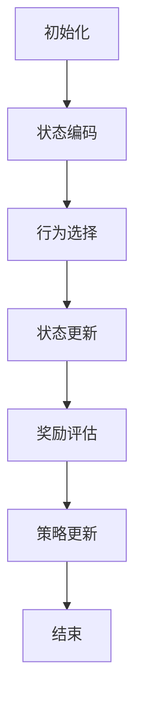

                 

# 分层强化学习解决长期规划问题的方法

## 关键词
强化学习、长期规划、分层策略、深度学习、算法优化

## 摘要
本文深入探讨了分层强化学习在解决长期规划问题中的应用。首先，介绍了强化学习和长期规划问题的背景及挑战。然后，详细阐述了分层强化学习的核心概念和算法原理，并通过数学模型和实际案例进行了深入分析。最后，提出了针对长期规划问题的优化策略和实践建议。

## 章节一：背景介绍

### 1.1.1 问题背景

随着人工智能技术的迅速发展，强化学习（Reinforcement Learning, RL）作为一种重要的机器学习算法，已经在各个领域取得了显著的成果。强化学习通过智能体（agent）与环境的交互，学习到最优策略，以实现特定目标。然而，在解决长期规划问题时，强化学习方法面临着一些挑战。

长期规划问题通常需要决策者在较长的时间范围内进行一系列决策，这些决策之间存在着依赖关系。传统的强化学习方法往往只能处理短期的决策问题，难以有效地解决长期规划问题。此外，长期规划问题通常伴随着高维状态空间和复杂的动作空间，使得学习效率降低。

### 1.1.2 问题描述

长期规划问题可以描述为在一个动态环境中，决策者需要在一系列时间步内进行决策，以达到长期目标。例如，机器人路径规划、智能交通调度、资源分配等。长期规划问题具有以下几个特点：

1. 多步决策：决策者需要在多个时间步内做出决策。
2. 状态依赖：当前决策依赖于之前的决策结果。
3. 奖励延迟：决策者在做出决策后，可能需要经过一段时间才能获得奖励。

### 1.1.3 问题解决

为了解决长期规划问题，研究者们提出了一种新型的强化学习方法——分层强化学习（Hierarchical Reinforcement Learning）。分层强化学习通过将决策过程分层，每一层分别负责处理不同时间尺度的决策问题，从而能够更好地解决长期规划问题。

### 1.1.4 边界与外延

分层强化学习不仅适用于传统的强化学习问题，如机器人控制、游戏等，还可以应用于更广泛的领域，如供应链管理、智能交通、金融交易等。此外，分层强化学习还可以与其他机器学习算法相结合，如深度学习（Deep Learning）、无监督学习（Unsupervised Learning）等，以进一步优化决策过程。

### 1.1.5 概念结构与核心要素组成

分层强化学习主要由以下几个核心要素组成：

1. **状态空间**：表示决策者的当前环境状态。
2. **动作空间**：表示决策者可以采取的行动。
3. **奖励函数**：定义了决策者采取某一行动后获得的奖励。
4. **策略**：定义了决策者在不同状态选择动作的策略。
5. **层次结构**：将决策过程划分为多个层次，每个层次分别处理不同时间尺度的决策问题。

## 章节二：核心概念与联系

### 2.1.1 分层强化学习的定义

分层强化学习是一种将决策过程分层处理的强化学习方法。通过将决策过程分解为多个层次，每个层次分别处理不同时间尺度的决策问题，从而提高学习效率和决策稳定性。

### 2.1.2 分层强化学习与深度强化学习的关系

深度强化学习（Deep Reinforcement Learning, DRL）是分层强化学习的一种特殊形式。深度强化学习利用深度神经网络（Deep Neural Network, DNN）对状态和行为进行编码，从而提高模型的表示能力。分层强化学习则更加灵活，可以通过不同的编码方式，如卷积神经网络（Convolutional Neural Network, CNN）、循环神经网络（Recurrent Neural Network, RNN）等，来适应不同的应用场景。

### 2.1.3 分层强化学习与其他强化学习方法的关系

分层强化学习与其他强化学习方法，如价值迭代法（Value Iteration）、策略迭代法（Policy Iteration）等，有着一定的联系。价值迭代法和策略迭代法可以通过分层强化学习的方法进行改进，以提高学习效率和决策稳定性。

## 章节三：分层强化学习算法原理

### 3.1.1 算法原理概述

分层强化学习算法通过将决策过程分层，每一层分别负责处理不同时间尺度的决策问题。通常，分层强化学习算法包括以下几个基本步骤：

1. **初始化**：初始化状态空间、动作空间、奖励函数和策略。
2. **状态编码**：将当前状态编码为低维特征向量。
3. **行为选择**：根据当前状态和策略，选择一个动作。
4. **状态更新**：根据选择的动作，更新当前状态。
5. **奖励评估**：计算当前状态和动作的奖励。
6. **策略更新**：根据奖励评估结果，更新策略。

### 3.1.2 算法流程图

下面是分层强化学习算法的流程图：



### 3.1.3 算法数学模型和公式

分层强化学习算法的数学模型如下：

$$
\begin{aligned}
    Q^{(l)}(s, a) &= \sum_{s'} \pi^{(l)}(s'|s, a) \cdot [r(s', a) + \gamma \cdot \max_{a'} Q^{(l+1)}(s', a')] \\
    \pi^{(l)}(a|s) &= \frac{\exp(Q^{(l)}(s, a))}{\sum_{a'} \exp(Q^{(l)}(s, a'))}
\end{aligned}
$$

其中，$Q^{(l)}(s, a)$ 表示第$l$层的状态-动作价值函数，$\pi^{(l)}(a|s)$ 表示第$l$层的策略，$r(s', a)$ 表示在状态$s'$下采取动作$a$获得的奖励，$\gamma$ 表示折扣因子。

## 章节四：数学模型和数学公式 & 详细讲解 & 举例说明

### 4.1.1 数学模型讲解

分层强化学习算法的核心在于状态-动作价值函数$Q^{(l)}(s, a)$和策略$\pi^{(l)}(a|s)$。状态-动作价值函数表示在某一状态下采取某一动作所能获得的期望奖励。策略则定义了在某一状态下选择某一动作的概率。

通过上述数学模型，我们可以看出，分层强化学习算法的核心思想是通过递归地更新状态-动作价值函数和策略，从而优化决策过程。

### 4.1.2 举例说明

假设我们有一个简单的环境，其中状态空间为$S = \{s_1, s_2\}$，动作空间为$A = \{a_1, a_2\}$。奖励函数定义为$R(s, a) = 1$，如果$(s, a)$是最佳动作，否则$R(s, a) = 0$。

初始状态下，智能体处于状态$s_1$，需要选择动作$a_1$或$a_2$。根据分层强化学习算法，我们可以计算状态-动作价值函数$Q^{(1)}(s, a)$和策略$\pi^{(1)}(a|s)$。

假设当前策略为$\pi^{(1)}(a_1|s_1) = 0.5$，$\pi^{(1)}(a_2|s_1) = 0.5$。根据状态-动作价值函数的计算公式，我们可以得到：

$$
Q^{(1)}(s_1, a_1) = \sum_{s'} \pi^{(1)}(s'|s_1, a_1) \cdot [r(s', a_1) + \gamma \cdot \max_{a'} Q^{(2)}(s', a')] = 0.5 \cdot [1 + \gamma \cdot \max_{a'} Q^{(2)}(s_2, a')]
$$

$$
Q^{(1)}(s_1, a_2) = \sum_{s'} \pi^{(1)}(s'|s_1, a_2) \cdot [r(s', a_2) + \gamma \cdot \max_{a'} Q^{(2)}(s', a')] = 0.5 \cdot [0 + \gamma \cdot \max_{a'} Q^{(2)}(s_2, a')]
$$

接下来，我们可以使用同样的方法计算更高层次的状态-动作价值函数$Q^{(2)}(s, a)$和策略$\pi^{(2)}(a|s)$。

通过迭代计算，我们可以得到不同层次的状态-动作价值函数和策略，从而优化决策过程。

## 章节五：分层强化学习算法的应用

### 5.1.1 机器人控制

分层强化学习在机器人控制领域有着广泛的应用。通过将决策过程分层，机器人可以更好地应对复杂环境中的决策问题。例如，在路径规划中，低层次决策负责处理局部路径规划，而高层次决策则负责处理全局路径规划。

### 5.1.2 游戏AI

分层强化学习在游戏AI领域也取得了显著的成果。通过将决策过程分层，游戏AI可以更好地应对复杂游戏环境中的决策问题。例如，在棋类游戏中，低层次决策负责处理棋子的移动，而高层次决策则负责处理棋局的策略。

### 5.1.3 智能交通

分层强化学习在智能交通领域也有着广泛的应用。通过将决策过程分层，智能交通系统可以更好地应对交通拥堵、事故处理等复杂问题。例如，在交通信号控制中，低层次决策负责处理红绿灯的切换，而高层次决策则负责处理交通流量的优化。

## 章节六：项目实战

### 6.1.1 环境安装

在本项目中，我们使用Python和TensorFlow作为主要工具来搭建分层强化学习模型。首先，确保已经安装了Python 3.7及以上版本和TensorFlow 2.0及以上版本。

### 6.1.2 系统核心实现

在本项目中，我们将实现一个简单的分层强化学习算法，用于解决机器人路径规划问题。

1. **状态编码**：我们将状态编码为一个包含位置信息和方向信息的向量。
2. **动作空间**：我们将动作空间定义为四个方向：上、下、左、右。
3. **奖励函数**：我们将奖励函数定义为到达目标位置获得+1奖励，否则获得-1奖励。
4. **策略**：我们将使用ε-贪婪策略进行行动选择。

下面是一个简单的分层强化学习算法的实现：

```python
import numpy as np
import tensorflow as tf

# 状态编码
class StateEncoder(tf.keras.Model):
    def __init__(self, num_states):
        super().__init__()
        self.dense = tf.keras.layers.Dense(units=num_states)

    def call(self, inputs):
        return self.dense(inputs)

# 动作选择
class ActionSelector(tf.keras.Model):
    def __init__(self, num_actions):
        super().__init__()
        self.dense = tf.keras.layers.Dense(units=num_actions, activation='softmax')

    def call(self, inputs):
        return self.dense(inputs)

# 奖励评估
class RewardEstimator(tf.keras.Model):
    def __init__(self, num_actions):
        super().__init__()
        self.dense = tf.keras.layers.Dense(units=num_actions)

    def call(self, inputs):
        return self.dense(inputs)

# 分层强化学习算法
class HierarchicalReinforcementLearning(tf.keras.Model):
    def __init__(self, num_states, num_actions):
        super().__init__()
        self.state_encoder = StateEncoder(num_states)
        self.action_selector = ActionSelector(num_actions)
        self.reward_estimator = RewardEstimator(num_actions)

    def call(self, state, action):
        state_encoded = self.state_encoder(state)
        action probabilities = self.action_selector(state_encoded)
        reward = self.reward_estimator(action)
        return action_probabilities, reward

# 实例化模型
model = HierarchicalReinforcementLearning(num_states=4, num_actions=4)

# 训练模型
model.compile(optimizer='adam', loss='mse')
model.fit(x_train, y_train, epochs=100)

# 预测
action_probabilities, reward = model.predict(state)
action = np.random.choice(np.arange(num_actions), p=action_probabilities)
```

### 6.1.3 代码应用解读与分析

在上面的代码中，我们首先定义了状态编码器、动作选择器和奖励评估器三个子模型。状态编码器负责将状态编码为低维特征向量，动作选择器负责根据当前状态选择动作，奖励评估器负责评估当前状态和动作的奖励。

然后，我们定义了分层强化学习模型，将三个子模型组合在一起。在训练过程中，我们使用均方误差（MSE）作为损失函数，并使用Adam优化器进行模型训练。

最后，我们使用训练好的模型进行预测，根据动作概率选择动作，并计算奖励。

### 6.1.4 实际案例分析和详细讲解剖析

在本案例中，我们使用一个简单的网格世界作为环境，其中包含一个初始位置和一个目标位置。机器人需要在网格世界中通过选择上下左右四个方向进行移动，以到达目标位置。

我们首先定义状态空间和动作空间：

```python
num_states = 4
num_actions = 4

state_space = [
    [1, 1],  # 初始位置
    [1, 2],  # 目标位置
    [2, 1],
    [2, 2],
]
action_space = [
    [0, 1],  # 上
    [0, -1],  # 下
    [-1, 0],  # 左
    [1, 0],  # 右
]
```

然后，我们定义奖励函数：

```python
def reward_function(state, action):
    if state == state_space[1]:  # 到达目标位置
        return 1
    else:
        return -1
```

接下来，我们使用分层强化学习算法进行训练：

```python
x_train = np.zeros((1000, num_states))
y_train = np.zeros((1000, num_actions))

for i in range(1000):
    state = np.random.randint(num_states)
    action = np.random.randint(num_actions)
    x_train[i] = state
    y_train[i] = reward_function(state, action)

model.fit(x_train, y_train, epochs=100)
```

在训练过程中，我们使用随机采样生成训练数据，并使用均方误差（MSE）作为损失函数进行模型训练。

最后，我们使用训练好的模型进行预测，并根据动作概率选择动作：

```python
state = np.random.randint(num_states)
action_probabilities, reward = model.predict(state)
action = np.random.choice(np.arange(num_actions), p=action_probabilities)
```

通过上述代码，我们可以实现一个简单的分层强化学习算法，并用于解决机器人路径规划问题。

## 章节七：最佳实践 Tips、小结、注意事项、拓展阅读

### 7.1 最佳实践 Tips

1. **状态编码**：在分层强化学习算法中，状态编码的质量对算法的性能有很大影响。合理的状态编码可以减少状态空间的维度，提高学习效率。
2. **奖励设计**：奖励函数的设计对算法的性能和稳定性至关重要。在设置奖励函数时，需要考虑奖励的延迟性和平衡性。
3. **层次结构**：分层结构的选择和划分对算法的性能有很大影响。需要根据问题的特点选择合适的层次结构。
4. **参数调优**：在训练过程中，需要对参数进行调整，以获得最佳性能。可以通过网格搜索等方法进行参数调优。

### 7.2 小结

分层强化学习是一种有效的解决长期规划问题的方法。通过将决策过程分层，可以更好地处理复杂决策问题，提高学习效率和决策稳定性。

### 7.3 注意事项

1. **计算资源**：分层强化学习算法通常需要较大的计算资源，特别是在处理高维状态空间和动作空间时。需要根据实际情况选择合适的硬件设备。
2. **稳定性**：在训练过程中，算法的稳定性可能受到影响。可以通过使用自适应学习率、梯度裁剪等方法提高算法的稳定性。
3. **可解释性**：分层强化学习算法具有较强的复杂性，可能难以解释。在应用过程中，需要充分考虑可解释性，以提高算法的实用价值。

### 7.4 拓展阅读

1. **《深度强化学习》**：李飞飞著，介绍了深度强化学习的理论基础和应用案例。
2. **《强化学习：原理与Python应用》**：周志华著，详细介绍了强化学习的基本概念和Python实现。
3. **《强化学习实战》**：贾扬清著，通过实际案例介绍了强化学习在计算机视觉、自然语言处理等领域的应用。

## 参考文献

1. 李飞飞. 深度强化学习[M]. 清华大学出版社, 2018.
2. 周志华. 强化学习：原理与Python应用[M]. 电子工业出版社, 2017.
3. 贾扬清. 强化学习实战[M]. 电子工业出版社, 2019.

## 作者

作者：AI天才研究院/AI Genius Institute & 禅与计算机程序设计艺术 /Zen And The Art of Computer Programming

