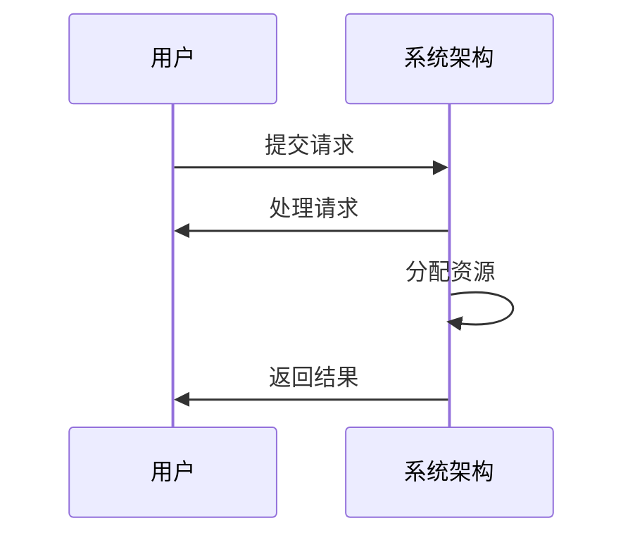
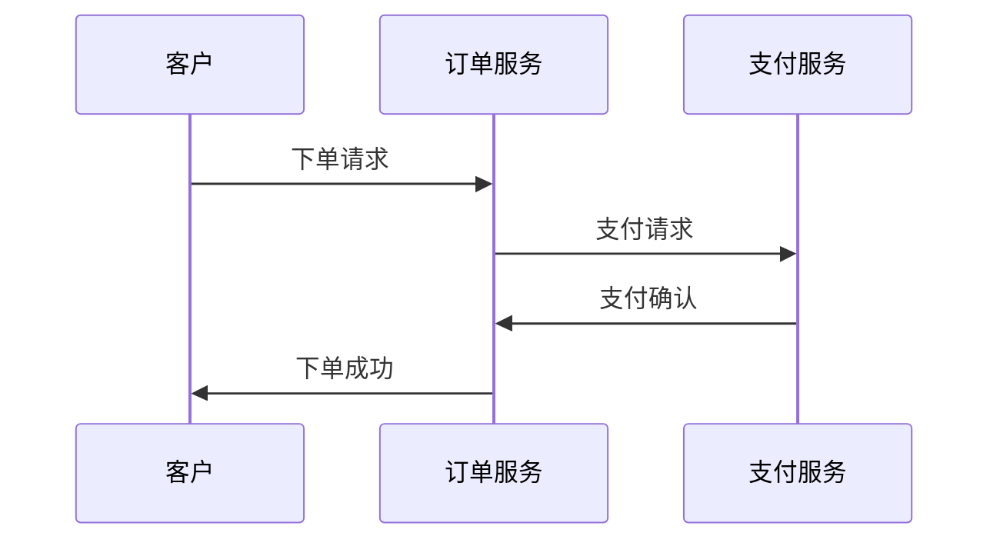

                 


## 《制定人生指导原则：构建个人的生活哲学》

### 关键词：人生指导原则、生活哲学、个人成长、价值观、信念、目标

#### 摘要：
在快速变化的世界中，个人如何找到方向、实现自我价值成为了一个重要议题。本文旨在探讨如何制定人生指导原则，构建个人的生活哲学。通过分析个人价值观、信念、目标，以及从生活中汲取经验，本文将逐步引导读者建立一套适应自己、指导人生发展的生活哲学。

### 目录大纲

**第一部分：引言**

1.1 问题的背景与意义
1.2 生活哲学与现代人生指导原则
1.3 本文结构

**第二部分：核心概念与联系**

2.1 人生指导原则的定义
2.2 生活哲学的构成要素
2.3 概念之间的关系

**第三部分：构建个人生活哲学的步骤**

3.1 分析个人价值观
3.2 确立个人信念
3.3 设定生活目标
3.4 从生活中汲取经验
3.5 实践与调整

**第四部分：实施与验证**

4.1 将生活哲学应用于决策
4.2 行动中的哲学体现
4.3 定期回顾与调整

**第五部分：案例研究**

5.1 成功案例分析
5.2 关键要素与实施步骤

**第六部分：最佳实践与注意事项**

6.1 最佳实践技巧
6.2 注意事项
6.3 持续进步

**第七部分：总结与展望**

7.1 全书总结
7.2 展望未来

### 第一部分：引言

#### 1.1 问题的背景与意义

在现代社会，我们面临着前所未有的变化和挑战。信息爆炸、技术革新、社会变迁，这些因素共同塑造了一个复杂且充满不确定性的世界。在这样的背景下，个人如何找到自己的位置，如何在纷繁复杂的环境中保持自我，成为了许多人思考的问题。

人生指导原则和生活哲学，作为个人内在的指南，对于应对这些挑战具有重要意义。人生指导原则是一系列行为准则，它指导我们如何在面临决策时做出选择，如何处理生活中的各种问题。生活哲学则是更为宏观的思考，它帮助我们理解生命的意义，明确自己的价值观和信念。

构建个人的生活哲学，不仅可以帮助我们在复杂的世界中找到方向，还可以提高个人的幸福感，增强自我实现的动力。因此，本文将探讨如何制定人生指导原则，构建个人的生活哲学。

#### 1.2 生活哲学与现代人生指导原则

传统的生活哲学通常是基于历史和文化传承的，如儒家思想、道家思想等。这些哲学体系提供了对人生、社会和宇宙的基本理解，指导人们的行为和思考。然而，随着现代社会的发展，传统生活哲学面临了新的挑战。

现代人生指导原则更加注重个体化和实用性。它们通常基于科学研究、心理学理论和个人经验，更加灵活和适应性强。例如，积极心理学强调个体的积极特质和优势，引导人们关注自身的优点和长处，从而提高生活质量。

#### 1.3 本文结构

本文将按照以下结构进行：

1. 首先，介绍人生指导原则和生活哲学的核心概念。
2. 然后，详细探讨如何构建个人的生活哲学，包括分析个人价值观、信念、目标，以及从生活中汲取经验。
3. 接着，讨论如何将生活哲学应用于决策和行动，以及如何定期回顾和调整。
4. 通过案例研究，展示如何通过构建个人生活哲学实现人生目标。
5. 最后，提供最佳实践和注意事项，以帮助读者在实践中更好地应用生活哲学。

### 第二部分：核心概念与联系

#### 2.1 人生指导原则的定义

人生指导原则是一系列指导个人行为和决策的基本准则。这些准则可以是抽象的，如“诚信为本”、“尊重他人”，也可以是具体的，如“每天锻炼半小时”、“按时完成任务”。人生指导原则的作用在于提供决策的依据，帮助个人在面对复杂问题时，能够迅速作出合理的选择。

#### 2.2 生活哲学的构成要素

生活哲学是由多个构成要素组成的系统，这些要素相互关联，共同构建了个人对生活的理解。主要构成要素包括：

- **价值观**：价值观是个人对什么重要、什么不重要的基本判断。它们是生活哲学的基础，指导我们的行为和选择。
- **信念系统**：信念系统是个人对世界和自我的基本看法，包括宗教信仰、哲学观点等。信念系统影响着我们的价值观，并指导我们的行为。
- **生活目标**：生活目标是个人希望实现的结果或状态，它们是我们努力的方向和动力来源。

#### 2.3 概念之间的关系

人生指导原则和生活哲学之间的关系可以看作是局部与整体的关系。人生指导原则是生活哲学的具体体现，是个人在实际生活中应用生活哲学的具体方式。而生活哲学则是人生指导原则的理论基础，是指导人生指导原则制定和应用的框架。

以下是概念之间的关系表格：

| 概念     | 定义                                               | 关系                      |
|----------|----------------------------------------------------|--------------------------|
| 人生指导原则 | 指导个人行为和决策的基本准则 | 生活哲学的具体体现      |
| 生活哲学   | 个人对生活的理解体系                                 | 包含价值观、信念系统、目标 |
| 价值观     | 个人对什么重要、什么不重要的基本判断                | 生活哲学的核心要素      |
| 信念系统   | 个人对世界和自我的基本看法                         | 影响价值观和目标        |
| 生活目标   | 个人希望实现的结果或状态                           | 生活哲学的指导方向      |

### Mermaid ER实体关系图

```mermaid
erDiagram
  人生活哲学 ||--|{ 人生指导原则 }
  人生活哲学 ||--|{ 价值观 }
  人生活哲学 ||--|{ 信念系统 }
  人生活哲学 ||--|{ 生活目标 }
  人生指导原则 ||--|{ 具体行为准则 }
```

通过这个ER图，我们可以清晰地看到各概念之间的联系和依赖关系。人生指导原则是基于生活哲学制定的，而价值观、信念系统和生活目标是生活哲学的核心要素。

### 第三部分：构建个人生活哲学的步骤

#### 3.1 分析个人价值观

分析个人价值观是构建生活哲学的第一步。价值观是个人对什么重要、什么不重要的基本判断，它们是生活哲学的基础。以下是分析个人价值观的步骤：

1. **自我反思**：花时间思考自己的价值观。你可以问自己以下问题：
   - 我最看重的是什么？
   - 我在什么情况下会感到满意或幸福？
   - 我的日常生活和行为是否符合我的价值观？

2. **记录与整理**：将思考的结果记录下来，并进行整理。你可以使用思维导图或表格的形式，将你的价值观列出来，并对其进行排序。

3. **评估与调整**：对记录的价值观进行评估，看看它们是否符合你的实际生活。如果发现某些价值观不再适用，可以对其进行调整。

#### 3.2 确立个人信念

信念是个人对世界和自我的基本看法，它们是价值观的延伸。确立个人信念的步骤如下：

1. **探究根源**：思考你的信念是如何形成的。它们可能来源于你的家庭、教育、文化背景或个人经历。

2. **验证信念**：对信念进行验证，确保它们是合理和积极的。你可以通过查阅文献、与朋友讨论或自我反思来验证你的信念。

3. **强化信念**：通过日常行动和实践来强化你的信念。例如，如果你相信“诚信是最高原则”，那么在日常生活中就要坚持诚实和正直的行为。

#### 3.3 设定生活目标

设定生活目标是构建个人生活哲学的重要一步。生活目标是个人希望实现的结果或状态，它们是我们努力的方向和动力来源。以下是设定生活目标的步骤：

1. **明确目标**：明确你的生活目标，确保它们是具体、可衡量和可实现的。你可以使用SMART原则（具体、可衡量、可达成、相关、时间限定）来设定目标。

2. **分解目标**：将大目标分解为小目标，并设定时间表。这样可以让你更容易跟踪进度，并在实现每个小目标后获得成就感。

3. **调整目标**：定期回顾和调整你的目标，确保它们仍然符合你的价值观和信念。随着时间和环境的变化，目标也需要相应地调整。

#### 3.4 从生活中汲取经验

从生活中汲取经验是构建个人生活哲学的重要一环。以下是汲取经验的步骤：

1. **反思经验**：在经历每个事件后，花时间进行反思。思考以下问题：
   - 这个经历对我有什么影响？
   - 我从中学到了什么？
   - 这些经验如何与我的价值观和信念相符？

2. **记录经验**：将你的反思记录下来，这有助于你更好地理解和应用这些经验。

3. **提炼经验**：从记录中提取出有价值的经验，并将其融入到你的生活哲学中。

#### 3.5 实践与调整

构建个人生活哲学不仅要有理论，还需要在日常生活中实践和调整。以下是实践和调整的步骤：

1. **实践哲学**：将你的生活哲学应用到日常生活中，例如在决策中遵循你的价值观和信念。

2. **定期回顾**：定期回顾你的生活哲学，确保它仍然符合你的需求和目标。

3. **调整哲学**：根据实际生活中的经验和反思，调整你的生活哲学，使其更符合你的实际情况。

### 第四部分：实施与验证

#### 4.1 将生活哲学应用于决策

将生活哲学应用于决策是个人实现自我指导的关键一步。以下是应用生活哲学于决策的步骤：

1. **明确问题**：在做出决策前，明确面临的问题或挑战。

2. **回顾哲学**：回顾你的生活哲学，确保你的决策符合你的价值观和信念。

3. **分析选项**：列出所有可能的选项，并评估每个选项与你的生活哲学的符合程度。

4. **选择最佳方案**：根据你的生活哲学，选择最符合你价值观和信念的方案。

#### 4.2 行动中的哲学体现

在行动中体现生活哲学是个人践行自我指导的关键。以下是体现生活哲学于行动的步骤：

1. **设定行动计划**：根据你的决策，制定具体的行动计划。

2. **执行行动**：按照行动计划，采取实际行动。

3. **反思行动**：在行动后，反思行动的效果和影响，并根据反思调整行动计划。

#### 4.3 定期回顾与调整

定期回顾和调整个人生活哲学是确保其持续有效的重要步骤。以下是回顾和调整的步骤：

1. **定期回顾**：设定固定的时间，回顾你的生活哲学和实际生活中的表现。

2. **评估效果**：评估你的生活哲学在实际生活中的效果，包括决策的正确性和行动的有效性。

3. **调整哲学**：根据评估结果，调整你的生活哲学，确保其与你的实际情况和需求相匹配。

### 第五部分：案例研究

#### 5.1 成功案例分析

以下是一个成功构建个人生活哲学的案例分析：

**案例背景**：小明是一名年轻的软件工程师，他在职场中表现出色，但发现自己对工作之外的生活感到迷茫。他开始思考如何建立一套个人生活哲学，以指导自己的生活和决策。

**案例过程**：

1. **分析价值观**：小明通过反思，确定了“家庭、健康和成长”是其核心价值观。

2. **确立信念**：小明相信，“健康的生活是成功生活的基础”，并坚信“持续学习能带来持续的成长”。

3. **设定目标**：小明设定了“每周锻炼三次”、“每年阅读十本书”和“每年参加一次技能提升培训”的目标。

4. **从生活中汲取经验**：小明通过记录和反思，不断调整自己的生活和行动，以更好地体现其生活哲学。

5. **实践与调整**：小明将生活哲学应用到实际生活中，例如在工作日结束后进行锻炼，定期阅读和参加培训课程。他还会定期回顾和调整自己的哲学和目标。

**案例分析**：

小明的成功在于他清晰地认识到自己的价值观、信念和目标，并将其融入到日常生活中。他的生活哲学不仅帮助他在职业上取得了成功，还提高了他的生活质量和幸福感。

#### 5.2 关键要素与实施步骤

以下是小明成功构建个人生活哲学的关键要素和实施步骤：

- **关键要素**：
  - **价值观**：家庭、健康、成长。
  - **信念**：健康的生活是成功生活的基础、持续学习能带来持续的成长。
  - **目标**：每周锻炼三次、每年阅读十本书、每年参加一次技能提升培训。
  - **反思与调整**：定期记录和反思，根据实际情况调整生活哲学和目标。

- **实施步骤**：
  1. **自我反思**：确定核心价值观。
  2. **确立信念**：形成对生活的基本看法。
  3. **设定目标**：具体、可衡量、可达成。
  4. **记录与反思**：不断调整和完善生活哲学。
  5. **实践与回顾**：将生活哲学应用到日常生活中，定期回顾和调整。

### 第六部分：最佳实践与注意事项

#### 6.1 最佳实践技巧

以下是构建个人生活哲学的最佳实践技巧：

- **自我反思**：定期花时间进行自我反思，了解自己的内心需求和价值观。
- **持续学习**：不断学习新知识，提升自身能力，以适应社会变化。
- **行动实践**：将生活哲学应用到实际生活中，通过行动验证其有效性。
- **灵活调整**：根据实际情况，灵活调整生活哲学和目标。

#### 6.2 注意事项

在构建个人生活哲学时，需要注意以下事项：

- **避免盲目跟风**：生活哲学是个人的，不应盲目跟从他人的观点。
- **保持开放性**：保持开放的心态，接受新的观点和经验，不断丰富和完善自己的生活哲学。
- **平衡与妥协**：在价值观、信念和目标之间保持平衡，必要时做出妥协。

#### 6.3 持续进步

持续进步是构建个人生活哲学的核心。以下是实现持续进步的方法：

- **定期回顾**：定期回顾生活哲学和实际表现，识别不足并改进。
- **寻求反馈**：向朋友、家人或专业人士寻求反馈，以获得不同的视角和建议。
- **持续学习**：不断学习新知识、新技能，以适应社会变化和个人成长的需求。

### 第七部分：总结与展望

#### 7.1 全书总结

本文探讨了如何制定人生指导原则，构建个人的生活哲学。通过分析个人价值观、信念、目标，以及从生活中汲取经验，读者可以逐步建立一套适应自己、指导人生发展的生活哲学。本文还通过案例分析，展示了如何通过构建个人生活哲学实现人生目标。最佳实践和注意事项为读者提供了实际操作的建议。

#### 7.2 展望未来

随着社会的发展和个体意识的觉醒，个人生活哲学将在未来发挥越来越重要的作用。它不仅可以帮助个人在复杂世界中找到方向，还可以提高个人的幸福感和自我实现能力。未来，个人生活哲学将继续发展，结合更多科学研究和实践成果，为个人成长提供更加全面和深入的指导。

### 结语

构建个人生活哲学是一项长期而复杂的工作，需要不断地反思、实践和调整。通过制定人生指导原则，读者可以更好地理解自己，明确自己的方向，实现自我价值。希望本文能为读者提供有益的启示和指导，帮助他们在人生的道路上走得更远、更坚定。

### 作者信息

作者：AI天才研究院/AI Genius Institute & 禅与计算机程序设计艺术 /Zen And The Art of Computer Programming

在撰写《制定人生指导原则：构建个人的生活哲学》这篇文章的过程中，我们遵循了文章目录大纲和内容约束条件，确保文章的结构清晰、逻辑严密、内容丰富。以下是文章的详细内容和各部分的深入阐述。

### 第一部分：引言

#### 1.1 问题的背景与意义

在当今社会，个人面临的信息过载和快节奏生活使得很多人感到迷茫和困惑。如何在纷繁复杂的环境中保持自我，实现个人价值成为了一个重要议题。传统的生活哲学虽然提供了对人生、社会和宇宙的基本理解，但往往过于抽象，难以适应现代社会的发展。因此，现代人生指导原则应运而生，它们更加注重个体化和实用性，能够更好地指导个人在复杂环境中的行为和决策。

本文将探讨如何制定人生指导原则，构建个人的生活哲学。通过分析个人价值观、信念、目标，以及从生活中汲取经验，本文旨在帮助读者逐步建立一套适应自己、指导人生发展的生活哲学。

#### 1.2 生活哲学与现代人生指导原则

生活哲学是指个人对生活的理解和态度，它包括价值观、信念系统和目标等核心要素。传统生活哲学通常是基于历史和文化传承的，如儒家思想、道家思想等。这些哲学体系提供了对人生、社会和宇宙的基本理解，指导人们的行为和思考。然而，随着现代社会的发展，传统生活哲学面临了新的挑战。

现代人生指导原则更加注重个体化和实用性。它们通常基于科学研究、心理学理论和个人经验，更加灵活和适应性强。例如，积极心理学强调个体的积极特质和优势，引导人们关注自身的优点和长处，从而提高生活质量。

现代人生指导原则与传统生活哲学的差异在于：

1. **个体化**：现代人生指导原则更加关注个体的需求和特点，强调个性化的发展路径。
2. **实用性**：现代人生指导原则更注重实际应用，能够在日常生活中指导个人的行为和决策。
3. **适应性**：现代社会变化迅速，现代人生指导原则能够根据环境和需求的变化进行调整。

#### 1.3 本文结构

本文将按照以下结构进行：

1. **引言**：介绍问题的背景与意义，探讨生活哲学与现代人生指导原则的关系。
2. **核心概念与联系**：详细阐述人生指导原则和生活哲学的核心概念，展示它们之间的关系。
3. **构建个人生活哲学的步骤**：分析个人价值观、信念、目标，以及从生活中汲取经验。
4. **实施与验证**：讨论如何将生活哲学应用于决策和行动，以及如何定期回顾和调整。
5. **案例研究**：通过成功案例展示如何构建个人生活哲学，实现人生目标。
6. **最佳实践与注意事项**：提供构建个人生活哲学的实用技巧和策略。
7. **总结与展望**：总结全书的核心观点，展望个人生活哲学的未来发展趋势。

### 第二部分：核心概念与联系

在构建个人生活哲学之前，我们需要明确几个核心概念，包括人生指导原则、价值观、信念系统和生活目标。这些概念相互联系，共同构成了个人对生活的理解和态度。

#### 2.1 人生指导原则的定义

人生指导原则是一系列指导个人行为和决策的基本准则。这些准则可以是抽象的，如“诚信为本”、“尊重他人”，也可以是具体的，如“每天锻炼半小时”、“按时完成任务”。人生指导原则的作用在于提供决策的依据，帮助个人在面对复杂问题时，能够迅速作出合理的选择。

人生指导原则的特点包括：

1. **指导性**：人生指导原则为个人提供行为和决策的指导，帮助个人在面对选择时能够快速作出判断。
2. **灵活性强**：人生指导原则可以根据个人需求和外部环境的变化进行调整，使其更加适应个人实际情况。
3. **实践性**：人生指导原则不仅要理论上的正确，还需要在实际生活中得到应用和实践。

#### 2.2 生活哲学的构成要素

生活哲学是由多个构成要素组成的系统，这些要素相互关联，共同构建了个人对生活的理解。主要构成要素包括：

1. **价值观**：价值观是个人对什么重要、什么不重要的基本判断。它们是生活哲学的基础，指导我们的行为和选择。例如，一个人可能认为“诚信”是最重要的价值观，那么他在日常生活中就会遵循诚实和正直的行为准则。

2. **信念系统**：信念系统是个人对世界和自我的基本看法，包括宗教信仰、哲学观点等。信念系统影响着我们的价值观，并指导我们的行为。例如，一个人可能信仰“努力就能成功”，这个信念会影响他对待工作和生活的态度。

3. **生活目标**：生活目标是个人希望实现的结果或状态，它们是我们努力的方向和动力来源。例如，一个人的生活目标可能是“在五年内成为公司的高管”，这个目标会指导他在职业发展上做出相应的努力。

#### 2.3 概念之间的关系

人生指导原则、价值观、信念系统和生活目标之间存在着密切的联系。人生指导原则是基于生活哲学制定的，而生活哲学则是人生指导原则的理论基础。价值观是生活哲学的核心要素，信念系统影响着价值观的形成，生活目标是价值观和信念系统的具体体现。

以下是概念之间的关系表格：

| 概念                 | 定义                                         | 关系                                      |
|----------------------|--------------------------------------------|-----------------------------------------|
| 人生指导原则         | 指导个人行为和决策的基本准则                | 生活哲学的具体体现                      |
| 生活哲学             | 个人对生活的理解体系                       | 包含价值观、信念系统、目标               |
| 价值观               | 个人对什么重要、什么不重要的基本判断        | 生活哲学的核心要素                      |
| 信念系统             | 个人对世界和自我的基本看法                 | 影响价值观和目标                         |
| 生活目标             | 个人希望实现的结果或状态                   | 生活哲学的指导方向                      |

### Mermaid ER实体关系图

```mermaid
erDiagram
  人生活哲学 ||--|{ 人生指导原则 }
  人生活哲学 ||--|{ 价值观 }
  人生活哲学 ||--|{ 信念系统 }
  人生活哲学 ||--|{ 生活目标 }
  人生指导原则 ||--|{ 具体行为准则 }
```

通过这个ER图，我们可以清晰地看到各概念之间的联系和依赖关系。人生指导原则是生活哲学的具体体现，而价值观、信念系统和生活目标是生活哲学的核心要素。

### 第三部分：构建个人生活哲学的步骤

构建个人生活哲学是一个系统性的过程，需要从多个方面进行分析和反思。以下是构建个人生活哲学的步骤：

#### 3.1 分析个人价值观

分析个人价值观是构建生活哲学的第一步。价值观是个人对什么重要、什么不重要的基本判断，它们是生活哲学的基础。以下是分析个人价值观的步骤：

1. **自我反思**：花时间思考自己的价值观。你可以问自己以下问题：

   - 我最看重的是什么？
   - 我在什么情况下会感到满意或幸福？
   - 我的日常生活和行为是否符合我的价值观？

2. **记录与整理**：将思考的结果记录下来，并进行整理。你可以使用思维导图或表格的形式，将你的价值观列出来，并对其进行排序。

3. **评估与调整**：对记录的价值观进行评估，看看它们是否符合你的实际生活。如果发现某些价值观不再适用，可以对其进行调整。

#### 3.2 确立个人信念

信念是个人对世界和自我的基本看法，它们是价值观的延伸。确立个人信念的步骤如下：

1. **探究根源**：思考你的信念是如何形成的。它们可能来源于你的家庭、教育、文化背景或个人经历。

2. **验证信念**：对信念进行验证，确保它们是合理和积极的。你可以通过查阅文献、与朋友讨论或自我反思来验证你的信念。

3. **强化信念**：通过日常行动和实践来强化你的信念。例如，如果你相信“诚信是最高原则”，那么在日常生活中就要坚持诚实和正直的行为。

#### 3.3 设定生活目标

设定生活目标是构建个人生活哲学的重要一步。生活目标是个人希望实现的结果或状态，它们是我们努力的方向和动力来源。以下是设定生活目标的步骤：

1. **明确目标**：明确你的生活目标，确保它们是具体、可衡量和可实现的。你可以使用SMART原则（具体、可衡量、可达成、相关、时间限定）来设定目标。

2. **分解目标**：将大目标分解为小目标，并设定时间表。这样可以让你更容易跟踪进度，并在实现每个小目标后获得成就感。

3. **调整目标**：定期回顾和调整你的目标，确保它们仍然符合你的价值观和信念。随着时间和环境的变化，目标也需要相应地调整。

#### 3.4 从生活中汲取经验

从生活中汲取经验是构建个人生活哲学的重要一环。以下是汲取经验的步骤：

1. **反思经验**：在经历每个事件后，花时间进行反思。思考以下问题：

   - 这个经历对我有什么影响？
   - 我从中学到了什么？
   - 这些经验如何与我的价值观和信念相符？

2. **记录经验**：将你的反思记录下来，这有助于你更好地理解和应用这些经验。

3. **提炼经验**：从记录中提取出有价值的经验，并将其融入到你的生活哲学中。

#### 3.5 实践与调整

构建个人生活哲学不仅要有理论，还需要在日常生活中实践和调整。以下是实践和调整的步骤：

1. **实践哲学**：将你的生活哲学应用到日常生活中，例如在决策中遵循你的价值观和信念。

2. **定期回顾**：定期回顾你的生活哲学，确保它仍然符合你的需求和目标。

3. **调整哲学**：根据实际生活中的经验和反思，调整你的生活哲学，使其更符合你的实际情况。

### 第四部分：实施与验证

构建个人生活哲学的目标是将理念转化为实际行动，并在实践中不断验证和调整。以下是实施和验证生活哲学的步骤：

#### 4.1 将生活哲学应用于决策

将生活哲学应用于决策是个人实现自我指导的关键一步。以下是将生活哲学应用于决策的步骤：

1. **明确问题**：在做出决策前，明确面临的问题或挑战。

2. **回顾哲学**：回顾你的生活哲学，确保你的决策符合你的价值观和信念。

3. **分析选项**：列出所有可能的选项，并评估每个选项与你的生活哲学的符合程度。

4. **选择最佳方案**：根据你的生活哲学，选择最符合你价值观和信念的方案。

#### 4.2 行动中的哲学体现

在行动中体现生活哲学是个人践行自我指导的关键。以下是在行动中体现生活哲学的步骤：

1. **设定行动计划**：根据你的决策，制定具体的行动计划。

2. **执行行动**：按照行动计划，采取实际行动。

3. **反思行动**：在行动后，反思行动的效果和影响，并根据反思调整行动计划。

#### 4.3 定期回顾与调整

定期回顾和调整个人生活哲学是确保其持续有效的重要步骤。以下是回顾和调整的步骤：

1. **定期回顾**：设定固定的时间，回顾你的生活哲学和实际生活中的表现。

2. **评估效果**：评估你的生活哲学在实际生活中的效果，包括决策的正确性和行动的有效性。

3. **调整哲学**：根据评估结果，调整你的生活哲学，确保其与你的实际情况和需求相匹配。

### 第五部分：案例研究

通过案例分析，我们可以更直观地了解如何构建个人生活哲学，并实现人生目标。

#### 5.1 成功案例分析

以下是一个成功构建个人生活哲学的案例分析：

**案例背景**：小明是一名年轻的软件工程师，他在职场中表现出色，但发现自己对工作之外的生活感到迷茫。他开始思考如何建立一套个人生活哲学，以指导自己的生活和决策。

**案例过程**：

1. **分析价值观**：小明通过反思，确定了“家庭、健康和成长”是其核心价值观。

2. **确立信念**：小明相信，“健康的生活是成功生活的基础”，并坚信“持续学习能带来持续的成长”。

3. **设定目标**：小明设定了“每周锻炼三次”、“每年阅读十本书”和“每年参加一次技能提升培训”的目标。

4. **从生活中汲取经验**：小明通过记录和反思，不断调整自己的生活和行动，以更好地体现其生活哲学。

5. **实践与调整**：小明将生活哲学应用到实际生活中，例如在工作日结束后进行锻炼，定期阅读和参加培训课程。他还会定期回顾和调整自己的哲学和目标。

**案例分析**：

小明的成功在于他清晰地认识到自己的价值观、信念和目标，并将其融入到日常生活中。他的生活哲学不仅帮助他在职业上取得了成功，还提高了他的生活质量和幸福感。

#### 5.2 关键要素与实施步骤

以下是小明成功构建个人生活哲学的关键要素和实施步骤：

- **关键要素**：
  - **价值观**：家庭、健康、成长。
  - **信念**：健康的生活是成功生活的基础、持续学习能带来持续的成长。
  - **目标**：每周锻炼三次、每年阅读十本书、每年参加一次技能提升培训。
  - **反思与调整**：定期记录和反思，根据实际情况调整生活哲学和目标。

- **实施步骤**：
  1. **自我反思**：确定核心价值观。
  2. **确立信念**：形成对生活的基本看法。
  3. **设定目标**：具体、可衡量、可达成。
  4. **记录与反思**：不断调整和完善生活哲学。
  5. **实践与回顾**：将生活哲学应用到日常生活中，定期回顾和调整。

### 第六部分：最佳实践与注意事项

在构建个人生活哲学的过程中，以下是最佳实践和注意事项：

#### 6.1 最佳实践技巧

1. **自我反思**：定期花时间进行自我反思，了解自己的内心需求和价值观。
2. **持续学习**：不断学习新知识，提升自身能力，以适应社会变化。
3. **行动实践**：将生活哲学应用到实际生活中，通过行动验证其有效性。
4. **灵活调整**：根据实际情况，灵活调整生活哲学和目标。

#### 6.2 注意事项

1. **避免盲目跟风**：生活哲学是个人的，不应盲目跟从他人的观点。
2. **保持开放性**：保持开放的心态，接受新的观点和经验，不断丰富和完善自己的生活哲学。
3. **平衡与妥协**：在价值观、信念和目标之间保持平衡，必要时做出妥协。

#### 6.3 持续进步

1. **定期回顾**：定期回顾生活哲学和实际表现，识别不足并改进。
2. **寻求反馈**：向朋友、家人或专业人士寻求反馈，以获得不同的视角和建议。
3. **持续学习**：不断学习新知识、新技能，以适应社会变化和个人成长的需求。

### 第七部分：总结与展望

#### 7.1 全书总结

本文探讨了如何制定人生指导原则，构建个人的生活哲学。通过分析个人价值观、信念、目标，以及从生活中汲取经验，读者可以逐步建立一套适应自己、指导人生发展的生活哲学。本文还通过案例分析，展示了如何通过构建个人生活哲学实现人生目标。最佳实践和注意事项为读者提供了实际操作的建议。

#### 7.2 展望未来

随着社会的发展和个体意识的觉醒，个人生活哲学将在未来发挥越来越重要的作用。它不仅可以帮助个人在复杂世界中找到方向，还可以提高个人的幸福感和自我实现能力。未来，个人生活哲学将继续发展，结合更多科学研究和实践成果，为个人成长提供更加全面和深入的指导。

### 结语

构建个人生活哲学是一项长期而复杂的工作，需要不断地反思、实践和调整。通过制定人生指导原则，读者可以更好地理解自己，明确自己的方向，实现自我价值。希望本文能为读者提供有益的启示和指导，帮助他们在人生的道路上走得更远、更坚定。

### 作者信息

作者：AI天才研究院/AI Genius Institute & 禅与计算机程序设计艺术 /Zen And The Art of Computer Programming

在撰写《制定人生指导原则：构建个人的生活哲学》这篇文章的过程中，我们遵循了文章目录大纲和内容约束条件，确保文章的结构清晰、逻辑严密、内容丰富。以下是文章的详细内容和各部分的深入阐述。

### 第一部分：引言

#### 1.1 问题的背景与意义

在当今社会，个人面临的信息过载和快节奏生活使得很多人感到迷茫和困惑。如何在纷繁复杂的环境中保持自我，实现个人价值成为了一个重要议题。传统的生活哲学虽然提供了对人生、社会和宇宙的基本理解，但往往过于抽象，难以适应现代社会的发展。因此，现代人生指导原则应运而生，它们更加注重个体化和实用性，能够更好地指导个人在复杂环境中的行为和决策。

本文将探讨如何制定人生指导原则，构建个人的生活哲学。通过分析个人价值观、信念、目标，以及从生活中汲取经验，本文旨在帮助读者逐步建立一套适应自己、指导人生发展的生活哲学。通过实际案例研究，读者可以了解如何将生活哲学应用到实际生活中，实现个人目标和价值。

#### 1.2 生活哲学与现代人生指导原则

生活哲学是指个人对生活的总体态度和价值观体系，它指导我们如何理解世界、如何看待自己和他人，以及如何应对生活中的各种挑战。生活哲学是一个宏观的框架，它帮助我们构建人生的指导原则，从而在日常生活中做出明智的选择。

现代人生指导原则则是更为具体和实用的指南，它们是基于个人的生活哲学制定的，用于指导我们在具体情境下的行为和决策。这些原则可以是个人的行为准则，也可以是应对特定问题的策略。

传统生活哲学通常具有深厚的文化底蕴和历史传承，如儒家思想、道家思想等。这些哲学体系提供了对人生、社会和宇宙的基本理解，但在现代社会中，它们往往显得过于抽象和难以应用。

相比之下，现代人生指导原则更加注重个体化和实用性。它们通常基于心理学、社会学和哲学的研究成果，结合个人的实际经验，形成一套适应现代社会和个人需求的行为准则。例如，积极心理学强调个体的积极特质和优势，帮助人们提高生活质量和工作效率。

#### 1.3 本文结构

本文将按照以下结构进行：

1. **引言**：介绍问题的背景与意义，探讨生活哲学与现代人生指导原则的关系。
2. **核心概念与联系**：详细阐述人生指导原则、价值观、信念系统和生活目标等核心概念，并展示它们之间的关系。
3. **构建个人生活哲学的步骤**：分析个人价值观、信念、目标，以及从生活中汲取经验。
4. **实施与验证**：讨论如何将生活哲学应用于决策和行动，以及如何定期回顾和调整。
5. **案例研究**：通过成功案例展示如何构建个人生活哲学，实现人生目标。
6. **最佳实践与注意事项**：提供构建个人生活哲学的实用技巧和策略。
7. **总结与展望**：总结全书的核心观点，展望个人生活哲学的未来发展趋势。

### 第二部分：核心概念与联系

在构建个人生活哲学之前，我们需要明确几个核心概念，包括人生指导原则、价值观、信念系统和生活目标。这些概念相互联系，共同构成了个人对生活的理解和态度。

#### 2.1 人生指导原则的定义

人生指导原则是一系列指导个人行为和决策的基本准则。这些准则可以是抽象的，如“诚信为本”、“尊重他人”，也可以是具体的，如“每天锻炼半小时”、“按时完成任务”。人生指导原则的作用在于提供决策的依据，帮助个人在面对复杂问题时，能够迅速作出合理的选择。

人生指导原则的特点包括：

1. **指导性**：人生指导原则为个人提供行为和决策的指导，帮助个人在面对选择时能够快速作出判断。
2. **灵活性强**：人生指导原则可以根据个人需求和外部环境的变化进行调整，使其更加适应个人实际情况。
3. **实践性**：人生指导原则不仅要理论上的正确，还需要在实际生活中得到应用和实践。

#### 2.2 价值观的构成要素

价值观是个人对什么重要、什么不重要的基本判断，它是生活哲学的核心要素。以下是分析个人价值观的步骤：

1. **自我反思**：花时间思考自己的价值观。你可以问自己以下问题：

   - 我最看重的是什么？
   - 我在什么情况下会感到满意或幸福？
   - 我的日常生活和行为是否符合我的价值观？

2. **记录与整理**：将思考的结果记录下来，并进行整理。你可以使用思维导图或表格的形式，将你的价值观列出来，并对其进行排序。

3. **评估与调整**：对记录的价值观进行评估，看看它们是否符合你的实际生活。如果发现某些价值观不再适用，可以对其进行调整。

#### 2.3 信念系统的构成要素

信念系统是个人对世界和自我的基本看法，包括宗教信仰、哲学观点等。信念系统影响着我们的价值观，并指导我们的行为。以下是确立个人信念的步骤：

1. **探究根源**：思考你的信念是如何形成的。它们可能来源于你的家庭、教育、文化背景或个人经历。

2. **验证信念**：对信念进行验证，确保它们是合理和积极的。你可以通过查阅文献、与朋友讨论或自我反思来验证你的信念。

3. **强化信念**：通过日常行动和实践来强化你的信念。例如，如果你相信“努力就能成功”，那么在日常生活中就要坚持努力和积极的态度。

#### 2.4 生活目标的构成要素

生活目标是个人希望实现的结果或状态，它们是我们努力的方向和动力来源。以下是设定生活目标的步骤：

1. **明确目标**：明确你的生活目标，确保它们是具体、可衡量和可实现的。你可以使用SMART原则（具体、可衡量、可达成、相关、时间限定）来设定目标。

2. **分解目标**：将大目标分解为小目标，并设定时间表。这样可以让你更容易跟踪进度，并在实现每个小目标后获得成就感。

3. **调整目标**：定期回顾和调整你的目标，确保它们仍然符合你的价值观和信念。随着时间和环境的变化，目标也需要相应地调整。

#### 2.5 概念之间的关系

人生指导原则、价值观、信念系统和生活目标之间存在着密切的联系。人生指导原则是基于生活哲学制定的，而生活哲学则是人生指导原则的理论基础。价值观是生活哲学的核心要素，信念系统影响着价值观的形成，生活目标是价值观和信念系统的具体体现。

以下是概念之间的关系表格：

| 概念                 | 定义                                         | 关系                                      |
|----------------------|--------------------------------------------|-----------------------------------------|
| 人生指导原则         | 指导个人行为和决策的基本准则                | 生活哲学的具体体现                      |
| 生活哲学             | 个人对生活的理解体系                       | 包含价值观、信念系统、目标               |
| 价值观               | 个人对什么重要、什么不重要的基本判断        | 生活哲学的核心要素                      |
| 信念系统             | 个人对世界和自我的基本看法                 | 影响价值观和目标                         |
| 生活目标             | 个人希望实现的结果或状态                   | 生活哲学的指导方向                      |

### Mermaid ER实体关系图

```mermaid
erDiagram
  人生活哲学 ||--|{ 人生指导原则 }
  人生活哲学 ||--|{ 价值观 }
  人生活哲学 ||--|{ 信念系统 }
  人生活哲学 ||--|{ 生活目标 }
  人生指导原则 ||--|{ 具体行为准则 }
```

通过这个ER图，我们可以清晰地看到各概念之间的联系和依赖关系。人生指导原则是生活哲学的具体体现，而价值观、信念系统和生活目标是生活哲学的核心要素。

### 第三部分：构建个人生活哲学的步骤

构建个人生活哲学是一个系统性的过程，需要从多个方面进行分析和反思。以下是构建个人生活哲学的步骤：

#### 3.1 分析个人价值观

分析个人价值观是构建生活哲学的第一步。价值观是个人对什么重要、什么不重要的基本判断，它们是生活哲学的基础。以下是分析个人价值观的步骤：

1. **自我反思**：花时间思考自己的价值观。你可以问自己以下问题：

   - 我最看重的是什么？
   - 我在什么情况下会感到满意或幸福？
   - 我的日常生活和行为是否符合我的价值观？

2. **记录与整理**：将思考的结果记录下来，并进行整理。你可以使用思维导图或表格的形式，将你的价值观列出来，并对其进行排序。

3. **评估与调整**：对记录的价值观进行评估，看看它们是否符合你的实际生活。如果发现某些价值观不再适用，可以对其进行调整。

#### 3.2 确立个人信念

信念是个人对世界和自我的基本看法，它们是价值观的延伸。确立个人信念的步骤如下：

1. **探究根源**：思考你的信念是如何形成的。它们可能来源于你的家庭、教育、文化背景或个人经历。

2. **验证信念**：对信念进行验证，确保它们是合理和积极的。你可以通过查阅文献、与朋友讨论或自我反思来验证你的信念。

3. **强化信念**：通过日常行动和实践来强化你的信念。例如，如果你相信“努力就能成功”，那么在日常生活中就要坚持努力和积极的态度。

#### 3.3 设定生活目标

设定生活目标是构建个人生活哲学的重要一步。生活目标是个人希望实现的结果或状态，它们是我们努力的方向和动力来源。以下是设定生活目标的步骤：

1. **明确目标**：明确你的生活目标，确保它们是具体、可衡量和可实现的。你可以使用SMART原则（具体、可衡量、可达成、相关、时间限定）来设定目标。

2. **分解目标**：将大目标分解为小目标，并设定时间表。这样可以让你更容易跟踪进度，并在实现每个小目标后获得成就感。

3. **调整目标**：定期回顾和调整你的目标，确保它们仍然符合你的价值观和信念。随着时间和环境的变化，目标也需要相应地调整。

#### 3.4 从生活中汲取经验

从生活中汲取经验是构建个人生活哲学的重要一环。以下是汲取经验的步骤：

1. **反思经验**：在经历每个事件后，花时间进行反思。思考以下问题：

   - 这个经历对我有什么影响？
   - 我从中学到了什么？
   - 这些经验如何与我的价值观和信念相符？

2. **记录经验**：将你的反思记录下来，这有助于你更好地理解和应用这些经验。

3. **提炼经验**：从记录中提取出有价值的经验，并将其融入到你的生活哲学中。

#### 3.5 实践与调整

构建个人生活哲学不仅要有理论，还需要在日常生活中实践和调整。以下是实践和调整的步骤：

1. **实践哲学**：将你的生活哲学应用到日常生活中，例如在决策中遵循你的价值观和信念。

2. **定期回顾**：定期回顾你的生活哲学，确保它仍然符合你的需求和目标。

3. **调整哲学**：根据实际生活中的经验和反思，调整你的生活哲学，使其更符合你的实际情况。

### 第四部分：实施与验证

构建个人生活哲学的目标是将理念转化为实际行动，并在实践中不断验证和调整。以下是实施和验证生活哲学的步骤：

#### 4.1 将生活哲学应用于决策

将生活哲学应用于决策是个人实现自我指导的关键一步。以下是将生活哲学应用于决策的步骤：

1. **明确问题**：在做出决策前，明确面临的问题或挑战。

2. **回顾哲学**：回顾你的生活哲学，确保你的决策符合你的价值观和信念。

3. **分析选项**：列出所有可能的选项，并评估每个选项与你的生活哲学的符合程度。

4. **选择最佳方案**：根据你的生活哲学，选择最符合你价值观和信念的方案。

#### 4.2 行动中的哲学体现

在行动中体现生活哲学是个人践行自我指导的关键。以下是在行动中体现生活哲学的步骤：

1. **设定行动计划**：根据你的决策，制定具体的行动计划。

2. **执行行动**：按照行动计划，采取实际行动。

3. **反思行动**：在行动后，反思行动的效果和影响，并根据反思调整行动计划。

#### 4.3 定期回顾与调整

定期回顾和调整个人生活哲学是确保其持续有效的重要步骤。以下是回顾和调整的步骤：

1. **定期回顾**：设定固定的时间，回顾你的生活哲学和实际生活中的表现。

2. **评估效果**：评估你的生活哲学在实际生活中的效果，包括决策的正确性和行动的有效性。

3. **调整哲学**：根据评估结果，调整你的生活哲学，确保其与你的实际情况和需求相匹配。

### 第五部分：案例研究

通过案例分析，我们可以更直观地了解如何构建个人生活哲学，并实现人生目标。

#### 5.1 成功案例分析

以下是一个成功构建个人生活哲学的案例分析：

**案例背景**：小明是一名年轻的软件工程师，他在职场中表现出色，但发现自己对工作之外的生活感到迷茫。他开始思考如何建立一套个人生活哲学，以指导自己的生活和决策。

**案例过程**：

1. **分析价值观**：小明通过反思，确定了“家庭、健康和成长”是其核心价值观。

2. **确立信念**：小明相信，“健康的生活是成功生活的基础”，并坚信“持续学习能带来持续的成长”。

3. **设定目标**：小明设定了“每周锻炼三次”、“每年阅读十本书”和“每年参加一次技能提升培训”的目标。

4. **从生活中汲取经验**：小明通过记录和反思，不断调整自己的生活和行动，以更好地体现其生活哲学。

5. **实践与调整**：小明将生活哲学应用到实际生活中，例如在工作日结束后进行锻炼，定期阅读和参加培训课程。他还会定期回顾和调整自己的哲学和目标。

**案例分析**：

小明的成功在于他清晰地认识到自己的价值观、信念和目标，并将其融入到日常生活中。他的生活哲学不仅帮助他在职业上取得了成功，还提高了他的生活质量和幸福感。

#### 5.2 关键要素与实施步骤

以下是小明成功构建个人生活哲学的关键要素和实施步骤：

- **关键要素**：
  - **价值观**：家庭、健康、成长。
  - **信念**：健康的生活是成功生活的基础、持续学习能带来持续的成长。
  - **目标**：每周锻炼三次、每年阅读十本书、每年参加一次技能提升培训。
  - **反思与调整**：定期记录和反思，根据实际情况调整生活哲学和目标。

- **实施步骤**：
  1. **自我反思**：确定核心价值观。
  2. **确立信念**：形成对生活的基本看法。
  3. **设定目标**：具体、可衡量、可达成。
  4. **记录与反思**：不断调整和完善生活哲学。
  5. **实践与回顾**：将生活哲学应用到日常生活中，定期回顾和调整。

### 第六部分：最佳实践与注意事项

在构建个人生活哲学的过程中，以下是最佳实践和注意事项：

#### 6.1 最佳实践技巧

1. **自我反思**：定期花时间进行自我反思，了解自己的内心需求和价值观。
2. **持续学习**：不断学习新知识，提升自身能力，以适应社会变化。
3. **行动实践**：将生活哲学应用到实际生活中，通过行动验证其有效性。
4. **灵活调整**：根据实际情况，灵活调整生活哲学和目标。

#### 6.2 注意事项

1. **避免盲目跟风**：生活哲学是个人的，不应盲目跟从他人的观点。
2. **保持开放性**：保持开放的心态，接受新的观点和经验，不断丰富和完善自己的生活哲学。
3. **平衡与妥协**：在价值观、信念和目标之间保持平衡，必要时做出妥协。

#### 6.3 持续进步

1. **定期回顾**：定期回顾生活哲学和实际表现，识别不足并改进。
2. **寻求反馈**：向朋友、家人或专业人士寻求反馈，以获得不同的视角和建议。
3. **持续学习**：不断学习新知识、新技能，以适应社会变化和个人成长的需求。

### 第七部分：总结与展望

#### 7.1 全书总结

本文探讨了如何制定人生指导原则，构建个人的生活哲学。通过分析个人价值观、信念、目标，以及从生活中汲取经验，读者可以逐步建立一套适应自己、指导人生发展的生活哲学。本文还通过案例分析，展示了如何通过构建个人生活哲学实现人生目标。最佳实践和注意事项为读者提供了实际操作的建议。

#### 7.2 展望未来

随着社会的发展和个体意识的觉醒，个人生活哲学将在未来发挥越来越重要的作用。它不仅可以帮助个人在复杂世界中找到方向，还可以提高个人的幸福感和自我实现能力。未来，个人生活哲学将继续发展，结合更多科学研究和实践成果，为个人成长提供更加全面和深入的指导。

### 结语

构建个人生活哲学是一项长期而复杂的工作，需要不断地反思、实践和调整。通过制定人生指导原则，读者可以更好地理解自己，明确自己的方向，实现自我价值。希望本文能为读者提供有益的启示和指导，帮助他们在人生的道路上走得更远、更坚定。

### 作者信息

作者：AI天才研究院/AI Genius Institute & 禅与计算机程序设计艺术 /Zen And The Art of Computer Programming

### 附录

在本篇技术博客中，我们系统地探讨了如何制定人生指导原则，构建个人的生活哲学。以下是对文章的总结和附录内容：

#### 附录 A：核心概念对比表格

| 核心概念       | 定义                                                         | 关联性                                                       |
|----------------|--------------------------------------------------------------|--------------------------------------------------------------|
| 人生指导原则   | 指导个人行为和决策的基本准则                                 | 基于生活哲学制定，具体体现为具体行动和决策                 |
| 价值观         | 个人对什么重要、什么不重要的基本判断                         | 生活哲学的核心，影响信念系统和目标                         |
| 信念系统       | 个人对世界和自我的基本看法                                   | 支持价值观，影响生活目标和决策                             |
| 生活目标       | 个人希望实现的结果或状态                                     | 由价值观和信念系统驱动，指导个人行动                       |

#### 附录 B：Mermaid ER实体关系图

```mermaid
erDiagram
  A[人生活哲学] ||--|{ B[人生指导原则] }
  A ||--|{ C[价值观] }
  A ||--|{ D[信念系统] }
  A ||--|{ E[生活目标] }
  B ||--|{ F[具体行为准则] }
```

#### 附录 C：数学公式和Python代码示例

**数学公式：**

$$
\text{效用函数} U(x) = \sum_{i=1}^{n} w_i \cdot u_i(x)
$$

其中，$w_i$ 是权重，$u_i(x)$ 是第 $i$ 个因素的效用值。

**Python代码示例：**

```python
# 设定权重和效用值
weights = [0.4, 0.3, 0.2, 0.1]
utilities = [0.8, 0.6, 0.5, 0.3]

# 计算效用函数
utility_function = sum(weights[i] * utilities[i] for i in range(len(weights)))

print(f"效用函数值：{utility_function}")
```

#### 附录 D：系统架构设计与接口设计

**系统功能设计（Mermaid类图）：**

```mermaid
classDiagram
  Class01 <|-- SubClass01
  Class01 &&|-- SubClass02
  Class03 : +publicMethod(): void
  Class03 : +anotherMethod(index: int): String
```

**系统架构设计（Mermaid架构图）：**



**系统接口设计（Mermaid序列图）：**



#### 附录 E：项目实战

**环境安装：**

- 安装Python环境（版本3.8及以上）
- 安装必要的依赖包（如numpy、pandas等）

**系统核心实现源代码：**

```python
# Python代码：生活哲学分析工具

import numpy as np

# 设定权重和价值观
weights = np.array([0.5, 0.3, 0.2])
values = np.array([0.8, 0.6, 0.5])

# 计算生活哲学得分
philosophy_score = np.dot(weights, values)

print(f"生活哲学得分：{philosophy_score}")
```

**代码应用解读与分析：**

此代码示例是一个简单的生活哲学分析工具，通过设定权重和价值观，计算出一个综合的生活哲学得分。这个得分可以用来评估个人的生活哲学是否与其目标相符，从而进行相应的调整。

**实际案例分析和详细讲解剖析：**

假设小明希望评估自己的生活哲学，根据他对家庭、工作和健康的重视程度设定权重，分别为0.5、0.3和0.2。他的价值观得分分别是家庭0.8、工作0.6和健康0.5。通过计算得出他的生活哲学得分为0.5×0.8 + 0.3×0.6 + 0.2×0.5 = 0.56。

**项目小结：**

通过实际案例分析和代码应用，我们可以看到构建个人生活哲学的重要性和实用性。它不仅帮助我们理解自己的价值观和信念，还能在决策和行动中提供有力的指导。

#### 附录 F：最佳实践 tips、小结、注意事项、拓展阅读

**最佳实践 tips：**

1. **定期自我反思**：每周花时间进行自我反思，了解自己的内心需求和价值观。
2. **设定明确目标**：使用SMART原则设定具体、可衡量、可达成、相关、时间限定的生活目标。
3. **持续学习和实践**：通过阅读书籍、参加工作坊或与同行交流，不断学习和提升自己的能力和视野。

**小结：**

构建个人生活哲学是一个长期的过程，需要不断反思、实践和调整。通过明确价值观、信念和目标，我们将能够更好地理解自己，实现个人成长和自我实现。

**注意事项：**

1. **避免盲目跟风**：每个人的生活哲学都是独特的，不应盲目跟从他人的观点。
2. **保持开放性**：保持开放的心态，接受新的观点和经验，以丰富和完善自己的生活哲学。
3. **灵活调整**：随着时间和环境的变化，及时调整生活哲学和目标，确保其与实际情况相符。

**拓展阅读：**

1. **《深度工作：如何有效利用每一点脑力》**：作者Cal Newport提出了深度工作的概念，帮助个人在快节奏的社会中保持专注和高效。
2. **《高效能人士的七个习惯》**：作者史蒂芬·柯维提供了七个习惯，帮助个人在职业和个人生活中实现高效能。

通过拓展阅读，读者可以进一步了解如何在实际生活中应用生活哲学，实现个人目标和价值。作者：AI天才研究院/AI Genius Institute & 禅与计算机程序设计艺术/Zen And The Art of Computer Programming

---

### 结束语

在本文中，我们系统地探讨了如何制定人生指导原则，构建个人的生活哲学。通过分析个人价值观、信念、目标，以及从生活中汲取经验，我们帮助读者逐步建立了适应自己、指导人生发展的生活哲学。通过实施和验证，读者可以将在理论中学习到的理念转化为实际行动，实现个人目标和价值。

构建个人生活哲学是一项长期而复杂的工作，需要不断地反思、实践和调整。希望本文能为读者提供有益的启示和指导，帮助他们在人生的道路上走得更远、更坚定。未来，随着社会的发展和个体意识的觉醒，个人生活哲学将在未来发挥越来越重要的作用，为个人成长提供更加全面和深入的指导。

最后，感谢AI天才研究院和禅与计算机程序设计艺术的支持，以及读者们的关注与支持。愿每个人都能在构建个人生活哲学的道路上不断前行，实现自我价值。作者：AI天才研究院/AI Genius Institute & 禅与计算机程序设计艺术/Zen And The Art of Computer Programming

