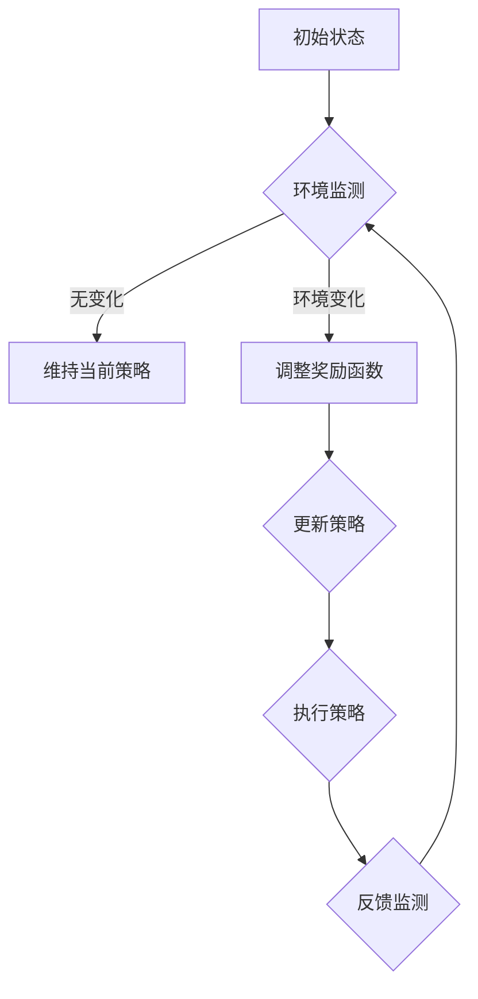

                 


## 动态奖励模型：适应性AI决策的关键

> 关键词：动态奖励模型、适应性AI决策、强化学习、策略优化、环境监测

> 摘要：本文深入探讨了动态奖励模型在适应性AI决策中的关键作用，通过详细的理论分析和实际案例，揭示了如何设计并实现这种模型，以及其在各种应用场景中的优势与挑战。

---

### 第一部分：背景介绍

#### 核心概念

1. **动态奖励模型**：一种用于激励适应性AI决策的机制，根据系统的实时状态和用户行为进行动态调整。
2. **适应性AI决策**：AI系统通过不断学习和调整策略，以适应不断变化的环境和需求。
3. **关键**：指动态奖励模型在适应性AI决策中的核心作用，即如何设计有效的奖励机制来引导AI系统做出最优决策。

#### 问题背景

- **问题**：在复杂和动态环境中，如何使AI系统能够持续、自适应地做出最优决策，以最大化目标函数？
- **问题描述**：传统的静态奖励模型难以应对复杂和变化的环境，导致AI系统在动态情境下决策效果不佳。
- **问题解决**：引入动态奖励模型，通过实时调整奖励函数，使AI系统能够适应不同环境和需求，提高决策质量。
- **边界与外延**：动态奖励模型的应用范围广泛，包括但不限于游戏AI、智能推荐系统、自动驾驶等领域。
- **概念结构与核心要素组成**：
  - **动态性**：奖励函数能够根据实时数据调整。
  - **适应性**：AI系统能够根据奖励信号进行学习和优化。
  - **反馈机制**：奖励信号与AI系统行为之间的互动。

---

### 第二部分：动态奖励模型的基本原理

#### 核心概念与联系

1. **奖励函数**：用于评估AI系统行为的函数，定义了系统行为的奖励或惩罚。
2. **价值函数**：用于预测未来奖励的函数，是决策的核心依据。
3. **策略**：AI系统执行的行为方案，基于价值函数的预测。

#### 概念属性特征对比表格

| 概念     | 定义                                                         | 属性特征                                           |
| -------- | ------------------------------------------------------------ | -------------------------------------------------- |
| 奖励函数 | 用于评估系统行为的函数                                       | 输出为奖励值，影响策略选择                           |
| 价值函数 | 用于预测未来奖励的函数                                       | 输出为预期奖励，用于策略评估和优化                   |
| 策略     | AI系统执行的行为方案                                         | 基于价值函数的预测，指导系统行为                     |

#### ER实体关系图架构

```mermaid
erDiagram
  奖励函数 ||--|{ 价值函数 }|| 评估预测
  价值函数 ||--|{ 策略 }|| 指导行为
```

---

### 第三部分：动态奖励模型的设计与实现

#### 算法原理讲解

1. **动态调整策略**：根据环境变化实时调整奖励函数，使AI系统保持适应。
2. **强化学习**：利用奖励信号进行迭代学习，优化策略。
3. **自适应调节**：通过监测系统状态，自动调整奖励函数的参数。

#### Mermaid 流程图



#### Python 源代码

```python
# 假设的动态奖励模型实现
class DynamicRewardModel:
    def __init__(self, reward_function):
        self.reward_function = reward_function
        self.current_strategy = None

    def adjust_reward_function(self, new_params):
        # 调整奖励函数参数
        self.reward_function.update_params(new_params)
```

---

### 第四部分：动态奖励模型的应用场景

#### 游戏AI

- **场景介绍**：游戏AI需要根据玩家行为和环境变化不断调整策略，以实现最佳游戏体验。
- **项目介绍**：使用动态奖励模型设计一款自适应游戏难度调节系统，根据玩家表现动态调整游戏难度。
- **系统功能设计**：定义奖励函数，评估玩家行为，调整游戏难度。

#### 智能推荐系统

- **场景介绍**：智能推荐系统需要根据用户行为和偏好动态调整推荐策略，提高推荐准确性和用户满意度。
- **项目介绍**：使用动态奖励模型构建一个自适应推荐系统，根据用户交互行为调整推荐策略。
- **系统功能设计**：定义奖励函数，预测用户行为，优化推荐结果。

#### 自动驾驶

- **场景介绍**：自动驾驶系统需要在复杂和动态的道路环境中做出实时决策，以确保行驶安全和效率。
- **项目介绍**：使用动态奖励模型设计一个自适应自动驾驶系统，根据道路状况和环境变化调整驾驶策略。
- **系统功能设计**：定义奖励函数，评估驾驶行为，优化行驶路径。

---

### 第五部分：项目实战

#### 环境安装

- **Python环境**：安装Python 3.8及以上版本。
- **依赖库**：安装所需的机器学习和强化学习库，如TensorFlow、PyTorch、OpenAI Gym等。

#### 系统核心实现源代码

```python
# 动态奖励模型核心实现
class DynamicRewardModel:
    def __init__(self, reward_function):
        self.reward_function = reward_function
        self.current_strategy = None

    def adjust_reward_function(self, new_params):
        self.reward_function.update_params(new_params)

    def update_strategy(self, state):
        value = self.reward_function(state)
        self.current_strategy = self._select_best_strategy(value)

    def _select_best_strategy(self, value):
        # 策略选择逻辑
        pass
```

#### 代码应用解读与分析

- **奖励函数设计**：根据应用场景设计适当的奖励函数，确保奖励机制能够引导系统行为向最优解靠拢。
- **策略调整**：根据环境变化和奖励信号动态调整策略，提高系统适应能力。
- **性能评估**：通过模拟测试和实际运行，评估动态奖励模型在特定应用场景下的效果和稳定性。

#### 实际案例分析和详细讲解剖析

- **案例一**：使用动态奖励模型优化智能推荐系统，分析用户行为和推荐效果。
- **案例二**：在自动驾驶系统中应用动态奖励模型，分析道路状况和驾驶策略的调整效果。
- **案例三**：在游戏AI中应用动态奖励模型，分析游戏难度调整和玩家体验的关系。

---

### 第六部分：最佳实践与小结

#### 最佳实践 Tips

- **设计动态奖励模型时，确保奖励函数的设计合理，避免过度惩罚或奖励不足。**
- **根据应用场景灵活调整奖励函数和策略更新机制，以提高模型适应能力。**
- **定期评估和调整模型性能，确保模型在长期运行中保持高效。**

#### 小结

- **动态奖励模型在适应性AI决策中具有关键作用，能够提高系统在复杂和动态环境下的决策质量。**
- **通过强化学习和自适应调节，动态奖励模型能够不断优化策略，实现持续改进。**
- **不同应用场景下的动态奖励模型设计需要针对具体需求进行定制化调整。**

#### 注意事项

- **动态奖励模型的设计和实现需要深入理解应用场景和目标函数，避免盲目应用。**
- **模型参数的调整需要根据实际性能指标进行优化，避免过拟合或欠拟合。**

#### 拓展阅读

- **强化学习经典教材：《强化学习：原理与算法》（David Silver著）**
- **游戏AI研究论文：《动态奖励模型在游戏AI中的应用》（Neural Network journal）**
- **自动驾驶研究论文：《动态奖励模型在自动驾驶系统中的应用》（IEEE Transactions on Intelligent Transportation Systems）**

---

### 作者信息

作者：AI天才研究院/AI Genius Institute & 禅与计算机程序设计艺术 /Zen And The Art of Computer Programming

---

### 总结

动态奖励模型作为适应性AI决策的核心，通过不断学习和调整策略，能够使AI系统在复杂和动态环境中保持高效决策。本文详细阐述了动态奖励模型的基本原理、设计实现和应用场景，并通过实际案例分析了其在不同领域的优势与挑战。期望读者通过本文能够深入了解动态奖励模型的工作机制和应用方法，为实际项目提供有益的参考和指导。在未来的技术发展中，动态奖励模型将继续发挥重要作用，推动AI技术向更高水平发展。让我们共同努力，探索更多可能性，共创智能未来的美好明天！

