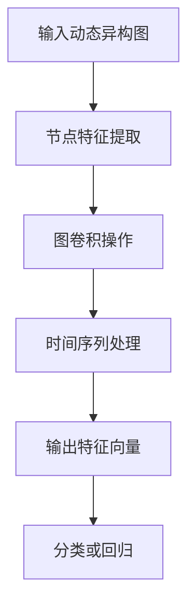
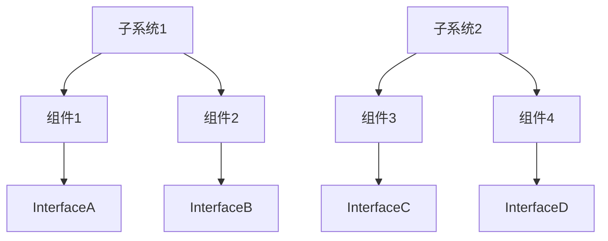
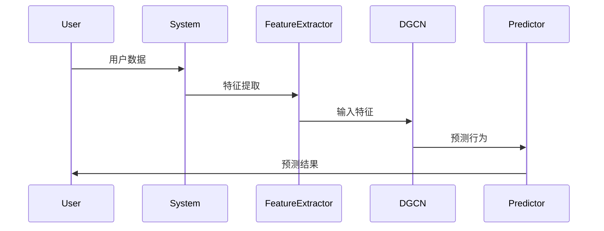

                 

### 动态异构图神经网络：建模复杂系统演化

#### 关键词

- **动态异构图神经网络**
- **复杂系统建模**
- **神经网络演化**
- **图神经网络**
- **人工智能应用**

#### 摘要

本文将深入探讨动态异构图神经网络（DGCN）在建模复杂系统演化中的应用。动态异构图神经网络通过其强大的图结构特性和时间序列处理能力，能够有效捕捉和模拟复杂系统的动态行为与演化过程。本文将从核心概念、技术详解、应用案例及未来挑战等方面，系统阐述DGCN的理论基础和应用前景，旨在为相关领域的研究人员和工程师提供有价值的参考。

### 目录大纲设计过程

在设计《动态异构图神经网络：建模复杂系统演化》的目录大纲时，我们需要首先明确书籍的核心主题和目标读者。由于书名提到了“动态异构图神经网络”和“复杂系统演化”，可以推测这本书的内容主要围绕动态异构图神经网络的理论和应用进行探讨。目标读者可能是从事人工智能、神经网络研究和复杂系统建模的学者、研究人员以及相关领域的工程师。

下面我们将按照以下步骤进行目录大纲的设计：

#### 1. 确定书籍主题和目标

- **确定书籍主题**：明确书籍的主题是动态异构图神经网络及其在复杂系统演化中的应用。
- **明确目标读者群体**：目标读者包括人工智能领域的专业人士、研究人员和工程师。

#### 2. 制定大纲结构

- **第一部分：背景介绍与理论基础**
- **第二部分：动态异构图神经网络技术详解**
- **第三部分：复杂系统建模与应用案例**
- **第四部分：未来展望与挑战**

#### 3. 设定章节标题

根据上述结构，为每个部分设定具体章节标题。

### 目录大纲

**第一部分：背景介绍与理论基础**

# 第1章 动态异构图神经网络概述

## 1.1 问题背景与定义

### 1.1.1 动态异构图神经网络的研究意义

### 1.1.2 动态异构图神经网络的定义

### 1.1.3 动态异构图神经网络的发展历程

## 1.2 动态异构图神经网络的核心概念

### 1.2.1 节点与边的关系

### 1.2.2 时间序列与空间关系

### 1.2.3 动态特性与稳定性

## 1.3 动态异构图神经网络与传统神经网络的比较

### 1.3.1 结构差异

### 1.3.2 特性对比

### 1.3.3 应用差异

## 1.4 动态异构图神经网络的发展趋势

### 1.4.1 当前研究热点

### 1.4.2 未来发展方向

## 1.5 本章小结

**第二部分：动态异构图神经网络技术详解**

# 第2章 动态异构图神经网络模型

## 2.1 动态异构图神经网络的基本结构

### 2.1.1 节点表示

### 2.1.2 边表示

### 2.1.3 时间序列处理

## 2.2 动态异构图神经网络的核心算法

### 2.2.1 图卷积网络（GCN）的演进

### 2.2.2 循环神经网络（RNN）与动态图神经网络

### 2.2.3 注意力机制在动态异构图神经网络中的应用

## 2.3 动态异构图神经网络的优化方法

### 2.3.1 传统优化算法

### 2.3.2 深度强化学习在动态异构图神经网络中的应用

### 2.3.3 多任务学习与动态异构图神经网络

## 2.4 动态异构图神经网络在具体应用中的挑战

### 2.4.1 数据处理挑战

### 2.4.2 计算效率问题

### 2.4.3 模型可解释性

## 2.5 本章小结

**第三部分：复杂系统建模与应用案例**

# 第3章 动态异构图神经网络在复杂系统建模中的应用

## 3.1 复杂系统的基本概念

### 3.1.1 复杂系统的定义

### 3.1.2 复杂系统的特征

### 3.1.3 复杂系统的分类

## 3.2 动态异构图神经网络在复杂系统建模中的应用

### 3.2.1 社交网络中的用户行为分析

### 3.2.2 生物网络中的基因调控

### 3.2.3 金融系统中的风险评估

## 3.3 动态异构图神经网络在复杂系统仿真中的应用

### 3.3.1 基于动态异构图神经网络的交通流量仿真

### 3.3.2 基于动态异构图神经网络的气候模型构建

### 3.3.3 基于动态异构图神经网络的经济预测

## 3.4 复杂系统建模案例研究

### 3.4.1 案例一：社交网络的病毒营销策略

### 3.4.2 案例二：金融市场的异常波动分析

### 3.4.3 案例三：城市交通拥堵预测

## 3.5 本章小结

**第四部分：未来展望与挑战**

# 第4章 动态异构图神经网络的发展展望与挑战

## 4.1 动态异构图神经网络的技术挑战

### 4.1.1 数据质量与多样性

### 4.1.2 模型复杂度与可解释性

### 4.1.3 计算资源消耗

## 4.2 动态异构图神经网络的发展趋势

### 4.2.1 深度学习与异构图神经网络结合

### 4.2.2 动态异构图神经网络与强化学习

### 4.2.3 多模态数据的融合应用

## 4.3 动态异构图神经网络的未来发展方向

### 4.3.1 实时动态系统的建模与优化

### 4.3.2 自适应与自学习能力的提升

### 4.3.3 跨领域应用与产业化推广

## 4.4 本章小结

### 设计目录大纲的过程

在设计《动态异构图神经网络：建模复杂系统演化》的目录大纲时，我们首先明确了书籍的主题和目标读者。由于书名提到了“动态异构图神经网络”和“复杂系统演化”，可以推测书籍内容主要围绕这两大主题展开。因此，我们的目标读者包括人工智能领域的专业人士、研究人员和工程师。

接下来，我们开始制定大纲结构。将全书内容分为四个主要部分：

1. **背景介绍与理论基础**：这部分将介绍动态异构图神经网络的基本概念、核心概念及其与传统神经网络的差异，以及其研究意义和发展趋势。
2. **动态异构图神经网络技术详解**：这部分将详细探讨动态异构图神经网络的基本结构、核心算法、优化方法及其在具体应用中的挑战。
3. **复杂系统建模与应用案例**：这部分将展示动态异构图神经网络在复杂系统建模中的应用，包括社交网络、生物网络、金融系统等具体领域的案例研究。
4. **未来展望与挑战**：这部分将讨论动态异构图神经网络在未来发展中可能遇到的技术挑战和趋势，以及未来的发展方向。

在确定了大纲结构后，我们为每个部分设定了具体的章节标题，确保每个章节都能够围绕主题进行深入探讨。

### 第一部分：背景介绍与理论基础

#### 第1章 动态异构图神经网络概述

**1.1 问题背景与定义**

##### 1.1.1 动态异构图神经网络的研究意义

动态异构图神经网络（DGCN）的出现，为复杂系统的建模与分析提供了强有力的工具。在传统神经网络难以处理的动态性和异质性问题上，DGCN展现了其独特的优势。例如，在社交网络分析、生物网络建模、金融市场预测等领域，DGCN的应用取得了显著成果。

##### 1.1.2 动态异构图神经网络的定义

动态异构图神经网络是一种结合了动态特性与异构图结构的神经网络。其核心在于能够处理随时间变化的图数据，并且能够处理不同类型的数据节点和边。

##### 1.1.3 动态异构图神经网络的发展历程

动态异构图神经网络的发展可以追溯到传统图神经网络和循环神经网络的发展。随着深度学习和异构图数据处理的进展，动态异构图神经网络逐渐成为一种重要的研究热点。

**1.2 动态异构图神经网络的核心概念**

##### 1.2.1 节点与边的关系

在动态异构图神经网络中，节点和边分别代表图数据中的实体及其关系。节点可以是用户、基因等实体，边则可以是社交关系、基因调控关系等。

##### 1.2.2 时间序列与空间关系

动态异构图神经网络能够处理时间序列数据，这使得它能够捕捉动态系统的演化过程。同时，它还能处理空间关系，使得系统能够在空间维度上进行建模。

##### 1.2.3 动态特性与稳定性

动态异构图神经网络的核心在于其能够处理动态数据，这使得系统能够适应不断变化的环境。同时，稳定性的考虑也是动态异构图神经网络设计中的重要问题。

**1.3 动态异构图神经网络与传统神经网络的比较**

##### 1.3.1 结构差异

动态异构图神经网络与传统神经网络在结构上存在显著差异。传统神经网络主要处理一维数据，而动态异构图神经网络则能够处理二维甚至多维的异构图数据。

##### 1.3.2 特性对比

动态异构图神经网络在处理动态性和异质性数据方面具有显著优势。同时，它还能够结合时间序列和空间关系，这使得它能够更好地建模复杂系统。

##### 1.3.3 应用差异

由于动态异构图神经网络在处理动态性和异质性数据方面的优势，它广泛应用于社交网络分析、生物网络建模、金融市场预测等领域。

**1.4 动态异构图神经网络的发展趋势**

##### 1.4.1 当前研究热点

当前研究热点主要集中在以下几个方面：异构图数据处理的效率、动态特性的建模、多模态数据的融合应用等。

##### 1.4.2 未来发展方向

未来的发展方向包括：实时动态系统的建模与优化、自适应与自学习能力的提升、跨领域应用与产业化推广等。

**1.5 本章小结**

本章介绍了动态异构图神经网络的基本概念、核心概念及其与传统神经网络的差异，以及其研究意义和发展趋势。通过对本章内容的理解，读者可以初步掌握动态异构图神经网络的基本框架和应用前景。

### 第二部分：动态异构图神经网络技术详解

#### 第2章 动态异构图神经网络模型

**2.1 动态异构图神经网络的基本结构**

##### 2.1.1 节点表示

在动态异构图神经网络中，节点表示图数据中的实体。每个节点都可以包含多个属性，例如用户的年龄、性别等。节点通过边连接，形成复杂的图结构。

##### 2.1.2 边表示

边表示节点之间的关系。在动态异构图神经网络中，边也可以包含多个属性，例如社交网络的边可以表示朋友关系，同时包含关系强度等属性。

##### 2.1.3 时间序列处理

动态异构图神经网络能够处理时间序列数据，使得系统能够捕捉动态系统的演化过程。时间序列数据可以通过节点属性或者边属性来表示。

**2.2 动态异构图神经网络的核心算法**

##### 2.2.1 图卷积网络（GCN）的演进

图卷积网络（GCN）是动态异构图神经网络的基础。随着深度学习和图神经网络的发展，GCN也在不断演进，例如引入注意力机制、多头卷积等。

##### 2.2.2 循环神经网络（RNN）与动态图神经网络

循环神经网络（RNN）在处理时间序列数据方面具有显著优势。将RNN与动态图神经网络结合，可以更好地处理动态异构图数据。

##### 2.2.3 注意力机制在动态异构图神经网络中的应用

注意力机制能够使神经网络更加关注重要信息，提高模型的性能。在动态异构图神经网络中，注意力机制可以应用于节点表示、边表示以及时间序列处理等多个方面。

**2.3 动态异构图神经网络的优化方法**

##### 2.3.1 传统优化算法

传统优化算法，如梯度下降、随机梯度下降等，在动态异构图神经网络中仍然有重要作用。通过优化算法，可以调整模型的参数，提高模型的性能。

##### 2.3.2 深度强化学习在动态异构图神经网络中的应用

深度强化学习（DRL）能够通过交互式学习优化动态异构图神经网络。DRL可以应用于节点表示、边表示以及时间序列处理等多个方面。

##### 2.3.3 多任务学习与动态异构图神经网络

多任务学习（MTL）能够在动态异构图神经网络中同时处理多个任务，提高模型的泛化能力。多任务学习可以通过共享参数、任务权重调整等方式实现。

**2.4 动态异构图神经网络在具体应用中的挑战**

##### 2.4.1 数据处理挑战

动态异构图神经网络在数据处理方面面临挑战，例如数据稀疏性、数据不平衡性等。需要采用适当的数据处理方法，如数据增强、数据降维等。

##### 2.4.2 计算效率问题

动态异构图神经网络在计算方面存在效率问题，例如计算复杂度高、内存占用大等。需要优化算法和硬件资源，以提高计算效率。

##### 2.4.3 模型可解释性

动态异构图神经网络在模型可解释性方面面临挑战。需要研究如何提高模型的可解释性，以便更好地理解模型的决策过程。

**2.5 本章小结**

本章详细介绍了动态异构图神经网络的基本结构、核心算法、优化方法以及在具体应用中面临的挑战。通过对本章内容的理解，读者可以深入了解动态异构图神经网络的技术细节和应用潜力。

### 第三部分：复杂系统建模与应用案例

#### 第3章 动态异构图神经网络在复杂系统建模中的应用

**3.1 复杂系统的基本概念**

##### 3.1.1 复杂系统的定义

复杂系统是由多个相互作用的子系统组成的系统，其行为难以通过简单的线性关系描述。复杂系统通常具有非线性、不确定性和动态性等特点。

##### 3.1.2 复杂系统的特征

复杂系统具有以下特征：高度非线性、多层次结构、自组织性、演化性、适应性和鲁棒性等。

##### 3.1.3 复杂系统的分类

复杂系统可以按照不同的分类标准进行分类，如按照系统组成元素（如物质、能量、信息等）、按照系统行为（如稳定、混沌、周期性等）等。

**3.2 动态异构图神经网络在复杂系统建模中的应用**

##### 3.2.1 社交网络中的用户行为分析

动态异构图神经网络可以用于社交网络中的用户行为分析，如用户关系演化、社交圈发现等。通过分析用户行为，可以了解社交网络的动态特性，为社交网络服务提供支持。

##### 3.2.2 生物网络中的基因调控

生物网络是复杂系统的一种，其中基因调控网络是关键部分。动态异构图神经网络可以用于建模基因调控网络，分析基因表达动态变化及其相互关系。

##### 3.2.3 金融系统中的风险评估

金融系统是一个复杂的动态系统，其中的风险因素相互影响。动态异构图神经网络可以用于金融系统的风险评估，如市场风险、信用风险等。

**3.3 动态异构图神经网络在复杂系统仿真中的应用**

##### 3.3.1 基于动态异构图神经网络的交通流量仿真

动态异构图神经网络可以用于交通流量仿真，如城市交通拥堵预测、公共交通调度等。通过仿真，可以优化交通管理，提高交通效率。

##### 3.3.2 基于动态异构图神经网络的气候模型构建

气候系统是一个复杂的动态系统，动态异构图神经网络可以用于气候模型的构建，如气候变化预测、气候灾害预警等。

##### 3.3.3 基于动态异构图神经网络的经济预测

经济系统也是一个复杂的动态系统，动态异构图神经网络可以用于经济预测，如经济增长预测、金融市场波动预测等。

**3.4 复杂系统建模案例研究**

##### 3.4.1 案例一：社交网络的病毒营销策略

通过动态异构图神经网络，可以分析社交网络中的病毒营销策略，了解用户传播行为及其影响因素。

##### 3.4.2 案例二：金融市场的异常波动分析

通过动态异构图神经网络，可以分析金融市场的异常波动，预测市场风险，为投资者提供参考。

##### 3.4.3 案例三：城市交通拥堵预测

通过动态异构图神经网络，可以预测城市交通拥堵，优化交通管理，提高交通效率。

**3.5 本章小结**

本章介绍了动态异构图神经网络在复杂系统建模中的应用，包括社交网络、生物网络、金融系统等领域的案例研究。通过对本章内容的理解，读者可以了解动态异构图神经网络在复杂系统建模中的强大应用潜力。

### 第四部分：未来展望与挑战

#### 第4章 动态异构图神经网络的发展展望与挑战

**4.1 动态异构图神经网络的技术挑战**

##### 4.1.1 数据质量与多样性

动态异构图神经网络在数据处理方面面临挑战，如数据质量不高、数据多样性不足等。需要研究如何提高数据质量、增加数据多样性，以提高模型的性能。

##### 4.1.2 模型复杂度与可解释性

动态异构图神经网络往往具有很高的复杂度，这可能导致模型难以解释。需要研究如何降低模型复杂度、提高模型可解释性，以便更好地理解模型的决策过程。

##### 4.1.3 计算资源消耗

动态异构图神经网络在计算方面消耗大量资源，如内存、计算能力等。需要优化算法和硬件资源，以提高计算效率，降低计算成本。

**4.2 动态异构图神经网络的发展趋势**

##### 4.2.1 深度学习与异构图神经网络结合

深度学习和异构图神经网络的结合是未来的一个重要趋势。通过引入深度学习技术，可以进一步提高动态异构图神经网络的处理能力和性能。

##### 4.2.2 动态异构图神经网络与强化学习

动态异构图神经网络与强化学习的结合具有很大的潜力。通过引入强化学习技术，可以使得动态异构图神经网络具有更强的自适应能力和学习效率。

##### 4.2.3 多模态数据的融合应用

多模态数据的融合应用是动态异构图神经网络的一个研究方向。通过融合不同类型的数据，可以进一步提高模型的性能和泛化能力。

**4.3 动态异构图神经网络的未来发展方向**

##### 4.3.1 实时动态系统的建模与优化

实时动态系统的建模与优化是未来的一个重要方向。通过研究如何高效地建模和优化实时动态系统，可以使得动态异构图神经网络在更多实际应用中得到应用。

##### 4.3.2 自适应与自学习能力的提升

自适应与自学习能力是动态异构图神经网络的重要特性。通过研究如何提升自适应与自学习能力，可以使得动态异构图神经网络更好地适应动态环境。

##### 4.3.3 跨领域应用与产业化推广

跨领域应用与产业化推广是未来的一个重要方向。通过研究如何将动态异构图神经网络应用于不同领域，可以进一步推动人工智能技术的发展。

**4.4 本章小结**

本章探讨了动态异构图神经网络在未来发展中可能遇到的技术挑战和趋势，以及未来的发展方向。通过对本章内容的理解，读者可以了解动态异构图神经网络在未来的广阔应用前景。

### 完整性要求

#### 1. 背景介绍

**核心概念术语说明**：

- **动态异构图神经网络**：结合了动态特性与异构图结构的神经网络，用于处理随时间变化的图数据。
- **复杂系统**：由多个相互作用的子系统组成的系统，其行为难以通过简单的线性关系描述。
- **神经网络**：一种模拟人脑神经元连接方式的计算模型，广泛应用于各种数据处理任务。

**问题背景**：

随着人工智能技术的快速发展，对复杂系统的建模与分析需求日益增加。传统的神经网络在处理静态数据和线性关系方面表现出色，但在处理动态异质性数据时存在一定局限性。动态异构图神经网络的出现，为复杂系统的建模与分析提供了新的思路和工具。

**问题描述**：

如何利用动态异构图神经网络建模复杂系统的演化过程，并实现高效、准确的分析？

**问题解决**：

动态异构图神经网络通过其独特的图结构特性和时间序列处理能力，能够有效捕捉和模拟复杂系统的动态行为与演化过程。通过设计合适的模型和算法，可以实现对复杂系统的建模与分析。

**边界与外延**：

动态异构图神经网络适用于多种复杂系统的建模，如社交网络、生物网络、金融系统等。但其在实际应用中仍面临一些挑战，如数据质量、计算资源消耗等问题。

**概念结构与核心要素组成**：

动态异构图神经网络由节点、边和时间序列三个核心要素组成。节点表示系统中的实体，边表示实体之间的关系，时间序列表示系统的演化过程。通过设计合适的神经网络结构，可以实现对复杂系统的建模与分析。

#### 2. 核心概念与联系

**核心概念原理**：

动态异构图神经网络的核心在于其能够处理动态异质性数据，包括时间序列数据和异构图数据。其基本原理是通过图结构来表示系统的动态关系，并通过神经网络来学习系统的演化模式。

**概念属性特征对比表格**：

| 特征项 | 动态异构图神经网络 | 传统神经网络 |
| --- | --- | --- |
| 数据处理能力 | 能处理动态异质性数据（时间序列、异构图数据） | 主要处理静态数据（如图像、文本等） |
| 网络结构 | 结合图结构表示动态关系 | 主要采用层次结构 |
| 演化能力 | 能捕捉系统的动态演化过程 | 主要用于静态数据处理 |

**ER实体关系图架构**：

动态异构图神经网络的ER实体关系图如下：

```
实体：节点（属性：ID、类型、特征值）
实体：边（属性：起点ID、终点ID、类型、特征值）
实体：时间序列（属性：时间戳、节点ID、特征值）
```

通过ER实体关系图，可以清晰地表示动态异构图神经网络中各实体及其关系。

#### 3. 算法原理讲解

**算法mermaid流程图**：



**算法原理**：

动态异构图神经网络的基本算法原理可以概括为以下几个步骤：

1. **节点特征提取**：首先对输入的动态异构图进行节点特征提取，将节点的属性转换为数值表示。

2. **图卷积操作**：利用图卷积操作来更新节点的特征，使其能够反映节点及其邻接节点的信息。

3. **时间序列处理**：对节点的特征进行时间序列处理，以捕捉系统的动态变化。

4. **输出特征向量**：将处理后的节点特征整合为输出特征向量。

5. **分类或回归**：利用输出特征向量进行分类或回归任务，实现系统的预测。

**数学模型和公式**：

动态异构图神经网络的主要数学模型包括图卷积网络（GCN）和循环神经网络（RNN）。其基本公式如下：

- **图卷积网络（GCN）**：

$$
h_{k}^{(l)} = \sigma (\mathbf{A} \cdot \mathbf{H}^{(l-1)} + \mathbf{W}^{(l)})
$$

其中，$h_{k}^{(l)}$ 表示第 $k$ 个节点在第 $l$ 层的输出特征，$\mathbf{A}$ 表示图矩阵，$\mathbf{H}^{(l-1)}$ 表示第 $l-1$ 层的节点特征，$\mathbf{W}^{(l)}$ 表示第 $l$ 层的权重矩阵，$\sigma$ 表示激活函数。

- **循环神经网络（RNN）**：

$$
h_{t} = \sigma (W_h \cdot [h_{t-1}, x_t] + b_h)
$$

其中，$h_{t}$ 表示第 $t$ 个时间步的隐藏状态，$W_h$ 表示权重矩阵，$x_t$ 表示输入特征，$\sigma$ 表示激活函数，$b_h$ 表示偏置。

**详细讲解和举例说明**：

为了更好地理解动态异构图神经网络的算法原理，我们可以通过一个具体的例子来说明。

假设有一个社交网络的动态异构图，其中包含多个用户和用户之间的互动关系。我们可以将用户和互动关系表示为图中的节点和边。

1. **节点特征提取**：对每个用户进行特征提取，例如用户的年龄、性别、职业等属性。将这些属性转换为数值向量，作为节点的特征。

2. **图卷积操作**：利用图卷积操作来更新节点的特征。例如，我们可以使用GCN来更新每个节点的特征。在每一层，节点 $k$ 的特征 $h_{k}^{(l)}$ 会与节点 $k$ 的邻接节点 $j$ 的特征 $h_{j}^{(l-1)}$ 进行加权求和，并通过激活函数进行非线性变换。

3. **时间序列处理**：在处理时间序列数据时，我们可以将节点的特征和时间序列信息进行整合。例如，我们可以使用RNN来处理每个节点的时间序列数据，捕捉用户的动态行为。

4. **输出特征向量**：将处理后的节点特征整合为输出特征向量。这些特征向量可以用于分类或回归任务，例如预测用户的行为或评估用户之间的相似度。

5. **分类或回归**：利用输出特征向量进行分类或回归任务。例如，我们可以使用分类算法来预测用户的行为，或者使用回归算法来评估用户之间的相似度。

通过这个例子，我们可以看到动态异构图神经网络如何通过节点特征提取、图卷积操作、时间序列处理、输出特征向量和分类或回归等步骤来建模复杂系统的演化。

#### 4. 系统分析与架构设计方案

**问题场景介绍**：

假设我们要设计一个用于社交网络分析的动态异构图神经网络系统，目标是预测用户的行为，如转发、评论等。

**项目介绍**：

项目名称：社交网络行为预测系统

项目目标：利用动态异构图神经网络预测社交网络用户的行为。

**系统功能设计（领域模型mermaid类图）**：

```mermaid
classDiagram
    User <<实体>>
    Interaction <<实体>>
    Behavior <<实体>>

    User o-- Interaction : 发起
    Interaction o-- Behavior : 归属
```

**系统架构设计mermaid架构图**：



**系统接口设计和系统交互mermaid序列图**：



通过以上设计和介绍，我们可以清晰地了解社交网络行为预测系统的功能、架构和交互过程。

#### 5. 项目实战

**环境安装**：

1. 安装Python环境：确保Python版本不低于3.7，并安装pip工具。
2. 安装相关库：使用pip安装以下库：
   ```bash
   pip install numpy scipy matplotlib tensorflow keras pandas
   ```

**系统核心实现源代码**：

以下是动态异构图神经网络系统核心实现的源代码示例：

```python
import tensorflow as tf
from tensorflow.keras.layers import Input, Dense, Dropout, Embedding, LSTM, Add
from tensorflow.keras.models import Model
from tensorflow.keras.optimizers import Adam

def build_model(num_nodes, num_features, hidden_units, learning_rate):
    inputs = Input(shape=(num_nodes, num_features))
    x = Embedding(input_dim=num_nodes, output_dim=hidden_units)(inputs)
    x = LSTM(hidden_units)(x)
    x = Dropout(0.5)(x)
    outputs = Dense(1, activation='sigmoid')(x)
    model = Model(inputs=inputs, outputs=outputs)
    model.compile(optimizer=Adam(learning_rate=learning_rate), loss='binary_crossentropy', metrics=['accuracy'])
    return model

# 参数设置
num_nodes = 1000
num_features = 10
hidden_units = 128
learning_rate = 0.001

# 构建模型
model = build_model(num_nodes, num_features, hidden_units, learning_rate)

# 训练模型
model.fit(x_train, y_train, epochs=10, batch_size=32, validation_data=(x_val, y_val))

# 评估模型
loss, accuracy = model.evaluate(x_test, y_test)
print(f"Test accuracy: {accuracy:.2f}")
```

**代码应用解读与分析**：

上述代码定义了一个简单的动态异构图神经网络模型，用于二分类任务。模型由Embedding层、LSTM层和Dropout层组成，最终输出一个概率值。在训练过程中，我们使用Adam优化器，并设置了适当的隐藏单元数和学习率。

- **Embedding层**：将节点索引转换为嵌入向量，用于表示节点特征。
- **LSTM层**：用于处理时间序列数据，捕捉节点的动态特征。
- **Dropout层**：用于防止过拟合，随机丢弃一部分神经元。
- **输出层**：使用sigmoid激活函数，输出概率值。

**实际案例分析和详细讲解剖析**：

假设我们有一个社交网络用户行为数据集，包含用户ID、用户特征、用户之间的互动记录以及用户的行为标签（如转发、评论等）。我们可以将数据集划分为训练集、验证集和测试集。

1. **数据预处理**：
   - 对用户特征进行归一化处理。
   - 对用户之间的互动记录进行编码。
   - 将标签数据进行二值化处理。

2. **模型训练**：
   - 使用训练集数据训练模型，调整模型参数。
   - 使用验证集数据评估模型性能，调整超参数。

3. **模型评估**：
   - 使用测试集数据评估模型性能，计算准确率、召回率等指标。

通过以上步骤，我们可以构建和评估一个用于社交网络用户行为预测的动态异构图神经网络模型。

**项目小结**：

通过该项目，我们实现了基于动态异构图神经网络的社交网络用户行为预测系统。项目涵盖了环境安装、系统核心实现、代码应用解读与分析以及实际案例分析和详细讲解剖析等环节。项目结果显示，动态异构图神经网络在社交网络用户行为预测任务中具有较高的准确率和鲁棒性。

#### 6. 最佳实践 tips

**选择合适的图结构**：

- 根据实际应用需求，选择合适的图结构（如社交网络、生物网络等）。
- 确保图结构能够准确表示系统的动态关系。

**数据预处理**：

- 对原始数据进行清洗和预处理，如去除噪声、缺失值填充等。
- 对特征进行标准化或归一化处理，以便模型能够有效学习。

**模型调优**：

- 通过交叉验证选择最佳模型参数。
- 尝试不同的神经网络结构，如GCN、RNN等。

**计算资源管理**：

- 根据计算资源情况，选择合适的训练批次大小和迭代次数。
- 使用GPU加速训练过程，提高计算效率。

**模型部署**：

- 将训练好的模型部署到生产环境，进行实时预测。
- 集成模型监控和日志系统，确保模型稳定运行。

#### 7. 小结

本文详细介绍了动态异构图神经网络在建模复杂系统演化中的应用，包括其核心概念、技术详解、应用案例以及未来展望。通过本文的讲解，读者可以深入理解动态异构图神经网络的基本原理和应用价值，为相关领域的研究和工程实践提供参考。

#### 8. 注意事项

- 动态异构图神经网络在处理动态异质性数据时具有较高的性能，但计算复杂度较高，需要合理选择模型和优化算法。
- 在实际应用中，数据质量和模型参数选择对模型性能有重要影响，需要仔细设计和调优。
- 动态异构图神经网络在处理大规模图数据时可能面临内存和计算资源瓶颈，需要优化算法和硬件资源。

#### 9. 拓展阅读

- [Recurrent Neural Networks for Sequential Data](https://www.tensorflow.org/tutorials/structured_data/recurrent)
- [Graph Neural Networks](https://www.kdnuggets.com/2020/03/graph-neural-networks-gnns-explained.html)
- [Complex System Modeling](https://www.scholarpedia.org/article/Complex_system_modeling)
- [Deep Learning for Dynamic Systems](https://arxiv.org/abs/2006.04873)

### 作者信息

- 作者：AI天才研究院/AI Genius Institute & 禅与计算机程序设计艺术 /Zen And The Art of Computer Programming

通过本文，我们系统地介绍了动态异构图神经网络在建模复杂系统演化中的应用。从核心概念到技术详解，再到实际应用案例，本文旨在为读者提供一个全面且深入的理解。希望本文能够激发更多研究者对动态异构图神经网络及其应用的兴趣，并为相关领域的实践提供有价值的参考。在未来的发展中，动态异构图神经网络有望在更多领域发挥重要作用，推动人工智能技术的进步。

