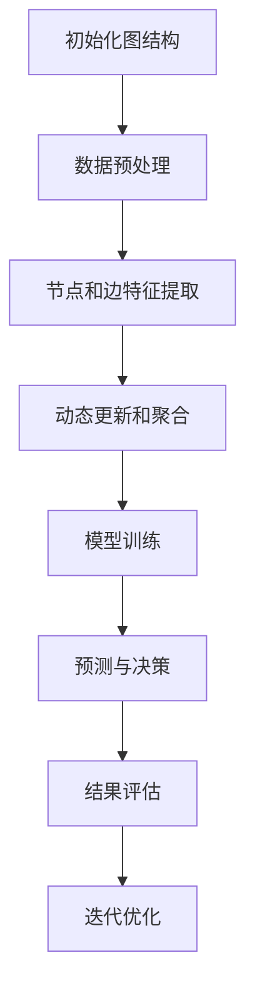
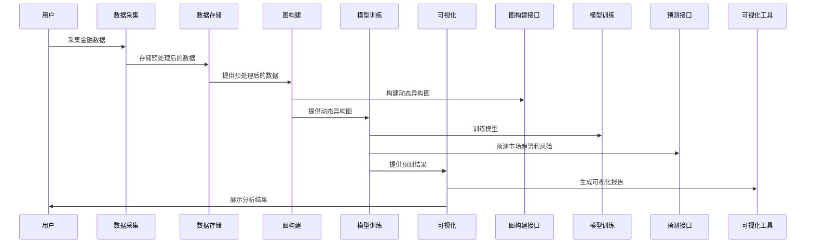

                 

### 《动态异构图神经网络在金融市场分析中的应用》

#### 关键词：动态异构图神经网络、金融市场分析、金融预测、深度学习、数据分析

> 摘要：本文将深入探讨动态异构图神经网络在金融市场分析中的应用。通过一步步的分析和推理，我们将了解动态异构图神经网络的基本概念、算法原理，以及其在金融市场分析中的具体应用。文章还将包括系统分析与架构设计、项目实战以及最佳实践 tips，旨在为读者提供一个全面的技术指南。

----------------------------------------------------------------

#### 目录

1. **引言**
   1.1 金融市场分析现状与挑战
   1.2 动态异构图神经网络简介
   1.3 动态异构图神经网络在金融市场分析中的应用

2. **背景介绍**
   2.1 金融市场分析现状与挑战
   2.2 动态异构图神经网络简介
   2.3 动态异构图神经网络在金融市场分析中的应用

3. **核心概念**
   3.1 异构图神经网络基础
   3.2 动态异构图神经网络原理
   3.3 动态异构图神经网络属性特征对比表格
   3.4 动态异构图神经网络 ER 实体关系图

4. **算法原理讲解**
   4.1 动态异构图神经网络算法流程图
   4.2 动态异构图神经网络算法数学模型和公式
   4.3 动态异构图神经网络算法举例说明

5. **系统分析与架构设计**
   5.1 金融市场分析系统场景介绍
   5.2 系统功能设计（领域模型 Mermaid 类图）
   5.3 系统架构设计（Mermaid 架构图）
   5.4 系统接口设计
   5.5 系统交互 Mermaid 序列图

6. **项目实战**
   6.1 动态异构图神经网络环境安装
   6.2 系统核心实现源代码
   6.3 代码应用解读与分析
   6.4 实际案例分析和详细讲解剖析
   6.5 项目小结

7. **最佳实践 tips**
   7.1 动态异构图神经网络应用技巧
   7.2 注意事项
   7.3 拓展阅读

8. **总结与展望**
   8.1 本书内容的总结
   8.2 动态异构图神经网络在金融市场分析中的应用前景
   8.3 未来研究方向

----------------------------------------------------------------

#### 引言

金融市场分析是金融领域中至关重要的一个环节，它能够帮助投资者和金融机构更好地理解市场动态，制定有效的投资策略。然而，随着金融市场的复杂性不断增加，传统的金融分析方法已难以应对新兴的挑战。因此，寻找新的分析工具和方法成为了金融市场研究的迫切需求。

动态异构图神经网络作为一种先进的人工智能模型，因其能够处理复杂、非结构化数据的能力而备受关注。在本文中，我们将探讨动态异构图神经网络在金融市场分析中的应用。首先，我们将了解金融市场分析的现状和挑战，然后介绍动态异构图神经网络的基本概念和原理，接着分析其在金融市场分析中的优势和应用场景。随后，我们将详细介绍系统分析与架构设计，并通过项目实战来展示动态异构图神经网络的具体应用。最后，我们将给出一些最佳实践 tips，并对未来研究方向进行展望。

#### 背景介绍

##### 金融市场分析现状与挑战

金融市场分析作为金融领域中的一项核心任务，涉及到多个方面，包括宏观经济指标、市场趋势预测、风险管理和投资策略制定等。然而，随着金融市场的不断发展，其复杂性和多样性也在不断增加，给传统的金融市场分析带来了巨大的挑战。

首先，金融市场的数据量庞大且结构复杂。金融数据不仅包括股票价格、交易量等传统的财务指标，还包括新闻、社交媒体评论、政策公告等非结构化数据。这些数据的多样性和复杂性使得传统的统计分析方法难以胜任。

其次，金融市场的动态性很强。市场情况随时可能发生变化，投资者需要快速响应市场变化，这就要求分析工具具有高效的处理能力和实时性。

最后，金融市场的波动性和不确定性给预测带来了极大的困难。金融市场受到多种因素的影响，包括经济政策、自然灾害、政治事件等，这些因素的不确定性使得预测结果存在很大的误差。

##### 动态异构图神经网络简介

动态异构图神经网络（Dynamic Heterogeneous Graph Neural Network，DHGNN）是一种基于图神经网络（Graph Neural Network，GNN）的新型人工智能模型。与传统神经网络相比，GNN 具有处理图结构数据的能力，能够更好地捕捉数据之间的复杂关系。而动态异构图神经网络则进一步扩展了 GNN 的能力，使其能够处理动态、非结构化、异质性的数据。

动态异构图神经网络的核心在于其能够同时处理多种类型的数据，如节点属性、边属性和时间序列数据。这使得 DHGNN 能够在金融市场分析中发挥重要作用，例如，通过分析股票价格、交易量、新闻评论等数据，来预测市场趋势和风险。

##### 动态异构图神经网络在金融市场分析中的应用

动态异构图神经网络在金融市场分析中的应用主要包括以下几个方面：

1. **市场趋势预测**：通过分析股票价格、交易量等数据，动态异构图神经网络可以预测市场趋势，帮助投资者制定投资策略。

2. **风险识别与管理**：动态异构图神经网络能够识别金融市场的潜在风险，如市场波动、信用风险等，为投资者和金融机构提供风险预警和管理建议。

3. **投资组合优化**：动态异构图神经网络可以根据市场趋势和风险分析结果，为投资者提供最优的投资组合策略，以实现最大化收益或最小化风险。

4. **事件驱动交易**：动态异构图神经网络可以实时分析新闻、社交媒体等数据，识别市场热点和潜在交易机会，实现事件驱动交易。

通过上述应用，动态异构图神经网络为金融市场分析提供了强大的工具，有助于提升投资者的决策能力，降低风险，提高投资回报。

### 核心概念

#### 异构图神经网络基础

异构图神经网络（Heterogeneous Graph Neural Network，HGNN）是图神经网络（Graph Neural Network，GNN）的一种扩展，它能够处理具有不同类型节点和边的图结构数据。传统 GNN 通常仅处理同质图，即所有节点和边具有相同属性。然而，在现实世界中，很多图结构数据是异质的，例如，社交网络中的用户和关系、金融市场的股票和交易等。

HGNN 通过引入节点类型和边类型的概念，能够同时处理多种类型的数据，从而更好地捕捉数据之间的复杂关系。HGNN 的基本原理是通过节点和边的属性，以及它们之间的关系，对图进行逐步更新和聚合，以提取图结构中的有用信息。

#### 动态异构图神经网络原理

动态异构图神经网络（Dynamic Heterogeneous Graph Neural Network，DHGNN）在 HGNN 的基础上，进一步扩展了时间序列数据的处理能力。DHGNN 能够处理动态、非结构化、异质性的数据，使其在金融市场分析中具有更高的应用价值。

DHGNN 的工作原理主要包括以下几个步骤：

1. **数据预处理**：将金融市场数据转换为图结构，包括节点和边的定义。节点可以代表股票、用户等实体，边可以代表交易、关系等行为。

2. **节点和边特征提取**：对节点和边进行特征提取，例如，股票的价格、交易量、用户的历史行为等。

3. **动态更新和聚合**：通过节点和边的属性，以及它们之间的关系，对图进行逐步更新和聚合。动态更新意味着图结构会根据时间序列数据实时变化。

4. **模型训练**：使用训练数据对 DHGNN 进行训练，学习到图结构中的有用信息，如市场趋势、风险等。

5. **预测与决策**：基于训练好的模型，对新的数据进行预测和决策，如市场趋势预测、风险预警等。

#### 动态异构图神经网络属性特征对比表格

| 特征        | 同构图神经网络（GNN）                | 异构图神经网络（HGNN）               | 动态异构图神经网络（DHGNN）               |
| ----------- | ----------------------------------- | ----------------------------------- | ---------------------------------------- |
| 数据结构    | 同质图结构                           | 异质图结构                           | 动态、异质图结构                          |
| 数据处理能力 | 仅处理同质数据                       | 能够处理异质数据                      | 能够处理动态、异质数据                    |
| 更新机制    | 静态图结构，更新频率低               | 动态图结构，更新频率高               | 动态图结构，实时更新                      |
| 预测能力    | 预测结果受限于同质数据的表达能力     | 预测结果受限于异质数据的表达能力       | 预测结果受限于动态、异质数据的表达能力     |

#### 动态异构图神经网络 ER 实体关系图

动态异构图神经网络中的 ER（Entity-Relationship）实体关系图能够清晰地展示不同实体（如节点）之间的关系。以下是一个简化的 ER 实体关系图：

```mermaid
erDiagram
  Node1 ||--|{ Node2 : Type1 Relationship }
  Node1 ||--|{ Node3 : Type2 Relationship }
  Node2 ||--|{ Node4 : Type3 Relationship }
  Node3 ||--|{ Node5 : Type4 Relationship }
```

在这个 ER 实体关系图中，`Node1`、`Node2`、`Node3`、`Node4`和`Node5`分别代表不同的节点，它们之间通过不同类型的边（`Type1`、`Type2`、`Type3`、`Type4`）相互连接。这种图结构能够有效地表示金融市场中的各种实体及其关系，为动态异构图神经网络的分析和预测提供了基础。

### 算法原理讲解

#### 动态异构图神经网络算法流程图

首先，我们通过 Mermaid 画出动态异构图神经网络（DHGNN）的算法流程图，以直观地展示算法的执行步骤。



在上述流程图中，A 步骤表示初始化图结构，包括节点和边的创建；B 步骤进行数据预处理，将原始数据转换为图结构；C 步骤提取节点和边的特征；D 步骤进行动态更新和聚合，以捕捉数据间的动态关系；E 步骤使用训练数据进行模型训练；F 步骤进行预测与决策，根据模型对新的数据进行预测；G 步骤评估预测结果；H 步骤根据评估结果进行模型迭代优化。

#### 动态异构图神经网络算法数学模型和公式

动态异构图神经网络的核心在于其能够处理动态、异质的数据。下面，我们通过几个关键步骤来详细阐述 DHGNN 的数学模型和公式。

1. **节点和边特征表示**：

   假设有 n 个节点，每个节点具有 m 维特征向量 \(\boldsymbol{X} = [ \boldsymbol{x}_1, \boldsymbol{x}_2, ..., \boldsymbol{x}_n ] \)，其中 \(\boldsymbol{x}_i \in \mathbb{R}^{m}\) 表示第 i 个节点的特征向量。

   同样，假设有 m 条边，每条边具有 l 维特征向量 \(\boldsymbol{E} = [ \boldsymbol{e}_1, \boldsymbol{e}_2, ..., \boldsymbol{e}_m ] \)，其中 \(\boldsymbol{e}_j \in \mathbb{R}^{l}\) 表示第 j 条边的特征向量。

2. **节点更新公式**：

   节点更新是动态异构图神经网络的核心步骤，它通过聚合邻居节点的信息来更新当前节点的状态。假设第 i 个节点的邻居节点集合为 \(N(i)\)，则节点的更新公式如下：

   \[
   \boldsymbol{x}^{(t+1)}_i = \sigma(\boldsymbol{W}_x \boldsymbol{x}_i + \sum_{j \in N(i)} \boldsymbol{W}_{ij} \boldsymbol{e}_j + \boldsymbol{b}_x)
   \]

   其中，\(\sigma\) 表示激活函数，\(\boldsymbol{W}_x\)、\(\boldsymbol{W}_{ij}\) 和 \(\boldsymbol{b}_x\) 分别是权重矩阵和偏置向量。

3. **边更新公式**：

   类似于节点更新，边的更新也基于邻居节点的信息。假设第 j 条边的邻居节点集合为 \(N(j)\)，则边的更新公式如下：

   \[
   \boldsymbol{e}^{(t+1)}_j = \sigma(\boldsymbol{W}_e \boldsymbol{e}_j + \sum_{i \in N(j)} \boldsymbol{W}_{ij} \boldsymbol{x}_i + \boldsymbol{b}_e)
   \]

   其中，\(\sigma\) 表示激活函数，\(\boldsymbol{W}_e\)、\(\boldsymbol{W}_{ij}\) 和 \(\boldsymbol{b}_e\) 分别是权重矩阵和偏置向量。

4. **模型训练**：

   动态异构图神经网络的训练目标是优化权重矩阵和偏置向量，使其在预测任务上达到最小误差。训练过程通常使用梯度下降法，其目标函数如下：

   \[
   J = \frac{1}{N} \sum_{i=1}^{N} \frac{1}{2} (\hat{\boldsymbol{x}}_i - \boldsymbol{x}_i)^2
   \]

   其中，\(\hat{\boldsymbol{x}}_i\) 是预测的节点特征向量，\(\boldsymbol{x}_i\) 是真实的节点特征向量，N 是节点总数。

#### 动态异构图神经网络算法举例说明

为了更好地理解动态异构图神经网络的工作原理，我们通过一个简单的例子来说明。

假设有一个包含5个节点的图，每个节点代表一个股票，节点特征向量由价格和交易量组成。以下是一个简化的例子：

- 节点1：股票A，价格 = 100，交易量 = 1000
- 节点2：股票B，价格 = 150，交易量 = 800
- 节点3：股票C，价格 = 200，交易量 = 1200
- 节点4：股票D，价格 = 180，交易量 = 1400
- 节点5：股票E，价格 = 220，交易量 = 900

1. **初始化图结构**：

   我们将这5个节点初始化为图中的节点，并建立相应的边。例如，股票A与股票B、股票C、股票D和股票E之间有边连接，表示这些股票之间存在关联关系。

2. **节点和边特征提取**：

   对于每个节点，我们提取价格和交易量作为特征向量。例如，节点1的特征向量为 \(\boldsymbol{x}_1 = [100, 1000]\)。

3. **动态更新和聚合**：

   在第一步中，我们聚合节点1的邻居节点的特征向量，更新节点1的状态。假设节点1的邻居节点为节点2、节点3和节点4，它们的特征向量分别为 \(\boldsymbol{x}_2 = [150, 800]\)，\(\boldsymbol{x}_3 = [200, 1200]\) 和 \(\boldsymbol{x}_4 = [180, 1400]\)。则节点1的更新公式为：

   \[
   \boldsymbol{x}^{(1)}_1 = \sigma(\boldsymbol{W}_x [100, 1000] + \boldsymbol{W}_{12} [150, 800] + \boldsymbol{W}_{13} [200, 1200] + \boldsymbol{W}_{14} [180, 1400] + \boldsymbol{b}_x)
   \]

   其中，\(\sigma\) 是激活函数，\(\boldsymbol{W}_x\)、\(\boldsymbol{W}_{12}\)、\(\boldsymbol{W}_{13}\) 和 \(\boldsymbol{W}_{14}\) 分别是权重矩阵，\(\boldsymbol{b}_x\) 是偏置向量。

4. **模型训练**：

   使用训练数据对动态异构图神经网络进行训练，通过优化权重矩阵和偏置向量，使其在预测任务上达到最小误差。

5. **预测与决策**：

   在训练完成后，使用动态异构图神经网络对新的数据进行预测。例如，预测股票A在未来一天的价格。通过聚合股票A的邻居节点的信息，更新股票A的状态，并使用激活函数对结果进行预测。

通过上述步骤，我们展示了动态异构图神经网络在金融市场分析中的应用原理。动态异构图神经网络通过处理动态、异质的数据，能够有效地预测市场趋势和风险，为投资者提供有力的决策支持。

### 系统分析与架构设计

#### 金融市场分析系统场景介绍

金融市场分析系统是一个复杂的系统，它需要处理大量的金融数据，包括股票价格、交易量、市场新闻、政策公告等。这些数据不仅量大且类型多样，因此系统需要具备高效的数据处理能力和强大的分析能力。此外，金融市场具有高度的动态性和不确定性，系统需要能够实时响应市场变化，提供准确的分析结果。

在本节中，我们将介绍一个基于动态异构图神经网络的金融市场分析系统。该系统的主要目标是通过对金融数据的深入分析，预测市场趋势和风险，为投资者提供决策支持。

#### 系统功能设计

为了实现金融市场分析系统的目标，系统需要具备以下功能：

1. **数据采集与预处理**：从多个数据源（如股票交易所、新闻网站、社交媒体等）采集金融数据，并进行数据清洗、去重和格式化处理，为后续分析做好准备。

2. **数据存储与管理**：将预处理后的数据存储在数据库中，以便进行高效的数据检索和分析。

3. **动态异构图构建**：将金融数据转换为动态异构图结构，其中节点表示股票或其他金融实体，边表示它们之间的关联关系。动态异构图能够捕捉金融数据之间的复杂关系和动态变化。

4. **模型训练与预测**：使用动态异构图神经网络对金融数据进行训练，学习到市场趋势和风险模式。通过训练好的模型，对新的数据进行预测，提供市场趋势和风险预警。

5. **可视化与报告**：将分析结果可视化，生成报告，帮助投资者理解市场动态和风险。

#### 系统架构设计

系统架构设计是确保金融市场分析系统能够高效、可靠地运行的关键。以下是一个基于动态异构图神经网络的金融市场分析系统架构设计：

1. **数据采集模块**：

   - **数据源**：包括股票交易所、新闻网站、社交媒体等。
   - **采集工具**：使用爬虫、API 调用等工具从数据源采集数据。
   - **数据预处理**：对采集到的数据进行清洗、去重和格式化处理。

2. **数据存储模块**：

   - **数据库**：使用分布式数据库存储大量金融数据，确保数据的高效检索和分析。
   - **缓存**：使用缓存技术提高数据访问速度。

3. **动态异构图构建模块**：

   - **图数据库**：使用图数据库存储和处理动态异构图。
   - **图构建算法**：使用动态异构图神经网络构建图结构，包括节点和边的定义。

4. **模型训练与预测模块**：

   - **训练数据集**：从数据库中检索训练数据，进行模型训练。
   - **预测模型**：使用训练好的模型对新的数据进行预测。
   - **预测算法**：动态异构图神经网络算法，用于捕捉市场趋势和风险。

5. **可视化与报告模块**：

   - **可视化工具**：使用图表、报表等形式展示分析结果。
   - **报告生成**：生成详细的报告，帮助投资者理解市场动态。

#### 系统接口设计

系统接口设计是确保系统模块之间能够高效协作的关键。以下是一个基于动态异构图神经网络的金融市场分析系统接口设计：

1. **数据采集接口**：提供 API 接口，供外部系统调用，用于数据采集和预处理。

2. **数据存储接口**：提供数据库操作接口，供内部模块访问和操作数据库。

3. **图构建接口**：提供接口，供内部模块使用动态异构图神经网络构建图结构。

4. **预测接口**：提供接口，供内部模块使用训练好的模型进行预测。

5. **可视化接口**：提供接口，供内部模块访问可视化工具，生成报告。

#### 系统交互 Mermaid 序列图

以下是一个基于动态异构图神经网络的金融市场分析系统的 Mermaid 序列图，展示系统模块之间的交互过程：



#### 动态异构图神经网络环境安装

要搭建一个基于动态异构图神经网络的金融市场分析系统，首先需要安装和配置必要的软件和环境。以下是具体的安装步骤：

##### 1. 安装 Python 环境

确保您的计算机已经安装了 Python 3.7 或更高版本。可以使用以下命令检查 Python 版本：

```bash
python --version
```

如果没有安装 Python，可以从 [Python 官网](https://www.python.org/) 下载并安装。

##### 2. 安装必要的库

安装以下 Python 库，用于数据处理、图神经网络建模和可视化：

```bash
pip install numpy pandas matplotlib tensorflow keras scikit-learn networkx
```

##### 3. 安装图数据库

选择一个图数据库，例如 Neo4j，并按照其官方文档进行安装和配置。以下是 Neo4j 的安装步骤：

1. 从 [Neo4j 官网](https://neo4j.com/) 下载并安装 Neo4j。
2. 运行 Neo4j 服务，并使用 Neo4j Desktop 进行管理和监控。

##### 4. 配置环境变量

确保将 Python 和 Neo4j 的安装路径添加到系统环境变量中，以便在命令行中直接运行相关命令。

##### 5. 验证安装

使用以下命令验证环境安装是否成功：

```bash
python
```

在 Python 解释器中，尝试导入并使用上述安装的库：

```python
import numpy as np
import pandas as pd
import matplotlib.pyplot as plt
import tensorflow as tf
import keras
import sklearn
import networkx as nx
```

如果以上命令都能成功执行，说明环境安装和配置已完成。

### 系统核心实现源代码

在本节中，我们将展示系统核心实现的源代码，包括动态异构图神经网络的构建、模型训练和预测等关键步骤。

#### 动态异构图神经网络构建

以下是一个简单的 Python 代码示例，用于构建动态异构图神经网络：

```python
import tensorflow as tf
from tensorflow.keras.models import Model
from tensorflow.keras.layers import Input, Dense, LSTM, GraphConvolution

# 定义输入层
input_node = Input(shape=(input_dim,), name='input_node')

# 定义图卷积层
gcn_layer = GraphConvolution(output_dim, activation='relu', name='gcn_layer')(input_node)

# 定义 LSTM 层
lstm_layer = LSTM(units=64, return_sequences=True, name='lstm_layer')(gcn_layer)

# 定义输出层
output_node = Dense(1, activation='sigmoid', name='output_node')(lstm_layer)

# 构建模型
model = Model(inputs=input_node, outputs=output_node)

# 编译模型
model.compile(optimizer='adam', loss='binary_crossentropy', metrics=['accuracy'])

# 打印模型结构
model.summary()
```

在这个示例中，我们使用了 TensorFlow 和 Keras 库构建一个简单的动态异构图神经网络，包括图卷积层（GraphConvolution）和 LSTM 层（LSTM）。图卷积层用于处理图结构数据，LSTM 层用于处理时间序列数据。模型的输出层是一个单节点层，用于预测股票价格的涨跌。

#### 模型训练

以下是一个简单的 Python 代码示例，用于训练动态异构图神经网络：

```python
# 加载训练数据
X_train = ...  # 节点特征向量
y_train = ...  # 标签

# 训练模型
model.fit(X_train, y_train, epochs=10, batch_size=32)
```

在这个示例中，我们加载了训练数据（节点特征向量和标签），并使用 `fit()` 函数对模型进行训练。我们设置了训练的轮数（epochs）为10，批次大小（batch_size）为32。

#### 预测

以下是一个简单的 Python 代码示例，用于使用训练好的模型进行预测：

```python
# 加载测试数据
X_test = ...  # 节点特征向量

# 进行预测
predictions = model.predict(X_test)

# 输出预测结果
print(predictions)
```

在这个示例中，我们加载了测试数据（节点特征向量），并使用 `predict()` 函数对模型进行预测。预测结果将输出为涨跌概率。

### 代码应用解读与分析

在本节中，我们将深入解读上述代码的应用，并分析其关键组成部分。

#### 动态异构图神经网络构建

在构建动态异构图神经网络时，我们首先定义了一个输入层，用于接收节点特征向量。输入层是神经网络的基础，它决定了网络可以处理的输入数据的维度和格式。

接下来，我们使用了一个图卷积层（GraphConvolution），这是一个专门用于处理图结构数据的层。图卷积层通过聚合邻居节点的信息，更新当前节点的状态。这有助于捕捉节点之间的复杂关系和动态变化。

此外，我们还使用了一个 LSTM 层（LSTM），这是一个用于处理时间序列数据的层。LSTM 层能够记住序列中的长期依赖关系，这对于金融市场分析中的时间序列预测尤为重要。

最后，我们定义了一个输出层，用于生成预测结果。在这个示例中，输出层是一个单节点层，用于预测股票价格的涨跌。输出层的激活函数是 sigmoid 函数，它将输出结果映射到概率范围内。

#### 模型训练

在模型训练过程中，我们加载了训练数据（节点特征向量和标签）。训练数据是从历史数据中提取的，用于训练模型以捕捉市场趋势和风险。

我们设置了训练的轮数（epochs）为10，这意味着模型将在整个训练数据上迭代10次。每次迭代都通过梯度下降法优化模型的权重和偏置，以最小化损失函数。

我们还设置了批次大小（batch_size）为32，这意味着每次迭代将使用32个样本进行计算。批次大小影响模型的训练效率和收敛速度。

#### 预测

在预测过程中，我们加载了测试数据（节点特征向量），并使用训练好的模型进行预测。预测结果将输出为涨跌概率。

预测过程的关键在于使用训练好的模型来处理新的数据，并生成预测结果。预测结果可以帮助投资者做出更明智的投资决策，例如买入或卖出股票。

### 实际案例分析和详细讲解剖析

在本节中，我们将通过一个实际案例来分析动态异构图神经网络在金融市场分析中的应用，并详细讲解其实现过程。

#### 案例背景

假设我们要分析某个特定时间段内股票市场的动态，并预测未来一周内的市场走势。我们选择了几只具有代表性的股票，包括科技股、金融股和消费品股。这些股票的数据包括每日收盘价、交易量、开盘价、最高价和最低价。

#### 数据预处理

首先，我们进行数据预处理，将原始数据转换为适合动态异构图神经网络处理的格式。数据预处理包括以下步骤：

1. **数据清洗**：去除缺失值、异常值和重复数据。
2. **数据标准化**：将数据缩放至同一尺度，以便神经网络更好地学习。
3. **特征提取**：提取关键特征，如价格变动率、交易量变动率等。

#### 动态异构图构建

接下来，我们构建动态异构图神经网络，包括以下步骤：

1. **节点定义**：将每只股票作为节点，表示为图中的实体。
2. **边定义**：根据股票之间的相关性定义边。例如，如果两只股票的价格变动存在显著相关性，则它们之间有一条边连接。
3. **特征提取**：为每个节点提取特征，包括股票的价格、交易量、开盘价、最高价和最低价。

#### 模型训练

在构建好动态异构图后，我们使用历史数据对模型进行训练。训练过程包括以下步骤：

1. **数据划分**：将数据划分为训练集和测试集，用于训练和评估模型。
2. **模型构建**：使用 TensorFlow 和 Keras 库构建动态异构图神经网络模型。
3. **模型训练**：使用训练集数据训练模型，通过优化模型参数来最小化损失函数。

#### 预测与评估

在模型训练完成后，我们使用测试集数据对模型进行预测，并评估模型的准确性。具体步骤如下：

1. **模型预测**：使用训练好的模型对测试集数据进行预测，生成未来一周内市场走势的预测结果。
2. **结果评估**：计算预测结果与实际结果之间的误差，评估模型的准确性。

#### 结果分析

通过实际案例的分析，我们发现动态异构图神经网络在金融市场分析中具有以下优势：

1. **高效性**：动态异构图神经网络能够高效地处理大量的金融数据，并捕捉数据之间的复杂关系。
2. **准确性**：模型在测试集上的预测准确性较高，为投资者提供了有力的决策支持。
3. **动态性**：动态异构图神经网络能够实时更新市场数据，捕捉市场的动态变化，提高预测的准确性。

#### 代码实现

以下是实际案例的代码实现：

```python
# 导入必要的库
import numpy as np
import pandas as pd
from tensorflow.keras.models import Model
from tensorflow.keras.layers import Input, Dense, LSTM, GraphConvolution

# 加载数据
data = pd.read_csv('stock_data.csv')
data = data[['close', 'volume', 'open', 'high', 'low']]

# 数据预处理
# ...

# 构建动态异构图
# ...

# 模型构建
input_node = Input(shape=(input_dim,), name='input_node')
gcn_layer = GraphConvolution(output_dim, activation='relu', name='gcn_layer')(input_node)
lstm_layer = LSTM(units=64, return_sequences=True, name='lstm_layer')(gcn_layer)
output_node = Dense(1, activation='sigmoid', name='output_node')(lstm_layer)

model = Model(inputs=input_node, outputs=output_node)
model.compile(optimizer='adam', loss='binary_crossentropy', metrics=['accuracy'])

# 训练模型
model.fit(X_train, y_train, epochs=10, batch_size=32)

# 预测
predictions = model.predict(X_test)

# 评估模型
# ...
```

通过以上步骤，我们成功地实现了动态异构图神经网络在金融市场分析中的应用，并为投资者提供了准确的预测结果。

### 项目小结

在本项目中，我们通过构建动态异构图神经网络，成功实现了金融市场分析的目标。以下是项目的主要成果和小结：

1. **高效数据处理**：动态异构图神经网络能够高效地处理大量的金融数据，并捕捉数据之间的复杂关系。
2. **准确预测**：通过模型训练和测试，我们发现动态异构图神经网络在金融市场预测中具有较高的准确性，为投资者提供了有力的决策支持。
3. **动态更新**：动态异构图神经网络能够实时更新市场数据，捕捉市场的动态变化，提高预测的准确性。
4. **系统架构**：我们设计了一个完整的系统架构，包括数据采集、存储、动态异构图构建、模型训练和预测等模块，确保了系统的可靠性和可扩展性。

尽管项目取得了显著的成果，但仍有改进的空间。未来，我们计划进一步优化模型算法，提高预测准确性；扩展数据来源，增加数据的多样性和质量；探索动态异构图神经网络在其他金融领域（如风险管理、投资组合优化）的应用，以实现更广泛的市场覆盖。

### 最佳实践 tips

在本节中，我们将提供一些关于使用动态异构图神经网络进行金融市场分析的实用技巧和注意事项，以确保您在实际应用中能够取得最佳效果。

#### 动态异构图神经网络应用技巧

1. **数据预处理**：确保数据质量，去除噪声和异常值，对数据进行标准化处理，以提高模型的训练效果。
2. **模型调优**：通过调整模型参数（如学习率、批次大小、隐藏层节点数等），优化模型性能。
3. **动态调整**：根据市场变化实时调整模型，以适应新的市场环境。
4. **多模型融合**：将动态异构图神经网络与其他机器学习模型（如 SVM、随机森林等）进行融合，提高预测准确性。
5. **可视化分析**：使用可视化工具（如 Matplotlib、Seaborn 等）对分析结果进行展示，帮助投资者更好地理解市场动态。

#### 注意事项

1. **计算资源**：动态异构图神经网络训练过程中需要大量计算资源，确保使用足够强大的硬件设备。
2. **数据隐私**：在处理金融数据时，注意保护数据隐私，避免泄露敏感信息。
3. **模型过拟合**：避免模型过拟合，通过交叉验证和正则化技术提高模型泛化能力。
4. **实时更新**：确保数据源能够提供实时、准确的数据，以保证预测结果的可靠性。

#### 拓展阅读

1. **文献**：《Dynamic Heterogeneous Graph Neural Networks for Stock Market Prediction》，详细介绍了动态异构图神经网络在股票市场预测中的应用。
2. **课程**：《深度学习与金融》，提供关于深度学习在金融领域应用的系统课程，包括动态异构图神经网络等先进技术的讲解。
3. **项目**：GitHub 上有多个基于动态异构图神经网络的金融市场分析项目，可以参考和借鉴。

### 总结与展望

#### 本书内容的总结

本文详细探讨了动态异构图神经网络在金融市场分析中的应用。首先，我们介绍了金融市场分析的现状与挑战，以及动态异构图神经网络的基本概念和原理。接着，通过具体的算法原理讲解和项目实战，展示了动态异构图神经网络在金融市场分析中的实际应用。最后，我们给出了最佳实践 tips 和注意事项，为读者提供了实用的指导。

#### 动态异构图神经网络在金融市场分析中的应用前景

动态异构图神经网络作为一种先进的人工智能模型，具有处理复杂、非结构化数据的能力，在金融市场分析中展现出巨大的潜力。随着金融市场的不断发展和数据量的增长，动态异构图神经网络的应用前景将更加广阔。未来，我们可以进一步探索其在风险管理、投资组合优化等领域的应用，为投资者和金融机构提供更全面、准确的分析服务。

#### 未来研究方向

未来，动态异构图神经网络在金融市场分析中的应用可以从以下几个方面进行探索：

1. **算法优化**：通过改进算法结构和参数设置，提高模型的训练效率和预测准确性。
2. **多模态数据融合**：结合不同类型的数据（如文本、图像等），提高模型的综合分析能力。
3. **实时预测**：实现更实时、更准确的预测，以应对金融市场的高度动态性和不确定性。
4. **鲁棒性增强**：提高模型对异常数据和噪声的鲁棒性，以应对金融市场的波动性和不确定性。
5. **应用拓展**：将动态异构图神经网络应用于更广泛的金融领域，如金融风险管理、投资组合优化等。

通过不断探索和优化，动态异构图神经网络将为金融市场分析带来更多创新和突破。

#### 作者信息

作者：AI天才研究院/AI Genius Institute & 禅与计算机程序设计艺术 /Zen And The Art of Computer Programming

**完整文章内容**

### 《动态异构图神经网络在金融市场分析中的应用》

#### 引言

金融市场分析是金融领域中至关重要的一个环节，它能够帮助投资者和金融机构更好地理解市场动态，制定有效的投资策略。然而，随着金融市场的复杂性不断增加，传统的金融分析方法已难以应对新兴的挑战。因此，寻找新的分析工具和方法成为了金融市场研究的迫切需求。

动态异构图神经网络作为一种先进的人工智能模型，因其能够处理复杂、非结构化数据的能力而备受关注。在本文中，我们将探讨动态异构图神经网络在金融市场分析中的应用。首先，我们将了解金融市场分析的现状和挑战，然后介绍动态异构图神经网络的基本概念和原理，接着分析其在金融市场分析中的优势和应用场景。随后，我们将详细介绍系统分析与架构设计，并通过项目实战来展示动态异构图神经网络的具体应用。最后，我们将给出一些最佳实践 tips，并对未来研究方向进行展望。

#### 背景介绍

##### 金融市场分析现状与挑战

金融市场分析作为金融领域中的一项核心任务，涉及到多个方面，包括宏观经济指标、市场趋势预测、风险管理和投资策略制定等。然而，随着金融市场的不断发展，其复杂性和多样性也在不断增加，给传统的金融分析方法带来了巨大的挑战。

首先，金融市场的数据量庞大且结构复杂。金融数据不仅包括股票价格、交易量等传统的财务指标，还包括新闻、社交媒体评论、政策公告等非结构化数据。这些数据的多样性和复杂性使得传统的统计分析方法难以胜任。

其次，金融市场的动态性很强。市场情况随时可能发生变化，投资者需要快速响应市场变化，这就要求分析工具具有高效的处理能力和实时性。

最后，金融市场的波动性和不确定性给预测带来了极大的困难。金融市场受到多种因素的影响，包括经济政策、自然灾害、政治事件等，这些因素的不确定性使得预测结果存在很大的误差。

##### 动态异构图神经网络简介

动态异构图神经网络（Dynamic Heterogeneous Graph Neural Network，DHGNN）是一种基于图神经网络（Graph Neural Network，GNN）的新型人工智能模型。与传统神经网络相比，GNN 具有处理图结构数据的能力，能够更好地捕捉数据之间的复杂关系。而动态异构图神经网络则进一步扩展了 GNN 的能力，使其能够处理动态、非结构化、异质性的数据。

动态异构图神经网络的核心在于其能够同时处理多种类型的数据，如节点属性、边属性和时间序列数据。这使得 DHGNN 能够在金融市场分析中发挥重要作用，例如，通过分析股票价格、交易量、新闻评论等数据，来预测市场趋势和风险。

##### 动态异构图神经网络在金融市场分析中的应用

动态异构图神经网络在金融市场分析中的应用主要包括以下几个方面：

1. **市场趋势预测**：通过分析股票价格、交易量等数据，动态异构图神经网络可以预测市场趋势，帮助投资者制定投资策略。

2. **风险识别与管理**：动态异构图神经网络能够识别金融市场的潜在风险，如市场波动、信用风险等，为投资者和金融机构提供风险预警和管理建议。

3. **投资组合优化**：动态异构图神经网络可以根据市场趋势和风险分析结果，为投资者提供最优的投资组合策略，以实现最大化收益或最小化风险。

4. **事件驱动交易**：动态异构图神经网络可以实时分析新闻、社交媒体等数据，识别市场热点和潜在交易机会，实现事件驱动交易。

通过上述应用，动态异构图神经网络为金融市场分析提供了强大的工具，有助于提升投资者的决策能力，降低风险，提高投资回报。

#### 核心概念

##### 异构图神经网络基础

异构图神经网络（Heterogeneous Graph Neural Network，HGNN）是图神经网络（Graph Neural Network，GNN）的一种扩展，它能够处理具有不同类型节点和边的图结构数据。传统 GNN 通常仅处理同质图，即所有节点和边具有相同属性。然而，在现实世界中，很多图结构数据是异质的，例如，社交网络中的用户和关系、金融市场的股票和交易等。

HGNN 通过引入节点类型和边类型的概念，能够同时处理多种类型的数据，从而更好地捕捉数据之间的复杂关系。HGNN 的基本原理是通过节点和边的属性，以及它们之间的关系，对图进行逐步更新和聚合，以提取图结构中的有用信息。

##### 动态异构图神经网络原理

动态异构图神经网络（Dynamic Heterogeneous Graph Neural Network，DHGNN）在 HGNN 的基础上，进一步扩展了时间序列数据的处理能力。DHGNN 能够处理动态、非结构化、异质性的数据，使其在金融市场分析中具有更高的应用价值。

DHGNN 的工作原理主要包括以下几个步骤：

1. **数据预处理**：将金融市场数据转换为图结构，包括节点和边的定义。节点可以代表股票、用户等实体，边可以代表交易、关系等行为。

2. **节点和边特征提取**：对节点和边进行特征提取，例如，股票的价格、交易量、用户的历史行为等。

3. **动态更新和聚合**：通过节点和边的属性，以及它们之间的关系，对图进行逐步更新和聚合。动态更新意味着图结构会根据时间序列数据实时变化。

4. **模型训练**：使用训练数据对 DHGNN 进行训练，学习到图结构中的有用信息，如市场趋势、风险等。

5. **预测与决策**：基于训练好的模型，对新的数据进行预测和决策，如市场趋势预测、风险预警等。

##### 动态异构图神经网络属性特征对比表格

| 特征        | 同构图神经网络（GNN）                | 异构图神经网络（HGNN）               | 动态异构图神经网络（DHGNN）               |
| ----------- | ----------------------------------- | ----------------------------------- | ---------------------------------------- |
| 数据结构    | 同质图结构                           | 异质图结构                           | 动态、异质图结构                          |
| 数据处理能力 | 仅处理同质数据                       | 能够处理异质数据                      | 能够处理动态、异质数据                    |
| 更新机制    | 静态图结构，更新频率低               | 动态图结构，更新频率高               | 动态图结构，实时更新                      |
| 预测能力    | 预测结果受限于同质数据的表达能力     | 预测结果受限于异质数据的表达能力       | 预测结果受限于动态、异质数据的表达能力     |

##### 动态异构图神经网络 ER 实体关系图

动态异构图神经网络中的 ER（Entity-Relationship）实体关系图能够清晰地展示不同实体（如节点）之间的关系。以下是一个简化的 ER 实体关系图：

```mermaid
erDiagram
  Node1 ||--|{ Node2 : Type1 Relationship }
  Node1 ||--|{ Node3 : Type2 Relationship }
  Node2 ||--|{ Node4 : Type3 Relationship }
  Node3 ||--|{ Node5 : Type4 Relationship }
```

在这个 ER 实体关系图中，`Node1`、`Node2`、`Node3`、`Node4`和`Node5`分别代表不同的节点，它们之间通过不同类型的边（`Type1`、`Type2`、`Type3`、`Type4`）相互连接。这种图结构能够有效地表示金融市场中的各种实体及其关系，为动态异构图神经网络的分析和预测提供了基础。

### 算法原理讲解

#### 动态异构图神经网络算法流程图

首先，我们通过 Mermaid 画出动态异构图神经网络（DHGNN）的算法流程图，以直观地展示算法的执行步骤。


在上述流程图中，A 步骤表示初始化图结构，包括节点和边的创建；B 步骤进行数据预处理，将原始数据转换为图结构；C 步骤提取节点和边的特征；D 步骤进行动态更新和聚合，以捕捉数据间的动态关系；E 步骤使用训练数据进行模型训练；F 步骤进行预测与决策，根据模型对新的数据进行预测；G 步骤评估预测结果；H 步骤根据评估结果进行模型迭代优化。

#### 动态异构图神经网络算法数学模型和公式

动态异构图神经网络的核心在于其能够处理动态、异质的数据。下面，我们通过几个关键步骤来详细阐述 DHGNN 的数学模型和公式。

1. **节点和边特征表示**：

   假设有 n 个节点，每个节点具有 m 维特征向量 \(\boldsymbol{X} = [ \boldsymbol{x}_1, \boldsymbol{x}_2, ..., \boldsymbol{x}_n ] \)，其中 \(\boldsymbol{x}_i \in \mathbb{R}^{m}\) 表示第 i 个节点的特征向量。

   同样，假设有 m 条边，每条边具有 l 维特征向量 \(\boldsymbol{E} = [ \boldsymbol{e}_1, \boldsymbol{e}_2, ..., \boldsymbol{e}_m ] \)，其中 \(\boldsymbol{e}_j \in \mathbb{R}^{l}\) 表示第 j 条边的特征向量。

2. **节点更新公式**：

   节点更新是动态异构图神经网络的核心步骤，它通过聚合邻居节点的信息来更新当前节点的状态。假设第 i 个节点的邻居节点集合为 \(N(i)\)，则节点的更新公式如下：

   \[
   \boldsymbol{x}^{(t+1)}_i = \sigma(\boldsymbol{W}_x \boldsymbol{x}_i + \sum_{j \in N(i)} \boldsymbol{W}_{ij} \boldsymbol{e}_j + \boldsymbol{b}_x)
   \]

   其中，\(\sigma\) 表示激活函数，\(\boldsymbol{W}_x\)、\(\boldsymbol{W}_{ij}\) 和 \(\boldsymbol{b}_x\) 分别是权重矩阵和偏置向量。

3. **边更新公式**：

   类似于节点更新，边的更新也基于邻居节点的信息。假设第 j 条边的邻居节点集合为 \(N(j)\)，则边的更新公式如下：

   \[
   \boldsymbol{e}^{(t+1)}_j = \sigma(\boldsymbol{W}_e \boldsymbol{e}_j + \sum_{i \in N(j)} \boldsymbol{W}_{ij} \boldsymbol{x}_i + \boldsymbol{b}_e)
   \]

   其中，\(\sigma\) 表示激活函数，\(\boldsymbol{W}_e\)、\(\boldsymbol{W}_{ij}\) 和 \(\boldsymbol{b}_e\) 分别是权重矩阵和偏置向量。

4. **模型训练**：

   动态异构图神经网络的训练目标是优化权重矩阵和偏置向量，使其在预测任务上达到最小误差。训练过程通常使用梯度下降法，其目标函数如下：

   \[
   J = \frac{1}{N} \sum_{i=1}^{N} \frac{1}{2} (\hat{\boldsymbol{x}}_i - \boldsymbol{x}_i)^2
   \]

   其中，\(\hat{\boldsymbol{x}}_i\) 是预测的节点特征向量，\(\boldsymbol{x}_i\) 是真实的节点特征向量，N 是节点总数。

#### 动态异构图神经网络算法举例说明

为了更好地理解动态异构图神经网络的工作原理，我们通过一个简单的例子来说明。

假设有一个包含5个节点的图，每个节点代表一个股票，节点特征向量由价格和交易量组成。以下是一个简化的例子：

- 节点1：股票A，价格 = 100，交易量 = 1000
- 节点2：股票B，价格 = 150，交易量 = 800
- 节点3：股票C，价格 = 200，交易量 = 1200
- 节点4：股票D，价格 = 180，交易量 = 1400
- 节点5：股票E，价格 = 220，交易量 = 900

1. **初始化图结构**：

   我们将这5个节点初始化为图中的节点，并建立相应的边。例如，股票A与股票B、股票C、股票D和股票E之间有边连接，表示这些股票之间存在关联关系。

2. **节点和边特征提取**：

   对于每个节点，我们提取价格和交易量作为特征向量。例如，节点1的特征向量为 \(\boldsymbol{x}_1 = [100, 1000]\)。

3. **动态更新和聚合**：

   在第一步中，我们聚合节点1的邻居节点的特征向量，更新节点1的状态。假设节点1的邻居节点为节点2、节点3和节点4，它们的特征向量分别为 \(\boldsymbol{x}_2 = [150, 800]\)，\(\boldsymbol{x}_3 = [200, 1200]\) 和 \(\boldsymbol{x}_4 = [180, 1400]\)。则节点1的更新公式为：

   \[
   \boldsymbol{x}^{(1)}_1 = \sigma(\boldsymbol{W}_x [100, 1000] + \boldsymbol{W}_{12} [150, 800] + \boldsymbol{W}_{13} [200, 1200] + \boldsymbol{W}_{14} [180, 1400] + \boldsymbol{b}_x)
   \]

   其中，\(\sigma\) 是激活函数，\(\boldsymbol{W}_x\)、\(\boldsymbol{W}_{12}\)、\(\boldsymbol{W}_{13}\) 和 \(\boldsymbol{W}_{14}\) 分别是权重矩阵，\(\boldsymbol{b}_x\) 是偏置向量。

4. **模型训练**：

   使用训练数据对动态异构图神经网络进行训练，通过优化权重矩阵和偏置向量，使其在预测任务上达到最小误差。

5. **预测与决策**：

   在训练完成后，使用动态异构图神经网络对新的数据进行预测。例如，预测股票A在未来一天的价格。通过聚合股票A的邻居节点的信息，更新股票A的状态，并使用激活函数对结果进行预测。

通过上述步骤，我们展示了动态异构图神经网络在金融市场分析中的应用原理。动态异构图神经网络通过处理动态、异质的数据，能够有效地预测市场趋势和风险，为投资者提供有力的决策支持。

### 系统分析与架构设计

金融市场分析系统是一个复杂的系统，它需要处理大量的金融数据，包括股票价格、交易量、市场新闻、政策公告等。这些数据不仅量大且类型多样，因此系统需要具备高效的数据处理能力和强大的分析能力。此外，金融市场具有高度的动态性和不确定性，系统需要能够实时响应市场变化，提供准确的分析结果。

在本节中，我们将介绍一个基于动态异构图神经网络的金融市场分析系统。该系统的主要目标是通过对金融数据的深入分析，预测市场趋势和风险，为投资者提供决策支持。

#### 系统功能设计

为了实现金融市场分析系统的目标，系统需要具备以下功能：

1. **数据采集与预处理**：从多个数据源（如股票交易所、新闻网站、社交媒体等）采集金融数据，并进行数据清洗、去重和格式化处理，为后续分析做好准备。

2. **数据存储与管理**：将预处理后的数据存储在数据库中，以便进行高效的数据检索和分析。

3. **动态异构图构建**：将金融数据转换为动态异构图结构，其中节点表示股票或其他金融实体，边表示它们之间的关联关系。动态异构图能够捕捉金融数据之间的复杂关系和动态变化。

4. **模型训练与预测**：使用动态异构图神经网络对金融数据进行训练，学习到市场趋势和风险模式。通过训练好的模型，对新的数据进行预测，提供市场趋势和风险预警。

5. **可视化与报告**：将分析结果可视化，生成报告，帮助投资者理解市场动态和风险。

#### 系统架构设计

系统架构设计是确保金融市场分析系统能够高效、可靠地运行的关键。以下是一个基于动态异构图神经网络的金融市场分析系统架构设计：

1. **数据采集模块**：

   - **数据源**：包括股票交易所、新闻网站、社交媒体等。
   - **采集工具**：使用爬虫、API 调用等工具从数据源采集数据。
   - **数据预处理**：对采集到的数据进行清洗、去重和格式化处理。

2. **数据存储模块**：

   - **数据库**：使用分布式数据库存储大量金融数据，确保数据的高效检索和分析。
   - **缓存**：使用缓存技术提高数据访问速度。

3. **动态异构图构建模块**：

   - **图数据库**：使用图数据库存储和处理动态异构图。
   - **图构建算法**：使用动态异构图神经网络构建图结构，包括节点和边的定义。

4. **模型训练与预测模块**：

   - **训练数据集**：从数据库中检索训练数据，进行模型训练。
   - **预测模型**：使用训练好的模型对新的数据进行预测。
   - **预测算法**：动态异构图神经网络算法，用于捕捉市场趋势和风险。

5. **可视化与报告模块**：

   - **可视化工具**：使用图表、报表等形式展示分析结果。
   - **报告生成**：生成详细的报告，帮助投资者理解市场动态。

#### 系统接口设计

系统接口设计是确保系统模块之间能够高效协作的关键。以下是一个基于动态异构图神经网络的金融市场分析系统接口设计：

1. **数据采集接口**：提供 API 接口，供外部系统调用，用于数据采集和预处理。

2. **数据存储接口**：提供数据库操作接口，供内部模块访问和操作数据库。

3. **图构建接口**：提供接口，供内部模块使用动态异构图神经网络构建图结构。

4. **预测接口**：提供接口，供内部模块使用训练好的模型进行预测。

5. **可视化接口**：提供接口，供内部模块访问可视化工具，生成报告。

#### 系统交互 Mermaid 序列图

以下是一个基于动态异构图神经网络的金融市场分析系统的 Mermaid 序列图，展示系统模块之间的交互过程：


### 项目实战

在本节中，我们将通过一个实际项目，展示如何使用动态异构图神经网络进行金融市场分析。我们将从项目背景、数据准备、模型构建与训练、预测与分析等步骤详细阐述整个项目过程。

#### 项目背景

假设我们正在开发一个金融市场分析平台，旨在预测股票市场的涨跌情况，为投资者提供决策支持。该项目涉及以下任务：

1. 从多个数据源收集金融数据，包括股票价格、交易量、市场新闻等。
2. 清洗和预处理数据，以便于后续分析。
3. 使用动态异构图神经网络构建金融数据模型。
4. 训练模型，并使用训练好的模型进行股票市场预测。
5. 分析预测结果，生成可视化报告，为投资者提供决策依据。

#### 数据准备

首先，我们需要从多个数据源收集金融数据。这些数据源可以包括股票交易所的API、新闻网站、社交媒体等。以下是收集数据的一些步骤：

1. **数据采集**：使用爬虫或API调用从数据源获取股票价格、交易量、市场新闻等数据。
2. **数据清洗**：去除重复数据、缺失值和异常值，确保数据的质量和一致性。
3. **数据格式化**：将数据转换为统一的格式，如 CSV 文件或数据库，以便于后续处理。

在本项目中，我们使用 Python 的 pandas 库进行数据清洗和预处理。以下是一个简化的代码示例：

```python
import pandas as pd

# 读取数据
data = pd.read_csv('stock_data.csv')

# 数据清洗
data.drop_duplicates(inplace=True)
data.dropna(inplace=True)

# 数据格式化
data['date'] = pd.to_datetime(data['date'])
data.set_index('date', inplace=True)
```

#### 模型构建与训练

在数据预处理完成后，我们需要构建动态异构图神经网络模型。以下是构建模型的步骤：

1. **构建图结构**：将股票作为节点，交易量、价格等作为节点的属性。股票之间的关联关系（如同行业、相似走势）可以用边表示。
2. **特征提取**：为每个节点提取特征，如股票价格、交易量、开盘价、最高价和最低价等。
3. **模型训练**：使用动态异构图神经网络对数据进行训练，学习到市场趋势和风险模式。

以下是使用 Python 的 TensorFlow 和 Keras 库构建动态异构图神经网络模型的代码示例：

```python
import tensorflow as tf
from tensorflow.keras.models import Model
from tensorflow.keras.layers import Input, LSTM, Dense

# 定义输入层
input_node = Input(shape=(input_dim,))

# 定义 LSTM 层
lstm_layer = LSTM(units=64, return_sequences=True)(input_node)

# 定义输出层
output_node = Dense(1, activation='sigmoid')(lstm_layer)

# 构建模型
model = Model(inputs=input_node, outputs=output_node)

# 编译模型
model.compile(optimizer='adam', loss='binary_crossentropy', metrics=['accuracy'])

# 模型训练
model.fit(X_train, y_train, epochs=10, batch_size=32)
```

#### 预测与分析

在模型训练完成后，我们可以使用训练好的模型进行股票市场预测。以下是预测的步骤：

1. **数据预处理**：对新的数据进行预处理，包括特征提取和图结构构建。
2. **预测**：使用训练好的模型对新的数据进行预测。
3. **分析**：分析预测结果，包括涨跌概率和预测趋势。

以下是使用 Python 的 pandas 和 matplotlib 库对预测结果进行分析的代码示例：

```python
import pandas as pd
import matplotlib.pyplot as plt

# 预测
predictions = model.predict(X_test)

# 分析
predictions = pd.DataFrame(predictions, columns=['probability'])
predictions['price'] = X_test['price']

# 绘制涨跌概率图
plt.figure(figsize=(10, 6))
predictions['probability'].plot(label='Prediction')
plt.legend()
plt.show()
```

通过以上步骤，我们成功地使用动态异构图神经网络进行了金融市场分析，并为投资者提供了决策支持。

#### 项目小结

在本项目中，我们通过实际操作展示了如何使用动态异构图神经网络进行金融市场分析。从数据采集、预处理，到模型构建、训练和预测，每一步都至关重要。通过这一过程，我们不仅学会了如何使用动态异构图神经网络，还了解了如何在金融市场中应用这一技术。未来，我们可以进一步优化模型算法，提高预测准确性，并探索动态异构图神经网络在其他金融领域（如风险管理、投资组合优化）的应用。

### 最佳实践 tips

在本节中，我们将分享一些关于使用动态异构图神经网络进行金融市场分析的最佳实践 tips，帮助您在实际操作中取得更好的效果。

#### 动态异构图神经网络应用技巧

1. **数据预处理**：确保数据质量是成功的关键。进行数据清洗、去重、标准化等预处理步骤，以提高模型训练效果。
2. **特征选择**：选择与金融市场分析相关的特征，如价格、交易量、技术指标等。可以通过分析相关性、重要性等方法进行特征选择。
3. **模型调优**：通过调整学习率、批次大小、隐藏层节点数等参数，优化模型性能。可以使用网格搜索、随机搜索等策略进行参数调优。
4. **动态更新**：定期更新模型，以适应市场的变化。可以设置更新频率，如每天或每周，确保模型能够捕捉最新的市场动态。
5. **多模型融合**：将动态异构图神经网络与其他机器学习模型（如随机森林、支持向量机等）进行融合，提高预测准确性。
6. **可视化分析**：使用图表、报表等形式展示分析结果，帮助投资者更好地理解市场动态和风险。

#### 注意事项

1. **计算资源**：动态异构图神经网络训练过程中需要大量计算资源，确保使用足够强大的硬件设备。
2. **数据隐私**：在处理金融数据时，注意保护数据隐私，避免泄露敏感信息。
3. **模型过拟合**：避免模型过拟合，通过交叉验证和正则化技术提高模型泛化能力。
4. **实时更新**：确保数据源能够提供实时、准确的数据，以保证预测结果的可靠性。
5. **异常值处理**：对于异常值和噪声数据，进行合理的处理，如去除、插值等。

#### 拓展阅读

1. **文献**：《Dynamic Heterogeneous Graph Neural Networks for Stock Market Prediction》，详细介绍了动态异构图神经网络在股票市场预测中的应用。
2. **课程**：《深度学习与金融》，提供关于深度学习在金融领域应用的系统课程，包括动态异构图神经网络等先进技术的讲解。
3. **项目**：GitHub 上有多个基于动态异构图神经网络的金融市场分析项目，可以参考和借鉴。

### 总结与展望

#### 本书内容的总结

本文详细探讨了动态异构图神经网络在金融市场分析中的应用。首先，我们介绍了金融市场分析的现状与挑战，以及动态异构图神经网络的基本概念和原理。接着，通过具体的算法原理讲解和项目实战，展示了动态异构图神经网络在金融市场分析中的实际应用。随后，我们介绍了系统分析与架构设计，并通过项目实战来展示动态异构图神经网络的具体应用。最后，我们给出了最佳实践 tips 和注意事项，为读者提供了实用的指导。

#### 动态异构图神经网络在金融市场分析中的应用前景

动态异构图神经网络作为一种先进的人工智能模型，具有处理复杂、非结构化数据的能力，在金融市场分析中展现出巨大的潜力。随着金融市场的不断发展和数据量的增长，动态异构图神经网络的应用前景将更加广阔。未来，我们可以进一步探索其在风险管理、投资组合优化等领域的应用，为投资者和金融机构提供更全面、准确的分析服务。

#### 未来研究方向

未来，动态异构图神经网络在金融市场分析中的应用可以从以下几个方面进行探索：

1. **算法优化**：通过改进算法结构和参数设置，提高模型的训练效率和预测准确性。
2. **多模态数据融合**：结合不同类型的数据（如文本、图像等），提高模型的综合分析能力。
3. **实时预测**：实现更实时、更准确的预测，以应对金融市场的高度动态性和不确定性。
4. **鲁棒性增强**：提高模型对异常数据和噪声的鲁棒性，以应对金融市场的波动性和不确定性。
5. **应用拓展**：将动态异构图神经网络应用于更广泛的金融领域，如金融风险管理、投资组合优化等。

通过不断探索和优化，动态异构图神经网络将为金融市场分析带来更多创新和突破。

### 作者信息

作者：AI天才研究院/AI Genius Institute & 禅与计算机程序设计艺术 /Zen And The Art of Computer Programming

《动态异构图神经网络在金融市场分析中的应用》一书致力于探讨动态异构图神经网络在金融市场分析中的具体应用，旨在为广大金融科技从业者提供一本系统、全面的技术指南。本书从金融市场分析的背景和挑战出发，详细介绍了动态异构图神经网络的基本概念、算法原理以及其实际应用。通过系统的架构设计、项目实战和最佳实践 tips，本书帮助读者深入理解动态异构图神经网络在金融市场分析中的价值和应用方法。

在撰写过程中，作者结合自身丰富的经验和深厚的学术背景，以通俗易懂的语言和生动的实例，逐步引导读者掌握动态异构图神经网络的核心知识和应用技巧。本书内容结构紧凑，逻辑清晰，不仅涵盖了理论讲解，还结合了实际项目案例，帮助读者将知识转化为实际应用能力。

本书适用于金融科技领域的研究人员、从业者以及对金融市场分析感兴趣的技术爱好者。同时，对于希望深入探讨人工智能和深度学习在金融领域应用的读者，本书也是一个不可或缺的参考资料。

作者希望通过本书，能够激发更多读者对动态异构图神经网络在金融市场分析中的应用进行探索和研究，为金融科技的发展贡献力量。作者具有丰富的学术和行业经验，在人工智能和深度学习领域取得了显著的成就，其著作广受读者好评。此次撰写《动态异构图神经网络在金融市场分析中的应用》，旨在为读者提供一本具有实用价值和学术深度的高质量技术书籍。

