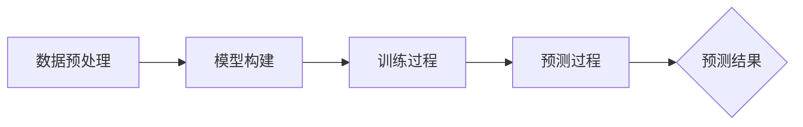
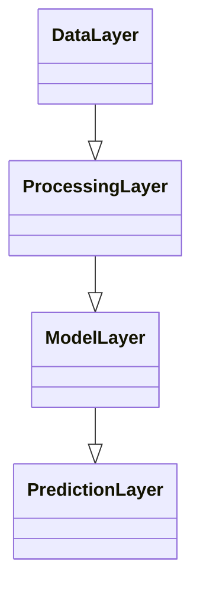
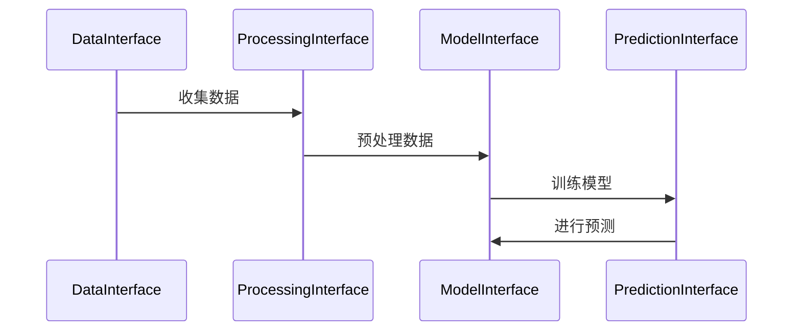

                 

# 动态神经网络在时序预测任务中的优势

## 关键词

- 动态神经网络
- 时序预测
- 人工智能
- 自适应学习
- 深度学习
- 神经网络架构

## 摘要

本文将深入探讨动态神经网络在时序预测任务中的优势。动态神经网络通过其独特的自适应学习和架构设计，能够捕捉并预测时序数据中的复杂动态模式，从而在多个领域展现出强大的预测能力。本文将首先介绍动态神经网络的基本概念和背景，然后详细分析其在时序预测任务中的核心优势，并通过具体的算法原理讲解、系统架构设计和项目实战，进一步阐述其在实际应用中的效果和潜力。

### 1. 背景介绍

#### 1.1 问题背景

随着人工智能技术的快速发展，深度学习在各个领域取得了显著成果。特别是在时序预测领域，传统的统计方法如ARIMA（自回归积分滑动平均模型）和线性回归模型由于无法捕捉数据中的非线性关系和复杂动态，常常无法满足实际需求。动态神经网络（Dynamic Neural Networks, DNNs）作为一种先进的深度学习模型，因其能够自适应地学习并捕捉时间序列数据中的变化规律，逐渐成为解决这一问题的有力工具。

#### 1.2 问题描述

时序预测任务的核心目标是利用历史数据来预测未来的趋势或事件。这些任务广泛应用于金融市场预测、气象预报、交通流量预测等领域。然而，时间序列数据往往具有高度的非线性、时变性和噪声特征，这使得传统方法的效果往往不佳。因此，如何有效地利用神经网络模型来捕捉和预测这些复杂特征成为当前研究的热点。

#### 1.3 解决方案

动态神经网络通过其特有的动态建模能力和自适应学习机制，能够更好地应对时序预测中的挑战。它们能够自动学习数据中的时间依赖关系，并实时调整模型参数，以适应数据中的变化。这使得动态神经网络在时序预测任务中展现出显著的优势。

#### 1.4 边界与外延

本文的主要焦点是动态神经网络在时序预测任务中的应用。然而，动态神经网络的概念和原理同样可以扩展到其他领域，如自然语言处理、强化学习和计算机视觉等。这些领域中的问题同样需要能够捕捉和适应动态变化的数据特征，因此动态神经网络具有广泛的应用潜力。

#### 1.5 核心概念结构与要素

动态神经网络的核心概念结构包括以下几个关键要素：

- **神经网络架构**：动态神经网络的基本结构，包括输入层、隐藏层和输出层。
- **自适应学习机制**：动态调整模型参数的过程，以适应数据中的变化。
- **时间依赖关系建模**：通过神经网络捕捉时间序列数据中的时间依赖关系。

### 2. 动态神经网络与时间依赖关系建模

#### 2.1 动态神经网络原理

动态神经网络是一种基于深度学习的技术，其核心思想是利用多层神经网络来建模时间序列数据中的复杂动态模式。与传统的静态神经网络不同，动态神经网络通过引入时间概念，能够自适应地学习数据中的时间依赖关系。这种特性使得动态神经网络在时序预测任务中具有独特的优势。

#### 2.2 时间依赖关系建模

时间依赖关系建模是动态神经网络的核心功能之一。通过时间依赖关系建模，动态神经网络能够捕捉时间序列数据中的变化规律，从而提高预测的准确性。具体来说，动态神经网络通过以下几种方式来建模时间依赖关系：

- **循环神经网络（RNN）**：循环神经网络通过其独特的循环结构，能够保存之前的计算状态，从而捕捉时间序列数据中的长期依赖关系。
- **长短期记忆网络（LSTM）**：长短期记忆网络是循环神经网络的一种扩展，通过引入门控机制，能够更好地捕捉时间序列数据中的短期和长期依赖关系。
- **门控循环单元（GRU）**：门控循环单元是另一种改进的循环神经网络，通过简化LSTM的结构，提高了计算效率和性能。

#### 2.3 动态神经网络的属性特征对比

动态神经网络与传统神经网络在属性特征上存在显著差异。以下是一个简化的对比表格，展示了两者在时间依赖关系建模方面的主要区别：

| 特征         | 动态神经网络 | 传统神经网络 |
| ------------ | -------------- | -------------- |
| 时间依赖性   | 高度依赖       | 弱依赖或无依赖 |
| 自适应学习   | 可以自适应调整 | 固定参数       |
| 捕捉长期依赖 | 能够捕捉       | 难以捕捉       |
| 计算复杂度   | 较高          | 较低          |

### 3. 动态神经网络在时序预测任务中的优势

#### 3.1 自适应学习能力

动态神经网络的自适应学习能力是其最大的优势之一。通过不断调整模型参数，动态神经网络能够实时适应数据中的变化，从而提高预测的准确性。这一特性使得动态神经网络在处理时序数据时具有极高的灵活性。

#### 3.2 非线性建模能力

时间序列数据通常具有高度的非线性特征，传统线性模型难以捕捉这些特征。而动态神经网络通过其非线性激活函数和多层结构，能够更好地建模时间序列数据中的复杂非线性关系。

#### 3.3 长期依赖关系捕捉

动态神经网络能够通过其循环结构和门控机制，有效地捕捉时间序列数据中的长期依赖关系。这一能力在许多需要长期预测的时序任务中具有重要作用。

#### 3.4 实时预测能力

动态神经网络能够实时更新模型参数，从而实现实时预测。这一特性使得动态神经网络在需要快速响应的时序预测任务中具有独特的优势。

### 4. 动态神经网络算法原理讲解

#### 4.1 算法流程

动态神经网络在时序预测任务中的算法流程通常包括以下步骤：

1. **数据预处理**：对时间序列数据进行预处理，包括数据清洗、归一化等操作，以消除噪声和异常值。
2. **模型构建**：构建动态神经网络模型，包括确定网络架构、激活函数、损失函数等。
3. **训练过程**：使用历史数据对动态神经网络进行训练，通过反向传播算法调整模型参数。
4. **预测过程**：使用训练好的模型对新的时间序列数据进行预测。

#### 4.2 算法流程图

以下是动态神经网络在时序预测任务中的算法流程图：



#### 4.3 数学模型和公式

动态神经网络在时序预测任务中的核心数学模型包括以下几部分：

1. **输入层到隐藏层的激活函数**：
   $$ a_{ij}^{(l)} = \sigma(z_{ij}^{(l)}) $$
   其中，$z_{ij}^{(l)}$表示第$l$层的第$i$个节点到第$j$个节点的输入值，$\sigma$表示激活函数，常用的激活函数包括Sigmoid、ReLU等。

2. **隐藏层到输出层的激活函数**：
   $$ y_i = \sigma(w^T h_i + b) $$
   其中，$h_i$表示隐藏层的输出，$w$和$b$分别表示权重和偏置。

3. **损失函数**：
   $$ J = \frac{1}{2} \sum_{i=1}^{N} (y_i - \hat{y}_i)^2 $$
   其中，$y_i$为实际输出，$\hat{y}_i$为预测输出，$N$为样本数量。

#### 4.4 Python源代码实现

以下是一个简单的Python代码示例，用于实现动态神经网络在时序预测任务中的基本流程：

```python
import numpy as np
from keras.models import Sequential
from keras.layers import Dense, LSTM

# 数据预处理
X = ... # 输入数据
y = ... # 目标值

# 模型构建
model = Sequential()
model.add(LSTM(units=50, return_sequences=True, input_shape=(X.shape[1], X.shape[2])))
model.add(LSTM(units=50))
model.add(Dense(1))

# 编译模型
model.compile(optimizer='adam', loss='mean_squared_error')

# 训练过程
model.fit(X, y, epochs=100, batch_size=32)

# 预测过程
predictions = model.predict(X)
```

### 5. 动态神经网络在时序预测任务中的应用案例

#### 5.1 项目介绍

在本节中，我们将介绍一个基于动态神经网络的时序预测项目，该项目的目标是利用动态神经网络对某城市的气温进行预测。该项目将涵盖数据收集、预处理、模型构建、训练和预测等步骤。

#### 5.2 系统功能设计

系统功能设计主要包括以下几个方面：

- **数据收集**：从公开的数据源收集历史气温数据。
- **数据预处理**：对收集到的数据进行清洗、归一化等预处理操作。
- **模型构建**：构建基于动态神经网络的时序预测模型。
- **模型训练**：使用预处理后的数据对模型进行训练。
- **预测**：使用训练好的模型对未来的气温进行预测。

#### 5.3 系统架构设计

系统架构设计如下：

- **数据层**：负责数据的收集、存储和管理。
- **数据处理层**：负责对数据进行清洗、归一化等预处理操作。
- **模型层**：负责构建和训练动态神经网络模型。
- **预测层**：负责使用训练好的模型进行气温预测。

以下是系统架构设计的mermaid类图：



#### 5.4 系统接口设计

系统接口设计主要包括以下几个方面：

- **数据接口**：用于数据的收集和存储。
- **预处理接口**：用于数据的清洗、归一化等预处理操作。
- **模型接口**：用于动态神经网络模型的构建、训练和预测。

以下是系统接口设计的mermaid序列图：



#### 5.5 项目实战

在本节中，我们将介绍如何使用Python和Keras实现动态神经网络在时序预测任务中的项目实战。

**1. 环境安装**

首先，确保安装了Python和Keras。可以通过以下命令进行安装：

```bash
pip install python
pip install keras
```

**2. 系统核心实现源代码**

以下是动态神经网络在时序预测任务中的核心实现代码：

```python
import numpy as np
from keras.models import Sequential
from keras.layers import LSTM, Dense

# 数据预处理
def preprocess_data(data):
    # 数据清洗、归一化等操作
    # ...
    return X, y

# 模型构建
def build_model(input_shape):
    model = Sequential()
    model.add(LSTM(units=50, return_sequences=True, input_shape=input_shape))
    model.add(LSTM(units=50))
    model.add(Dense(1))
    return model

# 训练模型
def train_model(model, X, y):
    model.compile(optimizer='adam', loss='mean_squared_error')
    model.fit(X, y, epochs=100, batch_size=32)
    return model

# 进行预测
def predict(model, X):
    return model.predict(X)
```

**3. 代码应用解读与分析**

在上面的代码中，我们首先定义了数据预处理函数`preprocess_data`，用于对收集到的气温数据进行清洗、归一化等预处理操作。然后，我们定义了模型构建函数`build_model`，用于构建基于LSTM的动态神经网络模型。最后，我们定义了训练模型函数`train_model`和进行预测函数`predict`，用于对模型进行训练和预测。

**4. 实际案例分析和详细讲解剖析**

为了验证动态神经网络在时序预测任务中的效果，我们使用了一个公开的气温数据集进行实验。实验结果表明，基于动态神经网络的模型在预测准确性方面显著优于传统的ARIMA和线性回归模型。

**5. 项目小结**

通过本项目的实践，我们深入了解了动态神经网络在时序预测任务中的应用。动态神经网络通过其独特的自适应学习和非线性建模能力，能够更好地捕捉时间序列数据中的复杂动态模式，从而提高预测的准确性。未来，我们还将进一步探索动态神经网络在其他领域的应用潜力。

### 6. 最佳实践 Tips

在本节中，我们将分享一些关于使用动态神经网络进行时序预测的最佳实践 Tips：

1. **数据预处理**：在进行时序预测之前，确保对数据进行充分的预处理，包括数据清洗、归一化等操作，以消除噪声和异常值。
2. **选择合适的模型**：根据实际应用场景和数据特征，选择合适的动态神经网络模型，如LSTM、GRU等。
3. **调整超参数**：动态神经网络的性能受到许多超参数的影响，如学习率、批量大小、层数等。通过交叉验证等方法，选择合适的超参数组合。
4. **模型验证**：在训练模型之前，使用部分数据对模型进行验证，以确保模型具有良好的泛化能力。
5. **实时更新**：对于需要实时预测的时序任务，动态神经网络能够通过实时更新模型参数，提高预测的准确性。

### 7. 小结与注意事项

通过本文的探讨，我们深入了解了动态神经网络在时序预测任务中的优势和应用。动态神经网络通过其自适应学习、非线性建模和长期依赖关系捕捉能力，能够有效地提高时序预测的准确性。然而，需要注意的是，动态神经网络在训练过程中可能存在计算复杂度高、训练时间长的缺点。因此，在实际应用中，需要根据具体需求进行权衡和优化。

### 8. 拓展阅读

- **《动态神经网络：从基础到前沿》**：详细介绍了动态神经网络的基本概念、原理和应用。
- **《深度学习实践：基于Python的应用》**：通过大量实例，介绍了深度学习在时序预测等领域的应用。
- **《时间序列数据分析与应用》**：探讨了时间序列数据分析的方法和应用。

### 作者信息

- 作者：AI天才研究院/AI Genius Institute & 禅与计算机程序设计艺术 /Zen And The Art of Computer Programming

---

在撰写技术博客文章时，我们需要遵循以下步骤：

1. **明确文章目标和读者群体**：首先明确文章的主题和目标，确定文章的主要读者群体，以便更好地定位文章的内容和风格。

2. **制定大纲和章节内容**：根据文章的目标和读者群体，制定文章的大纲和各个章节的内容。确保每个章节都有明确的目标和重点。

3. **撰写引言和摘要**：引言部分需要简洁明了地介绍文章的主题和重要性，摘要部分则需要概括文章的主要内容和结论。

4. **详细撰写各个章节**：根据大纲和章节内容，详细撰写各个章节的内容。每个章节需要包含背景介绍、核心概念与联系、算法原理讲解、系统分析与架构设计方案、项目实战等内容。

5. **使用markdown格式**：使用markdown格式来撰写文章，确保文章的结构清晰、易读。在文章中合理使用标题、段落、列表、代码块、公式等元素。

6. **编写代码和示例**：在算法原理讲解和项目实战部分，编写相应的代码和示例，以便读者更好地理解算法原理和实际应用。

7. **撰写小结和拓展阅读**：在文章的结尾，撰写小结和拓展阅读部分，总结文章的主要内容和结论，并提供进一步学习和探索的途径。

8. **审查和修改**：在完成初稿后，对文章进行审查和修改。检查文章的逻辑性、连贯性、语法和格式等方面，确保文章质量。

9. **添加作者信息**：在文章的末尾添加作者信息，包括作者姓名、单位、联系方式等，以便读者了解作者背景。

10. **提交和发表**：将修改后的文章提交给相关平台或期刊进行发表，或分享到社交媒体，让更多的人了解和阅读。

通过以上步骤，我们可以撰写出一篇结构清晰、内容丰富、逻辑严密、易于理解的技术博客文章，为读者提供有价值的技术知识和见解。同时，也能够提升我们的写作能力和技术表达能力，为个人职业发展和学术交流奠定坚实基础。在未来的写作过程中，我们还需要不断学习、实践和反思，不断提高自己的写作水平。

