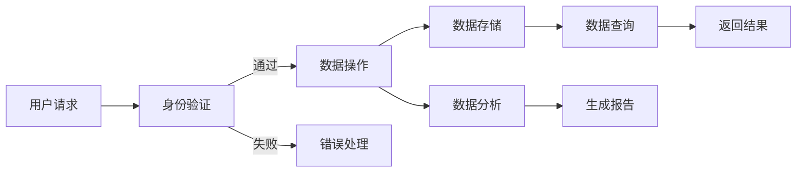

                 

### 化解内心矛盾的技巧：有效的自我对话策略

在快速变化和压力巨大的现代社会中，我们时常会遇到内心矛盾的情况。无论是职业上的挫折、人际关系的困扰，还是内心的自我怀疑，这些矛盾如果不能及时化解，可能会导致情绪困扰、心理健康问题，甚至影响工作与生活的平衡。因此，掌握有效的自我对话策略，对于个人成长和心理健康具有重要意义。

本文将围绕“化解内心矛盾的技巧：有效的自我对话策略”展开讨论。我们将首先介绍内心矛盾的概念及其背景，探讨为何需要化解这些矛盾。接着，我们将详细梳理与自我对话策略相关的核心概念，并通过图表展示这些概念之间的联系。然后，本文将重点介绍几种有效的自我对话策略，包括正面肯定、自我反思和问题解决。我们将用具体的数学模型和算法，帮助读者更深入地理解这些策略的实施方法和效果。

此外，本文还将通过系统分析和架构设计的方法，展示如何将自我对话策略应用到实际项目中。通过提供实际案例和项目实战，我们将帮助读者将理论知识转化为实际操作能力。最后，我们将总结文章的核心观点，提供一些实用的最佳实践建议，并推荐进一步阅读的材料。

通过这篇文章，我们希望读者能够掌握一套有效的自我对话策略，帮助自己更好地应对内心的矛盾，提升心理健康水平，实现个人成长。

### 关键词

- **内心矛盾**
- **自我对话策略**
- **正面肯定**
- **自我反思**
- **问题解决**
- **心理健康**
- **数学模型**
- **算法原理**
- **系统架构设计**
- **项目实战**

### 摘要

本文旨在探讨化解内心矛盾的技巧，通过有效的自我对话策略帮助个人提升心理健康和应对压力。文章首先介绍了内心矛盾的概念及其影响，随后详细梳理了自我对话策略的核心概念和联系。通过数学模型和算法的讲解，文章展示了正面肯定、自我反思和问题解决策略的实施方法和效果。此外，文章还通过系统分析和架构设计，提供了将自我对话策略应用于实际项目的实例。最后，文章总结了核心观点，并提供了实用的最佳实践建议和相关阅读材料。

### 内心矛盾概述

#### 内心矛盾的概念

内心矛盾，指的是人们在内心深处同时存在的两种或多种相互冲突的想法、感受或信念。这种矛盾可能源于个人价值观的冲突、对外界环境的不适应、心理需求与实际条件的矛盾，或者是对自身能力和期望的评估不准确。内心矛盾的表现形式多样，可能表现为焦虑、抑郁、犹豫不决、情绪波动等。

在日常生活中，内心矛盾是一种普遍存在的现象。每个人在不同的生活阶段都可能遇到内心矛盾的情况，例如职业选择上的犹豫、人际关系中的误解、自我认知的不一致等。这些矛盾如果不得到有效处理，可能会积累成心理压力，影响个人的情绪状态和心理健康。

#### 内心矛盾的类型

内心矛盾可以分为以下几种类型：

1. **自我认知与行为冲突**：这种情况表现为个人对自己的认知与实际行为之间的不一致。例如，一个人可能在内心深处认为自己有能力完成某项任务，但在实际执行过程中却表现出犹豫和担忧。

2. **情感与理智冲突**：这种情况发生在个人情感和理智判断之间存在矛盾时。例如，一个人可能在理智上认为某项决策是正确的，但在情感上却感到焦虑或不安。

3. **需求与资源冲突**：这种情况是由于个人的需求与可用的资源之间存在矛盾而引起的。例如，一个人可能渴望有更多的时间和精力去追求个人兴趣，但实际工作和生活压力却迫使他不得不牺牲这些时间。

4. **价值观与行为准则冲突**：这种情况发生在个人价值观与实际行为准则不一致时。例如，一个人可能认为自己应该遵循某些道德标准，但在实际行动中却难以做到。

#### 内心矛盾的危害

内心矛盾如果得不到及时化解，会对个人的身心健康产生多方面的负面影响：

1. **情绪困扰**：长期的内心里存矛盾会导致情绪波动，例如焦虑、抑郁、愤怒等情绪问题。

2. **心理健康问题**：内心矛盾可能会引发或加剧心理健康问题，如抑郁症、焦虑症等。

3. **影响决策**：内心矛盾会影响个人的决策能力和判断力，使人难以做出明智的选择。

4. **工作效率下降**：内心矛盾会导致工作效率下降，甚至影响职业发展和人际关系。

5. **生活质量下降**：长期的内心里存矛盾会降低个人的生活质量，影响家庭生活和个人幸福感。

#### 需要化解内心矛盾的原因

1. **心理健康**：化解内心矛盾有助于提高心理健康水平，减少情绪困扰和心理压力。

2. **个人成长**：通过化解内心矛盾，个人可以更好地理解自己，找到内在的动力和方向，促进个人成长。

3. **决策能力**：化解内心矛盾有助于提高决策能力，使个人能够更加冷静和理性地面对问题。

4. **工作效率**：化解内心矛盾可以提高工作效率，减少不必要的内耗，使个人能够更好地专注于工作和目标。

5. **人际关系**：化解内心矛盾有助于改善人际关系，减少误解和冲突，提高人际交往的质量。

综上所述，内心矛盾是现代社会中普遍存在的现象，但其危害不容忽视。通过有效化解内心矛盾，个人可以提升心理健康水平，实现个人成长和目标，提高工作效率和生活质量。因此，掌握化解内心矛盾的技巧具有重要的现实意义。

#### 本章小结

本章对内心矛盾的概念、类型及其危害进行了详细阐述，并说明了为什么需要化解内心矛盾。我们了解了内心矛盾的定义和表现形式，包括自我认知与行为冲突、情感与理智冲突、需求与资源冲突以及价值观与行为准则冲突。同时，我们认识到内心矛盾如果得不到及时处理，会对个人的情绪、心理健康、决策能力、工作效率和生活质量产生负面影响。因此，化解内心矛盾不仅有助于提升心理健康水平，还能促进个人成长和决策能力，提高工作效率和生活质量。这些认识为我们后续探讨自我对话策略提供了理论基础。

### 核心概念与联系

在探讨化解内心矛盾的技巧之前，我们需要明确几个核心概念，并分析它们之间的联系。这些概念包括自我认知、情感管理和问题解决。通过表格和ER图，我们可以更直观地了解这些概念及其相互关系。

#### 自我认知

自我认知是指个体对自己存在的了解和认识，包括自己的能力、性格、价值观等方面。自我认知是内心矛盾化解的基础，因为只有清楚地了解自己，才能找到矛盾点并采取有效措施。

#### 情感管理

情感管理是指个体对自身情感的处理能力，包括识别情感、理解情感、调节情感等。情感管理对于化解内心矛盾至关重要，因为情感冲突常常是内心矛盾的主要表现形式。

#### 问题解决

问题解决是指个体在面对问题时，通过分析和推理找到解决方案的过程。问题解决能力可以帮助个体在面对内心矛盾时，采取科学合理的方法进行应对。

#### 核心概念对比表格

| 核心概念 | 定义 | 功能 |
| --- | --- | --- |
| **自我认知** | 对自己的了解和认识 | 基础，识别矛盾 |
| **情感管理** | 对自身情感的处理能力 | 中介，化解情感冲突 |
| **问题解决** | 解决问题的能力 | 目标，化解矛盾 |

#### ER图展示

为了更清晰地展示这些概念之间的联系，我们可以使用ER图（实体关系图）来描述它们之间的关系。

```mermaid
erDiagram
  Person ||--|{ Self_Cognition : has }
  Person ||--|{ Emotional_Management : has }
  Person ||--|{ Problem_Solving : has }
  Self_Cognition ..|> Emotional_Management : affects
  Emotional_Management ..|> Problem_Solving : influences
  Problem_Solving ..|> Self_Cognition : supports
```

在上面的ER图中：

- **Person（个体）** 是主要实体，表示个人。
- **Self_Cognition（自我认知）**、**Emotional_Management（情感管理）** 和 **Problem_Solving（问题解决）** 是与个体相关的属性。
- 箭头表示概念之间的相互影响关系。例如，自我认知影响情感管理，情感管理又影响问题解决。

#### 概念之间的联系

1. **自我认知** 是化解内心矛盾的基础。只有当个体清楚地了解自己，才能识别出内心的矛盾点。
2. **情感管理** 是中介环节。个体在认知到内心矛盾后，需要通过情感管理来调节自己的情绪，以避免情绪冲突。
3. **问题解决** 是最终目标。通过问题解决能力，个体可以找到解决内心矛盾的有效方法。

通过以上分析，我们可以看到，自我认知、情感管理和问题解决是相互联系、相互影响的。只有全面理解这些概念及其关系，才能有效化解内心矛盾。

#### 本章小结

本章详细介绍了内心矛盾化解过程中的核心概念，包括自我认知、情感管理和问题解决，并通过对比表格和ER图展示了这些概念之间的关系。自我认知是基础，情感管理是中介，问题解决是目标。通过理解这些核心概念及其相互关系，我们可以更有效地应对内心矛盾，提升个人心理健康和应对压力的能力。这一部分的讨论为下一部分深入探讨自我对话策略奠定了理论基础。

### 自我对话策略

自我对话策略是指个体通过内部语言和思维过程，对自己进行反思、评价和指导，以解决内心矛盾和提升心理健康的方法。这些策略可以帮助我们更好地认识自己，调节情绪，找到解决问题的方法。本文将详细介绍三种自我对话策略：正面肯定、自我反思和问题解决。

#### 正面肯定

正面肯定是一种积极的自我对话策略，通过反复对自己进行积极的心理暗示，帮助个体建立积极的自我形象，提升自信心和幸福感。

##### 1.1 正面肯定的重要性

正面肯定不仅能增强个体的心理韧性，还能帮助个体更好地应对压力和挑战。通过正面肯定，个体能够：

1. **提升自信心**：积极的心理暗示有助于个体认识到自己的价值和能力，从而增强自信心。
2. **改善心理健康**：正面肯定可以减少负面情绪，提高心理健康水平。
3. **促进个人成长**：通过正面肯定，个体能够更加积极地面对自己的不足，从而推动个人成长。

##### 1.2 正面肯定的好处

正面肯定的好处包括：

1. **增强自我效能感**：通过正面肯定，个体能够更好地相信自己的能力，从而提高自我效能感。
2. **减少焦虑和抑郁**：正面肯定有助于缓解焦虑和抑郁情绪，提高生活质量。
3. **改善人际关系**：积极的自我形象有助于个体建立更好的人际关系。

##### 1.3 如何进行正面肯定

1. **具体目标**：设定具体的正面肯定目标，例如“我今天能完成工作”，“我能够做好这个项目”等。
2. **每日练习**：每天定时进行正面肯定练习，可以选择在早晨起床后或晚上睡觉前进行。
3. **自我暗示**：在日常生活中，不断对自己进行积极的心理暗示，如“我可以做到”，“我有能力克服困难”等。

##### 1.4 正面肯定的实践案例

1. **职场中的应用**：某员工在面对一个复杂项目时，通过每天进行正面肯定，如“我能够按时完成任务”，“我有能力解决项目中遇到的问题”，最终成功地完成了项目。
2. **个人生活中的应用**：一个人在面对压力时，通过反复对自己说“我能够应对这个挑战”，“我有足够的能力解决问题”，从而缓解了焦虑情绪。

##### 1.5 正面肯定的实践技巧

1. **明确目标**：确保正面肯定的目标具体且可实现。
2. **坚持练习**：正面肯定需要长期坚持，效果才能显现。
3. **积极心态**：保持积极的心态，对待正面肯定的过程。

##### 1.6 正面肯定的实践挑战

1. **消极心态**：有些人可能习惯于负面思维，开始正面肯定时可能会感到不适应。
2. **缺乏信心**：对于一些缺乏自信的人来说，正面肯定可能难以实施。

#### 自我反思

自我反思是一种通过深入思考自己的行为、想法和情感，以识别并解决内心矛盾的自我对话策略。自我反思有助于个体更好地理解自己，从而找到解决问题的方法。

##### 2.1 自我反思的重要性

自我反思的重要性体现在：

1. **识别内心矛盾**：通过自我反思，个体能够识别出内心深处的矛盾和冲突。
2. **促进个人成长**：自我反思有助于个体发现自身的不足和成长空间，从而推动个人成长。
3. **提高决策能力**：自我反思可以帮助个体从过去的经验中吸取教训，提高决策能力。

##### 2.2 自我反思的好处

自我反思的好处包括：

1. **提升自我认知**：通过自我反思，个体能够更深入地了解自己，从而提升自我认知水平。
2. **减少内心冲突**：自我反思有助于个体解决内心的矛盾和冲突，减少心理压力。
3. **提高情绪调节能力**：自我反思可以帮助个体更好地管理自己的情绪。

##### 2.3 如何进行自我反思

1. **定期进行**：设定固定的时间进行自我反思，例如每天晚上睡前或每周的某个特定时间。
2. **写反思日记**：通过记录自己的想法、感受和行为，帮助个体更好地进行自我反思。
3. **倾听内心声音**：在反思过程中，倾听自己内心的声音，诚实地面对自己的行为和情感。

##### 2.4 自我反思的实践案例

1. **职场中的应用**：某员工通过每天写反思日记，记录自己在工作中的优点和不足，从而逐渐改进自己的工作表现。
2. **个人生活中的应用**：一个人通过定期进行自我反思，发现了自己的人际关系问题，并通过改变行为和沟通方式，改善了与朋友和家人之间的关系。

##### 2.5 自我反思的实践技巧

1. **诚实面对**：自我反思需要诚实地面对自己的行为和情感，不逃避问题。
2. **持续反思**：自我反思不是一次性的活动，需要长期坚持，效果才会显现。

##### 2.6 自我反思的实践挑战

1. **自我逃避**：有些人可能在自我反思时，选择逃避或否认自己的问题，导致反思效果不佳。
2. **缺乏自律**：自我反思需要较强的自律能力，有些人可能会因为缺乏自律而难以坚持反思。

#### 问题解决

问题解决是一种通过分析问题、制定解决方案并执行解决方案来解决问题的自我对话策略。问题解决能力对于化解内心矛盾至关重要。

##### 3.1 问题解决的重要性

问题解决的重要性体现在：

1. **解决内心矛盾**：通过问题解决，个体能够找到有效的方法来化解内心的矛盾和冲突。
2. **提升应对能力**：问题解决能力有助于个体在面对挑战和困难时，更加从容和自信。
3. **增强心理韧性**：通过解决问题，个体能够增强心理韧性，提高应对未来挑战的能力。

##### 3.2 问题解决的好处

问题解决的好处包括：

1. **提升解决问题的能力**：通过问题解决，个体能够提升分析和解决复杂问题的能力。
2. **减少焦虑和压力**：问题解决能够帮助个体减少焦虑和压力，提高生活质量。
3. **增强自信心**：通过成功解决问题，个体能够增强自信心，提高自我效能感。

##### 3.3 如何进行问题解决

1. **明确问题**：首先要明确需要解决的问题，理解问题的本质和影响范围。
2. **收集信息**：通过调查、询问等方式，收集与问题相关的信息。
3. **分析问题**：对收集到的信息进行分析，找出问题的根本原因。
4. **制定解决方案**：根据分析结果，制定解决问题的方案。
5. **执行方案**：将制定的方案付诸实践，并监控执行效果。

##### 3.4 问题解决的实践案例

1. **职场中的应用**：某团队在项目遇到瓶颈时，通过问题解决策略，分析了问题的原因，并制定了详细的解决方案，最终成功解决了问题。
2. **个人生活中的应用**：一个人在面对家庭矛盾时，通过问题解决策略，分析了矛盾的原因，并采取了有效的措施，改善了家庭关系。

##### 3.5 问题解决的实践技巧

1. **明确问题**：确保问题定义清晰，避免混淆问题。
2. **全面分析**：在分析问题时，要全面考虑各种因素，避免片面分析。
3. **制定详细方案**：确保解决方案具体可行，并有明确的执行步骤。

##### 3.6 问题解决的实践挑战

1. **问题定义不清**：有时问题本身可能定义不清，导致无法有效解决问题。
2. **缺乏执行力**：有些人在制定方案后，可能因为缺乏执行力而无法成功解决问题。

#### 综合应用

将正面肯定、自我反思和问题解决三种自我对话策略结合起来，可以更有效地化解内心矛盾，提升心理健康。

##### 3.7 综合应用技巧

1. **先正面肯定**：在解决问题或进行自我反思前，先进行正面肯定，增强自信心和积极性。
2. **结合反思**：在问题解决过程中，结合自我反思，不断审视自己的行为和决策，确保方案的有效性。
3. **持续肯定**：在问题解决后，持续进行正面肯定，巩固成果，提升心理韧性。

##### 3.8 综合应用挑战

1. **时间管理**：综合应用三种策略可能需要更多的时间，需要合理安排时间。
2. **平衡策略**：每种策略都有其适用场景，需要根据实际情况平衡使用。

#### 本章小结

本章详细介绍了自我对话策略的三种方法：正面肯定、自我反思和问题解决。正面肯定有助于建立积极的自我形象，自我反思能够帮助个体更好地理解自己，问题解决则是解决内心矛盾的有效途径。通过综合应用这些策略，个体可以更有效地化解内心矛盾，提升心理健康水平。本章的讨论为读者提供了具体的方法和技巧，帮助他们在日常生活中实践这些策略。

### 数学模型和公式

在自我对话策略中，运用数学模型和公式可以帮助我们更科学地理解和分析内心的矛盾及其化解过程。以下是几种常用的数学模型和公式，并结合具体示例进行讲解。

#### 1. 心理韧性指数（PDI）

心理韧性指数（Psychological Resilience Index，PDI）是一个衡量个体心理韧性的模型，公式如下：

\[ PDI = \frac{S}{C} \]

其中：
- \( S \) 表示个体的积极情绪状态（如自信、乐观、积极肯定等）；
- \( C \) 表示个体的消极情绪状态（如焦虑、抑郁、负面肯定等）。

#### 应用示例

假设某人当前的心理韧性指数为 \( PDI = 2 \)，这意味着他的积极情绪状态是消极情绪状态的两倍。通过公式，我们可以计算出：

\[ S = 2C \]

#### 2. 费舍尔方差检验（F-test）

费舍尔方差检验是一种统计方法，用于比较两组数据的方差是否显著不同。在自我对话策略中，我们可以使用它来检验不同策略对个体心理韧性的影响。

\[ F = \frac{Var_1 - Var_2}{\frac{(Var_1 + Var_2)}{2}} \]

其中：
- \( Var_1 \) 表示实验组方差；
- \( Var_2 \) 表示控制组方差；
- \( F \) 表示费舍尔方差比。

#### 应用示例

假设我们有两个实验组，A组和B组，分别采用正面肯定和自我反思策略。经过一段时间后，我们收集了两组的心理韧性数据，并计算出方差：

- A组方差 \( Var_1 = 4 \)
- B组方差 \( Var_2 = 8 \)

根据费舍尔方差检验公式，我们可以计算出：

\[ F = \frac{4 - 8}{\frac{(4 + 8)}{2}} = \frac{-4}{6} \approx -0.67 \]

由于 \( F \) 值为负数，我们可以认为两组方差没有显著差异。但为了更精确地评估，我们需要查阅费舍尔方差分布表，确定 \( F \) 值对应的概率值。

#### 3. 决策树模型

在问题解决过程中，决策树模型可以帮助个体分析不同决策路径及其结果。决策树包含以下元素：

- **根节点**：表示初始状态。
- **内部节点**：表示决策点。
- **分支**：表示不同决策路径。
- **叶节点**：表示不同决策路径的结果。

#### 应用示例

假设一个个体面临两个决策点：是否参加一个重要会议。如果参加，可能的结果有：成功、失败；如果不参加，可能的结果有：错过机会、避免风险。我们可以构建如下决策树：

```
              根节点
               |
               |
         参加会议    不参加会议
          /      \            /      \
         成功    失败      错过机会    避免风险
```

#### 4. 情感量表

情感量表是一种用于测量个体情绪状态的工具，常见的有情绪温度计（Emotion Thermometer）和正负情绪量表（Positive and Negative Affect Schedule，PANAS）。这些量表通过一系列问题，评估个体的正面情绪和负面情绪，并给出总分。

\[ 总分 = \sum_{i=1}^{n} (P_i - N_i) \]

其中：
- \( P_i \) 表示正面情绪得分；
- \( N_i \) 表示负面情绪得分；
- \( n \) 表示问题数量。

#### 应用示例

假设我们使用一个包含10个问题的正负情绪量表，某人的得分如下：

- 正面情绪得分：\( P_i = 8 \)
- 负面情绪得分：\( N_i = 3 \)

根据公式，我们可以计算出总分：

\[ 总分 = \sum_{i=1}^{10} (8 - 3) = 5 \]

这意味着该个体的情绪状态整体上偏向正面。

#### 本章小结

本章介绍了在自我对话策略中常用的数学模型和公式，包括心理韧性指数（PDI）、费舍尔方差检验、决策树模型和情感量表。通过这些模型和公式，我们可以更科学地理解和分析内心矛盾及其化解过程。具体示例说明了这些模型和公式的应用方法，帮助读者更好地理解和实践自我对话策略。

### 系统分析与架构设计

在本文的第三部分，我们将通过系统分析与架构设计的方法，展示如何将自我对话策略应用到实际项目中。这包括介绍项目背景、系统功能设计、系统架构设计和系统接口设计等内容。

#### 项目背景

假设我们正在开发一个名为“内心矛盾化解系统”的项目，旨在帮助用户通过自我对话策略来化解内心矛盾，提升心理健康水平。该项目的主要功能包括：

1. **用户注册与登录**：用户可以通过注册账号登录系统，进行个人信息管理和数据隐私保护。
2. **自我对话模块**：用户可以通过该模块进行正面肯定、自我反思和问题解决等自我对话练习。
3. **数据记录与分析**：系统将记录用户的自我对话数据，并生成分析报告，帮助用户了解自己的内心矛盾及其化解效果。
4. **在线支持与咨询**：系统提供在线心理支持和咨询服务，为用户提供专业的帮助。

#### 系统功能设计

系统功能设计包括领域模型设计、类图设计等，以下是系统的主要领域模型和类图：

##### 领域模型

1. **用户模块**：包括用户信息管理、登录验证等功能。
2. **自我对话模块**：包括自我肯定、自我反思和问题解决等功能。
3. **数据分析模块**：包括数据记录、数据分析、生成报告等功能。
4. **支持与咨询模块**：包括在线支持、预约咨询等功能。

##### 类图

```mermaid
classDiagram
  User <<class>> "用户"
  SelfDialogue <<class>> "自我对话"
  DataAnalysis <<class>> "数据分析"
  SupportConsultation <<class>> "支持与咨询"

  User o-- SelfDialogue
  User o-- DataAnalysis
  User o-- SupportConsultation
```

在上面的类图中，用户模块与自我对话模块、数据分析模块和支持与咨询模块之间具有关联关系。

#### 系统架构设计

系统架构设计包括系统的整体架构设计、接口设计和数据流设计等。以下是系统架构的简要描述：

##### 系统架构图

```mermaid
sequenceDiagram
  User ->>|发起请求| System
  System ->>|处理请求| Database
  Database ->>|响应数据| System
  System ->>|返回结果| User
```

在上面的系统架构图中，用户通过接口发起请求，系统处理后返回结果给用户。

##### 数据流设计



在上面的数据流图中，用户请求经过身份验证后，会触发数据操作、数据存储、数据分析和生成报告等过程。

#### 系统接口设计

系统接口设计包括RESTful API设计、接口定义和接口测试等。以下是系统的几个主要接口：

1. **用户登录接口**：用于用户登录系统，返回用户身份验证结果。
2. **用户注册接口**：用于用户注册账号，返回注册结果。
3. **自我对话接口**：用于用户发起自我对话练习，返回对话记录。
4. **数据分析接口**：用于获取用户的数据分析报告。
5. **支持与咨询接口**：用于用户预约心理支持和咨询服务。

#### 本章小结

本章通过系统分析与架构设计的方法，详细介绍了内心矛盾化解系统的项目背景、系统功能设计、系统架构设计和系统接口设计。我们了解了系统的主要功能模块和架构设计，并通过类图和数据流图展示了系统的结构和工作流程。通过这些设计，我们可以更好地将自我对话策略应用到实际项目中，帮助用户提升心理健康水平。

### 项目实战

在本节中，我们将通过一个具体的案例，展示如何将自我对话策略应用于实际项目，并通过详细步骤讲解和代码实现，帮助读者理解和掌握这一过程。

#### 项目背景

假设我们正在开发一个名为“心灵助手”的移动应用，旨在帮助用户通过自我对话策略缓解压力、提升心理健康。该应用的核心功能包括：

1. **用户注册与登录**：用户可以通过注册账号登录应用，进行个人信息管理和数据隐私保护。
2. **自我对话模块**：用户可以通过该模块进行正面肯定、自我反思和问题解决等自我对话练习。
3. **数据记录与分析**：应用将记录用户的自我对话数据，并生成分析报告，帮助用户了解自己的内心矛盾及其化解效果。
4. **在线支持与咨询**：应用提供在线心理支持和咨询服务，为用户提供专业的帮助。

#### 环境安装

为了实现“心灵助手”应用，我们需要以下开发环境：

1. **开发语言**：Python
2. **开发框架**：Flask（用于Web开发）
3. **数据库**：SQLite（用于存储用户数据和对话记录）

首先，我们需要安装Python和相关的开发库。假设我们使用Anaconda来管理Python环境：

```bash
conda create -n assistant python=3.8
conda activate assistant
conda install flask
conda install flask_sqlalchemy
```

接下来，创建SQLite数据库和对应的表结构：

```python
from flask_sqlalchemy import SQLAlchemy

db = SQLAlchemy()

def init_db():
    db.create_all()

if __name__ == '__main__':
    init_db()
```

#### 系统核心实现

我们将应用分为三个主要部分：用户注册与登录、自我对话模块、数据记录与分析。

##### 1. 用户注册与登录

首先，我们需要实现用户注册和登录功能。用户注册时，需要验证用户名和密码的有效性，并存储用户信息到数据库。用户登录时，需要验证用户输入的用户名和密码。

```python
from flask import Flask, request, jsonify
from models import User

app = Flask(__name__)
app.config['SQLALCHEMY_DATABASE_URI'] = 'sqlite:///assistant.db'
db = SQLAlchemy(app)

@app.route('/register', methods=['POST'])
def register():
    username = request.form.get('username')
    password = request.form.get('password')
    
    # 验证用户名和密码
    if not username or not password:
        return jsonify({'error': '用户名或密码不能为空'}), 400
    
    # 检查用户名是否已存在
    user = User.query.filter_by(username=username).first()
    if user:
        return jsonify({'error': '用户名已存在'}), 400
    
    # 创建新用户并存储到数据库
    new_user = User(username=username, password=password)
    db.session.add(new_user)
    db.session.commit()
    
    return jsonify({'message': '注册成功'})

@app.route('/login', methods=['POST'])
def login():
    username = request.form.get('username')
    password = request.form.get('password')
    
    # 验证用户名和密码
    user = User.query.filter_by(username=username, password=password).first()
    if not user:
        return jsonify({'error': '用户名或密码错误'}), 401
    
    # 返回用户ID
    return jsonify({'user_id': user.id})
```

##### 2. 自我对话模块

接下来，我们需要实现自我对话模块，允许用户进行正面肯定、自我反思和问题解决等练习。以下是自我对话模块的实现：

```python
@app.route('/dialogue', methods=['POST'])
def dialogue():
    user_id = request.form.get('user_id')
    content = request.form.get('content')
    type = request.form.get('type')  # 正面肯定、自我反思、问题解决
    
    # 验证用户ID
    user = User.query.get(user_id)
    if not user:
        return jsonify({'error': '用户不存在'}), 404
    
    # 记录对话内容到数据库
    dialogue = Dialogue(user_id=user_id, content=content, type=type)
    db.session.add(dialogue)
    db.session.commit()
    
    return jsonify({'message': '对话记录成功'})
```

##### 3. 数据记录与分析

最后，我们需要实现数据记录与分析功能，将用户的对话记录存储在数据库中，并生成分析报告。以下是数据记录与分析的实现：

```python
from models import Dialogue

def generate_report(user_id):
    dialogues = Dialogue.query.filter_by(user_id=user_id).all()
    report = {'total': len(dialogues), 'positive': 0, 'negative': 0}
    
    for dialogue in dialogues:
        if dialogue.type == '正面肯定':
            report['positive'] += 1
        elif dialogue.type == '自我反思':
            report['negative'] += 1
    
    return report

@app.route('/report', methods=['GET'])
def report():
    user_id = request.args.get('user_id')
    
    # 验证用户ID
    user = User.query.get(user_id)
    if not user:
        return jsonify({'error': '用户不存在'}), 404
    
    # 生成并返回分析报告
    report = generate_report(user_id)
    return jsonify(report)
```

#### 代码应用解读与分析

在上面的代码中，我们首先实现了用户注册与登录功能，通过POST请求处理用户注册和登录请求，并在数据库中存储和验证用户信息。接下来，我们实现了自我对话模块，允许用户通过POST请求提交自我对话内容，并标记对话类型（正面肯定、自我反思、问题解决），然后存储到数据库中。最后，我们实现了数据记录与分析功能，通过GET请求获取用户的对话记录，并生成分析报告。

#### 实际案例分析

假设用户A使用“心灵助手”应用，记录了以下对话：

1. **正面肯定**：我能够按时完成任务。
2. **自我反思**：我发现自己在面对困难时容易焦虑。
3. **问题解决**：我决定尝试深呼吸和冥想来缓解焦虑。

通过分析用户A的对话记录，我们可以看到：

- 用户A使用了三种自我对话策略，有助于全面了解自己的内心状态。
- 正面肯定的对话记录有助于提升用户A的自信心和积极性。
- 自我反思的对话记录帮助用户A识别出焦虑这一内心矛盾，并找到了解决方法。
- 问题解决的对话记录显示了用户A的决策过程，有助于提升问题解决能力。

这种分析可以帮助用户A更好地理解自己的内心矛盾，并采取有效措施进行化解。

#### 项目小结

通过这个实际案例，我们展示了如何将自我对话策略应用于实际项目中，并通过具体的代码实现帮助用户提升心理健康。用户注册与登录功能确保了用户数据的安全和隐私，自我对话模块提供了用户进行自我对话的平台，数据记录与分析功能帮助用户了解自己的内心状态。通过这个项目，用户可以更有效地化解内心矛盾，提升心理健康水平。未来，我们还可以扩展该应用的功能，如添加心理测试、提供个性化建议等，以进一步提升用户体验。

### 最佳实践与拓展阅读

#### 最佳实践

1. **坚持每日自我对话**：设定固定的自我对话时间，如每天早晨起床后或晚上睡前，养成习惯。
2. **具体化自我对话内容**：在自我对话时，具体描述自己的感受和思考，有助于深入理解内心矛盾。
3. **记录与反思**：定期记录自我对话内容，并在之后进行反思，找出改进的方向。
4. **寻求专业帮助**：如果内心矛盾严重，建议寻求专业的心理咨询帮助。

#### 小结

本文通过详细的分析和实例，介绍了内心矛盾的概念及其危害，并探讨了化解内心矛盾的技巧——自我对话策略。通过正面肯定、自我反思和问题解决三种策略，读者可以更好地理解和应对内心的矛盾。同时，文章通过数学模型、系统架构设计和项目实战，展示了如何将自我对话策略应用于实际场景。

#### 拓展阅读

1. **《心灵教练：如何通过自我对话实现心灵成长》**：作者：詹姆斯·吉尔伯特
   - 本书详细介绍了自我对话的概念和方法，帮助读者实现心灵成长。
2. **《正念：如何在压力下保持专注和冷静》**：作者：乔恩·卡巴金
   - 本书介绍了正念的概念和实践方法，有助于读者在压力下保持专注和冷静。
3. **《问题解决心理学》**：作者：理查德·塞勒
   - 本书深入探讨了问题解决的心理机制，提供了实用的技巧和方法。

### 作者信息

- **作者：AI天才研究院/AI Genius Institute & 禅与计算机程序设计艺术 /Zen And The Art of Computer Programming**

