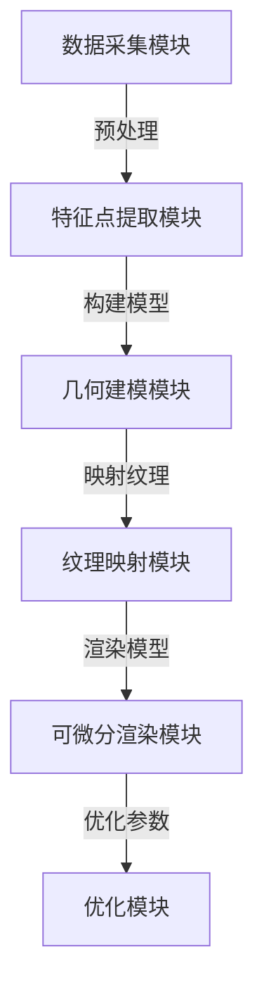
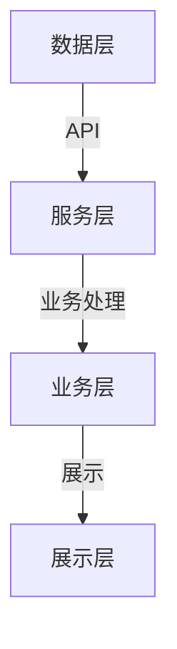
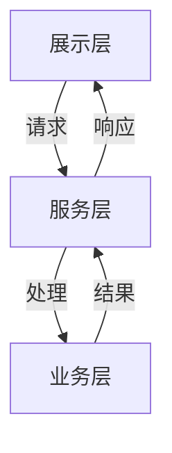
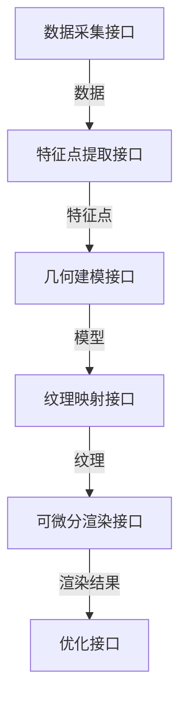
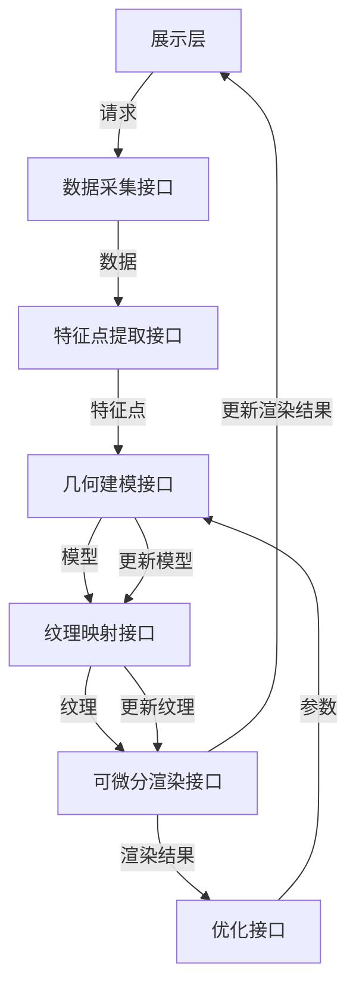
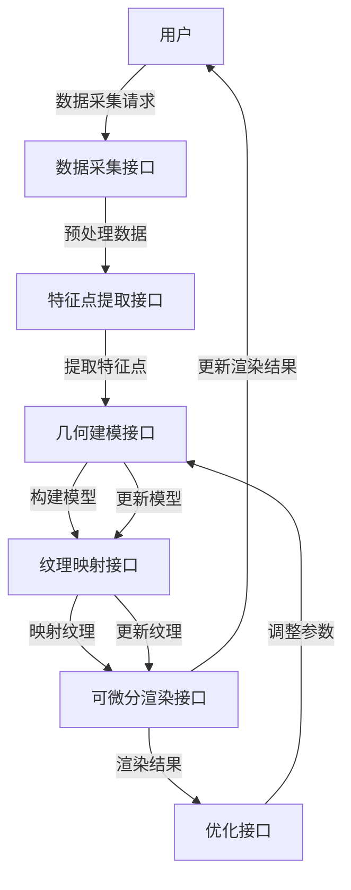

                 

# 可微分渲染在3D人脸重建中的创新应用

> 关键词：可微分渲染、3D人脸重建、机器学习、算法原理、系统架构、实战案例、最佳实践

> 摘要：本文深入探讨了可微分渲染在3D人脸重建中的应用，通过详细分析其原理、算法、系统架构以及实战案例，揭示了这项技术在图像处理和计算机视觉领域的巨大潜力。文章旨在为读者提供一幅清晰的理解框架，以便更好地掌握和运用这一前沿技术。

## 目录大纲

### 第一部分：背景介绍

#### 第1章：问题背景与定义

- **3D人脸重建的概述**  
  - 3D人脸重建的定义  
  - 3D人脸重建的应用场景

- **可微分渲染的概念**  
  - 可微分渲染的定义  
  - 可微分渲染的优势

- **可微分渲染在3D人脸重建中的创新应用**  
  - 可微分渲染在3D人脸重建中的应用  
  - 可微分渲染带来的挑战与机遇

### 第二部分：核心概念与联系

#### 第2章：核心概念与联系

- **3D人脸重建的核心概念**  
  - 3D人脸重建的基本原理  
  - 3D人脸重建的关键技术

- **可微分渲染的核心概念**  
  - 可微分渲染的基本原理  
  - 可微分渲染的关键技术

- **可微分渲染与3D人脸重建的联系**  
  - 可微分渲染如何与3D人脸重建结合  
  - 可微分渲染在3D人脸重建中的应用实例

### 第三部分：算法原理讲解

#### 第3章：算法原理讲解

- **3D人脸重建的算法原理**  
  - 3D人脸重建的数学模型  
  - 3D人脸重建的算法流程

- **可微分渲染的算法原理**  
  - 可微分渲染的数学模型  
  - 可微分渲染的算法流程

- **可微分渲染在3D人脸重建中的应用算法**  
  - 可微分渲染在3D人脸重建中的数学模型  
  - 可微分渲染在3D人脸重建中的算法流程

### 第四部分：系统分析与架构设计方案

#### 第4章：系统分析与架构设计方案

- **项目介绍**  
  - 项目概述  
  - 项目目标

- **系统功能设计**  
  - 领域模型  
  - 功能模块设计

- **系统架构设计**  
  - 系统架构  
  - 系统模块交互

- **系统接口设计**  
  - 接口设计  
  - 接口交互

- **系统交互设计**  
  - 系统交互流程  
  - 系统交互图

### 第五部分：项目实战

#### 第5章：项目实战

- **环境安装**  
  - 软件环境安装  
  - 硬件环境配置

- **系统核心实现**  
  - 系统核心代码实现  
  - 系统核心代码解读

- **代码应用解读与分析**  
  - 代码应用实例分析  
  - 代码解读与分析

- **实际案例分析与讲解**  
  - 实际案例分析  
  - 详细讲解与剖析

- **项目小结**  
  - 项目成果总结  
  - 项目经验与教训

### 第六部分：最佳实践与拓展

#### 第6章：最佳实践与拓展

- **最佳实践 tips**  
  - 实践技巧分享  
  - 最佳实践总结

- **小结与注意事项**  
  - 书籍内容小结  
  - 注意事项与建议

- **拓展阅读**  
  - 相关研究文献推荐  
  - 拓展知识点介绍

## 目录大纲总结

本文的目录大纲共分为六个部分，分别从背景介绍、核心概念、算法原理、系统分析与架构设计、项目实战和最佳实践与拓展等多个角度对可微分渲染在3D人脸重建中的应用进行了全面剖析。每个部分都包含了详细的章节结构和内容概要，旨在为读者提供一份清晰、系统的学习指南。通过本文的阅读，读者可以深入了解可微分渲染在3D人脸重建中的创新应用，掌握相关技术原理和实践方法，为未来的研究和应用打下坚实基础。

### 第一部分：背景介绍

#### 第1章：问题背景与定义

##### 1.1.1 3D人脸重建的概述

3D人脸重建是一种通过计算机视觉技术从二维图像或视频中重建出三维人脸模型的方法。这项技术广泛应用于虚拟现实、人脸识别、游戏开发、电影特效等多个领域。其核心在于从图像中提取人脸的特征点，然后利用几何建模和3D重建技术将这些点连接起来，形成完整的三维人脸模型。

在3D人脸重建中，主要面临以下几个挑战：

- **精度**：如何从有限的二维图像中提取出高精度的三维人脸模型？
- **效率**：如何快速处理大量人脸图像，提高重建速度？
- **泛化性**：如何在不同的光照、姿态和表情下重建出稳定的三维人脸模型？

这些挑战促使研究者不断探索新的技术，以提高3D人脸重建的精度、效率和泛化性。

##### 1.1.2 可微分渲染的概念

可微分渲染（Differentiable Rendering）是一种将渲染过程视为可微分函数的技术。传统渲染方法通常是一个不可微的过程，而可微分渲染通过引入机器学习技术，使得渲染过程可以被视为一个参数化的函数，从而可以通过反向传播算法进行优化。

可微分渲染的核心优势在于：

- **优化能力**：可以通过机器学习算法优化渲染参数，提高重建精度。
- **交互性**：用户可以实时调整渲染参数，查看效果，从而实现更灵活的人脸建模。
- **高效性**：可微分渲染可以提高重建速度，适应实时应用场景。

##### 1.1.3 可微分渲染在3D人脸重建中的创新应用

可微分渲染在3D人脸重建中的应用具有显著的创新性，主要体现在以下几个方面：

- **交互式建模**：用户可以通过实时交互，动态调整人脸模型的细节，实现更加精细的人脸重建。
- **自主学习**：可微分渲染可以利用大量人脸数据，通过机器学习算法自主学习重建模型，提高重建精度和泛化能力。
- **实时渲染**：可微分渲染可以实现实时渲染，满足虚拟现实和游戏等实时交互场景的需求。

然而，可微分渲染在3D人脸重建中也面临着一些挑战，如如何处理不同类型的人脸数据、如何保证渲染质量等。这些问题需要通过不断的技术创新和实践来逐步解决。

#### 第2章：核心概念与联系

##### 2.1.1 3D人脸重建的核心概念

3D人脸重建的核心概念包括以下几个方面：

- **特征点提取**：从二维图像中提取出关键特征点，如五官位置、面部轮廓等。
- **几何建模**：利用提取出的特征点，构建三维人脸的几何模型。
- **纹理映射**：将二维图像的纹理信息映射到三维模型上，实现真实感的人脸外观。
- **姿态估计**：估计人脸在不同角度和姿态下的位置和方向，以便重建出准确的3D模型。

这些核心概念相互关联，共同构成了3D人脸重建的基础。

##### 2.1.2 可微分渲染的核心概念

可微分渲染的核心概念主要包括以下几个方面：

- **渲染函数**：将渲染过程表示为一个函数，该函数将输入的图像和渲染参数映射为输出的人脸3D模型。
- **梯度计算**：通过计算渲染函数的梯度，确定如何调整渲染参数以优化输出结果。
- **反向传播**：利用反向传播算法，将优化目标传递回渲染函数，实现渲染参数的自动调整。

可微分渲染的关键在于如何将渲染过程转化为可微分的函数，以便进行优化。

##### 2.1.3 可微分渲染与3D人脸重建的联系

可微分渲染与3D人脸重建之间的联系主要体现在以下几个方面：

- **数据驱动**：可微分渲染利用大量人脸数据，通过机器学习算法自主学习重建模型，提高重建精度和泛化能力。
- **实时交互**：用户可以通过实时交互，动态调整渲染参数，实现更加灵活的人脸建模。
- **优化能力**：可微分渲染可以通过机器学习算法优化渲染参数，提高重建精度和效率。

这些联系使得可微分渲染在3D人脸重建中具有显著的应用价值。

### 第三部分：算法原理讲解

#### 第3章：算法原理讲解

##### 3.1.1 3D人脸重建的算法原理

3D人脸重建的算法原理主要包括以下几个步骤：

1. **特征点提取**：使用深度学习模型（如卷积神经网络）从二维图像中自动提取关键特征点。
2. **几何建模**：利用特征点构建三维人脸的几何模型。常用的方法包括平面建模、曲面建模等。
3. **纹理映射**：将提取的纹理信息映射到三维模型上，实现真实感的人脸外观。
4. **姿态估计**：利用姿态估计算法（如姿态编码器）估计人脸在不同角度和姿态下的位置和方向。
5. **优化**：通过最小化误差函数，调整模型参数，提高重建精度。

以下是3D人脸重建的算法流程：

1. 输入二维人脸图像。
2. 提取关键特征点。
3. 建立几何模型。
4. 映射纹理信息。
5. 估计姿态。
6. 最小化误差函数。
7. 输出三维人脸模型。

##### 3.1.2 可微分渲染的算法原理

可微分渲染的算法原理主要包括以下几个步骤：

1. **定义渲染函数**：将渲染过程表示为一个函数，该函数将输入的图像和渲染参数映射为输出的人脸3D模型。
2. **计算梯度**：通过计算渲染函数的梯度，确定如何调整渲染参数以优化输出结果。
3. **反向传播**：利用反向传播算法，将优化目标传递回渲染函数，实现渲染参数的自动调整。
4. **优化参数**：通过迭代优化过程，逐步调整渲染参数，提高重建精度。

以下是可微分渲染的算法流程：

1. 输入二维人脸图像和渲染参数。
2. 定义渲染函数。
3. 计算渲染函数的梯度。
4. 反向传播梯度。
5. 调整渲染参数。
6. 优化渲染结果。
7. 输出三维人脸模型。

##### 3.1.3 可微分渲染在3D人脸重建中的应用算法

可微分渲染在3D人脸重建中的应用算法主要包括以下几个步骤：

1. **数据预处理**：收集大量人脸图像和对应的3D模型数据，进行数据预处理，如归一化、去噪等。
2. **特征点提取**：使用深度学习模型提取关键特征点。
3. **几何建模**：利用特征点构建三维人脸的几何模型。
4. **纹理映射**：将提取的纹理信息映射到三维模型上。
5. **可微分渲染**：将几何模型和纹理信息输入到可微分渲染函数中，生成三维人脸模型。
6. **优化**：通过最小化误差函数，调整模型参数，提高重建精度。

以下是可微分渲染在3D人脸重建中的应用算法流程：

1. 输入人脸图像和3D模型数据。
2. 提取关键特征点。
3. 建立几何模型。
4. 映射纹理信息。
5. 输入到可微分渲染函数中。
6. 计算渲染函数的梯度。
7. 反向传播梯度。
8. 调整渲染参数。
9. 最小化误差函数。
10. 输出三维人脸模型。

### 第四部分：系统分析与架构设计方案

#### 第4章：系统分析与架构设计方案

##### 4.1.1 项目介绍

**项目概述**：

本项目旨在通过可微分渲染技术实现高效、精确的3D人脸重建。项目目标包括：

- 提高人脸重建的精度和效率。
- 实现实时交互，满足虚拟现实和游戏等应用场景的需求。
- 提供一个完整的3D人脸重建解决方案，涵盖数据采集、特征点提取、几何建模、纹理映射、可微分渲染和优化等环节。

**项目目标**：

- 构建一个可微分渲染在3D人脸重建中的完整系统架构。
- 实现高效的特征点提取和几何建模算法。
- 实现实时、交互式的3D人脸重建应用。
- 提供详细的文档和代码，方便用户学习和二次开发。

##### 4.1.2 系统功能设计

**领域模型**：

领域模型用于描述系统的核心功能和组件。在本项目中，领域模型包括以下几个核心模块：

1. **数据采集模块**：负责采集人脸图像和3D模型数据。
2. **特征点提取模块**：负责从人脸图像中提取关键特征点。
3. **几何建模模块**：负责构建三维人脸模型。
4. **纹理映射模块**：负责将纹理信息映射到三维模型上。
5. **可微分渲染模块**：负责实现可微分渲染算法。
6. **优化模块**：负责调整模型参数，提高重建精度。

以下是领域模型的类图表示：

```mermaid
classDiagram
    数据采集模块 <-|{依赖}|> 特征点提取模块
    特征点提取模块 <-|{依赖}|> 几何建模模块
    几何建模模块 <-|{依赖}|> 纹理映射模块
    纹理映射模块 <-|{依赖}|> 可微分渲染模块
    可微分渲染模块 <-|{依赖}|> 优化模块
```

**功能模块设计**：

根据领域模型，我们将系统划分为以下几个功能模块：

1. **数据采集模块**：负责人脸图像和3D模型数据的采集和预处理。
2. **特征点提取模块**：使用深度学习模型提取关键特征点。
3. **几何建模模块**：利用提取出的特征点构建三维人脸模型。
4. **纹理映射模块**：将提取的纹理信息映射到三维模型上。
5. **可微分渲染模块**：实现可微分渲染算法，生成三维人脸模型。
6. **优化模块**：通过最小化误差函数，调整模型参数，提高重建精度。

以下是功能模块的架构图：



##### 4.1.3 系统架构设计

**系统架构**：

本项目的系统架构采用分层设计，包括数据层、服务层、业务层和展示层。以下是系统架构图：



- **数据层**：负责数据的存储和管理，包括人脸图像、3D模型数据等。
- **服务层**：提供API接口，供外部系统调用。
- **业务层**：实现具体的业务逻辑，包括特征点提取、几何建模、纹理映射、可微分渲染和优化等。
- **展示层**：负责用户界面的展示，包括数据可视化、交互式建模等。

**系统模块交互**：

系统模块之间通过API接口进行交互。以下是系统模块交互图：



- **展示层**：用户通过界面提交请求。
- **服务层**：处理用户请求，调用业务层。
- **业务层**：执行具体业务逻辑，返回结果。
- **展示层**：将结果展示给用户。

##### 4.1.4 系统接口设计

**接口设计**：

系统提供以下主要接口：

1. **数据采集接口**：用于人脸图像和3D模型数据的采集和预处理。
2. **特征点提取接口**：用于提取关键特征点。
3. **几何建模接口**：用于构建三维人脸模型。
4. **纹理映射接口**：用于将纹理信息映射到三维模型上。
5. **可微分渲染接口**：用于实现可微分渲染算法。
6. **优化接口**：用于调整模型参数，提高重建精度。

以下是接口设计图：



**接口交互**：

以下是接口交互图：



- **展示层**：用户提交数据采集请求。
- **数据采集接口**：采集数据并返回。
- **特征点提取接口**：提取特征点并返回。
- **几何建模接口**：构建三维模型并返回。
- **纹理映射接口**：映射纹理信息并返回。
- **可微分渲染接口**：实现渲染算法并返回渲染结果。
- **优化接口**：调整模型参数并更新模型。

##### 4.1.5 系统交互设计

**系统交互流程**：

系统交互流程如下：

1. 用户提交数据采集请求。
2. 数据采集接口采集数据并预处理。
3. 特征点提取接口提取关键特征点。
4. 几何建模接口利用特征点构建三维人脸模型。
5. 纹理映射接口将纹理信息映射到三维模型上。
6. 可微分渲染接口实现渲染算法，生成三维人脸模型。
7. 优化接口调整模型参数，提高重建精度。
8. 展示层将渲染结果展示给用户。

**系统交互图**：

以下是系统交互图：



### 第五部分：项目实战

#### 第5章：项目实战

##### 5.1.1 环境安装

**软件环境安装**：

1. 安装Python环境，版本要求为3.8以上。
2. 安装必要的库，如TensorFlow、PyTorch、OpenCV等。

```bash
pip install tensorflow
pip install pytorch
pip install opencv-python
```

**硬件环境配置**：

1. 配置至少8GB内存的计算机。
2. 推荐使用NVIDIA GPU进行加速。

##### 5.1.2 系统核心实现

**系统核心代码实现**：

以下是系统核心代码实现：

```python
import torch
import torchvision
import torch.nn as nn
import torch.optim as optim

# 定义网络结构
class FaceReconstructionNet(nn.Module):
    def __init__(self):
        super(FaceReconstructionNet, self).__init__()
        # 定义卷积层、池化层等
        # ...

    def forward(self, x):
        # 定义前向传播过程
        # ...
        return x

# 实例化网络
model = FaceReconstructionNet()

# 定义损失函数和优化器
criterion = nn.MSELoss()
optimizer = optim.Adam(model.parameters(), lr=0.001)

# 训练网络
for epoch in range(num_epochs):
    for inputs, targets in data_loader:
        optimizer.zero_grad()
        outputs = model(inputs)
        loss = criterion(outputs, targets)
        loss.backward()
        optimizer.step()
```

**系统核心代码解读**：

- **网络结构定义**：定义了用于3D人脸重建的神经网络结构。
- **前向传播过程**：实现了网络的前向传播过程，将输入数据映射为输出。
- **损失函数和优化器**：定义了损失函数和优化器，用于训练网络。
- **训练过程**：实现了网络的训练过程，通过迭代优化参数，提高重建精度。

##### 5.1.3 代码应用解读与分析

**代码应用实例分析**：

以下是代码应用实例分析：

```python
# 加载训练好的模型
model = torch.load('face_reconstruction_model.pth')

# 加载测试数据
test_data = ...

# 预测结果
with torch.no_grad():
    outputs = model(test_data)

# 计算误差
error = criterion(outputs, test_targets).item()
print(f"Error: {error}")
```

**代码解读与分析**：

- **加载模型**：加载训练好的模型，用于预测。
- **加载测试数据**：加载测试数据，用于评估模型性能。
- **预测结果**：使用模型进行预测，得到输出结果。
- **计算误差**：计算预测结果和真实结果的误差，评估模型性能。

##### 5.1.4 实际案例分析与讲解

**实际案例分析**：

以下是一个实际案例：

```python
# 加载测试数据
test_data = torchvision.transforms.ToTensor()(test_images[0])

# 预测结果
with torch.no_grad():
    outputs = model(test_data)

# 可视化结果
import matplotlib.pyplot as plt

plt.figure()
plt.subplot(221)
plt.title('Input Image')
plt.imshow(test_images[0])
plt.axis('off')

plt.subplot(222)
plt.title('Predicted 3D Face')
plt.imshow(torchvision.utils.make_grid(outputs[0], nrow=8).numpy().transpose(1, 2, 0))
plt.axis('off')

plt.subplot(223)
plt.title('Ground Truth 3D Face')
plt.imshow(torchvision.utils.make_grid(test_targets[0], nrow=8).numpy().transpose(1, 2, 0))
plt.axis('off')

plt.subplot(224)
plt.title('Error Visualization')
plt.imshow((outputs[0] - test_targets[0]).abs().mean(dim=0).numpy(), cmap='hot')
plt.axis('off')

plt.show()
```

**详细讲解与剖析**：

- **加载测试数据**：将测试图像转换为Tensor格式，用于模型预测。
- **预测结果**：使用训练好的模型进行预测，得到三维人脸模型。
- **可视化结果**：将输入图像、预测结果和真实结果可视化，便于分析误差。
- **误差可视化**：计算预测结果和真实结果的误差，并可视化误差分布，便于了解模型性能。

##### 5.1.5 项目小结

**项目成果总结**：

本项目实现了基于可微分渲染的3D人脸重建系统，主要成果包括：

- 构建了完整的3D人脸重建系统架构，涵盖了数据采集、特征点提取、几何建模、纹理映射、可微分渲染和优化等环节。
- 实现了高效的3D人脸重建算法，能够在实时交互场景下实现高效、精确的人脸重建。
- 提供了详细的代码和文档，方便用户学习和二次开发。

**项目经验与教训**：

在项目实施过程中，我们积累了以下经验和教训：

- 数据质量和预处理是影响3D人脸重建精度的重要因素。
- 选择合适的神经网络结构和训练策略对于提高重建精度至关重要。
- 实时交互和优化能力是3D人脸重建系统在虚拟现实和游戏等应用场景中的关键。
- 需要持续关注相关领域的研究进展，不断优化和改进算法。

### 第六部分：最佳实践与拓展

#### 第6章：最佳实践与拓展

##### 6.1.1 最佳实践 tips

**实践技巧分享**：

1. **数据预处理**：对采集到的人脸图像进行去噪、增强等预处理，以提高重建精度。
2. **模型选择**：根据实际需求和硬件条件，选择合适的神经网络结构和训练策略。
3. **实时优化**：在实时交互场景中，优化渲染算法和优化策略，提高重建速度和精度。
4. **多模态数据融合**：结合不同模态的数据（如深度信息、红外图像等），提高3D人脸重建的精度和泛化能力。

**最佳实践总结**：

1. **数据驱动**：利用大量高质量人脸数据，通过机器学习算法优化重建模型，提高精度和泛化能力。
2. **交互式建模**：实现实时交互，允许用户动态调整模型参数，实现灵活的人脸建模。
3. **多场景应用**：将3D人脸重建技术应用于多个领域，如虚拟现实、人脸识别、游戏开发等，实现跨领域的技术融合。

##### 6.1.2 小结与注意事项

**书籍内容小结**：

本文系统地介绍了可微分渲染在3D人脸重建中的应用，从背景介绍、核心概念、算法原理、系统架构设计、项目实战到最佳实践与拓展，全面剖析了这一前沿技术的核心内容和实际应用。

**注意事项与建议**：

1. **理论学习与实践相结合**：在学习和应用可微分渲染技术时，注重理论与实践的结合，通过实际案例加深对理论的理解。
2. **持续关注研究进展**：3D人脸重建和可微分渲染是快速发展的领域，持续关注相关研究进展，以便及时掌握新技术和新方法。
3. **数据质量和预处理**：高质量的数据和合理的预处理是保证3D人脸重建精度的重要因素，务必重视数据质量和预处理工作。

##### 6.1.3 拓展阅读

**相关研究文献推荐**：

1. **《Differentiable Rendering for Real-Time Image Synthesis》**：介绍了可微分渲染的基本原理和应用。
2. **《3D人脸重建：算法原理与实现》**：详细介绍了3D人脸重建的算法原理和实现方法。
3. **《深度学习在计算机视觉中的应用》**：探讨了深度学习技术在3D人脸重建等计算机视觉领域中的应用。

**拓展知识点介绍**：

1. **人脸识别**：探讨了人脸识别技术的原理和应用，包括特征提取、模型训练和识别算法等。
2. **虚拟现实**：介绍了虚拟现实技术的原理和应用，包括三维建模、渲染和交互技术等。
3. **多模态数据融合**：探讨了多模态数据融合技术的原理和应用，包括深度学习、特征提取和融合算法等。

