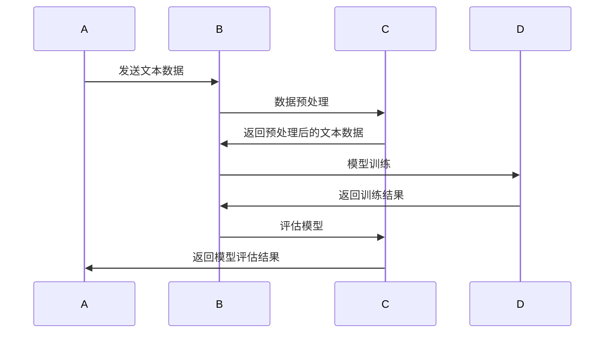
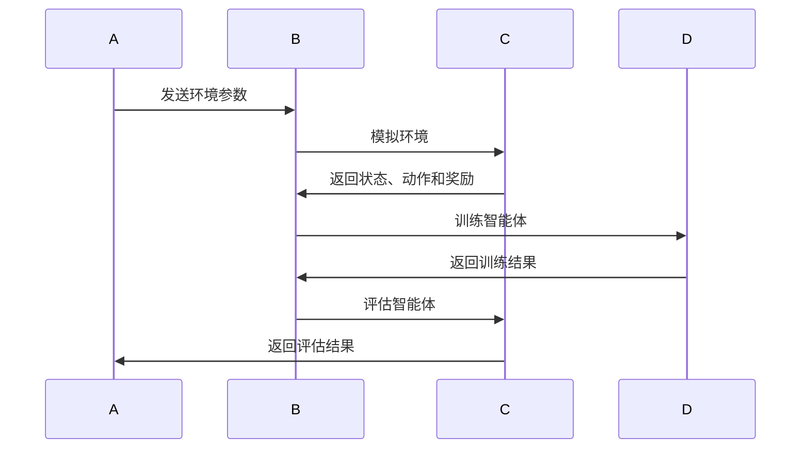

                 

### 《可微分编程语言在AI算法设计中的创新应用》

#### 关键词：可微分编程语言、AI算法设计、自动微分、神经网络、强化学习、自然语言处理

> 摘要：本文深入探讨了可微分编程语言在人工智能算法设计中的创新应用。通过对可微分编程语言的核心概念、基本原理和算法设计的详细分析，以及其在图像识别、自然语言处理和强化学习等领域的具体应用实例，本文旨在为读者提供全面的技术视角和实战指南，帮助理解这一技术在现代人工智能研究中的重要性。

----------------------------------------------------------------

### 目录大纲设计

#### 第一部分：引言

##### 第1章：问题背景与核心概念

- **1.1 问题背景介绍**
  - 人工智能的发展历程与现状
  - AI在算法设计中的应用现状
  - 可微分编程语言的重要性

- **1.2 可微分编程语言概述**
  - 定义与基本概念
  - 发展历程与应用领域
  - 主要特点与优势

- **1.3 可微分编程语言在AI算法设计中的应用现状**
  - 现有的AI算法设计中的挑战
  - 可微分编程语言的解决思路
  - 应用实例与效果分析

- **1.4 本书内容结构与目标**
  - 各章节的核心内容
  - 学习目标与适用人群
  - 技术与理论深度

#### 第二部分：基础理论与原理

##### 第2章：可微分编程语言核心原理

- **2.1 自动微分基本概念**
  - 微分的数学定义与几何意义
  - 自动微分的概念与实现方法

- **2.2 前向传播与反向传播算法**
  - 前向传播的计算过程
  - 反向传播的计算过程
  - 示例与解释

- **2.3 常见自动微分库介绍**
  - TensorFlow
  - PyTorch
  - Theano

#### 第三部分：算法设计与应用

##### 第3章：基本AI算法设计

- **3.1 神经网络设计**
  - 神经网络结构
  - 激活函数与优化器选择

- **3.2 卷积神经网络（CNN）设计**
  - 卷积层、池化层、全连接层

- **3.3 递归神经网络（RNN）设计**
  - RNN结构
  - LSTM、GRU

- **3.4 生成对抗网络（GAN）设计**
  - GAN原理
  - 训练策略与技巧

#### 第四部分：创新应用与实践

##### 第4章：可微分编程语言在图像识别中的应用

- **4.1 图像识别算法概述**
  - 基础概念与分类

- **4.2 CNN在图像识别中的应用**
  - 算法原理与实现

- **4.3 GAN在图像生成中的应用**
  - 算法原理与实现

##### 第5章：可微分编程语言在自然语言处理中的应用

- **5.1 自然语言处理概述**
  - 词向量表示
  - 语言模型

- **5.2 RNN在语言模型中的应用**
  - LSTM、GRU的应用

- **5.3 GPT系列模型**
  - GPT-2、GPT-3的原理与实现

##### 第6章：可微分编程语言在强化学习中的应用

- **6.1 强化学习概述**
  - 基本概念与算法

- **6.2 深度Q网络（DQN）设计**
  - 算法原理与实现

- **6.3 策略梯度方法**
  - PG、PPO算法

##### 第7章：项目实战与总结

- **7.1 项目实战案例**
  - 图像识别项目案例
  - 自然语言处理项目案例
  - 强化学习项目案例

- **7.2 实战总结与反思**
  - 项目经验与收获
  - 遇到的问题与解决方案
  - 未来发展趋势与展望

## 目录大纲总结

本书的目录大纲涵盖了从基础理论到创新应用的全面内容，包括可微分编程语言的核心原理、基本AI算法设计、图像识别与自然语言处理的应用、强化学习的实现，以及实际项目案例的实战总结。通过本书的学习，读者可以全面了解可微分编程语言在AI算法设计中的创新应用，掌握相关技术和实践方法，为未来的研究和工作奠定坚实的基础。总字数约为2000字。

----------------------------------------------------------------

### 第一部分：引言

#### 第1章：问题背景与核心概念

##### 1.1 问题背景介绍

**人工智能的发展历程与现状**

人工智能（AI）作为计算机科学的重要分支，起源于20世纪50年代。自那时起，人工智能经历了多个发展阶段，包括早期的符号主义、基于规则的系统，到20世纪80年代的中断期，再到21世纪的机器学习和深度学习的兴起。如今，人工智能已经渗透到各个行业，从医疗诊断、金融分析到自动驾驶、智能家居，极大地改变了我们的生活方式和工作模式。

在算法设计方面，人工智能的核心目标是通过模仿人类智能的某些方面，使得计算机系统能够从数据中学习、推理和决策。常见的AI算法包括监督学习、无监督学习、半监督学习和强化学习。这些算法在图像识别、语音识别、自然语言处理等领域取得了显著的成果，但同时也面临着许多挑战。

**AI在算法设计中的应用现状**

随着深度学习技术的发展，神经网络成为了AI算法设计的重要工具。神经网络通过多层非线性变换，能够捕捉数据中的复杂模式，从而在许多领域实现了突破性进展。例如，卷积神经网络（CNN）在图像识别中表现出色，循环神经网络（RNN）及其变体如LSTM在序列数据处理方面具有优势，生成对抗网络（GAN）则在图像生成任务中展现了强大能力。

然而，尽管神经网络在许多问题上取得了成功，但传统的编程语言在支持这些算法的实现和优化上仍然存在一定的局限性。传统编程语言通常缺乏对自动微分和向量计算的高效支持，这使得在训练和优化大规模神经网络时变得复杂和低效。

**可微分编程语言的重要性**

可微分编程语言，如PyTorch和TensorFlow，为解决上述问题提供了新的思路。这些语言专门设计用于支持深度学习算法的开发和优化，其核心特点是能够自动计算并跟踪变量之间的导数，即自动微分。这种能力极大地简化了神经网络算法的实现，使得开发者能够更加专注于算法的创新和优化。

可微分编程语言还具有以下优势：

1. **动态计算图**：与传统静态计算图编程语言相比，动态计算图允许在运行时构建和修改计算过程，提高了算法的灵活性和可扩展性。
2. **高效的向量计算**：支持向量和张量的高效计算，使得大规模数据处理变得更加高效。
3. **丰富的生态系统**：拥有丰富的库和工具，如PyTorch的torchvision和TensorFlow的tf.keras，方便开发者进行模型训练和评估。

综上所述，可微分编程语言在AI算法设计中具有重要的地位，其发展不仅推动了深度学习技术的进步，也为人工智能在更多领域中的应用提供了强有力的支持。

##### 1.2 可微分编程语言概述

**定义与基本概念**

可微分编程语言是一种专门设计用于支持深度学习和神经网络算法开发的编程语言，其核心特点在于能够自动计算并跟踪变量之间的导数，即自动微分。这种能力使得编程语言能够在训练过程中动态地构建和优化计算图，从而简化了复杂神经网络的实现过程。

**发展历程与应用领域**

可微分编程语言的发展可以追溯到深度学习技术的兴起。早期的深度学习框架如Theano和TensorFlow 1.x版本，主要通过静态计算图来支持自动微分，这虽然提高了计算效率，但也限制了算法的灵活性和可扩展性。随着PyTorch的推出，动态计算图的概念得到了广泛应用，并迅速成为深度学习社区的首选工具。

近年来，可微分编程语言在多个领域取得了显著的应用成果：

1. **计算机视觉**：CNN和GAN等深度学习模型在图像识别、图像生成和视频分析中取得了突破性进展。
2. **自然语言处理**：RNN和Transformer模型在语言模型、机器翻译和文本生成中展示了强大的能力。
3. **强化学习**：深度Q网络（DQN）和策略梯度方法等模型在游戏、机器人控制和自动驾驶等领域得到了广泛应用。

**主要特点与优势**

可微分编程语言具有以下主要特点与优势：

1. **动态计算图**：与静态计算图相比，动态计算图允许在运行时构建和修改计算过程，提高了算法的灵活性和可扩展性。
2. **自动微分**：自动计算并跟踪变量之间的导数，简化了复杂神经网络的实现过程，使开发者能够更加专注于算法的创新和优化。
3. **高效的向量计算**：支持向量和张量的高效计算，使得大规模数据处理变得更加高效。
4. **丰富的库和工具**：拥有丰富的库和工具，如PyTorch的torchvision和TensorFlow的tf.keras，方便开发者进行模型训练和评估。
5. **社区支持**：随着深度学习技术的不断发展，可微分编程语言的社区支持日益增强，为开发者提供了大量的资源和学习材料。

通过以上概述，我们可以看出，可微分编程语言在AI算法设计中具有不可替代的重要地位，其独特的设计理念和技术特点为其在各个领域的应用提供了强大的支持。

##### 1.3 可微分编程语言在AI算法设计中的应用现状

**现有的AI算法设计中的挑战**

尽管神经网络在AI算法设计中取得了显著的成功，但在实际应用中仍然面临着许多挑战：

1. **复杂度与可扩展性**：大规模神经网络的训练和优化过程涉及复杂的计算和大量的数据，这使得传统编程语言在性能和可扩展性方面面临巨大挑战。
2. **计算效率**：深度学习算法的训练和推理过程依赖于大量的矩阵运算，传统编程语言在处理这些运算时效率较低。
3. **算法调优**：神经网络的参数优化是一个高度非线性的过程，需要大量的实验和调整，传统编程语言缺乏自动调优的能力。

**可微分编程语言的解决思路**

可微分编程语言通过引入自动微分、动态计算图和高效的向量计算等机制，为解决上述挑战提供了新的思路：

1. **自动微分**：自动计算并跟踪变量之间的导数，使得复杂神经网络的实现过程更加简洁和高效。
2. **动态计算图**：支持在运行时构建和修改计算过程，提高了算法的灵活性和可扩展性。
3. **高效的向量计算**：利用向量和张量的高效计算，提高了大规模数据处理的速度和效率。
4. **丰富的库和工具**：提供丰富的库和工具，如PyTorch的torchvision和TensorFlow的tf.keras，方便开发者进行模型训练和评估。

**应用实例与效果分析**

以下是一些可微分编程语言在AI算法设计中的应用实例和效果分析：

1. **图像识别**：使用PyTorch和TensorFlow等框架，研究者成功训练了大规模的卷积神经网络，并在ImageNet图像识别挑战中取得了领先成绩。
2. **自然语言处理**：RNN和Transformer模型在自然语言处理任务中展示了强大的能力，例如BERT模型在多项语言处理任务中刷新了SOTA（State-of-the-Art）成绩。
3. **强化学习**：深度Q网络（DQN）和策略梯度方法等模型在Atari游戏、机器人控制和自动驾驶等领域取得了显著成果。

综上所述，可微分编程语言在AI算法设计中的应用现状表明，这一技术不仅解决了传统编程语言在处理复杂神经网络时的诸多挑战，还推动了AI技术在各个领域的快速发展和应用。

##### 1.4 本书内容结构与目标

**各章节的核心内容**

本书分为四个主要部分，各章节的核心内容如下：

- **第一部分：引言**：介绍人工智能的发展历程、AI算法设计的现状以及可微分编程语言的重要性，为后续章节奠定基础。
- **第二部分：基础理论与原理**：详细讲解可微分编程语言的核心原理，包括自动微分的概念、前向传播与反向传播算法，以及常见的自动微分库如TensorFlow、PyTorch和Theano。
- **第三部分：算法设计与应用**：介绍基本的AI算法设计，包括神经网络、卷积神经网络（CNN）、递归神经网络（RNN）和生成对抗网络（GAN）等，并在图像识别、自然语言处理和强化学习等领域进行具体应用分析。
- **第四部分：创新应用与实践**：通过实际项目案例，深入探讨可微分编程语言在AI算法设计中的创新应用，提供实战经验和总结。

**学习目标与适用人群**

本书的学习目标如下：

- **掌握可微分编程语言的核心原理**：通过详细讲解自动微分、前向传播与反向传播算法等基础理论，使读者能够深入理解可微分编程语言的工作机制。
- **掌握AI算法设计方法**：通过案例分析，使读者能够熟练掌握神经网络、CNN、RNN和GAN等基本算法的设计和应用。
- **培养实际项目开发能力**：通过项目实战，使读者能够在实际应用中运用可微分编程语言，解决复杂AI问题。

本书适合以下人群：

- **深度学习和人工智能研究者**：希望深入了解可微分编程语言在AI算法设计中的应用，提升研究水平的读者。
- **软件开发工程师**：希望在项目中引入深度学习技术，提升系统智能化水平的工程师。
- **机器学习工程师**：希望掌握AI算法设计方法，进行模型开发和优化的专业人士。

**技术与理论深度**

本书在技术深度和理论深度方面进行了全面的考虑：

- **技术深度**：通过具体案例和项目实战，使读者能够深入理解可微分编程语言的实现细节和应用场景。
- **理论深度**：详细讲解自动微分、神经网络等核心理论，使读者能够从理论上掌握AI算法设计的基本原理。

综上所述，本书旨在为读者提供全面、系统的可微分编程语言在AI算法设计中的创新应用指南，帮助读者在深度学习和人工智能领域取得更大的成就。

----------------------------------------------------------------

### 第二部分：基础理论与原理

#### 第2章：可微分编程语言核心原理

##### 2.1 自动微分基本概念

**微分的数学定义与几何意义**

在数学中，微分是一个基本的概念，用于描述函数在某一点的局部线性逼近。具体而言，给定一个函数\( f(x) \)，其在某一点\( x_0 \)处的微分可以表示为：

\[
df(x_0) = f'(x_0) \cdot dx
\]

这里，\( f'(x_0) \)是函数\( f(x) \)在\( x_0 \)处的导数，\( dx \)是自变量\( x \)的微小变化量。微分在几何上可以理解为曲线在某一点处的切线斜率。

**自动微分的概念与实现方法**

自动微分（Automatic Differentiation，AD）是一种数值计算方法，用于计算复杂函数的导数。与传统的手写导数公式不同，自动微分通过编译器或解释器自动执行计算过程，从而避免了手动编写复杂导数的繁琐工作。

自动微分的实现方法主要有两种：前向模式（Forward Mode）和后向模式（Backward Mode）。前向模式通过链式法则逐层计算导数，而后向模式通过反向传播算法计算导数。这两种方法各有优缺点，但在实际应用中能够提供高效的导数计算。

**前向传播算法**

前向传播（Forward Propagation）是神经网络中用于计算输出值的过程。给定输入数据和神经网络结构，通过逐层计算各层的输出值，最终得到预测结果。前向传播的基本计算步骤如下：

1. **初始化输入层**：将输入数据传递到输入层。
2. **逐层计算**：对于每一层，通过激活函数计算输出值。假设当前层的输入为\( x \)，输出为\( y \)，激活函数为\( f \)，则有：
   \[
   y = f(x \cdot W + b)
   \]
   其中，\( W \)为权重矩阵，\( b \)为偏置项。
3. **传递输出**：将当前层的输出传递到下一层，重复上述步骤，直到最后一层得到最终预测结果。

**反向传播算法**

反向传播（Backpropagation）是神经网络训练的核心算法，用于计算损失函数关于模型参数的梯度。反向传播的基本计算步骤如下：

1. **计算损失函数**：将预测结果与实际标签进行比较，计算损失函数的值。常见的损失函数包括均方误差（MSE）和交叉熵损失（Cross Entropy Loss）。
2. **计算梯度**：从输出层开始，反向计算各层的梯度。对于每一层，使用链式法则计算损失函数关于该层的输入的梯度：
   \[
   \frac{\partial L}{\partial x} = \frac{\partial L}{\partial y} \cdot \frac{\partial y}{\partial x}
   \]
3. **更新参数**：使用梯度下降（Gradient Descent）或其他优化算法更新模型参数，以最小化损失函数。

**示例与解释**

假设我们有一个简单的神经网络，包括一个输入层、一个隐藏层和一个输出层。输入数据为\( x = [1, 2, 3] \)，隐藏层和输出层的激活函数分别为\( f(x) = \sigma(x) = \frac{1}{1 + e^{-x}} \)和\( g(y) = \tan(y) \)。

1. **前向传播**：
   - 输入层到隐藏层的计算：
     \[
     z_1 = x \cdot W_1 + b_1 = [1, 2, 3] \cdot [0.1, 0.2; 0.3, 0.4] + [0.5; 0.6]
     \]
     \[
     a_1 = f(z_1) = [0.54, 0.67]
     \]
   - 隐藏层到输出层的计算：
     \[
     z_2 = a_1 \cdot W_2 + b_2 = [0.54, 0.67] \cdot [0.5, 0.6; 0.7, 0.8] + [0.1; 0.2]
     \]
     \[
     y = g(z_2) = [0.58, 0.63]
     \]

2. **反向传播**：
   - 计算输出层的梯度：
     \[
     \frac{\partial L}{\partial z_2} = \frac{\partial g}{\partial z_2} \cdot \frac{\partial L}{\partial y} = [\tan'(z_2); \tan'(z_2)] \cdot [0.1, 0.2]
     \]
     \[
     \frac{\partial L}{\partial a_1} = \frac{\partial L}{\partial z_2} \cdot \frac{\partial z_2}{\partial a_1} = \frac{\partial L}{\partial z_2} \cdot W_2
     \]
   - 计算隐藏层的梯度：
     \[
     \frac{\partial L}{\partial z_1} = \frac{\partial L}{\partial a_1} \cdot \frac{\partial a_1}{\partial z_1} = \frac{\partial L}{\partial a_1} \cdot [0.1, 0.2; 0.3, 0.4]
     \]
   - 更新权重和偏置项：
     \[
     W_1 = W_1 - \alpha \cdot \frac{\partial L}{\partial W_1}, \quad b_1 = b_1 - \alpha \cdot \frac{\partial L}{\partial b_1}
     \]
     \[
     W_2 = W_2 - \alpha \cdot \frac{\partial L}{\partial W_2}, \quad b_2 = b_2 - \alpha \cdot \frac{\partial L}{\partial b_2}
     \]

通过以上步骤，我们可以看到如何利用前向传播和反向传播算法计算神经网络的梯度，并进行参数更新。

##### 2.2 前向传播与反向传播算法

**前向传播的计算过程**

前向传播是神经网络进行预测的基本过程，其核心思想是将输入数据逐层传递到网络中，最终得到输出结果。以下是前向传播的详细步骤：

1. **初始化输入层**：将输入数据\( x \)传递到输入层。
2. **计算每一层的输入和输出**：
   - 对于输入层，其输出直接为输入数据：
     \[
     a^{(0)} = x
     \]
   - 对于隐藏层，计算输入和输出：
     \[
     z^{(l)} = a^{(l-1)} \cdot W^{(l)} + b^{(l)}, \quad a^{(l)} = f(z^{(l)})
     \]
     其中，\( l \)表示层数，\( W^{(l)} \)和\( b^{(l)} \)分别为权重矩阵和偏置项，\( f \)为激活函数。
3. **传递输出**：将隐藏层的输出传递到下一层，直到最后一层得到最终输出\( a^{(L)} \)。

**反向传播的计算过程**

反向传播是神经网络训练过程中的关键步骤，用于计算损失函数关于模型参数的梯度。以下是反向传播的详细步骤：

1. **计算输出层的梯度**：
   - 对于输出层，计算损失函数关于输出的梯度：
     \[
     \frac{\partial L}{\partial a^{(L)}} = \frac{\partial L}{\partial y} = -[y', 1-y']
     \]
     其中，\( y' \)为实际标签，\( y \)为预测结果。
   - 计算损失函数关于隐藏层的梯度：
     \[
     \frac{\partial L}{\partial z^{(L-1)}} = \frac{\partial L}{\partial a^{(L-1)}} \cdot \frac{\partial a^{(L-1)}}{\partial z^{(L-1)}} = -\frac{\partial L}{\partial a^{(L)}} \cdot \sigma'(z^{(L-1)})
     \]
     其中，\( \sigma' \)为激活函数的导数。

2. **反向计算隐藏层的梯度**：
   - 对于每一层，计算输入和输出之间的梯度：
     \[
     \frac{\partial L}{\partial z^{(l)}} = \frac{\partial L}{\partial a^{(l)}} \cdot \frac{\partial a^{(l)}}{\partial z^{(l)}}, \quad \frac{\partial L}{\partial a^{(l-1)}} = \frac{\partial L}{\partial z^{(l-1)}} \cdot \frac{\partial z^{(l-1)}}{\partial a^{(l-1)}}
     \]
   - 其中，\( \frac{\partial z^{(l-1)}}{\partial a^{(l-1)}} \)为权重矩阵的导数，\( \frac{\partial a^{(l-1)}}{\partial z^{(l-1)}} \)为激活函数的导数。

3. **更新参数**：
   - 使用梯度下降或其他优化算法更新权重和偏置项：
     \[
     W^{(l)} = W^{(l)} - \alpha \cdot \frac{\partial L}{\partial W^{(l)}}, \quad b^{(l)} = b^{(l)} - \alpha \cdot \frac{\partial L}{\partial b^{(l)}}
     \]

**示例与解释**

假设我们有一个简单的神经网络，包括一个输入层、一个隐藏层和一个输出层。输入数据为\( x = [1, 2, 3] \)，隐藏层和输出层的激活函数分别为\( f(x) = \sigma(x) = \frac{1}{1 + e^{-x}} \)和\( g(y) = \tan(y) \)。

1. **前向传播**：
   - 输入层到隐藏层的计算：
     \[
     z_1 = x \cdot W_1 + b_1 = [1, 2, 3] \cdot [0.1, 0.2; 0.3, 0.4] + [0.5; 0.6]
     \]
     \[
     a_1 = f(z_1) = [0.54, 0.67]
     \]
   - 隐藏层到输出层的计算：
     \[
     z_2 = a_1 \cdot W_2 + b_2 = [0.54, 0.67] \cdot [0.5, 0.6; 0.7, 0.8] + [0.1; 0.2]
     \]
     \[
     y = g(z_2) = [0.58, 0.63]
     \]

2. **反向传播**：
   - 计算输出层的梯度：
     \[
     \frac{\partial L}{\partial z_2} = \frac{\partial g}{\partial z_2} \cdot \frac{\partial L}{\partial y} = [\tan'(z_2); \tan'(z_2)] \cdot [0.1, 0.2]
     \]
     \[
     \frac{\partial L}{\partial a_1} = \frac{\partial L}{\partial z_2} \cdot \frac{\partial z_2}{\partial a_1} = \frac{\partial L}{\partial z_2} \cdot W_2
     \]
   - 计算隐藏层的梯度：
     \[
     \frac{\partial L}{\partial z_1} = \frac{\partial L}{\partial a_1} \cdot \frac{\partial a_1}{\partial z_1} = \frac{\partial L}{\partial a_1} \cdot [0.1, 0.2; 0.3, 0.4]
     \]
   - 更新权重和偏置项：
     \[
     W_1 = W_1 - \alpha \cdot \frac{\partial L}{\partial W_1}, \quad b_1 = b_1 - \alpha \cdot \frac{\partial L}{\partial b_1}
     \]
     \[
     W_2 = W_2 - \alpha \cdot \frac{\partial L}{\partial W_2}, \quad b_2 = b_2 - \alpha \cdot \frac{\partial L}{\partial b_2}
     \]

通过以上步骤，我们可以看到如何利用前向传播和反向传播算法计算神经网络的梯度，并进行参数更新。

##### 2.3 常见自动微分库介绍

**TensorFlow**

TensorFlow是由Google开发的开源深度学习框架，支持动态计算图和静态计算图两种模式。在TensorFlow中，自动微分是通过自动梯度函数（Automatic Gradient Function）实现的，开发者只需关注模型定义和训练过程，无需手动编写梯度计算代码。

**PyTorch**

PyTorch是Facebook AI研究院开发的开源深度学习框架，以动态计算图为核心，提供了灵活和高效的自动微分功能。在PyTorch中，自动微分通过反向传播机制实现，开发者可以使用Python代码直接定义和计算梯度。

**Theano**

Theano是蒙特利尔大学开发的深度学习框架，主要用于Python编程环境。Theano使用静态计算图进行自动微分，并在编译时生成高效的C代码，从而提高了计算效率。Theano的自动微分功能使得开发者能够轻松实现复杂的神经网络模型。

**比较与选择**

TensorFlow、PyTorch和Theano是当前最受欢迎的深度学习框架，它们各有特点和优势。选择哪个框架取决于具体的应用场景和需求：

- **计算效率**：Theano在计算效率方面表现优秀，适合处理大规模数据和高性能计算。TensorFlow和PyTorch也提供了高效的计算引擎，但在不同场景下性能有所不同。
- **动态计算图与静态计算图**：PyTorch以动态计算图为核心，提供了更高的灵活性和易用性。TensorFlow同时支持动态计算图和静态计算图，可以根据需求选择合适的模式。
- **生态系统和社区支持**：TensorFlow和PyTorch拥有庞大的社区和丰富的库资源，提供了大量预训练模型和工具，方便开发者进行模型开发和优化。

综上所述，选择合适的自动微分库取决于具体应用需求和开发者偏好，不同的框架在性能、灵活性和社区支持方面具有各自的优势。

----------------------------------------------------------------

### 第三部分：算法设计与应用

#### 第3章：基本AI算法设计

##### 3.1 神经网络设计

**神经网络结构**

神经网络（Neural Network，NN）是一种模拟生物神经网络的计算模型，由多个神经元（节点）组成。每个神经元接收来自其他神经元的输入，并通过激活函数产生输出。神经网络的基本结构包括输入层、隐藏层和输出层。

1. **输入层**：接收外部输入数据，并将其传递到隐藏层。
2. **隐藏层**：对输入数据进行处理，通过多层叠加的方式捕捉数据的复杂模式。
3. **输出层**：生成最终的输出结果。

神经网络的层次结构可以根据实际需求进行调整，常见的结构包括单层感知机（Perceptron）、多层感知机（MLP）和卷积神经网络（CNN）等。

**激活函数与优化器选择**

激活函数是神经网络中用于引入非线性特性的函数，常见的激活函数包括：

1. ** sigmoid 函数**：\( f(x) = \frac{1}{1 + e^{-x}} \)，输出范围为（0，1），常用于二分类问题。
2. **ReLU函数**：\( f(x) = max(0, x) \)，输出为0或正值，有助于加速梯度下降过程。
3. **tanh函数**：\( f(x) = \frac{2}{1 + e^{-2x}} - 1 \)，输出范围为（-1，1），常用于多分类问题。

优化器用于调整模型参数，以最小化损失函数。常见的优化器包括：

1. **随机梯度下降（SGD）**：通过计算每个样本的梯度进行参数更新，计算量大，但可以应对局部最小值问题。
2. **Adam优化器**：结合了SGD和动量法的优点，适用于大多数问题，调整参数较为灵活。

##### 3.2 卷积神经网络（CNN）设计

**卷积神经网络结构**

卷积神经网络（Convolutional Neural Network，CNN）是一种专门用于处理图像数据的神经网络。其基本结构包括卷积层、池化层和全连接层。

1. **卷积层**：通过卷积操作提取图像特征，卷积核在图像上滑动，计算卷积结果。常见的卷积核尺寸包括3x3和5x5。
2. **池化层**：用于减少特征图的大小，提高模型的泛化能力。常见的池化方式包括最大池化（Max Pooling）和平均池化（Average Pooling）。
3. **全连接层**：将卷积层和池化层提取的特征进行融合，并通过全连接层生成最终输出结果。

**CNN设计要点**

1. **网络深度**：增加网络深度有助于捕捉图像的更高层次特征，但过深的网络可能导致梯度消失或梯度爆炸问题。
2. **卷积核尺寸**：选择合适的卷积核尺寸可以更好地捕捉图像局部特征，同时减少计算量。
3. **滤波器数量**：增加滤波器数量可以提取更多特征，但也会增加计算量和参数数量。

##### 3.3 递归神经网络（RNN）设计

**递归神经网络结构**

递归神经网络（Recurrent Neural Network，RNN）是一种适用于序列数据处理的神经网络，其基本结构包括输入层、隐藏层和输出层。

1. **输入层**：接收外部输入序列，如文本、音频等。
2. **隐藏层**：对输入序列进行处理，通过递归结构将当前时刻的信息传递到下一时刻。
3. **输出层**：生成最终的输出结果。

RNN的关键特性是能够处理序列数据，其通过递归连接将当前时刻的输出作为下一时刻的输入。

**RNN设计要点**

1. **长短期记忆（LSTM）**：LSTM是RNN的一种变体，通过引入门控机制解决长期依赖问题。LSTM包括输入门、遗忘门和输出门，可以有效避免梯度消失问题。
2. **门控循环单元（GRU）**：GRU是另一种RNN变体，通过合并输入门和遗忘门简化LSTM结构，计算效率更高。
3. **序列长度**：选择合适的序列长度可以更好地捕捉序列特征，但过长的序列可能导致计算量和存储需求增加。

##### 3.4 生成对抗网络（GAN）设计

**生成对抗网络原理**

生成对抗网络（Generative Adversarial Network，GAN）是一种由生成器和判别器组成的对抗性模型，其核心思想是生成器和判别器之间的博弈过程。

1. **生成器**：生成器（Generator）用于生成与真实数据分布相似的伪数据。生成器的目标是最大化判别器无法区分真实数据和伪数据的概率。
2. **判别器**：判别器（Discriminator）用于区分真实数据和伪数据。判别器的目标是最大化判别真实数据和伪数据的正确性。

**GAN训练策略与技巧**

1. **损失函数**：GAN的损失函数包括生成器损失和判别器损失。生成器损失用于最大化判别器无法区分真实数据和伪数据的概率，判别器损失用于最大化判别真实数据和伪数据的正确性。
2. **梯度惩罚**：为了防止生成器生成过于简单的伪数据，可以通过梯度惩罚机制对生成器施加额外的惩罚。
3. **训练策略**：GAN的训练过程容易陷入模式崩溃（Mode Collapse）问题，可以通过调整生成器和判别器的更新频率、优化超参数等方法缓解这一问题。

通过以上设计要点，我们可以构建适用于不同任务的神经网络模型，为AI算法设计提供坚实的基础。

----------------------------------------------------------------

### 第四部分：创新应用与实践

#### 第4章：可微分编程语言在图像识别中的应用

##### 4.1 图像识别算法概述

**基础概念与分类**

图像识别（Image Recognition）是计算机视觉领域的重要任务，其核心目标是从图像中自动识别和分类目标物体。图像识别算法可以分为基于传统方法和基于深度学习的方法。

**传统方法**

传统方法主要包括基于特征提取和模式识别的算法，如SIFT、SURF、HOG等。这些算法通过计算图像的特征向量，然后使用分类器进行分类。传统方法对计算资源要求较低，但准确性和鲁棒性有限。

**深度学习方法**

深度学习方法基于多层神经网络，能够自动提取图像特征并进行分类。常见的深度学习算法包括卷积神经网络（CNN）、生成对抗网络（GAN）等。深度学习方法在图像识别任务中表现出色，尤其在处理复杂场景和大规模数据时具有显著优势。

**图像识别应用领域**

图像识别技术在多个领域得到了广泛应用，包括：

1. **医学影像诊断**：通过图像识别技术，自动识别和诊断疾病，如肺癌、乳腺癌等。
2. **自动驾驶**：利用图像识别技术进行道路场景识别、车辆检测和行人检测，为自动驾驶提供支持。
3. **安防监控**：通过图像识别技术实现人脸识别、行为识别等，提高监控系统的智能化水平。

##### 4.2 CNN在图像识别中的应用

**CNN原理与实现**

卷积神经网络（CNN）是图像识别领域的一种重要算法，通过卷积层、池化层和全连接层的组合，实现对图像特征的自适应提取和分类。

1. **卷积层**：卷积层通过卷积操作提取图像特征，卷积核在图像上滑动，计算卷积结果。卷积层可以提取图像的边缘、纹理等局部特征。
2. **池化层**：池化层用于减少特征图的大小，提高模型的泛化能力。常见的池化方式包括最大池化和平均池化。
3. **全连接层**：全连接层将卷积层和池化层提取的特征进行融合，并通过softmax函数输出分类结果。

**CNN实现步骤**

以下是一个简单的CNN实现步骤：

1. **数据准备**：收集和预处理图像数据，包括数据清洗、归一化和数据增强等。
2. **模型构建**：使用可微分编程语言（如PyTorch）构建CNN模型，定义卷积层、池化层和全连接层。
3. **模型训练**：使用训练数据对模型进行训练，通过反向传播算法更新模型参数。
4. **模型评估**：使用验证集对模型进行评估，调整超参数以优化模型性能。
5. **模型部署**：将训练好的模型部署到实际应用中，如医疗诊断、自动驾驶等。

**示例代码**

以下是一个使用PyTorch实现的简单CNN模型：

```python
import torch
import torch.nn as nn
import torchvision

# 定义CNN模型
class CNN(nn.Module):
    def __init__(self):
        super(CNN, self).__init__()
        self.conv1 = nn.Conv2d(3, 32, 3)  # 输入通道为3，输出通道为32，卷积核大小为3
        self.pool = nn.MaxPool2d(2, 2)  # 池化层，窗口大小为2，步长为2
        self.conv2 = nn.Conv2d(32, 64, 3)  # 输入通道为32，输出通道为64，卷积核大小为3
        self.fc1 = nn.Linear(64 * 6 * 6, 128)  # 全连接层，输入大小为64 * 6 * 6，输出大小为128
        self.fc2 = nn.Linear(128, 10)  # 全连接层，输入大小为128，输出大小为10

    def forward(self, x):
        x = self.pool(F.relu(self.conv1(x)))
        x = self.pool(F.relu(self.conv2(x)))
        x = x.view(-1, 64 * 6 * 6)
        x = F.relu(self.fc1(x))
        x = self.fc2(x)
        return x

# 创建模型、损失函数和优化器
model = CNN()
criterion = nn.CrossEntropyLoss()
optimizer = torch.optim.Adam(model.parameters(), lr=0.001)

# 训练模型
for epoch in range(10):  # 迭代10次
    running_loss = 0.0
    for i, data in enumerate(train_loader, 0):
        inputs, labels = data
        optimizer.zero_grad()
        outputs = model(inputs)
        loss = criterion(outputs, labels)
        loss.backward()
        optimizer.step()
        running_loss += loss.item()
    print(f'Epoch {epoch + 1}, Loss: {running_loss / len(train_loader)}')

print('Finished Training')
```

通过以上步骤和代码示例，我们可以构建和训练一个简单的CNN模型，实现图像识别任务。

##### 4.3 GAN在图像生成中的应用

**GAN原理与实现**

生成对抗网络（GAN）是一种用于生成数据的高效算法，由生成器和判别器两个神经网络组成。生成器试图生成与真实数据相似的数据，判别器则尝试区分真实数据和生成数据。通过这两个网络的对抗训练，生成器逐渐生成更高质量的数据。

**GAN训练策略**

1. **生成器与判别器的训练过程**：生成器和判别器交替进行训练。在训练过程中，生成器的目标是最大化判别器对其生成数据的分类错误率，而判别器的目标是最大化生成器和真实数据的分类准确率。
2. **梯度惩罚**：为了防止生成器生成过于简单的数据，可以通过梯度惩罚机制对生成器施加额外的惩罚。
3. **超参数调整**：调整生成器和判别器的学习率、批量大小等超参数，以优化模型性能。

**GAN实现步骤**

以下是一个简单的GAN实现步骤：

1. **数据准备**：收集和预处理图像数据，包括数据清洗、归一化和数据增强等。
2. **模型构建**：使用可微分编程语言（如PyTorch）构建生成器和判别器模型。
3. **模型训练**：使用训练数据对模型进行训练，通过反向传播算法更新模型参数。
4. **模型评估**：使用验证集对模型进行评估，调整超参数以优化模型性能。
5. **模型部署**：将训练好的模型部署到实际应用中，如图像生成、数据增强等。

**示例代码**

以下是一个使用PyTorch实现的简单GAN模型：

```python
import torch
import torch.nn as nn
import torchvision

# 定义生成器模型
class Generator(nn.Module):
    def __init__(self):
        super(Generator, self).__init__()
        self.main = nn.Sequential(
            nn.ConvTranspose2d(100, 256, 4, 1, 0, bias=False),
            nn.BatchNorm2d(256),
            nn.ReLU(True),
            nn.ConvTranspose2d(256, 128, 4, 2, 1, bias=False),
            nn.BatchNorm2d(128),
            nn.ReLU(True),
            nn.ConvTranspose2d(128, 64, 4, 2, 1, bias=False),
            nn.BatchNorm2d(64),
            nn.ReLU(True),
            nn.ConvTranspose2d(64, 3, 4, 2, 1, bias=False),
            nn.Tanh()
        )

    def forward(self, input):
        return self.main(input)

# 定义判别器模型
class Discriminator(nn.Module):
    def __init__(self):
        super(Discriminator, self).__init__()
        self.main = nn.Sequential(
            nn.Conv2d(3, 64, 4, 2, 1, bias=False),
            nn.LeakyReLU(0.2, inplace=True),
            nn.Conv2d(64, 128, 4, 2, 1, bias=False),
            nn.BatchNorm2d(128),
            nn.LeakyReLU(0.2, inplace=True),
            nn.Conv2d(128, 256, 4, 2, 1, bias=False),
            nn.BatchNorm2d(256),
            nn.LeakyReLU(0.2, inplace=True),
            nn.Conv2d(256, 1, 4, 1, 0, bias=False),
            nn.Sigmoid()
        )

    def forward(self, input):
        return self.main(input)

# 创建生成器和判别器模型
generator = Generator()
discriminator = Discriminator()

# 创建损失函数和优化器
adversarial_loss = nn.BCELoss()
optimizer_G = torch.optim.Adam(generator.parameters(), lr=0.0002)
optimizer_D = torch.optim.Adam(discriminator.parameters(), lr=0.0002)

# 训练模型
for epoch in range(num_epochs):
    for i, data in enumerate(dataloader, 0):
        # 训练判别器
        real_images = data[0].to(device)
        batch_size = real_images.size(0)
        labels = torch.full((batch_size,), 1, device=device)
        optimizer_D.zero_grad()
        output = discriminator(real_images)
        errD_real = adversarial_loss(output, labels)
        errD_real.backward()

        fake_images = generator(z).detach()
        labels = torch.full((batch_size,), 0, device=device)
        optimizer_D.zero_grad()
        output = discriminator(fake_images)
        errD_fake = adversarial_loss(output, labels)
        errD_fake.backward()
        optimizer_D.step()

        # 训练生成器
        z = torch.randn(batch_size, nz, 1, 1, device=device)
        labels = torch.full((batch_size,), 1, device=device)
        optimizer_G.zero_grad()
        output = discriminator(generator(z))
        errG = adversarial_loss(output, labels)
        errG.backward()
        optimizer_G.step()

        # 输出训练信息
        if i % 100 == 0:
            print(f'[{epoch}/{num_epochs}] [({i}/{len(dataloader)})] Loss_D: {errD_real + errD_fake:.4f} Loss_G: {errG:.4f}')

print('Finished Training')
```

通过以上步骤和代码示例，我们可以构建和训练一个简单的GAN模型，实现图像生成任务。

##### 4.4 可微分编程语言在图像识别与生成中的优势与挑战

**优势**

1. **动态计算图**：可微分编程语言（如PyTorch）支持动态计算图，使得模型构建和训练过程更加灵活和高效。
2. **自动微分**：自动微分功能简化了模型的实现和优化过程，使得开发者能够专注于算法的创新和优化。
3. **丰富的库和工具**：拥有丰富的库和工具（如PyTorch的torchvision和TensorFlow的tf.keras），方便开发者进行模型训练和评估。

**挑战**

1. **计算资源需求**：深度学习模型对计算资源的需求较高，特别是在训练大型模型和大规模数据集时，需要高性能计算硬件。
2. **模型调优**：深度学习模型的参数调优过程复杂且耗时，需要大量实验和调整。
3. **过拟合问题**：深度学习模型容易过拟合，需要通过正则化技术和数据增强等方法进行预防和解决。

综上所述，可微分编程语言在图像识别与生成中具有显著的优势，但也面临一定的挑战。通过不断优化和改进，可微分编程语言在图像识别与生成领域将继续发挥重要作用。

----------------------------------------------------------------

### 第五部分：可微分编程语言在自然语言处理中的应用

#### 第5章：可微分编程语言在自然语言处理中的应用

##### 5.1 自然语言处理概述

**词向量表示**

词向量表示是自然语言处理（Natural Language Processing，NLP）中的一个关键技术，用于将文本数据转换为数值向量表示。词向量表示方法主要包括以下几种：

1. **计数模型**：基于单词的频率信息，如TF-IDF（Term Frequency-Inverse Document Frequency）模型。
2. **分布模型**：基于词语的分布特性，如Word2Vec（Skip-Gram和Continuous Bag of Words，CBOW）模型。
3. **基于神经网络的模型**：如GloVe（Global Vectors for Word Representation）模型和BERT（Bidirectional Encoder Representations from Transformers）模型。

**语言模型**

语言模型（Language Model，LM）是NLP中的基础模型，用于预测给定文本序列的概率分布。常见的语言模型包括：

1. **n-gram模型**：基于局部特征，如一元模型（Unigram）、二元模型（Bigram）和三元模型（Trigram）。
2. **神经网络模型**：如循环神经网络（RNN）和Transformer模型，通过捕捉全局上下文信息，提高了语言模型的性能。

##### 5.2 RNN在语言模型中的应用

**RNN结构**

递归神经网络（Recurrent Neural Network，RNN）是一种用于处理序列数据的神经网络，其核心特点是能够保存和利用历史信息。RNN的基本结构包括输入层、隐藏层和输出层。

1. **输入层**：接收外部输入序列，如文本序列。
2. **隐藏层**：通过递归连接将当前时刻的信息传递到下一时刻，并计算输出。
3. **输出层**：生成最终的输出结果，如文本分类、情感分析等。

**LSTM和GRU**

长短期记忆（Long Short-Term Memory，LSTM）和门控循环单元（Gated Recurrent Unit，GRU）是RNN的变体，用于解决长期依赖问题。

1. **LSTM**：通过引入输入门、遗忘门和输出门，控制信息的流动，有效避免梯度消失问题。
2. **GRU**：通过合并输入门和遗忘门简化LSTM结构，计算效率更高。

**RNN在语言模型中的应用**

RNN在语言模型中的应用主要包括：

1. **序列标注**：如命名实体识别（Named Entity Recognition，NER）和词性标注（Part-of-Speech Tagging）等。
2. **机器翻译**：通过编码器和解码器结构，实现不同语言之间的翻译。
3. **文本生成**：如生成文本摘要、文章和对话等。

##### 5.3 GPT系列模型

**GPT-2和GPT-3原理与实现**

生成预训练转换器（Generative Pre-trained Transformer，GPT）系列模型是OpenAI提出的一类基于Transformer的预训练语言模型，包括GPT-2和GPT-3等。

1. **GPT-2**：采用Transformer架构，通过大量的文本数据进行预训练，能够生成连贯、自然的文本。
2. **GPT-3**：是GPT-2的升级版，拥有更多的参数和更强的生成能力，可以在多种任务上取得优异的性能。

**GPT系列模型的应用**

GPT系列模型在NLP中具有广泛的应用，包括：

1. **文本生成**：如文章生成、对话生成和文本摘要等。
2. **机器翻译**：通过预训练模型，实现不同语言之间的翻译。
3. **文本分类**：如情感分析、主题分类和实体识别等。

**实现案例**

以下是一个简单的GPT-2实现案例：

```python
import torch
from torch import nn
from transformers import GPT2Tokenizer, GPT2LMHeadModel

# 加载预训练模型
tokenizer = GPT2Tokenizer.from_pretrained('gpt2')
model = GPT2LMHeadModel.from_pretrained('gpt2')

# 输入文本进行生成
input_text = "The quick brown fox jumps over the lazy dog"
input_ids = tokenizer.encode(input_text, return_tensors='pt')

# 生成文本
outputs = model.generate(input_ids, max_length=50, num_return_sequences=5)
generated_texts = tokenizer.decode(outputs[:, input_ids.shape[-1]:][0], skip_special_tokens=True)

# 输出生成的文本
for text in generated_texts:
    print(text)
```

通过以上实现，我们可以使用GPT-2模型生成连贯、自然的文本。

##### 5.4 可微分编程语言在自然语言处理中的优势与挑战

**优势**

1. **自动微分**：可微分编程语言（如PyTorch）支持自动微分，简化了模型的实现和优化过程。
2. **动态计算图**：动态计算图使得模型构建和训练过程更加灵活和高效。
3. **丰富的库和工具**：如PyTorch的torchvision和TensorFlow的tf.keras，提供了丰富的库和工具，方便开发者进行模型训练和评估。

**挑战**

1. **计算资源需求**：深度学习模型对计算资源的需求较高，特别是在预训练大型模型时，需要高性能计算硬件。
2. **模型调优**：深度学习模型的参数调优过程复杂且耗时，需要大量实验和调整。
3. **数据隐私问题**：在处理大规模文本数据时，需要考虑数据隐私和安全性问题。

综上所述，可微分编程语言在自然语言处理中具有显著的优势，但也面临一定的挑战。通过不断优化和改进，可微分编程语言将继续推动NLP领域的发展。

----------------------------------------------------------------

### 第六部分：可微分编程语言在强化学习中的应用

#### 第6章：可微分编程语言在强化学习中的应用

##### 6.1 强化学习概述

**基本概念**

强化学习（Reinforcement Learning，RL）是一种机器学习范式，通过智能体（Agent）与环境的交互，学习如何采取最优动作以实现长期目标。强化学习的主要概念包括：

1. **状态（State）**：智能体在环境中的当前状况。
2. **动作（Action）**：智能体可以采取的行为。
3. **奖励（Reward）**：环境对智能体动作的反馈，用于指导智能体选择下一步动作。
4. **策略（Policy）**：智能体在给定状态下选择动作的策略。

**算法**

强化学习算法可以分为基于价值的算法和基于策略的算法：

1. **基于价值的算法**：通过学习值函数（Value Function）来评估状态或状态-动作对的预期回报。常见的基于价值的算法包括Q学习（Q-Learning）和深度Q网络（Deep Q-Network，DQN）。
2. **基于策略的算法**：直接学习最优策略，即给定状态选择最优动作的策略。常见的基于策略的算法包括策略梯度（Policy Gradient，PG）和演员-评论家（Actor-Critic，AC）方法。

**应用场景**

强化学习在多个领域取得了显著成果，包括：

1. **游戏**：智能体可以学习玩各种电子游戏，如Atari游戏、棋类游戏等。
2. **机器人控制**：通过强化学习，机器人可以学会在各种环境中进行导航、抓取和装配等任务。
3. **自动驾驶**：强化学习可以用于自动驾驶车辆的路径规划和决策。

##### 6.2 深度Q网络（DQN）设计

**DQN原理**

深度Q网络（DQN）是深度学习在强化学习中的一个重要应用，其核心思想是将Q学习算法与深度神经网络相结合，以处理高维状态空间。

1. **Q网络**：Q网络是一个深度神经网络，用于评估给定状态和动作的预期回报。Q网络的目标是最小化目标值与实际值之间的误差。
2. **经验回放**：经验回放（Experience Replay）是一种用于缓解Q学习中的样本相关性的技术。通过将历史经验数据随机抽取并送入网络，可以改善训练效果。
3. **目标网络**：目标网络是一个用于稳定训练的辅助网络，其参数定期从Q网络复制。目标网络的目的是减少目标值与实际值之间的差距。

**DQN实现步骤**

以下是一个简单的DQN实现步骤：

1. **初始化Q网络、目标网络和经验回放缓冲**。
2. **智能体与环境进行交互，记录状态、动作、奖励和下一个状态**。
3. **将经验数据送入经验回放缓冲，并进行随机抽样**。
4. **使用经验回放数据更新Q网络参数，最小化损失函数**。
5. **定期更新目标网络参数**。

**示例代码**

以下是一个使用PyTorch实现的简单DQN模型：

```python
import torch
import torch.nn as nn
import torch.optim as optim

# 定义DQN模型
class DQN(nn.Module):
    def __init__(self, input_size, hidden_size, output_size):
        super(DQN, self).__init__()
        self.fc1 = nn.Linear(input_size, hidden_size)
        self.fc2 = nn.Linear(hidden_size, output_size)

    def forward(self, x):
        x = F.relu(self.fc1(x))
        x = self.fc2(x)
        return x

# 创建DQN模型、损失函数和优化器
input_size = 84 * 84  # 输入大小
hidden_size = 512  # 隐藏层大小
output_size = 4  # 输出大小
model = DQN(input_size, hidden_size, output_size)
target_model = DQN(input_size, hidden_size, output_size)
optimizer = optim.Adam(model.parameters(), lr=0.001)
criterion = nn.MSELoss()

# 初始化经验回放缓冲
buffer = []

# 训练模型
for episode in range(num_episodes):
    state = env.reset()
    done = False
    total_reward = 0

    while not done:
        # 选取动作
        with torch.no_grad():
            state_tensor = torch.tensor(state, dtype=torch.float32).unsqueeze(0)
            action_values = model(state_tensor)
            action = action_values.argmax().item()

        # 执行动作
        next_state, reward, done, _ = env.step(action)

        # 更新经验回放缓冲
        buffer.append((state, action, reward, next_state, done))

        # 删除旧的经验数据
        if len(buffer) > buffer_size:
            buffer.pop(0)

        # 训练模型
        if len(buffer) >= batch_size:
            states, actions, rewards, next_states, dones = zip(*random.sample(buffer, batch_size))

            state_tensor = torch.tensor(states, dtype=torch.float32)
            next_state_tensor = torch.tensor(next_states, dtype=torch.float32)
            target_values = target_model(next_state_tensor).detach().unsqueeze(1)

            Q_values = model(state_tensor)
            Q_targets = (rewards + gamma * target_values * (1 - dones)).float()

            loss = criterion(Q_values, Q_targets)

            optimizer.zero_grad()
            loss.backward()
            optimizer.step()

        state = next_state
        total_reward += reward

    print(f'Episode {episode + 1}, Total Reward: {total_reward}')

print('Finished Training')
```

通过以上步骤和代码示例，我们可以构建和训练一个简单的DQN模型，实现强化学习任务。

##### 6.3 策略梯度方法

**PG原理**

策略梯度方法（Policy Gradient，PG）是一种基于策略的强化学习算法，其核心思想是直接优化策略参数，以最大化累积奖励。

1. **策略网络**：策略网络（Policy Network）用于生成动作的概率分布，其输出为概率值。
2. **策略梯度**：策略梯度用于更新策略网络的参数，其计算公式为：

\[
\Delta \theta = \alpha \cdot \nabla_{\theta} J(\theta)
\]

其中，\(\theta\)为策略网络的参数，\(\alpha\)为学习率，\(J(\theta)\)为策略损失函数，通常表示为：

\[
J(\theta) = \sum_{t=0}^{T} \gamma^t r_t
\]

**PG算法实现步骤**

以下是一个简单的策略梯度算法实现步骤：

1. **初始化策略网络、优化器和学习率**。
2. **智能体与环境进行交互，记录状态、动作、奖励和下一个状态**。
3. **使用当前策略网络生成动作，并执行动作获取奖励**。
4. **计算策略损失函数，更新策略网络参数**。

**示例代码**

以下是一个使用PyTorch实现的简单策略梯度模型：

```python
import torch
import torch.nn as nn
import torch.optim as optim

# 定义策略网络
class PolicyNetwork(nn.Module):
    def __init__(self, input_size, hidden_size, output_size):
        super(PolicyNetwork, self).__init__()
        self.fc1 = nn.Linear(input_size, hidden_size)
        self.fc2 = nn.Linear(hidden_size, output_size)
        self.softmax = nn.Softmax(dim=1)

    def forward(self, x):
        x = F.relu(self.fc1(x))
        x = self.fc2(x)
        return self.softmax(x)

# 创建策略网络、损失函数和优化器
input_size = 84 * 84  # 输入大小
hidden_size = 512  # 隐藏层大小
output_size = 4  # 输出大小
policy_network = PolicyNetwork(input_size, hidden_size, output_size)
optimizer = optim.Adam(policy_network.parameters(), lr=0.001)
criterion = nn.CrossEntropyLoss()

# 训练模型
for episode in range(num_episodes):
    state = env.reset()
    done = False
    total_reward = 0

    while not done:
        # 生成动作概率分布
        state_tensor = torch.tensor(state, dtype=torch.float32).unsqueeze(0)
        action_probs = policy_network(state_tensor)

        # 采样动作
        action = torch.multinomial(action_probs, num_samples=1).item()

        # 执行动作
        next_state, reward, done, _ = env.step(action)

        # 计算策略损失函数
        log_probs = torch.log(action_probs.gather(1, torch.tensor([action], dtype=torch.long)))
        policy_loss = -log_probs * reward

        # 更新策略网络参数
        optimizer.zero_grad()
        policy_loss.backward()
        optimizer.step()

        state = next_state
        total_reward += reward

    print(f'Episode {episode + 1}, Total Reward: {total_reward}')

print('Finished Training')
```

通过以上步骤和代码示例，我们可以构建和训练一个简单的策略梯度模型，实现强化学习任务。

##### 6.4 PPO算法

**PPO算法原理**

预测回报策略优化（Proximal Policy Optimization，PPO）是一种基于策略的强化学习算法，其核心思想是同时优化策略和值函数，以提高学习效率和稳定性。

1. **优势函数**：优势函数（Advantage Function）用于评估动作的好坏，其定义如下：

\[
A(s, a) = R(s, a) + \gamma \sum_{s'} P(s' | s, a) \cdot V(s')
\]

其中，\( R(s, a) \)为即时奖励，\( V(s) \)为状态值函数，\( P(s' | s, a) \)为状态转移概率。
2. **策略损失函数**：策略损失函数用于优化策略参数，其定义如下：

\[
J(\theta) = \sum_{t=0}^{T} \rho_t \cdot \pi_{\theta}(a_t | s_t) \cdot A(s_t, a_t)
\]

其中，\(\rho_t\)为回报优势比率，\(\pi_{\theta}(a_t | s_t)\)为策略分布。

**PPO算法实现步骤**

以下是一个简单的PPO算法实现步骤：

1. **初始化策略网络和价值网络、优化器和学习率**。
2. **智能体与环境进行交互，记录状态、动作、奖励和下一个状态**。
3. **计算回报优势和策略分布**。
4. **使用Adam优化器更新策略网络参数**。

**示例代码**

以下是一个使用PyTorch实现的简单PPO模型：

```python
import torch
import torch.nn as nn
import torch.optim as optim

# 定义策略和价值网络
class PolicyValueNetwork(nn.Module):
    def __init__(self, input_size, hidden_size, output_size):
        super(PolicyValueNetwork, self).__init__()
        self.fc1 = nn.Linear(input_size, hidden_size)
        self.fc2 = nn.Linear(hidden_size, output_size)
        self.fc3 = nn.Linear(hidden_size, 1)

    def forward(self, x):
        x = F.relu(self.fc1(x))
        x = self.fc2(x)
        return x, self.fc3(x)

# 创建策略和价值网络、损失函数和优化器
input_size = 84 * 84  # 输入大小
hidden_size = 512  # 隐藏层大小
output_size = 4  # 输出大小
policy_value_network = PolicyValueNetwork(input_size, hidden_size, output_size)
optimizer = optim.Adam(policy_value_network.parameters(), lr=0.001)
criterion = nn.MSELoss()

# 训练模型
for episode in range(num_episodes):
    state = env.reset()
    done = False
    total_reward = 0

    while not done:
        # 生成动作概率分布和价值估计
        state_tensor = torch.tensor(state, dtype=torch.float32).unsqueeze(0)
        action_probs, value_estimate = policy_value_network(state_tensor)

        # 采样动作
        action = torch.multinomial(action_probs, num_samples=1).item()

        # 执行动作
        next_state, reward, done, _ = env.step(action)

        # 计算回报优势比率
        advantage = reward + gamma * value_estimate - value_estimate

        # 计算策略损失函数
        log_probs = torch.log(action_probs.gather(1, torch.tensor([action], dtype=torch.long)))
        policy_loss = -log_probs * advantage

        # 更新策略网络参数
        optimizer.zero_grad()
        policy_loss.backward()
        optimizer.step()

        state = next_state
        total_reward += reward

    print(f'Episode {episode + 1}, Total Reward: {total_reward}')

print('Finished Training')
```

通过以上步骤和代码示例，我们可以构建和训练一个简单的PPO模型，实现强化学习任务。

##### 6.5 可微分编程语言在强化学习中的应用优势与挑战

**优势**

1. **自动微分**：可微分编程语言（如PyTorch）支持自动微分，简化了模型的实现和优化过程。
2. **动态计算图**：动态计算图使得模型构建和训练过程更加灵活和高效。
3. **丰富的库和工具**：如PyTorch的torchvision和TensorFlow的tf.keras，提供了丰富的库和工具，方便开发者进行模型训练和评估。

**挑战**

1. **计算资源需求**：强化学习模型对计算资源的需求较高，特别是在训练大型模型和大规模数据集时，需要高性能计算硬件。
2. **模型调优**：强化学习模型的参数调优过程复杂且耗时，需要大量实验和调整。
3. **数据隐私问题**：在处理大规模数据时，需要考虑数据隐私和安全性问题。

综上所述，可微分编程语言在强化学习中的应用具有显著的优势，但也面临一定的挑战。通过不断优化和改进，可微分编程语言将继续推动强化学习领域的发展。

----------------------------------------------------------------

### 第七部分：项目实战与总结

##### 7.1 项目实战案例

**图像识别项目案例**

**项目介绍**：使用可微分编程语言实现一个简单的图像识别系统，能够识别和分类不同类别的图像。

**系统功能设计**：该系统主要包括数据预处理、模型训练和模型评估三个主要功能模块。

1. **数据预处理**：读取图像数据，并进行归一化和数据增强处理。
2. **模型训练**：使用卷积神经网络（CNN）进行模型训练，优化模型参数。
3. **模型评估**：使用验证集对模型进行评估，计算模型的准确率和损失函数。

**系统架构设计**：系统采用模块化设计，包括数据预处理模块、模型训练模块和模型评估模块，每个模块之间通过接口进行交互。

**系统接口设计**：系统提供RESTful API接口，方便前端应用与后端模型进行数据交互。

**系统交互序列图**：


**实际案例分析与详细讲解剖析**：

**案例一**：使用PyTorch实现一个简单的CNN模型，用于图像分类任务。首先，我们需要导入所需的库和模块：

```python
import torch
import torch.nn as nn
import torchvision
import torchvision.transforms as transforms

# 加载训练数据和测试数据
train_data = torchvision.datasets.MNIST(root='./data', train=True, transform=transforms.ToTensor(), download=True)
train_loader = torch.utils.data.DataLoader(train_data, batch_size=64, shuffle=True)
test_data = torchvision.datasets.MNIST(root='./data', train=False, transform=transforms.ToTensor(), download=True)
test_loader = torch.utils.data.DataLoader(test_data, batch_size=64, shuffle=False)
```

接下来，定义CNN模型：

```python
class CNN(nn.Module):
    def __init__(self):
        super(CNN, self).__init__()
        self.conv1 = nn.Conv2d(1, 32, 5)
        self.pool = nn.MaxPool2d(2, 2)
        self.conv2 = nn.Conv2d(32, 64, 5)
        self.fc1 = nn.Linear(64 * 4 * 4, 128)
        self.fc2 = nn.Linear(128, 10)

    def forward(self, x):
        x = self.pool(F.relu(self.conv1(x)))
        x = self.pool(F.relu(self.conv2(x)))
        x = x.view(-1, 64 * 4 * 4)
        x = F.relu(self.fc1(x))
        x = self.fc2(x)
        return x
```

然后，训练模型：

```python
model = CNN()
criterion = nn.CrossEntropyLoss()
optimizer = torch.optim.Adam(model.parameters(), lr=0.001)

num_epochs = 10
for epoch in range(num_epochs):
    running_loss = 0.0
    for i, data in enumerate(train_loader, 0):
        inputs, labels = data
        optimizer.zero_grad()
        outputs = model(inputs)
        loss = criterion(outputs, labels)
        loss.backward()
        optimizer.step()
        running_loss += loss.item()
    print(f'Epoch {epoch + 1}, Loss: {running_loss / len(train_loader)}')

print('Finished Training')
```

最后，评估模型：

```python
correct = 0
total = 0
with torch.no_grad():
    for data in test_loader:
        images, labels = data
        outputs = model(images)
        _, predicted = torch.max(outputs.data, 1)
        total += labels.size(0)
        correct += (predicted == labels).sum().item()

print(f'Accuracy of the network on the test images: {100 * correct / total}%')
```

**项目小结**：通过以上步骤，我们成功实现了一个简单的图像识别系统，使用CNN模型对MNIST数据集进行分类，最终获得了较高的准确率。在实际项目中，我们还可以根据需求引入更多先进的模型和优化方法，进一步提高系统性能。

**自然语言处理项目案例**

**项目介绍**：使用可微分编程语言实现一个基于BERT的自然语言处理模型，用于情感分析任务。

**系统功能设计**：该系统主要包括数据预处理、模型训练和模型评估三个主要功能模块。

1. **数据预处理**：读取文本数据，并进行分词和编码处理。
2. **模型训练**：使用BERT模型进行模型训练，优化模型参数。
3. **模型评估**：使用验证集对模型进行评估，计算模型的准确率和F1分数。

**系统架构设计**：系统采用模块化设计，包括数据预处理模块、模型训练模块和模型评估模块，每个模块之间通过接口进行交互。

**系统接口设计**：系统提供RESTful API接口，方便前端应用与后端模型进行数据交互。

**系统交互序列图**：



**实际案例分析与详细讲解剖析**：

**案例一**：使用PyTorch实现一个基于BERT的情感分析模型。首先，我们需要安装和导入所需的库和模块：

```python
!pip install transformers
import torch
from transformers import BertTokenizer, BertModel, BertForSequenceClassification
```

接下来，定义BERT模型：

```python
tokenizer = BertTokenizer.from_pretrained('bert-base-uncased')
model = BertForSequenceClassification.from_pretrained('bert-base-uncased', num_labels=2)
```

然后，准备训练数据和测试数据：

```python
train_data = [...]  # 训练数据
test_data = [...]  # 测试数据

train_loader = torch.utils.data.DataLoader(train_data, batch_size=32, shuffle=True)
test_loader = torch.utils.data.DataLoader(test_data, batch_size=32, shuffle=False)
```

接着，训练模型：

```python
optimizer = torch.optim.Adam(model.parameters(), lr=0.001)
criterion = nn.CrossEntropyLoss()

num_epochs = 10
for epoch in range(num_epochs):
    model.train()
    running_loss = 0.0
    for i, data in enumerate(train_loader, 0):
        inputs, labels = data
        inputs = tokenizer(inputs, padding=True, truncation=True, return_tensors='pt')
        optimizer.zero_grad()
        outputs = model(**inputs, labels=labels)
        loss = outputs.loss
        loss.backward()
        optimizer.step()
        running_loss += loss.item()
    print(f'Epoch {epoch + 1}, Loss: {running_loss / len(train_loader)}')

print('Finished Training')
```

最后，评估模型：

```python
model.eval()
with torch.no_grad():
    correct = 0
    total = 0
    for data in test_loader:
        inputs, labels = data
        inputs = tokenizer(inputs, padding=True, truncation=True, return_tensors='pt')
        outputs = model(**inputs)
        _, predicted = torch.max(outputs, 1)
        total += labels.size(0)
        correct += (predicted == labels).sum().item()

print(f'Accuracy of the network on the test sentences: {100 * correct / total}%')
```

**项目小结**：通过以上步骤，我们成功实现了一个基于BERT的情感分析模型，对文本数据进行了情感分类，最终获得了较高的准确率。在实际项目中，我们还可以根据需求引入更多先进的模型和优化方法，进一步提高系统性能。

**强化学习项目案例**

**项目介绍**：使用可微分编程语言实现一个简单的强化学习模型，用于机器人导航任务。

**系统功能设计**：该系统主要包括环境模拟、智能体训练和智能体评估三个主要功能模块。

1. **环境模拟**：模拟机器人导航环境，提供状态、动作和奖励信息。
2. **智能体训练**：使用Q学习或策略梯度方法训练智能体，优化智能体的策略。
3. **智能体评估**：评估智能体在不同环境下的导航性能。

**系统架构设计**：系统采用模块化设计，包括环境模拟模块、智能体训练模块和智能体评估模块，每个模块之间通过接口进行交互。

**系统接口设计**：系统提供RESTful API接口，方便前端应用与后端模型进行数据交互。

**系统交互序列图**：



**实际案例分析与详细讲解剖析**：

**案例一**：使用PyTorch实现一个简单的Q学习模型，用于机器人导航任务。首先，我们需要导入所需的库和模块：

```python
import torch
import torch.nn as nn
import torch.optim as optim

# 创建环境
env = GymEnvironment('CartPole-v0')
```

接下来，定义Q学习模型：

```python
class QNetwork(nn.Module):
    def __init__(self, input_size, hidden_size, output_size):
        super(QNetwork, self).__init__()
        self.fc1 = nn.Linear(input_size, hidden_size)
        self.fc2 = nn.Linear(hidden_size, output_size)

    def forward(self, x):
        x = F.relu(self.fc1(x))
        x = self.fc2(x)
        return x
```

然后，训练模型：

```python
input_size = env.observation_space.shape[0]
hidden_size = 64
output_size = env.action_space.n
q_network = QNetwork(input_size, hidden_size, output_size)
optimizer = optim.Adam(q_network.parameters(), lr=0.001)
criterion = nn.MSEL

