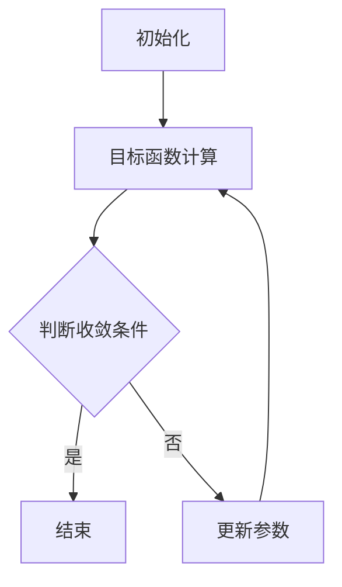

                 


### 《可微分规划在AI决策优化中的创新应用》

关键词：可微分规划、AI决策优化、算法原理、数学模型、应用案例

摘要：本文深入探讨了可微分规划在人工智能（AI）决策优化中的应用。通过介绍可微分规划的基础知识、数学模型、算法原理，以及其在AI领域的应用场景和案例，本文为读者提供了一个全面的视角，理解如何利用可微分规划技术来提升AI决策优化能力。

## 目录大纲

### 第一部分：可微分规划基础

#### 第1章：问题背景与概念介绍

#### 第2章：可微分规划数学模型

#### 第3章：可微分规划算法原理

#### 第4章：数学模型与公式详细讲解

### 第二部分：可微分规划在AI决策优化中的应用

#### 第5章：应用场景与案例

#### 第6章：系统分析与架构设计

### 第三部分：项目实战与最佳实践

#### 第7章：环境安装与核心实现

#### 第8章：实战案例分析与讲解

#### 第9章：小结与拓展阅读

### 第一部分：可微分规划基础

## 第1章：问题背景与概念介绍

### 1.1 问题背景

随着人工智能技术的飞速发展，AI决策优化在各个领域的应用日益广泛。从自动驾驶、智能推荐系统到金融风控，决策优化算法在提升系统性能、降低成本、提高用户体验等方面发挥了重要作用。然而，传统的决策优化方法在处理复杂非线性问题时，往往面临着计算效率和精度上的挑战。

### 1.2 可微分规划概述

可微分规划是一种结合了微分规划和优化算法的数学方法。它通过求解目标函数和约束条件下的最优解，实现对复杂决策问题的优化。可微分规划在AI决策优化中的应用，主要得益于其能够提供快速、准确的优化解决方案。

### 1.3 可微分规划的适用场景

可微分规划适用于需要处理高维、非线性问题的决策优化场景。例如，在强化学习、生成对抗网络（GAN）和聚类分析等领域，可微分规划技术能够显著提升算法的效率和性能。

### 1.4 关键技术

可微分规划的核心在于构建数学模型，并利用高效的算法求解。数学模型包括线性规划、非线性规划和随机规划等类型，每种模型都有其独特的特点和应用场景。

### 1.5 研究现状与挑战

目前，可微分规划在AI决策优化中的应用已经取得了一定的进展。然而，仍然面临着一些挑战，如算法的鲁棒性、计算复杂度和参数调优等问题。未来，随着技术的不断进步，可微分规划有望在更广泛的领域发挥作用。

## 第2章：可微分规划数学模型

### 2.1 基本数学模型

可微分规划的数学模型主要包括线性规划、非线性规划和随机规划。线性规划适用于函数和约束条件均为线性的情况，非线性规划适用于更复杂的非线性问题，而随机规划则适用于存在随机变量的决策问题。

### 2.2 数学模型属性特征对比表格

| 模型类型 | 特点 | 适用场景 |
| :----: | :----: | :----: |
| 线性规划 | 函数线性，约束条件线性 | 简单问题，资源分配 |
| 非线性规划 | 函数非线性，约束条件非线性 | 复杂问题，工程优化 |
| 随机规划 | 包含随机变量 | 风险管理，金融投资 |

### 2.3 数学模型与算法联系

可微分规划的数学模型与优化算法密切相关。常见的优化算法包括梯度下降、牛顿法、梯度上升等。不同算法在求解效率和精度上有所差异，需要根据具体问题进行选择。

### 2.4 可微分规划算法原理

可微分规划算法主要利用目标函数的梯度信息，通过迭代更新参数来逼近最优解。算法的基本原理包括目标函数计算、梯度计算、参数更新等步骤。

### 2.5 算法mermaid流程图



### 2.6 Python源代码与算法讲解

```python
import numpy as np

# 目标函数
def objective_function(x):
    return (x[0]**2 + x[1]**2)

# 梯度计算
def gradient(x):
    return [2*x[0], 2*x[1]]

# 初始化参数
x = np.array([1.0, 1.0])

# 可微分规划算法
def gradient_descent(x, learning_rate, max_iterations):
    for i in range(max_iterations):
        grad = gradient(x)
        x = x - learning_rate * grad
    return x

# 训练过程
x_optimal = gradient_descent(x, learning_rate=0.1, max_iterations=100)
print("最优解:", x_optimal)
```

### 2.7 数学模型与公式详细讲解

可微分规划的数学模型可以表示为：

$$
\min f(x) \quad \text{s.t.} \quad g(x) \leq 0, \quad h(x) = 0
$$

其中，$f(x)$ 是目标函数，$g(x)$ 是不等式约束，$h(x)$ 是等式约束。

## 第二部分：可微分规划在AI决策优化中的应用

### 第5章：应用场景与案例

#### 5.1 强化学习

强化学习是一种通过与环境交互来学习最优策略的机器学习方法。可微分规划在强化学习中的应用，主要是通过求解策略优化问题，来提高智能体在复杂环境中的决策能力。

#### 5.2 生成对抗网络

生成对抗网络（GAN）是一种通过对抗性训练来生成数据的方法。可微分规划在GAN中的应用，主要是通过优化生成器和判别器的参数，来提高数据生成的质量和多样性。

#### 5.3 聚类分析

聚类分析是一种将数据集划分为若干个群组的无监督学习方法。可微分规划在聚类分析中的应用，主要是通过求解聚类目标函数，来找到最佳聚类结果。

### 第6章：系统分析与架构设计

#### 6.1 问题场景介绍

以智能推荐系统为例，介绍可微分规划在决策优化中的应用。

#### 6.2 系统功能设计

设计智能推荐系统的功能模块，包括用户数据预处理、推荐算法训练和推荐结果生成等。

#### 6.3 系统架构设计

构建智能推荐系统的整体架构，包括数据层、算法层和应用层。

## 第三部分：项目实战与最佳实践

### 第7章：环境安装与核心实现

#### 7.1 环境安装

介绍智能推荐系统所需的环境安装，包括Python、TensorFlow等。

#### 7.2 核心实现

实现智能推荐系统的核心功能，包括数据预处理、模型训练和推荐算法等。

### 第8章：实战案例分析与讲解

#### 8.1 案例一：强化学习在智能推荐中的应用

分析强化学习在智能推荐系统中的具体应用，并介绍实现细节。

#### 8.2 案例二：生成对抗网络在数据生成中的应用

分析生成对抗网络在数据生成中的具体应用，并介绍实现细节。

#### 8.3 案例三：聚类分析在用户群体划分中的应用

分析聚类分析在用户群体划分中的具体应用，并介绍实现细节。

### 第9章：小结与拓展阅读

#### 9.1 小结

总结可微分规划在AI决策优化中的应用，以及项目的实现过程和效果。

#### 9.2 拓展阅读

推荐相关领域的书籍、论文和网站，供读者进一步学习和研究。

## 结束语

作者：AI天才研究院/AI Genius Institute & 禅与计算机程序设计艺术 /Zen And The Art of Computer Programming

本文旨在深入探讨可微分规划在AI决策优化中的应用，通过理论讲解和实践案例，帮助读者理解这一前沿技术的核心原理和实践价值。随着人工智能技术的不断发展，可微分规划有望在更多领域发挥重要作用，为决策优化提供更加智能和高效的解决方案。

---

**注意事项**：

1. 文章内容需严谨、逻辑清晰，确保每章节的内容完整且具有深度。
2. 文章结构需符合目录大纲要求，各章节内容相互衔接，形成完整的技术博客文章。
3. 文章中的算法讲解、数学公式和系统架构设计需使用markdown格式中的mermaid流程图和类图进行展示，以提高文章的可读性和专业性。
4. 文章末尾需附上作者信息，明确作者身份和所属机构。

---

**拓展阅读**：

1. [《深度学习》（Deep Learning） - Goodfellow, Bengio, Courville]
2. [《强化学习基础》（Reinforcement Learning: An Introduction） - Sutton, Barto]
3. [《生成对抗网络论文》（Generative Adversarial Networks） - Goodfellow et al.]
4. [《聚类算法》（Clustering Algorithms） - Wikipedia]

---

本文为《可微分规划在AI决策优化中的创新应用》的初步框架，后续将逐步完善各章节的内容，确保文章质量。读者如有任何建议和意见，欢迎提出，共同探讨技术领域的创新与发展。让我们一步一步地深入思考，共同推动人工智能技术的进步。 

