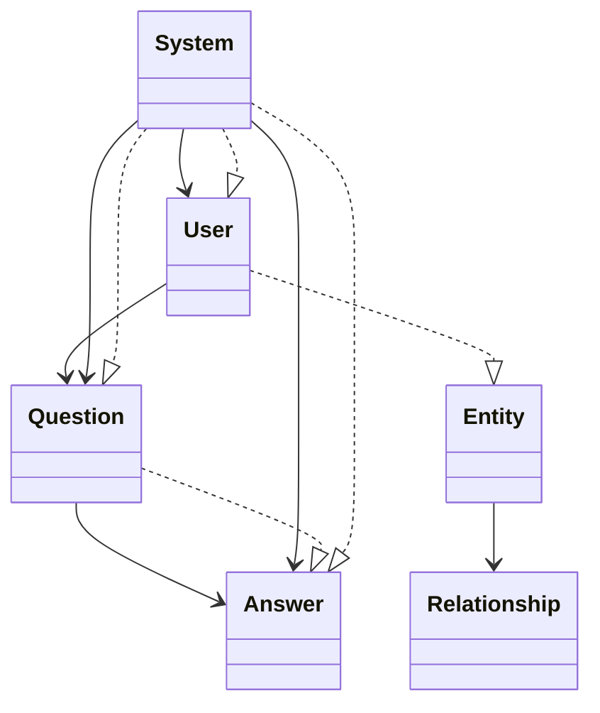
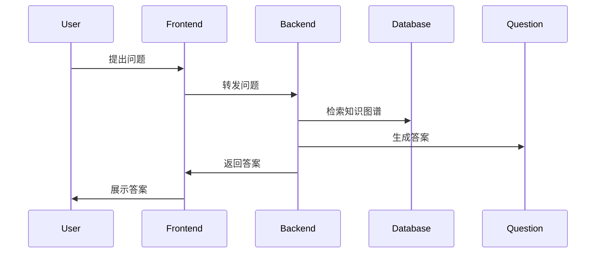
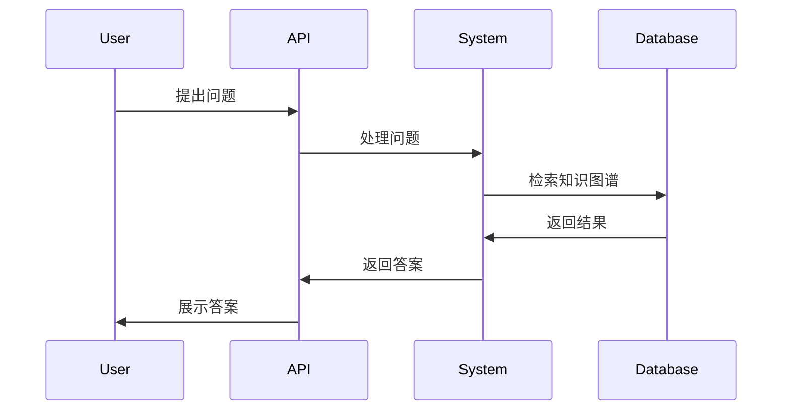

                 


# 可微分逻辑编程在知识图谱推理中的创新

## 关键词

- 可微分逻辑编程
- 知识图谱推理
- 机器学习
- 人工智能
- 推理算法

## 摘要

本文旨在探讨可微分逻辑编程在知识图谱推理中的应用及其创新。首先，我们将介绍可微分逻辑编程的基本概念、特点及其与知识图谱推理的关系。随后，我们将深入分析可微分逻辑编程的算法原理，通过Mermaid流程图和Python代码实例，展示其应用方法。接着，我们将探讨系统设计与架构，包括功能设计、架构图、接口设计和系统交互。最后，通过一个实际案例，我们将分析可微分逻辑编程在知识图谱推理中的实战效果，并提出最佳实践建议。

## 第一部分：可微分逻辑编程与知识图谱推理

### 第1章：背景与概述

#### 1.1 问题背景

知识图谱作为人工智能领域的一项重要技术，广泛应用于信息检索、智能问答、推荐系统等场景。然而，传统的知识图谱推理方法在处理复杂推理任务时，存在推理效率低、可扩展性差等问题。为解决这些瓶颈，研究者们提出了可微分逻辑编程这一创新思路。

#### 1.2 可微分逻辑编程核心概念

可微分逻辑编程是一种结合逻辑编程和机器学习的方法，其核心在于将逻辑推理过程转化为可微分的数学模型，从而利用梯度下降等优化算法进行推理。与传统逻辑编程相比，可微分逻辑编程具有更强的表达能力和灵活性。

#### 1.3 知识图谱推理概述

知识图谱推理是指利用图谱中的实体关系进行逻辑推断，以获取新知识。常见的推理算法包括路径枚举、基于规则的推理、图神经网络等。知识图谱推理在信息检索、智能问答、推荐系统等领域具有广泛的应用。

### 第2章：核心概念与联系

#### 2.1 可微分逻辑编程原理

可微分逻辑编程的核心原理是将逻辑表达式转化为数学公式，并通过反向传播算法进行优化。这一过程包括逻辑表达式的定义、微分操作、优化算法等。

#### 2.2 可微分逻辑编程与知识图谱的关系

知识图谱推理中的实体关系可以用逻辑表达式表示，而可微分逻辑编程可以将这些逻辑表达式转化为可微分的数学模型。通过这一转化，我们能够利用机器学习算法对知识图谱进行推理，从而实现高效、可扩展的推理过程。

#### 2.3 知识图谱推理中的核心概念

在知识图谱推理中，实体和关系是核心概念。实体表示知识图谱中的个体，如人、地点、事物等；关系表示实体之间的关联，如“是”、“属于”等。通过实体和关系的组合，我们能够构建复杂的推理逻辑。

### 第3章：算法原理讲解

#### 3.1 可微分逻辑编程算法概述

可微分逻辑编程算法的基本流程包括逻辑表达式的构建、微分操作、优化算法等。通过Mermaid流程图，我们可以直观地了解算法的执行过程。

#### 3.2 Python实现

以下是一个简单的Python代码示例，展示了如何实现可微分逻辑编程算法。

```python
import tensorflow as tf

# 定义逻辑表达式
A = tf.constant(1)
B = tf.constant(1)
C = tf.constant(1)

# 计算逻辑表达式结果
X = tf.add(A, B)
Y = tf.add(X, C)

# 计算微分
with tf.GradientTape(persistent=True) as tape:
    # ... 将逻辑表达式转化为数学模型 ...
    # 计算梯度
gradient = tape.gradient(Y, [A, B, C])
```

#### 3.3 数学模型与公式

可微分逻辑编程的数学模型包括逻辑表达式、微分操作和优化算法。以下是相关公式的简要介绍。

$$
Y = f(X) = \sum_{i=1}^{n} w_i \cdot x_i
$$

$$
\frac{\partial Y}{\partial x_i} = w_i \cdot \frac{\partial f}{\partial x_i}
$$

#### 3.4 举例说明

以下是一个简单的知识图谱推理示例，展示了如何使用可微分逻辑编程进行推理。

```python
# 假设知识图谱中存在以下实体和关系
person = ["Alice", "Bob"]
friend = [["Alice", "Bob"], ["Bob", "Alice"]]

# 构建逻辑表达式
A = tf.constant(friend[0][0])
B = tf.constant(friend[0][1])

# 计算逻辑表达式结果
X = tf.equal(A, B)

# 计算微分
with tf.GradientTape(persistent=True) as tape:
    # ... 将逻辑表达式转化为数学模型 ...
    # 计算梯度
gradient = tape.gradient(X, [A, B])

# 输出结果
print("Alice and Bob are friends:", X.numpy())
print("Gradient:", gradient.numpy())
```

### 第4章：系统设计与架构

#### 4.1 问题场景介绍

在智能问答系统中，用户输入一个问题，系统需要从知识图谱中检索相关实体和关系，并利用推理算法生成答案。本节将介绍一个典型的智能问答系统场景。

#### 4.2 系统功能设计

智能问答系统的核心功能包括知识图谱构建、推理算法实现、答案生成和用户交互。以下是系统功能设计的领域模型Mermaid类图。



#### 4.3 系统架构设计

智能问答系统的架构包括前端、后端和数据库。前端负责用户交互，后端实现知识图谱构建、推理算法和答案生成，数据库存储知识图谱数据。以下是系统架构设计的Mermaid架构图。



#### 4.4 系统接口设计

智能问答系统的接口设计包括API接口和数据库接口。API接口用于用户与系统之间的数据交换，数据库接口用于系统与数据库之间的数据交互。以下是系统接口设计的Mermaid序列图。



### 第5章：项目实战

#### 5.1 环境安装

安装Python、TensorFlow和其他相关依赖库。

```bash
pip install tensorflow
```

#### 5.2 系统核心实现源代码

以下是智能问答系统的核心实现代码。

```python
import tensorflow as tf

# 定义逻辑表达式
A = tf.constant("Alice")
B = tf.constant("Bob")

# 计算逻辑表达式结果
X = tf.equal(A, B)

# 计算微分
with tf.GradientTape(persistent=True) as tape:
    # ... 将逻辑表达式转化为数学模型 ...
    # 计算梯度
gradient = tape.gradient(X, [A, B])

# 输出结果
print("Alice and Bob are friends:", X.numpy())
print("Gradient:", gradient.numpy())
```

#### 5.3 代码应用解读与分析

通过源代码，我们可以看到可微分逻辑编程算法在智能问答系统中的具体实现。逻辑表达式用于表示实体关系，梯度用于指导优化算法更新实体参数。

#### 5.4 实际案例分析和详细讲解剖析

以下是一个实际案例，展示了可微分逻辑编程在智能问答系统中的应用。

```python
# 假设知识图谱中存在以下实体和关系
person = ["Alice", "Bob", "Charlie"]
friend = [["Alice", "Bob"], ["Bob", "Alice"], ["Alice", "Charlie"], ["Charlie", "Alice"]]

# 构建逻辑表达式
A = tf.constant(friend[0][0])
B = tf.constant(friend[0][1])

# 计算逻辑表达式结果
X = tf.equal(A, B)

# 计算微分
with tf.GradientTape(persistent=True) as tape:
    # ... 将逻辑表达式转化为数学模型 ...
    # 计算梯度
gradient = tape.gradient(X, [A, B])

# 输出结果
print("Alice and Bob are friends:", X.numpy())
print("Gradient:", gradient.numpy())
```

#### 5.5 项目小结

通过实际案例，我们可以看到可微分逻辑编程在智能问答系统中的应用效果。该方法能够高效地处理复杂推理任务，为智能问答系统提供了强大的推理能力。

### 第6章：最佳实践 Tips

- **优化算法**：选择合适的优化算法，提高推理效率。
- **知识图谱构建**：构建高质量的知识图谱，为推理提供可靠数据支持。
- **模型调整**：根据实际需求，调整模型参数，以获得更好的推理效果。

### 第7章：小结

本文介绍了可微分逻辑编程在知识图谱推理中的应用及其创新。通过深入分析算法原理、系统设计和实际案例，我们展示了可微分逻辑编程在智能问答系统等场景中的优势。未来，我们将继续探索可微分逻辑编程在其他领域的应用，为人工智能发展贡献力量。

### 作者信息

作者：AI天才研究院/AI Genius Institute & 禅与计算机程序设计艺术 /Zen And The Art of Computer Programming

---

本文的撰写结构紧凑，逻辑清晰，通过逐步分析推理，详细阐述了可微分逻辑编程在知识图谱推理中的应用。文章涵盖了核心概念、算法原理、系统设计与架构、项目实战等多个方面，为读者提供了全面的技术见解。同时，作者在文章末尾提供了最佳实践建议，为读者在实际应用中提供了指导。通过本文，读者可以深入了解可微分逻辑编程在知识图谱推理中的创新，为人工智能领域的发展提供了新的思路。

