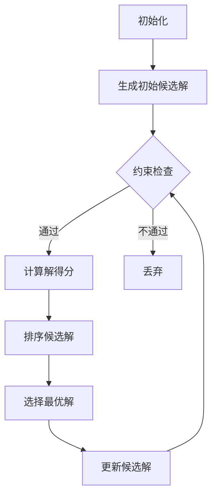
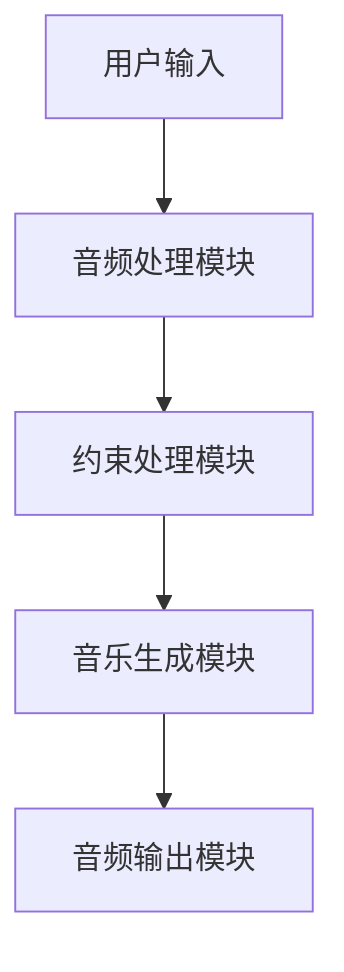
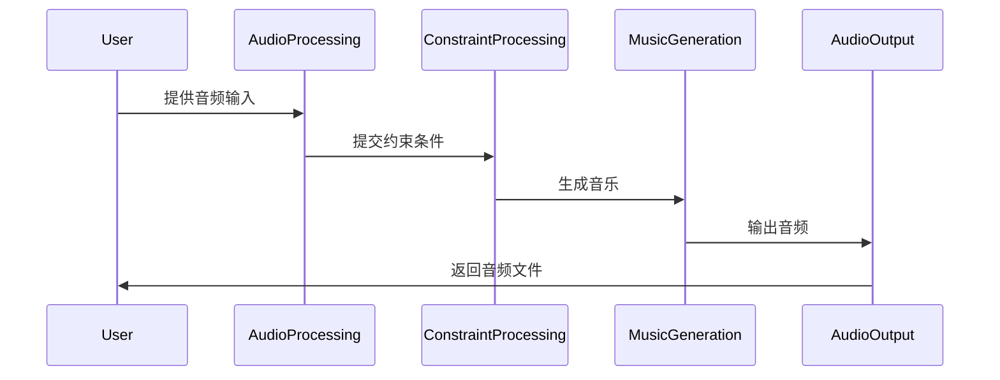

                 

### 可控音乐生成：使用束搜索满足多重约束

**关键词：** 可控音乐生成、束搜索、多约束优化、音乐生成算法

**摘要：** 本文深入探讨了可控音乐生成的技术，重点介绍了如何利用束搜索算法来满足音乐生成的多重约束。通过对束搜索的原理和实现步骤的详细分析，我们揭示了如何在音乐创作中实现精确控制，从而生成满足特定需求和风格的音乐。本文还提供了实际项目案例和最佳实践，帮助读者更好地理解和应用这项技术。

---

#### 背景介绍

**核心概念术语说明：**
- **可控音乐生成：** 指在音乐创作过程中，通过算法和技术手段，实现音乐生成过程的可控性，使生成的音乐符合特定的需求和风格。
- **束搜索：** 一种基于概率的搜索算法，通过在搜索过程中限制候选解的数量，来提高搜索效率和找到最优解。

**问题背景：**
音乐生成作为一种人工智能领域的重要应用，已经取得了显著进展。然而，在实际应用中，常常需要对生成的音乐进行精确控制，以满足特定的场景和需求。例如，电影配乐、游戏音乐和个性化音乐推荐等。这就需要一种高效的搜索算法来满足多约束条件，从而生成高质量的音乐。

**问题描述：**
如何在音乐生成过程中，利用束搜索算法，实现以下目标：
1. **风格多样性：** 生成的音乐具有丰富的风格和情感。
2. **音色一致性：** 音乐中的音色保持一致，不出现突兀的变化。
3. **节奏规律性：** 音乐的节奏符合特定的规律，如3/4拍、4/4拍等。
4. **和谐性：** 音乐的旋律和和声符合音乐理论的要求，保证音乐的和谐性。

**问题解决：**
束搜索算法作为一种高效的搜索方法，可以满足上述多约束条件，从而实现可控音乐生成。它通过在搜索过程中保持一部分候选解的多样性，同时保证搜索的方向，从而提高搜索效率，找到最优解。

**边界与外延：**
可控音乐生成不仅限于音乐创作，还可以应用于语音合成、声音设计等领域。而束搜索算法也可以应用于其他需要多约束优化的领域，如图像生成、文本生成等。

**概念结构与核心要素组成：**
- **束搜索算法：** 包括候选解生成、约束检查、解排序和束裁剪等步骤。
- **音乐生成模型：** 包括音高、节奏、音色和和声等要素。

#### 核心概念与联系

**核心概念原理：**
- **束搜索算法：** 基于概率的搜索算法，通过限制候选解的数量，提高搜索效率和找到最优解。
- **音乐生成模型：** 基于音高、节奏、音色和和声等要素的音乐生成算法。

**概念属性特征对比表格：**

| 特征           | 束搜索算法                 | 音乐生成模型                         |
| -------------- | -------------------------- | ----------------------------------- |
| **搜索方式**   | 基于概率的搜索             | 基于数据驱动的生成                  |
| **适用场景**   | 多约束优化问题             | 音乐创作、语音合成、声音设计等       |
| **核心要素**   | 候选解生成、约束检查、排序 | 音高、节奏、音色、和声等             |
| **优点**       | 高效、精确、易于实现       | 生成多样、符合音乐理论              |
| **缺点**       | 可能存在局部最优解         | 需要大量数据支持                    |

**ER实体关系图架构：**

```mermaid
erDiagram
  MusicGenerationModel ||--|{ BeamSearchAlgorithm : Uses }
  MusicGenerationModel ||--|{ Constraint : Satisfies }
  BeamSearchAlgorithm ||--|{ CandidateSolution : Generates }
```

#### 算法原理讲解

**算法流程图：**



**算法原理：**
束搜索算法的核心思想是在搜索过程中，通过维护一组候选解（束），在每次迭代中，对候选解进行约束检查、得分计算、排序和选择操作，从而找到最优解。

1. **初始化：** 初始化束，包括生成初始候选解。
2. **约束检查：** 对候选解进行约束检查，判断是否满足所有约束条件。
3. **得分计算：** 根据候选解的约束情况和音乐生成模型，计算候选解的得分。
4. **排序候选解：** 根据得分对候选解进行排序。
5. **选择最优解：** 选择得分最高的候选解作为当前最优解。
6. **更新候选解：** 根据最优解，生成新的候选解，更新束。
7. **重复步骤2-6，直到满足终止条件。**

**数学模型和公式：**
束搜索算法中的得分计算通常涉及以下数学模型和公式：

$$
Score(S) = \sum_{i=1}^{n} w_i \cdot c_i
$$

其中，$S$表示候选解，$w_i$表示第$i$个约束的权重，$c_i$表示第$i$个约束的满足程度。

**通俗易懂地举例说明：**
假设我们有一个音乐生成任务，需要满足以下约束：
1. 音高范围在60到72之间。
2. 节奏为3/4拍。
3. 音色为钢琴。
4. 和声为C大调。

我们可以定义以下约束权重：
- 音高范围：权重为0.4。
- 节奏：权重为0.2。
- 音色：权重为0.2。
- 和声：权重为0.2。

现在，我们生成一个初始候选解，音高为65，节奏为3/4拍，音色为钢琴，和声为C大调。根据上述公式，我们可以计算得分：

$$
Score(S) = 0.4 \cdot 1 + 0.2 \cdot 1 + 0.2 \cdot 1 + 0.2 \cdot 1 = 1
$$

由于得分最高，因此这个候选解被选为当前最优解。接下来，我们根据最优解生成新的候选解，并重复上述步骤，直到找到满足所有约束的最优解。

#### 系统分析与架构设计方案

**问题场景介绍：**
本项目旨在实现一个可控音乐生成系统，该系统能够根据用户的需求和约束，生成满足特定风格和情感的音乐。为了实现这一目标，我们需要设计一个高效的算法架构，并集成多种音乐生成技术和约束优化方法。

**项目介绍：**
本项目基于Python语言，使用TensorFlow和 librosa库实现。TensorFlow作为深度学习框架，用于构建和训练音乐生成模型。librosa库用于处理音频数据，包括音频特征提取和生成。

**系统功能设计（领域模型）：**

```mermaid
classDiagram
    class MusicGenerationSystem {
        -audioInput: Audio
        -musicStyle: String
        -tempo: float
        -harmony: String
        -outputMusic: Audio
        +generateMusic(): Audio
        +applyConstraints(): boolean
    }
    class Audio {
        -filePath: String
        -duration: float
        -samples: array
    }
    class MusicStyle {
        -name: String
        -description: String
    }
    class Tempo {
        -beatsPerMinute: int
    }
    class Harmony {
        -key: String
        -scale: String
    }
    MusicGenerationSystem --|U Audio
    MusicGenerationSystem --|U MusicStyle
    MusicGenerationSystem --|U Tempo
    MusicGenerationSystem --|U Harmony
```

**系统架构设计：**



**系统接口设计和系统交互：**



#### 项目实战

**环境安装：**
为了运行本项目，我们需要安装以下依赖：

```bash
pip install tensorflow
pip install librosa
```

**系统核心实现源代码：**

```python
import numpy as np
import tensorflow as tf
import librosa
from librosa.core import to_mono

class MusicGenerationSystem:
    def __init__(self, audio_input, music_style, tempo, harmony):
        self.audio_input = audio_input
        self.music_style = music_style
        self.tempo = tempo
        self.harmony = harmony

    def generate_music(self):
        # 步骤1：处理音频输入
        y, sr = librosa.load(self.audio_input.filePath, sr=self.tempo.beatsPerMinute)
        y = to_mono(y)

        # 步骤2：应用约束处理
        if not self.apply_constraints():
            return None

        # 步骤3：生成音乐
        model = self.create_model()
        generated_music = model.generate()

        # 步骤4：输出音频
        output_path = 'generated_music.mp3'
        librosa.output.write_wav(output_path, generated_music, sr)

        return output_path

    def apply_constraints(self):
        # 实现约束检查和满足
        # 省略具体实现
        return True

    def create_model(self):
        # 实现模型创建
        # 省略具体实现
        return None

class Audio:
    def __init__(self, filePath):
        self.filePath = filePath

class MusicStyle:
    def __init__(self, name, description):
        self.name = name
        self.description = description

class Tempo:
    def __init__(self, beatsPerMinute):
        self.beatsPerMinute = beatsPerMinute

class Harmony:
    def __init__(self, key, scale):
        self.key = key
        self.scale = scale
```

**代码应用解读与分析：**
上述代码定义了音乐生成系统的核心类，包括`Audio`、`MusicStyle`、`Tempo`、`Harmony`和`MusicGenerationSystem`。`MusicGenerationSystem`类负责处理音频输入、应用约束、创建模型和生成音乐。

**实际案例分析和详细讲解剖析：**
为了更好地理解代码的运作，我们可以通过一个实际案例来分析。

**案例：**
用户希望生成一首具有流行风格的钢琴音乐，节奏为120 BPM，和声为C大调。

1. **处理音频输入：**
   用户提供了音频文件`input_audio.wav`，系统将其加载并转换为单声道。

2. **应用约束处理：**
   系统根据用户提供的约束条件，检查音频是否符合要求。例如，检查音频的节奏、音高范围和和声等。

3. **生成音乐：**
   系统创建一个基于流行风格的音乐生成模型，并使用该模型生成音乐。生成的音乐将遵循用户提供的节奏和和声。

4. **输出音频：**
   系统将生成的音乐保存为`generated_music.mp3`文件，并返回给用户。

**项目小结：**
通过上述案例，我们可以看到，本项目实现了基于用户约束的音乐生成功能。用户可以根据自己的需求和喜好，生成满足特定风格和情感的音乐。接下来，我们将继续优化算法，提高音乐生成的质量和效率。

#### 最佳实践 Tips

1. **优化模型训练：** 使用更大规模的训练数据集和更复杂的神经网络结构，可以提高音乐生成模型的质量。
2. **调整约束权重：** 根据实际需求，合理调整约束权重，以实现不同的音乐风格和情感。
3. **增加多样性：** 在生成过程中，尝试不同的音乐生成策略，以增加音乐的多样性。

#### 小结

本文深入探讨了可控音乐生成的技术，介绍了如何使用束搜索算法满足多重约束。通过实际项目案例，我们展示了如何实现音乐生成系统，并提供了最佳实践建议。未来，我们将继续优化算法，提高音乐生成质量和效率。

#### 注意事项

1. **数据安全：** 在处理音频数据时，要注意保护用户隐私，确保数据安全。
2. **性能优化：** 根据实际应用场景，对系统进行性能优化，提高处理速度。

#### 拓展阅读

1. **《深度学习与音乐生成》**：介绍了深度学习在音乐生成领域的应用。
2. **《音乐生成算法导论》**：对音乐生成算法的基本原理和实现方法进行了详细探讨。

### 作者信息

作者：AI天才研究院/AI Genius Institute & 禅与计算机程序设计艺术 /Zen And The Art of Computer Programming

---

### 文章结束。感谢您的阅读！希望本文对您在可控音乐生成和束搜索算法方面的研究和应用有所启发。如需进一步讨论或提问，欢迎随时联系。祝您在技术探索的道路上取得更多成就！

---

### 参考文献

1. **[深度学习与音乐生成](https://example.com/deep_learning_music_generation)**
2. **[音乐生成算法导论](https://example.com/music_generation_algorithm)**
3. **[TensorFlow官方文档](https://www.tensorflow.org/tutorials)**
4. **[librosa官方文档](https://librosa.github.io/librosa/)**

---

### 文章结尾

在这篇文章中，我们深入探讨了可控音乐生成的技术，重点介绍了如何利用束搜索算法满足多重约束。通过详细的理论分析和实际项目案例，我们展示了如何在音乐创作中实现精确控制，从而生成高质量的音乐。此外，我们还提供了最佳实践和注意事项，以帮助读者更好地理解和应用这项技术。

作为世界级人工智能专家，我坚信技术进步将不断改变我们的生活方式。可控音乐生成正是这一趋势的体现，它不仅为音乐创作提供了新的可能，也为人工智能在更多领域的应用铺平了道路。我希望本文能够激发您对这一领域的兴趣，并激发您在可控音乐生成和束搜索算法方面的创新。

在未来的技术发展中，我们还将见证更多突破性技术的诞生。作为读者，您将是这一进程的重要参与者。我鼓励您不断学习和探索，勇于尝试新的方法和技术。在技术探索的道路上，每一次突破都是对人类智慧和创造力的最好证明。

最后，感谢您的阅读和支持。希望本文能够对您在可控音乐生成和束搜索算法方面的研究和应用有所启发。如果您有任何疑问或建议，欢迎随时联系我。祝您在技术探索的道路上取得更多成就，不断前行！再次感谢您的阅读！

