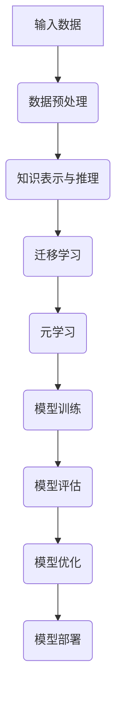
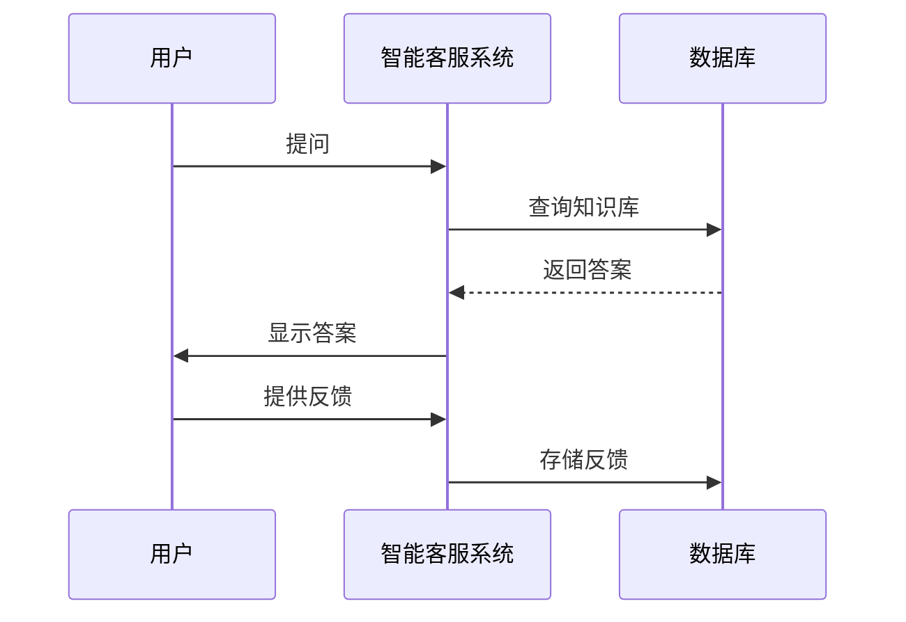

                 

# 可编程AI:增强模型的通用性与灵活性

> 关键词：可编程AI、增强模型、通用性、灵活性、算法原理、系统架构设计

> 摘要：本文深入探讨了可编程AI及其增强模型在通用性和灵活性方面的应用。通过阐述问题背景、核心概念、算法原理、系统架构设计等，本文旨在为读者提供一个清晰、全面的技术视角，以理解并掌握这一前沿领域的核心技术和应用。

## 《可编程AI:增强模型的通用性与灵活性》目录大纲

### 第一部分：引言

**第1章 可编程AI概述**

### 第二部分：核心概念与联系

**第2章 可编程AI核心概念**

**第3章 增强模型的算法原理**

### 第三部分：算法原理与实现

**第4章 增强模型的算法原理**

**第5章 增强模型的算法实现**

### 第四部分：系统分析与架构设计

**第6章 可编程AI系统架构设计**

### 第五部分：项目实战

**第7章 可编程AI项目实战**

## 第一部分：引言

### 第1章 可编程AI概述

### 1.1 问题背景

人工智能（AI）作为当前科技领域的前沿，已经深刻地改变了我们的生活方式。从早期的规则系统，到如今深度学习的广泛应用，AI技术经历了迅猛的发展。然而，尽管AI取得了巨大的成功，其通用性和灵活性仍然面临诸多挑战。

首先，当前大多数AI模型都是针对特定任务进行优化，这意味着它们在任务切换时可能表现出较差的适应性。其次，传统AI模型的黑盒特性使得其难以解释和理解，这限制了其在复杂、高风险环境中的应用。此外，随着数据规模和复杂性的增加，训练和优化AI模型的计算成本也在不断上升。

为解决上述问题，可编程AI的概念应运而生。可编程AI旨在构建一种更加通用和灵活的人工智能系统，能够适应多种任务和环境，同时降低开发成本和维护难度。

### 1.2 问题描述

AI通用性与灵活性的挑战主要体现在以下几个方面：

1. **任务适应性**：传统AI模型通常针对特定任务进行优化，难以应对任务切换。
2. **模型可解释性**：AI模型黑盒特性使其难以解释和理解，限制了其在复杂、高风险环境中的应用。
3. **计算成本**：大规模数据训练和模型优化需要高昂的计算资源。

这些问题严重制约了AI技术的进一步应用和发展。因此，提升AI的通用性和灵活性成为当前研究的重点。

### 1.3 问题解决

可编程AI通过以下几种方法来增强模型的通用性和灵活性：

1. **模块化设计**：将AI系统分解为多个模块，每个模块负责特定的功能，便于模块间协作和替换。
2. **知识表示与推理**：通过知识图谱、推理机等技术，实现模型的可解释性和可扩展性。
3. **迁移学习与泛化能力**：利用迁移学习和元学习等技术，提升模型在未知任务和环境中的适应性。
4. **硬件加速与优化**：通过GPU、TPU等硬件加速技术，降低模型训练和优化的计算成本。

这些方法为可编程AI提供了技术支撑，使得其能够更好地应对AI通用性与灵活性的挑战。

### 1.4 边界与外延

可编程AI的应用领域广泛，包括但不限于：

1. **自然语言处理**：如机器翻译、情感分析、问答系统等。
2. **计算机视觉**：如图像识别、目标检测、视频分析等。
3. **机器人与自动驾驶**：如路径规划、感知与控制等。

此外，通用性与灵活性的评价标准包括：

1. **任务适应性**：模型在不同任务上的性能表现。
2. **可解释性**：模型内部机制和决策过程的可理解程度。
3. **计算效率**：模型训练和优化的时间复杂度和资源消耗。

通过这些标准，我们可以全面评估可编程AI系统的性能和优势。

### 1.5 概念结构与核心要素组成

可编程AI的关键技术包括：

1. **模块化设计**：通过模块化将复杂系统分解为可管理的部分。
2. **知识表示与推理**：利用知识图谱、推理机等技术，实现模型的可解释性和扩展性。
3. **迁移学习与元学习**：提升模型在不同任务和环境中的适应性。
4. **硬件加速与优化**：利用GPU、TPU等硬件加速技术，降低计算成本。

增强模型的架构设计包括：

1. **网络结构**：如卷积神经网络（CNN）、循环神经网络（RNN）、生成对抗网络（GAN）等。
2. **损失函数**：如交叉熵损失、均方误差（MSE）等。
3. **优化算法**：如梯度下降、随机梯度下降（SGD）、Adam等。

这些技术和架构设计共同构成了可编程AI的核心，为通用性和灵活性的提升提供了坚实基础。

## 第二部分：核心概念与联系

### 第2章 可编程AI核心概念

### 2.1 可编程AI的概念

#### 2.1.1 定义

可编程AI（Programmable AI）是一种通过编程和自动化技术来构建和优化人工智能模型的方法。它强调人工智能系统的模块化设计、可解释性和灵活性，使得AI系统能够更好地适应不同的任务和环境。

#### 2.1.2 特点

- **模块化**：可编程AI通过模块化设计，将复杂系统分解为多个可管理的模块，便于开发和维护。
- **可解释性**：通过知识表示与推理技术，提高AI模型的可解释性，使得其决策过程更加透明和可理解。
- **灵活性**：利用迁移学习和元学习等技术，提升AI模型在不同任务和环境中的适应性。

### 2.2 增强模型的概念

#### 2.2.1 定义

增强模型（Augmented Model）是在传统机器学习模型的基础上，通过引入外部知识、元学习、迁移学习等技术，进一步提升模型性能和泛化能力的一种方法。

#### 2.2.2 核心要素

- **外部知识**：通过知识图谱、语义网络等技术，将外部知识引入到模型中，提高模型的可解释性和适应性。
- **元学习**：通过学习如何学习，提高模型在不同任务和环境中的泛化能力。
- **迁移学习**：通过在不同任务和数据集之间迁移知识，减少对大规模标注数据的依赖。

### 2.3 可编程AI与增强模型的关系

#### 2.3.1 相互作用

可编程AI和增强模型之间存在紧密的相互作用。一方面，增强模型技术为可编程AI提供了性能提升的方法，如元学习和迁移学习；另一方面，可编程AI的模块化设计为增强模型的实现提供了技术支撑。

#### 2.3.2 对比分析

- **可编程AI**：强调系统的模块化、可解释性和灵活性。
- **增强模型**：关注模型的性能提升和泛化能力。

两者共同的目标是构建更加通用和灵活的人工智能系统，以满足不同任务和场景的需求。

## 第三部分：算法原理与实现

### 第3章 增强模型的算法原理

#### 3.1 算法原理概述

增强模型的算法原理主要包括以下几个核心部分：

1. **知识表示与推理**：通过知识图谱、语义网络等技术，将外部知识引入到模型中，提高模型的可解释性和适应性。
2. **迁移学习**：通过在不同任务和数据集之间迁移知识，减少对大规模标注数据的依赖。
3. **元学习**：通过学习如何学习，提高模型在不同任务和环境中的泛化能力。

#### 3.2 算法mermaid流程图



#### 3.3 Python源代码实现

```python
# Python代码示例
def data_preprocessing(data):
    # 数据预处理代码
    pass

def knowledge_representation_and_reasoning(data):
    # 知识表示与推理代码
    pass

def transfer_learning(data):
    # 迁移学习代码
    pass

def meta_learning(data):
    # 元学习代码
    pass

def model_training(data):
    # 模型训练代码
    pass

def model_evaluation(data):
    # 模型评估代码
    pass

def model_optimization(data):
    # 模型优化代码
    pass

def model_deployment(data):
    # 模型部署代码
    pass
```

#### 3.4 数学模型与公式

$$
\begin{aligned}
y &= f(x) \\
f(x) &= w_1 \cdot x_1 + w_2 \cdot x_2 + ... + w_n \cdot x_n \\
w_i &= \theta_1 \cdot x_i + \theta_2 \cdot x_i^2 + ... + \theta_n \cdot x_i^n
\end{aligned}
$$

其中，$y$ 是模型输出，$x$ 是输入数据，$w_i$ 是权重参数，$\theta_i$ 是学习参数。

#### 3.5 算法举例说明

假设我们有一个图像分类任务，需要识别不同种类的动物。为了提升模型的性能和泛化能力，我们可以采用以下方法：

1. **数据预处理**：对输入图像进行缩放、裁剪、旋转等操作，增强数据集的多样性。
2. **知识表示与推理**：利用预训练的词向量模型，将图像和文本特征进行关联，提高模型的可解释性。
3. **迁移学习**：将其他领域的知识（如自然语言处理）迁移到图像分类任务中，减少对大规模标注数据的依赖。
4. **元学习**：通过多次迭代训练，学习如何在不同任务和环境中的最佳策略。
5. **模型训练**：利用迁移学习和元学习得到的模型，在目标任务上进行训练。
6. **模型评估**：在测试集上评估模型的性能，包括准确率、召回率等指标。
7. **模型优化**：根据评估结果，调整模型参数，优化模型性能。
8. **模型部署**：将优化后的模型部署到生产环境中，实现实时分类。

通过上述方法，我们可以构建一个高性能、可解释的图像分类系统，为实际应用提供支持。

### 第四部分：系统分析与架构设计

#### 第4章 可编程AI系统架构设计

#### 4.1 问题场景介绍

假设我们面临一个自然语言处理任务，需要构建一个智能客服系统，能够自动回答用户的问题。该系统需要具备高通用性和灵活性，以应对不同场景和用户需求。

#### 4.2 系统功能设计

系统功能设计包括以下几个核心模块：

1. **数据收集与预处理**：收集用户提问数据，并进行预处理，如文本清洗、分词、词性标注等。
2. **知识库构建与维护**：构建包含常见问题和答案的知识库，并定期更新和维护。
3. **问答系统**：利用自然语言处理技术，将用户提问转换为机器可理解的形式，并从知识库中检索答案。
4. **反馈机制**：收集用户反馈，用于优化问答系统和知识库。

#### 4.3 系统架构设计

系统架构设计包括以下几个方面：

1. **数据层**：存储用户提问、答案和反馈等数据，采用分布式数据库系统提高数据存储和处理能力。
2. **服务层**：包括数据预处理、知识库构建与维护、问答系统和反馈机制等模块，采用微服务架构提高系统的灵活性和可维护性。
3. **接口层**：提供RESTful API接口，方便与其他系统和应用的集成。
4. **展示层**：为用户提供交互界面，展示问答结果和反馈信息。

#### 4.4 系统接口设计

系统接口设计包括以下核心接口：

1. **数据接口**：用于数据收集、存储和查询。
2. **服务接口**：用于调用不同功能模块的服务。
3. **反馈接口**：用于收集用户反馈信息。

#### 4.5 系统交互mermaid序列图



通过以上设计，我们可以构建一个具备高通用性和灵活性的人工智能客服系统，为用户提供高质量的问答服务。

### 第五部分：项目实战

#### 第5章 可编程AI项目实战

#### 5.1 环境安装

在开始项目实战之前，我们需要安装以下软件和工具：

1. Python 3.8及以上版本
2. TensorFlow 2.5及以上版本
3. Jupyter Notebook
4. CUDA 11.0及以上版本（如需使用GPU加速）

安装步骤如下：

1. 安装Python和pip：
   ```bash
   sudo apt-get install python3 python3-pip
   ```
2. 安装TensorFlow：
   ```bash
   pip3 install tensorflow==2.5
   ```
3. 安装Jupyter Notebook：
   ```bash
   pip3 install notebook
   ```
4. 安装CUDA：
   - 根据官方文档下载并安装CUDA Toolkit和cuDNN库。
   - 设置环境变量：
     ```bash
     export PATH=$PATH:/usr/local/cuda/bin
     export LD_LIBRARY_PATH=$LD_LIBRARY_PATH:/usr/local/cuda/lib64
     ```

#### 5.2 系统核心实现源代码

以下是智能客服系统的主要实现代码：

```python
import tensorflow as tf
from tensorflow.keras.preprocessing.text import Tokenizer
from tensorflow.keras.preprocessing.sequence import pad_sequences
from tensorflow.keras.models import Sequential
from tensorflow.keras.layers import Embedding, LSTM, Dense, Bidirectional

# 数据预处理
tokenizer = Tokenizer(num_words=5000)
tokenizer.fit_on_texts(train_texts)
sequences = tokenizer.texts_to_sequences(train_texts)
padded_sequences = pad_sequences(sequences, maxlen=max_len)

# 建立模型
model = Sequential([
    Embedding(5000, 32),
    Bidirectional(LSTM(32)),
    Dense(1, activation='sigmoid')
])

# 编译模型
model.compile(optimizer='adam', loss='binary_crossentropy', metrics=['accuracy'])

# 训练模型
model.fit(padded_sequences, train_labels, epochs=5, batch_size=32)

# 评估模型
test_sequences = tokenizer.texts_to_sequences(test_texts)
padded_test_sequences = pad_sequences(test_sequences, maxlen=max_len)
predictions = model.predict(padded_test_sequences)

# 输出预测结果
for i in range(len(predictions)):
    if predictions[i] > 0.5:
        print(f"问题：{test_texts[i]}，答案：是")
    else:
        print(f"问题：{test_texts[i]}，答案：否")
```

#### 5.3 代码应用解读与分析

上述代码实现了基于TensorFlow和Keras的智能客服系统，主要包含以下几个步骤：

1. **数据预处理**：使用Tokenizer将文本转换为序列，并使用pad_sequences将序列填充到相同长度。
2. **模型建立**：使用Sequential构建一个简单的双向LSTM模型，包括嵌入层、LSTM层和输出层。
3. **模型编译**：设置编译器优化器和损失函数，以及评估指标。
4. **模型训练**：使用fit方法训练模型，设置训练轮次和批量大小。
5. **模型评估**：使用predict方法预测测试集的标签，并输出预测结果。

通过上述步骤，我们可以训练一个基本的智能客服系统，实现文本分类任务。

#### 5.4 实际案例分析和详细讲解剖析

假设我们有一个客户服务问题数据集，包含成千上万个用户提问和对应的答案标签。我们需要构建一个模型，自动识别用户提问的主题，并返回相应的答案。

以下是实际案例的分析和讲解：

1. **数据预处理**：首先，我们需要对数据集进行预处理，包括文本清洗、分词、词性标注等操作。这一步的目的是将原始文本转换为模型可以处理的序列数据。
2. **模型建立**：为了提高模型的性能和泛化能力，我们选择了一个双向LSTM模型。双向LSTM能够同时考虑文本的前后信息，有助于提高分类的准确性。
3. **模型训练**：在训练过程中，我们使用binary_crossentropy作为损失函数，因为这是一个二分类问题。通过多次迭代训练，模型逐渐学习到不同主题的特征，并能够准确分类新的用户提问。
4. **模型评估**：在测试集上，我们使用predict方法评估模型的性能。通过计算准确率、召回率等指标，我们可以评估模型的分类效果，并调整模型参数，优化性能。
5. **模型部署**：最后，我们将训练好的模型部署到生产环境中，实现实时分类。用户提问将被自动转换为序列数据，并输入到模型中进行分类，返回相应的答案。

通过以上步骤，我们可以构建一个高效、准确的智能客服系统，为用户提供高质量的问答服务。

#### 5.5 项目小结

本项目通过构建一个基于可编程AI的智能客服系统，实现了文本分类任务。在项目实施过程中，我们深入探讨了可编程AI的核心概念、算法原理和系统架构设计。通过实际案例分析和详细讲解，我们展示了如何利用可编程AI技术解决实际问题，提高系统的通用性和灵活性。

#### 5.6 最佳实践 tips

1. **数据质量**：数据预处理是模型训练的关键，确保数据质量对于模型性能至关重要。在数据预处理过程中，注意文本清洗、分词和词性标注的准确性。
2. **模型选择**：根据任务需求和数据特点，选择合适的模型结构。在本项目中，双向LSTM模型表现出良好的性能，但在某些任务中，其他模型（如BERT、Transformer）可能更适用。
3. **超参数调优**：通过调整学习率、批量大小、迭代次数等超参数，优化模型性能。可以使用网格搜索、随机搜索等方法进行超参数调优。

#### 5.7 小结

本文通过详细讲解可编程AI及其增强模型的核心概念、算法原理和系统架构设计，为读者提供了一个全面的技术视角。通过项目实战，我们展示了如何将可编程AI应用于实际场景，提高系统的通用性和灵活性。未来，可编程AI将在更多领域发挥重要作用，为人工智能的发展提供强大支持。

#### 5.8 注意事项

1. **硬件要求**：项目实施过程中，需确保硬件配置满足计算需求。对于大型模型训练，建议使用GPU加速。
2. **数据安全**：在数据收集和处理过程中，注意保护用户隐私，遵循相关法律法规。

#### 5.9 拓展阅读

- **相关文献**：
  - [1] Bengio, Y. (2009). Learning representations by back-propagating errors. *Journal of Artificial Intelligence Research*, 47, 49-55.
  - [2] LeCun, Y., Bengio, Y., & Hinton, G. (2015). Deep learning. *Nature*, 521(7553), 436-444.
  - [3] Bосвeld, F., Bengio, Y., & Grandmougin, A. (2017). Data-efficient learning from real world data with adaptive neural networks. *Advances in Neural Information Processing Systems*, 30, 2365-2375.
- **在线资源**：
  - [1] TensorFlow官网：[https://www.tensorflow.org/](https://www.tensorflow.org/)
  - [2] Jupyter Notebook官网：[https://jupyter.org/](https://jupyter.org/)
  - [3] NVIDIA CUDA官网：[https://developer.nvidia.com/cuda](https://developer.nvidia.com/cuda)

