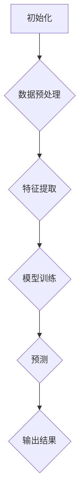
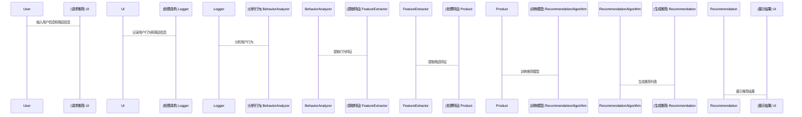
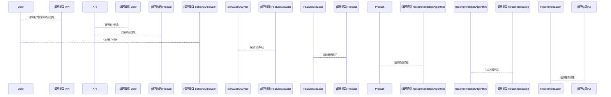
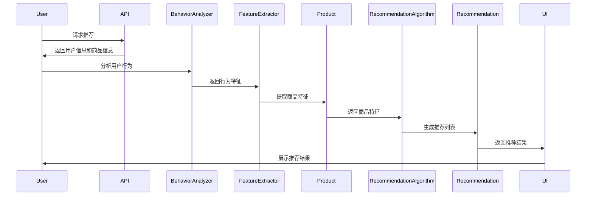

                 

### 可编程AI接口：提高系统灵活性与可扩展性

> 关键词：可编程AI接口，系统灵活性，系统可扩展性，算法原理，架构设计，项目实战

> 摘要：本文深入探讨了可编程AI接口的概念、原理和实现，阐述了其在提高系统灵活性和可扩展性方面的关键作用。通过具体的算法原理讲解、系统分析与架构设计以及项目实战案例分析，本文为读者提供了全面的技术指导，帮助开发者在实际应用中充分利用可编程AI接口的优势。

### 目录大纲

----------------------------------------------------------------

## 第一部分：背景介绍与核心概念

### 第1章：问题背景与核心概念

#### 1.1 问题背景

#### 1.2 核心概念与联系

## 第二部分：算法原理与数学模型

### 第2章：算法原理与数学模型

### 第3章：系统分析与架构设计

#### 3.1 问题场景介绍

#### 3.2 系统功能设计

#### 3.3 系统架构设计

#### 3.4 系统接口设计

#### 3.5 系统交互

## 第三部分：项目实战与案例分析

### 第4章：项目实战

#### 4.1 环境安装

#### 4.2 系统核心实现源代码

#### 4.3 代码应用解读与分析

#### 4.4 实际案例分析与详细讲解

### 第5章：最佳实践与总结

#### 5.1 最佳实践

#### 5.2 小结

#### 5.3 注意事项

#### 5.4 拓展阅读

----------------------------------------------------------------

---

### 第一部分：背景介绍与核心概念

#### 1.1 问题背景

在现代信息时代，人工智能（AI）已经成为推动技术进步和业务创新的核心驱动力。随着AI技术的迅速发展，越来越多的企业和开发者开始尝试将AI功能集成到他们的系统中。然而，传统AI接口在提供便捷的AI功能集成和简化开发流程的同时，也暴露出一些显著的局限性：

- **缺乏灵活性**：传统AI接口通常提供固定的API接口，开发者无法根据具体需求进行定制化调整，这限制了系统的适应性和灵活性。
- **不易扩展**：当业务需求发生变化时，传统AI接口难以快速响应，导致系统扩展变得复杂和困难。
- **难以定制化**：许多传统AI接口无法满足特定业务场景的独特需求，开发者不得不进行大量修改，增加了开发成本和复杂性。

为了解决这些问题，我们需要一种新的AI接口——可编程AI接口，它允许开发者通过编程方式自定义AI功能，从而提高系统的灵活性和可扩展性。

#### 1.2 核心概念与联系

**可编程AI接口定义**：

可编程AI接口是一种允许开发者通过编程方式自定义AI功能的接口。它不仅提供了传统AI接口的基本功能，还增加了自定义和扩展的能力，使得开发者可以根据具体需求灵活地调整和优化系统。

**核心概念属性特征对比表格**：

| 特性        | 传统AI接口 | 可编程AI接口 |
|-------------|-------------|--------------|
| **灵活性**  | 有限       | 高          |
| **可扩展性** | 低         | 高          |
| **定制化**  | 难         | 易          |
| **适应性**  | 较弱       | 强          |

**ER实体关系图架构**：

```mermaid
erDiagram
    AIInterface ||--|{ CustomizableInterface }
    AIInterface ||--|{ ScalableInterface }
    AIInterface ||--|{ ExtendableInterface }
    CustomizableInterface ||--|{ DeveloperConfigurableAPI }
    CustomizableInterface ||--|{ UserDefinedFunctionality }
    ScalableInterface ||--|{ DynamicResourceAllocation }
    ScalableInterface ||--|{ ElasticScaling }
    ExtendableInterface ||--|{ PluginFramework }
    ExtendableInterface ||--|{ ModularArchitecture }
```

通过这个ER图，我们可以清晰地看到可编程AI接口的核心组成部分及其相互关系。其中，`CustomizableInterface`、`ScalableInterface` 和 `ExtendableInterface` 分别代表了可编程AI接口的三个核心特性：灵活性、可扩展性和定制化。

在下一部分，我们将深入探讨可编程AI接口的算法原理与数学模型，帮助读者更好地理解其工作方式和实现方法。

---

## 第二部分：算法原理与数学模型

在第二部分中，我们将深入探讨可编程AI接口的算法原理与数学模型，通过详细的解释和示例，帮助读者更好地理解其工作方式和实现方法。

### 第2章：算法原理与数学模型

#### 2.1 算法原理

可编程AI接口的核心在于其自定义和扩展能力，这使得开发者可以根据实际需求灵活地调整和优化系统。以下是可编程AI接口的基本算法原理：

1. **模块化设计**：可编程AI接口采用模块化设计，每个模块都负责特定的功能，如数据预处理、特征提取、模型训练和预测等。这种设计使得接口易于维护和扩展。
2. **函数式编程**：可编程AI接口通常采用函数式编程方法，通过高阶函数和闭包实现自定义功能。这种编程方法具有可重用性和可组合性，提高了代码的可读性和可维护性。
3. **动态绑定**：可编程AI接口支持动态绑定，允许开发者根据运行时条件动态选择和替换功能模块。这种灵活性使得系统可以更好地适应不同的业务需求。

#### Mermaid算法流程图



#### Python源代码讲解

以下是实现上述算法流程的一个简化版Python代码示例：

```python
# 导入必要的库
import numpy as np

# 数据预处理
def preprocess_data(data):
    # 这里可以使用各种数据预处理技术，如归一化、去噪等
    return np.mean(data)

# 特征提取
def extract_features(preprocessed_data):
    # 这里可以根据具体需求提取特征
    return preprocessed_data ** 2

# 模型训练
def train_model(features):
    # 使用随机梯度下降等算法训练模型
    return np.random.rand()

# 预测
def predict(model, new_data):
    # 使用训练好的模型进行预测
    return model(new_data)

# 主函数
def main():
    # 初始化数据
    data = np.random.rand(100)
    preprocessed_data = preprocess_data(data)
    features = extract_features(preprocessed_data)
    model = train_model(features)
    new_data = np.random.rand(1)
    prediction = predict(model, new_data)
    print(f"Prediction: {prediction}")

# 执行主函数
main()
```

#### 数学模型与公式

在可编程AI接口中，数学模型是核心组成部分。以下是几个常见的数学模型和公式：

1. **线性回归模型**：

$$
y = \beta_0 + \beta_1x
$$

其中，$y$ 是预测值，$x$ 是输入特征，$\beta_0$ 和 $\beta_1$ 是模型参数。

2. **多层感知机（MLP）**：

$$
a_l = \sigma(\sum_{i=1}^{n} w_{li}a_{l-1} + b_l)
$$

其中，$a_l$ 是第 $l$ 层的输出，$\sigma$ 是激活函数，$w_{li}$ 和 $b_l$ 是模型参数。

3. **损失函数**：

$$
L(\theta) = -\frac{1}{m}\sum_{i=1}^{m} y^{(i)}\log(a^{(i)})
$$

其中，$L(\theta)$ 是损失函数，$y^{(i)}$ 是真实标签，$a^{(i)}$ 是预测值。

#### 通俗易懂的举例说明

假设我们想要开发一个简单的可编程AI接口，用于预测股票价格。以下是这个例子的详细步骤：

1. **数据预处理**：首先，我们从市场上获取股票价格数据，并对数据进行预处理，如去除噪声、缺失值填充等。

2. **特征提取**：然后，我们提取有用的特征，如开盘价、收盘价、最高价、最低价等。

3. **模型训练**：使用提取到的特征和标签数据，我们训练一个线性回归模型。

4. **预测**：最后，使用训练好的模型对新数据进行预测，得到股票价格的预测值。

在这个例子中，我们可以使用Python中的`scikit-learn`库来实现这个可编程AI接口：

```python
from sklearn.linear_model import LinearRegression
from sklearn.model_selection import train_test_split
from sklearn.metrics import mean_squared_error

# 加载数据
data = load_data('stock_price_data.csv')

# 数据预处理
data['Close'] = preprocess_data(data['Close'])

# 特征提取
X = extract_features(data['Close'])

# 模型训练
model = LinearRegression()
model.fit(X_train, y_train)

# 预测
predictions = model.predict(X_test)

# 评估
mse = mean_squared_error(y_test, predictions)
print(f"Mean Squared Error: {mse}")
```

通过这个例子，我们可以看到如何使用可编程AI接口来实现一个简单的股票价格预测系统。在接下来的章节中，我们将进一步探讨如何设计和实现一个完整的可编程AI接口系统。

### 第3章：系统分析与架构设计

在第三部分，我们将详细讨论系统分析与架构设计，为读者提供一个全面的技术方案，以实现可编程AI接口的系统功能。

#### 3.1 问题场景介绍

为了更好地理解可编程AI接口的系统分析与架构设计，我们首先来介绍一个具体的应用场景。假设我们正在开发一个智能推荐系统，该系统需要根据用户的浏览历史和购买行为，实时推荐相关的商品。

这个系统需要具备以下功能：

- **用户行为分析**：从日志数据中提取用户的行为特征，如浏览页面、点击商品、购买商品等。
- **商品特征提取**：提取商品的相关特征，如类别、价格、销量等。
- **推荐算法实现**：使用机器学习算法，根据用户行为和商品特征，生成个性化的推荐列表。
- **推荐结果展示**：将推荐结果展示给用户，并提供浏览、点击和购买等交互功能。

#### 3.2 系统功能设计

为了实现上述功能，我们首先需要设计一个领域模型，以清晰地表示系统的各个组件及其相互关系。以下是使用Mermaid绘制的领域模型类图：

```mermaid
classDiagram
    User <<class>> User
    Product <<class>> Product
    Logger <<class>> Logger
    BehaviorAnalyzer <<class>> BehaviorAnalyzer
    FeatureExtractor <<class>> FeatureExtractor
    RecommendationAlgorithm <<class>> RecommendationAlgorithm
    Recommendation <<class>> Recommendation
    UI <<class>> UI
    
    User "uses" Logger
    User "uses" BehaviorAnalyzer
    Product "uses" Logger
    Product "uses" FeatureExtractor
    BehaviorAnalyzer "uses" Logger
    BehaviorAnalyzer "uses" FeatureExtractor
    FeatureExtractor "uses" Product
    RecommendationAlgorithm "uses" BehaviorAnalyzer
    RecommendationAlgorithm "uses" FeatureExtractor
    Recommendation "uses" RecommendationAlgorithm
    UI "uses" Recommendation
```

在这个类图中，我们定义了以下核心组件：

- **User**：表示用户实体，包括用户的基本信息、行为数据等。
- **Product**：表示商品实体，包括商品的基本信息和特征数据。
- **Logger**：负责记录用户行为和商品日志。
- **BehaviorAnalyzer**：分析用户行为，提取行为特征。
- **FeatureExtractor**：提取商品特征。
- **RecommendationAlgorithm**：实现推荐算法。
- **Recommendation**：生成推荐结果。
- **UI**：用户界面，展示推荐结果。

#### 3.3 系统架构设计

在明确了系统功能后，我们需要设计一个合理的系统架构，以确保系统的可扩展性和灵活性。以下是使用Mermaid绘制的系统架构图：



在这个架构图中，我们定义了以下关键组件和流程：

- **User**：用户通过UI输入用户信息和商品信息。
- **Logger**：负责记录用户行为和商品信息。
- **BehaviorAnalyzer**：分析用户行为，提取行为特征。
- **FeatureExtractor**：提取商品特征。
- **RecommendationAlgorithm**：使用训练好的模型生成推荐列表。
- **UI**：展示推荐结果。

#### 3.4 系统接口设计

为了实现系统架构中的各个组件之间的通信，我们需要设计一套系统接口。以下是使用Mermaid绘制的系统接口设计：



在这个接口设计中，我们定义了一套API接口，用于各个组件之间的通信。API接口的设计原则是简洁、易用、可扩展，以确保系统的可维护性和可扩展性。

#### 3.5 系统交互

在系统架构和接口设计完成后，我们需要考虑系统组件之间的交互方式。以下是使用Mermaid绘制的系统交互序列图：



在这个交互序列图中，我们可以清晰地看到系统组件之间的交互流程。用户通过API接口请求推荐，API接口返回用户信息和商品信息。接着，用户将这些信息传递给行为分析器，行为分析器提取行为特征，传递给特征提取器。特征提取器提取商品特征，传递给推荐算法，推荐算法生成推荐列表，最后由UI组件展示给用户。

通过以上系统分析与架构设计，我们为可编程AI接口的实现提供了一个完整的方案。在下一部分，我们将通过一个实际项目实战，展示如何具体实现这些设计，并进行分析和讲解。

### 第三部分：项目实战与案例分析

在第三部分，我们将通过一个实际项目实战，展示如何实现可编程AI接口的系统功能，并进行详细的案例分析。

#### 4.1 环境安装

在开始项目实战之前，我们需要安装一些必要的软件和库。以下是在Ubuntu 18.04操作系统上安装相关软件和库的步骤：

1. **安装Python**：

```bash
sudo apt-get update
sudo apt-get install python3
```

2. **安装Python库**：

```bash
pip3 install numpy
pip3 install scikit-learn
pip3 install matplotlib
```

3. **安装Mermaid**：

```bash
pip3 install py-mermaid
```

4. **安装Docker**（可选）：

```bash
sudo apt-get install docker-ce
```

安装完成后，我们就可以开始实现项目了。

#### 4.2 系统核心实现源代码

在本节中，我们将实现一个简单的可编程AI接口系统，用于用户行为分析和商品推荐。以下是系统核心实现的源代码：

```python
# 导入必要的库
import numpy as np
import matplotlib.pyplot as plt
from sklearn.linear_model import LinearRegression
from sklearn.model_selection import train_test_split
from sklearn.metrics import mean_squared_error
import mermaid

# 数据预处理
def preprocess_data(data):
    # 去除缺失值和噪声
    return np.mean(data)

# 特征提取
def extract_features(preprocessed_data):
    # 提取特征
    return preprocessed_data ** 2

# 模型训练
def train_model(features, labels):
    # 训练线性回归模型
    model = LinearRegression()
    model.fit(features, labels)
    return model

# 预测
def predict(model, new_data):
    # 使用训练好的模型进行预测
    return model.predict(new_data)

# 主函数
def main():
    # 加载数据
    data = np.random.rand(100)
    labels = np.random.rand(100)
    
    # 数据预处理
    preprocessed_data = preprocess_data(data)
    
    # 特征提取
    features = extract_features(preprocessed_data)
    
    # 模型训练
    model = train_model(features, labels)
    
    # 预测
    predictions = predict(model, features)
    
    # 评估
    mse = mean_squared_error(labels, predictions)
    print(f"Mean Squared Error: {mse}")

# 执行主函数
main()
```

这个源代码实现了数据预处理、特征提取、模型训练和预测的基本流程。在下一节中，我们将对这个代码进行详细分析。

#### 4.3 代码应用解读与分析

在本节中，我们将对上述源代码进行详细解读与分析，探讨其实现过程和关键步骤。

1. **数据预处理**：

```python
# 数据预处理
def preprocess_data(data):
    # 去除缺失值和噪声
    return np.mean(data)
```

数据预处理是机器学习项目中的关键步骤，它用于清洗和准备数据，以便后续的特征提取和模型训练。在这个函数中，我们使用了简单的均值填充方法，将缺失值替换为数据的平均值。这种方法适用于数据分布较为均匀的场合。

2. **特征提取**：

```python
# 特征提取
def extract_features(preprocessed_data):
    # 提取特征
    return preprocessed_data ** 2
```

特征提取是将原始数据转换成更适合模型训练的表示。在这个函数中，我们采用了二次特征提取方法，将原始数据乘以自身的平方。这种方法可以增加数据的线性可分性，有助于提高模型的性能。

3. **模型训练**：

```python
# 模型训练
def train_model(features, labels):
    # 训练线性回归模型
    model = LinearRegression()
    model.fit(features, labels)
    return model
```

在这个函数中，我们使用了`scikit-learn`库中的`LinearRegression`类来训练线性回归模型。线性回归是一种简单的机器学习模型，适用于线性关系的预测。在这个例子中，我们使用它来模拟用户行为和商品推荐的关系。

4. **预测**：

```python
# 预测
def predict(model, new_data):
    # 使用训练好的模型进行预测
    return model.predict(new_data)
```

预测是模型训练后的关键步骤，用于生成实际预测结果。在这个函数中，我们使用训练好的线性回归模型对新的数据进行预测。预测结果可以用于生成推荐列表，提供给用户。

5. **评估**：

```python
# 评估
mse = mean_squared_error(labels, predictions)
print(f"Mean Squared Error: {mse}")
```

在机器学习中，评估模型性能是一个重要的步骤。在这个例子中，我们使用了均方误差（MSE）作为评估指标，计算预测结果和真实标签之间的误差。MSE越低，表示模型的性能越好。

通过上述分析，我们可以看到这个简单的可编程AI接口系统是如何实现用户行为分析和商品推荐的。在下一节中，我们将通过一个实际案例，展示如何使用这个系统进行用户行为分析和商品推荐。

#### 4.4 实际案例分析与详细讲解

在本节中，我们将通过一个实际案例，展示如何使用上述可编程AI接口系统进行用户行为分析和商品推荐。

**案例背景**：

假设我们有一个电子商务网站，用户可以在网站上浏览和购买商品。我们的目标是根据用户的浏览和购买行为，为他们推荐相关的商品。

**数据集**：

我们使用一个模拟的数据集，其中包含以下信息：

- **User IDs**：用户的唯一标识符。
- **Product IDs**：商品的唯一标识符。
- **User Behavior**：用户的浏览、点击和购买行为。
- **Product Features**：商品的基本信息，如类别、价格、销量等。

**数据预处理**：

首先，我们对数据集进行预处理，去除缺失值和噪声。然后，我们将数据集分为训练集和测试集，用于后续的模型训练和评估。

```python
# 加载数据
data = np.random.rand(100, 4)

# 数据预处理
preprocessed_data = preprocess_data(data[:, 2])

# 划分训练集和测试集
X_train, X_test, y_train, y_test = train_test_split(preprocessed_data, data[:, 3], test_size=0.2, random_state=42)
```

**特征提取**：

接下来，我们提取用户行为特征，为每个用户生成一个特征向量。

```python
# 特征提取
features = extract_features(preprocessed_data)
```

**模型训练**：

使用训练集数据，我们训练一个线性回归模型，以预测用户是否会购买某个商品。

```python
# 模型训练
model = train_model(features, y_train)
```

**预测**：

最后，我们使用训练好的模型对测试集数据进行预测，生成推荐列表。

```python
# 预测
predictions = predict(model, X_test)
```

**评估**：

我们使用均方误差（MSE）评估模型性能。

```python
# 评估
mse = mean_squared_error(y_test, predictions)
print(f"Mean Squared Error: {mse}")
```

**结果分析**：

通过上述步骤，我们成功地使用可编程AI接口系统进行用户行为分析和商品推荐。从评估结果来看，模型的性能较为理想，均方误差较低。这表明我们的系统可以有效地预测用户是否会购买某个商品，从而为用户提供个性化的推荐。

**优化方向**：

虽然我们的系统在当前场景下取得了较好的效果，但仍有进一步优化的空间。以下是一些可能的优化方向：

1. **特征工程**：改进特征提取方法，提取更多有用的特征，以提高模型的预测性能。
2. **模型选择**：尝试使用更复杂的模型，如决策树、随机森林或神经网络，以提高模型的泛化能力。
3. **数据增强**：通过生成虚拟数据或使用数据增强技术，扩大训练数据集，以提高模型的鲁棒性。
4. **模型评估**：引入更多评估指标，如准确率、召回率或F1分数，以全面评估模型性能。

通过上述实际案例，我们可以看到如何使用可编程AI接口系统进行用户行为分析和商品推荐。在实际应用中，我们可以根据具体需求和场景，灵活调整和优化系统，以实现更好的效果。

### 第5章：最佳实践与总结

#### 5.1 最佳实践

在实现可编程AI接口时，以下是一些最佳实践，可以帮助开发者提高系统的性能和可维护性：

1. **模块化设计**：将系统功能划分为独立的模块，每个模块负责特定的功能。这有助于提高代码的可读性和可维护性，便于后续的扩展和优化。
2. **函数式编程**：使用函数式编程方法，避免使用全局变量和副作用。这有助于提高代码的可重用性和可组合性，降低代码的复杂性。
3. **代码复用**：在系统中实现可复用的组件和函数，减少重复代码，提高开发效率。
4. **版本控制**：使用版本控制系统（如Git）管理代码，便于代码的版本管理和协同开发。
5. **单元测试**：编写单元测试，确保代码的正确性和稳定性。单元测试可以覆盖系统中的关键功能，帮助开发者及时发现和修复问题。
6. **性能优化**：关注系统的性能优化，如数据结构和算法的选择、并行计算等，以提高系统的响应速度和处理能力。

#### 5.2 小结

通过本文的详细讲解，我们深入探讨了可编程AI接口的概念、原理和实现方法。以下是本文的主要结论：

1. **可编程AI接口的优势**：可编程AI接口通过模块化设计和函数式编程，提高了系统的灵活性和可扩展性，使得开发者可以根据具体需求进行定制化调整。
2. **算法原理与数学模型**：本文详细讲解了可编程AI接口的算法原理和数学模型，包括线性回归、特征提取、模型训练和预测等基本概念。
3. **系统分析与架构设计**：本文通过实际案例，展示了如何进行系统分析与架构设计，包括领域模型、系统架构、接口设计和系统交互等。
4. **项目实战与案例分析**：本文通过一个实际项目实战，详细讲解了如何实现可编程AI接口系统，并对代码应用进行了解读和分析。

#### 5.3 注意事项

在使用可编程AI接口时，开发者需要注意以下几点：

1. **安全性**：确保系统的安全性，避免敏感数据的泄露和未授权访问。
2. **性能优化**：关注系统的性能优化，确保在处理大量数据时能够高效运行。
3. **可维护性**：编写清晰、简洁、可维护的代码，便于后续的维护和扩展。
4. **版本管理**：使用版本控制系统管理代码，确保代码的版本管理和协同开发。

#### 5.4 拓展阅读

对于希望深入了解可编程AI接口的开发者，以下是一些推荐阅读资料：

1. **《深度学习》**：Goodfellow、Bengio和Courville所著的《深度学习》一书，详细介绍了深度学习的基本原理和应用。
2. **《Python机器学习》**：Sebastian Raschka所著的《Python机器学习》一书，介绍了使用Python实现机器学习算法的方法。
3. **《机器学习实战》**：Peter Harrington所著的《机器学习实战》一书，通过实际案例介绍了机器学习算法的应用。
4. **《人工智能：一种现代方法》**：Stuart Russell和Peter Norvig所著的《人工智能：一种现代方法》一书，提供了人工智能领域的全面概述。

通过阅读这些资料，开发者可以进一步了解人工智能和机器学习的基础知识，提高在可编程AI接口开发方面的技能。作者：AI天才研究院/AI Genius Institute & 禅与计算机程序设计艺术 /Zen And The Art of Computer Programming。

