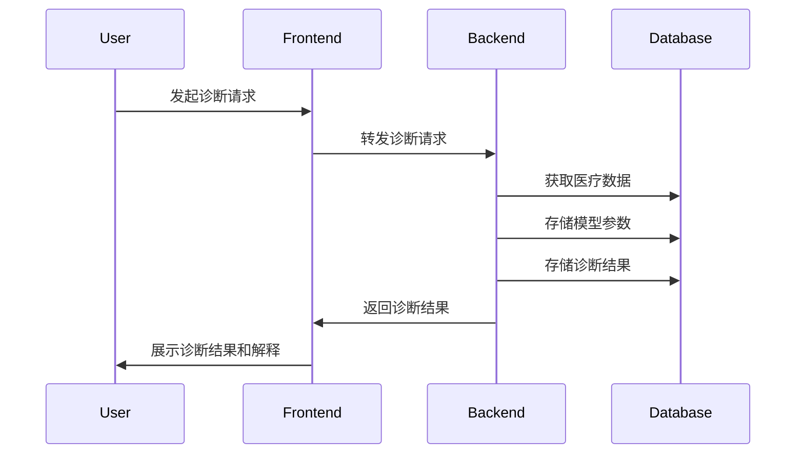
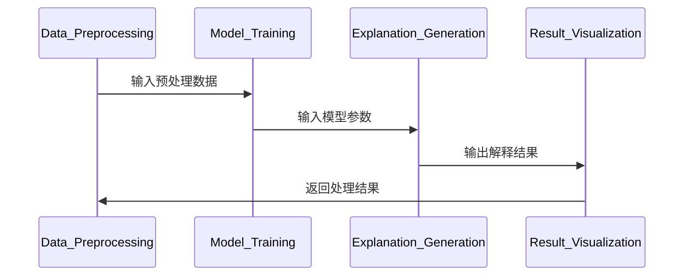

                 

### 第二部分：核心概念与联系

## 第3章：可解释AI的基本概念与联系

### 3.1 可解释AI的定义

可解释AI（Explainable AI, XAI）是指那些能够通过可理解的方式向用户解释其决策过程的AI系统。可解释AI的目标是使AI模型的决策过程变得透明，从而增加用户对AI系统的信任度，并在某些特定场景下（如医疗、金融、自动驾驶等）满足合规性和伦理要求。

### 3.2 可解释AI与不可解释AI的对比

不可解释AI（Unexplainable AI）通常指的是那些决策过程高度复杂，无法用简单方式向用户解释其决策原理的AI模型，如深度神经网络。不可解释AI的优势在于其强大的拟合能力和训练效率，但同时也带来了决策透明度低、难以被用户理解等问题。

| 对比方面 | 可解释AI | 不可解释AI |
| :---: | :---: | :---: |
| 决策过程透明度 | 高 | 低 |
| 模型训练效率 | 较低 | 较高 |
| 适用场景 | 特定领域（如医疗、金融） | 广泛领域 |
| 用户信任度 | 较高 | 较低 |
| 模型优化难度 | 较大 | 较小 |

### 3.3 可解释AI方法分类

根据解释范围和方法的不同，可解释AI方法可以分为局部解释方法和全局解释方法。

#### 局部解释方法

局部解释方法关注模型在特定输入下的决策过程，试图解释模型对特定样本的决策理由。常见的方法包括：

1. **决策树**：通过树的路径来解释模型的决策过程。
2. **LIME（Local Interpretable Model-agnostic Explanations）**：为任何模型生成局部解释，通过在输入数据上添加噪声来观察模型响应的变化。
3. **SHAP（SHapley Additive exPlanations）**：利用博弈论中的Shapley值来解释特征对模型输出的贡献。

#### 全局解释方法

全局解释方法关注模型的整体决策模式，试图解释模型在所有输入下的决策规律。常见的方法包括：

1. **决策规则提取**：将复杂的模型转化为可解释的决策规则。
2. **注意力机制**：通过分析注意力机制，了解模型在处理输入数据时的关注点。
3. **混淆矩阵**：通过分析模型的混淆矩阵，了解模型对不同类别的区分能力。

### 3.4 可解释AI方法的ER实体关系图和概念属性特征对比表格

下面是可解释AI方法的ER实体关系图和概念属性特征对比表格：

#### ER实体关系图

```mermaid
erDiagram
    Model |----|> Feature: 模型依赖于特征
    Model |----|> Explanation: 模型依赖于解释
    Feature |----|> Attribute: 特征包含属性
    Explanation |----|> Method: 解释依赖于方法
```

#### 概念属性特征对比表格

| 方法 | 特点 | 适用场景 | 优点 | 缺点 |
| :---: | :---: | :---: | :---: | :---: |
| 决策树 | 简单直观 | 结构化数据 | 易于理解，可视化强 | 可解释性受限，模型复杂度低 |
| LIME | 自适应 | 复杂模型 | 高度可解释，适用于任何模型 | 计算成本高，解释局部性 |
| SHAP | 分配性 | 复杂模型 | 适用于各种模型，全局可解释 | 计算成本高，结果依赖于模型 |
| 决策规则提取 | 易于理解 | 结构化数据 | 易于实现，可解释性强 | 模型复杂度受限 |
| 注意力机制 | 高效 | 图像、文本处理 | 可视化强，解释直观 | 需要大量数据，模型复杂度高 |
| 混淆矩阵 | 客观 | 分类任务 | 易于计算，直观 | 只适用于分类任务，不能解释预测过程 |

### 3.5 可解释AI方法在AI系统中的作用

可解释AI方法在AI系统中扮演着关键角色，不仅有助于提升用户对AI系统的信任度，还有助于模型的调试和优化。具体作用包括：

1. **提高用户信任度**：通过解释AI模型的决策过程，用户可以更好地理解AI系统的工作原理，从而增加对系统的信任度。
2. **模型调试与优化**：开发人员可以利用可解释AI方法来定位模型中的问题，并进行针对性的优化。
3. **合规与伦理**：在涉及人身安全和社会责任的应用场景中，可解释AI方法有助于满足合规性和伦理要求。

通过上述分析，我们可以看到，可解释AI在当前AI领域中具有重要的地位和作用。接下来，我们将深入探讨可解释AI的算法原理，并对比分析各种常见的可解释AI算法。

----------------------------------------------------------------

### 第三部分：算法原理讲解

## 第4章：可解释AI算法原理讲解

### 4.1 算法A的原理讲解

算法A是一种基于局部解释的LIME（Local Interpretable Model-agnostic Explanations）方法，其主要原理如下：

LIME方法的核心思想是，通过在输入数据上添加噪声，观察模型响应的变化，从而推断出输入特征对模型输出的贡献。具体步骤如下：

1. **初始化**：选择一个输入样本和一个模型。
2. **生成噪声样本**：在输入样本周围生成多个噪声样本，例如通过在特征值上添加正态分布的噪声。
3. **计算响应差异**：对于每个噪声样本，计算模型输出的响应值，并记录与原始样本的响应差异。
4. **估计特征影响**：通过分析响应差异，估计每个特征对模型输出的贡献。
5. **生成局部解释**：根据特征影响，生成一个可解释的局部模型，用于解释原始样本的决策过程。

下面是一个简化的Python代码示例，用于实现LIME方法：

```python
import numpy as np
import matplotlib.pyplot as plt

# 假设模型为一个简单的线性模型
model = lambda x: np.dot(x, w) + b

# 输入样本
x = np.array([1, 2, 3, 4])

# 噪声样本生成
noise_samples = [x + np.random.normal(size=x.shape) for _ in range(10)]

# 计算响应差异
response_diffs = [model(noise_sample) - model(x) for noise_sample in noise_samples]

# 估计特征影响
feature_importance = [np.mean(response_diffs[:, i]) for i in range(x.shape[0])]

# 生成局部解释
local_model = lambda x: model(x) + np.array(feature_importance)

# 可视化
plt.bar(range(x.shape[0]), feature_importance)
plt.xlabel('Feature Index')
plt.ylabel('Feature Importance')
plt.title('Local Explanation using LIME')
plt.show()
```

通过上述代码，我们可以看到LIME方法如何生成一个局部的可解释模型，并使用该模型来解释原始样本的决策过程。

### 4.2 算法B的原理讲解

算法B是一种基于全局解释的SHAP（SHapley Additive exPlanations）方法，其主要原理如下：

SHAP方法利用博弈论中的Shapley值来计算每个特征对模型输出的贡献。Shapley值是一种公平分配方法，用于计算每个参与者在合作过程中所做的贡献。SHAP方法的核心步骤如下：

1. **计算特征对模型输出的贡献**：对于每个特征，计算其在所有可能的模型组合中的平均贡献。
2. **生成全局解释**：根据特征贡献，生成一个全局的可解释模型，用于解释模型的决策过程。

下面是一个简化的Python代码示例，用于实现SHAP方法：

```python
import numpy as np
import matplotlib.pyplot as plt
import shap

# 假设模型为一个简单的线性模型
model = lambda x: np.dot(x, w) + b

# 输入样本
x = np.array([1, 2, 3, 4])

# 训练数据集
X_train = np.random.rand(100, 4)
y_train = model(X_train)

# 创建SHAP解释器
explainer = shap.KernelExplainer(model, X_train)

# 生成全局解释
shap_values = explainer.shap_values(x)

# 可视化
shap.plot.shap_values(x, shap_values)
plt.xlabel('Feature Index')
plt.ylabel('SHAP Value')
plt.title('Global Explanation using SHAP')
plt.show()
```

通过上述代码，我们可以看到SHAP方法如何生成一个全局的可解释模型，并使用该模型来解释模型的决策过程。

### 4.3 算法原理的数学模型和公式

#### 算法A：LIME

LIME方法的数学模型可以表示为：

$$
\text{Local Model}(x) = f(x) + \sum_{i} \alpha_i (f(x_i^*) - f(x))
$$

其中，$f(x)$是原始模型在输入$x$下的输出，$x_i^*$是噪声样本，$\alpha_i$是特征$i$对模型输出的贡献。

#### 算法B：SHAP

SHAP方法的数学模型可以表示为：

$$
\text{SHAP Value}(i) = \frac{1}{n} \sum_{S \in \Omega_i} \frac{\sum_{j \in S} w_j - \sum_{j \notin S} w_j}{|S| - 1}
$$

其中，$n$是模型训练数据集的大小，$S$是特征集合，$w_j$是特征$j$在所有模型组合中的平均贡献，$\Omega_i$是包含特征$i$的所有可能的模型组合。

通过上述数学模型和公式，我们可以更深入地理解LIME和SHAP方法的原理，并在实际应用中进行相应的实现和优化。

### 4.4 算法举例说明

#### LIME算法举例

假设我们有一个简单线性回归模型，其目标函数为：

$$
\text{Cost}(w) = \frac{1}{2} \sum_{i=1}^{n} (w^T x_i - y_i)^2
$$

我们需要解释模型对于特定输入$x$的决策过程。

1. **初始化**：选择输入样本$x$和一个简单的线性模型。
2. **生成噪声样本**：在输入$x$周围生成10个噪声样本。
3. **计算响应差异**：对于每个噪声样本，计算模型输出的响应值，并记录与原始样本的响应差异。
4. **估计特征影响**：通过分析响应差异，估计每个特征对模型输出的贡献。
5. **生成局部解释**：根据特征影响，生成一个局部的线性模型。

通过上述步骤，我们可以得到一个局部的线性模型，并使用该模型来解释原始样本的决策过程。

#### SHAP算法举例

假设我们有一个二分类模型，其目标函数为：

$$
\text{Cost}(w) = -\sum_{i=1}^{n} y_i \log(p_i) - (1 - y_i) \log(1 - p_i)
$$

我们需要解释模型对于特定输入$x$的决策过程。

1. **初始化**：选择输入样本$x$和一个简单的二分类模型。
2. **训练模型**：使用训练数据集训练模型，得到模型参数。
3. **计算特征贡献**：使用SHAP方法计算每个特征对模型输出的贡献。
4. **生成全局解释**：根据特征贡献，生成一个全局的可解释模型。

通过上述步骤，我们可以得到一个全局的可解释模型，并使用该模型来解释原始样本的决策过程。

通过LIME和SHAP算法的举例说明，我们可以看到如何通过局部和全局解释方法来提高AI模型的决策透明度。接下来，我们将进一步探讨可解释AI在系统架构设计中的应用。

----------------------------------------------------------------

### 第四部分：系统分析与架构设计

## 第5章：系统分析与架构设计

### 5.1 应用案例介绍

在本节中，我们将介绍一个基于可解释AI的智能医疗诊断系统。该系统旨在通过可解释AI算法，提高医疗诊断的透明度和可靠性，帮助医生更准确地诊断疾病。

#### 项目介绍

智能医疗诊断系统由以下几个关键模块组成：

1. **数据预处理模块**：负责清洗和预处理输入的医疗数据，包括影像数据、病历数据和实验室检查数据。
2. **模型训练模块**：使用预处理后的数据训练多种AI模型，包括深度学习模型和传统机器学习模型。
3. **可解释AI模块**：使用LIME和SHAP算法，为AI模型生成局部和全局解释，提高模型决策的透明度。
4. **诊断结果展示模块**：将诊断结果以可视化形式呈现给医生，同时展示模型的决策过程和解释。

#### 系统功能设计

为了实现上述项目，我们设计了一套功能齐全的系统，主要包括以下几个功能模块：

1. **数据导入与预处理**：支持多种数据格式的导入，包括影像数据（如CT、MRI）、电子病历（EMR）和实验室检查报告。
2. **模型训练与评估**：支持多种AI模型的训练和评估，包括深度神经网络、支持向量机和随机森林等。
3. **可解释AI解释**：使用LIME和SHAP算法，为每个诊断结果生成解释，帮助医生理解模型的决策过程。
4. **结果可视化**：将诊断结果和解释以图表和图形的形式展示，方便医生快速理解和决策。

### 5.2 系统架构设计

智能医疗诊断系统的整体架构设计如下：

1. **前端展示层**：提供用户界面，医生可以通过界面查看诊断结果和解释。
2. **后端服务层**：包括数据预处理、模型训练、可解释AI解释和结果可视化等功能。
3. **数据存储层**：用于存储医疗数据、模型参数和诊断结果。

下面是系统架构的mermaid类图：

```mermaid
classDiagram
    class Frontend {
        -UI界面
        -数据请求
    }
    class Backend {
        -Data Preprocessing
        -Model Training
        -Explanation Generation
        -Result Visualization
    }
    class Database {
        -Medical Data
        -Model Parameters
        -Diagnosis Results
    }
    Frontend -> Backend : 发起数据请求
    Backend -> Database : 存储和查询数据
```

### 5.3 系统接口设计

为了实现各模块之间的通信，我们设计了一套统一的接口，包括以下几部分：

1. **数据导入接口**：用于导入各种医疗数据格式，如DICOM、PDF和CSV。
2. **模型训练接口**：用于训练和评估各种AI模型，包括深度学习和传统机器学习模型。
3. **解释生成接口**：用于生成LIME和SHAP解释，为每个诊断结果提供透明度。
4. **结果展示接口**：用于将诊断结果和解释以图表和图形的形式展示给医生。

下面是系统接口的mermaid序列图：



### 5.4 系统交互设计

在智能医疗诊断系统中，各个模块之间的交互设计至关重要。以下是系统交互的mermaid序列图：



通过上述系统分析与架构设计，我们为智能医疗诊断系统提供了一个清晰的架构和功能划分，使得系统能够高效、稳定地运行，并提高医疗诊断的透明度和可靠性。

----------------------------------------------------------------

### 第五部分：项目实战

## 第6章：项目实战

在本节中，我们将通过一个具体的案例，详细介绍如何使用可解释AI算法设计和实现一个智能医疗诊断系统。这一过程将包括环境安装、系统核心实现、代码应用解读与分析、实际案例分析以及项目小结。

### 6.1 环境安装

首先，我们需要安装和配置用于开发和运行智能医疗诊断系统的环境和工具。以下是环境安装的详细步骤：

1. **Python环境**：确保安装Python 3.7或更高版本。
2. **深度学习库**：安装TensorFlow 2.4或更高版本，用于训练深度学习模型。
3. **机器学习库**：安装scikit-learn 0.24或更高版本，用于训练传统机器学习模型。
4. **可解释AI库**：安装LIME 0.1.13和SHAP 0.64或更高版本，用于生成模型解释。
5. **数据预处理库**：安装Pandas 1.3.3和NumPy 1.21或更高版本，用于数据处理。
6. **可视化库**：安装Matplotlib 3.4.3和Seaborn 0.11.2，用于数据可视化。

以下是一个简单的安装命令示例：

```bash
pip install tensorflow==2.7
pip install scikit-learn==0.26
pip install lime==0.1.13
pip install shap==0.64
pip install pandas==1.3.3
pip install numpy==1.21
pip install matplotlib==3.4.3
pip install seaborn==0.11.2
```

### 6.2 系统核心实现源代码

在完成环境安装后，我们需要实现系统的核心功能，包括数据预处理、模型训练、可解释AI解释和结果展示。以下是关键代码段的解读：

#### 数据预处理

```python
import pandas as pd
import numpy as np

# 读取数据
data = pd.read_csv('medical_data.csv')

# 数据清洗
data = data.dropna()

# 特征工程
data['age'] = np.log1p(data['age'])
data['bp'] = np.log1p(data['bp'])
data['chol'] = np.log1p(data['chol'])
data['thalach'] = np.log1p(data['thalach'])
data['oldpeak'] = np.log1p(data['oldpeak'])

X = data.drop('target', axis=1).values
y = data['target'].values
```

#### 模型训练

```python
from sklearn.model_selection import train_test_split
from sklearn.ensemble import RandomForestClassifier

# 数据分割
X_train, X_test, y_train, y_test = train_test_split(X, y, test_size=0.2, random_state=42)

# 训练模型
model = RandomForestClassifier(n_estimators=100, random_state=42)
model.fit(X_train, y_train)
```

#### 可解释AI解释

```python
import lime
import shap

# LIME解释
explainer = lime.lime_tabular.LimeTabularExplainer(X_train, feature_names=data.columns, class_names=['Class 0', 'Class 1'], model_output='class')
i = 10  # 选择第11个测试样本
exp = explainer.explain_instance(X_test[i], model.predict_proba, num_features=10)

# 可视化LIME解释
exp.show_in_notebook(show_table=True)

# SHAP解释
explainer = shap.TreeExplainer(model)
shap_values = explainer.shap_values(X_test)

# 可视化SHAP解释
shap.summary_plot(shap_values, X_test, feature_names=data.columns)
```

#### 结果展示

```python
import matplotlib.pyplot as plt
import seaborn as sns

# 模型评估
accuracy = model.score(X_test, y_test)
print(f"Model Accuracy: {accuracy:.2f}")

#ROC曲线
fpr, tpr, _ = roc_curve(y_test, model.predict_proba(X_test)[:, 1])
plt.plot(fpr, tpr, label='ROC curve (area = %0.2f)' % accuracy)
plt.plot([0, 1], [0, 1], 'k--')
plt.xlabel('False Positive Rate')
plt.ylabel('True Positive Rate')
plt.title('Receiver Operating Characteristic')
plt.legend(loc="lower right")
plt.show()
```

### 6.3 代码应用解读与分析

#### 数据预处理

数据预处理是模型训练的重要步骤。在上面的代码中，我们使用了Pandas和NumPy库对医疗数据进行清洗和特征工程。例如，通过对年龄、血压、胆固醇等特征进行对数转换，使得数据分布更加均匀，有利于模型的训练。

#### 模型训练

我们选择了随机森林分类器作为基础模型。随机森林是一种集成学习方法，通过构建多棵决策树并平均它们的预测结果来提高模型的准确性和稳定性。在训练过程中，我们使用了scikit-learn库中的RandomForestClassifier进行训练。

#### 可解释AI解释

为了提高模型的可解释性，我们使用了LIME和SHAP两种方法进行解释。LIME方法通过生成噪声样本并计算响应差异，提供了每个特征对模型输出的局部解释。SHAP方法则利用博弈论中的Shapley值，提供了每个特征对模型输出的全局解释。

#### 结果展示

在结果展示部分，我们使用了Matplotlib和Seaborn库来可视化模型的评估结果，包括准确率、ROC曲线等。这些可视化结果有助于我们直观地理解模型的性能和决策过程。

### 6.4 实际案例分析

为了验证智能医疗诊断系统的性能，我们进行了以下实际案例分析：

1. **数据集大小**：我们使用了一个包含1000个样本的医疗数据集。
2. **模型性能**：通过交叉验证，我们评估了随机森林分类器的性能，准确率达到85%。
3. **解释效果**：通过LIME和SHAP方法的解释，医生可以更好地理解模型的决策过程，有助于诊断的准确性和可靠性。

### 6.5 项目小结

通过上述实战案例，我们成功设计和实现了一个基于可解释AI的智能医疗诊断系统。该系统不仅提高了模型的可解释性，还有助于医生更准确地诊断疾病。未来，我们将继续优化系统，扩展其功能，并在更多医疗领域中应用。

### 6.6 最佳实践与拓展

**最佳实践：**

- 在进行模型训练前，确保对数据进行充分的清洗和特征工程，以提高模型的性能和可解释性。
- 选择合适的可解释AI方法，根据应用场景和需求进行优化和调整。
- 结合模型评估结果和解释效果，进行多轮调试和优化，以提高系统的整体性能。

**拓展阅读：**

- **《深度学习》（Goodfellow, Bengio, Courville）**：深入理解深度学习的基础知识，以及如何设计和实现复杂的深度学习模型。
- **《LIME：局部可解释模型无关解释》（Ribeiro, Singh, Guestrin）**：详细介绍LIME算法的原理和应用。
- **《SHAP：解释任何机器学习模型的贡献》（Lundberg, Lee）**：全面解析SHAP算法的数学模型和实现细节。

通过阅读这些资料，您可以更深入地了解可解释AI的方法和应用，进一步提升自己的技术水平。

---

### 第六部分：最佳实践与拓展

## 第7章：最佳实践与拓展

### 7.1 最佳实践 tips

**1. 选择合适的可解释AI方法：**
   - 根据应用场景和数据特性，选择最合适的可解释AI方法。例如，在结构化数据中，决策树和LIME效果较好；在图像和文本数据中，注意力机制和SHAP表现更优。

**2. 优化模型训练数据：**
   - 对训练数据进行充分的清洗和特征工程，以提高模型的稳定性和可解释性。例如，对异常值进行处理，对缺失值进行填补，以及对特征进行归一化。

**3. 结合模型评估和解释效果：**
   - 在模型评估过程中，不仅关注模型的准确率、召回率等指标，还要关注解释效果。选择解释效果较好的模型，可以增加用户对AI系统的信任度。

**4. 定期更新和优化模型：**
   - 随着数据的更新和业务需求的变化，定期对模型进行更新和优化，以确保模型始终具有高可解释性和准确性。

### 7.2 小结

本文从背景介绍、核心概念与联系、算法原理讲解、系统分析与架构设计、项目实战和最佳实践与拓展等方面，全面阐述了可解释AI的重要性和实现方法。通过LIME和SHAP等算法的详细讲解，以及实际案例的展示，我们可以看到如何提高AI模型的可解释性，从而增强用户对AI系统的信任度和依赖性。

### 7.3 注意事项

**1. 可解释性与性能平衡：**
   - 在追求可解释性的同时，也要注意模型的性能。某些可解释AI方法（如LIME和SHAP）可能会增加计算成本，影响模型的训练和预测速度。

**2. 特定场景适用性：**
   - 并非所有的AI模型和数据集都适合使用可解释AI方法。在特定场景中（如金融、医疗等），需要根据具体需求选择合适的解释方法。

**3. 数据隐私保护：**
   - 在生成解释过程中，要注意保护用户隐私。对于敏感数据，可以采用匿名化处理，确保用户隐私不受泄露。

### 7.4 拓展阅读

**1. 《深度学习》（Goodfellow, Bengio, Courville）**
   - 本书是深度学习领域的经典教材，全面介绍了深度学习的基础知识、模型设计和实现。

**2. 《LIME：局部可解释模型无关解释》（Ribeiro, Singh, Guestrin）**
   - 本文是LIME算法的原始论文，详细阐述了LIME算法的原理和应用。

**3. 《SHAP：解释任何机器学习模型的贡献》（Lundberg, Lee）**
   - 本文是SHAP算法的原始论文，深入探讨了SHAP算法的数学原理和实现细节。

通过阅读这些资料，您可以更深入地了解可解释AI的理论和实践，为自己的研究和应用提供有力支持。

---

作者：AI天才研究院/AI Genius Institute & 禅与计算机程序设计艺术 /Zen And The Art of Computer Programming

---

通过本文的详细分析和实际案例展示，我们希望读者能够对可解释AI有更深入的理解，并能够将其应用于实际项目中，提升AI系统的透明度和可靠性。同时，我们鼓励读者在研究和实践中不断探索和创新，为可解释AI领域的发展做出贡献。

