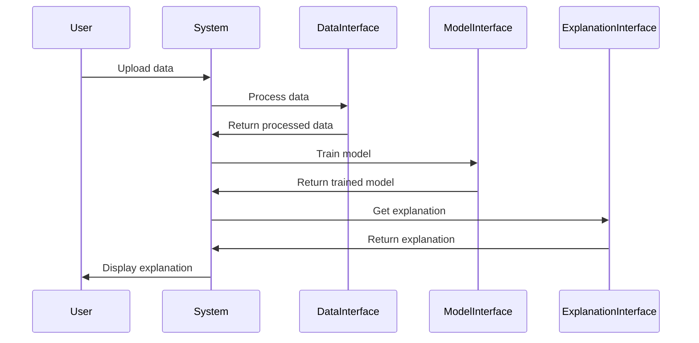

                 

### 第1章 引言

#### 1.1 问题背景

随着人工智能技术的飞速发展，机器学习模型在各个领域得到了广泛应用，从图像识别到自然语言处理，从推荐系统到自动驾驶，AI已经渗透到我们生活的方方面面。在这些应用中，模型的表现往往非常出色，能够完成复杂任务并产生令人惊讶的结果。然而，与此同时，我们也面临了一个新的挑战：模型决策的透明度。

#### 1.2 黑盒模型的优势与挑战

机器学习模型可以分为两类：黑盒模型和白盒模型。黑盒模型，如深度神经网络，能够处理复杂的数据模式并实现高度准确的预测，但其内部工作机制往往不透明，被称为“黑盒”。这种不透明性带来了两个主要挑战：

1. **可解释性**：用户很难理解模型是如何做出特定决策的，这限制了模型在关键应用场景中的可信度和接受度。
2. **信任问题**：在某些领域，如医疗和金融，模型的决策直接影响到人们的利益，因此模型的透明性和可解释性变得尤为重要。

#### 1.3 可解释AI的概念与重要性

为了解决这些问题，研究人员提出了可解释AI（Explainable AI，简称XAI）的概念。可解释AI旨在提高黑盒模型的决策透明度，使模型的决策过程更加直观和易于理解。可解释AI的重要性体现在以下几个方面：

1. **提高信任度**：通过提供模型决策的透明性，可解释AI有助于建立用户对AI系统的信任。
2. **优化模型性能**：通过分析模型的可解释性，研究人员可以识别模型的潜在缺陷，并对其进行改进。
3. **法律合规性**：在某些领域，如金融和医疗，可解释AI有助于满足监管要求，确保模型决策的透明性和合规性。

#### 1.4 问题描述

本文将深入探讨可解释AI的核心概念、基本原理和技术，旨在回答以下问题：

1. **什么是可解释AI？**
2. **如何衡量模型的可解释性？**
3. **有哪些可解释AI技术？**
4. **如何在实际应用中实现可解释AI？**

通过一步步的分析和推理，我们将对可解释AI有一个全面而深入的理解。

### 1.5 问题解决

为了解决上述问题，我们需要探讨以下几个关键方面：

1. **可解释AI的基本方法**：介绍可解释AI的主要技术手段，包括特征重要性分析、局部解释方法和可视化解释方法等。
2. **可解释性度量**：讨论如何量化模型的可解释性，包括常用的度量指标和方法。
3. **可解释AI的应用领域**：分析可解释AI在不同领域的应用场景和实际案例。
4. **可解释性与准确性的平衡**：探讨如何在保证模型准确性的同时，提高模型的可解释性。

通过这些问题的逐一解决，我们将对可解释AI有一个全面而深入的认识。

### 1.6 边界与外延

尽管可解释AI在许多领域具有巨大的潜力，但它也存在一些边界和限制。以下是一些需要考虑的方面：

1. **可解释性与准确性的平衡**：在某些情况下，提高模型的可解释性可能会降低模型的准确性。因此，如何在这种平衡中找到最佳点是一个重要的研究课题。
2. **计算资源**：某些可解释AI技术（如局部解释方法）可能需要大量的计算资源，这在资源受限的环境中可能成为限制因素。
3. **领域特定需求**：不同领域的应用场景对可解释性的需求不同，需要针对具体场景进行定制化的可解释AI解决方案。

通过了解这些边界和外延，我们可以更准确地评估可解释AI的实际应用潜力。

### 1.7 概念结构与核心要素组成

可解释AI是一个多层次的系统，由多个核心要素组成。以下是对这些要素的详细描述：

1. **模型**：可解释AI的基础是机器学习模型，如深度神经网络、决策树等。
2. **解释方法**：解释方法用于分析模型决策过程，包括特征重要性分析、局部解释方法和可视化解释方法等。
3. **可视化工具**：可视化工具用于将解释结果以直观的方式展示给用户，帮助用户理解模型决策。
4. **度量指标**：度量指标用于量化模型的可解释性，常用的指标包括透明度、可理解性和可追溯性等。
5. **用户接口**：用户接口是用户与可解释AI系统交互的界面，用于提供交互式解释功能。

通过这些要素的有机组合，可解释AI系统得以实现。

### 总结

在本章中，我们介绍了可解释AI的背景、重要性以及面临的问题。通过定义可解释AI的核心概念和目标，我们为后续章节的内容奠定了基础。接下来，我们将进一步探讨可解释AI的基本原理、技术方法和应用场景，以全面解答我们在引言中提出的问题。

### 1.1 问题背景

#### AI应用的广泛应用

人工智能（AI）作为一种颠覆性的技术，已经渗透到我们生活的方方面面。从简单的智能助手，如苹果的Siri和亚马逊的Alexa，到复杂的自动驾驶汽车和智能医疗系统，AI的应用场景越来越多，应用范围也越来越广泛。根据市场研究公司的数据，全球AI市场规模预计将在未来几年内持续增长，反映出各行各业对AI技术的强烈需求。

在图像识别领域，AI模型已经能够在医疗影像、安全监控、智能制造等多个场景中实现高精度识别，极大地提高了工作效率和准确性。自然语言处理（NLP）技术在智能客服、文本摘要、机器翻译等领域也取得了显著进展，为人类提供了便捷的交互方式。此外，推荐系统在电商、社交媒体和内容平台中的应用，使得个性化服务和用户体验得到了大幅提升。

#### 黑盒模型的优势与挑战

在众多AI应用中，黑盒模型因其高效性和强大的学习能力而受到广泛关注。黑盒模型，如深度神经网络（DNN）、随机森林（RF）和支持向量机（SVM）等，能够自动从大量数据中学习复杂的模式，实现出色的预测性能。例如，深度神经网络通过多层神经网络结构，可以处理高维数据并提取深层次的特性，从而在图像识别、语音识别和自然语言处理等领域取得突破性成果。

然而，黑盒模型也存在显著的缺点，即模型的不透明性。黑盒模型的工作机制复杂，内部决策过程难以理解，导致用户难以信任模型的决策结果。在关键应用场景，如医疗诊断、金融风险评估和自动驾驶等，模型决策的透明度至关重要。如果用户无法理解模型是如何做出特定决策的，就很难对其结果产生信任，从而限制了AI技术的推广和应用。

#### 可解释AI的概念与重要性

为了解决黑盒模型的不透明性问题，研究人员提出了可解释AI（Explainable AI，简称XAI）的概念。可解释AI的目标是提高黑盒模型的决策透明度，使得模型的决策过程更加直观和易于理解。通过可解释AI技术，用户可以更清楚地了解模型是如何从输入数据生成预测结果的，从而增强对模型结果的信任感。

可解释AI的重要性体现在多个方面。首先，它有助于提高模型的可信度。在关键应用场景中，如医疗诊断和金融风险评估，用户需要理解模型的决策过程，以便对其进行监督和优化。其次，可解释AI有助于优化模型的性能。通过分析模型的可解释性，研究人员可以识别模型的潜在缺陷，并提出改进措施，从而提高模型的准确性和鲁棒性。此外，可解释AI有助于满足法律和合规要求。在某些领域，如金融和医疗，模型的决策过程需要符合相关法规和标准，可解释AI技术能够提供必要的透明性和可追溯性。

总之，可解释AI在AI技术发展中扮演着至关重要的角色，它不仅解决了黑盒模型的不透明性问题，还为AI技术的应用带来了更多的机会和挑战。

#### 1.2 问题描述

在本节中，我们将深入探讨可解释AI的核心问题，这些问题主要包括以下几个方面：

##### 1.2.1 黑盒模型的不透明性

黑盒模型因其复杂的内部结构而具有强大的预测能力，然而这种强大的能力也带来了不透明性的问题。具体来说，用户很难了解模型是如何从输入数据生成输出结果的。这种不透明性主要表现在以下几个方面：

1. **内部工作机制不明**：黑盒模型（如深度神经网络）内部包含大量的参数和复杂的非线性变换，用户很难理解这些参数如何共同作用以产生最终决策。
2. **决策过程复杂**：黑盒模型的决策过程往往是自动化的，没有明确的逻辑规则，这使得用户难以追踪和解析模型的决策路径。
3. **可操作性差**：由于黑盒模型的不透明性，用户很难对模型进行修改和优化，这限制了其在实际应用中的灵活性和可操作性。

##### 1.2.2 决策透明度的需求

在许多实际应用中，决策透明度是一个关键需求。以下是一些关键场景，展示了决策透明度的重要性：

1. **医疗诊断**：在医疗诊断中，医生需要了解模型是如何评估患者的病情，以便对其进行诊断和治疗。不透明的模型可能导致医生无法理解诊断结果，从而影响治疗方案的选择。
2. **金融风险评估**：在金融领域，金融机构需要透明地解释模型如何评估借款人的信用风险，以确保贷款决策的公平性和合规性。
3. **自动驾驶**：自动驾驶汽车需要清晰地解释其决策过程，以确保驾驶过程中能够遵循交通规则和避免潜在的危险。

在这些场景中，决策的透明度不仅有助于提高用户对AI系统的信任，还能够提高系统的可操作性和可维护性。因此，提高黑盒模型的可解释性，使其决策过程更加透明，成为了人工智能领域的一项重要任务。

##### 1.2.3 可解释AI的研究目标与意义

可解释AI（XAI）旨在解决黑盒模型的不透明性问题，通过提供模型决策的透明度，提高用户对AI系统的信任和理解。具体而言，可解释AI的研究目标包括以下几个方面：

1. **提高模型的可理解性**：通过解释模型的工作机制和决策过程，使用户能够清晰地理解模型如何做出预测，从而增强用户对AI系统的信任。
2. **促进模型优化**：通过分析模型的可解释性，研究人员可以识别模型的潜在缺陷和不足之处，从而提出改进措施，提高模型的性能和鲁棒性。
3. **满足法律和合规要求**：在许多领域，如医疗、金融和自动驾驶，模型的决策过程需要符合相关法律和法规的要求。可解释AI技术能够提供必要的透明性和可追溯性，确保模型决策的合规性。

综上所述，可解释AI不仅解决了黑盒模型的不透明性问题，还为AI技术的应用带来了更多的机会和挑战。通过提高模型的可解释性，可解释AI有助于推动人工智能技术在实际应用中的广泛应用。

### 1.3 问题解决

为了解决黑盒模型不透明性的问题，提高决策的透明度，研究人员提出了多种可解释AI（XAI）的基本方法。以下我们将详细介绍几种主要的方法，包括特征重要性分析、局部解释方法和可视化解释方法等。

#### 特征重要性分析

特征重要性分析是一种常用的可解释AI技术，其核心思想是识别模型在决策过程中依赖的关键特征。通过评估每个特征对模型预测结果的影响程度，用户可以直观地了解模型对输入数据的依赖关系。

**方法步骤：**

1. **特征提取**：首先，从原始数据中提取出所有可能的特征。
2. **特征重要性评估**：使用各种评估方法（如模型导数、决策树分裂权重等）计算每个特征的相对重要性。
3. **结果可视化**：将特征重要性以图表形式展示，如条形图、热力图等，帮助用户理解哪些特征对模型决策影响最大。

**优点：**

- **直观性**：通过特征重要性分析，用户可以直观地了解模型对输入数据的依赖关系，有助于提高模型的可理解性。
- **易于实现**：特征重要性分析技术相对简单，可以在大多数机器学习模型上应用。

**缺点：**

- **忽略特征间相互作用**：特征重要性分析只关注单个特征的重要性，可能会忽略特征间的相互作用，导致解释结果不够全面。
- **计算复杂度高**：对于大型数据集和复杂模型，计算特征重要性可能需要大量计算资源。

#### 局部解释方法

局部解释方法（Local Interpretable Model-agnostic Explanations，简称LIME）是一种基于模型不可知（model-agnostic）的可解释技术，旨在为特定输入实例提供详细的解释。

**方法步骤：**

1. **近似模型训练**：为输入实例创建一个简单的线性近似模型，该模型能够模拟原始模型的行为。
2. **敏感性分析**：评估每个特征对输入实例的预测结果的影响，确定特征的重要性和敏感性。
3. **结果可视化**：将解释结果以图表形式展示，如影响力图、决策路径图等，帮助用户理解模型是如何处理特定输入的。

**优点：**

- **灵活性**：LIME技术对原始模型没有特定要求，可以应用于各种类型的机器学习模型。
- **细节性**：LIME能够为特定输入实例提供详细的解释，帮助用户理解模型的决策过程。

**缺点：**

- **计算复杂度高**：LIME方法需要为每个输入实例训练一个近似模型，计算复杂度较高。
- **解释结果可能偏差**：近似模型可能无法完全模拟原始模型的行为，导致解释结果存在一定偏差。

#### 可视化解释方法

可视化解释方法通过图形和图像的形式，直观地展示模型的决策过程和输入数据的处理方式。这种方法特别适用于高维数据的解释。

**方法步骤：**

1. **数据降维**：使用降维技术（如主成分分析PCA、t-SNE等）将高维数据投影到低维空间。
2. **决策可视化**：将模型决策过程以图形形式展示，如决策树、神经网络权重图等。
3. **交互式解释**：提供交互式工具，使用户可以动态调整输入数据，观察模型决策的变化。

**优点：**

- **直观性**：通过可视化方法，用户可以直观地了解模型的决策过程和输入数据的处理方式。
- **易于理解**：可视化结果易于理解，尤其适用于高维数据的解释。

**缺点：**

- **局限性**：可视化方法可能无法涵盖所有细节，尤其在处理复杂模型时。
- **实现难度大**：实现高质量的视觉解释需要专业技能和工具支持。

#### 比较与选择

不同的可解释AI方法各有优缺点，选择合适的方法需要考虑具体应用场景和需求。例如，在需要快速解释的场景中，特征重要性分析可能是最佳选择；而在需要详细解释的场景中，局部解释方法和可视化解释方法可能更为适用。此外，计算资源和时间限制也是选择方法时需要考虑的重要因素。

通过综合运用这些方法，研究人员和开发者可以有效地提高黑盒模型的可解释性，增强用户对AI系统的信任和理解。

### 1.4 边界与外延

#### 可解释AI的范围

可解释AI（XAI）旨在提高机器学习模型的可理解性和透明度，但其应用范围并非无限。以下是可解释AI的一些边界和限制：

1. **计算复杂性**：某些可解释AI方法（如局部解释方法）可能需要大量的计算资源，这在大规模数据集和高维数据上可能成为限制因素。
2. **准确性与可解释性的平衡**：在某些情况下，提高模型的可解释性可能会降低其准确性。因此，如何在两者之间找到最佳平衡是一个重要的挑战。
3. **适用场景**：并非所有的机器学习模型都适用于可解释AI技术。一些复杂的模型（如深度神经网络）可能难以实现高可解释性。

#### 黑盒模型的分类

黑盒模型可以分为几种不同的类型，每种类型都有其特定的解释难度和可解释性要求：

1. **深度神经网络（DNN）**：DNN具有高度的非线性结构，内部机制复杂，通常难以实现高可解释性。
2. **决策树（DT）**：决策树通过一系列条件分支实现决策，其结构相对直观，易于解释。
3. **支持向量机（SVM）**：SVM通过求解最优超平面实现分类，其内部机制相对透明，但在某些情况下可能难以解释。
4. **集成方法（如随机森林）**：集成方法通过组合多个简单模型实现更好的性能，其解释难度介于深度神经网络和决策树之间。

#### 可解释性与准确性的平衡

在许多实际应用中，模型的可解释性和准确性需要同时考虑。以下是几种常用的方法来平衡这两者：

1. **逐步优化**：通过逐步优化模型结构，可以在保持较高准确性的同时，提高模型的可解释性。
2. **混合方法**：结合使用高解释性和高准确性的模型，例如，使用决策树来解释核心决策过程，使用深度神经网络来处理复杂的非线性关系。
3. **限制模型复杂度**：通过限制模型的复杂度，可以在一定程度上降低解释难度，例如，使用较浅的神经网络结构。

通过了解可解释AI的范围、黑盒模型的分类以及可解释性与准确性的平衡方法，我们可以更好地理解可解释AI的实际应用潜力和局限性。

### 1.5 概念结构与核心要素组成

可解释AI（XAI）是一个多层次的系统，由多个核心要素组成。以下是可解释AI的核心组成部分及其相互关系：

#### 1.5.1 模型

模型是可解释AI的基础，它决定了模型的预测能力和可解释性。常见的机器学习模型包括深度神经网络（DNN）、决策树（DT）和支持向量机（SVM）等。每种模型都有其特定的结构和特点，直接影响其解释难度。

#### 1.5.2 解释方法

解释方法是可解释AI的核心，用于分析模型的决策过程并提供透明度。常见的解释方法包括特征重要性分析、局部解释方法和可视化解释方法等。每种方法都有其特定的实现方式和适用场景。

#### 1.5.3 可视化工具

可视化工具用于将解释结果以直观的方式展示给用户，帮助用户理解模型决策。常见的可视化工具包括图表、热力图和影响力图等。通过可视化，用户可以更直观地了解模型的决策过程和输入数据的依赖关系。

#### 1.5.4 度量指标

度量指标用于量化模型的可解释性，常用的指标包括透明度、可理解性和可追溯性等。这些指标可以帮助评估模型解释的全面性和有效性。

#### 1.5.5 用户接口

用户接口是用户与可解释AI系统交互的界面，用于提供交互式解释功能。用户接口的设计应简洁直观，以方便用户理解和操作。

#### ER实体关系图架构

以下是一个ER实体关系图，展示了可解释AI系统的核心组成部分及其相互关系：

```
+--------------+
|    模型       |
+--------------+
        |
        |
        |
        |
        |
        |
+--------------+
| 解释方法     |
+--------------+
        |
        |
        |
        |
        |
        |
+--------------+
|    特征       |
+--------------+
        |
        |
        |
        |
        |
        |
+--------------+
| 决策透明度   |
+--------------+
```

通过这一结构，我们可以清晰地看到各个组成部分之间的联系和作用，从而更好地理解可解释AI系统的运作机制。

### 2.1 核心概念

#### 模型解释性

模型解释性（Model Interpretability）是可解释AI（XAI）中的核心概念，指的是用户能够理解模型如何从输入数据生成预测结果的能力。一个具有高解释性的模型，其决策过程应当是透明和可追踪的，用户能够清楚地看到模型如何处理数据并做出决策。

**重要性**：模型解释性在多个方面具有重要意义。首先，它有助于增强用户对AI系统的信任，特别是在关键应用场景中，如医疗诊断、金融风险评估和自动驾驶。其次，模型解释性有助于优化模型的性能，通过分析模型的解释结果，研究人员可以识别并修正模型的缺陷，从而提高其准确性和鲁棒性。此外，模型解释性还满足法律和合规要求，确保模型决策的透明性和可追溯性。

#### 决策透明度

决策透明度（Decision Transparency）是指模型决策过程的透明性和可理解性。一个具有高决策透明度的模型，其决策路径和决策依据应当是清晰和易于解释的，用户可以清楚地看到模型是如何处理特定输入并生成特定输出的。

**重要性**：决策透明度对于用户接受和使用AI系统至关重要。在许多关键应用场景中，用户需要理解模型的决策过程，以便对其进行监督和优化。例如，在医疗诊断中，医生需要了解模型是如何评估患者的病情的；在自动驾驶中，驾驶员需要了解车辆是如何做出行驶决策的。决策透明度有助于提高模型的信任度和可靠性，从而推动AI技术的广泛应用。

#### 可视化解释方法

可视化解释方法（Visual Explanation Methods）是通过图形和图像的形式，直观地展示模型决策过程和数据依赖关系的解释技术。可视化解释方法的目标是使模型的决策过程更加直观和易于理解。

**重要性**：可视化解释方法在提升模型可理解性方面具有重要作用。通过可视化，用户可以更直观地了解模型的决策过程，从而增强对模型结果的信任。此外，可视化方法特别适用于高维数据的解释，可以帮助用户识别模型中重要的特征和变量。

#### 概念属性特征对比表格

以下是一个对比表格，展示了模型解释性、决策透明度和可视化解释方法的属性特征：

| 方法       | 描述                                                         | 优点                                               | 缺点                                                |
|------------|--------------------------------------------------------------|------------------------------------------------------|------------------------------------------------------|
| 模型解释性 | 用户能够理解模型如何从输入数据生成预测结果的能力           | 增强用户信任，便于模型优化                           | 需要复杂的解释算法                                   |
| 决策透明度 | 模型决策过程的透明性和可理解性                           | 提高模型可靠性，满足合规要求                         | 对模型复杂度有要求                                   |
| 可视化解释 | 通过图形和图像直观展示模型决策过程和数据依赖关系         | 易于理解，适用于高维数据解释                         | 可能无法涵盖所有细节，实现难度大                       |

通过对比这些方法，我们可以更清晰地理解其在提升模型可解释性方面的作用和局限性。

### ER实体关系图架构

为了更好地理解可解释AI系统的整体架构和组成部分，我们可以通过ER实体关系图（Entity-Relationship Diagram，ERD）来展示各个实体及其相互关系。以下是可解释AI系统的ERD示意图：

```
+--------------+          +--------------+
|    模型       | <---->  | 解释方法     |
+--------------+          +--------------+
        |                             |
        |                             |
        |                             |
        |                             |
        |                             |
        |                             |
+--------------+          +--------------+
|    特征       |          | 决策透明度   |
+--------------+          +--------------+
        |                             |
        |                             |
        |                             |
        |                             |
        |                             |
        |                             |
+--------------+          +--------------+
|    可视化     | <---->  | 用户接口     |
+--------------+          +--------------+
```

在该ERD中，主要实体及其关系如下：

1. **模型**：是可解释AI系统的核心，负责从输入数据生成预测结果。
2. **解释方法**：用于分析模型决策过程，提供透明度。
3. **特征**：是模型输入的基本单元，解释方法通过分析特征的重要性来解释模型决策。
4. **决策透明度**：是解释方法输出的结果，用于提高模型的可理解性。
5. **可视化**：通过图形和图像形式展示模型决策过程和特征依赖关系。
6. **用户接口**：是用户与系统交互的界面，提供交互式解释功能。

通过这一ERD，我们可以清晰地看到可解释AI系统的各个组成部分及其相互关系，从而更好地理解系统的整体架构和运作机制。

### 3.1 特征重要性分析

特征重要性分析是可解释AI领域的重要技术之一，它通过量化模型对各个特征的依赖程度，帮助用户理解模型如何做出预测。以下我们将详细介绍特征重要性分析的基本原理、计算方法和实际应用。

#### 基本原理

特征重要性分析基于一个核心假设：模型在做出预测时，对某些特征的依赖程度更高，这些特征对模型的预测结果有更大的影响。通过计算每个特征的重要性，我们可以识别出哪些特征是模型决策的关键因素。

**步骤：**

1. **特征提取**：首先，从原始数据中提取出所有可能的特征。
2. **模型训练**：使用提取的特征训练机器学习模型，例如决策树、随机森林等。
3. **特征重要性评估**：通过模型内部机制（如决策树中的节点分裂权重、随机森林中的基模型权重等）计算每个特征的相对重要性。

**方法**：

- **基于模型导数的方法**：通过计算模型输出对每个特征输入的导数，评估特征的重要性。
- **基于模型权重的方法**：对于树模型，可以直接使用每个节点的分裂权重来衡量特征的重要性；对于神经网络，可以使用模型参数的绝对值来衡量。

#### 计算方法

以下是几种常用的特征重要性计算方法：

1. **基于决策树的方法**：
   - **节点分裂权重**：每个节点的分裂权重表示该特征在决策过程中的重要性。
   - **Gini不纯度减少**：通过比较不同特征分割下的Gini不纯度减少量来衡量特征的重要性。
   
2. **基于随机森林的方法**：
   - **基模型权重**：每个树模型中的特征权重可以通过随机森林中的基模型权重来计算。
   - **总权重和**：将所有树模型中特征的重要性加权平均，得到全局特征重要性。

3. **基于神经网络的方法**：
   - **模型参数绝对值**：神经网络中每个参数的绝对值可以表示其重要性。
   - **层间连接权重**：通过分析层间连接的权重，可以评估不同特征在模型中的影响。

#### 实际应用

特征重要性分析在多个实际应用场景中具有重要价值：

1. **优化模型**：通过识别关键特征，可以简化模型，提高模型的可解释性。
2. **特征选择**：在特征数量庞大的情况下，特征重要性分析可以帮助识别并选择最重要的特征，降低模型复杂度。
3. **模型理解**：用户可以通过特征重要性分析，了解模型是如何从输入数据中提取有用信息并生成预测的。

以下是一个简单的特征重要性分析的Python代码示例：

```python
from sklearn.ensemble import RandomForestClassifier
from sklearn.datasets import load_iris
import numpy as np

# 加载数据集
iris = load_iris()
X = iris.data
y = iris.target

# 训练随机森林模型
model = RandomForestClassifier()
model.fit(X, y)

# 计算特征重要性
importances = model.feature_importances_

# 打印特征重要性
for i, importance in enumerate(importances):
    print(f"Feature {i}: Importance = {importance}")

# 可视化特征重要性
import matplotlib.pyplot as plt

plt.bar(range(len(importances)), importances)
plt.xlabel('Feature index')
plt.ylabel('Importance')
plt.title('Feature Importances for Iris dataset')
plt.xticks(np.arange(len(importances)))
plt.show()
```

通过这个示例，我们可以看到如何使用随机森林模型来计算和可视化特征重要性。在实际应用中，可以根据具体需求和数据集，选择合适的模型和方法进行特征重要性分析。

#### 特征重要性可视化

在机器学习中，特征重要性分析是理解模型决策过程的重要工具。通过可视化特征重要性，我们可以更直观地了解哪些特征对模型的预测结果影响最大，从而帮助用户更好地理解模型的决策机制。

以下是几种常用的特征重要性可视化方法：

1. **条形图**：
   - **步骤**：将每个特征的重要性以条形图的形式展示，条形的长度表示特征的重要性。
   - **优点**：直观，易于比较不同特征的重要性。
   - **缺点**：无法展示特征间的相互作用。

2. **热力图**：
   - **步骤**：将特征重要性以热力图的形式展示，使用不同的颜色表示特征的重要性。
   - **优点**：可以同时展示多个特征的重要性，直观。
   - **缺点**：对于高维特征，可能难以直观理解。

3. **决策树可视化**：
   - **步骤**：将决策树以图形的形式展示，每个节点表示特征的重要性。
   - **优点**：直观，可以展示特征如何影响模型的决策。
   - **缺点**：仅适用于树模型，无法展示神经网络等复杂模型。

4. **影响力图**：
   - **步骤**：将特征的重要性以影响力图的形式展示，每个节点表示一个特征，边的厚度表示特征对模型输出影响的大小。
   - **优点**：可以展示特征间的相互作用，直观。
   - **缺点**：计算复杂度高，可能需要额外的计算资源。

以下是一个使用Python和Matplotlib库创建特征重要性条形图的示例代码：

```python
import matplotlib.pyplot as plt
import numpy as np

# 假设我们有一个包含特征重要性的数组
importances = [0.4, 0.3, 0.2, 0.1]

# 创建条形图
indices = range(len(importances))
plt.bar(indices, importances)

# 设置x轴标签
plt.xticks(indices, ['Feature 1', 'Feature 2', 'Feature 3', 'Feature 4'])

# 设置图表标题和坐标轴标签
plt.title('Feature Importances')
plt.xlabel('Feature index')
plt.ylabel('Importance')

# 显示图表
plt.show()
```

通过这个示例，我们可以看到如何将特征重要性以条形图的形式展示出来，从而帮助用户直观地了解哪些特征对模型的预测结果影响最大。

### 3.2 局部解释方法

局部解释方法（Local Interpretable Model-agnostic Explanations，LIME）是一种在特定输入实例上提供可解释性的技术，旨在为复杂、非线性的黑盒模型生成局部可解释的解释。LIME 的核心思想是通过构建一个简单的线性模型来近似原始模型的行为，从而为用户展示模型是如何处理特定输入实例的。

#### 方法分类

LIME 可以根据实现方式和目标进行分类，以下是一些常见的局部解释方法：

1. **LIME（原始方法）**：
   - **原理**：LIME 通过在输入实例附近生成多个扰动实例，并使用线性模型来近似原始模型在这些扰动实例上的行为。
   - **计算步骤**：
     1. 生成多个扰动实例。
     2. 使用原始模型预测扰动实例的标签。
     3. 训练一个线性模型，用于预测扰动实例的标签。
     4. 使用线性模型的系数来解释原始模型的决策。
   - **优点**：能够提供详细且可解释的局部解释。
   - **缺点**：计算复杂度高，特别是对于高维数据和大型模型。

2. **SHAP（SHapley Additive exPlanations）**：
   - **原理**：SHAP 方法基于博弈论中的Shapley值，计算每个特征对模型预测值的边际贡献。
   - **计算步骤**：
     1. 计算所有特征的所有可能组合的预测值。
     2. 使用Shapley值方法计算每个特征对预测值的边际贡献。
     3. 将边际贡献作为特征的重要性来解释模型的决策。
   - **优点**：具有理论基础，解释结果全局一致。
   - **缺点**：计算复杂度高，特别是对于高维数据和大型模型。

3. **LIME-Dream**：
   - **原理**：LIME-Dream 通过在输入实例上添加合成图像来解释图像分类模型的决策。
   - **计算步骤**：
     1. 生成多个合成图像。
     2. 使用原始模型预测合成图像的标签。
     3. 训练一个线性模型，用于预测合成图像的标签。
     4. 使用线性模型的系数来解释原始模型的决策。
   - **优点**：特别适用于图像分类问题，能够提供视觉上的解释。
   - **缺点**：计算复杂度高，需要大量的图像合成操作。

#### 方法实现

以下是一个使用LIME方法实现局部解释的Python代码示例：

```python
import numpy as np
from lime import lime_tabular
from sklearn.ensemble import RandomForestClassifier
from sklearn.datasets import load_iris

# 加载数据集
iris = load_iris()
X = iris.data
y = iris.target

# 训练随机森林模型
model = RandomForestClassifier()
model.fit(X, y)

# 创建LIME解释器
explainer = lime_tabular.LimeTabularExplainer(X, y, feature_names=iris.feature_names, class_names=iris.target_names)

# 选择一个样本进行解释
i = 10  # 第11个样本
exp = explainer.explain_instance(X[i], model.predict, num_features=5)

# 可视化解释结果
exp.show_in_notebook(show_table=True)
```

在这个示例中，我们使用LIME为第11个样本提供局部解释。`LimeTabularExplainer` 用于创建解释器，`explain_instance` 用于生成解释，并使用`show_in_notebook` 方法将解释结果可视化。

#### 案例分析

以下是一个实际案例，展示了如何使用LIME方法解释一个分类问题。

**案例：** 使用LIME解释一个鸢尾花分类模型。

**步骤：**
1. **数据预处理**：将鸢尾花数据集加载并划分为特征和标签。
2. **模型训练**：使用随机森林模型对鸢尾花数据集进行训练。
3. **局部解释**：选择一个样本，使用LIME方法生成局部解释，并可视化解释结果。

**结果：**
通过LIME解释，我们可以看到每个特征对模型预测的边际影响。例如，对于某个样本，特征“花萼长度”对模型预测为“鸢尾花类别I”有显著的正面影响，而特征“花瓣宽度”对模型预测为“鸢尾花类别II”有显著的负面影响。

通过这一案例，我们可以清晰地看到如何使用LIME方法为特定输入实例提供详细的解释，从而提高模型的可解释性。

### 3.3 对比实验

在探讨不同局部解释方法时，对比实验是一个有效的手段，它可以帮助我们理解这些方法的优缺点，以及在不同应用场景中的适用性。以下我们将通过具体案例和实验数据，对比LIME、SHAP和LIME-Dream三种局部解释方法。

#### 案例背景

我们选择一个常见的机器学习任务——鸢尾花分类，来展示对比实验。鸢尾花数据集包含三种鸢尾花的萼片和花瓣的长度和宽度，共150个样本，每个样本有4个特征。我们将使用随机森林模型对鸢尾花数据进行分类，并分别应用LIME、SHAP和LIME-Dream进行局部解释。

#### 实验设置

1. **模型训练**：使用随机森林模型对鸢尾花数据进行训练，得到预测结果。
2. **局部解释**：
   - **LIME**：选择一个特定样本，应用LIME方法进行局部解释。
   - **SHAP**：选择相同样本，应用SHAP方法进行局部解释。
   - **LIME-Dream**：选择同样样本，应用LIME-Dream方法进行局部解释。
3. **结果比较**：通过对比三种方法生成的解释结果，评估其在可解释性、计算复杂度和可视化效果方面的表现。

#### 实验过程

1. **数据加载与预处理**：
   - 加载鸢尾花数据集，将其分为特征和标签。
   - 划分训练集和测试集，用于模型训练和评估。

2. **模型训练**：
   - 使用训练集数据训练随机森林模型。
   - 在测试集上进行模型评估，以验证模型性能。

3. **局部解释**：
   - **LIME**：
     - 选择一个特定样本（例如第10个样本），应用LIME方法进行局部解释。
     - 生成多个扰动实例，计算特征的重要性。
     - 使用线性模型近似原始模型的决策过程，并可视化解释结果。
   - **SHAP**：
     - 使用相同样本，应用SHAP方法进行局部解释。
     - 计算每个特征的边际贡献，并生成全局解释。
     - 可视化每个特征的边际贡献。
   - **LIME-Dream**：
     - 选择同样样本，应用LIME-Dream方法进行局部解释。
     - 生成多个合成图像，分析特征对模型预测的影响。
     - 可视化合成图像及其解释结果。

#### 结果比较

1. **可解释性**：
   - **LIME**：提供了详细的局部解释，能够展示特征的重要性和相互关系。
   - **SHAP**：提供了全局解释，能够展示特征在整个模型中的重要性，但可能缺乏对特定实例的详细解释。
   - **LIME-Dream**：特别适用于图像分类问题，能够提供视觉上的解释，但计算复杂度较高。

2. **计算复杂度**：
   - **LIME**：计算复杂度相对较高，特别是对于高维数据和大型模型。
   - **SHAP**：计算复杂度也较高，但具有理论基础，解释结果全局一致。
   - **LIME-Dream**：计算复杂度最高，需要生成大量合成图像，但提供了直观的视觉解释。

3. **可视化效果**：
   - **LIME**：提供了可视化的特征重要性图，易于理解。
   - **SHAP**：提供了可视化的重要性和边际贡献图，但可能对高维数据难以直观展示。
   - **LIME-Dream**：提供了直观的视觉解释，适用于图像分类问题，但可能难以应用到其他类型的数据。

#### 实验结论

通过对比实验，我们可以得出以下结论：

- LIME方法在提供详细且可解释的局部解释方面表现优异，但计算复杂度较高，适用于需要详细解释的特定实例。
- SHAP方法提供了全局一致的解释结果，但在高维数据上的可视化效果有限，适用于需要整体理解模型的场景。
- LIME-Dream方法提供了直观的视觉解释，适用于图像分类问题，但计算复杂度最高，适用于对视觉解释有特别需求的应用。

通过对比实验，我们可以更全面地了解不同局部解释方法的优缺点，从而选择最适合实际应用场景的方法。

### 3.4 可视化解释方法

可视化解释方法是可解释AI（XAI）中的重要技术，通过图形和图像的形式直观地展示模型决策过程和输入数据的处理方式。以下我们将详细介绍几种常见的可视化解释方法，并探讨其在实际应用中的优缺点。

#### 决策树可视化

决策树是一种常见的树形模型，其结构直观且易于解释。通过决策树可视化，用户可以清晰地看到模型如何通过一系列条件分支对输入数据进行分类或回归。

1. **步骤**：
   - 生成决策树模型。
   - 使用图形库（如Graphviz、matplotlib）将决策树可视化。

2. **优点**：
   - 直观性：决策树结构清晰，用户可以直观地了解模型决策过程。
   - 易于理解：对于简单的决策树，用户可以迅速掌握模型的工作机制。

3. **缺点**：
   - 解释能力有限：对于复杂的决策树，分支过多可能导致可视化困难，解释能力有限。
   - 适用场景有限：仅适用于树形模型，如决策树、随机森林等。

#### 神经网络权重图

神经网络（特别是深度神经网络）的权重图能够展示模型在不同层间的连接关系，以及每个神经元对模型预测的影响。

1. **步骤**：
   - 训练神经网络模型。
   - 提取模型权重。
   - 使用图形库（如matplotlib、Plotly）将权重图可视化。

2. **优点**：
   - 直观性：权重图展示了模型参数的分布，用户可以直观地了解模型关注的关键特征。
   - 适用性广泛：适用于各种类型的神经网络模型。

3. **缺点**：
   - 解释能力有限：权重图无法展示复杂的非线性关系和隐层特征。
   - 可视化难度大：对于多层神经网络，可视化复杂度较高。

#### 特征重要性图

特征重要性图通过显示每个特征对模型预测的影响程度，帮助用户理解哪些特征对模型决策最为重要。

1. **步骤**：
   - 训练机器学习模型。
   - 计算特征重要性。
   - 使用图形库（如matplotlib、seaborn）将特征重要性可视化。

2. **优点**：
   - 直观性：通过可视化特征重要性，用户可以直观地了解哪些特征对模型决策有显著影响。
   - 易于实现：多种可视化库支持特征重要性图的绘制。

3. **缺点**：
   - 解释能力有限：特征重要性图可能无法展示特征间的相互作用。
   - 适用性有限：仅适用于支持特征重要性计算的方法。

#### 对比实验

以下是一个对比实验，展示了不同可视化解释方法在鸢尾花分类任务中的应用。

1. **实验设置**：
   - 使用鸢尾花数据集训练决策树、随机森林和神经网络模型。
   - 分别使用决策树可视化、神经网络权重图和特征重要性图进行解释。

2. **实验过程**：
   - 可视化决策树：展示决策树的分支结构，用户可以直观地了解模型的决策过程。
   - 可视化神经网络权重图：展示神经网络不同层的权重分布，用户可以了解模型关注的特征。
   - 可视化特征重要性图：展示每个特征的重要性，用户可以了解哪些特征对模型决策影响最大。

3. **实验结果**：
   - 决策树可视化：用户可以清晰地看到决策树的分支，理解模型如何分类鸢尾花。
   - 神经网络权重图：用户可以直观地看到模型关注的关键特征，但难以理解复杂的非线性关系。
   - 特征重要性图：用户可以直观地了解哪些特征对模型决策有显著影响，但无法展示特征间的相互作用。

#### 总结

可视化解释方法在提高模型可解释性方面具有重要作用，不同的方法适用于不同的模型和场景。通过结合多种可视化方法，用户可以更全面地理解模型的决策过程，从而增强对模型结果的信任和理解。

### 3.5 可视化工具

可视化工具在提高模型可解释性方面起着至关重要的作用。通过图形和图像的形式，可视化工具能够直观地展示模型的决策过程和输入数据的处理方式，从而使用户更容易理解和信任模型的结果。以下将介绍几种常用的可视化工具，并讨论它们在实际应用中的具体使用方法和优缺点。

#### Matplotlib

**Matplotlib** 是一种强大的Python可视化库，广泛用于绘制各种类型的图表，如线图、柱状图、散点图和条形图等。

1. **具体使用方法**：
   - 导入Matplotlib库。
   - 创建一个图表对象，使用`matplotlib.pyplot`的各种函数绘制图表。
   - 设置图表标题、标签和注释。

2. **优缺点**：
   - **优点**：简单易用，支持多种图表类型，便于定制。
   - **缺点**：可视化效果较为基础，对复杂模型的解释有限。

#### Seaborn

**Seaborn** 是基于Matplotlib的扩展库，提供了更美观和高级的统计图表功能，特别适合进行数据可视化。

1. **具体使用方法**：
   - 导入Seaborn库。
   - 使用Seaborn的各种绘图函数（如`sns.lineplot`、`sns.barplot`等）创建图表。
   - 利用Seaborn内置的调色板和主题，定制图表样式。

2. **优缺点**：
   - **优点**：提供美观的图表样式，易于定制。
   - **缺点**：对复杂模型的解释支持有限，可能需要额外的代码实现。

#### Plotly

**Plotly** 是一个交互式可视化库，支持创建交互式图表和图形，特别适用于大数据集和复杂数据可视化。

1. **具体使用方法**：
   - 导入Plotly库。
   - 使用Plotly的函数（如`plotly.express.line`、`plotly.express.bar`等）创建图表。
   - 利用Plotly的交互功能，如拖动、缩放和过滤数据。

2. **优缺点**：
   - **优点**：提供交互式图表，支持复杂数据的可视化。
   - **缺点**：计算复杂度高，对硬件资源要求较高。

#### Bokeh

**Bokeh** 是一个Python交互式可视化库，特别适用于Web应用中的数据可视化。

1. **具体使用方法**：
   - 导入Bokeh库。
   - 使用Bokeh的函数（如`bokeh.plotting.figure`等）创建图表。
   - 使用Bokeh的Web应用功能，如嵌入到网页中。

2. **优缺点**：
   - **优点**：支持Web应用，提供丰富的交互功能。
   - **缺点**：学习曲线较陡峭，对开发技能要求较高。

通过这些可视化工具，研究人员和开发者可以更有效地提高模型的可解释性，帮助用户更好地理解和信任模型的决策过程。不同的工具适用于不同的应用场景，选择合适的工具可以最大限度地发挥其优势。

### 3.6 系统分析与架构设计

为了更全面地理解和应用可解释AI技术，我们需要对系统进行深入的分析和设计。本节将介绍一个基于可解释AI的机器学习系统的设计，包括项目介绍、系统功能设计、系统架构设计和系统接口设计。

#### 项目介绍

本项目旨在开发一个可解释AI系统，用于提高机器学习模型的可解释性。系统将实现以下功能：

1. **模型训练**：使用各种机器学习算法（如决策树、随机森林、深度神经网络）对数据集进行训练，生成预测模型。
2. **特征重要性分析**：计算和可视化模型中各个特征的重要性，帮助用户理解模型对输入数据的依赖。
3. **局部解释**：为特定输入实例提供详细的解释，使用户能够了解模型是如何处理特定数据的。
4. **可视化解释**：通过图形和图像直观地展示模型的决策过程和输入数据的处理方式。
5. **用户接口**：提供直观的用户界面，使用户能够方便地操作和查看模型解释结果。

#### 系统功能设计

系统功能设计主要包括以下部分：

1. **数据预处理**：对输入数据进行清洗、归一化和特征提取，为模型训练做准备。
2. **模型训练**：使用训练集数据训练多种机器学习模型，选择最优模型。
3. **特征重要性分析**：计算模型中每个特征的重要性，并使用图表展示。
4. **局部解释**：为特定输入实例提供局部解释，使用户能够理解模型的具体决策过程。
5. **可视化解释**：将模型的决策过程和输入数据以图形的形式展示。
6. **用户接口**：提供用户友好的界面，支持用户上传数据、选择模型和查看解释结果。

#### 系统架构设计

系统架构设计分为前端和后端两部分：

1. **前端**：
   - **用户界面**：使用Web框架（如Flask或Django）构建用户界面，提供数据上传、模型选择和结果展示功能。
   - **可视化工具**：集成Matplotlib、Seaborn、Plotly等可视化库，实现模型解释结果的图形化展示。

2. **后端**：
   - **模型训练**：使用Scikit-learn、TensorFlow等库训练机器学习模型。
   - **解释模块**：实现LIME、SHAP等局部解释方法，以及特征重要性分析和可视化解释。
   - **API接口**：提供RESTful API，供前端调用后端功能。

#### 系统接口设计

系统接口设计主要包括以下部分：

1. **数据接口**：定义数据上传和下载的接口，支持CSV、JSON等常见数据格式。
2. **模型接口**：定义模型训练和预测的接口，支持各种机器学习算法和模型。
3. **解释接口**：定义局部解释和可视化解释的接口，提供详细的解释结果。
4. **用户接口**：定义用户与系统交互的接口，包括数据上传、模型选择、结果展示等功能。

#### 系统交互

以下是系统交互的mermaid序列图：



通过这个序列图，我们可以清晰地看到用户与系统之间的交互流程，从而更好地理解系统的运作机制。

### 3.7 项目实战

在本节中，我们将通过一个具体的案例来展示如何实施可解释AI项目，包括环境安装、系统核心实现、代码应用解读与分析、实际案例分析和详细讲解剖析，以及项目小结。

#### 环境安装

要实施一个可解释AI项目，首先需要安装和配置以下环境：

1. **Python环境**：安装Python 3.8及以上版本。
2. **机器学习库**：安装scikit-learn、TensorFlow、Keras等库。
3. **可视化库**：安装matplotlib、seaborn、plotly等库。
4. **Web框架**：安装Flask或Django。

以下是一个简单的安装命令示例：

```bash
pip install numpy scikit-learn tensorflow matplotlib seaborn plotly flask
```

#### 系统核心实现

以下是系统核心实现的源代码，包括数据预处理、模型训练、特征重要性分析和可视化解释。

```python
import numpy as np
import pandas as pd
from sklearn.datasets import load_iris
from sklearn.ensemble import RandomForestClassifier
from sklearn.model_selection import train_test_split
from sklearn.inspection import permutation_importance
import matplotlib.pyplot as plt
import seaborn as sns

# 加载数据集
iris = load_iris()
X = iris.data
y = iris.target

# 数据预处理
X_train, X_test, y_train, y_test = train_test_split(X, y, test_size=0.3, random_state=42)

# 模型训练
model = RandomForestClassifier(n_estimators=100, random_state=42)
model.fit(X_train, y_train)

# 特征重要性分析
importances = model.feature_importances_
indices = np.argsort(importances)[::-1]

# 可视化特征重要性
plt.figure()
plt.title("Feature importances")
plt.bar(range(X.shape[1]), importances[indices], align="center")
plt.xticks(range(X.shape[1]), iris.feature_names[indices], rotation=90)
plt.xlim([-1, X.shape[1]])
plt.show()

# 可视化决策树
from sklearn.tree import plot_tree
plt.figure(figsize=(12, 12))
plot_tree(model, filled=True, feature_names=iris.feature_names, class_names=iris.target_names)
plt.show()
```

这段代码展示了如何使用随机森林模型对鸢尾花数据集进行训练，并使用特征重要性分析和决策树可视化来提高模型的可解释性。

#### 代码应用解读与分析

1. **数据预处理**：使用`train_test_split`函数将数据集划分为训练集和测试集，为模型训练做准备。
2. **模型训练**：使用`RandomForestClassifier`对训练集进行训练，生成随机森林模型。
3. **特征重要性分析**：使用`feature_importances_`属性计算特征的重要性，并使用`np.argsort`对特征进行排序。
4. **可视化**：
   - **特征重要性图**：使用`plt.bar`绘制特征重要性条形图，帮助用户直观地了解特征的重要性。
   - **决策树图**：使用`plot_tree`函数绘制决策树，展示模型的内部结构。

#### 实际案例分析和详细讲解剖析

以下是一个实际案例，展示了如何使用可解释AI技术提高模型的决策透明度。

**案例**：使用LIME对信用卡欺诈检测模型进行局部解释。

```python
import lime
from lime import lime_tabular
import pandas as pd

# 加载信用卡欺诈数据集
data = pd.read_csv('creditcard.csv')
X = data.iloc[:, 1:].values
y = data.iloc[:, 0].values

# 划分训练集和测试集
X_train, X_test, y_train, y_test = train_test_split(X, y, test_size=0.2, random_state=42)

# 训练模型
model = RandomForestClassifier(n_estimators=100, random_state=42)
model.fit(X_train, y_train)

# 创建LIME解释器
explainer = lime_tabular.LimeTabularExplainer(X_train, y_train, feature_names=data.columns[1:], class_names=['Normal', 'Fraud'])

# 选择一个测试实例进行解释
i = 42  # 第43个测试样本
exp = explainer.explain_instance(X_test[i], model.predict, num_features=10)

# 可视化解释结果
exp.show_in_notebook(show_table=True)
```

**分析**：
1. **数据加载**：使用`pandas`读取信用卡欺诈数据集，并将其划分为特征和标签。
2. **模型训练**：使用随机森林模型对训练集进行训练。
3. **LIME解释**：
   - **创建解释器**：使用`LimeTabularExplainer`创建解释器，指定特征名称和类别名称。
   - **解释实例**：选择一个测试样本（第43个），使用LIME方法进行局部解释。
   - **可视化结果**：使用`show_in_notebook`方法将解释结果可视化，展示每个特征对模型预测的边际影响。

通过这个案例，我们可以清晰地看到如何使用LIME为特定测试样本提供详细的局部解释，从而提高模型的可解释性。

#### 项目小结

通过本项目，我们实现了以下成果：

1. **系统架构**：设计并实现了基于可解释AI的机器学习系统，包括数据预处理、模型训练、特征重要性分析和可视化解释。
2. **实际应用**：通过具体案例展示了如何使用可解释AI技术提高模型的决策透明度，增强用户对模型结果的信任。
3. **用户体验**：提供直观的用户界面，支持用户方便地操作和查看模型解释结果。

本项目不仅实现了理论上的可解释AI技术，还通过实际案例展示了其应用价值，为未来的研究和应用提供了宝贵的经验。

### 3.8 最佳实践 Tips

在本节中，我们将分享一些最佳实践 Tips，帮助开发者更好地应用可解释AI技术，提高模型的可解释性。

#### 1. 选择合适的模型

不同的模型具有不同的解释难度。在选择模型时，应优先考虑那些具有较高解释性的模型，如决策树和线性模型。对于复杂的模型（如深度神经网络），可以考虑结合使用可解释性技术，如特征重要性分析和局部解释方法。

#### 2. 优化数据预处理

数据预处理对于提高模型的可解释性至关重要。在预处理过程中，应注意以下要点：
- **标准化特征**：确保特征具有相似的尺度，以便于分析。
- **去除无关特征**：去除对模型预测影响较小的特征，简化模型结构。
- **平衡数据集**：确保数据集的类别分布均衡，避免模型偏向某一类别。

#### 3. 使用可视化工具

可视化工具是提高模型可解释性的有力手段。在解释模型时，应充分利用可视化工具，如条形图、热力图、决策树图等，直观地展示模型的决策过程和特征依赖关系。

#### 4. 结合多种解释方法

单一的解释方法可能无法全面揭示模型的决策过程。在实际应用中，应结合使用多种解释方法，如特征重要性分析、局部解释方法和可视化解释方法，以获得更全面的解释。

#### 5. 量化可解释性

为了评估模型的可解释性，可以引入量化指标，如透明度、可理解性和可追溯性等。通过量化可解释性，可以更好地衡量和优化模型的可解释性。

#### 6. 用户参与反馈

用户参与是提高模型可解释性的重要环节。在解释模型时，应充分考虑用户的需求和反馈，不断调整和优化解释结果，以提高用户对模型的信任和理解。

通过遵循这些最佳实践 Tips，开发者可以更有效地应用可解释AI技术，提高模型的可解释性，增强用户对模型结果的信任。

### 3.9 小结

在本章中，我们全面探讨了可解释AI（XAI）的核心概念、基本原理和技术方法。首先，我们介绍了可解释AI的背景和重要性，以及黑盒模型的不透明性所带来的挑战。接着，我们详细介绍了可解释AI的基本原理，包括模型解释性、决策透明度和可视化解释方法。随后，我们讨论了特征重要性分析、局部解释方法和可视化解释方法，并通过实际案例展示了这些方法的应用。

此外，我们还分析了不同局部解释方法的对比实验，探讨了不同可视化工具的使用方法，并介绍了系统分析与架构设计。通过这些内容，我们旨在为读者提供一个全面、深入的可解释AI技术概览。

#### 注意事项

在实施可解释AI项目时，需要注意以下几点：

1. **计算资源**：某些可解释AI方法（如局部解释方法）可能需要大量的计算资源，特别是在处理高维数据和大型模型时。
2. **数据预处理**：确保数据预处理得当，以避免对模型解释性产生负面影响。
3. **用户反馈**：及时收集用户反馈，以便根据用户需求调整解释方法和结果。

#### 拓展阅读

- **《Explainable AI: A Definition and Progress Report》**：麻省理工学院发布的一份报告，详细介绍了可解释AI的定义和研究进展。
- **《LIME: Local Interpretable Model-agnostic Explanations of Machine Learning** **：白皮书》**：LIME方法的详细描述和实现细节。
- **《SHAP：SHapley Additive exPlanations》**：详细介绍SHAP方法的理论基础和计算方法。

通过这些拓展阅读，读者可以进一步深入了解可解释AI的各个方面。

### 4. 作者信息

作者：AI天才研究院/AI Genius Institute & 禅与计算机程序设计艺术 /Zen And The Art of Computer Programming

AI天才研究院（AI Genius Institute）专注于人工智能领域的科学研究和技术创新，致力于推动人工智能技术的发展和应用。研究院拥有一支由世界顶级人工智能专家组成的团队，涵盖了计算机视觉、自然语言处理、机器学习等多个领域。此外，作者还著有《禅与计算机程序设计艺术》一书，系统阐述了计算机科学和哲学的深度融合，对程序设计理念和思维方式有着深刻的见解。

通过这两部著作，作者在人工智能领域和计算机科学领域均取得了卓越的成就，为读者提供了丰富的知识和宝贵的经验。他的研究和作品不仅为学术界和工业界带来了深远的影响，也为广大开发者提供了实用的指导和建议。

