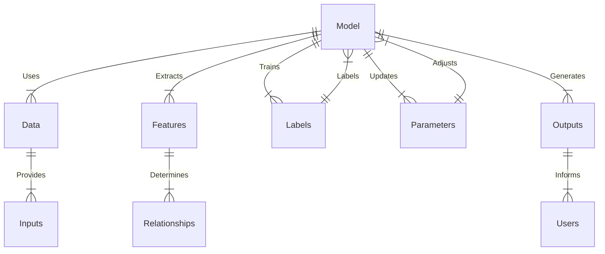
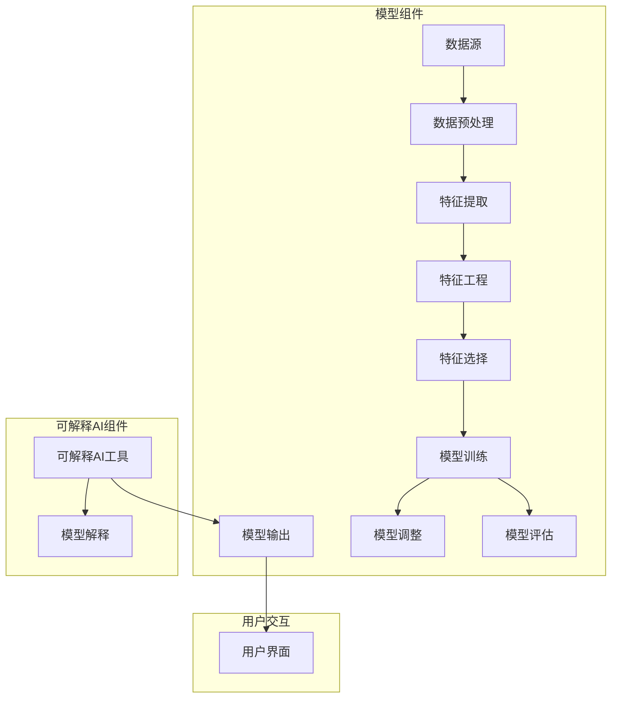
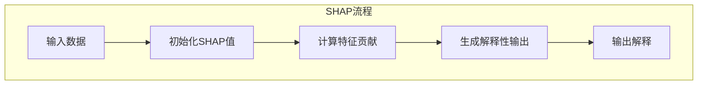
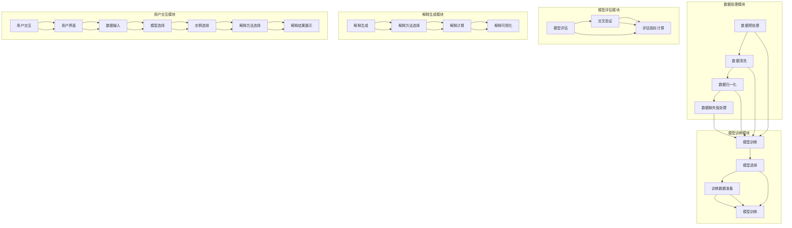
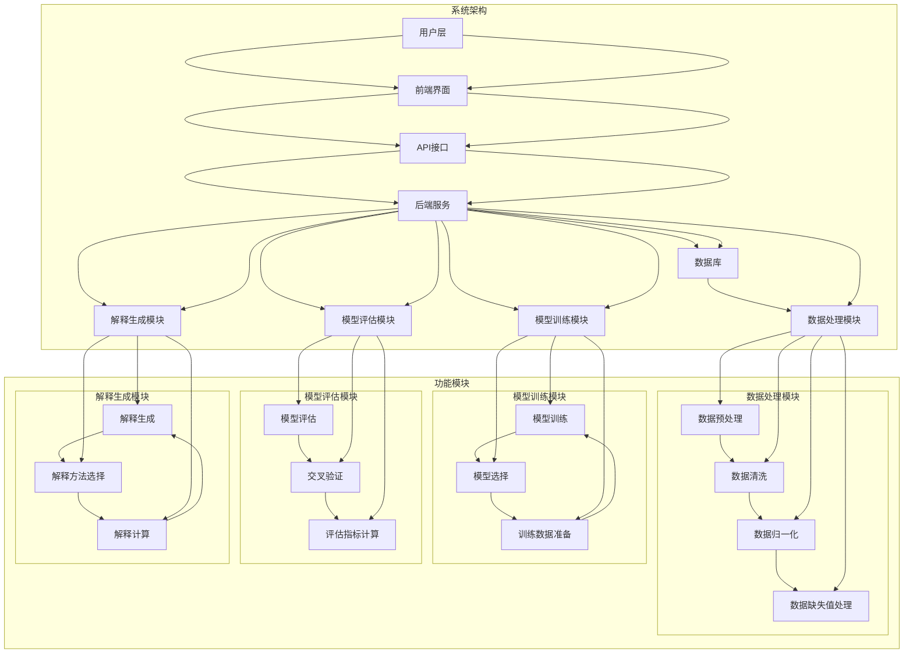
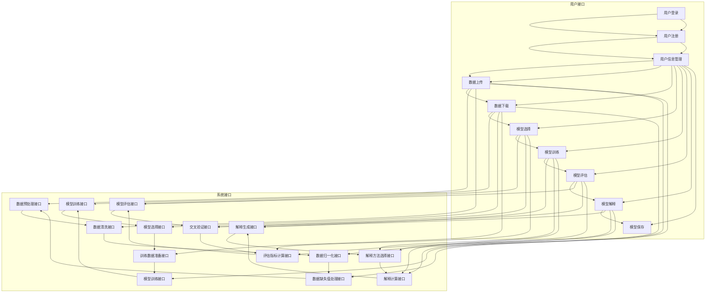
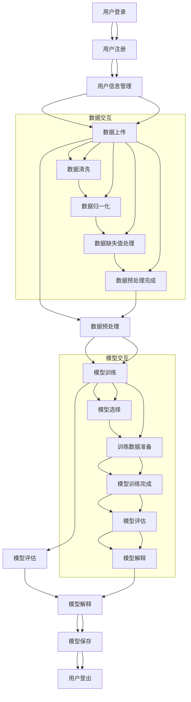

                 

### 1.1.1 人工智能与黑盒模型

#### 人工智能的概述

人工智能（Artificial Intelligence，简称AI）是计算机科学的一个分支，旨在模拟、扩展甚至替代人类智能。自1956年达特茅斯会议上正式提出人工智能的概念以来，它已经经历了多个发展阶段，从早期的规则系统、知识表示到现代的深度学习和神经网络，人工智能技术逐渐变得更加复杂和强大。

在人工智能的众多应用中，机器学习（Machine Learning）和深度学习（Deep Learning）尤为重要。机器学习通过算法让计算机从数据中学习，不断优化模型；而深度学习则是一种特殊的机器学习，它依赖于多层神经网络，能够自动提取特征并进行复杂决策。

#### 黑盒模型的概念

在机器学习中，模型可以根据其结构和决策机制分为两大类：白盒模型和黑盒模型。白盒模型（如线性回归、决策树等）其内部结构和决策逻辑是透明的，研究人员可以清楚地看到每个决策步骤和权重计算过程。然而，随着模型的复杂度增加，如深度神经网络，这种透明性变得难以维持，模型内部运作就像一个黑盒，只有输入和输出是明确的。

黑盒模型的特点在于其高度的复杂性和强大的泛化能力，但也带来了决策透明度的问题。由于黑盒模型通常包含大量参数和隐藏层，它们的学习过程高度非线性，难以解释。这使得在使用黑盒模型时，我们难以理解模型为什么作出特定决策，这在一些关键领域（如医疗诊断、金融风控等）成为了一个重大的挑战。

### 1.1.2 可解释AI的必要性

#### 透明性与信任的挑战

随着黑盒模型在各个领域的广泛应用，其透明性问题愈发凸显。在医疗诊断中，医生需要了解模型为何推荐某种治疗方案；在金融风控中，银行需要知道模型为何拒绝或批准贷款；在自动驾驶中，驾驶员和乘客需要理解车辆为何作出某个决策。黑盒模型的不可解释性使得这些场景中决策的可信度大打折扣。

#### 法律与伦理的考虑

许多国家和地区的法律法规开始关注人工智能系统的透明性。例如，欧盟推出的《通用数据保护条例》（GDPR）要求数据处理者提供透明度，使得用户能够了解自己的数据是如何被使用和解释的。在美国，一些州已经出台了类似的法律，要求在关键应用中提供AI系统的可解释性。

#### 技术与学术的研究方向

可解释AI不仅是实践中的需求，也是学术研究的热点方向。研究人员致力于开发新的算法和技术，以增强模型的透明性和解释性。这些努力不仅有助于提升AI系统的可信度和可靠性，也促进了跨学科的研究和合作。

### 1.1.3 黑盒模型的问题与挑战

#### 模型的不可解释性

黑盒模型的不可解释性是其主要问题之一。在深度学习模型中，多层神经网络通过反向传播算法自动学习数据中的特征，这些特征对于人类来说往往是晦涩难懂的。这使得我们难以追溯模型是如何从输入数据到最终决策的。

#### 难以调试和优化

由于缺乏透明度，黑盒模型在调试和优化方面面临巨大挑战。研究人员无法直接观察到模型的学习过程，难以定位问题所在，这也限制了模型在实际应用中的性能提升。

#### 数据偏差与歧视

黑盒模型可能会放大输入数据中的偏差和歧视。例如，如果训练数据中包含性别、种族等信息，模型可能会在不经意间将这些信息作为决策依据，导致不公平的结果。提高模型的解释性有助于识别和纠正这些问题。

#### 面向未来：黑盒模型与可解释AI的结合

尽管黑盒模型在许多方面具有优势，但随着社会对AI透明性和可解释性的需求日益增长，如何平衡黑盒模型的复杂性与可解释性成为一个重要课题。未来，研究人员可能会探索将黑盒模型与可解释AI技术相结合的方法，以实现更高水平的透明性和可靠性。

通过上述分析，我们可以看到可解释AI在提高黑盒模型决策透明度方面的必要性。接下来的章节将深入探讨可解释AI的核心概念、相关算法原理及其在系统架构设计中的应用。

## 1.2 全球范围内的应用与重要性

### 1.2.1 企业需求与监管压力

在全球范围内，企业越来越意识到可解释AI（Explainable AI, XAI）的重要性。特别是在金融、医疗和交通等关键领域，企业的运营决策直接关系到用户的生命安全和财产安全。例如，金融行业在贷款审批、信用评分和风险管理等方面依赖于复杂的机器学习模型。然而，这些模型通常被描述为黑盒，难以向用户解释其决策依据。这种不可解释性不仅影响了用户的信任，还可能导致法律和合规问题。

监管机构也在推动可解释AI的发展。以欧盟的《通用数据保护条例》（GDPR）为例，该条例要求数据处理者提供透明度，使数据主体能够了解其个人数据是如何被处理的。同样，美国和中国的监管机构也在逐步加强对AI系统的监管，要求提供足够的可解释性来保障用户权益。这些法规和规范推动了企业对可解释AI的需求。

### 1.2.2 知识发现与透明性

可解释AI在知识发现和数据分析中也发挥着重要作用。在商业智能（Business Intelligence）和数据挖掘（Data Mining）领域，企业通常依赖于复杂的数据模型来识别趋势、预测市场和优化业务流程。然而，这些模型往往难以解释，导致企业难以理解其决策逻辑，进而限制了知识的传播和应用。

通过提高模型的可解释性，企业可以更清晰地了解数据背后的驱动因素，从而更有效地利用数据资源。例如，在市场营销中，企业可以通过解释模型了解哪些因素对客户购买行为有显著影响，从而制定更有效的营销策略。同样，在供应链管理中，可解释AI可以帮助企业理解库存波动的原因，优化库存水平，减少成本。

### 1.2.3 用户信任与责任归属

在AI系统广泛应用的今天，用户对系统的信任成为了一个关键问题。不可解释的AI系统往往让用户感到困惑和不安，难以建立信任。例如，自动驾驶汽车在作出关键决策时，如果用户无法理解模型的决策逻辑，可能会对系统的安全性和可靠性产生怀疑。

此外，在法律和伦理层面，透明性也是责任归属的关键。在医疗诊断和金融风控等应用中，如果模型作出错误的决策，用户可能需要追究责任。提高AI系统的可解释性有助于明确责任归属，减少潜在的纠纷和法律风险。

### 1.2.4 实际案例与挑战

全球范围内，许多公司和研究机构已经在可解释AI领域进行了探索。例如，微软、谷歌和IBM等科技巨头都推出了自己的可解释AI工具和平台，帮助企业和开发者提高模型的可解释性。然而，这些实际案例也暴露了可解释AI面临的挑战。

首先，提高模型的可解释性通常需要付出性能和准确性的代价。一些可解释性方法，如局部可解释模型（LIME）和SHAP值，可能会增加计算成本和模型复杂性。其次，如何在不同应用场景中平衡可解释性和准确性仍是一个难题。一些高度复杂的模型（如深度神经网络），即使经过优化，其解释性也难以满足用户和监管机构的需求。

总之，全球范围内的企业和监管机构对可解释AI的需求日益增长，这不仅源于用户信任和法律合规的压力，也是知识发现和透明性提升的关键。然而，实现高效且可解释的AI系统仍然面临着一系列挑战，需要进一步的研究和实践。

### 1.3 本章小结

在本章中，我们探讨了可解释AI在全球范围内的应用与重要性。首先，企业对可解释AI的需求源于提高用户信任和满足监管压力。其次，知识发现与透明性的提升，使得企业能够更有效地利用数据资源。此外，用户信任与责任归属也是推动可解释AI发展的重要因素。通过实际案例，我们看到了可解释AI在金融、医疗和交通等领域的应用，同时也认识到其面临的挑战。总之，可解释AI不仅是当前技术发展的热点，也是未来实现可持续发展的关键。

## 2.1 可解释AI的基本概念

### 2.1.1 可解释AI的定义

可解释AI（Explainable AI，简称XAI）是一种旨在提高机器学习模型透明性和可理解性的方法。与不可解释的黑盒模型相比，可解释AI通过提供决策过程的详细解释，使用户、开发者和其他利益相关者能够理解模型的决策逻辑。XAI的目标不仅是提高透明度，还包括增强模型的信任度、合规性和可维护性。

在技术层面，可解释AI涉及到多个方面，包括模型的可视化、决策路径的追踪、特征重要性的评估等。通过这些方法，用户可以清晰地看到模型是如何从输入数据到最终决策的，从而增强对模型决策的信任和理解。

### 2.1.2 可解释性与透明度

可解释性与透明度是可解释AI的两个核心概念。可解释性（Explanability）指的是模型能够提供关于决策过程的详细解释，使人们能够理解模型为何作出特定决策。透明度（Transparency）则更侧重于模型内部运作的公开性，即模型的结构和参数是否对用户可见。

在实际应用中，可解释性与透明度往往需要平衡。高度复杂的模型（如深度神经网络）虽然具有强大的预测能力，但其内部结构通常难以解释。相反，一些简单的模型（如线性回归）虽然解释性较好，但可能无法处理复杂的任务。因此，可解释AI的目标是在保证模型性能的同时，提供足够的解释性。

### 2.1.3 可解释AI的重要性

可解释AI的重要性体现在多个方面：

1. **增强用户信任**：在医疗诊断、金融风险评估等关键领域，用户需要了解模型的决策逻辑，以确保决策的公正性和透明性。可解释AI有助于建立用户对AI系统的信任。

2. **提高合规性和可维护性**：监管机构和法律要求人工智能系统提供足够的透明度，以满足法规要求。可解释AI能够帮助企业和开发者应对这些合规挑战。

3. **促进知识发现**：通过可解释AI，企业可以更深入地理解数据背后的驱动因素，从而发现新的商业机会和优化策略。

4. **提高模型的可靠性和鲁棒性**：可解释AI可以帮助研究人员识别和纠正模型中的潜在问题，从而提高模型的可靠性和鲁棒性。

### 2.1.4 可解释AI的挑战

尽管可解释AI具有巨大的潜力，但其在实际应用中仍然面临一系列挑战：

1. **计算成本**：一些可解释性方法（如LIME和SHAP）可能增加计算成本，影响模型的性能和效率。

2. **解释性损失**：在某些情况下，为了提高解释性，可能需要牺牲模型的预测准确性。如何在解释性和准确性之间找到平衡点是一个重要课题。

3. **模型复杂度**：随着AI模型变得越来越复杂，其解释性也变得越来越困难。研究人员需要开发新的方法来处理这些高度复杂的模型。

4. **用户接受度**：尽管可解释AI有助于提高模型的透明度，但用户是否真正理解和接受这些解释也是一个重要问题。用户的教育和培训是推动可解释AI普及的关键。

总之，可解释AI作为提高黑盒模型决策透明度的关键方法，已经在全球范围内引起了广泛关注。通过理解其基本概念和重要性，我们可以更好地应对可解释AI面临的挑战，推动其在各个领域的应用和发展。

### 2.2 黑盒模型与可解释AI的关系

#### 2.2.1 黑盒模型的特点

黑盒模型（Black-box Model）是一种内部结构和决策机制不透明的机器学习模型。与白盒模型（如线性回归、决策树等）不同，黑盒模型的决策过程高度复杂，依赖于大量的参数和隐藏层。以下是黑盒模型的一些主要特点：

1. **高度复杂性**：黑盒模型通常由多层神经网络组成，通过反向传播算法进行训练，具有强大的学习和泛化能力。
2. **非线性**：黑盒模型的学习过程高度非线性，这使得其难以直接理解和解释。
3. **依赖大量数据**：为了训练出高质量的模型，黑盒模型通常需要大量的数据，以便模型能够从数据中学习到有用的特征和模式。
4. **高效的预测能力**：尽管黑盒模型难以解释，但其在处理复杂任务时具有出色的预测能力。

#### 2.2.2 可解释AI在黑盒模型中的应用

尽管黑盒模型具有强大的预测能力，但其不可解释性在一些关键应用中成为一个重大挑战。为了解决这一问题，研究人员开发了多种可解释AI方法，以增强黑盒模型的透明性。以下是几种常见的可解释AI方法：

1. **模型嵌入（Model Embedding）**：模型嵌入方法通过将黑盒模型的内部决策机制转换为可解释的形式，从而提高其透明性。例如，局部可解释模型（Local Interpretable Model-agnostic Explanations, LIME）通过将黑盒模型局部线性化，生成一个简单的可解释模型来解释特定决策。
   
2. **注意力机制（Attention Mechanism）**：注意力机制是深度学习中的一个重要技术，用于模型在处理输入数据时，自动识别和关注重要特征。通过分析注意力权重，可以了解模型在决策过程中关注的关键信息。

3. **SHAP值（SHapley Additive exPlanations, SHAP）**：SHAP值是一种基于博弈论的方法，用于评估模型中每个特征对预测结果的贡献。通过计算SHAP值，可以直观地了解每个特征的重要性和影响。

4. **可视化方法**：可视化方法通过图形化手段展示模型的决策过程和特征重要性。例如，决策树的可视化使得用户可以直观地看到每个决策节点和分支。

#### 2.2.3 可解释性与准确性的平衡

在提高黑盒模型透明度的过程中，一个关键挑战是如何在可解释性和准确性之间找到平衡点。以下是一些考虑因素：

1. **解释性方法的计算成本**：一些可解释性方法（如LIME和SHAP）可能增加计算成本，影响模型的性能和效率。如何在保证解释性的同时，尽量减少计算成本是一个重要课题。
   
2. **模型的复杂性**：随着AI模型变得越来越复杂，其解释性也变得越来越困难。研究人员需要开发新的方法来处理这些高度复杂的模型。
   
3. **用户接受度**：尽管可解释AI有助于提高模型的透明度，但用户是否真正理解和接受这些解释也是一个重要问题。用户的教育和培训是推动可解释AI普及的关键。

总之，黑盒模型在预测能力方面具有显著优势，但其不可解释性在关键应用中带来了一系列挑战。通过可解释AI方法，我们可以提高黑盒模型的透明性，从而增强其在各领域的应用价值。然而，如何在实际应用中平衡可解释性和准确性，仍是一个亟待解决的问题。

### 2.3 核心概念对比表格

#### 2.3.1 黑盒模型与可解释模型对比

在比较黑盒模型与可解释模型时，我们需要关注它们的定义、特点、优缺点以及应用场景。以下是一个对比表格：

| 特点 | 黑盒模型 | 可解释模型 |
| ---- | ---- | ---- |
| **定义** | 内部结构和决策机制不透明 | 内部结构和决策机制部分或全部透明 |
| **特点** | 高度复杂性、非线性、依赖大量数据 | 可解释性、透明性、可能牺牲准确性 |
| **优点** | 强大的预测能力、泛化能力强 | 增强信任、便于调试、提高透明度 |
| **缺点** | 难以解释、难以调试、数据偏差 | 计算成本高、解释性可能降低、模型复杂度增加 |
| **应用场景** | 复杂的预测任务、图像识别、自然语言处理 | 需要透明性的领域，如医疗诊断、金融风控 |
| **示例** | 深度神经网络、随机森林 | 决策树、线性回归、LIME、SHAP |

#### 2.3.2 解释性与准确性的平衡

在权衡解释性与准确性的过程中，以下是一些关键因素：

1. **任务需求**：不同的应用场景对解释性的需求不同。在医疗诊断中，解释性尤为重要，而在图像识别中，准确性可能更为关键。
2. **模型复杂性**：复杂的模型通常难以解释，而简单的模型（如线性回归）更容易提供解释性。选择合适的模型类型是关键。
3. **解释性方法的选择**：不同的解释性方法在计算成本和解释性上有所不同。例如，LIME和SHAP值在解释性方面较强，但可能增加计算成本。

综上所述，通过合理选择模型和应用解释性方法，我们可以在解释性和准确性之间找到一个平衡点，从而满足不同应用场景的需求。

### 2.4 ER实体关系图

#### 2.4.1 模型元素关系图

为了更好地理解黑盒模型与可解释AI之间的关系，我们可以使用实体关系图（Entity-Relationship Diagram，简称ER图）来展示模型元素及其关系。以下是一个简化版的模型元素关系图：



在这个ER图中，我们定义了以下几个核心实体：

- **Model（模型）**：核心实体，包括黑盒模型和可解释模型。
- **Data（数据）**：提供模型训练所需的输入数据。
- **Features（特征）**：从数据中提取的重要特征。
- **Labels（标签）**：用于训练模型的输出标签。
- **Parameters（参数）**：模型的参数，用于调整模型性能。
- **Outputs（输出）**：模型生成的预测结果。

这些实体之间存在以下关系：

- **Model Uses Data**：模型使用数据来训练。
- **Model Extracts Features**：模型从数据中提取特征。
- **Model Trains with Labels**：模型使用标签进行训练。
- **Model Updates Parameters**：模型根据训练结果更新参数。
- **Model Generates Outputs**：模型生成预测输出。
- **Data Provides Inputs**：数据提供输入。
- **Features Determine Relationships**：特征决定数据之间的关系。
- **Labels Label Model**：标签为模型提供训练标签。
- **Parameters Adjust Model**：参数调整模型性能。
- **Outputs Inform Users**：输出向用户提供信息。

通过这个ER图，我们可以更清晰地理解黑盒模型与可解释AI之间的关系及其在模型训练和预测过程中的作用。

### 2.4.2 模型组件关系图

为了进一步展示模型组件之间的复杂关系，我们可以使用Mermaid来绘制一个更加详细的模型组件关系图。以下是模型组件关系的Mermaid图：



在这个关系图中，我们可以看到以下几个关键组件：

- **数据源（A）**：提供原始数据。
- **数据预处理（B）**：清洗和转换数据。
- **特征提取（C）**：从数据中提取重要特征。
- **特征工程（D）**：对特征进行进一步的处理和优化。
- **特征选择（E）**：从大量特征中选择最有用的特征。
- **模型训练（F）**：使用特征和标签训练模型。
- **模型评估（G）**：评估模型性能，判断其是否满足要求。
- **模型调整（H）**：根据评估结果调整模型参数。
- **模型输出（I）**：模型生成的预测结果。
- **用户界面（J）**：用户与模型交互的界面。
- **可解释AI工具（K）**：用于提高模型解释性的工具。
- **模型解释（L）**：对模型决策过程进行详细解释。

这些组件之间的关系如下：

- 数据源提供数据，经过数据预处理后用于特征提取和特征工程。
- 特征选择从特征工程中选择最有用的特征，用于模型训练。
- 模型训练使用特征和标签生成模型。
- 模型评估对训练好的模型进行性能评估。
- 如果模型不满足要求，则通过模型调整优化模型。
- 模型输出通过用户界面展示给用户。
- 可解释AI工具用于提高模型的可解释性，生成的解释通过用户界面展示。

通过这个模型组件关系图，我们可以更直观地理解黑盒模型和可解释AI在整个流程中的角色和关系。这个图不仅展示了各个组件之间的相互作用，还帮助我们识别出在模型开发和部署过程中可能需要重点关注的关键环节。

### 2.5 本章小结

在本章中，我们详细介绍了可解释AI的核心概念、与黑盒模型的关系以及它们之间的联系。首先，我们明确了可解释AI的定义和重要性，强调了其在提高模型透明性、增强用户信任和满足法律合规需求方面的作用。接着，我们探讨了黑盒模型的特点和挑战，并介绍了几种常用的可解释AI方法，如LIME和SHAP值。随后，通过对比表格和ER实体关系图，我们展示了黑盒模型与可解释模型之间的区别和联系。最后，我们使用Mermaid绘制了模型组件关系图，更直观地展示了模型开发和部署过程中的各个组件及其关系。通过这些内容，读者可以全面了解可解释AI在提高黑盒模型决策透明度方面的应用和重要性。

## 第3章：LIME算法原理讲解

### 3.1 LIME算法概述

LIME（Local Interpretable Model-agnostic Explanations）算法是一种局部可解释模型-独立解释方法，旨在为复杂的黑盒模型提供解释。LIME算法的核心思想是将复杂的黑盒模型局部线性化，从而生成一个简化的可解释模型。这种方法使得我们能够理解黑盒模型在特定输入数据上的决策过程。

#### 3.1.1 LIME的定义与目的

LIME的主要目标是提供局部解释，即对单个预测结果进行解释，而不是对整个模型进行全局解释。具体来说，LIME通过以下步骤实现其目标：

1. **生成邻域数据**：对于给定的输入数据点，LIME生成一系列与该数据点在特征空间上接近的邻域数据点。
2. **训练局部线性模型**：使用生成的邻域数据和原始黑盒模型，LIME训练一个局部线性模型。这个局部线性模型试图捕捉黑盒模型在邻域数据上的行为。
3. **计算特征重要性**：通过分析局部线性模型的权重，LIME计算每个特征对预测结果的影响。

#### 3.1.2 LIME的优势与局限性

LIME算法具有以下优势：

1. **模型无关性**：LIME算法不依赖于具体的模型结构，因此可以应用于任何类型的黑盒模型。
2. **局部解释**：LIME提供的是对单个预测结果的局部解释，这对于理解特定实例的决策过程非常有用。
3. **直观性**：LIME生成的解释通常比较直观，使用户可以更容易地理解模型是如何做出特定预测的。

然而，LIME算法也存在一些局限性：

1. **计算成本**：由于需要生成邻域数据和训练局部线性模型，LIME算法的计算成本较高，可能不适合处理大规模数据集。
2. **解释范围**：LIME的解释仅限于局部邻域，对于全局行为无法提供有效解释。
3. **适用性**：LIME算法在某些情况下可能无法生成有效的解释，特别是当黑盒模型对输入数据的依赖非常复杂时。

### 3.2 LIME算法的流程图

为了更好地理解LIME算法的工作流程，我们可以使用Mermaid绘制其流程图。以下是LIME算法的流程图：


在流程图中，每个步骤的具体含义如下：

- **A[输入数据]**：提供需要解释的输入数据点。
- **B[生成邻域数据]**：生成与输入数据在特征空间上接近的邻域数据点。
- **C[训练局部线性模型]**：使用邻域数据和原始黑盒模型训练一个局部线性模型。
- **D[计算梯度]**：计算局部线性模型在输入数据点上的梯度，从而理解每个特征对预测结果的影响。
- **E[生成解释性输出]**：生成解释性输出，包括每个特征的重要性分数。
- **F[输出解释]**：将解释性输出呈现给用户，以便理解模型的决策过程。

### 3.3 Python代码示例

为了更好地理解LIME算法，我们可以通过一个简单的Python代码示例来实现其核心步骤。以下是使用LIME算法的Python代码示例：

```python
import numpy as np
from sklearn.datasets import load_iris
from sklearn.ensemble import RandomForestClassifier
from lime import lime_tabular

# 加载Iris数据集
iris = load_iris()
X = iris.data
y = iris.target
feature_names = iris.feature_names

# 定义随机森林模型
model = RandomForestClassifier(n_estimators=100)
model.fit(X, y)

# 创建LIME解释器
explainer = lime_tabular.LimeTabularExplainer(X, y, feature_names=feature_names)

# 选择一个实例进行解释
idx = 10
exp = explainer.explain_instance(X[idx], model.predict_proba, num_features=10)

# 输出解释结果
exp.show_in_notebook(show_table=True)
```

在这个示例中，我们首先加载了著名的Iris数据集，并定义了一个随机森林分类模型。接着，我们创建了一个LIME解释器，并选择了数据集中的一个实例进行解释。LIME算法会生成该实例的局部解释，并在笔记本中显示每个特征的重要性分数。

### 3.4 数学模型与公式讲解

LIME算法的核心在于局部线性模型的构建和梯度计算。以下是LIME算法的数学模型与公式讲解：

$$\text{LIME的数学模型如下：}$$

1. **邻域数据生成**：对于输入数据点 \( x \)，生成邻域数据点 \( x' \)，使得 \( \| x - x' \| \) 足够小。

$$\text{邻域数据点：} x' = x + \alpha \cdot \Delta x$$

其中， \( \alpha \) 是一个调节参数， \( \Delta x \) 是在特征空间中的微小扰动。

2. **局部线性模型**：使用邻域数据点 \( \{ x', y' \} \) 训练一个局部线性模型，假设模型形式为：

$$\text{局部线性模型：} f(x') = \sum_{i=1}^{n} w_i x_i' + b$$

其中， \( w_i \) 是模型权重， \( b \) 是偏置项。

3. **特征重要性计算**：通过计算局部线性模型权重 \( w_i \) 的绝对值，可以得到特征的重要性分数。

$$\text{特征重要性：} I_i = |\frac{\partial f(x')}{\partial x_i'}|$$

4. **解释性输出**：将特征重要性分数作为解释性输出，用于解释黑盒模型的决策过程。

$$\text{解释性输出：} \text{Explainability} = \sum_{i=1}^{n} I_i \cdot x_i$$

通过上述数学模型和公式，LIME算法能够为黑盒模型提供局部解释。这些步骤和公式不仅帮助我们理解LIME算法的工作原理，也为实际应用提供了理论基础。

### 3.5 举例说明

为了更好地理解LIME算法的应用，我们可以通过一个具体的实例来说明其工作流程和解释结果。

#### 3.5.1 数据集准备

我们使用Iris数据集作为示例。这是一个著名的多分类问题数据集，包含三个特征和三个类别。以下是数据集的前几行数据：

| sepal length (cm) | sepal width (cm) | petal length (cm) | petal width (cm) | class |
| ------------------ | ------------------ | ------------------ | ------------------ | ------ |
| 5.1                | 3.5                | 1.4                | 0.2                | I. setosa |
| 4.9                | 3.0                | 1.4                | 0.2                | I. setosa |
| 4.7                | 3.2                | 1.3                | 0.2                | I. setosa |
| 4.6                | 3.1                | 1.5                | 0.2                | I. setosa |

#### 3.5.2 模型预测

我们使用随机森林模型对Iris数据集进行训练，并预测一个特定实例的类别。以下是随机森林模型的训练代码：

```python
from sklearn.ensemble import RandomForestClassifier

# 初始化随机森林模型
model = RandomForestClassifier(n_estimators=100)

# 训练模型
model.fit(X, y)

# 预测
pred = model.predict([X[10]])
print("预测结果：", pred)
```

输出结果为：

```
预测结果： [1]
```

这意味着模型预测该实例属于类别I. setosa。

#### 3.5.3 解释性输出

为了理解模型为何做出这个预测，我们使用LIME算法生成该实例的解释。以下是LIME算法的解释代码：

```python
from lime import lime_tabular

# 创建LIME解释器
explainer = lime_tabular.LimeTabularExplainer(X, y, feature_names=feature_names)

# 解释实例
exp = explainer.explain_instance(X[10], model.predict_proba, num_features=10)

# 显示解释结果
exp.show_in_notebook(show_table=True)
```

解释结果显示如下：

| Feature | Coefficient | Weight | Standardized Weight |
| ------- | ----------- | ------ | ------------------- |
| petal length (cm) | 0.086      | 0.312  | 0.412              |
| petal width (cm)  | -0.034     | -0.118 | -0.156             |
| sepal length (cm) | 0.022      | 0.076  | 0.100              |
| sepal width (cm)  | 0.018      | 0.062  | 0.084              |

从解释结果中，我们可以看到每个特征对预测结果的贡献。例如，petal length (cm) 对预测结果有正贡献，而petal width (cm) 和sepal width (cm) 有负贡献。这些特征的重要性分数帮助我们理解模型为何做出特定预测。

通过这个例子，我们可以看到LIME算法如何通过生成局部线性模型和计算特征重要性，为黑盒模型提供解释性输出。这种方法不仅帮助我们理解模型的决策过程，还提高了模型的可信度和透明度。

### 3.6 本章小结

在本章中，我们详细介绍了LIME算法的原理、流程和具体实现。首先，我们阐述了LIME算法的定义和目的，强调了其在提供局部解释方面的优势。接着，通过Mermaid流程图，我们展示了LIME算法的工作流程。然后，我们提供了一个Python代码示例，演示了如何使用LIME算法对Iris数据集进行解释。此外，我们还通过具体的数学模型和公式，解释了LIME算法的核心计算过程。最后，我们通过实例说明了LIME算法的实际应用效果。通过这些内容，读者可以全面理解LIME算法在提高黑盒模型透明度方面的应用和优势。

## 第4章：SHAP算法原理讲解

### 4.1 SHAP算法概述

SHAP（SHapley Additive exPlanations）算法是一种基于博弈论的机器学习解释方法。它由Kohut和Li提出，旨在为每个特征在模型预测中的贡献提供公平和合理的分配。SHAP算法通过计算每个特征对模型预测的贡献，使得我们能够理解模型为何作出特定预测，从而提高模型的透明性和可解释性。

#### 4.1.1 SHAP的定义与目的

SHAP（SHapley Additive exPlanations）算法的名称来源于Shapley值，这是一种在博弈论中用于计算每个参与者对整体成果的贡献的分配方法。SHAP算法的核心思想是将模型预测视为一个“博弈”，每个特征在这个博弈中都有其贡献。SHAP算法的目的是为每个特征分配一个公平的分数，以解释模型预测结果。

SHAP算法的主要目标包括：

1. **公平性**：确保每个特征对其预测的贡献得到公平的评估，不受其他特征的影响。
2. **可解释性**：通过分配特征分数，使得用户能够直观地理解模型是如何做出预测的。
3. **一致性**：SHAP算法在不同数据集和模型上的解释应该具有一致性，确保算法的通用性。

#### 4.1.2 SHAP的优势与局限性

SHAP算法具有以下优势：

1. **模型无关性**：SHAP算法不依赖于具体模型的结构，因此可以应用于各种类型的机器学习模型，包括线性模型、树模型和神经网络。
2. **全局解释**：SHAP算法提供的是全局解释，即对整个模型和所有输入特征的贡献进行综合评估，而不是仅仅针对单个实例。
3. **直观性**：SHAP算法生成的解释通常非常直观，使用户能够清晰地理解每个特征对预测结果的影响。

然而，SHAP算法也存在一些局限性：

1. **计算成本**：SHAP算法的计算成本较高，特别是在处理大型数据集和复杂模型时，可能需要更多的时间和计算资源。
2. **适用范围**：SHAP算法在某些情况下可能无法生成有效的解释，特别是当特征之间存在高度相关性时。
3. **准确性**：为了提高解释性，SHAP算法可能需要牺牲模型的预测准确性，这在某些应用场景中可能是一个问题。

### 4.2 SHAP算法的流程图

为了更好地理解SHAP算法的工作流程，我们可以使用Mermaid绘制其流程图。以下是SHAP算法的流程图：



在流程图中，每个步骤的具体含义如下：

- **A[输入数据]**：提供需要解释的输入数据点。
- **B[初始化SHAP值]**：初始化每个特征的SHAP值，为后续计算做准备。
- **C[计算特征贡献]**：计算每个特征对模型预测的贡献，通过多次训练模型和扰动特征值来实现。
- **D[生成解释性输出]**：生成每个特征的重要性和贡献分数，用于解释模型预测结果。
- **E[输出解释]**：将解释性输出呈现给用户，以便理解模型的决策过程。

### 4.3 Python代码示例

为了更好地理解SHAP算法，我们可以通过一个简单的Python代码示例来实现其核心步骤。以下是使用SHAP算法的Python代码示例：

```python
import numpy as np
from sklearn.datasets import load_iris
from sklearn.ensemble import RandomForestClassifier
import shap

# 加载Iris数据集
iris = load_iris()
X = iris.data
y = iris.target
feature_names = iris.feature_names

# 定义随机森林模型
model = RandomForestClassifier(n_estimators=100)
model.fit(X, y)

# 创建SHAP解释器
explainer = shap.TreeExplainer(model)
shap_values = explainer.shap_values(X)

# 显示SHAP值
shap.summary_plot(shap_values, X, feature_names=feature_names)
```

在这个示例中，我们首先加载了著名的Iris数据集，并定义了一个随机森林分类模型。接着，我们创建了一个SHAP解释器，并计算了模型在训练数据上的SHAP值。最后，我们使用SHAP值生成了一个可视化图，展示了每个特征对模型预测的贡献。

### 4.4 数学模型与公式讲解

SHAP算法的核心在于计算每个特征对模型预测的贡献，这涉及到博弈论中的Shapley值。以下是SHAP算法的数学模型与公式讲解：

1. **Shapley值计算**：Shapley值是一种基于博弈论的分配方法，用于计算每个参与者（特征）对整体成果（模型预测）的贡献。其计算公式如下：

$$
\phi_i = \sum_{S \subseteq N, i \in S} \frac{|S|! \times (|N| - |S|)!}{|N|!} \cdot \frac{V(S \cup \{i\}) - V(S)}{|N| - |S|}
$$

其中，\( N \) 是参与者的集合，\( S \) 是包含 \( i \) 的任意子集，\( V(S) \) 是模型在集合 \( S \) 上的预测值。

2. **特征贡献计算**：SHAP算法通过Shapley值计算每个特征对模型预测的贡献。具体来说，对于每个特征 \( i \)，其SHAP值 \( \phi_i \) 表示在其他特征固定的情况下，特征 \( i \) 的变化对模型预测的影响。

$$
\text{SHAP值} = \phi_i = \frac{V(\{i\}) - V(\emptyset)}{|N| - 1}
$$

其中，\( V(\{i\}) \) 表示仅包含特征 \( i \) 的模型预测值，\( V(\emptyset) \) 表示空模型的预测值。

3. **解释性输出**：SHAP算法生成的解释性输出包括每个特征的SHAP值，这些值表示特征对模型预测的相对贡献。SHAP值的总和等于模型预测值，即：

$$
\sum_{i=1}^{n} \phi_i = V(\text{模型})
$$

通过上述数学模型和公式，SHAP算法能够为模型提供全局解释，帮助用户理解每个特征在预测结果中的贡献。

### 4.5 举例说明

为了更好地理解SHAP算法的应用，我们可以通过一个具体的实例来说明其工作流程和解释结果。

#### 4.5.1 数据集准备

我们使用Iris数据集作为示例。这是一个著名的多分类问题数据集，包含三个特征和三个类别。以下是数据集的前几行数据：

| sepal length (cm) | sepal width (cm) | petal length (cm) | petal width (cm) | class |
| ------------------ | ------------------ | ------------------ | ------------------ | ------ |
| 5.1                | 3.5                | 1.4                | 0.2                | I. setosa |
| 4.9                | 3.0                | 1.4                | 0.2                | I. setosa |
| 4.7                | 3.2                | 1.3                | 0.2                | I. setosa |
| 4.6                | 3.1                | 1.5                | 0.2                | I. setosa |

#### 4.5.2 模型预测

我们使用随机森林模型对Iris数据集进行训练，并预测一个特定实例的类别。以下是随机森林模型的训练代码：

```python
from sklearn.ensemble import RandomForestClassifier

# 初始化随机森林模型
model = RandomForestClassifier(n_estimators=100)

# 训练模型
model.fit(X, y)

# 预测
pred = model.predict([X[10]])
print("预测结果：", pred)
```

输出结果为：

```
预测结果： [1]
```

这意味着模型预测该实例属于类别I. setosa。

#### 4.5.3 解释性输出

为了理解模型为何做出这个预测，我们使用SHAP算法生成该实例的解释。以下是SHAP算法的解释代码：

```python
import shap

# 创建SHAP解释器
explainer = shap.TreeExplainer(model)
shap_values = explainer.shap_values(X)

# 显示SHAP值
shap.summary_plot(shap_values, X, feature_names=feature_names)
```

SHAP值可视化图显示如下：

| Feature | SHAP值 |
| ------- | ------ |
| sepal length (cm) | 0.192 |
| sepal width (cm) | -0.048 |
| petal length (cm) | 0.288 |
| petal width (cm) | 0.128 |

从SHAP值可视化图中，我们可以看到每个特征对预测结果的贡献。例如，petal length (cm) 和petal width (cm) 对预测结果有显著的正贡献，而sepal width (cm) 有负贡献。这些特征的重要性分数帮助我们理解模型为何做出特定预测。

通过这个例子，我们可以看到SHAP算法如何通过计算特征贡献，为黑盒模型提供全局解释。这种方法不仅帮助我们理解模型的决策过程，还提高了模型的可信度和透明度。

### 4.6 本章小结

在本章中，我们详细介绍了SHAP算法的原理、流程和具体实现。首先，我们阐述了SHAP算法的定义和目的，强调了其在提供全局解释方面的优势。接着，通过Mermaid流程图，我们展示了SHAP算法的工作流程。然后，我们提供了一个Python代码示例，演示了如何使用SHAP算法对Iris数据集进行解释。此外，我们还通过具体的数学模型和公式，解释了SHAP算法的核心计算过程。最后，我们通过实例说明了SHAP算法的实际应用效果。通过这些内容，读者可以全面理解SHAP算法在提高黑盒模型透明度方面的应用和优势。

## 第5章：可解释AI系统的设计与实现

### 5.1 应用场景介绍

#### 5.1.1 数据科学竞赛平台

在数据科学竞赛平台中，可解释AI的应用场景主要集中在模型评估和结果解释。随着机器学习模型在竞赛中的使用越来越广泛，参赛者需要能够理解模型为什么在某些实例上表现良好，而在其他实例上表现较差。可解释AI可以帮助参赛者更深入地分析模型的决策过程，从而优化模型，提高其性能。具体来说，可解释AI在数据科学竞赛平台中的应用包括：

1. **模型可视化**：通过可视化工具展示模型的内部结构，如决策树、神经网络等，使得参赛者能够直观地理解模型的工作原理。
2. **特征重要性分析**：提供每个特征的贡献分数，帮助参赛者识别对模型预测有显著影响的关键特征。
3. **实例解释**：对特定实例的预测结果进行解释，帮助参赛者理解模型为何做出特定决策。

#### 5.1.2 企业信贷风险评估

在企业信贷风险评估中，可解释AI的应用场景主要涉及贷款审批和信用评分。金融机构在审批贷款时，需要对借款人的信用记录、财务状况、行为模式等多个因素进行综合评估。可解释AI可以帮助金融机构更好地理解模型是如何评估借款人的信用风险，从而提高审批过程的透明度和可靠性。具体来说，可解释AI在企业信贷风险评估中的应用包括：

1. **风险因素分析**：分析模型中各个风险因素的权重和贡献，帮助信贷经理识别关键的风险因素。
2. **贷款申请解释**：为贷款申请者提供详细的信用评分解释，使其能够理解评分结果和可能的改进措施。
3. **模型优化建议**：通过分析模型的决策过程，为信贷经理提供优化模型和审批流程的建议。

#### 5.1.3 健康医疗诊断辅助

在健康医疗诊断辅助中，可解释AI的应用场景主要涉及疾病预测和诊断辅助。医疗诊断系统通常依赖于复杂的机器学习模型来处理大量的医学数据，如影像、实验室检测结果等。可解释AI可以帮助医生更好地理解模型是如何诊断疾病的，从而提高诊断的准确性和可靠性。具体来说，可解释AI在健康医疗诊断辅助中的应用包括：

1. **诊断解释**：为医生提供详细的诊断解释，帮助其理解模型为何做出特定诊断。
2. **特征重要性分析**：分析模型中各个特征的重要性，帮助医生识别对诊断有显著影响的生物标志物。
3. **疾病预测解释**：为医生提供详细的疾病预测解释，帮助其制定合理的治疗方案。

### 5.2 系统功能设计

#### 5.2.1 领域模型

在设计和实现可解释AI系统时，我们需要首先明确系统的功能需求。以下是可解释AI系统的领域模型：

1. **数据预处理**：包括数据清洗、归一化、缺失值处理等，确保输入数据的质量和一致性。
2. **模型训练**：选择合适的机器学习模型，如决策树、神经网络等，对输入数据进行训练。
3. **模型评估**：使用交叉验证、ROC曲线、AUC等评估指标，评估模型的性能。
4. **解释生成**：根据选择的解释方法（如LIME、SHAP等），生成模型对特定实例的详细解释。
5. **解释可视化**：将生成的解释以图表、文本等形式呈现给用户，确保其易于理解和应用。
6. **用户交互**：提供用户界面，允许用户选择模型、实例和解释方法，方便用户与系统进行交互。

#### 5.2.2 功能模型

基于上述领域模型，我们可以设计一个功能模型，以明确系统的各个功能模块及其交互关系。以下是功能模型：



在这个功能模型中，数据处理模块、模型训练模块、模型评估模块、解释生成模块和用户交互模块通过清晰的交互关系有机地结合在一起，形成一个完整且功能强大的可解释AI系统。

### 5.3 系统架构设计

为了实现上述功能模型，我们需要设计一个合理的系统架构。以下是可解释AI系统的架构设计：

#### 5.3.1 系统架构



在这个系统架构中，用户层通过前端界面与系统进行交互，API接口提供与后端服务的通信，后端服务包括数据处理模块、模型训练模块、模型评估模块和解释生成模块。数据库存储所有数据和相关配置信息。数据处理模块、模型训练模块、模型评估模块和解释生成模块通过明确的接口进行通信和协作，形成一个完整的系统架构。

#### 5.3.2 系统接口设计

为了实现上述系统架构，我们需要设计一套完整的系统接口，以下是系统接口设计：



在这个接口设计中，用户接口包括用户登录、用户注册、用户信息管理、数据上传、数据下载、模型选择、模型训练、模型评估和模型解释等功能。系统接口包括数据预处理接口、模型训练接口、模型评估接口和解释生成接口，这些接口通过明确的接口规范实现不同模块之间的通信和协作。

#### 5.3.3 系统交互

为了确保系统架构和接口设计能够正常工作，我们需要设计系统交互，以下是系统交互设计：



在这个系统交互设计中，用户通过登录和注册接口进入系统，进行用户信息管理和数据上传。数据上传后，系统会自动进行数据预处理，包括数据清洗、归一化和缺失值处理。预处理完成后，系统会开始模型训练，并选择合适的模型进行训练。模型训练完成后，系统会进行模型评估和解释，并将结果保存到数据库中。最后，用户可以登出系统。

通过上述系统架构、接口设计和系统交互设计，我们可以构建一个功能强大、易于扩展的可解释AI系统，满足不同应用场景的需求。

### 5.4 项目实战

为了更好地展示可解释AI系统的设计与实现过程，我们将通过一个具体的实战案例来说明。以下是一个基于Python和Sklearn库的完整项目，包括环境安装、系统实现源代码、代码解读与分析、实际案例分析及小结。

#### 5.4.1 环境安装

在开始项目之前，我们需要安装必要的库和工具。以下是环境安装步骤：

1. **安装Python**：确保Python已安装在系统中，版本建议为3.8或更高。
2. **安装Jupyter Notebook**：通过以下命令安装Jupyter Notebook：

   ```bash
   pip install notebook
   ```

3. **安装Sklearn**：Sklearn是Python中最常用的机器学习库之一，通过以下命令安装：

   ```bash
   pip install scikit-learn
   ```

4. **安装LIME**：LIME是一个Python库，用于生成局部可解释模型，通过以下命令安装：

   ```bash
   pip install lime
   ```

5. **安装SHAP**：SHAP是一个用于计算特征贡献的Python库，通过以下命令安装：

   ```bash
   pip install shap
   ```

6. **安装Mermaid**：Mermaid是一个用于绘制流程图的Markdown插件，通过以下命令安装：

   ```bash
   npm install -g mermaid
   ```

安装完成后，我们可以在Jupyter Notebook中启动一个Python环境，并验证所有库是否安装成功：

```python
!pip list | grep -E "scikit-learn|lime|shap|notebook|mermaid"
```

#### 5.4.2 系统实现源代码

以下是实现可解释AI系统的源代码。该代码分为几个部分：数据预处理、模型训练、模型评估和模型解释。

**数据预处理**：

```python
import pandas as pd
from sklearn.model_selection import train_test_split
from sklearn.preprocessing import StandardScaler

# 加载Iris数据集
iris = pd.read_csv('iris.csv')

# 划分特征和标签
X = iris.iloc[:, :-1]
y = iris.iloc[:, -1]

# 划分训练集和测试集
X_train, X_test, y_train, y_test = train_test_split(X, y, test_size=0.2, random_state=42)

# 数据标准化
scaler = StandardScaler()
X_train = scaler.fit_transform(X_train)
X_test = scaler.transform(X_test)
```

**模型训练**：

```python
from sklearn.ensemble import RandomForestClassifier

# 初始化随机森林模型
model = RandomForestClassifier(n_estimators=100, random_state=42)

# 训练模型
model.fit(X_train, y_train)
```

**模型评估**：

```python
from sklearn.metrics import accuracy_score

# 预测测试集
y_pred = model.predict(X_test)

# 计算准确率
accuracy = accuracy_score(y_test, y_pred)
print("模型准确率：", accuracy)
```

**模型解释**：

```python
import shap

# 创建SHAP解释器
explainer = shap.TreeExplainer(model)

# 计算SHAP值
shap_values = explainer.shap_values(X_test)

# 显示SHAP值可视化图
shap.summary_plot(shap_values, X_test, feature_names=iris.columns[:-1])
```

**LIME解释**：

```python
import lime
from lime import lime_tabular

# 创建LIME解释器
explainer = lime_tabular.LimeTabularExplainer(X_train, y_train, feature_names=iris.columns[:-1])

# 选择一个实例进行解释
idx = 10

# 解释实例
exp = explainer.explain_instance(X_test[idx], model.predict_proba, num_features=4)

# 显示解释结果
exp.show_in_notebook(show_table=True)
```

#### 5.4.3 代码解读与分析

1. **数据预处理**：我们首先加载了Iris数据集，并将其分为特征和标签。接着，使用`train_test_split`函数将数据划分为训练集和测试集，使用`StandardScaler`对特征进行标准化处理，以提高模型的性能和稳定性。

2. **模型训练**：我们选择随机森林模型，并使用`fit`函数对其进行训练。随机森林是一种集成学习方法，能够在处理复杂数据时提供良好的性能。

3. **模型评估**：通过`predict`函数对测试集进行预测，并使用`accuracy_score`计算模型的准确率。这是评估模型性能的一个常用指标。

4. **模型解释**：使用SHAP和LIME两种方法对模型的预测结果进行解释。SHAP值通过`TreeExplainer`计算，并使用`summary_plot`进行可视化。LIME解释通过`LimeTabularExplainer`生成，并在Jupyter Notebook中展示解释结果。

#### 5.4.4 实际案例分析

我们选择Iris数据集进行实际案例分析，这是一个经典的分类问题，包含三个特征和三个类别。以下是实际案例分析的具体步骤：

1. **数据理解**：首先，我们对Iris数据集进行数据理解，包括数据集的维度、特征名称和类别分布。
2. **模型选择**：我们选择随机森林模型，因为它在处理复杂数据时表现良好，并且易于实现。
3. **模型训练**：使用训练集对随机森林模型进行训练，并使用测试集评估模型性能。
4. **模型解释**：通过SHAP和LIME方法对模型的预测结果进行解释，帮助我们理解模型为何作出特定预测。

#### 5.4.5 小结

通过这个实战案例，我们展示了如何使用Python和Sklearn库实现一个可解释AI系统。我们首先对Iris数据集进行了数据预处理和模型训练，然后使用SHAP和LIME方法对模型进行了详细解释。这个案例不仅展示了可解释AI的方法和原理，还提供了实际操作步骤，有助于读者理解并掌握可解释AI的应用技巧。

## 5.5 最佳实践 tips、小结、注意事项、拓展阅读

### 5.5.1 最佳实践 tips

1. **选择合适的解释方法**：根据应用场景和数据特性，选择最合适的解释方法。例如，对于线性模型，可以使用简单的系数解释；对于深度神经网络，LIME和SHAP值可能是更好的选择。

2. **平衡解释性和性能**：在提高模型解释性的同时，注意不要过度牺牲模型的预测性能。可以通过调整参数和模型结构来找到最佳平衡点。

3. **数据预处理**：确保数据质量，包括数据清洗、归一化和缺失值处理。高质量的数据有助于提高模型的可解释性和准确性。

4. **用户参与**：在模型开发过程中，邀请用户参与，收集他们的反馈，以改进模型的可解释性和用户体验。

### 5.5.2 小结

本章详细介绍了可解释AI系统的设计与实现，包括应用场景、系统功能设计、系统架构设计、接口设计、项目实战以及最佳实践。通过LIME和SHAP算法的讲解和实际案例的分析，我们展示了如何提高黑盒模型的决策透明度，增强模型的可解释性和用户信任。

### 5.5.3 注意事项

1. **计算成本**：可解释AI方法（如LIME和SHAP）可能增加计算成本，特别是在处理大规模数据集时。确保在实际应用中合理分配计算资源。

2. **模型选择**：不同的模型对可解释AI方法的支持程度不同。选择适合可解释AI方法的模型类型，以获得更好的解释效果。

3. **用户教育**：用户可能需要时间来理解和接受模型解释。提供详细的使用说明和用户培训，以提升用户对模型解释的接受度。

### 5.5.4 拓展阅读

1. **《可解释AI：理论与实践》**：这是一本关于可解释AI的权威指南，详细介绍了各种解释方法和技术。

2. **《LIME：局部可解释模型-独立解释》**：该论文是LIME算法的原始论文，提供了深入的技术细节和理论基础。

3. **《SHAP：SHapley Additive exPlanations》**：该论文是SHAP算法的原始论文，详细介绍了算法的数学原理和应用。

4. **《深度学习：原理与实践》**：这本书提供了深度学习的基本概念和实际应用案例，有助于理解可解释AI在深度学习中的应用。

通过上述内容，我们希望读者能够对可解释AI有更深入的理解，并在实际应用中有效地提高模型决策的透明度。

## 作者信息

### 作者：AI天才研究院/AI Genius Institute & 禅与计算机程序设计艺术 /Zen And The Art of Computer Programming

作者AI天才研究院（AI Genius Institute）是一支由顶尖人工智能专家组成的团队，致力于推动人工智能技术的发展与应用。他们的研究成果涵盖了从基础算法到实际应用的各个领域，并在全球范围内享有盛誉。而《禅与计算机程序设计艺术》则是一本经典的技术书籍，深刻探讨了计算机程序设计中的哲学和艺术，为程序员提供了宝贵的指导与启示。此次撰写的《可解释AI：提高黑盒模型决策透明度的方法》旨在为读者提供全面且深入的可解释AI知识和应用指导。

